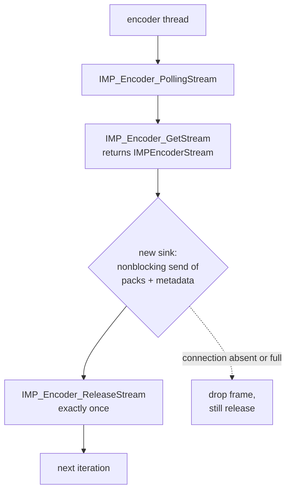
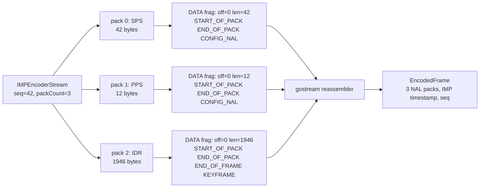

# Deep-Dive Project Report: Direct Frame-Bus Streaming on a Wyze Cam v2

This report documents the design and Phase 1 implementation of a direct encoded-frame transport that removes the two v4l2loopback devices from the Wyze Cam v2 streaming path. It is the successor to the earlier project report, which built and deployed a Go streaming server (`gostream`) that read encoded H.264 and JPEG from those loopback devices. This report explains why those loopback devices are the single largest hidden consumer of the camera's physical memory, where encoded frames actually become available in the existing capture process, and how a shared, host-testable wire protocol lets a C producer and a Go consumer exchange encoded frames without the kernel owning a copy of them. It is written for an engineer who needs to understand the Ingenic IMP encoder output contract, the kernel allocation that the loopback module makes, the decision to use a userspace Unix socket instead of a kernel module, and the protocol codec that was implemented and cross-verified in Phase 1.

The central finding is that the loopback devices are not lightweight descriptors. The live camera's `/proc/vmallocinfo` shows two allocations of 16,592,896 bytes each, which together account for nearly all of the 35,016 KiB `VmallocUsed`. Each allocation is a page-aligned 1920×1080, four-byte-per-pixel, two-buffer backing store. The encoded H.264 and JPEG payloads being transferred are two orders of magnitude smaller than these stores. The second finding is that the existing capture process already holds the encoded frames in userspace, with full packet boundaries, timestamps, sequence numbers, and NAL types, immediately before it writes them to the loopback. The optimal first change is therefore to substitute a new sink at that single point, not to rewrite the sensor, image signal processor, encoder, or kernel.

The architectural decision is to preserve the closed-source Ingenic IMP ownership in the existing `videocapture` C process and replace only its v4l2 output sink with a bounded, nonblocking `AF_UNIX / SOCK_SEQPACKET` frame bus to gostream. Direct CGo binding of libimp and new kernel code are both deferred. libimp already returns encoded frames to userspace, so a userspace transport removes the loopback cost without adding a kernel attack surface or coupling the Go binary to a vendor ABI. The Phase 1 deliverable is the shared, host-testable wire protocol codec, implemented in both C and Go and verified against a single golden-vector set generated by an independent Python implementation.

> [!summary]
> - The two 1080p v4l2loopback devices consume approximately 31.69 MiB of the camera's Linux-managed memory, allocated as two 16,592,896-byte `vmalloc` regions (`1920×1080×4×2 + 4096` each). This is nearly all of the live `VmallocUsed` of 35,016 KiB, and it is an avoidable cost: the encoded H.264 and JPEG payloads are kilobytes, not megabytes.
> - The exact OpenMiko-pinned `ingenic_videocap` source receives complete `IMPEncoderStream` objects in userspace — with `seq`, microsecond `timestamp`, `packCount`, per-pack `virAddr`/`length`, and H.264 NAL type — and then performs a single `write()` to the loopback followed by `IMP_Encoder_ReleaseStream`. The bypass point is that one sink call, not the capture pipeline.
> - Phase 1 implemented the shared wire protocol: a 56-byte big-endian header (magic `OMFB`, version 1) with `<=60 KiB` payload fragments, plus `HELLO`/`DATA`/`CONTROL`/`GOODBYE` message types. The codec exists in C (producer side) and Go (consumer side) and is verified against 29 shared golden vectors (13 accept, 2 valid, 14 reject); the Go fuzz target ran 2.5 million executions with no panics and no over-capacity allocations.
> - The design defers CGo and kernel code by evidence threshold, not by preference. A userspace shared-memory ring is the second option if socket copies are measurably material; kernel code is reconsidered only if both sockets and shared memory fail an explicit requirement.

## 1. Relationship to the earlier report

The earlier report, `PROJECT REPORT - Wyze Cam v2 - Custom Streaming Server on OpenMiko.md`, built and deployed `gostream`: a pure-Go, MIPS soft-float, fully static binary that reads encoded H.264 from `/dev/video3` and JPEG from `/dev/video4`, both v4l2loopback devices fed by the stock `videocapture` process, and serves RTSP on `:8554`, MJPEG and snapshot on `:8080`, and an admin API on `:18081`. That report's Section 16.11 corrected the memory accounting and identified the loopback devices as the dominant hidden consumer, ending with the observation that bypassing v4l2loopback entirely would recover the full 31.7 MiB without changing the IMP hardware pipeline.

This report is the execution of that observation. It opens a new docmgr ticket, `WYZECAM-DIRECT-STREAM`, designs the replacement transport, and implements Phase 1 of that design. The earlier `gostream` remains the consumer; the earlier `videocapture` remains the producer and the sole owner of libimp. What changes is the boundary between them: a kernel-owned loopback device is replaced by a userspace socket carrying a versioned, bounded, metadata-rich message stream.

The two reports are consistent in their evidence conventions. Repository evidence is the OpenMiko and `ingenic_videocap` source mirrored into the ticket. Hardware evidence is the running camera at `192.168.0.55`, read over SSH. Where this report makes a claim about memory or socket limits, it cites the live probe file committed to the ticket, not a recollection.

## 2. The hidden cost, measured from the running camera

The loopback devices are the largest hidden consumer of Linux-managed memory on this camera, and the cost is structural rather than incidental. The live boot command line assigns 96 MiB to Linux, reserves 8 MiB for the image signal processor (`ispmem`), and reserves 24 MiB for video buffers (`rmem`), for a total physical assumption of 128 MiB. Linux reports `MemTotal: 91844 kB` after the kernel reserves 6,944 KiB at boot and returns 484 KiB of init memory. Of that 91,844 KiB, `VmallocUsed` is 35,016 KiB.

The `/proc/vmallocinfo` evidence, committed to the ticket as `sources/2026-08-23-live-memory-evidence.txt`, attributes the `VmallocUsed` value as follows.

| vmalloc category | MiB | Evidence |
|---|---:|---|
| v4l2loopback frame buffers | 31.69 | two 15.82 MiB allocations, caller `0xc0508a1c` inside v4l2loopback loaded at `0xc0506000` |
| kernel module text/data mappings | 1.62 | `module_alloc_update_bounds` entries |
| rtl8189fs dynamic allocations | 0.44 | `_rtw_zvmalloc [8189fs]` entries |
| JFFS2 compression workspaces | 0.34 | `jffs2_zlib_init` / `jffs2_lco_init` |
| zram metadata/buffer | 0.10 | `disksize_store` |
| other ioremap/vmalloc | 0.01 | remaining entry |

The two dominant allocations are 16,592,896 bytes each. That value is not arbitrary:

```
1920 * 1080 * 4 bytes/pixel * 2 buffers + 4096-byte page = 16,592,896 bytes
```

The v4l2loopback source snapshot, committed to the ticket as `sources/v4l2loopback-source-snapshot.c`, computes `imagesize = buffer_size * buffers_number` and allocates it with `vmalloc`; `buffer_size` is `PAGE_ALIGN(pix_format.sizeimage)`. The live module parameter is `max_buffers=2`. Two full-resolution loopback devices are active — `/dev/video3` for H.264 and `/dev/video4` for JPEG — so each receives a two-buffer, four-bytes-per-pixel backing allocation of approximately 15.82 MiB. Together they consume approximately 31.65 MiB from the 96 MiB Linux page pool.

The cost is disproportionate to the payload. The live frame-size probes, committed to the ticket as `sources/2026-08-23-direct-stream-live-probes.txt`, sampled 20 JPEG snapshots and 292 demuxed H.264 access units:

```
jpeg_samples 20 min 100009 median 101187 max 170822
h264_access_units 292 mean_bytes 2970.78 max_bytes 20031
```

An H.264 access unit averages roughly 3 KB and peaks near 20 KB. A JPEG frame averages roughly 100 KB and peaks near 171 KB. The loopback allocates 15.82 MiB per stream as if it needed to hold two full 1080p uncompressed frames. The transport representation is two orders of magnitude larger than the compressed data it carries. Removing the loopback devices recovers approximately 31.69 MiB; the replacement transport needs only enough buffer to hold a few compressed frames.

## 3. Where encoded frames actually live

The decision to defer kernel and CGo work rests on a single fact about the existing capture process: encoded frames are already in userspace before the loopback is touched. The OpenMiko build pins `ingenic_videocap` at commit `f56caf60df55b16f9825e214183b567cd34aaaee`, recorded in the ticket's `sources/openmiko/ingenic_videocap.mk`. The ticket mirrors that exact revision. The frame-producing code is in `src/capture.c`.

Each configured encoder runs in its own thread, created in `src/main.c`. The thread calls `output_v4l2_frames`, which contains the critical loop. The sequence, with line anchors to the pinned source, is:

1. Open the configured loopback device for writing (`capture.c:868`).
2. Set the V4L2 format and stream state.
3. Call `IMP_Encoder_StartRecvPic`.
4. Poll for one stream with `IMP_Encoder_PollingStream`.
5. Get one `IMPEncoderStream` with `IMP_Encoder_GetStream` (`capture.c:980`).
6. Sum every pack length.
7. Write the encoded bytes to the loopback with `write(v4l2_fd, ...)` (`capture.c:999`).
8. Release the IMP stream with `IMP_Encoder_ReleaseStream` (`capture.c:1001`).

The `IMPEncoderStream` structure, defined in `src/include/imp/imp_encoder.h`, carries more information than the loopback path preserves. Each `IMPEncoderPack` has a virtual address (`virAddr`), a length, a microsecond `timestamp`, a `frameEnd` flag, and a `dataType.h264Type` NAL type. The stream has a `packCount` and a `seq` frame sequence number. The current code discards all of this when it concatenates the packs and writes a flat byte stream to the loopback; the Go consumer then has to reparse Annex-B start codes and reconstruct access units heuristically.

The contract that matters for the redesign is the lifetime rule. `IMP_Encoder_GetStream` and `IMP_Encoder_ReleaseStream` must be paired. The encoded bytes are valid only between those two calls. Any transport that touches the bytes must finish before the release, or must copy them into storage it owns. This is the central invariant of the new sink: it must never block indefinitely before the release, and it must never hold a raw `virAddr` pointer across a thread or process boundary.



The implication is that the optimal first change is small. The sensor discovery, the ISP clock, the OSD, the frame source, the encoder channel, the binding, and the rate-control settings all remain. The only code that changes is the body of step 7: the single `write()` to the loopback becomes a sequence of nonblocking `sendmsg` calls that carry the structured metadata. No kernel capture code is needed to obtain the encoded bytes, because the bytes are already obtained.

## 4. Why not CGo and why not a kernel module

The user asked whether kernel code could make sense. The answer, grounded in the evidence above, is that it does not for the first implementation, and it should be reconsidered only if two userspace options both fail a measured requirement.

Direct CGo binding of libimp would move sensor, ISP, and encoder ownership into the Go process. The Go binary is currently pure Go, built with `CGO_ENABLED=0` and `GOARCH=mipsle GOMIPS=softfloat`, fully static, and decoupled from the camera's uClibc. CGo would require the OpenMiko MIPS toolchain, compatible external linking, the proprietary `libimp.so` with its C++ dependencies, and correct handling of pthread behavior, the dynamic loader, and soft-float on this exact firmware. A Go crash would also tear down the ISP and capture state, increasing recovery cost. CGo is a later architectural rewrite, not a first bypass.

A custom kernel module is the option that initially appears to offer the most performance. The evidence shows why it does not, for this requirement. libimp returns encoded virtual addresses to userspace. A kernel module that accepts those bytes would still copy them into a kernel-owned ring before a consumer read them out. That is the same class of allocation being removed. A module becomes zero-copy only if it can reference-count and export the vendor encoder's physical buffers without copying, which requires knowledge of the proprietary IMP driver's buffer lifetime that the public API does not expose. Without that knowledge, the module is a riskier copy with a new ioctl and mmap parser to validate, on a 3.10.14 kernel with no abundance of watchdog margin for experimental failures.

The chosen first implementation is a userspace Unix socket. The producer and consumer are both userspace processes; the socket copies the compressed bytes once into a kernel buffer and once out into the Go process. At the configured 900 kbit/s H.264 cap, that is roughly 112 KB/s, and at observed JPEG sizes, a few MB/s. The copy cost is negligible relative to recovering 31.69 MiB of permanent allocation. A userspace shared-memory ring is the second option, to be built only if the socket prototype fails a measured CPU, latency, drop, or memory threshold. The kernel option is last.

The comparison that drives the decision is not theoretical. It is the recognition that the loopback's cost comes from allocating for an uncompressed representation, while the data being moved is already compressed. The replacement should be sized to the compressed data, and the simplest transport that does that is a bounded socket.

| option | expected loopback recovery | copies after IMP | restart isolation | implementation risk | recommendation |
|---|---:|---:|---|---|---|
| fragmented Unix seqpacket | ~31.69 MiB | kernel + Go receive | strong | low–medium | implement first |
| userspace shared-memory ring | ~31.69 MiB minus fixed ring | one producer copy | strong | medium–high | profile-driven phase 2 |
| CGo / direct libimp | ~31.69 MiB | potentially none before RTP | weak | high | defer |
| new kernel module | unknown minus custom ring | at least one without vendor changes | medium | very high | do not build now |

## 5. The frame-bus protocol v1

The wire protocol is the contract that lets the C producer and the Go consumer agree on every byte without sharing a struct definition. It is a 56-byte big-endian header followed by an optional payload of at most 60 KiB. The transport is `AF_UNIX` with `SOCK_SEQPACKET`, which preserves message boundaries, preserves order within a connection, and delivers each message as all-or-error. The socket path is `/run/gostream/framebus.sock`, created by gostream; each encoder thread opens one connection and sends a `HELLO` before any data.

### 5.1 Why the payload cap is 60 KiB

The 60 KiB cap is required by measured hardware, not chosen for tidiness. The live probe recorded `net.core.wmem_max=163840` on the camera. The sampled maximum JPEG frame was 170,822 bytes, which already exceeds that limit. A protocol that sent one JPEG per message would fail on observed input. A 60 KiB payload cap keeps a single message, with header overhead, comfortably below the 163,840-byte limit, and it turns a 170,822-byte JPEG into three messages. H.264 access units usually fit in one message, but they follow the same fragmentation rules so an unusually large IDR cannot violate the transport.

### 5.2 The header layout

Every message begins with the same 56-byte header.

| offset | size | field | meaning |
|---:|---:|---|---|
| 0 | 4 | magic | ASCII `OMFB` |
| 4 | 1 | version | `1` |
| 5 | 1 | message_type | `1=DATA`, `2=HELLO`, `3=CONTROL`, `4=GOODBYE` |
| 6 | 1 | codec | `1=H264_ANNEXB`, `2=JPEG` |
| 7 | 1 | flags | bit set |
| 8 | 4 | stream_id | IMP encoder channel / logical stream |
| 12 | 4 | frame_seq | `IMPEncoderStream.seq` |
| 16 | 8 | timestamp_us | first pack's IMP microsecond timestamp |
| 24 | 4 | frame_length | sum of all pack lengths for the frame |
| 28 | 2 | pack_index | zero-based pack index |
| 30 | 2 | pack_count | `IMPEncoderStream.packCount` |
| 32 | 4 | pack_length | complete length of this IMP pack |
| 36 | 4 | fragment_offset | offset within this pack |
| 40 | 4 | fragment_length | payload bytes following the header |
| 44 | 2 | width | encoded width |
| 46 | 2 | height | encoded height |
| 48 | 1 | nal_type | IMP H.264 NAL type; zero for JPEG/HELLO |
| 49 | 7 | reserved | zero in v1 |

The flags are a small, defined bit set: `0x01 START_OF_PACK`, `0x02 END_OF_PACK`, `0x04 END_OF_FRAME`, `0x08 KEYFRAME`, `0x10 CONFIG_NAL` for SPS/PPS, and `0x20 DISCONTINUITY`. Any bit outside `0x3F` is rejected.

The header is serialized field by field. Neither implementation casts a packed struct to or from the wire, because alignment and endianness differ across the MIPS producer and the x86-64 host tests. The fields are written and read with explicit big-endian byte operations. The reserved seven bytes are always written zero and rejected if nonzero, which leaves room for a future version to add a connection generation or a checksum without breaking v1 receivers that ignore reserved after a magic-and-version check.

### 5.3 Message types and fragmentation

Four message types exist in v1. A `HELLO` is the first message on a connection and declares the stream ID, codec, and declared resolution; any `DATA` before a `HELLO` closes the connection. A `DATA` message carries one fragment of one pack of one frame. A `CONTROL` message travels from gostream back to the producer on the same connection and carries a one-byte command, currently `REQUEST_IDR` and `PING`. A `GOODBYE` signals a clean shutdown.

Fragmentation is per pack, not per frame. One `IMPEncoderStream` is one logical frame, and each of its packs is fragmented independently. A 170,822-byte one-pack JPEG produces three messages:

```
DATA seq=42 pack=0/1 off=0      len=61440 flags=START_OF_PACK
DATA seq=42 pack=0/1 off=61440  len=61440 flags=0
DATA seq=42 pack=0/1 off=122880 len=47942 flags=END_OF_PACK|END_OF_FRAME
```

An H.264 frame that contains SPS, PPS, and an IDR retains those three pack boundaries and their NAL types. The Go consumer strips the three- or four-byte Annex-B start codes only after a complete pack is assembled; it does not scan a 256 KB arbitrary byte stream. This is the structural improvement over the loopback path: the access-unit and NAL boundaries that the producer already knows are carried on the wire, instead of being reconstructed by the consumer.



### 5.4 Validation order as a contract

The receiver validates every message before it allocates for the payload. The order in which invariants are checked is part of the wire contract, because when several invariants can fail, the first one checked is the error the receiver reports. The C and Go implementations check the DATA invariants in the same order:

```c
if (pack_count == 0)            return PACK_COUNT_ZERO;
if (pack_count > MAX_PACKS)     return PACK_COUNT_BIG;
if (pack_index >= pack_count)   return PACK_INDEX_GE;
if (fragment_length > MAX_FRAGMENT) return OVERSIZE_FRAGMENT;
if (fragment_offset + fragment_length > pack_length) return FRAG_OUTSIDE_PACK;
if (fragment_length != payload_len) return FRAGLEN_MISMATCH;
```

The Go mirror is identical:

```go
case h.PackCount == 0:
    return ErrPackCountZero
case h.PackCount > MaxPacks:
    return ErrPackCountBig
case h.PackIndex >= h.PackCount:
    return ErrPackIndexGE
case h.FragmentLength > MaxFragment:
    return ErrOversizeFragment
case uint64(h.FragmentOffset)+uint64(h.FragmentLength) > uint64(h.PackLength):
    return ErrFragOutsidePack
case int(h.FragmentLength) != payloadLen:
    return ErrFraglenMismatch
```

The `pack_count` and `pack_index` checks precede the `fragment_length` check, so a reject case that mutates only the pack count reports `pack_count_zero` or `pack_index_ge_count`, not `fraglen_mismatch`. The golden vectors are constructed so that each reject case mutates exactly one field and triggers exactly its intended error. This ordering is now the de facto contract; the reassembler built in Phase 3 will rely on the same error tokens for its own diagnostics.

For non-DATA messages, the frame and pack fields must be zero. Only `CONTROL` may carry a payload; a `HELLO` or `GOODBYE` with a nonzero `fragment_length` is rejected as `control_packfields_nonzero`. This keeps the header-level validator strict about what each message type is allowed to carry, which matters because the receiver trusts the message type before it trusts the payload.

## 6. The shared golden-vector method

A binary contract shared by two languages can be wrong in both at once if both implementations share a bug. The project avoids this by generating the committed golden vectors with a third, independent implementation. The authoring tool is `framebus/golden/gen_vectors.py`, a Python script that encodes the 56-byte header with `struct.pack_into` and writes a text file of cases. The C and Go test suites do not depend on the Python; they depend only on the committed `vectors.txt`. The Python is an authoring tool, run once to produce the file and re-run only if the wire format changes.

The golden file defines three kinds of case. An `accept` case is a validation-legal message that must both round-trip (encode of the fields equals the hex, decode of the hex equals the fields) and pass validation. A `valid` case is a round-trip-only fixture for edge field values that are not legal messages, such as a header with every field set to its maximum. A `reject` case is a malformed message that must fail validation with a specific error token.

The distinction between `accept` and `valid` exists because the validation invariants interact. The `fraglen_mismatch` invariant requires that `fragment_length` equals the actual payload length, so a DATA case with a nonzero `fragment_length` must carry a matching payload to pass validation. A fixture that sets every field to its maximum — `pack_index=0xFFFF`, `pack_count=64`, `fragment_length=61440` — is not a legal message because `pack_index >= pack_count`, so it is a `valid` case that only round-trips. The `accept` cases carry their payloads through a compact `payload_zero=N` directive, which the test harnesses expand to `N` zero bytes, so the committed file stays small while still exercising the full validate path.

The committed `vectors.txt` contains 29 cases: 13 `accept`, 2 `valid`, and 14 `reject`. The accept cases cover the three-fragment JPEG, a three-pack H.264 access unit (SPS, PPS, IDR), both HELLO codecs, both control commands, a goodbye, and two boundary cases (`fragment_length` exactly at the 60 KiB cap, and `pack_count` exactly at the 64 maximum with `pack_index` at 63). The reject cases cover a short message, bad magic, bad version, bad message type, bad codec, an oversize fragment, a fragment-length mismatch, a pack index at or beyond the count, a zero pack count, an over-limit pack count, a fragment range outside the pack, a nonzero reserved field, an unknown flag bit, and a control message with nonzero pack fields.

The choice to make the generator a third implementation, and to add independent endianness anchor tests in both C and Go that do not read the golden file, is the defense against a systematic encoder bug shared by both codecs. Round-trip self-consistency cannot catch a bug present in both the encoder and the decoder. An independent generator, plus anchors that assert specific byte positions for `stream_id`, `width`, and `timestamp`, can.

## 7. The C codec and the Go codec

The codec is implemented twice, once for the producer and once for the consumer, against the same golden file.

### 7.1 The C codec

The C codec lives in `framebus/c/framebus_protocol.{h,c}`. It is the code that will be added to the `ingenic_videocap` fork in Phase 2. The header defines the constants (`FB_MAGIC`, `FB_VERSION`, `FB_HEADER_SIZE`, `FB_MAX_FRAGMENT`, `FB_MAX_PACKS`), the message types, the codecs, the flags, the control commands, the `fb_header` struct, the `fb_err` enum, and the three functions `fb_encode_header`, `fb_decode_header`, `fb_validate`, and `fb_decode_message`.

The implementation uses explicit byte operations for endianness safety. A 32-bit field is written as four bytes with shifts, and read back the same way. The `fb_err_str` function maps each error code to a string, and those strings match the golden `expect_error` tokens exactly: `short`, `bad_magic`, `bad_version`, `bad_msgtype`, `bad_codec`, `oversize_fragment`, `fraglen_mismatch`, `pack_index_ge_count`, `pack_count_zero`, `pack_count_too_big`, `frag_outside_pack`, `reserved_nonzero`, `unknown_flag`, and `control_packfields_nonzero`. This matters because the test harness compares the produced error string to the expected token, so a typo in either the C or the Go string is a test failure.

The host test harness is `framebus/c/tests/test_protocol.c`. It parses `vectors.txt` with a small line-oriented reader, builds a `tcase` per case, and for each accept and valid case asserts that `encode(fields) == hex`, that `decode(hex) == fields`, and, for accept cases, that `decode_message(header + payload) == FB_OK`. For each reject case it asserts that `decode_message` fails and that `fb_err_str` of the result equals the `expect_error` token. It also runs the independent endianness anchors: the magic bytes `4F 4D 46 42`, the version byte `01`, big-endian `stream_id` of 1 as `00 00 00 01`, big-endian `width` `0x0102` as `01 02`, and an eight-byte `timestamp_us` of `0x0102030405060708` written most-significant-byte-first. The build is `cc -std=c99 -Wall -Wextra -Werror -O2`.

The C results are 29 cases, 166 checks, 0 failures.

### 7.2 The Go codec

The Go codec lives in `gostream/internal/framebus/protocol.go`. It is the code that gostream will use to receive the frame bus in Phase 3. It uses `encoding/binary` for the big-endian conversions, which makes the endianness obviously correct. The `ErrorCode` type is a string whose `Error()` method returns the token, so `errors.As` in the test can compare it to the golden `expect_error`.

The test file `protocol_test.go` parses the same `vectors.txt` and runs the same accept, valid, and reject checks. The reject branch uses `errors.As(err, &code)` to confirm the error is an `ErrorCode` and then compares its string to the expected token. The fuzz file `fuzz_test.go` defines `FuzzDecodeMessage`, seeded with empty input, short inputs, a full max-size message, an all-`0xFF` message, and every golden vector. The fuzz function calls `DecodeMessage` and asserts that any accepted message has a payload within `MaxFragment` and, for DATA, a pack count within bounds.

The fuzz target ran 2,504,363 executions over 20 seconds with no panics and no failing inputs. Every accepted input respected the payload cap. A separate allocation-bound test pins `DecodeMessage` to a small constant number of allocations and `Validate` to zero allocations, which confirms that decoding an arbitrary input never allocates a buffer sized by untrusted input. This is the Phase 1 exit criterion: malformed inputs never allocate beyond caps or panic.

The whole module still builds, including the existing capture, RTSP, HTTP, and config packages, and the MIPS soft-float cross-build (`GOOS=linux GOARCH=mipsle GOMIPS=softfloat CGO_ENABLED=0 go build ./...`) succeeds. The new package does not change the deployed binary yet; it is the foundation for Phase 3.

## 8. Cross-verification and the commits

The two implementations agree because they are both checked against the same file. The C suite and the Go suite run independently; neither generates the other's expected output. The agreement is structural: every accept case's hex is produced by the Python generator and consumed by both; every reject case's error token is produced by both codecs' validators.

The work was committed in focused increments, with a diary entry per the diary skill.

| commit | content |
|---|---|
| `7c01826` | design doc, diary, evidence, and source mirrors for `WYZECAM-DIRECT-STREAM` |
| `b4572dc` | C protocol codec and golden vectors (Phase 1) |
| `a50c6d5` | Go protocol codec, golden-vector tests, and fuzz (Phase 1) |
| `78b9e68` | framebus README documenting the shared protocol and tests |
| `95ad33c` | diary Step 3 recording the Phase 1 implementation |

The diary, the design doc, and the ticket index were updated through docmgr: files were related with absolute paths and reasons, the changelog records the phase, and `docmgr doctor` reports all checks passed.

## 9. Decision records

The design records six decisions, each grounded in the evidence above. They are stated here in compact form because a future reader may otherwise re-litigate them.

**Preserve libimp ownership in `videocapture`.** The working capture process already handles sensor, ISP, OSD, binding, encoding, tuning, and cleanup. Moving this into Go would couple a proprietary C ABI to the Go runtime and toolchain. The decision is to keep `videocapture` as the sole libimp owner and replace only its output sink. The consequence is that an IPC contract is required and one compressed-data copy is accepted.

**Use fragmented Unix sequenced packets first.** Frame boundaries, restart isolation, bidirectional control, and bounded backpressure are required on Linux 3.10. One-message-per-frame seqpacket was invalidated by the observed 170,822-byte JPEG exceeding the 163,840-byte `wmem_max`. The decision is to use 60 KiB fragments. The consequence is that the receiver needs bounded reassembly and must discard incomplete frames.

**Drop instead of block.** IMP stream buffers must be released promptly; a slow consumer cannot stall hardware capture. The decision is that all producer sends are nonblocking and any blocked logical frame is abandoned and released. The consequence is that sequence gaps are expected under overload and H.264 recovery must wait for an IDR.

**Preserve IMP pack boundaries and timestamps.** The loopback path discards metadata and forces heuristic Annex-B parsing and wall-clock timestamps. The decision is to carry the stream sequence, timestamp, pack count and index, NAL type, and explicit lengths on the wire. The consequence is a more detailed protocol, but access-unit reconstruction and RTP timing become deterministic.

**Do not write kernel code for Phase 1.** The user asked whether kernel code could make sense. The decision is to try bounded sockets, then bounded shared memory if measurements require it, and to reconsider kernel work only if both fail a documented requirement. The rationale is that encoded frames are already in userspace, so a module cannot become zero-copy without proprietary buffer-lifetime integration and otherwise only moves a userspace copy into a riskier kernel ring.

**Keep external endpoints stable.** RTSP, MJPEG, snapshot, and health are already deployed and validated. The decision is to keep the external URLs and serving libraries and replace only the capture source. The consequence is that the Go server stays near its 9 MiB resident set and the optimization can be A/B-validated against the loopback baseline.

## 10. Backpressure and lifecycle

The protocol defines what happens when the consumer is slow or absent, and what happens when either process restarts. These rules are part of the design, recorded here because they shape the Phase 3 reassembler.

The producer must never wait for gostream. For every obtained IMP stream, it tries to send every fragment nonblocking. If any send returns `EAGAIN`, `ENOBUFS`, `EPIPE`, `ECONNRESET`, or a short result, it stops sending that frame, increments a transport-drop counter, and releases the IMP stream. It closes and reconnects only for connection errors, not for ordinary `EAGAIN`. Already-sent fragments of a failed frame may arrive; the receiver discards that frame when it sees a sequence change before completion.

The consumer keeps one in-progress frame per stream. If a new sequence arrives before the current frame is complete, it discards the incomplete frame, increments an incomplete-frame counter, marks H.264 as waiting for a keyframe if any video data was lost, issues a rate-limited `REQUEST_IDR`, and resumes at the new sequence. The RTSP publisher does not emit partial or non-key H.264 data after a discontinuity; it waits for SPS, PPS, and an IDR, which prevents the `non-existing PPS` and `decode_slice_header` errors observed in the earlier loopback prototypes.

If gostream is absent or restarts, the capture process continues to poll, get, and release IMP frames, drops frames while disconnected, and reconnects with bounded exponential backoff. If the capture process restarts, gostream keeps listening, marks the stream stale, and accepts a new generation only after a valid `HELLO`. Neither restart tears down the other's state. This is the property that a direct pointer or an inherited anonymous pipe cannot provide, and it is the reason a named local socket is the transport rather than an in-process channel.

## 11. Timestamps, sequences, and IDR behavior

The direct path improves timing as well as memory. The timestamp source is `IMPEncoderPack.timestamp`, in microseconds, from the first pack in the frame. The RTP clock for H.264 is 90 kHz, so the conversion is:

```
rtp_delta = (imp_timestamp_us - first_imp_timestamp_us) * 90000 / 1000000
          = delta_us * 90 / 1000
rtp_timestamp = random_start + uint32(rtp_delta)
```

The earlier gostream code computed this scale incorrectly — `microseconds * 90 / 1000000` rather than `microseconds * 90 / 1000`, a 1000-fold error. The direct path carries the real IMP timestamp, so the conversion can be corrected at the same time the capture source is replaced.

The frame sequence, `IMPEncoderStream.seq`, detects encoder drops, transport drops, and producer restarts. A sequence gap is observable rather than automatically fatal; for H.264 it triggers wait-for-keyframe and a rate-limited IDR request. The IMP NAL type identifies SPS (7), PPS (8), and IDR (5); gostream caches complete SPS and PPS and initializes the gortsplib stream only after both are present, which keeps `sprop-parameter-sets` in the SDP valid. An IDR is requested after a connection or reconnection, after a sequence gap or incomplete frame, on the first RTSP `PLAY` when no recent keyframe is cached, and after a producer generation change. Requests are rate-limited to at most one per second per stream.

## 12. Current status and implementation inventory

The project is at the end of Phase 1. The design is complete and committed. The shared wire protocol codec is implemented in C and Go, cross-verified against 29 golden vectors, and fuzzed. The existing gostream binary and the existing `videocapture` binary are unchanged; the new code is foundational and not yet wired into either process.

The docmgr ticket `WYZECAM-DIRECT-STREAM` contains:

- a 1,415-line design document at `design-doc/01-optimal-direct-frame-streaming-architecture-for-wyze-cam-v2.md` covering the executive summary, scope, evidence, current-state architecture, gap analysis, six options considered, the proposed architecture, the wire protocol, backpressure, timestamps, the C and Go designs, the memory and CPU budget, security, deployment and rollback, the seven-phase implementation plan, the test and acceptance strategy, six decision records, risks, the conditions that would justify kernel work later, open questions, and a file-level implementation map;
- an investigation diary at `reference/01-investigation-diary.md` with three steps: ticket creation and bypass-point location, IPC constraint measurement and architecture selection, and the Phase 1 codec implementation;
- a reproducible source-fetch script at `scripts/01-fetch-reference-sources.sh` that mirrors the pinned `ingenic_videocap` revision and the OpenMiko reference files;
- live evidence at `sources/2026-08-23-direct-stream-live-probes.txt` (socket limits and frame sizes) and `sources/2026-08-23-live-memory-evidence.txt` (the vmalloc attribution);
- the frame-bus codec at `framebus/c/` (C) and `gostream/internal/framebus/` (Go), with golden vectors at `framebus/golden/vectors.txt`.

The external interfaces remain as deployed: `rtsp://192.168.0.55:8554/cam0`, `http://192.168.0.55:8080/stream`, `http://192.168.0.55:8080/snapshot`, and `http://192.168.0.55:18081/healthz`. The image path remains 1920×1080, 25 fps, hardware H.264 with the existing 900 kbit/s VBR cap and QP and GOP settings.

## 13. Open questions and next steps

The Phase 1 exit criterion is met: C-generated golden frames decode in Go, and malformed inputs never allocate beyond caps or panic. The remaining questions are the ones that require the camera or the MIPS toolchain to answer.

**On-camera seqpacket behavior.** The design assumes `SOCK_SEQPACKET` accept, send, and receive work correctly on this 3.10.14 kernel under sustained three-fragment JPEG at 25 fps. A small on-camera probe must confirm this before the capture code changes. If seqpacket is unavailable, the same 56-byte protocol can run over a nonblocking stream socket with an explicit bounded pending-frame state machine; the wire format does not depend on the socket type.

**Maximum frame sizes over varied scenes.** The 512 KiB H.264 and 2 MiB JPEG hard caps are initial values justified by the live samples, but the samples cover only one scene. Longer captures in daylight, motion, low light, and night mode will fix the production caps.

**IMP timestamp and IDR thread affinity.** Whether all packs in one `IMPEncoderStream` share a timestamp, whether timestamps are monotonic across long runs, and whether `IMP_Encoder_RequestIDR` is safe to call from the encoder producer thread between get and release are questions for the camera, not for the host.

**SPS/PPS refresh in gortsplib.** Whether gortsplib can refresh the SDP in place when SPS or PPS changes, or whether the server stream must be recreated, determines the recovery path for a configuration change. The initial migration does not change encoder dimensions or profile, so this should be rare.

**Capture-source licensing.** The pinned `ingenic_videocap` repository exposes no obvious license file at the pinned revision, and `t20-rtspd` notes unclear licensing for its original code. Local experimentation can proceed, but the licensing must be determined before a forked binary is distributed.

The next phases are sequenced by risk. Phase 2 adds the nonblocking C frame sink to the `ingenic_videocap` fork, with connect, HELLO, reconnect, send, and control, and guarantees exactly-one `IMP_Encoder_ReleaseStream` in every post-get path; it requires the OpenMiko MIPS Buildroot toolchain and on-camera testing. Phase 3 implements the gostream frame-bus listener, HELLO validation, the bounded reassembler, the structured H.264 and JPEG frame types, the corrected RTP timestamp scaling, and the JPEG latest-frame hub, replacing the V4L2 capture loop. Phase 4 removes the loopback devices from the direct boot path and verifies the vmalloc recovery on the running camera. Phase 5 is the reliability and memory acceptance: the 30-minute functional gate, the 24-hour soak, and the before-and-after memory comparison. A userspace shared-memory ring is Phase 7, only if Phase 5 shows that socket copies are material.

The key points to internalize:

- The loopback cost is an allocation for an uncompressed representation of data that is already compressed; the fix is to size the transport to the compressed data.
- The encoded frames are already in userspace before the loopback is touched, so the bypass is one sink substitution, not a capture rewrite.
- A shared golden file generated by a third implementation is the defense against a binary contract that is wrong in both languages at once.
- Validation order is part of the wire contract; the first invariant checked is the error reported, and each reject case mutates exactly one field.
- CGo and kernel work are deferred by evidence threshold, not by preference, and the threshold is a measured failure of a userspace transport under target load.

## Related notes

- [[PROJECT REPORT - Wyze Cam v2 - Custom Streaming Server on OpenMiko]] — the predecessor report that built and deployed `gostream` on the v4l2loopback path and identified the 31.7 MiB loopback cost this report removes.
