# AKASO DLP Pico Projector — Anatomy of an Android DLP Projector and Its Control Surface

This note records what the AKASO WT50 class of DLP pico projector actually is, down to the components a developer must understand to build software that runs on it. It covers the optical engine, the Android host, the vendor control stack that owns projection geometry, the application layer that ships on the device, and the channels a third-party program can legitimately use to reach the projection hardware. The reference project is the AKASO-DLP-APP ticket at `/home/manuel/code/wesen/2026-08-24--akaso-lcd-projector`, whose `sources/` directory contains the official WT50 manual and a clone of the `Hen-Dricks/HY300-Ultimate` reverse-engineering study of the near-identical MagCubic HY300 projector.

The target reader is an engineer who can write Android and wants to ship a program on this device without bracing the firmware. No prior knowledge of DLP optics or Rockchip boot is assumed.

> [!summary]
> - The AKASO WT50 is a self-contained Android computer with a DLP projector attached; its single HDMI port is **input only**, so the only way to own the projected experience is to run a program on the device itself.
> - Three layers compose the system: the Texas Instruments DLP optical engine, a Rockchip Android host with a vendor overlay, and an application layer built around an OEM launcher and the EShare casting system.
> - The projection geometry (keystone, autofocus) is owned by vendor services reached through a JNI bridge called ProjectUtils and configured through Android system properties; a third-party program does not touch the DMD directly.
> - A program reaches the hardware through four legitimate channels: system properties, OEM settings intents, the Android media APIs, and the EShare client protocol — and must avoid deleting the OEM packages that own the hardware.

## Why this note exists

A pico projector of this class is cheap, battery-powered, and shipped with a locked-down but Android-based experience. The hardware is interesting on its own — a Texas Instruments digital micromirror device driven by a Rockchip SoC — but the durable knowledge is in how the Android side exposes the projection hardware to software. That exposure is not a documented SDK. It is a JNI bridge to a vendor library, a set of system properties, an OEM launcher that bundles hardware controls, and a casting system whose server is version-pinned. This note preserves that control surface so a future program does not have to re-derive it.

The analysis rests on two evidence sources. The first is the official AKASO WT50 user manual, downloaded to `sources/akaso-wt50-usermanual.pdf` and extracted to `sources/akaso-wt50-usermanual.txt`. The second is the HY300-Ultimate repository, a six-volume bilingual reverse-engineering study of the MagCubic HY300 projector (Rockchip RK3326, Android), cloned to `sources/hy300-ultimate/`. The WT50 and HY300 share optics, form factor, and OEM behavior; the HY300 study is the closest thing to a datasheet for the Android side of this device family.

## What the device actually is

The WT50 is a pico projector: small, light, battery-powered, with a single 0.3-inch DLP panel and an RGB LED light source. The official manual fixes its specifications precisely.

| Attribute | Value | Source |
| --- | --- | --- |
| Projection technology | DLP, 0.3" DMD | manual, Specifications |
| Light source | RGB LED, OSRAM Q6, ≤30000 h | manual |
| Brightness | 50 ANSI lumens | manual |
| Native resolution | WVGA 854×480 (accepts 1080p input) | manual |
| Contrast | 1000:1 | manual |
| Throw ratio | 1.19:1, 30–120", 1–5 m | manual |
| Keystone | automatic, vertical ±40° | manual |
| Operating system | Android 7.1.2 (manual) / Android 9.0 (2025 batch) | manual + gagadget review |
| Battery | 5000 mAh, ~2 h | manual |
| Wi-Fi | 2.4 / 5 GHz | manual |
| HDMI | 1. HDMI 1.4 **input** | manual, Interface |
| USB | 2× USB 2.0 | manual |
| Storage | microSD, max 32 GB | manual |
| Control | IR + 2.4 GHz wireless + touch | manual |
| Screen mirror | AirPlay / WifiDisplay (Miracast) / EShare | manual, System Parameters |

The single fact that determines the rest of the architecture is the HDMI row. The HDMI port is an **input**. The projector does not accept a video signal from an external source as its primary mode; it generates the signal internally from its own Android system. A "custom app for the projector" therefore means an Android program running on the projector, not a program running on a laptop that sends frames over a cable.

Two operating-system revisions exist for the same model name. The manual that ships with the device states Android 7.1.2. A 2025 review unit runs Android 9.0 with identical optics. These are two hardware/firmware batches. The Android 9.0 batch is almost certainly built on the Rockchip RK3326 SoC — the same SoC the HY300 study documents — because RK3326 is the standard low-cost Android TV box chip of that era. The older 7.1.2 batch is Rockchip-class as well; the related AKASO P8 projector used the RK3128 SoC with Android 4.4. A program that targets both batches should set `minSdkVersion 24` (Android 7.0) and `compileSdkVersion 28` (Android 9) so one artifact runs on either.

## The optical engine

A DLP projector forms an image by reflecting light off a chip whose surface is an array of microscopic mirrors. Each mirror tilts toward or away from the light source, and the eye integrates the rapid switching into a grayscale pixel. Color comes from a sequential RGB LED and a color wheel or, in pico projectors, time-sequenced LED illumination. The component that holds the mirrors is the Digital Micromirror Device, or DMD. A 0.3-inch DMD is the pico class: small, low power, and limited to modest resolution.

A complete DLP display subsystem is a three-chipset, not a single DMD. Texas Instruments defines the families, and the WT50's 0.3-inch WVGA panel fixes which family is relevant.

| Component | Role | WT50 candidate |
| --- | --- | --- |
| DMD | the mirror array that forms the image | `DLP3000` (0.30" WVGA, 854×480) |
| DLPC display controller | converts the video stream into DMD drive signals | `DLPC2607` (low-power, battery, 0.3" WVGA) |
| DLPA PMIC / LED driver | powers the LED and manages DMD power | `DLPA2005` / `DLPA3000` |

The `DLP3000` is the 0.30-inch WVGA part; its native resolution matches the WT50's 854×480 exactly. The `DLPC2607` is the low-power controller Texas Instruments specifies for battery-powered 0.3-inch WVGA and 0.2-inch nHD displays. A higher-resolution sibling, the `DLP3010` (0.30-inch, 1280×720), pairs with the `DLPC3433` or `DLPC3438` controller and the `DLPA2005` PMIC, and appears in 720p-class pico projectors. The WT50's native WVGA panel rules the 720p parts out for this device.

```mermaid
flowchart LR
    AP[App processor<br/>RK3326] -- "video (parallel / MIPI)" --> DLPC[DLPC controller<br/>DLPC2607]
    DLPC -- "DMD drive signals" --> DMD[DMD<br/>DLP3000 0.3&quot; WVGA]
    DLPA[DLPA PMIC<br/>DLPA2005] -- "LED power + DMD power" --> DMD
    DMD --> OPT[Optics] --> SCR[Projected image]
    DLPC <-. "status / temp / LED feedback" .-> DLPA
    style DMD fill:#3a2d1a,stroke:#a3843f
    style DLPC fill:#1a3a5c,stroke:#3a7cbd
    style DLPA fill:#3a1a3a,stroke:#a33a8a
```



What this means for a program is a constraint, not an API. The program never addresses the DMD, the DLPC controller, or the PMIC. It renders to a standard Android surface — a `SurfaceView`, a `MediaCodec` output surface, or the whole display through `MediaProjection`. The Android compositor, SurfaceFlinger, hands the composed frame to the Rockchip display driver, which feeds the DLPC controller, which drives the DMD. The only optical concerns that reach the program are resolution (render at 854×480 to avoid scaling artifacts), orientation and keystone (managed by vendor services, not the program), and brightness (fixed by the LED, with no program-facing API).

## The Android host

The WT50 is a Rockchip-based Android device. Its application processor is an SoC from the RK3326 family on the Android 9.0 batch. The HY300 study treats the same SoC in full, and its findings transfer with high confidence because the two devices share OEM behavior and component inventory.

### The boot chain

Rockchip devices boot through a fixed sequence of stages. Each stage loads and verifies the next.


The BootROM is mask-programmed into the SoC and cannot be changed. It loads the next stage from eMMC, or from USB when the device is held in MaskRom or Loader mode — the recovery entry points the HY300 study documents in its sixth volume. U-Boot, the loader, brings up enough hardware to load the kernel and the trust image (Trusted Firmware-A), which establishes the secure boot path. The kernel then starts Android `init`, which mounts partitions and launches services. `system_server` starts the framework, and the package manager resolves the HOME intent to the launcher, which becomes the first thing the user sees.

### Partitions

On RK3326-class Android devices the read-only system partitions live inside a single dynamic `super` partition. The HY300 study maps this in its second volume.

```text
super (dynamic partition)
├── system      — AOSP framework
├── vendor      — Rockchip HALs and vendor libraries
├── odm         — OEM customizations
└── product     — product-specific packages
```

Each sub-partition is an ext4 image inside the `super` container. The boot, recovery, and `vbmeta` (verified boot metadata) partitions sit outside `super`. A program that only sideloads an APK never touches any of these partitions; that is the safe default. Rebuilding `super` is the high-risk ROM-construction path the HY300 study covers in its fourth volume, and it is out of scope for a program that wants to run, not to reflash.

## The projector control stack

This is the part that separates a projector from a TV box. Four vendor components own the projection hardware: the ProjectUtils JNI bridge, the keystone property system, the autofocus service, and the network daemon the HY300 study calls `daemon12138`.

### ProjectUtils and the JNI bridge

Android applications do not address hardware directly. Between the managed Java code in the application runtime and the native code that talks to the kernel sits the Java Native Interface. The OEM uses a component the HY300 study names ProjectUtils as that bridge for projection features.

```mermaid
flowchart TD
    APP[OEM application<br/>Java] --> PU[ProjectUtils<br/>Java utility methods]
    PU --> JNI[JNI]
    JNI --> LIB["libprojectutils.so<br/>(native)"]
    LIB --> SVC[vendor service]
    SVC --> HAL[HAL]
    HAL --> K[kernel driver]
    K --> HW[projection hardware<br/>DMD + LED + sensors]
    style PU fill:#1a3a5c,stroke:#3a7cbd
    style LIB fill:#3a2d1a,stroke:#a3843f
    style HW fill:#2d2d2d,stroke:#888,color:#ddd
```



The Java side declares projection operations as native methods. The method declarations carry no executable code; execution is delegated to the native library.

```java
public native int getProjectorStatus();
public native void setKeystone(int value);
public native boolean enableAutoFocus();
```

The native library is loaded once, early in the application's lifetime.

```java
static {
    System.loadLibrary("projectutils");
}
```

This resolves to `libprojectutils.so` inside the application's native library directory. The library then calls into a vendor service, which calls the HAL, which drives the kernel driver, which drives the DMD, the LED, and the focus and keystone actuators. A companion library, `librkgfx_dc`, is the Rockchip display HAL that SurfaceFlinger uses to push composed frames to the same path.

ProjectUtils is not a public API. It is an OEM convenience layer for the OEM's own applications. A third-party program cannot load another application's `libprojectutils.so` from a different data directory, because `System.loadLibrary` loads from the calling application's own `lib/` path, and the OEM library is not present there. Even if a copy were vendored in, calling into OEM JNI from an unrelated process is fragile across firmware revisions and is the wrong approach.

### Keystone through system properties

Keystone correction compensates for the trapezoidal distortion that results from projecting at an angle to the surface. The WT50 performs automatic vertical keystone correction over a ±40-degree range. The mechanism that configures it is not a method call. It is the Android system property store.

Android keeps a large set of runtime parameters as system properties, readable with `getprop` and writable (with appropriate privileges) with `setprop`. The projection-geometry parameters live there. The HY300 study found keystone and display parameters by filtering the property list.

```bash
adb shell 'getprop | grep -Ei "project|display|keystone|focus"'
```

The properties themselves do not repaint the image. They are configuration data consumed by the native graphics path. A change to a property is read by the vendor service, applied through the vendor library, and rendered by the graphics engine into the next frame.


Properties originate from several sources: `build.prop`, vendor configuration, and runtime values set by the OEM service during calibration. Some are static across a boot; others change as autofocus and keystone run. A program can read them to report status. Writing them requires the `system` UID, which a normal third-party application does not hold. The legitimate way for a normal application to change geometry is to hand off to the OEM settings activity, not to set the property directly.

### Autofocus

Autofocus is a separate vendor feature with its own service and its own calibration data. The HY300 study treats it as a critical feature in chapter 32: removing the OEM application that owns autofocus breaks autofocus. The same is true of keystone and of the launcher's integrated controls. The hardware features and the OEM packages that drive them are coupled. A program that wants the projector to keep working must depend on those packages, not delete them.

### The network daemon

The HY300 study found an OEM network daemon it calls `daemon12138`, listening on TCP port 12138 and a few related ports. It is part of the OEM control and casting surface. Its presence is relevant in two ways. First, it is a network-exposed service that has its own security profile, which the HY300 study audits. Second, it is a candidate control channel for a companion program that wants to drive the projector from another device on the network. The WT50 likely ships an equivalent daemon; confirming it is part of the discovery phase described below.

## The application layer

Above the vendor stack sits the application layer. Two components matter to a program: the OEM launcher and EShare.

### The OEM launcher

A launcher is the Android application that handles the HOME intent. The package manager resolves the HOME intent after the framework starts and launches the chosen launcher as the first visible application.

```mermaid
flowchart LR
    B[Boot completed] --> SS[SystemServer] --> PKG[PackageManager<br/>resolve HOME intent] --> L[OEM launcher]
    L --> UI[Projected UI]
    L --> CTRL[projection controls<br/>keystone, autofocus, HDMI source]
    style L fill:#2d4a22,stroke:#4a7c3f
```



On a phone the launcher is a home screen. On a projector the launcher is the central control interface. The WT50 launcher bundles projection controls — keystone shortcuts, autofocus, HDMI source switching, settings — alongside its media shortcuts. It is not merely a shell for other applications; it is part of the device's control surface.

The launcher is identified by its HOME intent filter.

```xml
<intent-filter>
    <action android:name="android.intent.action.MAIN" />
    <category android:name="android.intent.category.HOME" />
</intent-filter>
```

Any application that declares this filter becomes a candidate default home, and the user can select between candidates in Settings. This is the mechanism that makes launcher replacement a reversible, non-destructive operation: a new launcher is installed alongside the OEM launcher, and the user chooses which one handles HOME.

### EShare

EShare is a multi-screen interaction system. The projector runs the server — `EShareServer` or `ESharePro` — and phones run a client, `com.eshare.clientv2`, distributed on Google Play. The client provides four functions.

- Stream an audio or video file from the phone to the projector.
- Mirror the phone's screen onto the projector.
- Mirror the projector's screen onto the phone and control the projector by touching the phone, which uses the Android Accessibility Service API for the reverse-control path.
- Use the phone as a remote, mouse, or keyboard for the projector.

Discovery is local-network. The WT50 manual shows the projector advertising itself on the projection surface as `EShare-**** <IP>`, for example `EShare-**** 192.168.1.84`. A phone running the client on the same subnet finds the projector automatically.

The integration constraint that catches developers is version pinning. The WT50 manual states it directly: do not install the latest EShare client from Google Play on an Android phone, because the latest client may be incompatible with the projector's pinned server. The projector's screen prompts the user to install the matching client. Any companion program that wants to reuse EShare must respect this constraint, either by using the compatible client version or by implementing the protocol directly against the observed server.

## The access path

Before a program can be installed, the developer needs a way onto the device. The HY300 study found that the projector exposes the Android Debug Bridge over the network, on a non-standard TCP port, without any firmware modification. ADB over TCP is standard Android; the non-standard port is the OEM choice. The study deliberately does not publish the exact port, because it varies across firmware revisions, and instructs the reader to find it by observation.

The discovery sequence is mechanical.

```bash
# 1. Confirm the device is on the network.
ping <PROJECTOR_IP>

# 2. Probe the standard ADB port and common non-standard ports.
adb connect <PROJECTOR_IP>:5555
# (then 5037, 40404, 5556, 5559, 8888, 12138, ...)

# 3. Once connected, confirm the device.
adb devices
```

If network ADB is disabled on a particular unit, the fallback is to enable Developer Options on the device: Settings → About → tap "Build number" seven times to reveal Developer Options, then enable USB or network debugging. From there the standard `adb connect` workflow applies.

Once a shell is available, the read-only inventory commands that establish what the device actually is are short and complete.

```bash
adb shell getprop                      # all system properties
adb shell getprop ro.build.version.release   # Android version
adb shell getprop ro.board.platform          # SoC platform
adb shell uname -a                           # kernel
adb shell cat /proc/cpuinfo                   # CPU
adb shell pm list packages -f                # all installed packages
adb shell 'getprop | grep -Ei "project|display|keystone|focus|eshare"'
adb shell cmd package resolve-activity --brief android.intent.action.MAIN  # the launcher
adb shell dumpsys SurfaceFlinger | head -120  # display pipeline
```

These commands do not modify the device. They produce the evidence that replaces inference with observation: the exact Android version, the exact SoC, the exact keystone property names, the exact launcher package, the exact EShare server package, and the exact open ports.

## The control surface for a third-party program

A program that runs on this device has four legitimate channels to the projection hardware. None of them addresses the DMD directly; all of them go through the vendor stack.

| Channel | What it gives the program | What it costs |
| --- | --- | --- |
| System properties | read-only status of keystone, focus, display config | writing needs the `system` UID; a normal program reads only |
| OEM settings intents | change geometry by launching the OEM keystone/focus activity | requires user interaction with the OEM UI |
| Android media APIs | render content at 854×480 via `SurfaceView`, `MediaCodec`, `MediaProjection` | the program owns the content, not the geometry |
| EShare client protocol | a companion program casts to or controls the projector | the server is version-pinned; the protocol is undocumented |

The primary job of an on-device program is the third channel: render content. The program renders to a standard Android surface at the native 854×480 resolution in landscape orientation, and lets SurfaceFlinger and the Rockchip display driver hand the frame to the DLPC controller. For geometry, the program reads properties for status and launches OEM settings activities for changes. For a companion on another device, the program either reuses the compatible EShare client or implements the protocol against the observed server.

Two operations are off limits. A program must not load another application's `libprojectutils.so` from a different process; the JNI bridge is not a public API and reaching into it is fragile. A program must not delete the OEM packages that own autofocus, keystone, EShare, or the launcher; removing them breaks the hardware they drive. The safe direction is to add a program, not to subtract the OEM software.

## Building a program that owns the projected experience

The cleanest way to make the device boot into a custom experience is to make the program a launcher. The program declares the HOME intent filter, the user selects it as the default home in Settings, and the device boots into the program. The OEM launcher remains installed as a fallback the user can switch back to. This is the Projectivy pattern the HY300 study documents in chapter 41: a projector-focused launcher installed over the OEM launcher, reversible, no ROM flashing, no root.

The manifest fragment that makes an activity a launcher candidate is small.

```xml
<activity
    android:name=".LauncherActivity"
    android:launchMode="singleTask"
    android:configChanges="orientation|screenSize|keyboardHidden"
    android:screenOrientation="landscape">
    <intent-filter>
        <action android:name="android.intent.action.MAIN" />
        <category android:name="android.intent.category.HOME" />
        <category android:name="android.intent.category.DEFAULT" />
    </intent-filter>
</activity>
```

A launcher that owns HOME must handle the input devices the WT50 ships with: an IR remote and a 2.4 GHz wireless remote. Both arrive as standard key events — D-pad, menu, back — so the launcher handles them in `onKeyDown`. A launcher must also not crash on the HOME intent, because a launcher crash leaves the user looking at an unresponsive screen. A program that takes over HOME should install a global uncaught-exception handler that falls back to the OEM launcher, and should keep an explicit "use OEM launcher" control in its settings.

Reading the keystone state from a normal application uses the hidden `SystemProperties` class by reflection, because the class is not in the public SDK.

```kotlin
object Keystone {
    private fun getProp(name: String): String {
        val cls = Class.forName("android.os.SystemProperties")
        val m = cls.getMethod("get", String::class.java, String::class.java)
        return m.invoke(null, name, "") as String
    }
    // Names confirmed on the unit with:
    //   adb shell 'getprop | grep -Ei "keystone|focus"'
    fun state(): ProjectionState {
        val mode  = getProp("persist.sys.keystone.mode")   // "auto" | "manual"
        val vert  = getProp("sys.keystone.vertical").toIntOrNull() ?: 0
        val focus = getProp("sys.projector.focus").toIntOrNull() ?: 0
        return ProjectionState(mode, vert, focus)
    }
}
```

Changing geometry hands off to the OEM activity, whose component name is discovered with the package manager rather than hard-coded.

```kotlin
fun openKeystoneSettings(ctx: Context) {
    val i = Intent().apply {
        component = ComponentName("com.akaso.launcher", "com.akaso.launcher.KeystoneActivity")
        flags = Intent.FLAG_ACTIVITY_NEW_TASK
    }
    runCatching { ctx.startActivity(i) }
}
```

Rendering content is the program's real work. A looping video kiosk points a hardware decoder at a surface at the native resolution.

```kotlin
class VideoKiosk : Activity() {
    private lateinit var player: ExoPlayer
    override fun onCreate(b: Bundle?) {
        super.onCreate(b)
        setContentView(R.layout.video_kiosk)            // SurfaceView at 854x480
        player = ExoPlayer.Builder(this).build().also {
            it.repeatMode = Player.REPEAT_MODE_ALL
            it.setVideoSurfaceView(findViewById(R.id.surface))
        }
        player.setMediaItem(MediaItem.fromUri(playlistUri()))
        player.prepare(); player.playWhenReady = true
    }
    override fun onDestroy() { super.onDestroy(); player.release() }
}
```

The deploy loop that installs and iterates is two commands.

```bash
# Build the debug artifact.
( cd app && ./gradlew assembleDebug )

# Connect over the network, install with runtime permissions, launch.
adb connect <PROJECTOR_IP>:5555
adb install -r -g app/build/outputs/apk/debug/app-debug.apk
adb shell am start -n com.example.akasoprojector/.MainActivity
```

The `-g` flag grants all declared runtime permissions at install time on API 23 and above, which removes a class of runtime-permission denials that would otherwise appear on the first launch.

## Common failure modes

### Two firmware revisions, one model name

The manual states Android 7.1.2 and a 2025 review unit runs Android 9.0 under the same WT50 name. Property names, the launcher package, and the EShare server version can differ between the batches. A program that hard-codes a property name discovered on one batch may fail on the other. The defense is to discover, not assume: run the read-only inventory on the specific unit, persist the observed property names and package names, and read those at runtime.

### EShare client incompatibility

The projector's EShare server is pinned to a specific client version. Installing the latest client from Google Play can break casting. The defense is to use the client version the projector's screen prompts for, or to implement the protocol against the observed server rather than depending on the Play Store client.

### Launcher crash leaves an unresponsive screen

When a program owns the HOME intent, a crash in that program does not fall back gracefully by default. The user is left looking at the last frame or nothing. The defense is an uncaught-exception handler that relaunches or falls back to the OEM launcher, and an explicit control to switch back to the OEM launcher in the program's settings.

### Removing OEM packages breaks the hardware they own

Autofocus, keystone, EShare, and the launcher are coupled to the OEM packages that drive them. A program that deletes those packages to "clean up" the device breaks the features it depends on. The defense is to add a program and leave the OEM software in place.

### Network ADB may be disabled

A given unit may not expose ADB over TCP. The defense is the Developer Options fallback: reveal Developer Options by tapping "Build number" seven times in Settings → About, then enable USB or network debugging.

### Thermal and battery limits

A 50-lumen LED pico projector in a small enclosure runs warm. A program that drives continuous playback for hours should respect any thermal property the firmware exposes and should dim or warn at low battery through `BatteryManager`. There is no program-facing brightness API; the LED output is fixed by the hardware.

## Working rules

- The HDMI port is input only. Build a program that runs on the device, not a program that drives the device over a cable.
- Target `minSdk 24` and `compileSdk 28` so one artifact covers both the Android 7.1.2 and the Android 9.0 batches.
- Render at the native 854×480 in landscape. Let SurfaceFlinger and the Rockchip display driver hand the frame to the DLPC controller; do not address the DMD.
- Read projection geometry from system properties for status; change it by launching the OEM settings activity, not by writing properties from a normal program.
- Do not load another application's `libprojectutils.so`. The JNI bridge is not a public API.
- Do not delete the OEM packages that own autofocus, keystone, EShare, or the launcher. Add a program; do not subtract the vendor software.
- To own the boot experience, make the program a launcher through the HOME intent filter, keep the OEM launcher installed, and ship a fallback for crashes.
- For a companion program on another device, reuse the compatible EShare client or implement the protocol against the observed, version-pinned server.
- Establish access by trying network ADB on standard and non-standard ports first, then fall back to enabling Developer Options on the device.
- Run the read-only inventory (`getprop`, `pm list packages`, `dumpsys SurfaceFlinger`, the keystone property filter) on the specific unit before writing any code that depends on property or package names.

## Pseudocode and commands

The full discovery and deploy procedure, as runnable scripts in the ticket's `scripts/` directory, condenses to two flows.

```mermaid
flowchart TD
    subgraph Discover
        D1[Find projector on LAN<br/>mDNS / ARP / ping] --> D2[Probe ADB ports<br/>5555 + non-standard]
        D2 --> D3[adb connect] --> D4[Read-only inventory<br/>getprop, pm, dumpsys]
        D4 --> D5[Persist observed<br/>property + package names]
    end
    subgraph Deploy
        B1[gradlew assembleDebug] --> B2[adb connect IP:5555]
        B2 --> B3[adb install -r -g] --> B4[am start]
        B4 --> B5[logcat grep package]
    end
    D5 -. observed names feed .-> B1
    style D4 fill:#1a3a5c,stroke:#3a7cbd
    style B3 fill:#2d4a22,stroke:#4a7c3f
```



Discovery is read-only and observation-driven; its output — the exact property and package names — feeds the program that the deploy loop ships.

## References

- Official AKASO WT50 user manual: `/home/manuel/code/wesen/2026-08-24--akaso-lcd-projector/ttmp/2026/08/24/AKASO-DLP-APP--custom-app-for-akaso-dlp-projector/sources/akaso-wt50-usermanual.pdf` and `.txt`.
- HY300-Ultimate reverse-engineering study (Rockchip RK3326 projector): `sources/hy300-ultimate/`. The chapters that define the control surface are `docs/en/volume-3-reverse-engineering/31-projectutils-bridge-jni.md` (the JNI bridge), `28-keystone-properties.md` (keystone via properties), `32-autofocus-critical-features.md` (autofocus), `23-oem-launcher.md` (the launcher), `24-quickshare-usbdisplay.md` (casting), and `docs/en/volume-4-rom-construction/41-integrating-projectivy.md` (launcher replacement).
- Texas Instruments DLP3010 product page and DLP Pico chipset overview, for the optical-engine family: `https://www.ti.com/product/DLP3010` and `https://www.ti.com/lit/pdf/dlpy011`.
- Android Debug Bridge and Developer Options: `https://developer.android.com/tools/adb` and `https://developer.android.com/studio/debug/dev-options`.
- The ticket design doc and investigation diary: `design-doc/01-akaso-dlp-projector-custom-app-analysis-design-and-implementation-guide.md` and `reference/01-investigation-diary.md` under the same ticket path.

## Related notes

- None yet. A future `PROJ - AKASO DLP Projector Custom App` note should record the implementation status of the program this analysis enables, once the discovery phase runs on real hardware and the inferred property and package names are replaced with observed ones.
