# Building and Sideload-Installing an Android App on the AKASO WT50

This note records how a program is built into an Android application package and installed onto the AKASO WT50 projector over the network. It is the companion to the earlier anatomy note, which described the device and its control surface; here the subject is the build pipeline and the access path that puts a program onto the device.

The work produced two things. The first is a signed, installable APK built by hand with the Android SDK command-line tools, with no Gradle and no Android Studio. The second is a Gradle project that builds the same app and produces an equivalent APK, as the path that scales when the program grows. Both are anchored to files in the repository at `/home/manuel/code/wesen/2026-08-24--akaso-lcd-projector`. The deeper value is the manual pipeline: by invoking each SDK tool explicitly, it shows exactly what an APK is and how the build system that normally hides these steps produces one.

The target reader is an engineer who can write Java and use a shell but has never built an Android application from first principles. No prior knowledge of the Android build toolchain is assumed.

> [!summary]
> - An APK is a signed ZIP of compiled resources, a binary manifest, a resources table, and Dalvik bytecode; the build turns text XML and JVM classes into those forms.
> - The manual pipeline is seven explicit steps: `aapt2 compile`, `aapt2 link`, `javac`, `d8`, `zip`, `zipalign`, `apksigner` — the exact sequence a build system runs, exposed for inspection.
> - The WT50 exposes ADB on a non-standard network port (7100 on this unit), only after Developer Options are enabled, and it requires host-key authorization before it will accept an install.
> - The same app can be built by hand or by Gradle; the two APKs are equivalent in package, SDK requirements, and signature scheme, differing only in incidental metadata.

## Why this note exists

A build system like the Android Gradle Plugin performs a long sequence of transformations and hides each one behind a single command. That is convenient and correct for shipping software, but it leaves the engineer unable to say what an APK actually contains or how it was produced. When the build fails, or when the device refuses the install, the engineer who only knows `./gradlew assembleDebug` has nowhere to look. The manual pipeline inverts the situation: every transformation is a separate command with a visible input and output, so the engineer can see the resources become binary XML, the Java become Dalvik bytecode, and the archive become a signed package.

The access path is the second piece of durable knowledge. The WT50 is not a phone and does not behave like one. Its USB ports are host ports for flash drives; its ADB listens on a non-standard network port that appears only after Developer Options are enabled; and it gates installation behind a host-key authorization that does not prompt over Wi-Fi on this firmware. The note records the exact sequence that reaches the device, so a future build does not re-derive it.

## What an APK is

An APK is a signed ZIP archive. Android treats it as a single application: the package manager reads its manifest, the resource manager reads its resources table, and the runtime loads its bytecode. The archive contains a fixed set of entries.

| Entry | Produced by | Purpose |
| --- | --- | --- |
| `AndroidManifest.xml` | `aapt2 link`, compiled to binary XML | application identity, components, permissions, SDK requirements |
| `resources.arsc` | `aapt2 link` | compiled resources table (strings, colors, references) |
| `res/...` | `aapt2 compile` and `aapt2 link` | compiled resources (drawables, mipmaps, layouts) |
| `classes.dex` | `d8` | Dalvik bytecode, the executable code |
| `META-INF/*` | `apksigner` | the signature and the signed manifest |

The two transformations that are not obvious from the file list are that the manifest and the resources inside the archive are binary XML, not text, and that the code is Dalvik bytecode, not JVM `.class` files. These two transformations are what `aapt2` and `d8` do. The build is the process of producing them.

## The toolchain

The build uses the Android SDK command-line tools, all present under `~/Android/Sdk`. The tools are: `aapt2` (compile and link resources), `javac` (compile Java), `d8` (compile JVM classes to Dalvik), `zipalign` (align the archive), `apksigner` (sign and verify), and `keytool` (create a keystore). The platform stub `android.jar` provides the compile-time classpath for the Android APIs.

No Gradle is required for the manual pipeline. Gradle is installed on this machine through SDKMAN at `~/.sdkman/candidates/gradle/8.14`, and it is used for the second build path; but the manual pipeline needs nothing beyond the SDK tools and a JDK.

The platform version chosen for the manual build is `android-29`. The machine also has `android-34` and others installed; the choice of 29 for the manual build and 34 for the Gradle build is a deliberate comparison, explained in the section on the SDK matrix.

## The manual build pipeline

The pipeline lives in `scripts/01-build-apk.sh` in the repository. Each stage consumes the output of the previous stage. The whole sequence runs in under fifteen seconds and produces a signed APK.

```mermaid
flowchart TD
    R["app/src/res/*.xml<br/>app/src/AndroidManifest.xml"] --> A1["aapt2 compile<br/>-> *.flat"]
    A1 --> A2["aapt2 link<br/>+ android.jar"]
    A2 --> BASE["base.apk<br/>(binary manifest, resources.arsc, res/*, no code)"]
    A2 --> RJ["R.java<br/>(resource IDs)"]
    SRC["MainActivity.java"] --> JAV
    RJ --> JAV["javac<br/>+ android.jar"]
    JAV --> CLS[".class files"]
    CLS --> D8["d8 --min-api 24"]
    D8 --> DEX["classes.dex"]
    BASE --> ZIP["zip + zipalign"]
    DEX --> ZIP
    ZIP --> AL["aligned unsigned APK"]
    AL --> SIGN["apksigner<br/>+ debug keystore"]
    SIGN --> OUT["hello-projector.apk<br/>(signed, installable)"]
    style BASE fill:#1a3a5c,stroke:#3a7cbd
    style DEX fill:#3a2d1a,stroke:#a3843f
    style OUT fill:#2d4a22,stroke:#4a7c3f
```



### Stage one: compile resources

Resources are the XML files that declare strings, colors, drawables, and launcher icons. `aapt2 compile` turns each XML file into an intermediate binary `.flat` file. This stage is a pure transformation of resources; the manifest is not involved yet.

```bash
BT=~/Android/Sdk/build-tools/34.0.0
"$BT/aapt2" compile --dir app/src/res -o app/build/compiled-res
```

### Stage two: link resources and manifest

`aapt2 link` takes the compiled `.flat` files, the manifest, and the platform `android.jar` as the include path for resolving framework references. It produces `base.apk`, an APK shell that contains the binary manifest, `resources.arsc`, and the compiled `res/*` entries, but no code. With the `--java` flag it also emits `R.java`, the Java file that holds the integer identifiers for every resource, so the Java code can reference `R.string.app_name` and `R.color.ic_launcher_background`.

```bash
"$BT/aapt2" link \
  -I ~/Android/Sdk/platforms/android-29/android.jar \
  --manifest app/src/AndroidManifest.xml \
  --java app/build/gen \
  --min-sdk-version 24 --target-sdk-version 29 \
  -o app/build/base.apk \
  $(find app/build/compiled-res -name '*.flat')
```

A quoting rule matters here and cost one build. `aapt2` is subcommand-driven, the way `git` is. The subcommand must be a separate argument, never inside the executable path quotes. The form `"$BT/aapt2 compile"` makes the shell search for a file literally named `aapt2 compile` with a space in it and fails with `No such file or directory`. The correct form is `"$BT/aapt2" compile`. This is recorded because it is the error an engineer hits when adapting the command.

### Stage three: compile Java

`MainActivity.java` and the generated `R.java` are compiled against the platform `android.jar`, passed as both the boot classpath and the classpath, into JVM `.class` files. The build targets Java 8 bytecode for the widest Android compatibility.

```bash
javac -source 8 -target 8 \
  -bootclasspath ~/Android/Sdk/platforms/android-29/android.jar \
  -classpath ~/Android/Sdk/platforms/android-29/android.jar \
  -d app/build/obj \
  app/src/com/example/helloprojector/MainActivity.java \
  $(find app/build/gen -name 'R.java')
```

### Stage four: produce Dalvik bytecode

Android does not execute JVM `.class` files. The runtime executes Dalvik bytecode, stored in `.dex` form. `d8` converts the `.class` files into `classes.dex`, lowered to the minimum API level so it runs on the oldest device the app targets.

```bash
"$BT/d8" --min-api 24 \
  --lib ~/Android/Sdk/platforms/android-29/android.jar \
  --output app/build/dex \
  $(find app/build/obj -name '*.class')
```

The `--min-api 24` value must match the manifest's `minSdkVersion`. If it were higher, the dex would refuse to install on the older WT50 batch.

### Stage five: assemble the unsigned APK

`base.apk` already contains everything except the code. The dex is added to it.

```bash
cp app/build/base.apk app/build/unsigned.apk
( cd app/build/dex && zip -j -q app/build/unsigned.apk classes.dex )
```

### Stage six: zipalign

`zipalign` four-byte-aligns the uncompressed entries so the runtime can memory-map them directly. The signing step in the next stage requires a pre-aligned archive, because it preserves alignment.

```bash
"$BT/zipalign" -f -p 4 app/build/unsigned.apk app/build/aligned.apk
```

### Stage seven: sign

Android refuses to install an unsigned APK. `apksigner` signs the aligned archive with a keystore and writes the signed APK. The keystore is a one-time `keytool` artifact; a debug keystore is sufficient for sideloading.

```bash
keytool -genkeypair -v -keystore app/build/debug.keystore \
  -storepass android -keypass android \
  -alias androiddebugkey -keyalg RSA -keysize 2048 -validity 10000 \
  -dname "CN=Android Debug,O=Android,C=US"

"$BT/apksigner" sign \
  --ks app/build/debug.keystore --ks-pass pass:android --key-pass pass:android \
  --ks-key-alias androiddebugkey \
  --out app/build/hello-projector.apk app/build/aligned.apk

"$BT/apksigner" verify --verbose app/build/hello-projector.apk
```

The result is `app/build/hello-projector.apk`, sixteen kilobytes, signed with the v2 and v3 APK Signature Schemes.

## APK signing

Android supports four signature schemes. `apksigner` applies the newer ones by default.

| Scheme | Introduced | What it signs |
| --- | --- | --- |
| v1 (JAR) | Android 1.0 | the ZIP entries, through `MANIFEST.MF` |
| v2 | Android 7.0 (API 24) | the whole APK, in a signing block after the central directory |
| v3 | Android 9 (API 28) | v2 plus key-rotation support |
| v4 | Android 11 (API 30) | a sidecar `.idsig` file for incremental installs |

The manual build signs with v2 and v3, which is sufficient. The WT50 runs Android 7.1.2 or 9.0, so it honors v2; v3 adds key-rotation support without harm. The build does not emit v1, because v2 and v3 cover it, and v1 is slower and unnecessary. `apksigner verify` reports `Verified using v1 scheme: false` and `Verified using v2 scheme: true`, which is the expected and correct state.

## The SDK version matrix

The WT50 exists in two firmware batches. The manual that ships with the device states Android 7.1.2; a 2025 review unit runs Android 9.0 under the same model name. One APK must run on both. The manifest declares `minSdkVersion 24` (Android 7.0), which is the floor below which the package manager refuses to install. Setting the floor at 24 covers both batches, because both are at or above Android 7.0.

The choice of `compileSdk` is separate and less constrained. The rule that matters for correctness is that every API the code calls must exist at `minSdk`. `compileSdk` only needs to be at least as high as the APIs the code uses. The code in `MainActivity` uses only APIs present at API 24: `Activity`, `TextView`, `LinearLayout`, the `Build` fields, the fullscreen window flags, and `onKeyDown`. It does not call any API added after 24, so it is safe on the 7.1.2 batch.

The manual build compiles against `android-29` because the lowest platform installed on this machine is `android-29`; there is no `android-28`. Compiling against 29 (an Android 10 superset) is safe because 29 is a superset of 28: every API present at 28 is present at 29. The Gradle build compiles against `android-34`, because the Android Gradle Plugin 8.7 requires a `compileSdk` of at least 33, and 34 is installed. Both choices are correct for the same reason: the code calls only APIs present at `minSdk 24`, and the higher `compileSdk` only provides a larger build-time surface, not a higher runtime requirement.

## The app

The app is one activity, `MainActivity`, declared in the manifest with a launcher intent filter so it appears in the projector's app list and can be started with the remote. The activity sets the fullscreen and immersive system-UI flags to match the projector's 854 by 480 panel, composes a status string from the `Build` fields that identifies the device, and swallows the back key so the remote cannot exit it during a demonstration.

```java
@Override
protected void onCreate(Bundle savedInstanceState) {
    super.onCreate(savedInstanceState);
    getWindow().addFlags(WindowManager.LayoutParams.FLAG_FULLSCREEN);
    View decor = getWindow().getDecorView();
    decor.setSystemUiVisibility(
        View.SYSTEM_UI_FLAG_FULLSCREEN
      | View.SYSTEM_UI_FLAG_HIDE_NAVIGATION
      | View.SYSTEM_UI_FLAG_IMMERSIVE_STICKY);

    TextView status = new TextView(this);
    status.setText("Hello, Projector!\n" + Build.VERSION.RELEASE
                 + " " + Build.MODEL + " " + Build.BOARD);
    LinearLayout root = new LinearLayout(this);
    root.setGravity(Gravity.CENTER);
    root.setBackgroundColor(0xFF101820);
    root.addView(status);
    setContentView(root);
}

@Override
public boolean onKeyDown(int keyCode, KeyEvent event) {
    return keyCode == KeyEvent.KEYCODE_BACK || super.onKeyDown(keyCode, event);
}
```

The point of the app is not the interface. It is to prove that the build produces an installable APK and that the install path reaches the device. The displayed `Build` fields are the proof: if the install worked, the projector shows its own Android version, model, and board.

## The access path

The WT50 is not a phone, and the standard Android access assumptions fail in turn. Each failure has a specific cause and a specific resolution.

### The USB ports are host ports

The device has two USB 2.0 ports. The manual describes them as supporting USB flash drive data read, and the developer-options screen describes a "Connect device with PC via USB" feature that "supports copy files from PC to projector." That is MTP file transfer, not ADB. There is no USB-device port on the device, so the standard phone workflow of `adb` over USB does not apply. A related projector, the MagCubic HY300, does expose a USB debug interface through a USB Type-A to Type-A cable, documented in the HY300 reverse-engineering study; that is a viable fallback for this device but is not what the manual advertises.

### ADB is not exposed by default

A full port scan of the device before any settings change finds no ADB port. Android Debug Bridge listens on port 5555 by default when enabled, and the HY300 listens on 3268; the WT50, before Developer Options are enabled, listens on neither. Enabling Developer Options is the standard Android sequence: in Settings, under About, tap Build number seven times to reveal the Developer Options entry, then enable debugging.

### ADB appears on a non-standard port after enabling

After Developer Options are enabled, port 7100 opens. This was not present before, and it is not the default 5555 or the HY300's 3268. Each unit requires its own discovery; the playbook's rule, to discover the port rather than assume it, is the lesson. The discovery is a port scan of the device after Developer Options are enabled.

### The connection stays offline until authorized

`adb connect 192.168.0.182:7100` opens the socket, but `adb devices` reports the device as `offline`. This is the authorization gate. The device's `adbd` accepted the connection but will not complete the ADB protocol handshake until this computer's key is trusted. On Rockchip projector builds, the "Allow debugging?" dialog that prompts for that trust typically fires only on a USB connection, so over Wi-Fi the device sits `offline` indefinitely with no on-screen prompt.

The resolution is to authorize the host key once. The HY300-proven method is a USB Type-A to Type-A cable: connect it, run `adb devices`, accept the dialog on the projector, and check "Always allow from this computer." The trusted key then also authorizes the network connection. The alternative is a network-debugging toggle in Developer Options, if the firmware exposes one. Until one of these is done, no install is possible; the build is complete and verifiable, but the on-device proof is pending.

### The install, once authorized

When the device reports `device` rather than `offline`, the install is one command.

```bash
adb connect 192.168.0.182:7100
adb install -r -g app/build/hello-projector.apk
adb shell am start -n com.example.helloprojector/.MainActivity
```

The `-r` flag reinstalls and keeps the application data. The `-g` flag grants all declared runtime permissions at install time, which removes a class of first-launch permission denials. The application declares no permissions, so `-g` is a no-op here, but it is harmless and good practice.

## The Gradle build path

The manual pipeline is instructive and sufficient for a single-activity application. It does not scale: it cannot consume AAR dependencies, it does not support Kotlin, and it does not handle multidex or resource shrinking. The scaling path is a Gradle project.

The repository contains a Gradle project alongside the manual one. The root `build.gradle.kts` applies the Android Gradle Plugin 8.7.3; the module `app-gradle/build.gradle.kts` configures the application with `compileSdk 34`, `minSdk 24`, `targetSdk 29`, and the same Java source and target as the manual build. The Gradle wrapper, generated with `gradle wrapper --gradle-version 8.14`, pins the Gradle version so the build is reproducible on a clean machine with only a JDK 17 or later; SDKMAN is not required.

```bash
./gradlew assembleDebug
# -> app-gradle/build/outputs/apk/debug/app-gradle-debug.apk
```

The Gradle build and the manual build produce equivalent APKs. Both declare the same package, `com.example.helloprojector`; the same SDK requirements, `sdkVersion 24` and `targetSdkVersion 29`; and the same launchable activity, `MainActivity`. Both verify with the v2 signature scheme. The Gradle APK is slightly smaller, twelve kilobytes to the manual sixteen, and the Android Gradle Plugin adds an `app-metadata.properties` entry and splits the code into two dex files automatically, even for a tiny application. The differences are incidental metadata; the installable artifact is the same.

One constraint differs between the two manifests. Under the Android Gradle Plugin 8.x, the `package` attribute must be omitted from the manifest; the `namespace` in the build script replaces it. The manual manifest keeps the `package` attribute, because the manual `aapt2 link` step requires it. Keeping `package` in the Gradle manifest causes an error. The two manifests are therefore not byte-identical, but they declare the same application.

## Comparison of the two builds

| Property | Manual build | Gradle build |
| --- | --- | --- |
| Build driver | `scripts/01-build-apk.sh` | `./gradlew assembleDebug` |
| Gradle required | no | yes (wrapper pins 8.14) |
| AGP required | no | yes (8.7.3) |
| `compileSdk` | 29 | 34 |
| `minSdk` / `targetSdk` | 24 / 29 | 24 / 29 |
| Signing | v2 + v3, debug keystore | v2, AGP auto debug keystore |
| APK size | 16 KB | 12 KB |
| Dex layout | one `classes.dex` | `classes.dex` + `classes2.dex` |
| Extra metadata | none | `app-metadata.properties` |
| Scales to AAR/Kotlin/multidex | no | yes |
| Instructive for understanding an APK | yes | no |

The two builds are not in competition. The manual build is the teaching tool; the Gradle build is the production tool. The application source is shared between them, so the choice of build system does not affect the program.

## Working rules

- An APK is a signed ZIP of binary XML, a resources table, and Dalvik bytecode; the build is the process of producing those forms from text XML and JVM classes.
- Build by hand once, with `aapt2`, `javac`, `d8`, `zipalign`, and `apksigner`, to understand what a build system does; build with Gradle to ship.
- The `aapt2` subcommand is a separate argument. `"$BT/aapt2" compile` is correct; `"$BT/aapt2 compile"` fails.
- `--min-api` to `d8` and `minSdkVersion` in the manifest must match. A mismatch refuses to install on the older device.
- Every API the code calls must exist at `minSdk`. `compileSdk` only needs to be at least as high as the APIs used; it does not raise the runtime requirement.
- The WT50's USB ports are host ports. Do not attempt USB ADB with a phone cable; use a USB Type-A to Type-A cable if you need wired ADB.
- Discover the ADB port; do not assume it. This unit uses 7100, not 5555 and not 3268.
- The device shows `offline` until the host key is trusted. Authorize once over a USB-A to USB-A cable, or via a network-debugging toggle; pure Wi-Fi first contact does not prompt.
- Install with `adb install -r -g` to reinstall cleanly and grant permissions at install time.
- The manual and Gradle builds produce equivalent APKs for the same source; choose by need, not by preference.

## References

- Repository: `/home/manuel/code/wesen/2026-08-24--akaso-lcd-projector`.
- Manual build pipeline: `scripts/01-build-apk.sh`.
- Manual app source: `app/src/AndroidManifest.xml`, `app/src/com/example/helloprojector/MainActivity.java`.
- Gradle build: `settings.gradle.kts`, `build.gradle.kts`, `app-gradle/build.gradle.kts`, `gradlew`, `gradle/wrapper/gradle-wrapper.properties`.
- Gradle install script: `scripts/03-gradle-build-install.sh`.
- Ticket design doc and diary: `ttmp/2026/08/24/AKASO-APP-BUILD--.../design-doc/01-...md` and `.../reference/01-investigation-diary.md`.
- Official `aapt2` and `apksigner` documentation, captured to the ticket's `sources/`.
- Android `aapt2`: https://developer.android.com/tools/aapt2
- Android `apksigner`: https://developer.android.com/studio/command-line/apksigner
- Android app signing: https://developer.android.com/build/apksign

## Related notes

- [[ARTICLE - AKASO DLP Pico Projector - Anatomy of an Android DLP Projector and Its Control Surface]] — the companion note that describes the device, the DLP optical engine, the Rockchip Android host, and the projector control surface.
