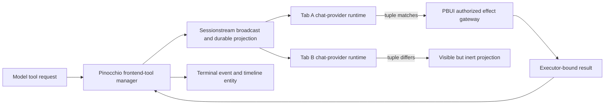
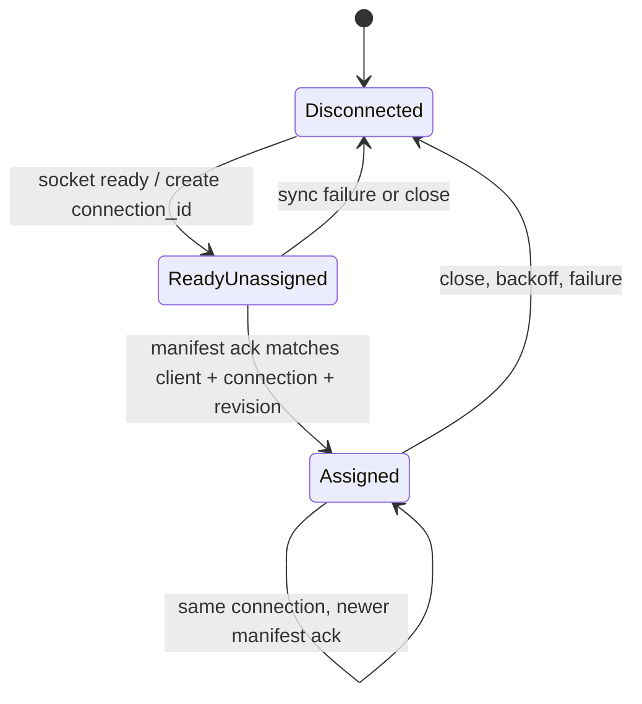
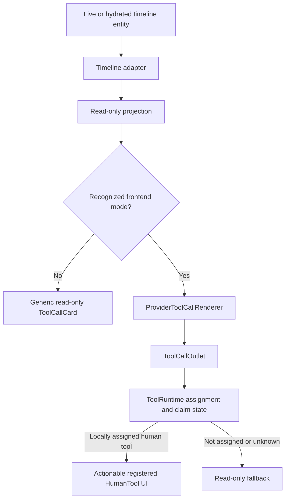

# Frontend Tool Executor Ownership: From Duplicate Browser Effects to a Single Command Authority

A frontend tool call asks a browser to perform work on behalf of an agent. The work may be automatic, such as changing a PBUI workbench layout, or interactive, such as asking a person to approve a consequential operation. Once the same conversation is open in two browser tabs, that apparently local interaction becomes a distributed execution problem. Both tabs receive the request. Both may have the tool. Both may believe the request is new. Both may perform the effect before either learns that the other has already completed it.

This report explains the executor protocol built across Pinocchio, `@go-go-golems/chat-provider`, and PBUI to address that problem. It also records the implementation quest: the first local idempotency ledger, the real two-tab failure that proved it insufficient, the concise three-part executor design, the server and browser implementations, the release mistake exposed by late review, and the final architectural correction that made timeline projections read-only and established `ToolRuntime` as the sole browser command authority.

> [!summary]
> - A session and tool-call ID identify a call, but they do not choose one of several browser runtimes attached to the session.
> - The selected executor is the tuple `(client_instance_id, connection_id, assignment_id)`. Pinocchio creates assignments; chat-provider obeys them; PBUI supplies policy, authorization, effects, and acceptance evidence.
> - Requests capture executor identity immutably. Ownership changes affect future calls only. Results must echo the captured tuple, and retries cannot read mutable current ownership.
> - Timeline events contain broadcast provenance, not private proof of local ownership. Generic timeline cards are therefore read-only; only the assignment-aware `ToolRuntime` may execute or expose completion controls.

## 1. The problem begins before duplicate result submission

The original frontend-tool path already had server-side containment. Pinocchio retained pending and terminal call state. Chat-provider eventually gained a per-runtime terminal ledger. PBUI persisted canonical effect envelopes and rejected divergent duplicates. These controls made repeated completion safer, but they operated after a browser had decided to act.

That ordering matters. Consider a tool that splits a workbench tile:

```text
Tab A receives call-7 -> splits its local pane -> submits success
Tab B receives call-7 -> splits its local pane -> submits success
Server accepts one result and rejects the other
```

The model sees one terminal result, and the durable PBUI effect ledger retains one canonical envelope. The second browser effect nevertheless happened. The rejected result cannot reverse a local pane mutation, a downloaded file, an external API request, a message send, or a human decision made through the wrong tab.

The first invariant is therefore stronger than duplicate-result rejection:

```text
For each frontend-tool request, at most one honest attached browser runtime
may begin the browser effect or expose actionable human controls.
```

Server idempotency remains necessary because networks retry and responses disappear. It is not sufficient because idempotency at the result boundary does not prevent effects that occur before the boundary.

### 1.1 The reproduced two-tab failure

The decisive evidence came from a real installed-package Chromium probe in PBUI. Two tabs opened the same session using the immutable `@go-go-golems/chat-provider@0.5.0` package. Both independent runtimes received the same request. Both claimed it in their own empty in-memory ledgers. Both changed local workbench state. Only afterward did the server and effect ledger reject the conflicting second completion.

This separated three properties that had previously been treated as one:

| Property | What it protects | Why it did not stop the two-tab effect |
|---|---|---|
| Runtime terminal ledger | Replay inside one JavaScript runtime | Each tab owns a separate map. |
| Pinocchio terminal idempotency | Duplicate or conflicting result commands | Validation happens after browser execution. |
| PBUI canonical effect envelope | Divergent durable effect claims | A browser-local effect can precede persistence. |
| Executor ownership | Eligibility before claim and effect | This was the missing layer. |

The probe changed the project from a defensive-hardening exercise into a protocol-design exercise. The missing state crossed repository and process boundaries; no local patch could supply it honestly.

## 2. Why call identity is not executor identity

The existing effective call key was approximately:

```text
(session_id, tool_call_id, tool_name)
```

This key answers three useful questions:

- Which conversation owns the call?
- Which model invocation is being completed?
- Which registered tool is requested?

It does not answer which connected browser incarnation may execute. A session is deliberately shared. A tool-call ID is deliberately broadcast to all subscribers of that session. A tool name describes capability, not selection.

A single persistent client ID is also insufficient. A tab can reload while retaining its client identity. Old and new WebSocket connections can overlap. Ownership can move from tab A to tab B and later return to A. A delayed result from A's first ownership period must not become valid merely because A currently owns the session again.

The protocol therefore identifies three lifetimes explicitly:

| Identity | Lifetime | Creator | Purpose |
|---|---|---|---|
| `client_instance_id` | One browser tab across reloads | Browser | Distinguishes tabs. |
| `connection_id` | One ready transport generation | Browser | Distinguishes reconnect incarnations. |
| `assignment_id` | One server-selected ownership epoch | Pinocchio | Distinguishes repeated ownership periods. |

Together they form the executor tuple:

```text
executor = (client_instance_id, connection_id, assignment_id)
```

All three fields are required. Partial tuples fail closed. Values are opaque, bounded strings; first-party clients generate UUIDs. The assignment is visible provenance rather than a secret credential.

## 3. Repository responsibilities

The protocol spans three repositories because the responsibilities are genuinely different.



### 3.1 Pinocchio owns selection and validation

Pinocchio is the authoritative server boundary. It accepts manifests, selects the current executor for future calls, creates assignment IDs, captures the selected tuple in pending calls, and validates results against that captured identity. It also preserves executor provenance through cancellation, terminal retention, live events, and durable timeline entities.

Pinocchio does not decide whether a browser effect is authorized for a particular PBUI user. Assignment is concurrency provenance, not route authorization.

### 3.2 Chat-provider owns browser execution state

Chat-provider creates browser and connection identities, synchronizes manifests, validates acknowledgements, filters incoming requests before claim, owns automatic and human invocation state, and submits results with immutable invocation provenance. Its `ToolRuntime` is the only component with enough local state to answer:

```text
Does this request's executor exactly equal the assignment acknowledged
for this ready connection?
```

### 3.3 PBUI owns policy and consequential effects

PBUI owns route authorization, approval policy, stale-revision checks, transactional effect execution, durable envelopes, and the real-browser acceptance test. The executor tuple prevents two honest runtimes from both starting. PBUI still rejects unauthorized or stale operations even when the caller carries a valid-looking tuple.

This separation avoids a dangerous conclusion: `assignment_id` is not authentication. Every authorized tab subscribed to the session may observe it in broadcast events.

## 4. The authoritative state model

The server stores one current assigned manifest per session:

```go
type assignedManifest struct {
    clientInstanceID string
    connectionID     string
    assignmentID     string
    revision         uint64
    tools            []*FrontendToolDescriptor
    deterministic    []byte
}
```

The manifest combines capability advertisement with ownership selection. For the concise first release, the latest accepted different connection becomes executor for future calls. A higher revision from the same connection changes tool availability without creating a new assignment. A different connection always receives a new assignment.

### 4.1 Manifest transition table

| Current state | Incoming manifest | Result |
|---|---|---|
| No manifest | Valid client/connection/revision | Create assignment and select it. |
| Same connection, higher revision | Valid changed or unchanged tools | Retain assignment; update manifest. |
| Same connection, equal revision and equal content | Exact retry | Return existing acknowledgement; publish nothing. |
| Same connection, equal revision and different content | Revision reuse | Reject `manifest_revision_conflict`. |
| Same connection, lower revision | Stale update | Reject `manifest_revision_regression`. |
| Different connection | Any valid connection-scoped revision | Create a new assignment for future calls. |
| Publication fails | Candidate manifest | Keep previous committed state. |

An empty manifest remains meaningful. It says that the selected connection currently offers no tools. It does not implicitly disconnect or release ownership.

### 4.2 Exact acknowledgement is part of the transaction

The browser may not infer ownership from HTTP success alone. Manifest acceptance returns the exact assignment created or retained by the same serialized operation:

```json
{
  "sessionId": "conversation-123",
  "accepted": true,
  "status": "manifest_updated",
  "revision": 12,
  "executor": {
    "clientInstanceId": "client-a",
    "connectionId": "connection-84b2",
    "assignmentId": "assignment-f81c"
  }
}
```

A design based on these two separate calls is incorrect:

```text
hub.Submit(manifest)
manager.CurrentManifest(session)
```

Another tab can update the manifest between submission and lookup. The HTTP response could acknowledge the wrong connection. `AcceptManifest` therefore performs validation, publication, commitment, and acknowledgement as one ordered operation.

## 5. Publication before exposure

The first Pinocchio implementation installed the candidate assigned manifest before publishing the corresponding event, then attempted rollback if publication failed. Late review found a real correctness hole: requests read current state under a different lock. During blocked publication, a concurrent request could capture the uncommitted assignment. If publication later failed, the browser would never acknowledge that assignment, but the pending call would remain bound to it.

The corrected ordering is:

```text
validate candidate
serialize acceptance
publish candidate event
if publication fails: return error; committed state remains unchanged
install candidate as current
return exact acknowledgement
```

The key invariant is:

```text
Manager.Request can observe only committed assignment state.
```

A blocking-publication regression test proves that a request created while candidate publication is blocked still captures the previous committed assignment.

This correction also changed the release story. `v0.11.15` had already been tagged from the merged initial implementation before the late review arrived. The tag remains immutable, but downstream selection was halted. A new patch release must supersede it after the follow-up PR is maintainer-merged. Release immutability is part of protocol correctness: rewriting a published tag would make dependency resolution non-reproducible.

## 6. Request creation freezes ownership

When the model requests a frontend tool, Pinocchio checks the current assigned manifest and captures its executor tuple into the pending call:

```text
request(session, call):
    lock manager
    manifest = current manifest for session
    require manifest contains call.tool
    executor = clone(manifest.executor)
    pending[session, call.id] = {
        tool: call.tool,
        executor: executor,
        state: pending
    }
    unlock
    publish requested event containing executor
```

The clone is intentional. Current ownership may change while the effect is running. A new tab can connect and own future requests without invalidating the old owner's right to finish the old request.

This yields two distinct states:

```text
current executor: used when creating future calls
pending executor: immutable identity captured by an existing call
```

Conflating them would make reconnect unsafe. If result validation compared only with current ownership, a legitimate old executor could not finish after another tab became current. If the pending call were rewritten to the new executor, the server could cause duplicate consequential effects because it cannot know whether the old browser already acted.

### 6.1 No automatic in-flight reassignment

The concise protocol never transfers a pending call automatically. If the selected browser disappears after acting but before reporting, the server cannot determine whether replay is safe. Cancellation or timeout terminates the call. Recovery requires explicit effect-specific semantics, not a generic ownership timer.

This deliberately does not claim exactly-once execution under arbitrary crashes. It claims a narrower property:

```text
One honest selected browser executes a normally delivered request.
Stale and non-selected honest browsers remain inert.
Retries do not replay the browser effect.
```

## 7. Browser identity and connection generations

Chat-provider stores `client_instance_id` in `sessionStorage` under a package-scoped key:

```text
@go-go-golems/chat-provider.client-instance-id
```

`sessionStorage` is selected because the desired lifetime is one tab across reloads. `localStorage` would share authority across tabs. If storage is unavailable, chat-provider generates a process-local identity and reports the loss of reload stability diagnostically.

Every transition into a new ready transport generation creates a fresh `connection_id`. It is never persisted. On disconnect, backoff, failure, or replacement connection, the runtime clears current executable assignment immediately.



A delayed acknowledgement from an old generation cannot install authority in a new generation. The client validates:

- `accepted === true`;
- the exact requested manifest revision;
- the exact `client_instance_id`;
- the exact `connection_id`;
- a complete server-created `assignment_id`;
- the captured local ready generation.

Only then does it call `ToolRuntime.setExecutorIdentity`.

## 8. Claim before effect

An incoming request is executable only when its complete executor tuple exactly matches the runtime's acknowledged assignment. Filtering happens before creating invocation state, before exposing human controls, and before running an automatic effect.

```ts
function acceptRequest(request: ToolRequest, current: Executor | null): boolean {
  if (!complete(request.executor)) {
    debug("tool-request-executor-missing", request)
    return false
  }
  if (!current || !sameExecutor(request.executor, current)) {
    debug("tool-request-not-executor", request)
    return false
  }
  return claimRequest(request)
}
```

The ordering is the safety mechanism:

```text
parse -> validate executor -> compare assignment -> claim -> execute/render
```

This is stronger than executing and relying on result rejection. It is also stronger than claiming first and checking later, because claim may expose a pending human interaction or establish retry state.

### 8.1 Two runtimes receiving one event

Suppose tab B most recently synchronized and owns assignment `b-9`:

```text
Tab A local assignment: (client-a, conn-a2, assignment-a7)
Tab B local assignment: (client-b, conn-b1, assignment-b9)
Request executor:        (client-b, conn-b1, assignment-b9)
```

Both tabs receive the broadcast event. Their behavior differs before claim:

| Runtime | Comparison | Outcome |
|---|---|---|
| Tab A | Request tuple differs | Record diagnostic; do not create invocation; do not act. |
| Tab B | Exact match | Claim once and execute or render human controls. |

The event remains visible in both timelines. Visibility and actionability are separate properties.

## 9. Immutable result provenance

A running invocation retains a clone of the request executor. Every completion and retry uses that clone:

```ts
type Invocation = {
  sessionId: string
  toolCallId: string
  toolName: string
  executor: FrontendToolExecutor
  phase: "running" | "awaiting-human" | "completing" | "terminal"
}
```

Result delivery must not ask the runtime for current assignment:

```ts
await submitToolResult({
  sessionId: invocation.sessionId,
  toolCallId: invocation.toolCallId,
  toolName: invocation.toolName,
  executor: invocation.executor,
  status,
  result,
  error,
})
```

This rule solved two related mutable-context bugs found during earlier review:

1. A retry could resolve its URL from the currently selected Redux session instead of the invocation's original session.
2. A reconnect could replace current assignment before a delayed result retry.

Both session and executor therefore belong to invocation identity. Mutable UI selection and mutable current ownership cannot redirect completion.

## 10. Server-side result validation and terminal idempotency

Pinocchio validates a result against pending state in a stable order. The conceptual sequence is:

```text
1. validate session and call identity
2. require complete result executor
3. locate pending or retained terminal call
4. compare executor exactly
5. compare tool name and terminal status
6. compute deterministic terminal digest
7. accept first terminal result or identical retry
8. reject divergent terminal retry
```

The deterministic digest includes executor identity before call and payload fields:

```text
client_instance_id
connection_id
assignment_id
tool_call_id
tool_name
status
error
deterministic result bytes
```

An identical retry from the same invocation is idempotent. A result from another assignment fails even if call ID, tool name, status, and result body match. A divergent retry from the correct assignment conflicts.

Cancellation and timeout also retain executor provenance in their terminal records and events. Otherwise a later retry could lose the identity needed to distinguish legitimate retransmission from stale completion.

## 11. Durable projection and hydration

Frontend-tool requests and results are timeline entities. Executor fields must survive the complete path:

```text
Pinocchio request
  -> sessionstream event
  -> frontend-tool plugin projection
  -> durable snapshot entity
  -> chat-provider timeline adapter
  -> ToolRuntime reconciliation
```

A reload creates a new connection and therefore a new current assignment. Hydrated historical requests may carry old executor tuples. They must remain visible but inert.

The safe reconnect order is:

```text
1. transport reaches ready
2. create fresh connection_id
3. clear executable assignment
4. submit manifest
5. validate exact acknowledgement
6. install assignment
7. reconcile hydrated requested entities
```

Reconciling before acknowledgement would make the runtime decide actionability without current authority. The implementation reuses bounded timeline state rather than creating a second deferred-request ledger.

A separate review finding exposed another hydration issue: the adapter read session ID from event payload where hydrated entities did not reliably carry it. The correct source is `SnapshotProjectionContext.sessionId`, which names the snapshot being projected. The regression test asserts that a hydrated card receives that context identity.

## 12. Human tools require the same authority path

Human tools are not exempt from executor ownership. Showing an approval button is already an actionable step because it authorizes one tab to decide the call. If every tab renders controls, multiple people or multiple windows can race to complete the same request.

The initial Pinocchio follow-up tried to preserve executor fields in its built-in timeline card and include them in a direct result POST. That repaired strict wire compatibility but not ownership. Every tab receives the same broadcast tuple and can copy it. The card had no private acknowledged-assignment state with which to compare the tuple.

The architectural correction was to remove command authority from generic timeline rendering.



First-party human tools must be explicitly registered with chat-provider and rendered through `ToolCallOutlet`. Their `respond` and `reject` callbacks complete runtime-owned invocation state. Generic cards may display tool name, input, result, status, and error, but they do not infer approval controls from payload shape and do not import result transports.

## 13. Projection and command authority are different responsibilities

The recurring review failures had one architectural cause: duplicated command authority.

A timeline projection answers:

```text
What happened in this session, and what should every observer be able to see?
```

A command runtime answers:

```text
May this local runtime act, has it already claimed the call, and how does it complete?
```

The event carries public, broadcast provenance. The runtime also holds private local facts: which manifest request this connection sent, which acknowledgement it accepted, whether assignment has been cleared, whether a call is already claimed, whether completion is in progress, and which immutable tuple belongs to a retry.

A renderer cannot reconstruct those facts from event fields. Letting it submit directly creates a confused-deputy path: the renderer possesses enough data to form a syntactically valid result but not enough authority state to decide whether it should.

The accepted design decision is therefore explicit:

> Timeline adapters and generic timeline cards are read-only. `ToolRuntime` is the sole browser execution and completion authority.

This rule is more durable than another field check. It makes future ownership-sensitive behavior pass through one state machine.

## 14. Enum normalization closed an accidental bypass

Pinocchio's provider renderer already sent recognized frontend modes to `ToolCallOutlet`, but it detected them through string inspection. Protobuf JSON and generated clients may represent an enum as a symbolic name or numeric value. Numeric frontend modes could therefore fall through into the generic card path.

The fix introduced explicit mode normalization covering both forms. Unknown or unregistered frontend tools remain visible through a read-only fallback. They never regain actionability merely because a renderer does not recognize the mode encoding.

This small correction matters because architectural boundaries are only effective when all supported representations route through them.

## 15. The implementation quest

The final architecture emerged through successive proofs, not from a single initial design.

### 15.1 Phase A: harden one runtime

Chat-provider first gained a transactional invocation state machine. Requests were claimed before execution. Human completion used compare-and-set semantics. Terminal calls stayed retained so event replay and hydration could not execute them again. Manifest synchronization became serialized and monotonic. Registrations became owned resources rather than append-only global side effects.

This was correct within one runtime and became `@go-go-golems/chat-provider@0.5.1`. It removed a large class of replay bugs but did not coordinate independent tabs.

### 15.2 Phase B: bind retries to immutable context

Review of an earlier react-chat PR found that a cached manifest acknowledgement could survive the connection that produced it and that a delayed result retry could use a newly selected session. Connection generations were added to local manifest acknowledgement identity, manifest synchronization was triggered on each ready transition, and invocation session identity was carried through result retries.

These fixes established a broader rule later applied to executor identity: completion belongs to the invocation that produced it, not to mutable UI or transport state at retry time.

### 15.3 Phase C: reproduce the real blocker

The PBUI two-tab browser probe demonstrated two local effects and one accepted terminal result. This prevented a false Phase 5 completion claim. The evidence showed that server conflict handling protected records but not browser effects.

### 15.4 Phase D: reduce the design to the smallest sufficient protocol

A broader proposal considered timed leases, heartbeats, run IDs, capability strings, request deadlines, and takeover. The implemented first release removed those features. The demonstrated bug required one selected honest runtime, reconnect distinction, assignment epochs, immutable pending identity, and strict result validation. It did not require expiry or automatic takeover.

The concise protocol document became authoritative across all three repositories.

### 15.5 Phase E: implement server-owned assignment

Pinocchio added `FrontendToolExecutor` to protobuf requests, results, events, and entities. `Manager.AcceptManifest` gained strict revisions, idempotent equality, assignment generation, exact acknowledgement, and serialized publication. Pending and terminal state captured the tuple. The HTTP adapter moved from submit-then-query to the acknowledgement-returning manager operation.

Implementation failures were useful specification tests:

- Old bridge code still expected the former manifest shape.
- Legacy tests omitted strict executor fixtures.
- Structural equality on protobuf runtime objects produced misleading diffs and was replaced with `proto.Equal`.
- Required race tests exposed an unrelated test harness data race, which was fixed with a channel.
- Generated TypeScript was semantically correct but failed Biome import ordering; generation now includes deterministic formatting.

### 15.6 Phase F: publish too early, then preserve release immutability

The initial Pinocchio implementation passed full tests, race checks, lint, GoSec, govulncheck, builds, package generation, and eleven GitHub checks. PR 208 merged and `v0.11.15` was published through the Go module proxy.

Late automated review then found the publication-before-commit visibility bug and the incompatible built-in human card. The release was not rewritten. It was marked superseded-for-consumption, and downstream release work stopped pending a new immutable patch after PR 210.

This was a process failure rather than a reason to weaken release immutability. A published dependency is evidence only when review, source, tag, and consumer resolution all refer to the same accepted artifact.

### 15.7 Phase G: implement browser assignment obedience

React-chat added tab-stable client identity, per-ready-generation connection identity, strict acknowledgement validation, assignment clearing, pre-claim filtering, immutable retry provenance, executor-aware diagnostics, and post-ack hydration reconciliation.

The test suite includes two runtimes receiving one request and proves one execution and one submission. It also covers missing identity, mismatched acknowledgement, connection rotation, storage persistence, stale-current retry behavior, and hydrated reconciliation.

The code remains unreleased until the corrected Pinocchio contract is published and consumed outside the workspace.

### 15.8 Phase H: recognize duplicated authority

Further PR 210 review observed that a generic card carrying executor fields still could not prove local ownership. This was the point where the work moved from field propagation to architectural correction.

Pinocchio deleted its bespoke result submission and heuristic approval controls. `ProviderToolCallRenderer` routes frontend modes into `ToolCallOutlet`. The generic `ToolCallCard` is read-only. Hydration uses snapshot context. The change removed more authority code than it added.

The lesson is precise:

```text
Transporting provenance through every layer is necessary.
Reconstructing command authority in every layer is incorrect.
```

## 16. Failure analysis

### 16.1 Local idempotency mistaken for distributed ownership

**Symptom:** One tab behaved correctly under replay, while two tabs both executed.

**Cause:** Each runtime had an independent claim and terminal map.

**Correction:** Server-selected assignment plus browser filtering before claim.

### 16.2 Conflict rejection mistaken for effect prevention

**Symptom:** Durable state showed one accepted result, but both browser UIs changed.

**Cause:** The effect occurred before result validation.

**Correction:** Establish eligibility before any automatic effect or human control.

### 16.3 Client identity without connection or epoch

**Symptom:** Reloads and repeated ownership periods could make stale work appear current.

**Cause:** One identifier represented several lifetimes.

**Correction:** Separate tab, connection, and assignment identities.

### 16.4 Mutable current state used for retry

**Symptom:** Delayed completion could target a newly selected session or assignment.

**Cause:** Retry code resolved context at delivery time.

**Correction:** Capture session and executor in invocation state.

### 16.5 Candidate state visible before publication committed

**Symptom:** A pending call could bind to an assignment the browser never acknowledged.

**Cause:** Install-then-publish with readers outside the acceptance lock.

**Correction:** Publish before exposing candidate state.

### 16.6 Broadcast provenance treated as local authority

**Symptom:** Every tab could render a direct approval control using the same tuple.

**Cause:** Generic projection code submitted commands outside the runtime.

**Correction:** Read-only projections and one assignment-aware command authority.

### 16.7 Hydrated identity taken from payload rather than projection context

**Symptom:** Reloaded cards could receive unreliable session identity.

**Cause:** Live event assumptions leaked into snapshot projection.

**Correction:** Use `SnapshotProjectionContext.sessionId`.

## 17. Security boundary

The executor protocol coordinates honest clients. It does not prevent an authorized malicious tab from copying another tab's broadcast assignment tuple and submitting a matching result. Assignment IDs are visible in session events and snapshots.

The actual security boundary remains:

- session route authorization;
- PBUI authorization and policy checks;
- approval ownership and confirmation validation;
- expected-revision checks;
- effect gateway constraints;
- server-side terminal and envelope idempotency.

A hostile same-principal threat model would require channel-bound or cryptographic proof. Possible future designs include a server-held secret bound to a transport or a signed, audience-restricted completion token. Such a change should not be described as a small extension of the current tuple; it changes the authentication model.

## 18. Why no timed lease was added

A lease with heartbeat and expiry appears to solve owner disappearance, but expiry does not reveal whether an effect happened. Automatic takeover after timeout can duplicate a consequential operation that completed locally but lost its response.

The concise protocol therefore chooses safety over automatic liveness for in-flight work:

| Situation | First-release behavior |
|---|---|
| New tab connects | It owns future calls after acknowledged manifest acceptance. |
| Same connection updates tools | It retains assignment. |
| Current owner disconnects before a new call | Another accepted connection may own later calls. |
| Owner disappears during an effect | Call times out or cancels; no automatic replay. |
| Old owner reports its existing call after ownership moved | Result is valid if it matches that pending call's captured tuple. |
| Old owner tries to execute a new call | Request tuple does not match; runtime stays inert. |

Timed takeover can be added only alongside an explicit classification of replay-safe effects or an effect protocol with its own durable idempotency key and recovery semantics.

## 19. Alternatives rejected

| Alternative | Rejection reason |
|---|---|
| Session ID only | All tabs share it. |
| Tool-call ID only | It identifies work, not the selected runtime. |
| Client instance only | It cannot distinguish reconnects or repeated ownership epochs. |
| Client plus connection | Delayed work from a prior assignment period remains ambiguous if ownership returns. |
| `localStorage` election | Shared mutable browser state is not server authority and behaves poorly across crashes and devices. |
| BroadcastChannel coordination | It coordinates cooperating contexts on one origin but does not bind server pending state or HTTP results. |
| Web Locks | Browser-local lock ownership is not represented in server events, durable projection, or result validation. |
| Targeted WebSocket delivery | It reduces broadcast but still needs reconnect, pending identity, HTTP completion, and hydration semantics. |
| First tab owns forever | It creates poor recovery and requires durable identity/liveness rules. |
| Timed lease immediately | It introduces unsafe takeover without effect-replay semantics. |
| Reassign pending calls | The server cannot know whether the old executor already acted. |
| Generic cards with executor fields | Broadcast provenance does not prove local ownership. |

## 20. Testing the protocol as a state machine

The tests are organized around invariants rather than individual functions.

### 20.1 Pinocchio manager tests

The server suite proves:

- first valid manifest creates an assignment;
- same-connection updates retain it;
- another connection creates a new assignment;
- lower revisions regress and equal divergent revisions conflict;
- equal identical manifests are idempotent;
- publication failure does not expose candidate state;
- pending calls retain original executor after ownership changes;
- missing and mismatched result executors fail;
- concurrent acceptance leaves one coherent current assignment;
- cancellation and terminal retries preserve provenance.

### 20.2 React-chat runtime tests

The browser suite proves:

- two runtimes receive one request but only the matching runtime executes and submits;
- missing executor identity fails closed;
- reconnect creates a fresh connection identity and clears current assignment;
- stale acknowledgements cannot install authority;
- client identity survives reload within the tab storage lifetime;
- result retries use invocation-captured executor;
- human pending state is created only by the selected runtime;
- hydration becomes actionable only after matching acknowledgement.

### 20.3 Projection and UI tests

The adapter and renderer tests prove:

- live and hydrated entities retain executor provenance;
- hydrated session identity comes from snapshot context;
- symbolic and numeric frontend modes route through the outlet;
- generic cards remain read-only even when input resembles an approval;
- terminal statuses render without resurrecting controls;
- unknown tools remain visible but inert.

### 20.4 Required real-browser evidence

Unit tests establish state-machine behavior. Final PBUI acceptance still requires two real tabs using exact installed releases. For automatic and human tools, evidence must show:

```text
one browser effect
one result submission
one durable effect envelope
no terminal conflict
no envelope conflict
correct owner before and after reconnect
non-owner visible but inert
```

This acceptance remains pending until PR 210 is maintainer-merged, a corrected Pinocchio patch is published, chat-provider `0.6.0` is published, and PBUI consumes exact immutable versions.

## 21. Release sequencing is part of the design

Cross-repository strict migration cannot be validated against sibling workspace source alone. The required order is:

```text
1. Merge corrected Pinocchio protocol.
2. Tag a new immutable Pinocchio patch.
3. Verify it through proxy.golang.org with GOWORK=off.
4. Update react-chat's Go dependency to that patch.
5. Validate and maintainer-merge react-chat.
6. Publish @go-go-golems/chat-provider@0.6.0.
7. Install exact registry 0.6.0 in PBUI.
8. Run package smoke, two-runtime probe, and real two-tab Chromium acceptance.
```

The coordinated release is intentionally fail-closed. Servers reject manifests and results missing executor identity. Browsers ignore requests without a complete matching assignment. There is no hidden legacy fallback.

This means compatibility is a matrix, not an individual package property:

| Pinocchio | Chat-provider | Behavior |
|---|---|---|
| Old | Old | No cross-tab executor safety. |
| New strict | Old | Manifest/result requests fail strict validation. |
| Old | New strict | No valid assignment acknowledgement; browser remains inert. |
| New strict | New strict | Supported protocol. |
| New strict + PBUI exact adapter | New strict installed package | Candidate for final acceptance. |

## 22. Operational observability

The protocol needs diagnostics because an inert browser can be correct. Useful events include:

- manifest synchronization started, accepted, rejected, or superseded;
- assignment installed or cleared;
- request missing executor;
- request addressed to another executor;
- request claimed;
- human response won or lost completion CAS;
- result retry attempted with captured assignment;
- server result rejected for executor mismatch;
- terminal duplicate accepted or conflicting retry rejected.

Logs should include session, call, client, connection, and assignment where applicable. They should not describe assignment as authorization. Operators need to distinguish these cases:

```text
The tab received the request and correctly ignored it.
The tab never received the request.
The tab was assigned but failed before claim.
The effect ran and result delivery is retrying.
The server rejected a stale or forged completion.
```

## 23. Implementation files worth reading

### Pinocchio

- `/home/manuel/workspaces/2026-08-20/add-pbui-agent/pinocchio/proto/pinocchio/chatapp/frontendtools/v1/frontend_tool.proto`
- `/home/manuel/workspaces/2026-08-20/add-pbui-agent/pinocchio/pkg/chatapp/frontendtools/manager.go`
- `/home/manuel/workspaces/2026-08-20/add-pbui-agent/pinocchio/pkg/chatapp/frontendtools/executor_test.go`
- `/home/manuel/workspaces/2026-08-20/add-pbui-agent/pinocchio/pkg/chatapp/frontendtools/plugin.go`
- `/home/manuel/workspaces/2026-08-20/add-pbui-agent/pinocchio/cmd/web-chat/internal/appserver/routes_frontend_tools.go`
- `/home/manuel/workspaces/2026-08-20/add-pbui-agent/pinocchio/cmd/web-chat/web/src/features/web-chat/WebChatApp/ProviderToolCallRenderer.tsx`
- `/home/manuel/workspaces/2026-08-20/add-pbui-agent/pinocchio/cmd/web-chat/web/src/features/web-chat/cards/ToolCallCard/ToolCallCard.tsx`

### React-chat

- `/home/manuel/workspaces/2026-08-20/add-pbui-agent/react-chat/packages/chat-provider/src/core/createChatClient.ts`
- `/home/manuel/workspaces/2026-08-20/add-pbui-agent/react-chat/packages/chat-provider/src/tools/toolRuntime.ts`
- `/home/manuel/workspaces/2026-08-20/add-pbui-agent/react-chat/packages/chat-provider/src/tools/ToolCallOutlet.tsx`
- `/home/manuel/workspaces/2026-08-20/add-pbui-agent/react-chat/packages/chat-provider/src/ws/timelineEvents.ts`
- `/home/manuel/workspaces/2026-08-20/add-pbui-agent/react-chat/packages/chat-provider/src/core/createChatClient.test.ts`
- `/home/manuel/workspaces/2026-08-20/add-pbui-agent/react-chat/packages/chat-provider/src/tools/toolRuntime.test.ts`

### PBUI and authoritative documentation

- `/home/manuel/workspaces/2026-08-20/add-pbui-agent/pbui/pkg/chatserver/handlers.go`
- `/home/manuel/workspaces/2026-08-20/add-pbui-agent/pbui/ttmp/2026/08/23/PBUI-TOOLCALL-1--harden-pbui-agent-ui-tools-approvals-server-routes-and-effect-tracing/various/03-phase5-multitab-executor-blocker.md`
- `/home/manuel/workspaces/2026-08-20/add-pbui-agent/react-chat/ttmp/2026/08/23/REACT-CHAT-TOOL-RUNTIME-1--make-browser-tool-execution-idempotent-single-owner-and-manifest-safe/design-doc/02-concise-frontend-tool-executor-ownership-protocol.md`

## 24. Commits and review milestones

| Commit or release | Role |
|---|---|
| `88d6255` | Bound manifest acknowledgements to connection generations and retries to invocation sessions. |
| `723fbc2` / chat-provider `0.5.1` | Published the single-runtime idempotency baseline. |
| `98aea62` | Authored the concise cross-repository executor protocol. |
| `7279126` | Implemented Pinocchio server-owned executor assignment. |
| Pinocchio `v0.11.15` at `806f449` | Published initial server implementation; later superseded for consumption. |
| `b056b6a` | Fixed candidate exposure before publication and migrated first-party provenance. |
| `a281080` | Implemented assignment-aware browser runtime behavior. |
| `04b5479` | Removed duplicate generic-card command authority. |
| `69c8984` | Recorded the final Pinocchio architecture and review evidence. |
| `58931c1` | Added the single-authority decision to react-chat's authoritative design and diary. |

Relevant pull requests:

- Pinocchio PR 208: merged initial executor implementation.
- Pinocchio PR 210: open maintainer-gated correction and single-authority architecture.
- React-chat PR 15: open maintainer-gated browser runtime implementation.

## 25. Working rules for future frontend tools

The project now has a compact set of rules that should survive implementation changes:

1. **Choose an executor before claim.** Result conflict handling cannot prevent duplicate effects.
2. **Represent each lifetime explicitly.** Tab, connection, and assignment are distinct identities.
3. **Acknowledge exact server state.** HTTP success without a matching assignment tuple does not establish ownership.
4. **Freeze invocation identity.** Session and executor belong to the call and survive reconnects and retries.
5. **Never reassign consequential in-flight work automatically.** Timeout is safer than speculative replay.
6. **Preserve provenance through persistence.** Live events and hydrated entities must carry the same executor.
7. **Keep projections read-only.** Visibility does not imply local actionability.
8. **Use one browser command authority.** Automatic execution, human controls, completion CAS, cancellation, and retries belong to `ToolRuntime`.
9. **Treat assignment as concurrency metadata, not authentication.** Route authorization and effect policy remain mandatory.
10. **Validate immutable releases outside the workspace.** Source success is not consumer evidence.

## 26. Current status and next steps

The protocol and both principal implementations exist and have passed targeted and full validation. Pinocchio PR 210 is open, mergeable, and green. React-chat PR 15 is open, mergeable, and green. They are intentionally not self-merged.

The remaining path is operational but correctness-sensitive:

1. A maintainer merges Pinocchio PR 210.
2. A new immutable Pinocchio patch supersedes `v0.11.15`.
3. React-chat consumes that patch with `GOWORK=off` and is maintainer-merged.
4. Chat-provider `0.6.0` is published and independently installed.
5. PBUI consumes exact releases and runs the automatic, human, reconnect, hydration, and two-tab browser matrix.
6. PBUI Phase 5 closes only when one effect, one result, and one durable envelope are observed without conflicts.

The unfinished status is part of the report's technical conclusion. The architecture is implemented, but the cross-repository guarantee becomes a released system property only after immutable package integration and browser evidence complete the chain.

## 27. A complete protocol trace

A concrete trace ties the identities and transitions together. Tab A opens session `s1`, creates client `ca`, and reaches ready connection `a1`. It posts manifest revision 1. Pinocchio publishes and commits assignment `x1`, then returns `(ca, a1, x1)`. Chat-provider validates all response fields and installs that tuple.

Tab B then opens the same session as client `cb` on connection `b1`. Its manifest is accepted as assignment `x2`. Tab A still remembers `x1`, but `x2` is current for future server requests. No message tells Tab A to reinterpret existing invocations.

The model requests call `c7`. Pinocchio finds tool `workbench_perform` in the current B manifest and creates pending state:

```json
{
  "sessionId": "s1",
  "toolCallId": "c7",
  "toolName": "workbench_perform",
  "executor": {
    "clientInstanceId": "cb",
    "connectionId": "b1",
    "assignmentId": "x2"
  }
}
```

Both tabs project this entity. Tab A compares `(cb,b1,x2)` with `(ca,a1,x1)` and emits `tool-request-not-executor`. It creates no invocation state. Tab B compares the same request with `(cb,b1,x2)`, claims `c7`, performs the effect, and captures the tuple in the invocation.

Before Tab B's response arrives, Tab A reconnects on `a2` and receives assignment `x3`. The server now uses `x3` for future calls. This does not alter pending `c7`, which still records `x2`. Tab B submits its result with `(cb,b1,x2)`. Pinocchio compares against pending state rather than current manifest state, accepts the result, stores its terminal digest, and publishes a terminal entity carrying `x2`.

If Tab B retries because the HTTP response was lost, the identical tuple and payload produce the same digest and are accepted idempotently. If Tab A submits the same payload with `x3`, executor comparison fails before digest equality can make it appear equivalent. If a new call `c8` is created after the reconnect, it carries `x3`; Tab A may claim it and Tab B remains inert.

This trace demonstrates four independent facts:

- Current assignment chooses the executor of a newly created call.
- Pending assignment controls completion of an existing call.
- A newer current assignment does not revoke valid completion rights for older in-flight work.
- A terminal retry is identified by the invocation's frozen tuple and deterministic content.

## 28. Review checklist for another implementation

A different frontend-tool implementation can be reviewed by tracing every authority transition rather than searching only for tuple fields.

### Manifest boundary

- Does the client create a fresh connection identity for each ready transport incarnation?
- Does the server create the assignment rather than accept one supplied by the client?
- Are revision equality and regression semantics explicit?
- Can a request observe candidate state before publication and acknowledgement can succeed?
- Does the acknowledgement come from the exact acceptance operation?

### Request boundary

- Is an active assigned manifest required before request creation?
- Is the executor cloned into pending state?
- Can a later manifest mutate or replace pending identity?
- Does the published and durable entity carry the same tuple?

### Browser boundary

- Is assignment cleared whenever transport authority is uncertain?
- Is the acknowledgement checked against the request's client, connection, revision, and local generation?
- Does tuple comparison occur before claim, rendering controls, and execution?
- Can any generic renderer call the result endpoint directly?
- Do unknown and unregistered tools remain read-only?

### Completion boundary

- Does result submission use invocation session and executor rather than current UI state?
- Does the server compare executor before accepting an idempotent retry?
- Do cancellation, timeout, and retained terminal state preserve provenance?
- Is divergent duplicate handling distinct from stale-executor handling?

### Release boundary

- Is the tested contract available as an immutable dependency?
- Are consumers validated with workspace replacement disabled?
- Does the browser test run against the exact installed package?
- Is the release held when late review invalidates an already published artifact?

## Conclusion

Frontend tool execution became a distributed ownership problem as soon as one session could have multiple browser runtimes. Local claim maps, terminal result idempotency, and durable effect envelopes each protected a different boundary, but none selected one runtime before effect.

The concise executor protocol adds that missing selection with a tab identity, a connection identity, and a server-generated assignment epoch. Pinocchio binds pending and terminal calls to the tuple. Chat-provider validates acknowledgement and filters before claim. PBUI retains authorization and effect integrity. In-flight calls keep immutable ownership even when future ownership moves.

The most important correction came after the tuple was already transported through the system. Broadcast provenance still did not make a generic timeline card authoritative. Removing direct submission from projections and routing all action through `ToolRuntime` established the architectural invariant that prevents the same class of bug from reappearing in another renderer.

The result is not an exactly-once execution claim under arbitrary failure. It is a precise, testable contract for honest concurrent browser clients, with explicit limits, strict migration, immutable release discipline, and a clear path to final two-tab acceptance.
