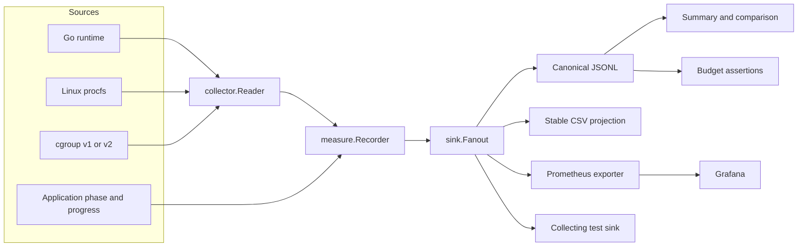
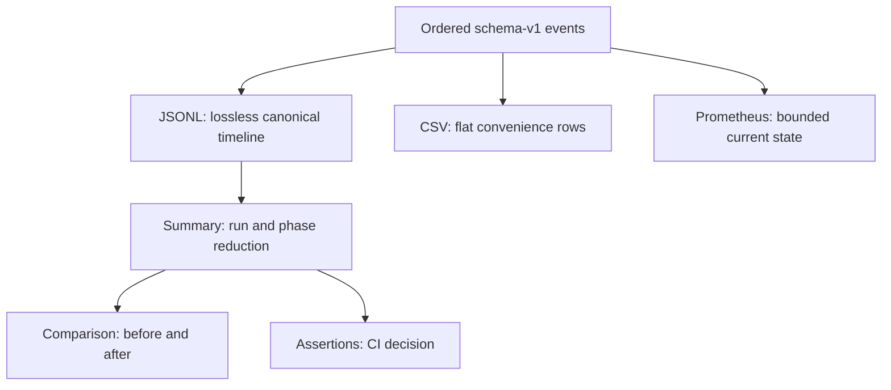

# Measure: Phase-Aware Memory Measurement for Go Programs

A memory number without process scope, collection source, time, and application phase is incomplete. `github.com/go-go-golems/measure` is a Go library and command-line tool that records those dimensions together. It combines Go runtime counters, Linux process RSS, cgroup accounting, semantic phases, progress, canonical JSONL traces, comparison and budget tools, and a bounded Prometheus projection.

The package grew from two concrete systems. Coinvault had continuous memory telemetry tied to knowledge-build progress, but its types were domain-specific. publish-vault had production memory incidents, atomic snapshot reloads, persistent Bleve indexes, heap logs, and private pprof, but no reusable timeline or comparison format. Measure extracts the common mechanism without importing either consumer's domain model.

> [!summary]
> - Measure distinguishes Go heap, process RSS, process-tree RSS sum, and cgroup memory instead of treating them as interchangeable.
> - A recorder joins machine observations to one active semantic phase and bounded progress, then writes a versioned event stream and terminal receipt.
> - JSONL is canonical. CSV, reports, assertions, Prometheus, and Grafana are bounded projections with different information-loss and cardinality constraints.
> - The standalone CLI and the embedded API share the same data model, but only an embedded recorder can observe another Go program's runtime heap and application phases directly.

## 1. The question the package answers

Consider an indexing process whose resident memory reaches 900 MiB. That observation does not identify the cause. The Go heap may retain a large object graph. The runtime may have freed objects but retained arenas from the operating system. A disk-backed index may have faulted mapped pages into RSS. A cgroup may charge filesystem cache not represented in process heap counters. A reload may temporarily keep two complete snapshots alive. A child process may account for most of the workload.

Each source answers a different question:

| Source | What it measures | What it does not establish |
|---|---|---|
| Go runtime | Managed heap, runtime system memory, GC counters, soft memory limit | Total resident or container-charged memory |
| `/proc/<pid>` | Root-process RSS, high-water mark, virtual memory, smaps attribution | Complete container usage or unique process-tree memory |
| Process-tree sum | Root plus descendant RSS | Unique pages; shared pages may be counted more than once |
| Cgroup files | Memory charged to the container or delegated cgroup | Which application subsystem retained it |
| Semantic recorder | Phase, progress, peaks, deltas, duration | Function-level allocation attribution |
| pprof | Allocation and retention sites in the Go heap | Container memory outside the Go heap |

Measure records the first five together. It does not replace pprof. Its purpose is to identify *when* a profile should be captured and *which phase* should be investigated.

## 2. The architecture

The package is split so platform observation remains independent from run semantics and output systems.



The dependency boundary is deliberate:

- `pkg/measurement` defines machine-unit observations and availability.
- `pkg/collector` reads runtime, procfs, smaps, cgroup, and process-tree data.
- `pkg/measure` owns run lifecycle, phase state, progress, sampling, deltas, and peaks.
- `pkg/trace` defines schema-v1 events and receipts.
- `pkg/sink` persists or fans out ordered events.
- `pkg/process` runs and supervises external process groups.
- `pkg/report` reduces traces into run and phase summaries.
- `pkg/budget` parses exact thresholds and evaluates source-aware checks.
- `pkg/prometheus` projects bounded current state into metrics.
- `cmd/measure/cmds` exposes the six Glazed workflows.

No core package contains note, vault, document, chunk, vector, or Bleve concepts. Consumers name their phases and choose their progress units.

## 3. Observation, event, and receipt

Three representations divide responsibilities.

An **observation** is one read of machine counters. `measurement.Memory` contains byte and counter fields plus explicit availability for each source. Zero is not used as a substitute for missing or unlimited data.

```go
type Availability string

const (
    AvailabilityUnavailable Availability = "unavailable"
    AvailabilityAvailable   Availability = "available"
    AvailabilityUnlimited   Availability = "unlimited"
)

type Memory struct {
    HeapAllocBytes  uint64
    HeapInuseBytes  uint64
    HeapSysBytes    uint64
    RuntimeSysBytes uint64
    RSSBytes        uint64
    RSSPeakBytes    uint64

    CgroupCurrentBytes uint64
    CgroupPeakBytes    uint64
    CgroupLimitBytes   uint64

    RuntimeAvailability Availability
    ProcessAvailability Availability
    CgroupAvailability Availability
    Errors []FieldError
}
```

The full definition is in `pkg/measurement/memory.go`. It includes runtime allocation and GC counters, smaps attribution, cgroup `anon`, `file`, kernel and slab fields, and source-specific errors. Partial success is intentional: unreadable `smaps_rollup` must not erase a valid `VmRSS` reading.

An **event** adds run identity, sequence, wall time, elapsed time, phase, progress, memory, deltas, and peaks. Events include run start, phase transitions, samples, annotations, warnings, and terminal results. `pkg/trace/types.go` validates identifiers, progress, bounded attributes, event ordering fields, status, and schema version.

A **receipt** is the terminal reduction for a run. It records duration, result, sampling interval, observed sources, global peaks, phase receipts, and bounded warnings. It is small enough for CI and operational artifacts while the JSONL trace retains the complete timeline.

```text
collector observation
    + run identity
    + current phase
    + progress
    + previous observation
    + run and phase peak state
    = schema-v1 event

ordered events
    -> terminal receipt
    -> summary
    -> comparison
    -> budget evaluation
```

## 4. Collecting memory without inventing precision

`collector.SystemReader` combines independent component readers. On Linux it reads the runtime for the current process, `/proc/<pid>/status`, optional `/proc/<pid>/smaps_rollup`, and cgroup files. For an external PID, Go runtime fields are unavailable because another process's runtime state cannot be inferred from procfs.

```go
type Reader interface {
    Read(context.Context, Target) (measurement.Memory, error)
}

func SelfTarget() Target
func PIDTarget(pid int) Target
```

The cgroup reader resolves an arbitrary PID through both `/proc/<pid>/cgroup` and `/proc/<pid>/mountinfo`. It cannot assume that `/sys/fs/cgroup/memory.current` describes the child. Nested mount roots and cgroup v1 controller mounts change the path. Fixtures cover cgroup v2 finite and unlimited limits, cgroup v1's near-`MaxInt64` unlimited sentinel, nested membership, malformed files, and optional-source failure.

The process-tree metric has an intentionally explicit name:

```text
process_tree_rss_sum_bytes
```

It sums root and descendant RSS. Shared pages can appear in several processes and therefore be counted repeatedly. The implementation does not call this unique memory or container memory.

On non-Linux platforms the module still compiles and records supported Go runtime data for itself. Unsupported process and cgroup sources remain unavailable. This is preferable to filling fields with values from an untested approximation.

## 5. Recorder lifecycle and concurrency ownership

`measure.Recorder` is a lifecycle object, not a global sampler. The caller constructs it with a reader, sink, interval, clock, and run name; starts it; owns the sampling goroutine; advances phase state; and finishes the run.

```go
recorder, err := measure.NewRecorder(measure.Options{
    Interval: 250 * time.Millisecond,
    Reader:   collector.NewSystemReader(),
    Sink:     output,
    RunName:  "index-build",
})
if err != nil { return err }

if err := recorder.Start(ctx); err != nil { return err }

go func() {
    _ = recorder.Run(ctx)
}()

phase, err := recorder.BeginPhase(ctx, "search_index", measure.PhaseOptions{
    Total: uint64(noteCount),
    Unit:  "notes",
})
if err != nil { return err }

for i, note := range notes {
    if err := index(note); err != nil { return err }
    if err := phase.SetProgress(uint64(i + 1)); err != nil { return err }
}

_, err = phase.End(ctx, trace.Succeeded())
```

Version 1 permits one active top-level phase. Nested phase trees would make receipt reduction and bounded Prometheus state materially more complex. Smaller operations can be expressed as annotations or distinct sequential phases.

The recorder emits an immediate sample, periodic samples, phase-boundary samples, explicit checkpoints, a cancellation-final sample, and terminal state. It serializes sequence assignment, state transition, peak updates, and sink delivery. Sampling goroutines are not hidden or immortal.

Sink policy is explicit. `sink.Fanout` can mark a destination required or best-effort. Losing a requested JSONL artifact should fail the measurement operation. Updating an optional structured log may not justify aborting the application. Fan-out remains synchronous and ordered; it does not create an unbounded goroutine per event.

## 6. The standalone CLI

The CLI exposes six Glazed commands:

```text
measure snapshot    Read one observation.
measure watch       Sample a live PID until it exits or the context ends.
measure run         Run and supervise a child process while measuring it.
measure summarize   Reduce one JSONL trace.
measure compare     Compare two trace summaries and common phases.
measure assert      Enforce run-wide or phase-specific memory budgets.
```

A typical external run is:

```bash
measure run \
  --interval 100ms \
  --trace run.jsonl \
  --receipt run.receipt.json \
  -- ./application --build-index

measure summarize run.jsonl --output table
measure compare before.jsonl after.jsonl --output table
measure assert run.jsonl \
  --peak-rss '<600MiB' \
  --phase search_index:peak-rss='<450MiB'
```

`measure run` creates a child process group, forwards signals, waits with bounded cancellation grace, escalates to `SIGKILL` when necessary, preserves explicit child exit codes, and maps signal exits to `128 + signal`. It writes artifacts before returning the child-code error. Terminal coordination handles a real race: procfs can lose `VmRSS` before `wait4` and channel publication complete. Source disappearance after confirmed child termination is not treated as the same failure as a collector failing while the child remains alive.

Budget exits are distinct:

| Exit | Meaning |
|---:|---|
| `0` | All checks passed |
| `1` | At least one budget failed |
| `2` | Invalid arguments or unreadable trace |
| `3` | A required metric was unavailable |

`pkg/budget/budget.go` parses byte thresholds using exact rational arithmetic. It rejects fractional bytes and overflow rather than silently truncating. Phase checks inspect source availability in that phase; observing RSS elsewhere in a run does not make a zero RSS phase peak trustworthy.

## 7. Canonical JSONL and bounded projections

JSONL is canonical because it can preserve structured availability, phase context, bounded attributes, source errors, run identity, and terminal events while being written incrementally. The checked-in fixture `pkg/trace/testdata/event-v1.jsonl` pins schema-v1 decoding.

CSV is a stable, lossy flat projection for plotting and spreadsheets. It cannot preserve every nested distinction. Summary and comparison are reductions, not replacement formats. Prometheus is a current-state projection and deliberately excludes run identity.

This division prevents one output system's constraints from weakening all others:



Comparisons include sampling resolution. A 1-second sampler can miss a 200-millisecond transient that a 100-millisecond sampler records. When intervals differ materially, the report warns rather than presenting peak differences as equally resolved observations.

## 8. Prometheus without unbounded labels

`pkg/prometheus.Exporter` implements both `sink.Sink` and `prometheus.Collector`. It requires caller-owned registration and never mutates the global registry.

```go
registry, exporter, err := measureprom.NewRegistry(measureprom.Options{
    Labels: measureprom.Labels{
        Application: "publish-vault",
        Environment: "production",
        RunKind:     "reload",
    },
    AllowedPhases: []string{"vault_walk_parse", "search_index", "snapshot_swap"},
})
```

Metric groups can independently enable runtime, process, process-tree, cgroup, run, and phase series. This acknowledges deliberate overlap with standard Go collectors, process exporters, and cAdvisor without forcing that overlap into every deployment.

The bounded dimensions are:

- fixed application, environment, and run-kind labels;
- a constructor-registered phase set limited to 32 names;
- fixed source names;
- fixed terminal result values.

Forbidden labels include run ID, PID, Git SHA, path, revision, slug, error text, and arbitrary attributes. A test sent 100 unique run IDs and unique path attributes through the exporter and proved the series set remained fixed at 42.

The reference dashboard has nine panels and 17 PromQL expressions. Its live validation used Prometheus 3.14.0 and Grafana 13.1.4, checked target health and datasource health, queried every expression, and inspected a rendered screenshot. The validation also caught a semantic naming defect: a gauge named `measure_phase_progress_total` violated Prometheus's reserved `_total` convention and became `measure_phase_progress_total_units`.

## 9. What implementation failures established

The diary is valuable because several failures define the final contracts.

### Short-lived child processes

Early terminal sampling produced errors such as:

```text
procfs: proc status has no VmRSS field
```

The fix was not to suppress collector errors globally. The runner now distinguishes source loss after terminal transition from source failure while the process is alive. Repeated stress tests exercised this ordering.

### Cross-compilation versus cross-execution

A Darwin `go test` binary cannot execute on Linux; the attempt failed with `exec format error`. Cross-platform validation therefore uses a Darwin build gate on Linux, while behavioral tests run natively.

### Signed release artifacts

Local GoReleaser validation built binaries and packages but could not sign without `GPG_FINGERPRINT`. Configuration checks and unsigned snapshots proved build reproducibility without pretending that release signing had occurred.

### Dashboard import versus dashboard validation

A JSON dashboard that imports successfully can still contain empty, overlapping, or misleading panels. Live Prometheus range queries and a real browser wait exposed rendering issues that schema checks did not. The final evidence includes the live exposition, validation summary, and screenshot under the MEASURE-001 ticket artifacts.

## 10. Validation depth

The package was validated through:

- unit and fixture tests for collectors, trace codecs, recorder state, sinks, reports, budgets, process lifecycle, and Prometheus;
- race tests across the repository;
- schema-v1 golden JSONL decoding;
- allocator, terminal-watch, CSV, signal, exit-code, and stress integration tests;
- Linux and Darwin builds;
- Glazed lint, golangci-lint, generation, logcopter checks, and `git diff --check`;
- GoReleaser configuration and unsigned snapshot packaging;
- promtool configuration and exposition checks;
- live exporter → Prometheus → Grafana validation;
- publish-vault as a real embedded consumer.

The package's quality does not come from collecting many counters. It comes from preserving source semantics through every layer and testing the points where process lifetime, sampling, output policy, and cardinality can make measurements misleading.

## 11. How publish-vault consumes measure

publish-vault demonstrates the embedded path. Its runtime creates a recorder for each initial load or reload, maps vault stages to phases, advances note and byte progress, fans events into Prometheus and optional JSONL, and writes an atomic receipt. A private listener exposes only `/metrics`; pprof remains separate.

```text
initial_load or reload
  -> resolve_root
  -> vault_walk_parse
  -> vault_normalize
  -> wiki_link_index
  -> backlinks
  -> render_html
  -> search_index
  -> index_publish
  -> snapshot_swap

old snapshot after grace period
  -> trace-only old_snapshot_release
```

The integration established a general rule: the library owns resource semantics, while the application owns phase truth. A generic package cannot infer that moving an index directory, reopening it, and swapping a snapshot are distinct correctness boundaries. publish-vault supplies those names and progress callbacks.

## 12. What measure intentionally does not do

Measure does not force garbage collection, call `debug.FreeOSMemory`, throttle work, select application batch sizes, or cancel operations at a threshold. Those actions perturb the measured system and belong to an explicit policy layer or consumer.

It also does not claim that:

- reduced Go heap guarantees reduced cgroup memory;
- a sampled peak is the absolute peak between ticks;
- a low peak on one corpus proves asymptotic boundedness;
- an external wrapper can observe another process's Go heap;
- process-tree RSS sum is unique resident memory;
- Prometheus is a suitable store for per-run identity.

The package creates evidence for optimization decisions. It does not make those decisions automatically.

## 13. Files to read

Start with these files in `/home/manuel/workspaces/2026-08-25/publish-vault-mem/measure`:

1. `pkg/measurement/memory.go` — stable observation vocabulary and availability.
2. `pkg/collector/collector.go` — component composition and target scope.
3. `pkg/collector/cgroup_linux.go` — cgroup membership and mount resolution.
4. `pkg/measure/recorder.go` — run, phase, sample, peak, and receipt lifecycle.
5. `pkg/trace/types.go` — schema-v1 contracts.
6. `pkg/sink/sink.go` and `pkg/sink/jsonl.go` — ordered output and policy.
7. `pkg/process/runner.go` — child-process and terminal coordination.
8. `pkg/report/summary.go` and `pkg/report/compare.go` — trace reduction.
9. `pkg/budget/budget.go` — exact thresholds and source-aware assertions.
10. `pkg/prometheus/options.go`, `exporter.go`, and `collect.go` — bounded metric projection.
11. `cmd/measure/cmds/` — Glazed command behavior.
12. `examples/grafana/measure-overview.json` — reference dashboard.
13. `ttmp/2026/08/25/MEASURE-001--standalone-process-memory-measurement-local-optimization-and-metrics-toolkit/` — architecture guide, diary, slips, and validation evidence.

## 14. Working rules

- Record bytes and nanoseconds in machine formats; format units only at presentation boundaries.
- Represent unavailable and unlimited sources explicitly.
- Keep JSONL canonical and treat CSV, reports, assertions, and Prometheus as projections.
- Register finite phase domains before exporting phase labels.
- Preserve child exit and signal semantics even when measurement artifacts are enabled.
- Pair sampled evidence with algorithmic reasoning before claiming a workload is bounded.
- Use pprof after the phase timeline identifies where attribution is needed.

## Closing

Measure converts memory investigation from isolated numbers into a reproducible run record. Its core contribution is not a new operating-system counter. It is a contract that preserves scope, source availability, phase, progress, timing, and terminal outcome from collection through local artifacts, CI assertions, and production metrics.

That contract is now implemented independently of publish-vault and Coinvault. The next applications can reuse the collectors and lifecycle without inheriting either system's domain types, and they can produce evidence that remains comparable across local runs, tests, containers, and Prometheus.
