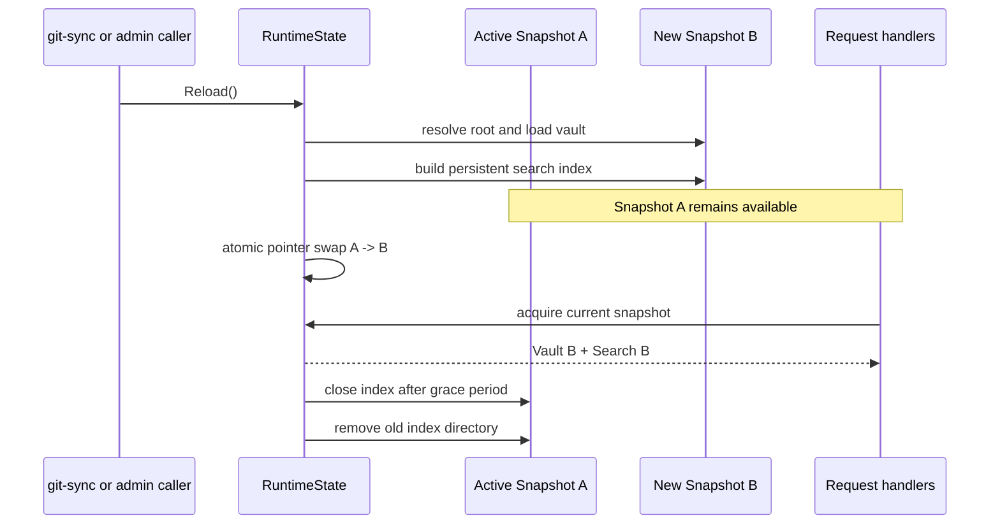
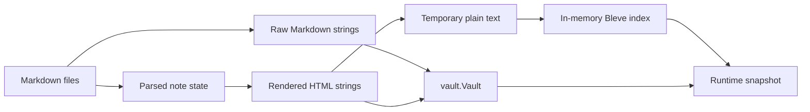
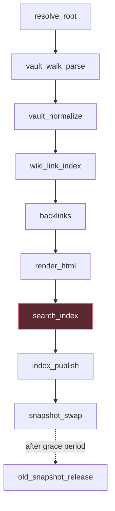
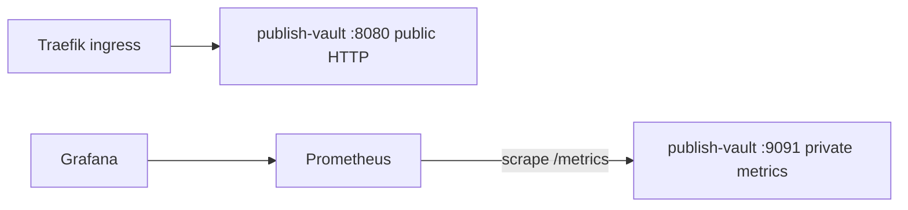

# Publish Vault Memory Optimization: From OOM Incidents to Phase-Attributed Baselines

publish-vault loads an Obsidian vault into an immutable runtime snapshot, renders note content, builds a Bleve full-text index, and atomically replaces the active snapshot on reload. This architecture protects readers from partial state. It also creates a precise memory problem: the process must construct expensive derived state while the previous snapshot may still be serving requests.

The memory work progressed through two distinct generations. The first removed raw Markdown from the hot note model, decoupled search input from rendered HTML, and moved Bleve from the Go heap to per-snapshot persistent indexes. The second created a reusable measurement package, instrumented every load and index phase, and measured the current 3,395-note workload repeatedly. The result is not yet a completed optimization of index construction. It is a reliable attribution: persistent indexing approximately halves peak heap and RSS relative to in-memory indexing, and `search_index` remains the dominant phase at a median 391 MB heap and 483 MB RSS.

> [!summary]
> - Atomic snapshot replacement is a correctness invariant and a source of transient overlap; optimization must preserve it.
> - Persistent Bleve indexing reduced the current workload from 830 MB to 391 MB peak heap and from 924 MB to 483 MB peak RSS.
> - Vault parsing and HTML rendering are not the current dominant peak. `search_index` is, across all persistent baseline runs.
> - The next optimization must attribute allocations and object lifetimes inside search document generation and Bleve indexing, then change one proven cause at a time.

## 1. Runtime responsibilities

The runtime has three forms of state:

1. The source checkout contains Markdown and assets. It remains the source of truth.
2. `vault.Vault` contains parsed note metadata, links, backlinks, rendered HTML, normalized lookup indexes, and source paths.
3. `search.Index` contains the derived full-text index used by query endpoints.

`pkg/server/runtime.go` binds the vault and search index into one `Snapshot`:

```go
type Snapshot struct {
    Revision     string
    ResolvedRoot string
    Vault        *vault.Vault
    Search       *search.Index
    IndexDir     string
    BuiltAt      time.Time
}
```

Request handlers obtain a matching vault and index from the active snapshot. Reload constructs a complete next snapshot, swaps it under synchronization, and releases the old snapshot after a grace period.



The invariant is:

```text
Every request observes one snapshot S.
All note lookup and search for that request use S.Vault and S.Search.
```

An optimization that mutates one shared search index in place or publishes a partially built snapshot would reduce memory by weakening correctness. That is not an acceptable trade.

## 2. The original high-memory representation

The early note model retained both rendered HTML and raw Markdown. Search stripped text back out of rendered HTML and inserted documents into `bleve.NewMemOnly`. The process therefore held several corpus-sized representations at once:



Reload amplified the cost:

```text
steady state:
    Vault A + InMemoryBleve A

during reload:
    Vault A + InMemoryBleve A + Vault B + InMemoryBleve B
```

This produced production OOM kills even when the runtime was correct and the node itself still had memory. The app container crossed its cgroup limit during startup or reload and exited with code 137.

## 3. The first optimization generation

The earlier RETRO-MEMORY-012 work changed representation ownership before changing operational limits.

### 3.1 Read raw Markdown on demand

Raw Markdown was removed from the hot `Note` model. The API reads source only when a client explicitly requests raw content. `Vault.ReadRaw` uses a rooted filesystem open and validates a vault-relative Markdown path.

This removed one complete retained source representation from steady-state heap while preserving copy, raw-view, and download behavior through a dedicated endpoint.

### 3.2 Build search documents from source semantics

Search was decoupled from rendered HTML. `vault.SearchDocument` became a dedicated representation:

```go
type SearchDocument struct {
    Slug    string
    Title   string
    Body    string
    Tags    []string
    Excerpt string
}
```

`Vault.SearchDocument` reads the note source and derives plain text. Search no longer needs to reverse a UI representation through `stripHTML`. The API model, render cache, source storage, and search input now have separate responsibilities.

### 3.3 Persist derived search state per snapshot

Bleve moved from `bleve.NewMemOnly` to a fresh disk-backed index. Each revision is built in a private `.building` directory, closed or moved through the publication sequence, renamed to its final location, and reopened before snapshot publication.

```text
/data/search/snapshots/<revision>.building/index
    -- successful build and publication -->
/data/search/snapshots/<revision>/index
```

The index remains derived state. Markdown in Git is the source of truth; a failed or corrupt index can be discarded and rebuilt. No relational database or migration lifecycle was introduced because the workload did not require one.

### 3.4 Serialize reloads

Two overlapping rebuilds had previously measured a 3,849 MiB peak RSS against a 1,536 MiB limit and slowed each other by roughly three times. `RuntimeState.Reload` now serializes complete rebuilds. An unchanged symlink target skips rebuilding entirely.

These changes removed avoidable multiplicative costs without changing public search behavior.

## 4. Why another measurement pass was necessary

An earlier 890-note workload showed persistent indexing with much lower live Go heap and a healthy production pod around 183 MiB shortly after deployment. The current personal-vault workload is materially larger:

- 3,396 Markdown candidates;
- 3,395 published notes;
- 20,938,723 candidate source bytes;
- a different vault revision and publish blacklist;
- persistent startup around 64–97 seconds in the captured runs.

Old measurements could not establish the current peak. Heap logs at a few boundaries also could not show whether the peak occurred during parsing, rendering, Bleve document analysis, index publication, or snapshot swap.

MEASURE-001 therefore introduced a separate package and then embedded it into publish-vault. The integration preserves the existing health JSON fields while adding a more complete, content-free timeline.

## 5. Phase instrumentation

`pkg/server/measurement.go` maps application lifecycle truth into generic measure phases. The current finite phase registry is:

```text
resolve_root
vault_walk_parse
vault_normalize
wiki_link_index
backlinks
render_html
search_index
index_publish
snapshot_swap
old_snapshot_release
```

The load path is:



The vault loader reports bounded progress through `vault.LoadObserver` and `vault.LoadProgress`. It records stage, processed and total notes, processed and total source bytes. The search layer reports `IndexProgress` with processed documents, total documents, and content-free indexed bytes.

```go
type IndexProgress struct {
    ProcessedDocuments uint64
    TotalDocuments     uint64
    IndexedBytes       uint64
}

type Options struct {
    ObserveIndexed func(IndexProgress)
}
```

`indexVault` obtains one search document at a time through `Vault.ForEachSearchDocument`, indexes it, then advances progress. The callback does not include note titles, paths, slugs, Markdown, or rendered content.

`runtimeMeasurement` fans each event into:

- an in-memory Prometheus exporter;
- optional schema-v1 JSONL;
- a terminal JSON receipt written atomically.

Old-snapshot release uses a trace-only run. It does not update the single active Prometheus run state asynchronously after a later reload has begun. This distinction prevents lifecycle overlap from corrupting current metrics.

## 6. Private operational exposure

The CLI adds:

```text
--metrics-addr
--metrics-environment
--measure-trace-dir
--measure-interval
```

The metrics listener has its own mux and exposes only `GET /metrics`. It is never mounted on the public application router. `pkg/server/metrics.go` returns a bounded shutdown function and rejects missing handlers. pprof remains a separate private facility because heap profiles can contain source content and secrets.

A production topology is:



The private metrics port should be reachable only by the cluster monitoring path. It should not be added to public ingress.

## 7. The baseline workload

The retained baseline identifies the workload without retaining content:

```json
{
  "published_notes": 3395,
  "markdown_candidates": 3396,
  "candidate_source_bytes": 20938723,
  "vault_base_commit": "205c98b09e6483cc1aeb38a8feb2859021fc6af1",
  "publish_config_sha256": "71aaabb3e1f857e12e5453b19ba9fe39b2c49900cba07e1d5c5346a25419e84b"
}
```

The traces permit only these progress attributes:

```text
processed_notes
processed_bytes
total_bytes
```

A privacy audit confirmed that retained artifacts contain no note content. The sample interval was 100 milliseconds. Three persistent runs and one in-memory comparison run were captured.

## 8. Results

### 8.1 Whole-run comparison

| Mode | Runs | Peak heap | Peak RSS | Duration |
|---|---:|---:|---:|---:|
| Persistent Bleve | 3 | **391,219,024 B median** | **482,586,624 B median** | **68.26 s median** |
| In-memory Bleve | 1 | 830,169,376 B | 924,225,536 B | 65.53 s |

The in-memory-to-persistent ratios are:

```text
heap: 2.122x
RSS:  1.915x
```

Equivalently, persistent indexing reduced this observed run by approximately:

```text
heap reduction = 1 - 391,219,024 / 830,169,376 = 52.9%
RSS reduction  = 1 - 482,586,624 / 924,225,536 = 47.8%
```

The persistent mode is therefore the correct default for this workload. It roughly halves peak process memory without changing search semantics.

### 8.2 Phase attribution

Persistent medians show the step change:

| Phase | Median peak heap | Median peak RSS | Median duration |
|---|---:|---:|---:|
| `resolve_root` | 4.9 MB | 44.5 MB | 0.19 s |
| `vault_walk_parse` | 65.9 MB | 126.4 MB | 12.85 s |
| `vault_normalize` | 60.6 MB | 126.4 MB | 0.01 s |
| `wiki_link_index` | 69.5 MB | 127.0 MB | 0.18 s |
| `backlinks` | 67.1 MB | 130.5 MB | 0.08 s |
| `render_html` | 122.9 MB | 184.7 MB | 1.53 s |
| `search_index` | **391.2 MB** | **482.6 MB** | **53.47 s** |
| `index_publish` | 122.5 MB | 294.1 MB | 0.05 s |
| `snapshot_swap` | 108.3 MB | 254.4 MB | 0.03 s |

The conclusion is narrow and strong:

```text
The current dominant memory and time phase is search_index.
Vault parsing and rendering are not the first optimization target.
```

The heap falls sharply before or during index publication, while RSS remains higher. That difference is consistent with released Go objects, retained runtime arenas, and/or resident file-backed index pages. It is not sufficient to assign exact byte categories without profiles and smaps checkpoints, but it identifies where those captures should occur.

### 8.3 Run-to-run variation

Persistent peak RSS ranged from 432,971,776 to 485,199,872 bytes. Peak heap ranged from 358,721,160 to 397,395,808 bytes. Search-index duration ranged from 47.90 to 81.37 seconds.

This variation is why one run should not set a tight regression threshold. The three-run median establishes a useful baseline, while generated-fixture tests provide deterministic CI protection at smaller scale.

## 9. Generated-fixture budgets

The private personal vault cannot be a CI fixture. `pkg/server/memory_budget_test.go` creates generated notes, runs the same recorder path, reads the trace with `measure/pkg/trace`, reduces it through `measure/pkg/report`, and evaluates thresholds with `measure/pkg/budget`.

The budget file is:

```text
pkg/server/testdata/generated-fixture-memory-budget.json
```

This test has two purposes:

1. Detect large memory regressions in a repeatable public workload.
2. Exercise the complete trace → summary → budget path used by local baselines.

It is not calibrated to predict the personal vault's exact RSS. Fixture and production baselines serve different roles and should remain separate.

## 10. What remains unknown inside `search_index`

The current phase boundary is still broad. It includes, per note:

1. reading raw Markdown through `Vault.ReadRaw`;
2. deriving plain text through parser logic;
3. allocating `vault.SearchDocument` strings and tag slices;
4. flattening tags into a new string;
5. allocating `noteDoc`;
6. running Bleve analysis, tokenization, postings construction, segment buffering, and persistence;
7. committing data according to Bleve's internal indexing path.

The current code indexes one document at a time:

```go
return v.ForEachSearchDocument(func(doc vault.SearchDocument) error {
    if err := index.Index(doc); err != nil {
        return err
    }
    progress.ProcessedDocuments++
    progress.IndexedBytes += contentFreeSize(doc)
    observe(progress)
    return nil
})
```

`Index` then creates another document representation:

```go
bleveDoc := noteDoc{
    Title:   doc.Title,
    Body:    doc.Body,
    Tags:    strings.Join(doc.Tags, " "),
    Excerpt: doc.Excerpt,
}
return si.idx.Index(doc.Slug, bleveDoc)
```

`ForEachSearchDocument` avoids retaining a complete slice of plaintext documents. That establishes streaming at the application iteration boundary. It does not establish that Bleve's internal writer has bounded retained state, that source and rendered representations have optimal lifetimes, or that all mapping fields need their current storage/index settings.

## 11. The next investigation

The next ticket, `PV-MEM-002`, should begin with attribution rather than code changes.

### 11.1 Capture profiles at controlled points

Capture heap profiles at:

- immediately before `search_index`;
- after a fixed progress fraction, such as 25%, 50%, and 75%;
- at or near the measured heap peak;
- immediately after indexing returns;
- after index publication and a natural GC cycle.

Record the same run identity and progress in the profile filename or a separate manifest. Do not place vault content, absolute private paths, or unbounded revisions in Prometheus labels.

### 11.2 Establish retained types and allocation sites

Use pprof to answer:

- Which types dominate `inuse_space` at the peak?
- Which call paths dominate `alloc_space`?
- Does retained memory belong to publish-vault search documents, Bleve analysis tokens, scorch/zap segment builders, caches, or unrelated vault state?
- Does memory drop when indexing completes, and if so, how much remains in heap versus RSS?

### 11.3 Inspect object lifetime overlap

Construct a lifetime inventory for:

```text
raw source bytes
plain-text body
rendered HTML
SearchDocument
noteDoc
token streams
Bleve segment buffers
active old snapshot
new snapshot under construction
file-backed index pages
```

For each representation, identify creation, last use, owner, and release condition. The objective is not to remove every copy. It is to remove corpus-proportional overlap that is not required for correctness.

### 11.4 Test one hypothesis at a time

Potential experiments include:

- tune Bleve batch size and compare peak versus duration;
- use explicit bounded `bleve.Batch` commits if current per-document behavior causes undesirable internal accumulation;
- review mapping fields for unnecessary storage, term vectors, or duplicate indexing;
- remove redundant temporary conversions such as manual tag concatenation;
- release or avoid source-derived intermediate strings earlier;
- split search document extraction from indexing only if measurement proves that overlap is causal;
- inspect whether the selected Bleve backend offers writer or segment options appropriate for this workload.

These are hypotheses, not approved changes. The profile evidence must choose the first implementation target.

## 12. Correctness gates for every optimization

A lower peak is not a successful change if it alters the published vault or search contract.

Every experiment must preserve:

- exactly 3,395 published notes for the pinned workload and publish config;
- successful indexing of all 3,395 documents;
- stable title/body/tag/excerpt search behavior;
- fuzzy, prefix, and tag-query semantics;
- no stale deleted-note results after reload;
- atomic vault/search snapshot matching;
- cleanup of old persistent index directories;
- failed-build rollback to the old active snapshot;
- serialized reload behavior;
- content-free measurement artifacts;
- generated-fixture budget and integration tests.

Search equivalence should use a deterministic query corpus and compare normalized hit IDs, ordering where contractual, fields, and result limits between baseline and candidate indexes.

## 13. Success criteria

The current median is:

```text
peak heap: 391,219,024 bytes
peak RSS:  482,586,624 bytes
```

A useful initial target is a reproducible median RSS below 400 MB, with 300–350 MB as a stronger outcome if profiles identify removable retention. The ticket should not assume that target is achievable without evidence.

Required proof should include:

1. At least three comparable persistent-index runs before and after.
2. The same vault revision, blacklist hash, note count, byte count, binary configuration, and sample interval.
3. Absolute and percentage changes for run and `search_index` peaks.
4. Duration and throughput changes.
5. Search and snapshot correctness equivalence.
6. Updated generated-fixture budget only after observed headroom is stable.
7. A content/privacy audit of retained traces and reports.

A result that reduces RSS by 5% while doubling indexing time may not be operationally worthwhile. The report must show both dimensions.

## 14. Operational implications

A 483 MB process RSS is much better than 924 MB, but it is still close to a 512 MiB class resource envelope. Kubernetes rollout may briefly require both old and new pods, and the node also hosts system components and other workloads. Container limits, pod requests, node allocatable memory, runtime arenas, file cache, SSR, and sidecars require headroom beyond the measured median.

Raising a pod limit can unblock scheduling or prevent an immediate OOM, but it is capacity configuration, not proof that index construction is efficient. Lowering limits before the new optimization is proven would be equally premature.

Private metrics should be enabled in-cluster so startup and reload can be observed, but Prometheus should not become the only source of optimization evidence. Its scrape interval may miss short peaks, and its bounded label model intentionally omits run identity. Content-free JSONL and receipts remain the comparison artifacts.

## 15. Failures that shaped the implementation

The process established several engineering rules:

- Two concurrent reload builds reached 3,849 MiB RSS. Reload serialization is mandatory.
- A persistent index must be fresh per snapshot; reusing a mutable directory risks stale deleted documents and revision mismatch.
- A disk-backed index can reduce heap while retaining file-backed RSS. Heap-only conclusions are incomplete.
- Metrics and pprof require private listeners. Profiles may contain document text.
- Asynchronous old-snapshot release must not overwrite the current Prometheus run state.
- Measurement shutdown must be bounded; server termination cannot wait forever on an HTTP listener.
- Real-vault artifacts must be audited for content and identifiers before retention.

## 16. Files to read

The current implementation is in `/home/manuel/workspaces/2026-08-25/publish-vault-mem/publish-vault`:

1. `pkg/server/runtime.go` — snapshot construction, reload serialization, index publication, swap, and release.
2. `pkg/server/measurement.go` — measure recorder adapter, phase mapping, traces, receipts, and progress.
3. `pkg/server/metrics.go` — private metrics listener and bounded shutdown.
4. `pkg/server/server.go` — runtime and metrics wiring.
5. `cmd/retro-obsidian-publish/commands/serve/serve.go` — CLI configuration.
6. `pkg/vault/vault.go` — note model, staged loading, progress, search-document streaming, raw reads.
7. `pkg/search/search.go` — Bleve mapping, persistent/in-memory constructors, document indexing, and query semantics.
8. `pkg/server/measurement_test.go` — phase, receipt, metrics, failure, release, and listener tests.
9. `pkg/server/memory_budget_test.go` — generated-fixture budget integration.
10. `pkg/server/testdata/generated-fixture-memory-budget.json` — reviewed thresholds.

Measurement evidence is in:

```text
/home/manuel/workspaces/2026-08-25/publish-vault-mem/measure/
  ttmp/2026/08/25/MEASURE-001--standalone-process-memory-measurement-local-optimization-and-metrics-toolkit/
    artifacts/phase5-baseline/
    scripts/12-run-publish-vault-baseline.sh
    scripts/13-summarize-publish-vault-baseline.py
    reference/01-investigation-diary.md
```

Relevant implementation commits are:

```text
measure:
  e699821  standalone measurement CLI
  0bdb79b  bounded Prometheus exporter and dashboard

publish-vault:
  4d597ac  instrument memory lifecycle and add budgets
  83bb1f2  bound private metrics shutdown
  e1d1d0d  merged PR #24
```

## 17. Working rules for the next optimization

- Preserve atomic snapshot replacement and serialized reloads.
- Use persistent Bleve as the baseline; do not return to in-memory indexing for the real vault.
- Profile before refactoring the broad `search_index` phase.
- Change one allocation or lifetime hypothesis at a time.
- Compare at least three runs under the same workload identity.
- Report heap, RSS, cgroup memory, duration, throughput, and correctness together.
- Do not retain private vault content in traces, profiles intended for publication, test fixtures, or Prometheus labels.
- Tighten budgets only after repeated evidence establishes stable headroom.

## Closing

The optimization process has reached a well-defined boundary. The system no longer relies on an in-memory full-text index, and the current persistent design reduces peak memory by roughly half. The remaining peak is not distributed evenly across vault loading. It is concentrated in `search_index`, where median heap rises from approximately 123 MB after rendering to 391 MB and median RSS reaches 483 MB.

That attribution changes the next task. The question is no longer whether vault parsing, backlinks, rendering, or index publication should be optimized first. The next task is to identify which search-index representations and Bleve internals retain memory at the peak, preserve the runtime's snapshot invariants, and prove a lower bound with repeated content-free traces and search equivalence tests.
