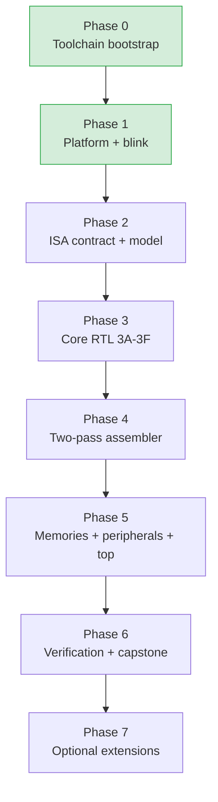
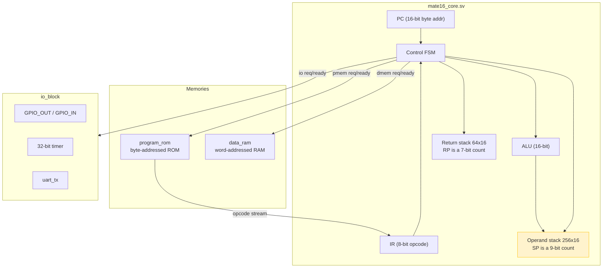

# MATE-16 VM CPU on the GateMateA1-EVB

This project builds a bytecode virtual machine directly in FPGA logic on the Olimex GateMateA1-EVB. The target architecture is a stack-oriented teaching processor called MATE-16, specified by a course text kept in the repository at `sources/Building_a_VM_CPU_on_the_Olimex_GateMateA1-EVB.md`. The project uses only open-source tools: Yosys for synthesis, nextpnr-himbaechel for place and route, gmpack for bitstream construction, and openFPGALoader for board configuration. The project is currently at the end of its platform phase: the toolchain is installed and verified, a blink design synthesizes, places, routes, packs, and loads, and the onboard LED blinks. The next phase defines the instruction set contract and an executable reference model before any processor RTL is written.

> [!summary]
> The project has three identities that determine how work proceeds:
> 1. a faithful implementation of a prescriptive course text, where the architecture is a contract rather than an invention
> 2. a hardware/software co-design, where the assembler, the executable model, the RTL, and the tests all derive from one shared opcode table
> 3. a verification-first build, where a partially verified processor is never carried to hardware

## Why this project exists

A virtual-machine instruction set is an abstract contract. It defines operations such as "push this constant," "add the two top values," and "branch if zero." That contract can be implemented by a software interpreter running on an existing processor, by a just-in-time compiler that translates bytecode into native instructions, or by digital logic that executes the bytecode semantics directly. This project uses the third approach. There is no hidden processor interpreting MATE-16 instructions. The FPGA fabric contains the program counter, the instruction register, the stacks, the arithmetic unit, the state machine, the memories, and the peripheral interfaces.

The project exists because the difference between these three implementations is the difference between understanding a machine and using one. A student who implements the bytecode directly in logic must understand the entire machine: the encoding, the stack discipline, the fault model, the memory transaction protocol, and the retirement semantics. A student who writes an interpreter does not. The course text is explicit about this: the processor is not considered complete merely because an LED blinks. The demonstration must be traceable to bytecode fetched and executed by the student-designed processor.

## Current project status

The repository is at the boundary between Phase 1 and Phase 2 of a seven-phase plan. Phase 0 established the toolchain. Phase 1 established a reproducible open-source flow and proved it with a blink design on physical hardware.

What already exists:

- the OSS CAD Suite toolchain at `~/fpga/oss-cad-suite/`, version `20260825`
- a project skeleton at `mate16/` with the directory structure the course text mandates
- a working `Makefile` with `versions`, `sim`, `synth`, `pnr`, `bit`, and `load` targets
- a configuration-derived reset synchronizer, a blink top level, a simulation model of the board reset primitive, and a self-checking testbench
- a clean Yosys synthesis, a clean nextpnr place-and-route, a packed bitstream, and a loaded design that blinks the onboard LED

What does not yet exist:

- the MATE-16 instruction set contract as an executable opcode table
- the executable reference model in Python
- the processor RTL
- the two-pass assembler
- the memories, the I/O block, and the UART transmitter
- the directed, differential, and randomized test suites
- the requirements-verification matrix

## Project shape

The project is organized into seven phases, where each phase has a concrete exit criterion and no phase begins before the previous phase's exit criterion passes.



The phases are ordered by dependency, not by chapter. The course text interleaves software and hardware concerns within chapters, but a working build requires the contract and the model before the RTL, and the assembler before end-to-end system simulation. The decision to reorder is deliberate: an executable model that is independent of the RTL is a verification oracle, and debugging RTL against an oracle is cheaper than debugging RTL against hardware.

## Architecture

The final baseline system has a 16-bit stack-oriented data path, byte-addressed program memory and word-addressed data memory, an 8-bit opcode space with little-endian immediate operands, a multi-cycle non-pipelined control unit, separate operand and return stacks, deterministic fault handling, GPIO, a timer, and an optional UART transmitter. The baseline uses only the FPGA's internal block RAM. The board's external PSRAM, VGA, and PS/2 are treated as extensions and are out of scope until the baseline regressions pass.



The three interfaces — program memory, data memory, and I/O — are separate rather than combined into one general bus. The course text argues this directly: separate interfaces reduce decoder complexity and clarify fault ownership. A single general bus would force the decoder to multiplex address spaces, and a fault on one space would be harder to attribute. Separate interfaces also let each target have its own width and latency contract.

## Implementation details

### The toolchain and the source-to-board flow

The OSS CAD Suite is a single self-contained tarball that bundles every tool the flow requires. The relevant fact is that no separate Cologne Chip installation is needed: the suite includes `synth_gatemate` in Yosys, the GateMate chip database in nextpnr-himbaechel, and gmpack, the GateMate bitstream packer. The verification step that confirms this is direct — each program prints its version and its location under the suite's `bin/` directory.

```text
yosys           -> /home/manuel/fpga/oss-cad-suite/bin/yosys          (Yosys 0.68+130)
nextpnr-himbaechel -> .../bin/nextpnr-himbaechel                      (nextpnr-0.11.1-9)
gmpack          -> .../bin/gmpack                                     (gmpack v1.13-6)
openFPGALoader  -> .../bin/openFPGALoader                             (v1.1.1)
iverilog        -> .../bin/iverilog                                   (14.0)
verilator       -> .../bin/verilator                                  (5.051)
```

The build pipeline moves through six stages. Each stage has a distinct responsibility and a distinct artifact. The stages are not interchangeable, and a failure in one stage cannot be diagnosed by looking at a later stage's output.


The Yosys command uses `-luttree` and `-nomx8` because the Cologne Chip quickstart requires them for the `synth_gatemate` pass. The nextpnr command uses `--router router2` for the same reason. These flags are not optional styling. They are the documented configuration for the current GateMate flow, and omitting them produces a build that may complete but is not the supported path.

### The reset discipline

The first design decision in the project is the reset discipline. The GateMate FPGA provides a primitive called `CC_USR_RSTN` whose active-low output indicates the end of configuration. The course text uses this primitive for reset control. The discipline is to assert reset asynchronously and release it synchronously in the system clock domain.

```systemverilog
module reset_sync (
    input  logic clk,
    input  logic arst_n,
    output logic rst_n
);
    logic [1:0] pipe;

    always_ff @(posedge clk or negedge arst_n) begin
        if (!arst_n)
            pipe <= 2'b00;
        else
            pipe <= {pipe[0], 1'b1};
    end

    assign rst_n = pipe[1];
endmodule
```

The two flip-flops do not make an asynchronous input safe for arbitrary data transfer. Their job is narrow and specific: they provide a controlled, synchronous reset release. During configuration, `arst_n` is low and `pipe` holds `2'b00`, so `rst_n` is low and every state element in the design is held in reset. After configuration, `arst_n` goes high, and on each rising clock edge the pipeline shifts in a `1`. After two edges, `rst_n` goes high. The result is that reset deasserts on a rising clock edge, and every register in the design starts from a defined state on the same edge.

This matters because of a property that is easy to miss. A design that asserts and deasserts reset asynchronously can violate setup time at the deassertion edge. Two registers released by the same async reset can come out of reset on different edges if their clock-to-reset-release paths differ by even a small skew. The two-stage synchronizer removes that race by quantizing the release to a specific clock edge.

### The blink top level

The blink design is intentionally minimal. Its purpose is not to compute anything. Its purpose is to prove five things independently: that the clock pin is correct, that the LED pin is correct, that the toolchain accepts the constraints, that the FPGA can be configured through the RP2040 bridge, and that the evidence workflow is operational.

```systemverilog
module blink_top #(
    parameter int LED_BIT = 23
) (
    input  logic clk_10m,
    output logic user_led
);
    logic cfg_rst_n;
    logic rst_n;
    logic [23:0] counter;

    CC_USR_RSTN u_cfg_reset (.USR_RSTN(cfg_rst_n));
    reset_sync  u_reset_sync (.clk(clk_10m), .arst_n(cfg_rst_n), .rst_n(rst_n));

    always_ff @(posedge clk_10m) begin
        if (!rst_n) counter <= '0;
        else       counter <= counter + 24'd1;
    end

    assign user_led = counter[LED_BIT];
endmodule
```

The counter is 24 bits and the LED is driven from bit 23. At a 10 MHz clock, bit 23 toggles every 2^23 cycles, which is 0.839 seconds. The LED blinks at roughly 0.6 Hz, which is visible. The `LED_BIT` parameter exists so the testbench can override it to a low bit and observe a toggle in microseconds of simulation time rather than waiting nearly a second. This parameterization is a small but important habit: a test that depends on observing physical-scale timing is a slow and brittle test.

### The constraint files

The constraint file maps logical signal names to physical pin locations. The signal names must match the top-level RTL ports exactly. A misspelled or stale port name is treated as a build failure, not ignored, because a misspelled output can be optimized away by the synthesizer while the tools still generate a valid bitstream. A valid bitstream that drives the wrong pin is worse than a build error, because it fails silently.

```text
Pin_in  "clk_10m"  Loc = "IO_SB_A8" | SCHMITT_TRIGGER=true;
Pin_out "user_led" Loc = "IO_SB_B6";
```

The clock is at `IO_SB_A8` and the LED is at `IO_SB_B6`. These are the assignments from the official Olimex blinking example. The clock pin uses a Schmitt trigger because the 10 MHz oscillator is a board-level input and Schmitt triggering cleans up its edges.

The timing constraint makes the clock objective explicit. A 10 MHz clock has a 100 ns period. The SDC file states this directly:

```tcl
create_clock -name clk_10m -period 100.000 [get_ports clk_10m]
```

Even though 10 MHz is modest, stating the constraint is not optional. A build without a clock constraint has no timing objective, and nextpnr cannot report whether the design meets its target. A passing build with an unconstrained clock is a build whose timing is unknown.

### The simulation model of a board primitive

An open simulator does not know the behavior of every GateMate primitive. `CC_USR_RSTN` is a configuration primitive, not a synthesizable register, and the simulator has no model for it. The solution is to provide a simulation-only model that mimics the primitive's observable behavior: low during and after configuration, then high.

```systemverilog
`timescale 1ns/1ps
module CC_USR_RSTN (output logic USR_RSTN);
    initial begin
        USR_RSTN = 1'b0;
        #250;
        USR_RSTN = 1'b1;
    end
endmodule
```

This file is not compiled during synthesis. The synthesizer provides the real primitive. The model exists only so the testbench can exercise the reset synchronizer without a board. The 250 ns delay models the configuration window. The testbench runs the clock past that window, past the two synchronizer stages, and then checks that internal reset has deasserted and that the counter is incrementing once per edge.

### What the synthesis and place-and-route reports prove

The Yosys statistics report confirms that the synthesizer mapped the design onto the intended GateMate primitives. The mapping is the evidence that the design was built from the intended cells, not optimized into something else.

| Cell | Count | Role |
|---|---:|---|
| `CC_USR_RSTN` | 1 | Configuration reset primitive |
| `CC_IBUF` | 1 | Clock input buffer |
| `CC_OBUF` | 1 | LED output buffer |
| `CC_BUFG` | 1 | Global clock buffer |
| `CC_DFF` | 26 | Flip-flops: 24 counter bits + 2 reset pipeline |
| `CC_ADDF` | 24 | Counter incrementer adders |
| `CC_LUT2` | 24 | Incrementer carry logic |

The nextpnr log confirms three things that matter for later phases. The clock was recognized and constrained to 10 MHz. The pins were bound to the locations in the constraint file. The timing passed with positive slack.

```text
Info: constraining clock net 'clk_10m' to 10.00 MHz
Info:     Constraining '$iopadmap$blink_top.user_led' to pad 'IO_SB_B6'.
Info:     Constraining '$iopadmap$blink_top.clk_10m' to pad 'IO_SB_A8'.
Info: Max frequency for clock 'u_reset_sync.clk': 201.86 MHz (PASS at 10.00 MHz)
```

The critical path supports 201.86 MHz. The design needs 10 MHz. The slack is large, which is expected for a 24-bit counter, but the discipline of recording the slack now means that later phases — which add a processor, memories, and peripherals — can detect timing regressions against a known baseline rather than against an unknown one.

### The USB permission step

The board's programmer is an RP2040 running DirtyJTAG firmware. It appears on USB as vendor `1209`, product `c0ca`. By default, Linux creates the device node owned by `root:root`, and a user-space program cannot open it. openFPGALoader reports this as `DirtyJtag: fails to open device`. The fix is a udev rule that assigns the device to the `plugdev` group with read-write permissions.

```text
# dirtyJTAG
ATTRS{idVendor}=="1209", ATTRS{idProduct}=="c0ca", MODE="664", GROUP="plugdev", TAG+="uaccess"
```

This rule is the canonical one from the openFPGALoader repository. Installing it requires three commands: copy the file to `/etc/udev/rules.d/`, reload the rules with `udevadm control --reload-rules`, and trigger re-add with `udevadm trigger --action=add --subsystem-match=usb`. After that, the device node is `root:plugdev` and `make load` succeeds without root. This step is documented in the textbook's host-permissions section because the programming path must be verified before any processor RTL is debugged. A student who repeatedly edits RTL while the programming path is broken is debugging two unknowns at once.

## The MATE-16 contract

The instruction set is the first implementation. The course text is explicit: a processor project fails when different team members implement different machines under the same name. One person assumes subtraction means top minus next; another assumes next minus top. The assembler emits big-endian immediates while the RTL fetches little-endian. The contract prevents this by defining every architecturally visible element before any RTL is written.

### Architectural state

| State | Width | Reset | Meaning |
|---|---:|---:|---|
| `PC` | 16 bits | `0x0000` | Byte address of the next program byte |
| `IR` | 8 bits | unspecified | Most recently fetched opcode |
| Operand stack | 256 × 16 | contents unspecified | General data values |
| `SP` | 9 bits | `0` | Count of valid operand-stack entries |
| Return stack | 64 × 16 | contents unspecified | Return byte addresses |
| `RP` | 7 bits | `0` | Count of valid return-stack entries |
| `halted` | 1 bit | `0` | Machine stopped intentionally |
| `faulted` | 1 bit | `0` | Machine stopped by a fault |
| `fault_code` | 8 bits | `0` | Encoded fault cause |
| `fault_pc` | 16 bits | `0` | Address of the faulting opcode |
| `instruction_count` | 32 bits | `0` | Retired instruction count |

Two details in this table are not arbitrary. First, `SP` is 9 bits, not 8. An 8-bit count cannot distinguish an empty stack (0) from a full stack (256) at depth 256, because both values map to the same 8-bit pattern after masking. A 9-bit count removes that ambiguity. Second, the stack contents are unspecified at reset. Resetting 256 sixteen-bit words adds logic, slows the reset path, and can prevent block RAM inference. The pointers are reset; the memory behind them is not, because the pointers make the contents inaccessible until they are written.

### Encoding and the operand order convention

MATE-16 uses an 8-bit opcode. Most instructions are one byte. Instructions with a 16-bit immediate are three bytes, encoded little-endian: low byte first, then high byte. The program counter addresses bytes, not words. A 16-bit target such as `0x1234` is emitted as the bytes `34 12`.

The stack effect notation is Forth-style. The text `( a b -- r )` means `b` is the top stack item, `a` is immediately below it, the instruction consumes both, and `r` becomes the new top item. This notation matters because it fixes operand order. For subtraction, `( a b -- a-b )` means the result is the next item minus the top item. A team that does not fix this convention will implement both orderings and find the divergence only during differential testing.

### The fault model

A fault is precise when all instructions before the fault have committed and the faulting instruction has made no partial architectural update. Precise faults are the reason the machine is debuggable. On a fault, the machine sets `halted` and `faulted`, records `fault_code` and `fault_pc`, and restores `PC` to the address of the faulting opcode. The restoration is what makes the stopped state restartable by a future debugger.

The fault codes are a closed set.

| Code | Name | Cause |
|---:|---|---|
| `00` | `FAULT_NONE` | No fault |
| `01` | `FAULT_ILLEGAL_OPCODE` | Unassigned opcode |
| `02` | `FAULT_STACK_UNDERFLOW` | More operands required than available |
| `03` | `FAULT_STACK_OVERFLOW` | Push when the stack is full |
| `04` | `FAULT_RETURN_UNDERFLOW` | `RET` with an empty return stack |
| `05` | `FAULT_RETURN_OVERFLOW` | `CALL` with a full return stack |
| `06` | `FAULT_BUS` | A memory or I/O target returned an error |
| `07` | `FAULT_TIMEOUT` | Optional watchdog expired |
| `08` | `FAULT_INTERNAL` | An impossible state detected in hardware |

The precise-fault discipline has direct consequences for the RTL. `STORE` with a bus error must not pop its operands. `OUT` must not pop its value until the I/O target acknowledges. `CALL` with a full return stack must not change `PC` to the target. An illegal opcode must not modify either stack. The implementation enforces these by capturing all the fields a transaction needs before the transaction enters its wait state, and by committing the architectural update only after the transaction succeeds.

### The held-request bus contract

The core uses three request/ready interfaces: program memory, data memory, and I/O. Only one transaction may be outstanding at a time. The protocol is a held-request protocol, not a pulsed one.

```text
1. The requester asserts req and presents stable address, direction, and write data.
2. The requester holds those signals until a rising clock edge on which ready is 1.
3. For a read, rdata is sampled on that edge.
4. error is sampled only with ready.
5. The requester deasserts req in the next state.
6. The target must not require a second request pulse for the same transaction.
```

The reason this contract is held rather than pulsed is latency-agnosticism. A target may respond after one cycle or after many cycles. The same core must work with a one-cycle block RAM and with a slower external memory controller. A pulsed contract would force the requester to re-issue the request every cycle, and a target that completed on a cycle where the pulse was absent would drop the transaction.

The contract has one failure mode that the course text calls out as the most common integration bug: a target that re-accepts a held request. If the target latches a write on every cycle where `req` is high, a request held for ten cycles produces ten writes. The UART byte is transmitted ten times. The symptom is a terminal showing doubled or decupled letters. The fix is structural: the target captures the port, direction, and write data once, performs the side effect once, and derives strobe signals from a single-cycle acceptance edge, not from `req` directly.

## Verification strategy

The project defines "done" as a set of claims that can be disproved. A green test count without a requirements map can hide untested behavior. A requirement with no evidence is explicitly incomplete.

```text
REQ-RESET-01   After reset release, PC=0, SP=0, RP=0, and no fault is set.
REQ-ISA-ADD-01 ADD replaces NOS/TOS with their 16-bit wrapping sum.
REQ-FAULT-03   A failing STORE leaves both operands and data memory unchanged.
REQ-BUS-02     Request payload remains stable while req=1 and ready=0.
REQ-IO-04      One retired OUT to GPIO_OUT changes the register exactly once.
REQ-HALT-01    A halted or faulted core issues no memory or I/O requests.
REQ-BUILD-01   A clean checkout regenerates the selected program bitstream.
REQ-HW-01      The onboard LED is controlled by bytecode through GPIO_OUT.
```

Each requirement maps to at least one test, assertion, review item, or hardware observation. The tests are organized as a pyramid, from fastest and most numerous to slowest and fewest.

| Layer | Scope | Oracle |
|---|---|---|
| Pure software unit tests | opcode metadata, parsing, the reference model | explicit values and invariants |
| RTL module tests | core, ROM, RAM, I/O, UART, reset | scoreboards and assertions |
| Differential tests | retired RTL instructions | the reference model |
| System simulation | assembled bytecode through real memories and peripherals | signatures and event logs |
| Synthesis and timing | netlist, placement, timing | reports and a log gate |
| Hardware tests | configuration, pins, voltage, board behavior | observation and capture |

The pyramid is a discipline, not a preference. Hardware testing is not a substitute for simulation, because simulation offers complete visibility and repeatability. Hardware testing is not optional either, because it covers configuration, clocks, pin assignments, and board-specific behavior that a simulator does not reproduce. The fast suites are kept independent of the FPGA toolchain so they run frequently. A full synthesis should not be required to discover that the assembler encoded a branch incorrectly.

## Important project docs

The repository holds a docmgr ticket that carries the full phased plan, the investigation diary, the task checklist, and the toolchain install playbook.

- `/home/manuel/code/wesen/2026-08-25--vm-cpu-gatemate/sources/Building_a_VM_CPU_on_the_Olimex_GateMateA1-EVB.md` — the course text, the single source of truth for the architecture
- `ttmp/2026/08/25/MATE16-VM-CPU--build-a-mate-16-bytecode-vm-cpu-on-the-olimex-gatematea1-evb-fpga/design-doc/01-mate-16-vm-cpu-implementation-plan-and-phases.md` — the seven-phase plan with decision records and exit criteria
- `ttmp/2026/08/25/MATE16-VM-CPU--build-a-mate-16-bytecode-vm-cpu-on-the-olimex-gatematea1-evb-fpga/reference/01-investigation-diary.md` — the chronological investigation diary
- `ttmp/2026/08/25/MATE16-VM-CPU--build-a-mate-16-bytecode-vm-cpu-on-the-olimex-gatematea1-evb-fpga/playbook/01-install-oss-cad-suite-toolchain.md` — the verified toolchain install procedure
- `mate16/Makefile` — the build system with the `versions`, `sim`, `synth`, `pnr`, `bit`, `load` targets
- `mate16/rtl/blink_top.sv` and `mate16/rtl/reset_sync.sv` — the Phase 1 hardware
- `mate16/build/tool-versions.txt` — the recorded toolchain version manifest

## Open questions

- Is the board the standard variant or the `-2M` variant with populated FPGA configuration flash? The answer determines whether `openFPGALoader -f` can write persistent configuration, or whether development must use volatile JTAG/SRAM configuration.
- Is an approved UART pin and voltage configuration provided for the course? The UART transmitter can be simulated without a pin, but a physical demonstration requires an instructor-approved pin assignment and voltage setting.
- Should the optional `BREAK` opcode (`0xF0`) be implemented in the baseline, or left illegal until a debug need appears? The default is to leave it illegal, because an unimplemented `BREAK` that is left in the table creates a fourth table that can diverge.
- Which timer read policy should the I/O block use: a snapshot register, a reread-until-stable loop, or a latch command? The snapshot policy is convenient for students and is the likely choice, but it should be decided before the I/O block is written.

## Near-term next steps

- Write `tools/opcodes.py` as the single authoritative opcode table, consumed by the assembler, the model, and the testbench.
- Write `tools/model16.py` as an executable reference model that implements every opcode, every fault, and the retirement discipline, independent of the RTL.
- Write `sim/test_opcodes.py` and `sim/test_model.py` as pure-software unit tests with hand-computed expected state.
- Verify that no processor RTL has been written before the model tests pass. The contract and the model precede the RTL by design.
- Commit the Phase 1 hardware and the docmgr ticket to the repository, and record the bitstream hash as the Phase 1 evidence.

## Project working rule

> [!important]
> Define the contract and the executable model before writing processor RTL. A partially verified processor is harder to debug in hardware than in simulation, and a model that is independent of the RTL is the cheapest verification oracle available.
