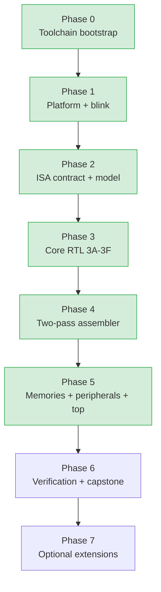
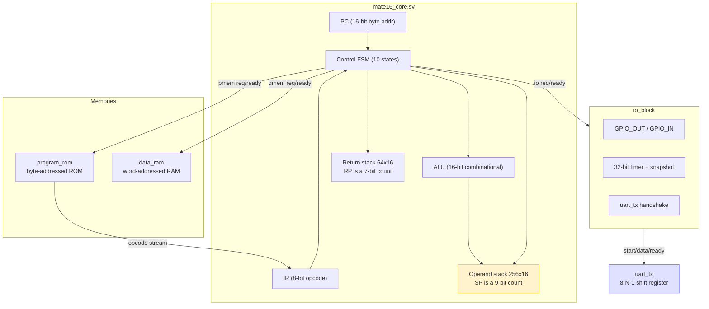

# MATE-16 VM CPU on the GateMateA1-EVB

This project builds a bytecode virtual machine directly in FPGA logic on the Olimex GateMateA1-EVB. The target architecture is a stack-oriented teaching processor called MATE-16, specified by a course text kept in the repository at `sources/Building_a_VM_CPU_on_the_Olimex_GateMateA1-EVB.md`. The project uses only open-source tools: Yosys for synthesis, nextpnr-himbaechel for place and route, gmpack for bitstream construction, and openFPGALoader for board configuration. The project is at the end of Phase 5: the toolchain is installed, a blink design blinks on hardware, the instruction set contract and an executable reference model exist, the processor core passes 44 directed and differential tests against the model, a two-pass assembler emits golden byte vectors, and the full system runs assembled bytecode end-to-end in simulation with the `selftest` program reaching the `0x600D` signature and `hello` emitting "Hi" over a simulated UART. The next phase is FPGA implementation of the full `top` and hardware bring-up of the actual processor.

> [!summary]
> The project has four identities that determine how work proceeds:
> 1. a faithful implementation of a prescriptive course text, where the architecture is a contract rather than an invention
> 2. a hardware/software co-design, where the assembler, the executable model, the RTL, and the tests all derive from one shared opcode table
> 3. a verification-first build, where a partially verified processor is never carried to hardware
> 4. a probe-and-analyzer debugging discipline, where investigation scripts that emit structured output and Python analyzers that assert invariants are saved to the ticket and reused

## Why this project exists

A virtual-machine instruction set is an abstract contract. It defines operations such as "push this constant," "add the two top values," and "branch if zero." That contract can be implemented by a software interpreter running on an existing processor, by a just-in-time compiler that translates bytecode into native instructions, or by digital logic that executes the bytecode semantics directly. This project uses the third approach. There is no hidden processor interpreting MATE-16 instructions. The FPGA fabric contains the program counter, the instruction register, the stacks, the arithmetic unit, the state machine, the memories, and the peripheral interfaces.

The project exists because the difference between these three implementations is the difference between understanding a machine and using one. A student who implements the bytecode directly in logic must understand the entire machine: the encoding, the stack discipline, the fault model, the memory transaction protocol, and the retirement semantics. A student who writes an interpreter does not. The course text is explicit about this: the processor is not considered complete merely because an LED blinks. The demonstration must be traceable to bytecode fetched and executed by the student-designed processor.

## Current project status

The repository is at the boundary between Phase 5 and Phase 6 of a seven-phase plan. Phases 0 through 5 are complete and verified in simulation; Phase 6 (FPGA implementation, timing, hardware bring-up, and the engineering report) is the next step.

What already exists:

- the OSS CAD Suite toolchain at `~/fpga/oss-cad-suite/`, version `20260825`, with all seven required tools verified
- a Phase 1 blink design that synthesizes, places, routes, packs, loads, and blinks the onboard LED on physical hardware, with a 201.86 MHz timing margin against the 10 MHz constraint
- the authoritative opcode table `tools/opcodes.py` (28 baseline opcodes, 8 fault codes) consumed by every other tool
- an executable reference model `tools/model16.py` that implements every opcode, every fault, and the retirement discipline, independent of the RTL
- the processor core `rtl/mate16_core.sv` implementing all 28 opcodes per the §2.7 FSM, with 44 directed and differential tests showing zero divergence from the model
- a two-pass assembler `tools/asm16.py` (no `eval`) producing `program.hex/.bin/.lst/.sym.json`, with 52 unit tests
- the memory and peripheral RTL (`program_rom`, `data_ram`, `io_block`, `uart_tx`) and the integrated `top.sv`
- 8 system-level tests running assembled bytecode end-to-end, plus example programs `smoke`, `selftest`, `ramtest`, `blink`, `hello`
- 12 probe and analyzer scripts in the ticket `scripts/` folder that found and now guard the two held-request handshake bugs

What does not yet exist:

- the requirements-verification matrix, the assertion suite, and the randomized-with-seeds differential campaign
- clean Yosys/nextpnr synthesis of the full `top.sv` (only the blink has been synthesized so far)
- timing closure and a resource ledger for the processor system
- hardware bring-up of the actual processor (a bytecode-driven LED), as distinct from the Phase 1 blink
- the engineering report

## Project shape

The project is organized into seven phases, where each phase has a concrete exit criterion and no phase begins before the previous phase's exit criterion passes.



The phases are ordered by dependency, not by chapter. The course text interleaves software and hardware concerns within chapters, but a working build requires the contract and the model before the RTL, and the assembler before end-to-end system simulation. The decision to reorder is deliberate: an executable model that is independent of the RTL is a verification oracle, and debugging RTL against an oracle is cheaper than debugging RTL against hardware.

## Architecture

The final baseline system has a 16-bit stack-oriented data path, byte-addressed program memory and word-addressed data memory, an 8-bit opcode space with little-endian immediate operands, a multi-cycle non-pipelined control unit, separate operand and return stacks, deterministic fault handling, GPIO, a timer, and an optional UART transmitter. The baseline uses only the FPGA's internal block RAM. The board's external PSRAM, VGA, and PS/2 are treated as extensions and are out of scope until the baseline regressions pass.



The three interfaces — program memory, data memory, and I/O — are separate rather than combined into one general bus. The course text argues this directly: separate interfaces reduce decoder complexity and clarify fault ownership. A single general bus would force the decoder to multiplex address spaces, and a fault on one space would be harder to attribute. Separate interfaces also let each target have its own width and latency contract.

## Implementation details

### The toolchain and the source-to-board flow

The OSS CAD Suite is a single self-contained tarball that bundles every tool the flow requires. The relevant fact is that no separate Cologne Chip installation is needed: the suite includes `synth_gatemate` in Yosys, the GateMate chip database in nextpnr-himbaechel, and gmpack, the GateMate bitstream packer. The verification step that confirms this is direct — each program prints its version and its location under the suite's `bin/` directory.

```text
yosys              Yosys 0.68+130            (synth_gatemate pass present)
nextpnr-himbaechel nextpnr-0.11.1-9          (gatemate chipdb, CCGM1A1)
gmpack             gmpack v1.13-6            (GateMate bitstream packer)
openFPGALoader     v1.1.1                    (board programmer)
iverilog           14.0                      (simulation)
verilator          5.051                     (simulation)
gtkwave            bundled                   (waveforms)
```

The build pipeline moves through six stages. Each stage has a distinct responsibility and a distinct artifact.


The Yosys command uses `-luttree` and `-nomx8` because the Cologne Chip quickstart requires them for the `synth_gatemate` pass. The nextpnr command uses `--router router2` for the same reason. These flags are not optional styling. They are the documented configuration for the current GateMate flow, and omitting them produces a build that may complete but is not the supported path.

### The reset discipline

The first design decision in the project is the reset discipline. The GateMate FPGA provides a primitive called `CC_USR_RSTN` whose active-low output indicates the end of configuration. The discipline is to assert reset asynchronously and release it synchronously in the system clock domain.

```systemverilog
module reset_sync (
    input  logic clk,
    input  logic arst_n,
    output logic rst_n
);
    logic [1:0] pipe;
    always_ff @(posedge clk or negedge arst_n) begin
        if (!arst_n) pipe <= 2'b00;
        else        pipe <= {pipe[0], 1'b1};
    end
    assign rst_n = pipe[1];
endmodule
```

The two flip-flops do not make an asynchronous input safe for arbitrary data transfer. Their job is narrow and specific: they provide a controlled, synchronous reset release. During configuration, `arst_n` is low and `pipe` holds `2'b00`, so `rst_n` is low and every state element is held in reset. After configuration, `arst_n` goes high, and on each rising clock edge the pipeline shifts in a `1`. After two edges, `rst_n` goes high. The result is that reset deasserts on a rising clock edge, and every register starts from a defined state on the same edge. This matters because a design that deasserts reset asynchronously can violate setup time at the deassertion edge, and two registers released by the same async reset can come out of reset on different edges if their clock-to-reset-release paths differ.

### The blink top level and what the synthesis report proves

The Phase 1 blink design is intentionally minimal. Its purpose is to prove five things independently: that the clock pin is correct, that the LED pin is correct, that the toolchain accepts the constraints, that the FPGA can be configured through the RP2040 bridge, and that the evidence workflow is operational. A 24-bit counter drives `user_led` from bit 23, blinking at roughly 0.6 Hz. The `LED_BIT` parameter lets the testbench observe a toggle in microseconds rather than waiting nearly a second.

The Yosys statistics confirm the synthesizer mapped the design onto the intended GateMate primitives: `CC_USR_RSTN`, `CC_IBUF`, `CC_OBUF`, `CC_BUFG`, 26 `CC_DFF`, 24 `CC_ADDF`, 24 `CC_LUT2`. The nextpnr log confirms the clock was constrained to 10 MHz, the pins were bound to `IO_SB_A8` and `IO_SB_B6`, and the timing passed with a max frequency of 201.86 MHz. The bitstream hashes to `8599269f…` and the LED blinks on the board. This is the Phase 1 acceptance test (§1.9) and the timing baseline against which later, denser phases measure regressions.

### The USB permission step

The board's programmer is an RP2040 running DirtyJTAG firmware. It appears on USB as vendor `1209`, product `c0ca`. By default Linux creates the device node owned by `root:root`, and openFPGALoader cannot open it. The fix is the canonical udev rule from the openFPGALoader repository, committed to the repo at `mate16/constraints/99-openfpgaloader.rules`:

```text
ATTRS{idVendor}=="1209", ATTRS{idProduct}=="c0ca", MODE="664", GROUP="plugdev", TAG+="uaccess"
```

Installing it requires three commands: copy the file to `/etc/udev/rules.d/`, reload with `udevadm control --reload-rules`, and trigger with `udevadm trigger --action=add --subsystem-match=usb`. This is a host-setup step, not a repo step, but the rule is tracked in the repo so it is reproducible.

## The MATE-16 contract

The instruction set is the first implementation. The course text is explicit: a processor project fails when different team members implement different machines under the same name. The contract prevents this by defining every architecturally visible element before any RTL is written.

### Architectural state

| State | Width | Reset | Meaning |
|---|---:|---:|---|
| `PC` | 16 bits | `0x0000` | Byte address of the next program byte |
| `IR` | 8 bits | unspecified | Most recently fetched opcode |
| Operand stack | 256 × 16 | contents unspecified | General data values |
| `SP` | 9 bits | `0` | Count of valid operand-stack entries |
| Return stack | 64 × 16 | contents unspecified | Return byte addresses |
| `RP` | 7 bits | `0` | Count of valid return-stack entries |
| `halted` / `faulted` | 1 bit each | `0` | Machine stop state |
| `fault_code` | 8 bits | `0` | Encoded fault cause |
| `fault_pc` | 16 bits | `0` | Address of the faulting opcode |
| `instruction_count` | 32 bits | `0` | Retired instruction count |

Two details are not arbitrary. `SP` is 9 bits, not 8, because an 8-bit count cannot distinguish an empty stack (0) from a full stack (256) at depth 256. And the stack contents are unspecified at reset because resetting 256 sixteen-bit words adds logic, slows the reset path, and can prevent block RAM inference; the pointers are reset, the memory behind them is not.

### The authoritative opcode table

The single source of truth for the instruction set is `tools/opcodes.py`. It defines a frozen `Instruction` dataclass and a `Fault` IntEnum, then lists all 28 baseline opcodes in one `_TABLE`. Every other tool — the assembler, the model, the testbench, the future RTL — reads this table rather than carrying its own copy. This removes the failure mode where four hand-copied tables gradually diverge.

| Range | Mnemonics | Count |
|---|---|---:|
| `0x00-0x07` | NOP, HALT, LIT, DROP, DUP, SWAP, OVER, DEPTH | 8 |
| `0x10-0x1A` | ADD, SUB, AND, OR, XOR, NOT, SHL, SHR, EQ, ULT, SLT | 11 |
| `0x20-0x21` | LOAD, STORE | 2 |
| `0x30-0x34` | JMP, JZ, JNZ, CALL, RET | 5 |
| `0x40-0x41` | IN, OUT | 2 |

The table also encodes, per opcode, the instruction length (1, 2, or 3 bytes), the immediate kind (`none`, `imm16` little-endian, or `port8`), the operand-stack precondition (`stack_in`, `stack_out`), and the return-stack precondition (`needs_ret`, `ret_free`). The optional `BREAK` opcode (`0xF0`) is left illegal by default; a team that enables it must add it here, to the assembler, the model, the tests, and the documentation simultaneously. `145` unit tests in `sim/test_opcodes.py` and `sim/test_model.py` enforce the table's invariants — completeness, uniqueness, lengths, the precondition table, and the closed fault set — in pure software in under 0.2 seconds.

### The executable reference model

`tools/model16.py` is a verification oracle, not a line-for-line copy of the RTL. It implements the architectural contract at retirement granularity: one call to `step()` retires exactly one instruction or faults. It does not model microarchitectural timing, because the RTL differential tests compare retired state, not cycle counts.

The model exposes a `Machine` dataclass holding the architectural state plus a byte-addressed program image, a word-addressed data memory, and a pluggable `IoTarget` so tests can model GPIO, the timer, and the UART precisely. Out-of-range memory and unassigned I/O ports raise a `BUS` fault with no silent aliasing, matching the contract.

The model's hardest invariant is the precise-fault stack-preservation rule (§2.12): a `STORE`, `OUT`, or `LOAD` that bus-faults must leave the operand stack byte-for-byte unchanged. The implementation handles this two ways. For `LOAD`, the address is peeked (not popped) and overwritten in place, so a bus error leaves the stack untouched. For `STORE` and `OUT`, the operands are popped only after success is implied, and on a downstream bus error the popped values are pushed back. The directed tests `test_bus_fault_load_out_of_range`, `test_bus_fault_store_out_of_range`, and `test_bus_fault_out_preserves_value` assert this directly. The model also implements the §2.14 worked trace (`lit 7; lit 5; sub; dup; lit 2; eq; jz fail; lit 0x55AA; out 0; halt`) as a single test, which is the integration check that the assembler, model, and RTL all agree on operand order.

The model is the oracle against which the RTL is judged. Writing the model before the RTL (decision record DR-4) means the RTL is debugged against an independent implementation, not against its own expectations.

### Encoding and the operand order convention

MATE-16 uses an 8-bit opcode. Most instructions are one byte. Instructions with a 16-bit immediate are three bytes, encoded little-endian: low byte first, then high byte. The program counter addresses bytes, not words. A 16-bit target such as `0x1234` is emitted as the bytes `34 12`. The stack effect notation is Forth-style: `( a b -- r )` means `b` is the top stack item, `a` is immediately below it, the instruction consumes both, and `r` becomes the new top item. This notation fixes operand order. For subtraction, `( a b -- a-b )` means the result is the next item minus the top item. Getting this backwards in a test is exactly the divergence the contract exists to prevent — and the contract caught it during Phase 2.

### The fault model

A fault is precise when all instructions before the fault have committed and the faulting instruction has made no partial architectural update. On a fault, the machine sets `halted` and `faulted`, records `fault_code` and `fault_pc`, and restores `PC` to the address of the faulting opcode. The restoration is what makes the stopped state restartable. The eight fault codes form a closed set: `NONE`, `ILLEGAL_OPCODE`, `STACK_UNDERFLOW`, `STACK_OVERFLOW`, `RETURN_UNDERFLOW`, `RETURN_OVERFLOW`, `BUS`, `TIMEOUT`, `INTERNAL`. The precise-fault discipline has direct RTL consequences: `STORE` with a bus error must not pop its operands, `OUT` must not pop until the I/O target acknowledges, `CALL` with a full return stack must not branch, and an illegal opcode must not modify either stack.

### The held-request bus contract

The core uses three request/ready interfaces: program memory, data memory, and I/O. Only one transaction may be outstanding at a time. The protocol is a held-request protocol: the requester asserts `req` and presents stable address, direction, and write data; it holds those signals until a rising clock edge on which `ready` is 1; for a read, `rdata` is sampled on that edge; `error` is sampled only with `ready`; the requester deasserts `req` the next state; the target must not require a second request pulse. The reason this contract is held rather than pulsed is latency-agnosticism: the same core must work with a one-cycle block RAM and a slower future memory controller. This contract has one failure mode the course text calls out as the most common integration bug — a target that re-accepts a held request — and this project hit that bug twice (see "Two held-request handshake bugs" below).

## The processor core

`rtl/mate16_core.sv` is a multi-cycle processor implementing all 28 baseline opcodes. It follows the §2.10 interface exactly: three held-request buses, the architectural status outputs (`halted`, `faulted`, `fault_code`, `fault_pc`), and debug visibility (`debug_pc`, `debug_ir`, `debug_sp`, `debug_state`). The design separates datapath and control even within one module, as the course text recommends.

### The control state machine

The control unit is a 10-state machine.

```systemverilog
typedef enum logic [3:0] {
    S_FETCH, S_DECODE, S_IMM8, S_IMM_LO, S_IMM_HI, S_EXEC_IMM,
    S_DMEM, S_IO, S_HALTED, S_FAULT
} state_t;
```

`S_FETCH` drives `pmem_req` with `pmem_addr = pc`; on `pmem_ready` it latches `IR`, records `opcode_pc = pc`, increments `pc`, and moves to `S_DECODE`. `S_DECODE` checks legality and stack preconditions, then routes by class: one-byte stack and ALU instructions commit in `S_DECODE` and return to `S_FETCH`; `HALT` enters `S_HALTED`; `LIT`, branches, and `CALL` go to `S_IMM_LO`; `IN` and `OUT` go to `S_IMM8`; `LOAD` and `STORE` capture pending transaction fields and go to `S_DMEM`; `RET` commits in `S_DECODE`. The immediate-fetch states capture the low byte, then the high byte, then `S_EXEC_IMM` performs the `LIT`/`JMP`/`JZ`/`JNZ`/`CALL` using the completed immediate. The course text warns about a nonblocking-assignment trap here: capturing `imm16[15:8]` and using the full `imm16` in the same clocked block reads the stale high byte. The design avoids this by using a separate `S_EXEC_IMM` state.

`S_DMEM` and `S_IO` hold request fields stable. On `ready`, if `error` they fault without changing the stack; otherwise they commit the load, store, input, or output stack effect, increment the retirement count, and return to `S_FETCH`. `S_HALTED` and `S_FAULT` issue no bus requests and change no architectural state; a board-level reset is required to restart.

### Datapath and the synthesizable stack

The stack is an unpacked array with asynchronous, guarded indexed reads: `tos = stack[sp-1]` and `nos = stack[sp-2]`, each guarded by a depth check so out-of-range reads return zero rather than simulating undefined behavior. The ALU is a pure combinational function keyed on `IR`; `a` is NOS and `b` is TOS for binary operations, and the signed comparison casts each 16-bit operand rather than casting a wider concatenation. Shifts mask the count to four bits so the legal range is 0-15 regardless of the full TOS value.

State mutations are inlined in the `always_ff` rather than factored into functions, because iverilog rejects nonblocking assignments inside functions and the `automatic` lifetime keyword. The pure helpers that remain functions — `check_pre`, `is_legal_opcode`, `is_one_byte_stack_or_alu` — compute values without side effects. This keeps the core portable across iverilog (simulation), Yosys (synthesis), and nextpnr.

### Retirement discipline

An instruction retires only on successful completion. The retirement count increments in `S_DECODE` for one-byte ops, in `S_EXEC_IMM` for immediate ops, and in `S_DMEM`/`S_IO` only on a successful `ready`. `HALT` retires when it enters `S_HALTED`. A faulting instruction does not retire. Incrementing the count at fetch would be incorrect because a later bus error or stack fault can prevent retirement.

### Directed and differential verification

`sim/test_core_directed.py` is a co-simulation harness (no cocotb) that runs the model and the RTL with the same program and asserts the final architectural state matches. Each test assembles a small byte image, runs `model16.Machine` for the expected state, runs the iverilog testbench `tb_core.sv` with the same image, and compares `halted`, `faulted`, `fault_code`, `pc`, `sp`, `rp`, `icount`, `gpio`, `tos`, `nos`. The 44 tests cover milestones 3A through 3F and the §2.14 worked trace. They run with zero model/RTL divergence. The harness locates the OSS CAD Suite automatically (prepending its `bin/` to `PATH`) so the tests run from any shell, not only one that has sourced `environment`.

## The assembler

`tools/asm16.py` is a two-pass assembler. Pass one parses each line into a `ParsedLine` IR (label, operation, operands), binds labels to the byte location counter, sizes instructions from `opcodes.py`, handles the `.byte`/`.word`/`.org`/`.equ` directives, and rejects programs over 65536 bytes. Pass two resets the counter, evaluates expressions against the complete symbol table, and emits bytes — little-endian for 16-bit immediates and `.word`, zero-fill for `.org` gaps. The assembler produces four outputs: `program.hex` (one two-digit byte per line for `$readmemh`, padded to the physical ROM size with `0x00`/NOP), `program.bin`, `program.lst` (address, bytes, source), and `program.sym.json`.

The expression evaluator is deliberately tiny and written by hand. It accepts an atom (a hex `0x..`, binary `0b..`, decimal, or char literal `'A'`, a `.equ` constant, or a label) optionally followed by one `+` or `-` and another atom. Python's `eval` is not used, because `eval` would accept far more syntax than intended and can execute arbitrary code — an assembler that students may run on one another's source files must not do that. A test asserts that `lit __import__('os')` is rejected.

The 52 unit tests cover golden encoding vectors for all 28 opcodes, char literals, `.word` little-endian, forward label references, `.equ` constants and expressions, `.org` advance, determinism (same input produces the same bytes, listing, and hex across runs), the four output products, the parser unit, and 10 negative tests: unknown mnemonic, wrong operand count, duplicate symbol, undefined symbol, out-of-range immediate, out-of-range `.byte`, backward `.org`, out-of-range port, and the no-`eval` rejection. A golden vector is authoritative: if the assembler emits bytes that disagree with the table, the assembler is wrong, not the table.

## Memories, peripherals, and the top level

Phase 5 adds the memory and peripheral RTL and integrates the full system.

### Program ROM and data RAM

`rtl/program_rom.sv` is a byte-addressed read-only memory initialized from a `$readmemh` file. `rtl/data_ram.sv` is a word-addressed read/write memory. Both are range-checked: an out-of-range access returns a `BUS` error rather than silently aliasing. In simulation both use a combinational zero-latency read with `ready = req`, which is a valid held-request target. (The reason for this choice, and its limitation for hardware, is in "Two held-request handshake bugs" below.)

### The I/O block and the port map

`rtl/io_block.sv` implements the baseline port map from §3.9.

| Port | Name | Access | Behavior |
|---:|---|---|---|
| `0x00` | `GPIO_OUT` | R/W | Output register; bit 0 drives the LED |
| `0x01` | `GPIO_IN` | R | Synchronized external input |
| `0x02` | `TIMER_LO` | R | Low half of a 32-bit free-running counter |
| `0x03` | `TIMER_HI` | R | High half; snapshot policy latches it on a `TIMER_LO` read |
| `0x10` | `UART_DATA` | W | Starts one UART transmit byte |
| `0x11` | `UART_STATUS` | R | bit 0 `tx_ready` |
| `0x7E` | `DEBUG_VALUE` | W | Observation register |
| `0x7F` | `DEBUG_EVENT` | W | Event pulse register |

All unassigned ports return a `BUS` error. The block captures the port, direction, and write data once per transaction and performs each side effect exactly once. The `uart_tx_start` strobe is a single-cycle pulse derived from the acceptance edge, never from `io_req` directly — this is the guard against the doubled-UART-byte integration bug. A 32-bit free-running cycle counter backs the timer, with a snapshot register so a low-then-high read returns a coherent 32-bit value.

### The UART transmitter

`rtl/uart_tx.sv` is an 8-N-1 transmitter: idle high, one start bit, eight data bits LSB first, one stop bit. A 10-bit shift register and a baud divider parameterized by `CLK_HZ` and `BAUD` produce the frame. At 10 MHz and 115200 baud the divider is 87, giving an actual baud of 114,942.53 (about −0.22% error), which is acceptable for a short asynchronous link. The transmitter accepts a byte via a one-cycle `start` pulse when `ready` is high; a second `start` during an active frame is ignored, so a held `io_req` cannot retrigger a byte.

### The top level

`rtl/top.sv` contains only board-facing pins and module wiring. `CC_USR_RSTN` feeds `reset_sync`, which produces `rst_n` for the core and all targets. The core's three buses connect to the ROM, RAM, and I/O block; the I/O block's UART handshake connects to `uart_tx`; `GPIO_OUT` bit 0 drives `user_led`. The CPU core stays independent of GateMate primitives and physical pins, so it can be simulated and reused without the board.

### System-level verification

`sim/tb_system.sv` instantiates the full `top`, loads the program ROM via `$readmemh` with a `+romfile` plusarg, captures UART bytes with an in-testbench 8-N-1 receiver sampling at bit centers, and waits roughly 12 UART bit-times after the core halts so an in-flight byte finishes before sampling. `sim/test_system.py` runs 8 differential tests: each assembles a program, runs the model for the expected state and UART output, runs the RTL, and asserts the match. The tests cover halt, GPIO output, RAM round-trip, arithmetic, a taken branch, `CALL`/`RET`, an illegal-opcode fault, and a UART byte. The example programs `smoke`, `selftest`, `ramtest`, `blink`, and `hello` are verified by `scripts/09-verify-programs.py`, which asserts the program-specific acceptance invariants: `selftest` writes `0x600D` to GPIO (acceptance A12), and `hello` emits `[0x48, 0x69]` ("Hi").

## Two held-request handshake bugs

The course text names a held request re-accepted by its target as the most common integration bug, with the doubled UART byte as the canonical symptom. This project hit that class of bug twice during Phase 5, and the probe-and-analyzer discipline the user suggested was the method that found both.

### Bug 1: the spurious second ready in the program ROM

The first `program_rom` and `data_ram` used a registered handshake: on `req` they latched `req_q` and `addr_q`, and on the next cycle they asserted `ready` and returned `mem[addr_q]`. The bug was that `req_q` persisted for one cycle after the core deasserted `req` between fetches, so the `else if (req_q)` branch fired a second time and produced a spurious `ready` with the stale address. The symptom was subtle and severe: the immediate byte of `LIT 0x0001` came back as the opcode byte `0x02` (because `addr_q` still held the opcode address), so the instruction pushed `0x0102` instead of `0x0001`. The program then ran NOPs to the ROM boundary and bus-faulted.

The bug was found by `scripts/08-probe-rom-internals.sv`, which traced `req_q`, `addr_q`, `rdata`, and `ready` cycle by cycle and showed `req_q` staying high while `req` was low. The fix was to make the ROM and RAM combinational zero-latency reads with `ready = req`, which is a valid held-request target and has no lag. This is a simulation simplification: on hardware, GateMate block RAM is synchronous-read, so Phase 6 must replace this with a registered read whose handshake does not produce a spurious second ready.

### Bug 2: the doubled UART byte in the I/O block

The second bug produced `[H, H]` from two `OUT 0x10` bytes that should have produced `[H, i]`. The `io_block` used an `if (req && !req_q) <capture> else if (req_q) <serve>` structure with no `else` to clear `req_q` when `req` deasserted. Between the first and second `OUT`, `req_q` never cleared, so the second `OUT` never re-latched `wdata_q` and retransmitted the first byte. The bug was found by `scripts/10c-probe-wdataq.sv`, which showed `wdata_q` stuck at `0x48` while `io_wdata` was already `0x69`. The fix was to add `if (!req) req_q <= 1'b0` so the next `req` re-captures its operands. This is safe under the held-request contract, which guarantees `req` is held until `ready`.

### The probe-and-analyzer method

Both bugs were localized not by reading waveforms but by pairing a probe that emits structured lines with a Python analyzer that asserts invariants. `04-analyze-probe.py` parses `PROBE`/`MEM` lines and asserts reset-release timing, ROM readiness, and fetch correctness. `05-diff-tb-system.py` compiled three `tb_system` variants to isolate which addition broke the run — it disproved the initial hypothesis that the UART RX block or `$dumpvars` was the culprit. `06-isolate-uart-rx.py` definitively showed the bug was independent of the UART RX block. `09-verify-programs.py` now guards the program acceptance invariants. The 12 scripts are saved to the ticket `scripts/` folder with numerical prefixes preserving investigation order, so a future debugger can replay the investigation. The method turned eyeballing into pass/fail and caught regressions on re-runs.

## Verification strategy

The project defines "done" as a set of claims that can be disproved. A green test count without a requirements map can hide untested behavior. Each requirement maps to at least one test, assertion, review item, or hardware observation. The tests are organized as a pyramid, from fastest and most numerous to slowest and fewest.

| Layer | Scope | Count | Oracle |
|---|---|---:|---|
| Pure software unit tests | opcode metadata, parsing, the reference model | 151 | explicit values and invariants |
| RTL module tests | core, ROM, RAM, I/O, UART, reset | 44 | the reference model (differential) |
| System simulation | assembled bytecode through real memories and peripherals | 8 | the reference model + signatures |
| Synthesis and timing | netlist, placement, timing | (Phase 1 only) | reports and a log gate |
| Hardware tests | configuration, pins, voltage, board behavior | (Phase 1 blink) | observation and capture |

The pyramid is a discipline, not a preference. The fast suites are kept independent of the FPGA toolchain so they run in under 0.3 seconds and run frequently. A full synthesis should not be required to discover that the assembler encoded a branch incorrectly. The directed core tests take roughly 13 minutes because each runs a full iverilog simulation; a Phase 6 randomized campaign with recorded seeds will add coverage without adding per-test recompilation cost.

The current state of the requirements-acceptance mapping (§4.19):

| ID | Test | Status |
|---|---|---|
| A0 | Clean build | `make test` + `make sim` pass from clean |
| A1 | Reset | architectural reset values asserted in `test_model.test_reset_state` and the RTL |
| A2 | Opcode image | assembler golden vectors byte-exact (52 tests) |
| A3-A6 | Stack/ALU/control/fault suites | 44 directed + 151 software tests pass |
| A7-A8 | Bus stalls / bus errors | directed tests with held-request + range-checked targets |
| A9 | Memory suite | RAM round-trip in `test_sys_ram_roundtrip` |
| A10 | I/O suite | GPIO + UART byte in `test_sys_gpio_out`, `test_sys_uart_byte` |
| A11 | Differential | 44 RTL tests show zero model/RTL divergence |
| A12 | System self-test | `selftest` reaches `0x600D` |
| A13 | Timing | Phase 1 blink 201.86 MHz; processor timing pending Phase 6 |
| A14 | Hardware LED | Phase 1 blink blinks; bytecode-driven LED pending Phase 6 |
| A15 | Reproduction | README + Makefile + version manifest in place |

## Important project docs

- `/home/manuel/code/wesen/2026-08-25--vm-cpu-gatemate/sources/Building_a_VM_CPU_on_the_Olimex_GateMateA1-EVB.md` — the course text, the single source of truth for the architecture
- `ttmp/2026/08/25/MATE16-VM-CPU--.../design-doc/01-mate-16-vm-cpu-implementation-plan-and-phases.md` — the seven-phase plan with decision records and exit criteria
- `ttmp/2026/08/25/MATE16-VM-CPU--.../reference/01-investigation-diary.md` — the chronological investigation diary (Steps 1-6)
- `ttmp/2026/08/25/MATE16-VM-CPU--.../playbook/01-install-oss-cad-suite-toolchain.md` — the verified toolchain install procedure
- `ttmp/2026/08/25/MATE16-VM-CPU--.../scripts/` — 12 probe and analyzer scripts (01-10c)
- `mate16/Makefile` — `versions`, `test`, `asm`, `sim`, `synth`, `pnr`, `bit`, `load`, `clean`
- `mate16/build/tool-versions.txt` — the recorded toolchain version manifest

## Open questions

- Is the board the standard variant or the `-2M` variant with populated FPGA configuration flash? The answer determines whether `openFPGALoader -f` can write persistent configuration.
- Is an approved UART pin and voltage configuration provided for the course? The UART transmitter is verified in simulation; a physical demonstration requires an instructor-approved pin assignment.
- Should the optional `BREAK` opcode (`0xF0`) be implemented in the baseline, or left illegal until a debug need appears? The default is to leave it illegal.
- The combinational ROM/RAM reads are a simulation simplification. Phase 6 must replace them with synchronous-read block RAM and a correct registered ready handshake.

## Near-term next steps

- Phase 6: replace the combinational ROM/RAM with synchronous-read block RAM inference and a registered ready handshake that does not produce a spurious second ready; re-run all tests.
- Phase 6: synthesize the full `top.sv` with Yosys/nextpnr, constrain the 10 MHz clock, and record the resource ledger and timing slack for the processor system (not just the blink).
- Phase 6: add the requirements-verification matrix, the assertion suite (pointer bounds, request stability, terminal quiescence, retirement discipline), and a randomized-with-seeds differential campaign (§4.7) varying target latency 0-10 cycles.
- Phase 6: bring up the actual processor on hardware — load the full bitstream and demonstrate a bytecode-driven LED through `GPIO_OUT` bit 0 (acceptance A14), distinct from the Phase 1 blink.
- Phase 6: write the engineering report (architecture, software, verification, implementation, hardware results, limitations) with a bug diary.

## Project working rule

> [!important]
> Define the contract and the executable model before writing processor RTL. A partially verified processor is harder to debug in hardware than in simulation, and a model that is independent of the RTL is the cheapest verification oracle available. When a target holds a request, never let it re-accept that request — derive every side-effect strobe from a single acceptance edge, and clear the captured-transaction state whenever the request deasserts.
