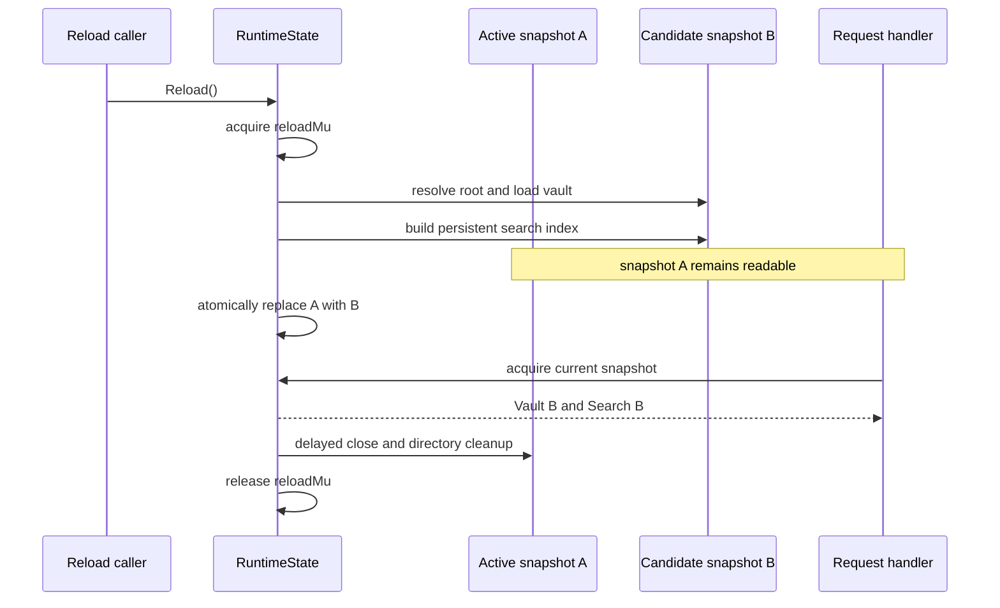
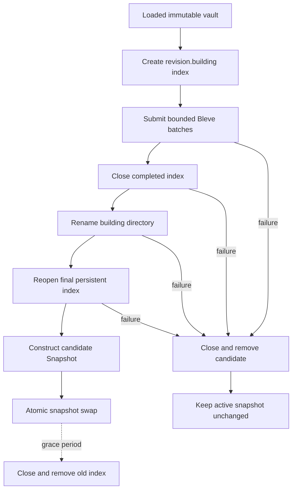

# Publish Vault: Bounded Persistent Search Indexing

publish-vault constructs an immutable runtime snapshot from an Obsidian vault. Each snapshot contains parsed note state, rendered HTML, indexes for links and backlinks, and a persistent Bleve full-text search index. A reload builds the next snapshot completely before publishing it. This preserves revision consistency for readers, but it also means that index construction must run within a finite memory budget while the previous snapshot may still be serving requests.

PV-MEM-002 reduced that construction cost by changing how documents enter Bleve. The previous implementation submitted one document per backend update. The accepted implementation accumulates an explicit Bleve batch and flushes it when either 16 documents or 1 MiB of source fields has been staged. This small change reduced median peak Go heap by 34.27%, process RSS by 21.52%, and complete load duration by 48.13% on a pinned 2,030-note workload. Search results and snapshot publication semantics remained unchanged.

> [!summary]
> - Allocation profiles showed **51.65 GB of cumulative search-phase allocation growth** but only **33.7 MB of post-GC retained heap growth**. The dominant problem was repeated construction and merge work, not a corpus-sized live Go object graph.
> - A seven-variant experiment selected **16 documents / 1 MiB** as the best observed heap and RSS point that also improved cumulative allocations, duration, GC count, and index size.
> - Three complete candidate runs reduced median peak heap from **826 MB to 543 MB**, RSS from **1,034 MB to 811 MB**, and load time from **166.42 s to 86.32 s**.
> - Twenty real-vault queries returned **16,725 complete results** with identical identities and fields. The largest score difference was `3.47e-18`.

## 1. The engineering problem

The runtime has a correctness requirement that constrains every memory optimization: a request must observe one coherent snapshot. The vault and search index exposed to a request must describe the same source revision. A reload cannot mutate the active search index in place, publish a partially built index, or close the previous index before existing readers finish.

The relevant state transition is:



The optimization boundary is therefore narrower than “use less memory.” It must satisfy all of the following:

1. Build a complete new index from the complete new vault.
2. Keep the old snapshot available until the atomic replacement.
3. Preserve rollback when parsing, document conversion, batching, persistence, rename, or reopen fails.
4. Preserve deletion semantics by building a fresh index rather than carrying stale documents forward.
5. Keep reloads serialized so two expensive builders cannot overlap.
6. Delay old-index closure long enough for readers that already obtained the old snapshot.

These constraints ruled out several superficially smaller designs. Incrementally mutating one global index would have weakened revision consistency. Closing the old index before publication would have broken in-flight searches. Replacing persistent Bleve with the in-memory backend would have nearly doubled measured heap and RSS on the earlier workload. The accepted work had to reduce temporary construction cost inside the existing full-snapshot protocol.

## 2. Establishing a comparable workload

Memory measurements are meaningful only when the input, binary, configuration, and observation interval are controlled. The final baseline and candidate comparison used the same detached, clean vault revision and the same measurement infrastructure:

| Workload property | Value |
|---|---:|
| Vault commit | `5f9f18ca7791ba2ddeb8a2528e3c279e6ae5f75a` |
| Markdown candidates | 2,036 |
| Published notes | 2,030 |
| Candidate source bytes | 76,921,819 |
| `.vault-ignore` SHA-256 | `d39336e4…321` |
| `.publish/config.yaml` | absent |
| Sampling interval | 100 ms |
| Complete runs per side | 3 |
| Index mode | fresh persistent directory per run |

Every run started the complete server, waited for health readiness, recorded all load phases, measured the resulting index directory, terminated gracefully, decoded the canonical JSONL trace, and removed temporary logs and indexes. This matters because a search-only microbenchmark omits vault parsing, HTML rendering, index publication, snapshot swap, and process-level RSS effects.

The baseline distribution was:

| Run | Peak heap | Peak RSS | Complete duration | Index bytes |
|---:|---:|---:|---:|---:|
| 1 | 805,533,208 B | 1,051,410,432 B | 130.27 s | 211,134,662 B |
| 2 | 857,792,960 B | 958,763,008 B | 166.42 s | 204,434,855 B |
| 3 | 826,146,848 B | 1,033,994,240 B | 172.93 s | 210,012,540 B |
| **Median** | **826,146,848 B** | **1,033,994,240 B** | **166.42 s** | **210,012,540 B** |

`search_index` was the dominant phase in every relevant median. Before changing code, the baseline established that the target was not a general suspicion about Go memory. It was a repeatable phase-specific peak.

## 3. Phase-resolved baseline

The phase model separated source resolution, parsing, normalization, link indexing, backlinks, HTML rendering, search construction, index publication, snapshot replacement, and delayed old-snapshot release. Median baseline measurements show where memory accumulated:

| Phase | Heap median | RSS median | Duration median |
|---|---:|---:|---:|
| `resolve_root` | 3.47 MB | 45.31 MB | 0.034 s |
| `vault_walk_parse` | 207.93 MB | 260.06 MB | 47.80 s |
| `vault_normalize` | 144.74 MB | 260.06 MB | 0.012 s |
| `wiki_link_index` | 177.30 MB | 260.42 MB | 0.119 s |
| `backlinks` | 192.41 MB | 260.73 MB | 0.075 s |
| `render_html` | 351.11 MB | 450.38 MB | 2.366 s |
| `search_index` | **826.15 MB** | **1,033.99 MB** | **107.41 s** |
| `index_publish` | 437.94 MB | 892.49 MB | 0.073 s |
| `snapshot_swap` | 448.31 MB | 782.50 MB | 0.029 s |

The search phase added approximately 475 MB of heap above the render phase and approximately 584 MB of RSS. Publication and swap remained expensive because runtime arenas and file-backed pages did not disappear immediately, but neither phase exceeded search construction.

![[assets/PV-MEM-002-phase-peaks.svg]]

This graph also shows the candidate phase shape. The optimization reduces the search, publication, and swap peaks without moving the maximum to another phase.

## 4. Distinguishing live objects from allocation traffic

A high heap peak can result from different mechanisms. The program may retain a large reachable object graph, allocate and discard objects faster than GC reclaims them, expand heap arenas that remain mapped after collection, fault persistent-index pages into memory, or combine several of these effects. Each mechanism implies a different intervention.

The attribution run captured checkpoints at 0%, 25%, 50%, 75%, and 100% search progress. At each checkpoint it recorded runtime counters, procfs RSS, smaps categories, and a forced-GC heap profile. Raw profiles remained private because Go heap profiles can contain application values. Only content-free aggregate function names and byte counts were retained.

| Progress | Docs | Indexed bytes | Post-GC HeapAlloc | HeapSys | RSS | Anonymous | Private clean | Total allocations |
|---:|---:|---:|---:|---:|---:|---:|---:|---:|
| 0% | 0 | 0 | 211,380,552 | 402,063,360 | 411,865,088 | 389,320,704 | 14,282,752 | 6,565,219,928 |
| 25% | 508 | 19,185,020 | 233,599,848 | 913,408,000 | 634,085,376 | 589,631,488 | 21,975,040 | 19,716,875,928 |
| 50% | 1,015 | 39,009,218 | 237,871,536 | 1,014,071,296 | 529,862,656 | 470,573,056 | 41,766,912 | 33,060,006,184 |
| 75% | 1,523 | 56,141,273 | 232,340,152 | 1,013,940,224 | 469,188,608 | 424,873,984 | 20,795,392 | 45,741,447,144 |
| 100% | 2,030 | 72,070,169 | 245,074,792 | 1,013,940,224 | 712,081,408 | 516,022,272 | 195,444,736 | 58,217,854,832 |

![[assets/PV-MEM-002-attribution-memory.svg]]

Post-GC `HeapAlloc` grew by only 33,694,240 bytes from zero to full progress. `HeapSys` grew by 611,876,864 bytes. RSS grew by 300,216,320 bytes after forced collection, while total allocation counters grew by 51,652,634,904 bytes.

![[assets/PV-MEM-002-attribution-allocations.svg]]

This was the central diagnosis. Search did not leave an additional 600–800 MB reachable Go graph at completion. It performed more than 51 GB of allocation work, expanded Go arenas to approximately 1.014 GB, and created file-backed persistent-index residency. Forced GC reduced live objects but did not undo arena growth or all resident pages. A production policy of calling `runtime.GC` repeatedly would therefore have added CPU work without removing the cause.

### 4.1 Retained state before search

At 0% progress, the in-use profile already contained approximately 209.4 MB. `regexp.(*Regexp).ReplaceAllStringFunc` accounted for 196.7 MB flat. The call paths came from note parsing and unresolved-embed replacement that produced rendered HTML. That output belongs to the immutable vault snapshot and must remain reachable while the snapshot serves requests.

At 100%, the in-use profile was approximately 227.4 MB. Active Bleve structures contributed a comparatively small live set. This rejected the hypothesis that persistent Bleve construction retained the complete analyzed corpus in Go objects.

### 4.2 Dominant allocation paths

At full progress, the aggregate allocation profile reported approximately 58.17 GB allocated by the process. The largest relevant paths were:

| Allocation site or cumulative path | Bytes |
|---|---:|
| `bytes.growSlice` flat | 26.47 GB |
| `bytes.Buffer.grow` cumulative | 27.36 GB |
| `scorch.(*Scorch).Batch` cumulative | 29.80 GB |
| `scorch.planMergeAtSnapshot` cumulative | 15.61 GB |
| `zapx.mergeToWriter` cumulative | 15.34 GB |
| `parser.stripMarkdown` cumulative | 5.46 GB |
| Token frequencies, roaring bitmaps, vellum builders, and zap coders | repeated 0.3–2.8 GB paths |

Cumulative call paths overlap and cannot be added as independent totals. They nevertheless identify where allocation traffic flows. The previous `bleve.Index.Index` call mapped one document and invoked one backend update. Scorch implemented each update as a one-document batch, creating a new segment and scheduling merge work. Repeating this 2,030 times was the largest controllable mechanism.

## 5. Representation and ownership

The lifetime inventory prevented a local optimization from being mistaken for a complete memory model:

| Representation | Creation point | Last required use | Conclusion |
|---|---|---|---|
| Raw Markdown bytes | `Vault.ReadRaw` | after plain-text extraction | Per-document transient. |
| Plain body string | `parser.PlainText` | after Bleve mapping | Per-document transient, but allocation-heavy. |
| Copied and flattened tags | `SearchDocument` conversion | after mapping | Small per-document transient. |
| `noteDoc` | search adapter | after mapping | Per-document transient. |
| Bleve analyzed fields | mapping and Scorch update | after segment construction | High churn, low post-GC retention. |
| Zap, vellum, and roaring segment state | update and merge | after segment persistence | Dominant controllable allocation traffic. |
| Rendered HTML | vault load | entire snapshot lifetime | Approximately 197 MB retained before search. |
| Go heap arenas | runtime allocation | scavenger and OS policy | Expanded by approximately 612 MB. |
| Persistent index pages | Scorch writes and reopen | index lifetime or page reclaim | Visible as private-clean/file-backed RSS. |
| Previous runtime snapshot | before reload | grace period after swap | Required for in-flight readers. |

This table explains why the accepted change focuses on segment construction. Rendered HTML is a separate lifetime problem. Persistent index pages are not Go heap objects. The old snapshot cannot be dropped early without violating request safety.

## 6. The bounded-batch experiment

The experiment introduced two explicit bounds:

- `BatchDocuments` limits the number of staged documents.
- `BatchBytes` limits the estimated source-field bytes represented by staged documents.

Both must be zero or both positive. Zero preserves the legacy one-document path. A document larger than the byte limit is committed alone because documents are indivisible.

Seven fresh-process search-only variants used the same 2,030 documents and 72,070,169 indexed field bytes:

| Variant | Doc bound | Byte bound | Peak heap | Peak RSS | Total allocations | GC cycles | Duration | Index size |
|---|---:|---:|---:|---:|---:|---:|---:|---:|
| Current | 1/update | — | 869.71 MB | 1,068.28 MB | 50.35 GB | 192 | 89.73 s | 233.10 MB |
| Batch 4 | 4 | 256 KiB | 758.84 MB | 956.72 MB | 28.76 GB | 115 | 70.32 s | 216.50 MB |
| Batch 8 | 8 | 512 KiB | 635.28 MB | 813.40 MB | 22.59 GB | 98 | 67.72 s | 198.42 MB |
| **Batch 16** | **16** | **1 MiB** | **521.08 MB** | **766.62 MB** | 19.27 GB | 83 | 61.78 s | 199.03 MB |
| Batch 32 | 32 | 2 MiB | 585.29 MB | 843.47 MB | 18.21 GB | 77 | 57.81 s | 198.62 MB |
| Batch 64 | 64 | 4 MiB | 641.51 MB | 870.87 MB | 16.75 GB | 71 | 94.12 s | 199.37 MB |
| Batch 128 | 128 | 8 MiB | 801.22 MB | 980.05 MB | 14.35 GB | 55 | 44.84 s | 198.15 MB |

![[assets/PV-MEM-002-batch-matrix.svg]]

The matrix exposes the trade-off directly. Larger batches reduce cumulative allocations and GC cycles because they reduce backend update frequency. They also retain more analyzed state in each flush. Batch 128 allocated the least and ran fastest in this exploratory run, but its heap and RSS approached the one-document implementation. Batch 16 produced the lowest observed heap and RSS while still reducing duration, cumulative allocations, GC cycles, and index bytes.

The selection criterion was not maximum throughput. It was the best observed bounded-memory point that improved all reviewed operational metrics. One run per variant was sufficient to select a candidate for repeated validation, not to claim a stable benchmark distribution.

## 7. The implementation

The generic search API retains its original behavior unless both batch bounds are supplied. Persistent full-snapshot construction supplies the reviewed bounds internally. In-memory and incremental call sites remain unchanged.

The essential indexing path is:

```go
func indexVaultBatched(index *Index, v *vault.Vault, options Options, progress IndexProgress) error {
    index.mu.Lock()
    defer index.mu.Unlock()
    if index.idx == nil {
        return ErrClosed
    }

    batch := index.idx.NewBatch()
    var pendingDocuments, pendingBytes uint64
    flush := func() error {
        if pendingDocuments == 0 {
            return nil
        }
        if err := index.idx.Batch(batch); err != nil {
            return err
        }
        progress.ProcessedDocuments += pendingDocuments
        progress.IndexedBytes += pendingBytes
        observeIndexProgress(options.ObserveIndexed, progress)
        batch = index.idx.NewBatch()
        pendingDocuments, pendingBytes = 0, 0
        return nil
    }

    err := v.ForEachSearchDocument(func(doc vault.SearchDocument) error {
        docBytes := searchDocumentBytes(doc)
        if pendingDocuments > 0 &&
            (pendingDocuments >= options.BatchDocuments ||
             pendingBytes+docBytes > options.BatchBytes) {
            if err := flush(); err != nil {
                return err
            }
        }
        if err := batch.Index(doc.Slug, toNoteDoc(doc)); err != nil {
            return err
        }
        pendingDocuments++
        pendingBytes += docBytes
        if pendingDocuments >= options.BatchDocuments || pendingBytes >= options.BatchBytes {
            return flush()
        }
        return nil
    })
    if err != nil {
        return err
    }
    return flush()
}
```

Several details are correctness-relevant.

First, the implementation flushes *before* adding a document when the next document would exceed the byte bound and there is already pending work. It then flushes *after* adding when the count or byte bound has been reached. A single oversized document is therefore submitted alone rather than causing an empty flush or permanent rejection.

Second, progress advances only after `index.idx.Batch` succeeds. A failed backend write must not report documents as durable. The final partial batch is flushed after iteration completes.

Third, one mutex covers the index throughout construction. This matches the existing `Index` ownership model and prevents `Close`, `Delete`, or another writer from observing a partially managed batch. Full snapshot construction does not expose the candidate index to readers until publication.

Fourth, `searchDocumentBytes` counts slug, title, body, excerpt, and each tag. It is an explicit estimate of source fields submitted to Bleve, not a claim about exact analyzer or backend memory. The document limit remains necessary because many small documents can create substantial per-document analyzer state even when their source bytes are small.

The production constants are deliberately internal:

```go
const (
    persistentSearchBatchDocuments uint64 = 16
    persistentSearchBatchBytes     uint64 = 1 << 20
)
```

They are not public tuning flags. The values are tied to reviewed evidence and correctness tests. Exposing arbitrary operator tuning would create unsupported memory, duration, and index-shape combinations.

## 8. Preserving atomic publication

Batching changes only the private construction step. The persistent index still follows a fresh-directory publication protocol:



The tests cover:

- invalid partial batch configuration;
- empty and final partial batches;
- oversized documents;
- exact document and byte boundary flushes;
- backend batch failures;
- progress monotonicity and success-only advancement;
- persistent index close and temporary-directory cleanup;
- updated-note freshness;
- deleted-note absence after reload;
- serialized concurrent reloads;
- rollback to the previous snapshot after candidate failure;
- vault/search revision pairing;
- delayed old-index cleanup;
- tie-aware search result comparison.

No compatibility shim or second production indexing path was added. The generic zero-bound path remains the existing behavior, and persistent full builds use one reviewed policy.

## 9. Search-equivalence proof

Search equivalence was evaluated against the real pinned vault, not only generated fixtures. Twenty queries were represented by SHA-256 identifiers so retained evidence did not disclose private query terms. Every query compared the complete result set rather than only the first page.

![[assets/PV-MEM-002-search-equivalence.svg]]

| Query | Results | Maximum score difference |
|---:|---:|---:|
| 1 | 757 | 0 |
| 2 | 674 | 0 |
| 3 | 730 | 0 |
| 4 | 1,359 | 0 |
| 5 | 1,555 | 0 |
| 6 | 451 | 0 |
| 7 | 48 | 0 |
| 8 | 1,537 | `1.73e-18` |
| 9 | 875 | 0 |
| 10 | 1,477 | 0 |
| 11 | 1,576 | 0 |
| 12 | 887 | 0 |
| 13 | 611 | 0 |
| 14 | 385 | 0 |
| 15 | 646 | 0 |
| 16 | 535 | 0 |
| 17 | 519 | 0 |
| 18 | 535 | 0 |
| 19 | 519 | 0 |
| 20 | 1,049 | `3.47e-18` |

The total was 16,725 results. Result identities and stored fields matched. The only score differences were at floating-point rounding scale. Tie-aware comparison was required because two valid Bleve index layouts may produce equal-score results in a different incidental order. The test compares identities and deterministic fields while treating tied ranking correctly.

## 10. Repeated complete-server results

The candidate was measured through the same full lifecycle as the baseline:

| Run | Peak heap | Peak RSS | Complete duration | Index bytes |
|---:|---:|---:|---:|---:|
| 1 | 551,111,344 B | 811,429,888 B | 95.12 s | 205,077,678 B |
| 2 | 543,066,520 B | 829,358,080 B | 86.32 s | 207,081,006 B |
| 3 | 534,493,424 B | 792,576,000 B | 75.69 s | 205,035,119 B |
| **Median** | **543,066,520 B** | **811,429,888 B** | **86.32 s** | **205,077,678 B** |

![[assets/PV-MEM-002-run-comparison.svg]]

The median changes were:

| Metric | Baseline | Candidate | Absolute change | Relative change |
|---|---:|---:|---:|---:|
| Peak Go heap | 826,146,848 B | 543,066,520 B | −283,080,328 B | **−34.27%** |
| Peak process RSS | 1,033,994,240 B | 811,429,888 B | −222,564,352 B | **−21.52%** |
| Complete duration | 166.42 s | 86.32 s | −80.10 s | **−48.13%** |
| Throughput | 12.20 notes/s | 23.52 notes/s | +11.32 notes/s | **+92.80%** |
| Index size | 210,012,540 B | 205,077,678 B | −4,934,862 B | **−2.35%** |

Candidate heap ranged from 534.49 MB to 551.11 MB; the baseline range was 805.53–857.79 MB. Candidate RSS ranged from 792.58 MB to 829.36 MB; baseline RSS ranged from 958.76 MB to 1,051.41 MB. These non-overlapping ranges make the improvement larger than the observed run-to-run variation.

`search_index` remained dominant. Its median duration fell from 107.41 s to 49.35 s. `index_publish` median heap fell from 437.94 MB to 321.15 MB, and snapshot-swap median heap fell from 448.31 MB to 328.80 MB. Arena and page-residency effects persisted after search, but the smaller construction history reduced downstream peaks as well.

## 11. Finite-cgroup behavior

Host cgroup measurements during the baseline were taken from an unlimited shared user scope and were not attributable to one process. The operational proof therefore ran the exact candidate binary inside an isolated container with a 1 GiB hard memory and swap limit, no network, a read-only vault mount, and a fresh persistent index.

![[assets/PV-MEM-002-finite-cgroup.svg]]

| Measurement | Value |
|---|---:|
| Container hard limit | 1,073,741,824 B |
| Derived Go soft limit | 912,680,550 B |
| Peak Go heap | 623,229,576 B |
| Peak process RSS | 803,254,272 B |
| Peak cgroup current | 988,028,928 B |
| Complete duration | 81.92 s |
| Search duration | 47.57 s |
| Index bytes | 201,409,031 B |
| Search documents | 2,030 / 2,030 |
| Result | successful exit, no OOM |

The cgroup peak reached 92.0% of the hard limit and came within 85.7 MB of it. This proves that the workload completes at 1 GiB. It does not justify a lower production limit. Process RSS under-reported cgroup current by approximately 184.8 MB because the cgroup also accounted for memory not represented by the process RSS sample in the same way, including filesystem and runtime effects.

A rollout can temporarily require additional node capacity even when one container fits its own cgroup. Kubernetes may keep the old pod available while scheduling the new pod. Container fit and node scheduling headroom are separate constraints.

## 12. Generated-fixture scaling and budgets

Representative private-vault runs support design decisions, but CI requires public deterministic fixtures. Five generated workloads varied both document count and payload size:

| Documents | Payload/doc | Source payload | Peak heap | Peak RSS | Duration | Index bytes |
|---:|---:|---:|---:|---:|---:|---:|
| 100 | 1 KiB | 0.10 MB | 10.59 MB | 55.19 MB | 0.13 s | 0.33 MB |
| 160 | 8 KiB | 1.31 MB | 22.94 MB | 76.81 MB | 1.30 s | 2.95 MB |
| 500 | 8 KiB | 4.10 MB | 46.83 MB | 109.01 MB | 2.79 s | 8.88 MB |
| 200 | 32 KiB | 6.55 MB | 67.30 MB | 137.49 MB | 4.86 s | 15.63 MB |
| 1,000 | 8 KiB | 8.19 MB | 72.93 MB | 158.94 MB | 9.08 s | 35.40 MB |

![[assets/PV-MEM-002-generated-scaling.svg]]

The 200 × 32 KiB case approached the memory of the 1,000 × 8 KiB case despite having one fifth as many documents. Source payload and document count must both remain explicit scaling axes. Bounded batching limits staged search work; it does not make the complete runtime independent of retained vault content.

The CI fixture uses 160 documents × 8 KiB and now exercises persistent production indexing rather than the unrelated in-memory path. It explicitly closes the index. Ten consecutive normal runs passed.

Final thresholds are:

```text
run peak heap < 32 MiB
run peak RSS < 160 MiB
search_index peak heap < 32 MiB
search_index peak RSS < 160 MiB
```

The heap threshold was halved from 64 MiB. The first proposed RSS threshold, 96 MiB, passed normal runs but failed under race instrumentation:

```text
observed race RSS: 139,022,336 bytes
proposed threshold: 100,663,296 bytes
```

Skipping the budget under `-race` would have reduced coverage. The final 160 MiB threshold is 16.7% below the old 192 MiB value and retains 20.7% headroom over the observed race maximum. A focused race rerun passed at 124,477,440 bytes, and the complete race suite passed.

## 13. Privacy as a measurement property

Heap profiles, queries, paths, note titles, and raw logs can disclose vault content. Privacy was therefore part of the artifact schema rather than a cleanup step at the end.

Retained traces used fixed phase names and numeric progress fields. They did not retain titles, slugs, Markdown, excerpts, tags, query text, command lines, or vault paths. Query evidence used SHA-256 identifiers. Raw heap profiles were mode-restricted, summarized into function/byte aggregates, and deleted before commit.

| Artifact set | Events audited | Findings |
|---|---:|---:|
| Three-run baseline | 4,693 | 0 |
| Three-run candidate | 2,687 | 0 |
| Finite-cgroup run | 841 | 0 |
| Generated scaling | 428 | 0 |
| **Total** | **8,649** | **0** |

This allowed the repository to retain useful evidence without publishing the vault itself. It also kept Prometheus cardinality bounded: phases, sources, result states, and label domains are fixed rather than derived from notes.

## 14. Validation and delivery

The final implementation passed:

- generation and formatting;
- complete unit and integration tests;
- full `-race` execution;
- 50 repeated search-package test runs;
- 10 repeated persistent-fixture budget runs;
- Glazed and golangci lint;
- GoSec, govulncheck, dependency review, CodeQL, and secret scanning;
- frontend type checking and production build;
- Linux amd64 and Darwin arm64 builds;
- production Docker image build;
- a 512 MiB example-vault container smoke with private metrics and embedded web UI;
- warning-free Compose configuration;
- `docmgr doctor` and diff checks;
- current-implementation Codex review with no major issues;
- all GitHub PR checks and both release image publication workflows.

PR #25 merged as `416a0dbb228f44124f505899ffdb341cf222022a`. The implementation commit was `5f5600da7265d6aafcfc4514d3041449d70796f2`; final evidence closed at `9f39ee7d2083ddb72d6b02efa2d6ba13ed701966`.

## 15. Failed approaches and corrected assumptions

### 15.1 Retained Bleve graph

The initial broad hypothesis allowed for a corpus-proportional live Bleve graph. Forced-GC profiles rejected it. Live heap remained near 211–245 MB while cumulative allocations exceeded 58 GB. The optimization therefore targeted update and merge frequency.

### 15.2 Forced GC as an optimization

Forced GC lowered reachable heap at checkpoints but left HeapSys near 1.014 GB and substantial RSS. It was useful diagnostically and inappropriate as the primary production change.

### 15.3 Largest batch as the default

Batch 128 minimized cumulative allocations and performed well on duration, but peak heap and RSS rose sharply. Throughput alone was not the selection objective. Batch 16 was the measured memory optimum among the tested points.

### 15.4 One-dimensional batch bounds

A document-count limit cannot bound a small number of very large notes. A byte limit cannot bound per-document analyzer overhead across many tiny notes. Both bounds are required.

### 15.5 A 96 MiB RSS CI limit

Normal fixture runs supported 96 MiB, but race instrumentation did not. The supported validation environment is part of the budget contract. The threshold was revised from fresh evidence rather than disabling the test.

### 15.6 Process RSS as a container limit

The isolated run measured 803 MB process RSS and 988 MB cgroup current. A resource recommendation based only on RSS would have materially understated container usage.

## 16. What the result does not solve

The project did not reach the preferred sub-400 MB RSS stretch target. Attribution shows why. Approximately 197 MB of rendered HTML is already retained before search. The runtime also retains parsed note state, maps heap arenas, and uses persistent-index pages. Batching removes repeated segment and merge work; it does not change those lifetimes.

A future reduction below the current candidate range would require a separate design, such as lazy HTML rendering, a bounded rendered-content cache, a different representation for snapshot-owned strings, or a carefully evaluated index/file-residency policy. Such work must be measured independently and preserve the same atomic snapshot guarantees.

The next investigation should begin with these questions:

1. How much rendered HTML is accessed between reloads, and what cache hit rate would a bounded lazy-render cache produce?
2. Can rendered output be reconstructed without changing API latency or content semantics?
3. How much old-snapshot overlap occurs under real request duration distributions?
4. Which cgroup pages are anonymous, file-backed active, and reclaimable at the actual production peak?
5. Can a lower memory request be scheduled safely during rolling replacement without lowering the hard limit?

These are new lifetime and deployment questions. They should not be folded into the completed search batching change without fresh evidence.

## 17. Working rules from PV-MEM-002

- Measure the complete lifecycle before selecting a local optimization.
- Treat `HeapAlloc`, `HeapSys`, RSS, PSS/smaps, and cgroup current as different quantities.
- Use forced GC to classify lifetime, not as automatic production policy.
- Bound batched work by both item count and estimated bytes.
- Advance progress only after durable backend success.
- Preserve full-snapshot rollback and revision pairing.
- Compare complete search results, including deterministic treatment of tied scores.
- Use representative private workloads for decisions and generated public fixtures for CI.
- Keep raw profiles private and retain only audited aggregates.
- Base resource limits on finite-cgroup evidence, not process RSS alone.
- Reject thresholds that fail supported instrumentation such as the race detector.
- Record negative results because they define the safe boundary of future work.

## 18. Source map

The main implementation and evidence are located at:

```text
/home/manuel/workspaces/2026-08-25/publish-vault-mem/publish-vault/
├── pkg/search/search.go
├── pkg/search/search_test.go
├── pkg/server/runtime.go
├── pkg/server/runtime_test.go
├── pkg/server/memory_budget_test.go
├── pkg/server/testdata/generated-fixture-memory-budget.json
└── ttmp/2026/08/25/
    └── PV-MEM-002--reduce-publish-vault-search-index-peak-memory/
        ├── design-doc/01-search-index-memory-analysis-design-and-implementation-guide.md
        ├── reference/01-investigation-diary.md
        └── artifacts/
            ├── baseline-current/
            ├── attribution/
            ├── batch-matrix/
            ├── implementation/
            ├── candidate-current/
            ├── finite-cgroup/
            ├── generated-scaling/
            └── final/
```

Related vault notes:

- [[ARTICLE - Measure - Phase-Aware Memory Measurement for Go Programs]]
- [[ARTICLE - Publish Vault Memory Optimization - From OOM Incidents to Phase-Attributed Baselines]]
- [[ARTICLE - Publish Vault Memory Architecture - Reload-Safe Persistent Search Indexes]]

The first related article explains the measurement toolkit. The second records the baseline state before PV-MEM-002. The third explains the earlier persistent-index and reload architecture. This report completes that sequence with attribution, implementation, repeated proof, and delivery.
