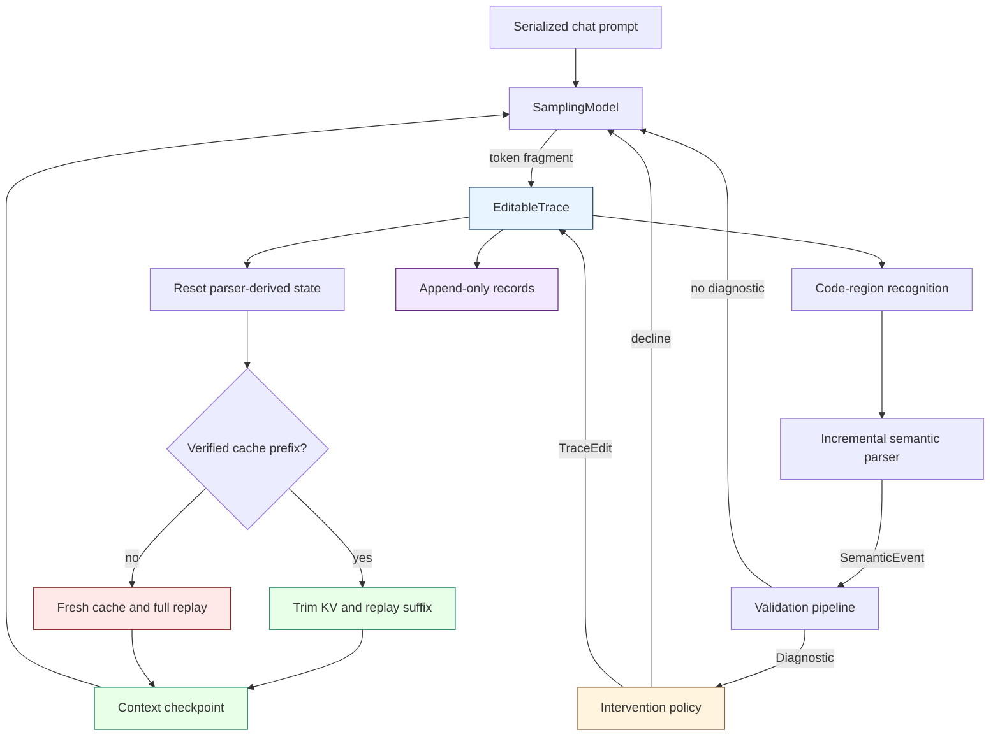
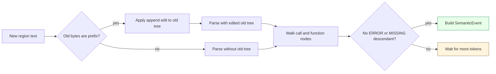
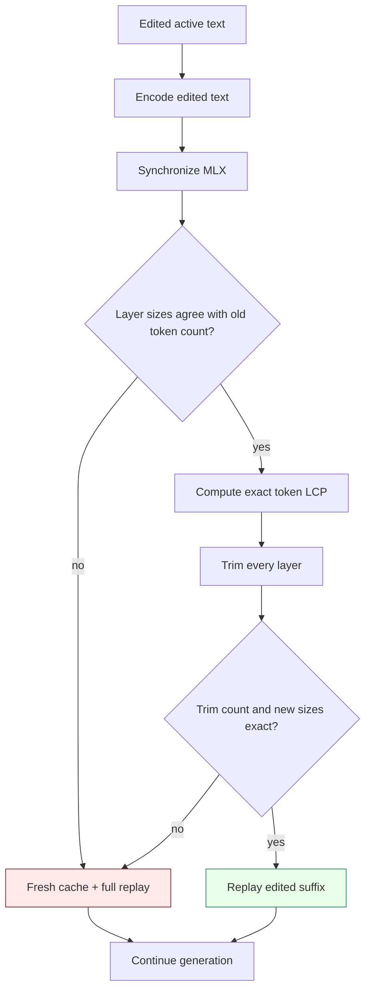
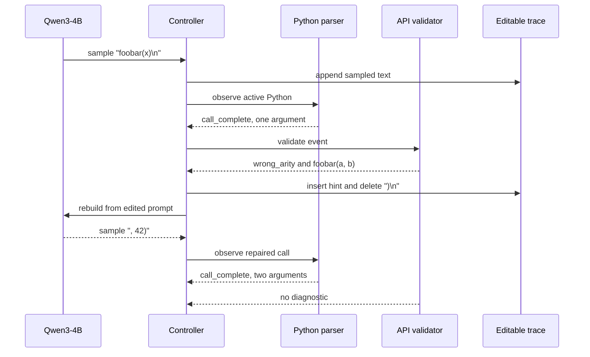

# Semantic Feedback for LLM Code Generation

This project implements and evaluates an inference controller that validates code while a language model is still generating it. When the model completes a recognizable program fragment, the controller can parse that fragment, validate its semantics, edit the active context, and resume generation from the edited prefix. The implementation began as a deterministic mock and now runs Qwen3-4B through MLX-LM on Apple Silicon with full event traces and paired baseline-versus-feedback experiments.

> [!summary]
> 1. The active text is the authoritative inference state. Parser state, tokenization, generation iterators, and KV caches are derived state that must agree with the text after every edit.
> 2. The project has demonstrated a complete real-model repair path: detect `foobar(x)`, inject the self-contained `foobar(a, b)` contract, rewind to `foobar(x`, replay the edited prompt, and let Qwen generate a valid second argument.
> 3. In the first ten paired seeds, all ten baseline/feedback prefixes matched, all six detected wrong-arity calls were repaired, and all six edited contexts passed token-level validation. Four remaining failures came from unsupported `<python>` or `<py>` wrappers.
> 4. Tree-sitter now recognizes complete calls and functions even when a later sibling is incomplete. A verified MLX cache strategy can retain an exact token prefix after an edit, and it falls back to full replay whenever token or cache invariants cannot be proven.
> 5. The next experimental target remains assistant-output-scoped code-region recognition, followed by a multi-task evaluator with baseline-correct fixtures. These changes address the largest unresolved source of missing interventions and make regression measurement possible.

This note reports the complete project state. The conceptual treatment is in [[ARTICLE - Semantic Feedback During LLM Code Generation - Editable Context Replay with MLX]], and the publication history is in [[DIARY - Semantic Feedback During LLM Code Generation]].

## Why this project exists

Ordinary code-generation systems validate after generation ends. The model produces a response, the caller extracts a code block, and static analysis or tests run against the finished result. That sequence postpones useful information. A closed function call can be checked before the surrounding function is finished. A completed function can be tested before the model closes the response. An API misuse can therefore become information for the next token distribution rather than only an error in a completed artifact.

The project tests this proposition under controlled conditions:

> If a generated program fragment is semantically invalid, place compact validator-derived information at the failure site, remove only the text that prevents repair, and continue generation from the resulting context.

The initial fixture defines an API that requires two arguments:

```python
foobar(a, b)
```

The model is asked to write `compute(x)` and call `foobar`, but the initial prompt withholds the signature. If the model generates:

```python
return foobar(x)
```

the controller transforms the active code into:

```python
# HINT: Valid API contract: foobar(a, b). Supply values for every required
# parameter shown in the signature. API behavior: return a + b
return foobar(x
```

The cursor must end immediately after `x`. The model then receives the edited context and decides how to finish the call.

This is not post-processing. It changes the prefix that conditions subsequent inference.

## Current project status

The repository is an active research prototype with three completed implementation-and-evaluation milestones.

`SFB-001` established the live mechanism:

- adapted the dependency-free mock to a real MLX-LM model;
- installed MLX-LM 0.31.3 and MLX 0.32.2 in a project-local environment;
- ran Qwen3-4B 4-bit on Metal;
- recorded early negative interventions;
- corrected prompt-marker collisions and hint semantics;
- found and fixed the retained-newline replay defect;
- added human-reviewable context checkpoints;
- demonstrated one verified real-model repair.

`SFB-002` established paired measurement:

- added reset-time MLX reseeding;
- reused one loaded model backend across independent paired conditions;
- implemented final-code and replay-context metrics;
- persisted 20 full traces across seeds 0 through 9;
- observed six repairs in six triggered feedback conditions;
- identified wrapper compliance as the dominant remaining failure.

`SFB-003` established error-tolerant parsing and cache-aware replay:

- added `TreeSitterPythonIncrementalParser` behind the existing event interface;
- reused syntax trees during append-only streaming and rebuilt state after rewrites;
- proved event parity with the AST parser on complete Python;
- recognized complete calls before an unrelated incomplete suffix;
- converted Tree-sitter UTF-8 byte offsets into trace character offsets;
- exposed `--parser ast|tree-sitter` in both single runs and paired sweeps;
- made the MLX prompt cache explicit and exposed `--replay-strategy full|prefix`;
- required an exact token longest common prefix and identical cache-layer sizes before reuse;
- verified prefix replay against deterministic full replay with the live Qwen3-4B model;
- completed a real semantic-feedback repair that reused 140 cached tokens and replayed a 38-token suffix.

The current test suite reports 36 passing tests and one intentional skip. The skip covers the missing-MLX dependency error path and is inactive because MLX-LM is installed. The source tree, SFB-003 ticket, design, diary, live artifacts, and five physical phase slips are committed; the ticket is complete and passes `docmgr doctor`.

## Project development sequence

The project progressed through a sequence of claims, each supported or rejected by executable evidence.

| Phase | Question | Result |
| --- | --- | --- |
| Deterministic mock | Can the controller parse, validate, edit, and resume? | Yes. Unit and end-to-end tests proved the control flow. |
| First MLX adapter | Can a real model continue after a text edit? | Yes. Full prompt replay reconstructed inference from edited text. |
| Initial live feedback | Does an API comment automatically repair the call? | No. Qwen often closed the code region instead. |
| Hint revision | Does a self-contained contract improve the continuation? | Necessary, but initially insufficient because the cursor was wrong. |
| Context audit | Was the model receiving the intended prefix? | No. The sampled newline survived the rewind. |
| Exact rewind | Does deleting `)\n` place the cursor correctly? | Yes. Qwen generated `, 42)` and produced valid code. |
| Paired sweep | Is the repair repeatable across controlled seeds? | Six of six triggered feedback runs repaired; all pairing and context checks passed. |
| Protocol analysis | What prevents the other seeds from reaching validation? | Unsupported `<python>` and `<py>` wrappers bypass the current recognizer. |
| Tree-sitter recognition | Can a complete semantic subtree survive incomplete trailing output? | Yes. A completed call is emitted beside a later Tree-sitter `ERROR`, with AST parity on complete input. |
| Verified prefix replay | Can an edit reuse KV state without changing the continuation? | Yes. Reuse requires exact token and layer-offset proofs; the deterministic next token matched full replay. |
| Integrated optimized repair | Does the optimized path survive the real rewind-and-hint edit? | Yes. It reused 140 tokens, replayed 38, repaired the call, and matched the full-replay final output. |

This sequence matters because prompt changes, parser changes, and context edits affect different parts of the experiment. The final evidence became interpretable only after the replay boundary was verified directly.

## Repository shape

The project root is:

```text
/Users/manuel/code/wesen/2026-08-25--mlx-inference
```

The implementation lives under:

```text
sources/semantic-feedback-prototype/
├── README.md
├── pyproject.toml
├── src/semantic_feedback/
│   ├── cli.py
│   ├── code_regions.py
│   ├── controller.py
│   ├── experiments.py
│   ├── kv_replay.py
│   ├── mlx_lm_model.py
│   ├── model.py
│   ├── policy.py
│   ├── qwen_sweep.py
│   ├── trace.py
│   ├── types.py
│   ├── examples/
│   │   ├── common.py
│   │   ├── mlx_qwen.py
│   │   ├── python_demo.py
│   │   └── toy_demo.py
│   ├── parsers/
│   │   ├── base.py
│   │   ├── python_ast.py
│   │   ├── python_tree_sitter.py
│   │   └── toy.py
│   └── validators/
│       ├── api.py
│       ├── base.py
│       └── function_tests.py
├── scripts/
│   └── verify_kv_prefix_replay.py
├── tests/
│   ├── test_kv_replay.py
│   └── test_tree_sitter_parser.py
└── artifacts/
    └── live-qwen/
        ├── kv-prefix-equivalence.json
        ├── phase-4-tree-sitter/
        └── phase-5-prefix-replay/
```

Ticket documentation lives under:

```text
ttmp/2026/08/25/
├── SFB-001--qwen-semantic-feedback-generation-harness/
├── SFB-002--paired-qwen-semantic-feedback-evaluation/
└── SFB-003--tree-sitter-parsing-and-kv-prefix-replay/
```

The `.venv-mlx` environment and Hugging Face model cache remain local and uncommitted.

## The foundational state model

The system maintains two histories with different purposes.

The active text is mutable. It represents the exact prefix from which the model must continue. An intervention can insert documentation, remove punctuation, delete a failed expression, or leave an argument slot open.

The audit record is append-only. It retains every sampled fragment, semantic event, diagnostic, edit, checkpoint, and stop decision, including content later removed from the active text.

Let the active text at revision \(r\) be \(T_r\). A generated fragment \(s\) creates:

$$
T_{r+1} = T_r \mathbin{\|} s
$$

An intervention contains non-overlapping patches \(P = \{p_1, \ldots, p_n\}\):

$$
T_{r+1} = \operatorname{apply}(T_r, P)
$$

The next model distribution must be conditioned on the edited text:

$$
x_{t+1} \sim p_\theta\left(x \mid \operatorname{tokenize}(T_{r+1})\right)
$$

The parser tree, emitted-event fingerprints, validator bookkeeping, token IDs, MLX generation iterator, and KV cache are derived from the active text. They are not authoritative after an arbitrary edit.

```text
authoritative:
  active text and revision

append-only evidence:
  sampled fragments, semantic events, diagnostics, edits, checkpoints

derived state:
  code regions, parser state, validator state, tokenization,
  generation iterator, KV cache
```

This separation is the primary correctness rule in the project.

## Runtime architecture



The controller owns ordering. Each component owns a narrower contract:

| Component | Responsibility | Must not decide |
| --- | --- | --- |
| `EditableTrace` | Apply text changes and preserve audit records | Whether an edit is semantically appropriate |
| Code-region recognizer | Identify generated code spans | Whether the code is correct |
| Semantic parser | Emit completed calls and functions | How to repair them |
| Validator | Produce structured facts about violations | How the context should be edited |
| Intervention policy | Convert supported diagnostics into bounded edits | Whether parser spans remain valid afterward |
| Model adapter | Sample and either rebuild or provably trim inference state | What semantic rule caused an edit |
| Sweep evaluator | Measure final output and paired behavior | How a live run should intervene |

Keeping diagnostics separate from edit policy makes baseline measurement possible. The baseline records the same parser and validator behavior but sets the policy intervention budget to zero.

## Core data contracts

The common types in `types.py` make the loop independent of MLX and Qwen.

`ContextSnapshot` captures the active text and controller counters:

```python
@dataclass(frozen=True)
class ContextSnapshot:
    text: str
    revision: int
    step: int
    intervention_count: int
```

`SemanticEvent` represents a parse-complete unit with an absolute source span. `Diagnostic` represents a validator fact. `Patch` replaces a half-open character range. `TraceEdit` applies one or more non-overlapping patches atomically.

```python
@dataclass(frozen=True)
class Patch:
    start: int
    end: int
    replacement: str

@dataclass(frozen=True)
class TraceEdit:
    patches: Sequence[Patch]
    reason: str
    diagnostic_code: str
    metadata: Mapping[str, Any]
```

`EditableTrace.apply()` validates every range, applies patches from the highest offset to the lowest, increments the revision, and records both full before/after text plus SHA-256 digests. Right-to-left application preserves offsets computed against the pre-edit text.

## The controller algorithm

`GenerationController.run()` implements the complete feedback cycle:

```python
trace = EditableTrace(initial_prompt)
model.reset(snapshot(trace))
parser.reset()
validation.reset()
policy.reset()

for step in range(max_steps):
    context = snapshot(trace)
    sample = model.sample_next(context, rng)
    record("model_sampled", sample)

    if sample.is_eos:
        stop("eos")

    trace.append(sample)

    if code_region_just_opened():
        record_context_checkpoint("code_region_opened")

    for event in parser.observe(trace.text):
        record("semantic_event", event)

        for diagnostic in validation.validate(event, snapshot(trace)):
            record("diagnostic", diagnostic)
            edit = policy.decide(snapshot(trace), event, diagnostic)

            if edit is None:
                continue

            trace.apply(edit)
            model.on_context_edited(snapshot(trace), edit)
            parser.reset()
            record_context_checkpoint("after_context_edit")
            continue_outer_generation_loop()
```

Only one edit is applied for a sampled fragment before the outer loop resumes. Parser events and source spans computed against the old revision are not processed after an edit.

The controller also limits total interventions. The policy limits interventions by diagnostic code. Both limits ensure termination when a model repeatedly produces the same invalid construction.

## Code-region recognition

The current prototype recognizes XML-style `<code>` regions, including an unfinished final region. Unfinished-region support is necessary because the parser must observe code before the model emits `</code>`.

The first live prompt included literal marker examples in its instructions. Since the recognizer scanned the full serialized conversation, it paired markers from the prompt rather than the generated response. The model's code never reached validation. The prompt was corrected to describe the marker without embedding a complete literal example.

The paired sweep exposed a second limitation. Seeds 3, 5, 6, and 7 generated structurally reasonable Python under these wrappers:

```xml
<python>
def compute(x):
    return foobar(x)
</python>
```

```xml
<py>
def compute(x):
    return foobar(x)
</py>
```

The current recognizer ignored them. Baseline and feedback remained identical because no semantic event existed.

### Assistant-output-scoped recognition

The next recognizer should record the exact character offset where assistant generation begins and scan only the generated suffix:

```python
assistant_start = len(initial_chat_prompt)
generated = trace.text[assistant_start:]

local_regions = extract_supported_regions(
    generated,
    wrappers=("code", "python", "py"),
)

absolute_regions = [
    region.shift(assistant_start)
    for region in local_regions
]
```

This scope prevents marker text in system instructions or user messages from activating validation. It also permits explicit wrapper aliases without searching the complete conversation. The audit record should retain the accepted wrapper variant and the assistant-generation boundary.

For structured tool calls, the equivalent design is to parse only the assistant tool-call argument stream. Serialized tool examples in prior messages should not be interpreted as current generated code.

## Semantic parsing

The project now has two Python parsers behind `IncrementalSemanticParser`. `PythonAstIncrementalParser` remains the dependency-free reference. It reparses each recognized Python region with `ast.parse(source, mode="exec")` and emits no event while the complete region fails to parse. `TreeSitterPythonIncrementalParser` is the error-tolerant streaming implementation selected with `--parser tree-sitter`.

The Tree-sitter adapter keeps a prior UTF-8 source buffer and syntax tree for each code region. If the next observation appends bytes to the previous source, it describes that insertion to the old tree and supplies the edited tree to the next parse:

```python
old_end = len(previous_source)
old_tree.edit(
    start_byte=old_end,
    old_end_byte=old_end,
    new_end_byte=len(new_source),
    start_point=end_point(previous_source),
    old_end_point=end_point(previous_source),
    new_end_point=end_point(new_source),
)
new_tree = parser.parse(new_source, old_tree)
```

A controller rewrite invalidates this append proof. The parser discards its region trees and performs a full parse on the edited source. Syntax-tree reuse is therefore an optimization over observations, not an independent source of truth.



A `call_complete` event includes:

- the normalized callee;
- positional and keyword counts;
- starred and double-starred argument counts;
- absolute call span;
- absolute opening and closing parenthesis offsets;
- code-region bounds;
- the language-specific comment prefix.

A `function_complete` event includes the function name, parameters, full span, and return-expression span when available.

Streaming introduces a completion ambiguity. Python accepts a bare `return` as a complete statement, but the model may be about to emit `return expression`. The parser delays function completion until a physical line terminator arrives or the code region closes. This prevents executable tests from running against a transient prefix.

The AST parser remains conservative: a syntax error anywhere in the region suppresses all events. Tree-sitter separates complete siblings from an incomplete tail. Given:

```python
foobar(1)
unfinished(
```

the AST backend emits no event because the module is invalid. Tree-sitter represents the first line as a complete `call` and the second as an `ERROR`; the adapter emits `foobar(1)` immediately.

Tree-sitter node coordinates are UTF-8 byte offsets, while `SourceSpan` uses Python character offsets. The adapter converts every candidate boundary before building events. A test places the non-ASCII string `"λ"` before a call and verifies that the emitted span extracts the exact call, including both parenthesis offsets.

Candidate-local `ast.parse` remains responsible for constructing the established semantic payload after Tree-sitter proves structural completeness. This hybrid decision isolates the new behavior—error-tolerant recognition and incremental tree reuse—from changes to validator inputs. Complete-program projection tests require the two parsers to produce identical kinds, spans, source text, and stable semantic fields.

## Validation

The static API validator reads `call_complete` events and consults an `ApiRegistry`. The live fixture registers:

```python
ApiSpec.fixed(
    name="foobar",
    arguments=2,
    signature="foobar(a, b)",
    documentation="return a + b",
)
```

For a statically countable one-argument call, it emits:

```python
Diagnostic(
    code="wrong_arity",
    message="foobar expects 2 arguments but the completed call contains 1",
    severity="error",
    primary_span=event.span,
    data={
        "signature": "foobar(a, b)",
        "documentation": "return a + b",
        "close_paren": event.data["close_paren"],
    },
)
```

Calls containing `*args` or `**kwargs` are not rejected by static counting because their runtime arity cannot be determined from the local syntax.

The project also contains `SubprocessFunctionTestValidator`. It can execute trusted generated code in a child process with a timeout and turn failed cases into diagnostics. It is opt-in because a child process and timeout do not isolate hostile Python from the filesystem, credentials, process table, or network.

## Intervention policy

`MinimalFeedbackPolicy` supports API-arity and function-test diagnostics. It produces local edits rather than selecting a complete replacement program.

For wrong arity, the policy:

1. locates the diagnostic's closing parenthesis;
2. extends the deletion over an immediately following CRLF or LF;
3. inserts an indented, self-contained API contract before the call line;
4. leaves the cursor inside the call;
5. records the strategy in edit metadata.

For a function-test failure, it can delete the failed return expression and its line terminator, insert test evidence, and resume after `return `.

### Why the hint is self-contained

An earlier hint referred to a missing argument as though the model retained the invalid branch independently. After editing and replay, the model sees the post-edit context. A useful hint must state the relevant facts directly.

Insufficient:

```python
# Missing argument. Fix the error.
```

Current form:

```python
# HINT: Valid API contract: foobar(a, b). Supply values for every required
# parameter shown in the signature. API behavior: return a + b
```

The hint is informed by the diagnostic but does not require access to deleted history.

## MLX-LM inference adapter

`MlxLmSamplingModel` wraps MLX-LM's `stream_generate()` interface. Imports and weight loading are lazy so mock tests remain independent of MLX and Apple Silicon.

During append-only generation, the adapter retains one MLX iterator, an explicit prompt cache, and the token IDs used to build the active stream. Context edits support two strategies:

- `full` creates a fresh prompt cache and evaluates the complete edited token sequence. It remains the default correctness reference.
- `prefix` proves that a prefix of the live cache represents the same token IDs as the edited context, trims invalidated state, and evaluates only the new suffix. It is opt-in and falls back to `full` on any failed invariant.

```text
append-only text
    -> preserve current stream

TraceEdit
    -> encode complete edited prompt
    -> synchronize outstanding MLX work
    -> compare old and new token IDs
    -> verify all cache-layer sizes
    -> either trim/replay suffix or create a fresh cache
```

The installed Qwen3-4B model creates 36 ordinary `KVCache` layers. All 36 expose the same token count and support trimming. The optimizer does not assume those facts for other models: it queries them at each edit boundary.

### The yielded-token cache invariant

Cache reuse depends on the exact timing of MLX-LM 0.31.3. Its generation loop first evaluates the prompt and samples token `y`. Before yielding `y`, it calls the model on `y` to precompute the following candidate. At the yield boundary, the cache includes the prompt and `y`; the precomputed following token is not yet in the cache.

```text
model(prompt, cache)  -> sample y
model(y, cache)       -> sample next_y
yield y

cache at yield = prompt tokens + y
```

The controller then appends the yielded token. The active token IDs and cache offsets therefore describe the same sequence. `mx.synchronize()` is still required before offsets are read or trimmed because MLX evaluates the precomputation asynchronously.

This is a version-sensitive contract. A future MLX-LM upgrade must rerun the equivalence probe before prefix reuse is accepted.

### Exact token-prefix planning

Decoded text is not sufficient for reuse. An insertion near punctuation can change tokenizer merges before the character edit position. The planner compares token IDs directly:

```python
matched = longest_common_prefix(old_token_ids, new_token_ids)
reused = min(matched, len(new_token_ids) - 1)
trimmed = len(old_token_ids) - reused
suffix = new_token_ids[reused:]
```

The `len(new)-1` bound is required even when the complete new sequence is an old prefix. KV state for all new tokens does not include stored next-token logits. At least one token must pass through the model to reconstruct those logits through the normal generation path.

The reuse proof requires every condition below:

1. A live prompt cache exists.
2. Every layer is trimmable.
3. Every layer reports the same size.
4. That size equals the old active token count.
5. The old and edited sequences share at least one token that can be retained.
6. Every layer reports the planned retained size after trimming.

Failure creates a fresh cache and records a stable reason such as `cache_not_trimmable`, `cache_token_count_mismatch`, or `cache_trim_mismatch`. The old cache is never trusted after a failed in-place trim.



### Replay telemetry

Context checkpoints and subsequent sample metadata record:

```text
requested_strategy
used_strategy
fallback_reason
old_token_count
new_token_count
matched_prefix_tokens
reused_tokens
trimmed_tokens
recomputed_suffix_tokens
cache_layer_sizes
```

Raw tensors remain excluded. Token IDs, cache lengths, replay decisions, and decoded context provide the reviewable proof without adding large numerical arrays to traces.

The paired-sweep implementation adds one more lifecycle rule: `reset()` reseeds MLX at the start of every independent controller session. Context edits do not reseed. This produces identical baseline and feedback prefixes for the same seed while preserving stochastic continuity after an intervention.

## Context validation and the retained-newline defect

The most consequential debugging result was a context-editing defect, not a prompt deficiency.

MLX-LM had sampled the text fragment `)\n`. The validator's source span pointed to `)`. The original policy removed that character but retained the newline. The intended cursor was:

```text
return foobar(x
               ^ next token
```

The actual cursor was:

```text
return foobar(x

               ^ next token
```

The replay prompt therefore placed generation on the next physical line. Experiments with close-marker guards, more explicit hints, and argument scaffolds were being evaluated against a different continuation position than intended.

The policy now removes the line terminator when it immediately follows the closing delimiter:

```python
erase_end = close_paren + 1
if erase_end < len(text) and text[erase_end] == "\r":
    erase_end += 1
if erase_end < len(text) and text[erase_end] == "\n":
    erase_end += 1
```

### Human-reviewable context checkpoints

When context capture is enabled, the controller records checkpoints when a code region opens and immediately after each intervention. The checkpoint includes:

- exact prompt text;
- character count;
- a cursor suffix;
- whether the prompt ends with a newline;
- token IDs and token count;
- decoded text;
- encode/decode round-trip equality;
- equality with the token sequence queued in the MLX stream;
- replay-generation counter;
- replay strategy, prefix counts, trim counts, suffix counts, and fallback reason;
- one size entry per prompt-cache layer;
- recognized code-region bounds.

The verified repair checkpoint reported:

```text
cursor suffix:                 ... return foobar(x
ends_with_newline:             false
token_count:                   178
round_trip_equal:              true
matches_active_stream_tokens:  true
replay_generation:             2
open Python region:            true
```

Raw KV tensors were not recorded. They are large numerical arrays and do not directly reveal a retained newline, surviving delimiter, or tokenization mismatch. SFB-003 added the useful cache facts—layer sequence lengths, exact prefix counts, trim counts, and suffix counts—while retaining text and token IDs as the reviewable contract.

## The first verified real-model repair

After the replay boundary was corrected, Qwen generated this baseline code:

```python
<code lang=python>
def compute(x):
    # Call the foobar function and return its result
    return foobar(x)
</code>
```

The parser emitted `call_complete`. The validator emitted `wrong_arity`. The policy inserted the API contract and deleted `)\n`. The new prompt ended exactly at `return foobar(x`. Qwen then generated `, 42)` and closed the region:

```python
<code lang=python>
def compute(x):
    # Call the foobar function and return its result
    # HINT: Valid API contract: foobar(a, b). Supply values for every required parameter shown in the signature. API behavior: return a + b
    return foobar(x, 42)
</code>
```

The event sequence was:



This trace proved mechanism feasibility. It did not by itself measure reliability.

## Tree-sitter and cache-replay evidence

SFB-003 evaluated the parser and cache changes separately before combining them. This ordering matters. Parser acceptance is tested against semantic-event parity; cache acceptance is tested against full-replay continuation equivalence. A successful final program is not enough to prove either internal property.

### Phase 4 live Tree-sitter repair

The live Phase 4 run used Qwen3-4B, seed 0, temperature 0.7, explicit hints, context checkpoints, and `--parser tree-sitter`. It completed in 37 controller steps with one diagnostic and one intervention. Tree-sitter emitted the invalid `foobar(x)` call, then the repaired `foobar(x, 42)` call, then the complete function. Both context checkpoints passed encode/decode and active-stream token comparison.

This run demonstrated that the new parser works in the existing controller without changing validator or policy behavior. Its final code was the same verified repair shown above.

### Phase 5 deterministic replay oracle

The live oracle probe constructs an old model context, inserts a factual API hint into the text, and asks two adapters for one greedy continuation token:

1. the prefix adapter trims and reuses the old prompt cache;
2. the full adapter evaluates the complete edited context in a fresh cache.

Both adapters share immutable model weights and use temperature zero. The result was:

| Property | Result |
| --- | ---: |
| Old active tokens | 31 |
| Edited-context tokens | 45 |
| Exact matching prefix | 29 |
| Reused cache tokens | 29 |
| Trimmed old tokens | 2 |
| Recomputed suffix tokens | 16 |
| Prefix next token | `12669` (`python`) |
| Full-replay next token | `12669` (`python`) |
| Token equality | true |

The probe recorded 0.175 seconds for prefix replay and 0.215 seconds for full replay. These are single observations used for correctness diagnostics, not a performance benchmark.

### Phase 5 integrated semantic repair

The integrated run enabled both `--parser tree-sitter` and `--replay-strategy prefix`. Qwen again generated `foobar(x)`. The intervention inserted the self-contained contract and removed `)\n`. At that edit boundary:

```text
old active token count:        145
new edited token count:        178
exact matching prefix:         140
trimmed old cache tokens:        5
reused cache tokens:           140
recomputed suffix tokens:       38
fallback reason:              none
```

Every one of the 36 cache layers reported size 140 after trimming. The edited text round-tripped through the tokenizer, matched the stream token IDs, and resumed with the expected argument continuation. The final output was byte-for-byte identical to the earlier full-replay seed-0 artifact.

The optimized call processed 38 edited-context tokens instead of 178, a 78.7% reduction in post-edit prefill tokens for this fixture. This metric describes model input work at one edit boundary. It does not establish an end-to-end latency distribution.

### Why direct trimming was sufficient

The project had considered taking a KV snapshot when `<code>` opens. A snapshot is not required for the current single-branch repair. The live cache is already aligned with the active yielded-token sequence at every controller boundary, so the exact old/new prefix can be retained directly.

Snapshots become necessary when the controller retains multiple candidate branches, backtracks to an older checkpoint after further generation, or compares several interventions from the same prefix. Those operations need immutable historical states; the current controller needs only the most recent active state.

### Phase records and physical work slips

SFB-003 maintained a strict implementation diary and separate code/documentation commits at each phase boundary. The Almanach thermal printer produced five monochrome work slips from tracked YAML layouts:

| Slip | Rendered size | Result |
| --- | ---: | --- |
| Overall SFB-003 work order | 384 × 950 | Printed, two segments |
| Phase 4 start | 384 × 877 | Printed, two segments |
| Phase 4 done | 384 × 689 | Printed |
| Phase 5 start | 384 × 834 | Printed, two segments |
| Phase 5 done | 384 × 653 | Printed |

The first overall print attempt failed before paper output because its `did.data.items` field used objects instead of the DSL's required string array. The layout was corrected, the exact renderer error was recorded in the diary, and all five requested slips then printed successfully. Ticket closure occurred only after the final printer acknowledgement, full tests, `git diff --check`, and `docmgr doctor` passed.

## Paired evaluation harness

`qwen_sweep.py` implements the first multi-seed evaluation. It loads the model once, then runs baseline and feedback for each seed from the same initial MLX random state.

```python
for seed in seeds:
    model.seed = seed
    baseline = run_controller(feedback=False)

    model.seed = seed
    feedback = run_controller(
        feedback=True,
        explicit_hints=True,
        capture_context_snapshots=True,
    )

    compare_samples_through_first_diagnostic(baseline, feedback)
    classify_final_outputs(baseline, feedback)
```

Final success requires:

- a recognized Python code region;
- a closed region;
- valid Python syntax;
- a `compute` function that returns `foobar(...)`;
- at least one `foobar` call;
- exactly two statically countable arguments for every `foobar` call.

Each pair is classified as `both_correct`, `baseline_only`, `feedback_only`, or `neither_correct`. The harness writes full traces under `runs/seed-NNNN/` and a compact `summary.json`.

## Paired seeds 0 through 9

The first full sweep used Qwen3-4B 4-bit, temperature 0.7, maximum 512 controller steps, and seeds 0 through 9.

| Metric | Result |
| --- | ---: |
| Paired seeds | 10 |
| Matching prefixes through first diagnostic | 10/10 |
| Baseline successes | 0/10 |
| Feedback successes | 6/10 |
| Feedback-only pairs | 6 |
| Baseline-only pairs | 0 |
| Triggered interventions | 6 |
| Successful triggered repairs | 6/6 |
| Valid edited-context checkpoints | 6/6 |
| Invalid edited-context checkpoints | 0 |

The per-seed outcomes were:

| Seed | Baseline | Feedback | Classification |
| ---: | --- | --- | --- |
| 0 | `foobar(x)` | `foobar(x, 42)` | feedback only |
| 1 | `foobar(x)` | `foobar(x, 42)` | feedback only |
| 2 | `foobar(x)` | `foobar(x, 42)` | feedback only |
| 3 | Unsupported `<python>` wrapper | Same output | neither |
| 4 | `foobar(x)` | `foobar(x, 42)` plus comment | feedback only |
| 5 | Unsupported `<py>` wrapper | Same output | neither |
| 6 | Unsupported `<py>` wrapper | Same output | neither |
| 7 | Unsupported `<python>` wrapper | Same output | neither |
| 8 | `foobar(x)` | `foobar(x, 42)` | feedback only |
| 9 | `foobar(x)` | `foobar(x, 42)` | feedback only |

All six interventions replayed valid contexts. Five used 178 prompt tokens. Seed 8 used 163 because its accepted opening marker was `<code>` without a language attribute.

Mean baseline time was 0.566 seconds. Mean feedback time was 0.848 seconds, an absolute increase of 0.281 seconds. Mean controller steps increased from 25.7 to 30.2. MLX process peak memory reached approximately 2.696 GB, but the peak is cumulative across the shared process and cannot be assigned to individual conditions.

## Interpretation of the results

The sweep supports a narrow, useful conclusion:

> When the current recognizer observes the controlled wrong-arity call, exact-rewind semantic feedback repairs it reliably in this ten-seed sample.

The conditional result is six successful repairs in six interventions. The overall result is six successes in ten seeds because four generations did not follow the wrapper protocol.

The result does not establish a general 60% improvement in coding quality. The initial task deliberately withholds an API contract, the sample contains one task and ten seeds, and no baseline run happened to guess a valid two-argument call. Consequently, the experiment observed zero regressions but did not measure feedback behavior on baseline-correct outputs.

The pairing evidence is strong for the installed software versions. All ten baseline and feedback token streams matched through the first diagnostic. For no-diagnostic pairs, the complete output matched. This confirms that reset-time reseeding produced a controlled comparison.

## Mock and unit-test evidence

The deterministic mock remains important because it isolates controller semantics from model behavior. Tests cover:

- atomic multi-patch edits;
- overlap rejection;
- parser completion timing;
- source-span mapping;
- API repair;
- behavioral-test repair;
- repeated controller sessions;
- stochastic no-intervention branches;
- self-contained hint construction;
- argument scaffolding;
- sampled-newline deletion;
- optional MLX dependency behavior;
- shared-model controller assembly;
- final-output evaluation;
- context-checkpoint evaluation;
- paired repair classification;
- artifact persistence;
- empty seed rejection.
- Tree-sitter parity with AST events on complete Python;
- recognition of a completed call before an incomplete trailing expression;
- Unicode byte-to-character source-span conversion;
- Tree-sitter append reuse, rewrite invalidation, and reset;
- exact token-prefix planning and the required one-token replay suffix;
- fail-closed behavior for non-trimmable and count-mismatched caches;
- fake-backend reproduction of the yielded-token/cache timing contract;
- full replay fallback after a cache-layer mismatch;
- CLI selection of Tree-sitter and verified prefix replay.

The current command is:

```bash
cd /Users/manuel/code/wesen/2026-08-25--mlx-inference/sources/semantic-feedback-prototype
.venv-mlx/bin/python -m pytest -q -ra
```

Current result:

```text
36 passed, 1 skipped
```

## Running the project

### Mock demonstrations

```bash
cd /Users/manuel/code/wesen/2026-08-25--mlx-inference/sources/semantic-feedback-prototype

PYTHONPATH=src .venv-mlx/bin/python -m semantic_feedback.cli all
```

### One live Qwen run

```bash
env HF_HOME=.venv-mlx/hf-cache \
  .venv-mlx/bin/semantic-feedback qwen \
  --model mlx-community/Qwen3-4B-4bit \
  --seed 7 \
  --temperature 0.7 \
  --parser tree-sitter \
  --replay-strategy prefix \
  --explicit-hints \
  --capture-context-snapshots \
  --json-dir artifacts/live-qwen/manual-run
```

Add `--no-feedback` for a diagnostics-only baseline.

Use `--parser ast` to retain the reference parser and `--replay-strategy full` to retain the reference replay path. Both are defaults unless explicitly changed.

### Deterministic cache equivalence probe

```bash
env HF_HOME=.venv-mlx/hf-cache \
  PYTHONPATH=src \
  .venv-mlx/bin/python scripts/verify_kv_prefix_replay.py \
  --output artifacts/live-qwen/kv-prefix-equivalence.json
```

The command exits unsuccessfully if the greedy prefix and full-replay token IDs differ.

### Paired sweep

```bash
env HF_HOME=.venv-mlx/hf-cache \
  .venv-mlx/bin/semantic-feedback qwen-sweep \
  --seed 0 \
  --runs 10 \
  --temperature 0.7 \
  --max-steps 512 \
  --parser tree-sitter \
  --replay-strategy prefix \
  --json-dir artifacts/live-qwen/paired-sweep-seeds-0-9
```

The command writes one baseline and one feedback trace per seed plus `summary.json`.

## Security boundary

Static parsing and API validation do not execute generated code. The optional function-test validator does.

> [!warning]
> The subprocess validator is for trusted prototype inputs. A child process plus timeout is not a security sandbox.

A production execution environment requires an explicit threat model and isolation controls. Depending on deployment, those controls may include a disposable virtual machine or container, a read-only filesystem, no inherited credentials, disabled network access, restricted syscalls, process and memory limits, and a narrow API proxy.

The current project makes no claim that arbitrary model-generated Python can be executed safely.

## Known limitations

The current implementation has several explicit limits.

1. Code-region recognition scans textual markers and currently accepts only the `<code>` family.
2. Tree-sitter currently recognizes calls and function definitions. Imports, assignments, tool-call structures, and additional languages do not yet produce semantic events.
3. The Tree-sitter adapter uses candidate-local Python AST parsing to preserve event payload parity and rebuilds its tree after an arbitrary context edit. It does not yet apply `TraceEdit` patches incrementally to the prior tree.
4. The live correctness predicate is specific to `compute(x)` and `foobar(a, b)`.
5. Prefix replay has one live deterministic next-token equivalence case and one integrated edit trace. It does not yet have a broad insertion/deletion/replacement matrix or full-logit comparison across model versions.
6. The prefix strategy depends on the yielded-token/cache timing of MLX-LM 0.31.3. Unknown or incompatible cache types fall back to full replay.
7. The paired sample contains one task, ten seeds, and no baseline-correct outputs.
8. Peak-memory telemetry is process-cumulative in the shared-backend sweep.
9. Executable tests are not safe for hostile code.
10. Parser and replay timing have not been measured with warm-up, synchronization, repeated edits, and confidence intervals.

These limitations define the next experiments. They are not hidden implementation details.

## Completed roadmap items

The previous version of this report listed Tree-sitter parsing and cache-prefix reuse as items 4 and 5. Both are now implemented and validated:

- **Item 4 — complete:** incremental Tree-sitter recognition, AST parity, UTF-8 coordinate conversion, and live Qwen integration.
- **Item 5 — complete:** opt-in verified KV-prefix reuse, fail-closed full replay, deterministic next-token equivalence, and an integrated real repair.

Items 1 through 3 were not completed as a side effect of that work. They remain necessary experimental infrastructure.

## Recommended next phases

### Phase 6 — assistant-output ownership and wrapper protocol

Record the assistant-generation boundary as a first-class context field. Scan only the generated assistant suffix and support explicit `<code>`, `<python>`, and `<py>` aliases. Preserve absolute trace spans by shifting region-local offsets by the assistant boundary. For structured tool calls, route only the current assistant tool-argument channel into code recognition.

Acceptance requires rerunning seeds 0 through 9 and showing that the four previous wrapper failures reach validation without any prompt-marker false positives. The trace must record the accepted wrapper and source channel.

### Phase 7 — evaluator protocol and regression-capable task suite

Move the hard-coded `compute`/`foobar` predicate behind a task-evaluator interface. Add fixtures for wrong arity, invalid keyword names, deprecated APIs, unknown imports, nested calls, baseline-correct code, and repeated post-feedback errors.

This phase should produce paired measurements with both baseline failures and baseline successes. Report repair rate conditional on intervention, overall success, baseline-correct regressions, protocol failures, interventions per task, and edit-context validity.

### Phase 8 — broader semantic events and documentation retrieval

Extend Tree-sitter queries and validators to imports, attribute calls, assignments, and tool-call schemas. Replace the in-memory `foobar` fixture with a constrained API fact provider that records package version and documentation source. Render retrieved information as factual context, not executable instructions.

### Phase 9 — isolated behavioral validation

Define a threat model and move executable tests into a hardened worker with no inherited credentials, disabled network by default, a minimal read-only filesystem, and CPU, memory, process, file-size, and wall-time limits. The current subprocess validator should remain restricted to trusted fixtures until this boundary exists.

### Phase 10 — branching, snapshots, and policy comparison

Add immutable KV snapshots when the controller begins retaining several candidate continuations or backtracking to an older checkpoint. Compare minimal delimiter rewind, whole-call rewind, statement rewind, constrained resampling, and branch-and-score policies from identical token/cache snapshots.

The immediate recommendation is Phase 6. The ten-seed evidence already identifies wrapper ownership as the dominant failure, and correcting it is necessary before a larger efficacy experiment can distinguish semantic repair failures from code-region routing failures.

## Recommended onboarding order

A new engineer should read and run the project in this order:

1. Read `types.py` to understand spans, diagnostics, and edits.
2. Read `trace.py` and its tests to understand authoritative text and audit history.
3. Read `controller.py` to understand ordering and invalidation.
4. Read `python_ast.py`, `python_tree_sitter.py`, `api.py`, and `policy.py` together.
5. Run the mock demonstrations and end-to-end tests.
6. Read `kv_replay.py` and its tests to understand exact-token prefix planning and fail-closed cases.
7. Read `mlx_lm_model.py`, especially `reset()`, `_restart_full()`, `_restart_with_prefix()`, and `inspect_context()`.
8. Inspect the verified full-replay, Tree-sitter, and prefix-replay traces.
9. Run the deterministic cache equivalence probe.
10. Read `qwen_sweep.py` and the seeds 0 through 9 summary.
11. Compare one successful repair pair and one wrapper-failure pair.
12. Read all three ticket diaries before changing experimental conditions.

The representative live artifacts are:

```text
successful repair:
  artifacts/live-qwen/paired-sweep-seeds-0-9/runs/seed-0000/

wrapper failure:
  artifacts/live-qwen/paired-sweep-seeds-0-9/runs/seed-0003/

aggregate:
  artifacts/live-qwen/paired-sweep-seeds-0-9/summary.json

Tree-sitter live repair:
  artifacts/live-qwen/phase-4-tree-sitter/qwen.json

KV next-token oracle:
  artifacts/live-qwen/kv-prefix-equivalence.json

integrated prefix repair:
  artifacts/live-qwen/phase-5-prefix-replay/qwen.json
```

## Important project documentation

- [[ARTICLE - Semantic Feedback During LLM Code Generation - Editable Context Replay with MLX]]
- [[DIARY - Semantic Feedback During LLM Code Generation]]
- `ttmp/2026/08/25/SFB-001--qwen-semantic-feedback-generation-harness/design-doc/01-semantic-feedback-qwen-harness-design-and-implementation-guide.md`
- `ttmp/2026/08/25/SFB-001--qwen-semantic-feedback-generation-harness/reference/01-implementation-diary.md`
- `ttmp/2026/08/25/SFB-002--paired-qwen-semantic-feedback-evaluation/design-doc/01-paired-qwen-semantic-feedback-experiment-design.md`
- `ttmp/2026/08/25/SFB-002--paired-qwen-semantic-feedback-evaluation/analysis/01-seeds-0-through-9-paired-sweep-results.md`
- `ttmp/2026/08/25/SFB-002--paired-qwen-semantic-feedback-evaluation/reference/01-paired-evaluation-implementation-diary.md`
- `ttmp/2026/08/25/SFB-003--tree-sitter-parsing-and-kv-prefix-replay/design-doc/01-phases-4-and-5-implementation-plan.md`
- `ttmp/2026/08/25/SFB-003--tree-sitter-parsing-and-kv-prefix-replay/reference/01-phases-4-and-5-implementation-diary.md`

## Commit history

The main implementation sequence is:

- `90d0bc0` — Add Qwen semantic feedback harness
- `fb83935` — Measure live Qwen feedback behavior
- `1e01889` — Add syntax-aware code marker guard experiment
- `d93b8ae` — Add explicit API hint feedback experiment
- `6398cb1` — Make injected API hints self-contained
- `3b7d41f` — Validate edited MLX replay contexts
- `ac036ce` — Add paired Qwen feedback evaluation
- `e90b026` — Measure paired Qwen feedback outcomes
- `53ba597` — Analyze paired Qwen feedback sweep
- `b668f83` — Close paired Qwen evaluation ticket
- `a2dc8f1` — Add incremental Tree-sitter parser
- `4e53163` — Document Phase 4 parser implementation
- `687c9fc` — Add verified MLX KV-prefix replay
- `194e0da` — Document Phase 5 cache replay results
- `60f11e5` — Close Tree-sitter and KV replay ticket

## Project working rules

- The active text is authoritative; every cache must be justified against it.
- A diagnostic is evidence; an edit is policy. Keep them separate.
- Injected text must be understandable from the post-edit context alone.
- Validate exact cursor placement before changing prompt wording or sampling constraints.
- Use full replay as the reference for every cache optimization.
- Reuse cache state only when exact token identity and every layer offset are proven.
- Leave at least one edited-context token outside a reused cache so next-token logits are recomputed.
- Treat MLX-LM yield/cache timing as a versioned compatibility contract.
- Scope code recognition to generated assistant content.
- Count final semantic outcomes, not interventions.
- Report conditional repair rates and overall protocol rates separately.
- Preserve complete traces for every published aggregate.
- Do not execute untrusted generated code without a real isolation boundary.

The project now has evidence that semantic feedback can improve a real model's code within generation, that error-tolerant parsing can surface complete units before the surrounding output is complete, and that verified token-prefix reuse can reduce post-edit prefill work without changing a deterministic continuation. Its next challenge is to make code-region ownership explicit and broaden the evaluation without weakening the correctness guarantees established by full replay, context checkpoints, and cache-offset proofs.
