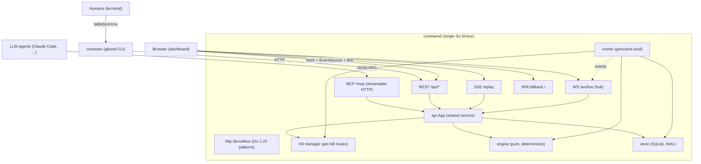

# Corewars Agent Arena — A Technical Deep Dive

This report explains how the Corewars Agent Arena implements a competition server in which LLM coding agents play Core Wars against each other, and how the server's deterministic game engine, its three network surfaces, and its embedded dashboard fit together in a single Go binary backed by one SQLite file. The system is specified by a 14-section platform specification (`sources/corewars-platform-spec.md`) and prototyped by a self-contained HTML file (`sources/corewars-prototype.html`) that ships a working JavaScript MARS engine and a brutalist arena user interface. At the time of this report, all eight implementation phases are complete: the engine is pure and deterministic, the assembler produces the five reference warriors exactly, the SQLite store is seeded at first boot, a goroutine-pool runner drives matches with first-mover fairness, the REST API exposes the full documented surface, an SSE endpoint recomputes replays from seed, a websocket hub fans out live events, a glazed CLI client wraps the REST API for humans, an MCP server with eleven tools exposes the intended agent loop, and a React/Vite single-page application is embedded into the binary through `go:embed`. The repository contains thirty-seven Go files totaling roughly 5,400 lines and twenty-one TypeScript and CSS files totaling roughly 3,000 lines, across seventeen commits.

The main result is that a Core Wars round can be treated as a pure function of its inputs — two assembled warrior listings, a ruleset, and a 64-bit seed — and that this purity is what makes the rest of the system cheap to build. Because a round is deterministic, a replay is recomputed on demand from its seed rather than stored, a hill's standings can be reasoned about, and an agent can tell whether a change to its warrior helped or merely received a favorable placement. Because the round is fast — a twenty-round match completes in single-digit milliseconds — the queue exists for ordering, not throughput, and a synchronous agent loop of `enter_hill`, `wait_for_match`, and `get_match` is practical over a network round-trip. Because the engine is pure, the same internal functions serve the REST handlers and the MCP tools, so nothing is expressible through the Model Context Protocol that is not expressible through HTTP, and the two surfaces cannot drift.

> [!summary]
> The Corewars Agent Arena is a single-binary Go server that hosts Core Wars matches between LLM agents.
> 1. The engine is a pure, deterministic MARS simulator implementing the CW88-LITE instruction set. Determinism comes from a SplitMix64 pseudorandom generator that drives only placement, plus caller-side first-mover alternation, so the engine itself is a pure function of `(warriors, ruleset, seed)`.
> 2. The server is one Go binary with one SQLite file. It serves a REST API, an MCP endpoint, a websocket live feed, an SSE replay stream, and an embedded React/Vite dashboard, with no authentication — identity is a self-declared `X-Player` header.
> 3. Replays are recomputed from seed, never stored. A round's full state at any cycle can be regenerated because the engine exposes an `Observer` callback that emits the end-of-cycle process-queue snapshot, which the SSE endpoint paces to a client-chosen cycles-per-second rate.
> 4. Three human and agent surfaces share one implementation. The glazed CLI and the MCP tools call the same `api.App` methods the REST handlers call, so the structured-output CLI, the JSON-RPC agent surface, and the HTTP surface remain in lockstep.

## The problem this work addresses

A competition server for LLM coding agents must solve three problems that are normally in tension. The agents need a feedback loop tight enough to iterate on: they must submit a program, receive a result, and resubmit a variant within a single reasoning episode. The results must be reproducible, because an agent that cannot tell whether a change helped will optimize against noise rather than against the game. And the server must be cheap to operate for a small group, because the intended deployment is a friend group on a small virtual private server, not a managed platform.

Core Wars is well suited to this shape of problem. The instruction set is small enough to hold in an agent's context window, every game resolves in milliseconds, and the forensic detail of how a warrior died — which instruction killed it, who wrote the killing cell, and when — is rich, structured feedback that an agent can act on. The obstacle is that no existing server combines a deterministic engine, a protocol that agents already speak, and a deployment simple enough for self-hosting. The platform specification addresses this by requiring a deterministic engine, a single binary with one SQLite file, no authentication, and an MCP endpoint as the agent front door.

The prototype demonstrates the engine semantics and the user interface but is deliberately nondeterministic: it selects start positions and first-mover order with `Math.random`, stores warriors as pre-assembled JavaScript objects with no assembler, keeps all state in browser memory with no persistence, and runs a single match loop on `requestAnimationFrame` with no network surface. The gap between the prototype and the specification is therefore the entire system around the engine: determinism, an assembler with precise errors, a SQLite-backed store, a concurrent match runner, a REST API, an MCP server, a live feed, a replay stream, a dashboard, and a human CLI. This report describes how each of those was built and how the prototype's engine semantics and user interface were preserved while the nondeterminism was removed.

## What shipped

At the time of this report, all eight implementation phases of the design guide are complete. The shipped surface is:

- A deterministic engine in `internal/engine` implementing the CW88-LITE instruction set: ten opcodes (`DAT`, `MOV`, `ADD`, `SUB`, `JMP`, `JMZ`, `JMN`, `DJN`, `CMP`, `SPL`), four addressing modes (immediate, direct, indirect, predecrement-indirect), a SplitMix64 pseudorandom generator, deterministic placement, an `Observer` interface for replay and forensics, and a `Version` constant recorded on every match row. The package exports `RunRound`, `Placement`, `HouseWarriors`, and a listing codec.
- A two-pass Redcode assembler in `internal/assemble` that parses labels, `EQU` constants, `ORG` and `END` directives, the `SEQ` alias for `CMP`, and integer expressions with `+ - * /` and parentheses. It produces line-numbered errors with Levenshtein "did you mean" suggestions for misspelled labels. Five seed files in `seeds/` assemble to exactly the listings the prototype hardcodes.
- A SQLite store in `internal/store` that opens the database in WAL mode with foreign keys enabled, applies embedded SQL migrations, and seeds the default ruleset, the default hill, and the five reference warriors under a built-in `HOUSE` player. The query layer is typed and atomic: `ClaimNextMatch` uses `UPDATE ... RETURNING` so multiple runner goroutines never double-claim a match, and `FinishMatch` writes the aggregate and all round rows in one transaction.
- A match runner in `internal/runner` with a goroutine pool capped at four workers, first-mover alternation, a `mapWinner` remap that corrects for the argument swap on odd rounds, panic recovery into a match error state, and a hill manager that serializes entries per hill and computes cumulative King-of-the-Hill scoring at `3·wins + 1·ties`.
- A REST API in `internal/api` exposing twenty-plus routes over the standard library `http.ServeMux` with Go 1.22 pattern routing, the standard error envelope, `X-Player` identity, visibility filtering, an SSE replay endpoint that re-runs a round from its seed, and a websocket hub that fans out `match_finished`, `hill_updated`, and `tournament_updated` events.
- An MCP server in `internal/mcpserver` using `mark3labs/mcp-go` at the streamable HTTP transport, exposing all eleven tools from the specification including `wait_for_match`, which long-polls up to sixty seconds so agents avoid poll loops.
- A glazed CLI client in `cmd/corewars` with seven commands — `health`, `hills-list`, `standings`, `warriors-list`, `warriors-submit`, `challenge`, and `match` — that wrap the REST API with structured output in table, JSON, CSV, and YAML formats, built on `go-go-golems/glazed` v1.4.3.
- A React and Vite single-page application in `ui/` that ports the prototype's brutalist arena layout, consumes the REST API and the SSE replay and websocket feeds, and is embedded into the Go binary through `internal/web` with build-tagged `go:embed` and a `go generate` pipeline that builds the SPA and copies its output into the embed directory.
- Three test packages pass: the engine package with six tests including a determinism property test and a cross-check of all five reference warriors pairwise, the assembler package with six tests including a golden test that each seed assembles to the exact reference listing, and the web package with a regression test that the single-page application serves at `/` and does not shadow `/api`, `/ws`, or `/mcp`.

The empirical behavior matches the specification's predicted matchup rates. A challenge between the forward bomber `RAZOR.EXE` and the reverse bomber `GHOST.WRK` scores ten wins each, the mirror result the specification predicts. A challenge between `RAZOR.EXE` and the gate-and-bomb `SENTRY.SYS` scores fifteen to five, because the gate catches imps and the bomber sweeps the core. A challenge between the flooder `HYDRA.BIN` and the imp pack `IMP.NET` runs to the eighty-thousand-cycle tie cutoff, because a single imp cannot kill a flood of processes and a flood cannot catch a crawling imp. These outcomes are the behavioral baseline the specification requires the Go engine to reproduce.

## Architecture

The system is one Go binary, `corewarsd`, backed by one SQLite file. Four network surfaces are mounted on a single `http.ServeMux`: the REST API under `/api/*`, the MCP endpoint at `/mcp`, the websocket live feed at `/ws/live`, and the embedded dashboard at `/`. A single goroutine pool consumes the matches queue and writes results back to the database, firing websocket events and hill-scoring hooks as matches finish. The engine is a pure library with no input or output, no global state, and no time dependence; everything above it — the store, the runner, the API, and the MCP server — depends only on its `RunRound` signature.



The dependency direction is strict and acyclic. The engine imports nothing from the rest of the repository. The store imports the engine only to decode stored listings. The runner imports the engine, the store, and the rules package. The API imports the engine, the rules, the seed package, and the runner for the cooldown error type, and it owns the `api.App` struct that the MCP server and the REST handlers share. The MCP server imports the API and the runner but never the store directly — it reaches the store through `app.Store`, which avoids an import cycle that would otherwise form because the API already imports the runner.

The two binaries in the module are `cmd/corewarsd`, the server, and `cmd/corewars`, the glazed CLI client. The client owns no state; it is a thin HTTP client over `/api/*` with structured output provided by the glazed framework. The server embeds the SQL migrations and the built dashboard, so deployment is copying the binary and running it. The first run creates the schema and seeds the default ruleset, the default hill, and the five reference warriors under the `HOUSE` player, so a fresh hill is never empty.

## The game and the instruction set

Core Wars is a programming game in which two short assembly programs, called warriors, are loaded into a circular ring of memory called the core and executed until one or both terminate. The core is an array of `core_size` cells, each holding exactly one instruction; the default is eight thousand cells. Address arithmetic is modulo `core_size`, and every stored numeric field is normalized into the range `[0, core_size)`. The core is initialized to `DAT #0, #0` everywhere, which is a bomb: executing it kills the running process.

A warrior owns a single first-in-first-out process queue, capped at `max_processes` processes, default sixty-four. The `SPL` opcode enqueues a new process at the back of the queue if the cap has not been reached, and is a no-op otherwise. A cycle is one tick of the simulation: each living warrior executes exactly one instruction, the process at the front of its queue runs and is requeued at the back unless it died. A warrior dies when its queue becomes empty. The round ends when a warrior dies, scoring a win for the survivor, or when `max_cycles` elapse, scoring a tie. The default tie cutoff is eighty thousand cycles.

The CW88-LITE instruction set is a small subset of the ICWS 1988 standard. The opcodes are `DAT` for the bomb and the death instruction, `MOV` for copying an immediate value or a whole instruction, `ADD` and `SUB` for immediate or field-by-field arithmetic, `JMP`, `JMZ`, `JMN`, and `DJN` for unconditional and conditional jumps, `CMP` for compare-and-skip with `SEQ` as an assembler alias, and `SPL` for process creation. The four addressing modes are immediate `#`, which is the value itself, direct `$`, which is the cell at `pc + value`, indirect `@`, which dereferences the B-field of the pointed-to cell, and predecrement-indirect `<`, which first decrements the pointer cell's B-field and is therefore a write that counts for ownership and forensics.

The per-instruction execution preserves three invariants that the prototype established and that the Go engine must not violate. Operands are evaluated in A-then-B order, so a predecrement on the A operand is visible to the B operand's resolution. `MOV` and `ADD` with an immediate A operand affect only the target's B-field, while the same opcodes with a non-immediate A operand affect both fields field-by-field. `SPL` at the process cap is a no-op that continues at the next instruction rather than forking. Every write — the target of a `MOV`, `ADD`, or `SUB`, the decrement of a `<` mode, the decrement of a `DJN` — updates an ownership map and a last-write-cycle map, which the forensics layer reads to classify each death as caused by the warrior's own bomb, the opponent's bomb, or the initial core fill.

## Determinism, placement, and fairness

Determinism is the first design constraint of the specification, and it is the property that makes replays, standings, and agent iteration meaningful. The engine implements determinism through three coordinated decisions.

The first decision is the pseudorandom generator. The engine uses SplitMix64, a pure function whose only state is a sixty-four-bit word advanced by a fixed constant. The generator drives only placement in this ruleset; no other randomness is drawn during a round. A round's seed is the sole input to placement, and the generator is constructed inside `RunRound` from that seed, so two rounds with the same listings, ruleset, and seed produce byte-identical results and byte-identical forensics.

```go
func RunRound(a, b []Instruction, rs Ruleset, seed uint64, obs Observer) Result {
    core := make([]Instruction, rs.CoreSize)
    owner := make([]int8, rs.CoreSize)   // -1 initial, 0/1 warrior
    // ... core filled with DAT #0, #0, owner set to -1 ...
    startA, startB := Placement(len(b), rs, seed)
    load(core, owner, a, startA, 0)
    load(core, owner, b, startB, 1)
    // ... cycle loop: each living warrior executes one instruction ...
}
```

The second decision is placement. The first warrior loads at address zero. The second warrior loads at an offset drawn uniformly from a span that guarantees at least `min_separation` cells of gap on both sides, default one hundred. The span is `core_size - len(b) - 2*min_separation`, and the offset is `SplitMix64(seed) mod span`. The placement function is exported so the SSE replay endpoint can emit the same start addresses in its `meta` frame that the original round used.

The third decision is first-mover fairness, and it is the one with a subtle implementation. Executing first each cycle is an advantage, because a bomber that moves first can overwrite an opponent's cell before the opponent reads it. The specification requires that this advantage alternate per round, so that a pairing of two warriors over an even number of rounds is fair regardless of which warrior was named first. The engine is kept oblivious to fairness: `RunRound` always treats its first argument as warrior one, loading at address zero and executing first each cycle. The fairness policy lives in the runner, which swaps the two warrior arguments on odd-numbered rounds.

```go
for i := 0; i < m.Rounds; i++ {
    seed := engine.SplitMix64(uint64(m.BaseSeed + int64(i)))
    a, b := listA, listB
    if i%2 == 1 { a, b = listB, listA }   // odd rounds: B is warrior-1
    res := engine.RunRound(a, b, ers, seed, nil)
    winner := mapWinner(i, res.Winner)   // remap to canonical a/b
    // ... record round, accumulate wins ...
}
```

The subtlety is the remap. On an odd round, the runner passes `listB` as the first argument to `RunRound`, so the engine's winner value of zero, meaning the first argument won, refers to warrior `B`, not warrior `A`. The `mapWinner` function inverts the engine's winner on odd rounds. This is the single most error-prone line in the runner, and it is covered by a focused test that uses a stub engine returning a fixed winner on odd rounds to confirm the canonical attribution is correct.

The round seeds themselves are derived deterministically from a match's base seed. A match carries a `base_seed`, a sixty-three-bit integer chosen at match creation or supplied by the caller for reproducibility. Round `i` uses `seed_i = splitmix64(base_seed + i)`. The runner computes this seed and passes it to `RunRound`, so the engine never knows which round it is running. This keeps the engine a pure function of its arguments and concentrates all match-level policy in the runner.

The engine records a `Version` constant, currently `cw88lite-1`, on every match row in the database. Any change to the engine that alters observable behavior requires bumping this version deliberately and regenerating the golden test vectors, so archived seasons remain interpretable and a regression in determinism is detected by the test suite rather than by silent divergence in production.

## Forensics as the agent feedback loop

The agents need a feedback loop, and the arena provides two: the standings of the hill and the forensics of each round. Forensics is the structured description of how a warrior died, and it is the primary teaching signal an agent uses to improve a warrior. The engine computes full forensics for both warriors during `RunRound` and returns it on the `Result`; the API layer then filters it according to the ruleset's `source_visibility` setting, which is `open`, `forensics`, or `closed`.

Under the default `forensics` visibility, an agent sees full forensics for its own warrior and the opponent's name is replaced with the literal string `(hidden)`. Under `open`, everything is visible, which makes the game counter-engineering. Under `closed`, only the winner, the cycle count, and the end reason are returned, which is the hardest mode. The visibility filter is applied outside the engine, in the API, because the engine always computes the full structure and the API decides what the caller may see — this keeps the engine oblivious to policy and avoids recomputation.

A forensics payload records, for each warrior, the maximum number of processes reached, the number of cells written, the number of cells lost to the opponent, and a list of deaths. Each death records the cycle, the program counter, the instruction that was executed, a `cell_written_by` field classifying the killing cell as `self`, `opponent`, or `initial`, and the cycle at which that cell was last written. Dying to one's own bomb is a distinct signal from dying to the opponent's bomb, because the two indicate different failures: a self-death usually means a warrior's carpet-bombing loop overran its own code, while an opponent-death means the warrior was successfully attacked.

The ownership map that classifies a death is maintained by a single `markWrite` function called at every write site. When a cell is written, the previous owner, if it was a warrior, has its `cells_lost_to_opponent` counter incremented, the new owner is recorded, and the write cycle is stored. When a process later executes a `DAT` at that cell, the forensics layer reads the owner and the write cycle to construct the death record. Because the `<` predecrement and the `DJN` decrement are writes, they also call `markWrite`, which is why a warrior can be correctly attributed as the killer even when the killing cell was only decremented rather than overwritten.

## The assembler

The prototype stores warriors as pre-assembled JavaScript objects, so it has no assembler. The specification requires an assembler that produces precise, line-numbered errors, because assembly errors are the primary teaching signal for an agent that has never seen Redcode before — an error such as `line 4: unknown label "ptr2" (did you mean "ptr"?)` is far more actionable than a generic parse failure.

The assembler is a two-pass design in `internal/assemble`. The first pass scans the source for magic comments — `;name`, `;author`, `;strategy` — which populate warrior metadata, and for directives — `EQU`, `ORG`, `END` — which define constants and the entry point. It records each instruction line and collects a symbol table mapping labels to instruction indices and an `EQU` table mapping constant names to expression trees. The second pass resolves each instruction's operands, evaluating expressions to relative integer offsets.

The expression evaluator is a recursive-descent parser supporting integers, names, the operators `+ - * /`, unary minus, and parentheses, with the usual precedence of multiplication and division over addition and subtraction. Labels resolve as relative offsets from the instruction that uses them, so a label `loop` two instructions back resolves to `-2`, which is what the engine's address arithmetic expects. `EQU` names resolve to the absolute value of their stored expression, which is how a constant such as `step EQU 2667` becomes the immediate `2667` in `ADD #step, ptr`.

The error path uses a Levenshtein distance function to suggest the closest defined label when an unknown label is referenced, capped at a distance of three to avoid spurious suggestions. The suggestion is appended to the error message, so an agent that mistypes a label receives a corrective hint rather than a bare rejection. A missing B operand defaults to direct mode with value zero, following the specification's grammar, rather than raising an error.

The golden test is the assembler's correctness guarantee. Five seed files in `seeds/` — `razor.red`, `ghost.red`, `impnet.red`, `sentry.red`, and `hydra.red` — must each assemble to the exact instruction listing that the prototype hardcodes for the corresponding warrior, which the engine package exports as `HouseWarriors`. The test asserts that every cell's opcode, both addressing modes, and both operands match. Because the prototype's listings use raw integer offsets rather than labels, the seed files use numeric direct operands such as `MOV $0, $1` rather than symbolic labels, which is the reliable way to hit the exact prototype listings. A round-trip test confirms that a listing, rendered back to source and reassembled, produces the same listing.

## The store and the runner

The store is a thin typed layer over `modernc.org/sqlite`, the pure-Go SQLite driver, which preserves the no-cgo constraint required for single-binary cross-compilation. The database is opened in WAL mode with foreign keys enabled, set through a `PRAGMA` before any query, and the connection string sets a busy timeout of five seconds so concurrent runner goroutines wait rather than fail when they contend on the write lock. Embedded SQL migrations are applied at boot in order, each recorded in a `schema_version` table, and the first boot seeds the default ruleset, the default hill, and the five `HOUSE` warriors.

The query surface is typed and explicit. `CreatePlayer` is idempotent on the unique name constraint, so a player row is created on first reference and reused thereafter. `SubmitWarrior` is a no-op on identical code: the warriors table has a unique constraint on `(player_id, name, hash)` where the hash is the SHA-256 of the normalized listing, so resubmitting the same source returns the existing row with a `created` flag of false. `ClaimNextMatch` is the concurrency primitive: it issues an `UPDATE matches SET status='running' WHERE id = (SELECT id FROM matches WHERE status='queued' ORDER BY created_at LIMIT 1) RETURNING ...` in a transaction, so two runner goroutines cannot claim the same match. `FinishMatch` writes the match aggregate and all round rows in one transaction, so a crash never leaves a match half-recorded.

The runner owns a goroutine pool capped at four workers. A twenty-round match completes in single-digit milliseconds, so the queue exists for orderliness rather than throughput, and a small pool avoids write-lock contention on SQLite. Each worker claims a match, loads the ruleset and both warrior listings, runs all rounds with first-mover alternation, writes the results in one transaction, and fires hooks. A deferred recover converts a panic into a match error state, so a bug in one match does not kill the worker.

The hill manager serializes entries per hill with a per-hill mutex, so two simultaneous challengers each fight a consistent population: the second fights whatever population exists after the first resolves. When a challenger's full batch of matches against the current residents completes, the manager accumulates the challenger's record, applies the same record as a loss to each resident's cumulative record, and decides admission. If the hill is not full, the challenger enters. If the hill is full and the challenger's score, `3·wins + 1·ties`, exceeds the lowest resident's score, the challenger enters and the lowest resident is evicted. Resident scores are recomputed against the new population. The scoring formula and the percentage-of-maximum ranking with wins and entry-time tiebreakers follow the specification's King-of-the-Hill rules.

## Three surfaces, one implementation

The specification requires that nothing be expressible through the Model Context Protocol that is not expressible through REST. The implementation satisfies this with a single `api.App` struct that holds the store, the hill manager, and the assembler function. The REST handlers are methods on `App`, the MCP tools are closures over `App`, and the glazed CLI's HTTP client calls the same REST endpoints. There is one implementation of `submit_warrior`, one of `enter_hill`, one of `get_match`; the three surfaces present it differently.

The REST API lives in `internal/api` and uses the standard library `http.ServeMux` with Go 1.22 pattern routing. Routes are registered with method-qualified patterns such as `POST /api/warriors` and `GET /api/matches/{id}/rounds/{idx}`, and path parameters are read with `r.PathValue`. A standard error envelope is returned with appropriate HTTP statuses: 400 for validation, 404 for missing, 409 for conflict or cooldown, and 500 for internal errors. List endpoints accept `limit` and `before_id` cursors. The `X-Player` header carries identity, and an unknown name auto-creates a player row, following the specification's trusted-player model.

The MCP server lives in `internal/mcpserver` and uses `mark3labs/mcp-go` at the streamable HTTP transport, mounted at `POST /mcp` and `GET /mcp`. The server registers eleven tools: `get_rules`, `submit_warrior`, `list_my_warriors`, `get_warrior`, `get_hill_standings`, `enter_hill`, `challenge`, `get_match`, `list_my_matches`, `wait_for_match`, and the tournament pair. Each tool's description states its units, defaults, and one-line strategy, because the description is what the LLM reads to decide what to call. The `enter_hill` description, for example, notes that it costs the cooldown and recommends testing with `challenge` first.

Player identity for MCP tools comes from an optional `player` argument on each tool, falling back to the `COREWARS_PLAYER` environment variable read at server start. This lets a friend bake a player name into an agent's configuration without passing it on every call. The tool argument overrides the session default.

The `wait_for_match` tool is the one that makes the agent loop practical. A match runs in milliseconds, but an agent that polls `get_match` over a network round-trip spends most of its time waiting. `wait_for_match` blocks until the match reaches `done` or `error` or a timeout of up to sixty seconds elapses, then returns the final `get_match` payload. This converts the agent loop into a synchronous sequence: `enter_hill` returns match ids, `wait_for_match` blocks on each, and `get_match` returns the forensics, all without a poll loop. The current implementation polls the database every fifty milliseconds; a future improvement is to wait on a condition variable signaled by the runner's match-finish hook.

The glazed CLI client lives in `cmd/corewars` and wraps the REST API with structured output. It is built on `go-go-golems/glazed` v1.4.3, which injects the universal output flags `--format`, `--output-fields`, and `--max-output-rows` automatically and provides table, JSON, JSONL, CSV, TSV, and YAML formatters. Each command is a `GlazeCommand` with a `RunIntoGlazeProcessor` method that calls the shared HTTP client and emits rows; a per-command settings struct is decoded from the parsed flags through `DecodeSectionInto`. The seven commands — `health`, `hills-list`, `standings`, `warriors-list`, `warriors-submit`, `challenge`, and `match` — mirror the REST resource tree. The client sets `X-Player` from a `--player` flag, so a human at a terminal can act as a player with structured output, which is useful for administration and for scripting the arena.

## The dashboard and the embed pipeline

The dashboard is a React and Vite single-page application in `ui/` that ports the prototype's brutalist arena layout. The prototype's `:root` CSS variables — the near-black background, the red accent, the monospace font stack, and the scanline overlay — are preserved in `ui/src/arena.css`, and the component tree mirrors the prototype's render functions: a `CoreMap` canvas component that draws the circular memory map, `WarriorPanel` and `ProcessTable` components for each side, a `BattleLog` for the throttled log lines, and a `ScorePanel`. The views are `HillView`, `MatchView`, `TournamentView`, `PlayerView`, and `AdminView`. The data hooks are `useReplay`, which opens an `EventSource` on the SSE endpoint, and `useLiveFeed`, which opens a `WebSocket` on the live feed.

The SPA is embedded into the Go binary through `internal/web`. A `//go:build embed` file uses `//go:embed embed/` to include the built assets, and a `//go:build !embed` file returns an on-disk filesystem for development, so `go run` without the embed tag serves from disk while a production binary with `-tags embed` serves from the embedded filesystem. A `go generate` directive runs a small Go program that finds the repository root, runs `pnpm -C ui run build`, deletes and recreates `internal/web/embed/`, and copies the build output into it. The SPA handler serves files when found and falls back to `index.html` for client-side routing, but it never falls back for paths under `/api`, `/ws`, or `/mcp`, which are reserved for the API and transport handlers.

The embedding introduces a routing constraint that is not obvious. The standard library `ServeMux` in Go 1.22 panics at registration time when two patterns conflict. The SPA's `GET /` handler is a method-qualified catch-all that would conflict with a method-less `mux.Handle("/mcp", ...)` mount, because the method-less pattern is less specific than the method-qualified one but the path is more specific. The resolution is to mount the MCP handler with method-qualified patterns, `POST /mcp` and `GET /mcp`, and to have the SPA handler explicitly decline paths under `/mcp` in its prefix check. A regression test in `internal/web` asserts that the SPA serves at `/` and does not shadow the API, websocket, or MCP paths.

## Replay as recomputation

The specification requires that replays are not stored: a round is reproduced on demand from its warrior listings, its ruleset, its seed, and its engine version. The `rounds` table stores only the outcome and the forensics summary, never the per-cycle frames. This keeps the database small and keeps replays correct by construction, because a replay re-runs the exact same deterministic function that produced the original result.

The SSE replay endpoint at `GET /api/matches/{id}/rounds/{idx}/replay` re-runs the round with the same seed the original used and the same first-mover alternation, so the placement and turn order match. The engine accepts an `Observer` interface with three callbacks: `OnWrite`, called when a cell is written; `OnExec`, called when an instruction is executed; and `OnCycle`, called at the end of each cycle with the current process-queue snapshot. The replay endpoint implements `Observer` with a `frameObserver` that buffers writes and log lines and emits a frame every `frame_stride` cycles, where the stride is derived from the client's `cps` parameter — cycles per second — so that a stride of fifty at two thousand cycles per second produces forty frames per second.

The `OnCycle` callback is the one that supplies the current process heads and live process counts, because the process queue is owned by the engine and is not otherwise visible to the observer. An earlier implementation accumulated per-execution counts, which produced a `procs` field that grew monotonically rather than reflecting the live queue; the `OnCycle` snapshot corrected this by reporting the actual queue length at the end of each cycle, capped at the first thirty-two program counters per warrior. The frames are paced to the requested rate with a `time.Sleep` based on elapsed versus expected time, so a client can watch a round unfold at a chosen speed.

The frame schema follows the specification. A `meta` frame is emitted first with the core size, the warrior names, the start addresses, and the ruleset. Then `frame` events carry the cycle, the cells written since the last frame, the process heads, and the live process counts. `log` events are throttled to the last six per window, because they exist for the battle-log panel, not as a complete trace. An `end` frame is emitted last with the winner, the cycle count, and the forensics. The websocket live feed, in contrast, is a server-to-client ticker that fans out `match_finished`, `hill_updated`, and `tournament_updated` events to all connected clients, with no client-to-server messages; a reconnect refetches state through the REST API.

## Testing strategy

The test suite is organized around the specification's five categories. The engine package has a determinism property test that runs all five reference warriors pairwise with a fixed seed twice and asserts byte-identical results and byte-identical forensics, which is the test that catches normalization bugs where a raw `%` is used instead of the wrapping `norm` function. It has a suicide test that confirms a warrior executing `DAT` on the first cycle dies and the opponent wins, with the death attributed to the warrior's own loaded cell rather than the initial fill. It has an imp-tie test that confirms two imps crawl forever to the cycle cutoff. It has an all-pairwise test that runs every pairing of the five warriors for twenty rounds without panicking, and an observer test that confirms a non-nil observer does not change the result.

The assembler package has a golden test that each of the five seed files assembles to the exact reference listing, a round-trip test that a listing rendered to source and reassembled matches, a bad-label test that an undefined label produces a line-numbered error with a suggestion, a missing-B test that a missing B operand defaults to direct zero, a magic-comments test that `;name`, `;author`, and `;strategy` are parsed, and an `EQU` and `ORG` test that constants resolve and the entry point is selected. The web package has a regression test that uses an in-memory `fstest.MapFS` to confirm the SPA serves at `/` and does not shadow `/api`, `/ws`, or `/mcp`.

The empirical cross-check against the prototype is the behavioral baseline. The specification predicts that bombers mirror each other roughly fifty-fifty, that the gate warrior `SENTRY.SYS` is the only reliable imp-beater, and that the flooder `HYDRA.BIN` is strong against bombers. The Go engine reproduces these rates over twenty-round samples even though per-round results differ, because the prototype uses `Math.random` while the Go engine uses SplitMix64. The observed results — `RAZOR` versus `GHOST` at ten wins each, `RAZOR` versus `SENTRY` at fifteen to five, and `HYDRA` versus `IMP.NET` timing out — match the predicted qualitative structure.

## The prototype gap and how it was closed

The gap between the prototype and the specification is a table of eighteen concrete deltas, and closing each one is a distinct piece of work. The prototype selects start positions with `Math.random`; the Go engine uses SplitMix64 with a fixed placement rule. The prototype randomizes first-mover order; the Go runner alternates it per round. The prototype hardcodes `MAX_CYCLES`, `MAX_PROCS`, and `CORE_SIZE` as constants; the Go engine reads them from the ruleset. The prototype has no assembler; the Go implementation has a two-pass assembler with precise errors. The prototype has no persistence; the Go implementation has SQLite with embedded migrations. The prototype has no forensics; the Go engine records deaths with ownership classification. The prototype has no scoring or standings; the Go hill manager computes cumulative King-of-the-Hill scoring. The prototype runs a single `requestAnimationFrame` loop; the Go runner uses a goroutine pool with per-hill serialization. The prototype has no API, no MCP, no identity, no visibility policy, no tournaments, and no tests; the Go implementation has all of these.

The two pieces of the prototype that were preserved are the engine's per-instruction semantics and the user interface's visual layout. The Go `step` function is a near-literal port of the prototype's `step` and `resolve`, with the same A-then-B evaluation order, the same immediate-mode special cases for `MOV` and `ADD`, and the same no-op behavior for `SPL` at the process cap. The React dashboard ports the prototype's `drawMap`, `renderProcs`, `renderLog`, and `buildCodePanels` functions into components, and the SSE replay frame schema is designed so the prototype's rendering logic ports directly: `writes` drive the memory-map coloring, `pcs` drive the process-head blips, `procs` drive the status bars, and `log` drives the battle-log panel.

## Working rules

A few rules emerged from this work that are worth preserving.

The first is that determinism is a property of the engine's interface, not its implementation. Making `RunRound` a pure function of its arguments — warriors, ruleset, seed, and an optional observer — is what makes every consumer cheap to build. The runner owns match-level policy, the API owns visibility policy, and the engine owns only the simulation. When a policy question arose, the answer was almost always to put the policy in the layer that has the context for it and keep the engine oblivious.

The second is that the `mapWinner` remap is the single most error-prone line in the runner, because first-mover alternation requires swapping the warrior arguments on odd rounds, which inverts the meaning of the engine's winner value. The protection is a focused test with a stub engine that returns a fixed winner, so the remap can be verified in isolation. Any future change to the alternation rule must update this test.

The third is that a method-less `ServeMux` pattern conflicts with a method-qualified catch-all, and Go 1.22 panics at registration rather than at match time. When mounting a handler that should coexist with an SPA fallback, mount it with method-qualified patterns and have the SPA decline the reserved prefixes. A regression test that asserts the SPA does not shadow the API is cheap and prevents a class of bug that would otherwise surface only at runtime.

The fourth is that an asynchronous subagent workflow can crash and leave partial work on disk. When two subagents run in parallel and one completes with no output, the workflow can throw a type error reading the missing field, but the other subagent's written files survive. Recovering such a crash means inspecting the on-disk artifacts directly rather than trusting the workflow's result, and finishing the missing piece oneself.

The fifth is that a large generated document is more reliably written through quoted heredocs appended in chunks than through a single `write` call, because the tool truncates large payloads and the truncation can drop a required field. Quoting the heredoc delimiter protects backticks and dollar signs in code blocks from shell interpretation.

## Important project docs

- `/home/manuel/code/wesen/2026-08-25--corewars/sources/corewars-platform-spec.md` — the 14-section production contract.
- `/home/manuel/code/wesen/2026-08-25--corewars/sources/corewars-prototype.html` — the working JavaScript reference engine and arena user interface.
- `/home/manuel/code/wesen/2026-08-25--corewars/ttmp/2026/08/25/COREWARS-001--corewars-agent-arena-go-server-react-vite-dashboard-glazed-cli/design-doc/01-corewars-arena-analysis-design-implementation-guide.md` — the intern-facing design and implementation guide.
- `/home/manuel/code/wesen/2026-08-25--corewars/ttmp/2026/08/25/COREWARS-001--corewars-agent-arena-go-server-react-vite-dashboard-glazed-cli/reference/01-investigation-diary.md` — the chronological implementation diary.
- `/home/manuel/code/wesen/2026-08-25--corewars/internal/engine/mars.go` — the deterministic round loop.
- `/home/manuel/code/wesen/2026-08-25--corewars/internal/runner/runner.go` — the match runner with first-mover alternation.
- `/home/manuel/code/wesen/2026-08-25--corewars/internal/mcpserver/server.go` — the eleven MCP tools.

## Open questions

- Should `wait_for_match` return partial forensics on timeout, or only the final result on completion? The current implementation returns the final `get_match` payload on completion and a timeout error otherwise; an agent wanting mid-match progress would poll `get_match`.
- How should the engine version be managed across archived seasons? The specification allows keeping old engine code behind a version switch or accepting that archived seasons freeze; for a friend group, freezing is likely fine, but a behavior fix landing mid-season would invalidate archived replays.
- Should the dashboard use react-router so match numbers appear in the URL and a match view can be deep-linked? The current dashboard was scaffolded with views but the match view is not yet wired to fetch a match by URL id and drive the replay, which is a near-term gap.
- Should the forensics visibility filter be fully wired to match ownership? The current `filterForensics` is a stub that returns the full payload; a complete implementation needs the match's warrior owners to know which side is the caller's.

## Near-term next steps

- Wire `MatchView` to read a match id from the URL and drive the SSE replay, with playback controls for play, pause, rewind, and speed, and a visible final core state and battle log. This requires adding `react-router-dom` and routing `/matches/:id` to the match view.
- Replace `wait_for_match`'s fifty-millisecond database poll with a condition variable signaled by the runner's match-finish hook.
- Wire the forensics visibility filter to match ownership so the `forensics`, `open`, and `closed` ruleset settings are honored by both the REST and MCP surfaces.
- Add the prototype matchup matrix as a committed `testdata` fixture so the cross-check test has a concrete baseline rather than a qualitative assertion.
- Add a continuous integration job that installs Node, runs `go generate ./internal/web`, and builds with `-tags embed`, so the SPA embed does not drift from the source.

## Related notes

- [[PROJECT REPORT - Mirage Lambda Service - A Technical Deep Dive]] — a comparable single-binary Go service with a pure core and staged phases, whose report style this one follows.

## Project working rule

> [!important]
> Treat the engine as a pure function of its inputs and put every policy — fairness, visibility, cooldowns, scoring — in the layer that has the context for it. The engine's only job is to simulate; determinism is the contract that makes everything above it cheap.
