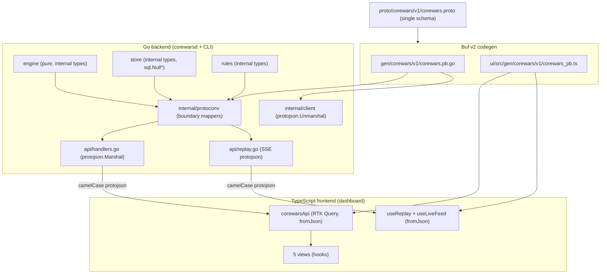

# Corewars Schema Migration — A Technical Deep Dive

This report explains how the Corewars Agent Arena eliminated its hand-written type mirrors and runtime normalizers by adopting a single protobuf schema as the source of truth across its Go backend, Go CLI, and TypeScript frontend, and how the frontend state migrated from local per-view `useState` fetches to Redux Toolkit and RTK Query. The migration was specified by a design document in ticket `COREWARS-002` and executed across four phases: schema authoring and code generation, backend `protojson` emission and CLI proto-typed decoding, an RTK Query frontend with `fromJson` transforms, and the deletion of the dead hand-written layer with full validation. The repository contains a single protobuf schema of thirty-three messages, a boundary-mapper package that translates internal engine and store types into generated proto messages, a generic `writeProtoList` helper that emits JSON arrays of proto messages, an RTK Query API slice with twenty-one endpoints, and zero surviving hand-written type interfaces or runtime normalizers in the frontend.

The main result is that the implicit JSON contract between the server and its three consumers is now explicit and enforced at compile time on both sides. Before the migration, the backend built JSON responses from `map[string]any` literals with field names decided ad hoc per handler, and the frontend maintained twenty-seven hand-written interfaces that drifted from those ad-hoc shapes. Three runtime normalizer functions papered over the drift by renaming fields and parsing the warrior `listing` column from a JSON string with PascalCase Go keys into the TypeScript shape. Two of these normalizers existed solely because the backend and the frontend used different names for the same field: the backend returned `standings` while the frontend expected `entries`, and the backend returned `name_a` while the frontend expected `warrior_a_name`. After the migration, every response shape is declared in one `.proto` file, both Go and TypeScript code generate from it, the Go backend emits `protojson` (camelCase), and the TypeScript frontend decodes with `fromJson` inside RTK Query's `transformResponse`. A schema change is now a compile error on both sides rather than a silent runtime crash.

> [!summary]
> The Corewars Schema Migration replaces hand-written type mirrors and runtime normalizers with a single protobuf schema that generates both Go and TypeScript types.
> 1. The schema is the single source of truth. A `proto/corewars/v1/corewars.proto` file with thirty-three messages covers every REST and SSE response shape. Buf v2 codegen produces Go types in `gen/corewars/v1/` and TypeScript types in `ui/src/gen/corewars/v1/`.
> 2. The backend emits `protojson`, not `encoding/json`. An `internal/protoconv` package maps internal engine and store types to generated proto messages at the boundary, and every handler marshals with `protojson.Marshal` (camelCase). The engine and store stay free of any protobuf dependency.
> 3. The frontend uses RTK Query with `fromJson` transforms. Redux Toolkit provides the store; an API slice with twenty-one endpoints decodes each response via `fromJson(Schema, data)` in `transformResponse`. The cache holds typed proto messages; no normalization pass runs on the client.
> 4. The hand-written layer is deleted. After the migration, `ui/src/types.ts` (twenty-seven interfaces), `ui/src/api/client.ts` (three normalizers), `ui/src/api/mock.ts`, and `ui/src/api/runtime.ts` are removed. `tsc --noEmit` passes clean after deletion, proving no live code depended on them.

## The problem this work addresses

The Corewars Agent Arena, as built in ticket `COREWARS-001`, had an implicit contract between its Go backend and its three consumers — the React dashboard, the glazed CLI, and the MCP server. The backend's `internal/api/handlers.go` constructed every JSON response by hand, building `map[string]any` literals whose field names were decided per handler rather than per schema. The frontend's `ui/src/types.ts` maintained twenty-seven hand-written TypeScript interfaces that mirrored the documented REST response shapes. Because these interfaces were maintained by hand, they drifted from the actual backend response shapes.

Two concrete bugs in the COREWARS-001 dashboard exposed this drift. The MatchView component crashed with `s.map is not a function` because the backend returned a `round_results` array while the TypeScript `MatchSummary` interface expected `rounds_outcome`, so the runtime `.map` call operated on `undefined`. The HillView component crashed because the backend returned `standings` while the TypeScript `HillStandings` interface expected `entries`. In both cases, the TypeScript type system reported no error because the interface said the field existed; the crash was at runtime, when the actual JSON shape disagreed with the declared shape.

The fix applied at the time was to add three runtime normalizer functions to `ui/src/api/client.ts`. `normalizeWarrior` parsed the warrior's `listing` field — which the backend stored as a JSON string with PascalCase Go keys (`Op`, `AM`, `A`, `BM`, `B`) and numeric opcode and mode values — into the TypeScript `InstructionListing[]` shape with mnemonic strings and mode characters. `normalizeMatch` renamed `name_a` to `warrior_a_name`, `name_b` to `warrior_b_name`, `player_a` to `player_a_name`, `player_b` to `player_b_name`, and `round_results` to `rounds_outcome`. `normalizeHill` renamed `standings` to `entries`. These normalizers were applied in every relevant API call: `getWarrior`, `listWarriors`, `submitWarrior`, `getMatch`, `listMatches`, `challenge`, and `getHill`.

The normalizers were a code smell. They existed only because the contract was implicit, not declared. Any new endpoint or field required a matching normalizer or the frontend would silently break again. The `listing` field was a JSON string parsed on the client, which meant the client had to know the engine's internal PascalCase key names and numeric opcode values. The field-name mismatches (`standings` versus `entries`, `name_a` versus `warrior_a_name`) were pure accidental complexity with no semantic difference. The goal of COREWARS-002 was to eliminate both the hand-written type mirrors and the runtime normalizers by making the contract explicit and generating the types on both sides from one schema.

## What shipped

At the time of this report, all four implementation phases of the design document are complete. The shipped surface is:

- A protobuf schema in `proto/corewars/v1/corewars.proto` with thirty-three messages covering every REST response shape and every SSE replay event: `Health`, `Rulebook`, `Ruleset`, `RulesetSummary`, `Listing`, `Instruction`, `Warrior`, `WarriorSummary`, `Hill`, `HillSummary`, `Standing`, `Match`, `MatchSummary`, `RoundOutcome`, `RoundDetail`, `Forensics`, `WarriorForensics`, `Death`, `Tournament`, seven small response envelopes (`CreateIdResponse`, `EnterHillResponse`, `CreateChallengeResponse`, `DeleteWarriorResponse`, `ResetHillResponse`, `CancelMatchResponse`), and seven replay frame messages (`ReplayMeta`, `ReplayFrame`, `FrameWrite`, `FramePcs`, `FrameProcs`, `ReplayLog`, `ReplayEnd`).
- Buf v2 configuration with `buf.yaml` (module at `proto/`) and `buf.gen.yaml` (remote plugins: `protocolbuffers/go` to `gen/` with `paths=source_relative`, `bufbuild/es` to `ui/src/gen` with `target=ts`). `buf lint` is clean and `buf generate` produces `gen/corewars/v1/corewars.pb.go` (package `corewarsv1`, eighty-two kilobytes) and `ui/src/gen/corewars/v1/corewars_pb.ts` (thirty-three kilobytes, exporting `*Schema` constants and message classes).
- An `internal/protoconv` package with thirty-three boundary-mapper functions that translate internal `engine`, `store`, and `rules` types into generated proto messages. The engine's numeric `Opcode` and `Mode` enums become the proto's string spellings through the exported `Opcode.String()` and `Mode.Char()` methods. The store's `sql.NullInt64` and `sql.NullString` fields become proto zero values. The stored `listing` JSON string is decoded to a structured `Listing` message at the boundary.
- A backend `internal/api` layer where all twenty-four REST handlers and the SSE replay emitter construct proto messages via `protoconv` and marshal with `protojson.Marshal` (camelCase). A generic `writeProtoList[T proto.Message]` helper (Go 1.26 type parameters) emits JSON arrays of proto messages. The `warriorResponse` reflection hack, the `filterForensics` stub, and the `rulebook` builder are removed from handlers and centralized in `protoconv`.
- A CLI `internal/client` that decodes responses via `protojson.Unmarshal` into generated proto types. `GetList` splits a top-level JSON array (which `protojson` cannot unmarshal directly) via `json.RawMessage` and decodes each element individually. Seven glazed commands in `cmd/corewars/cmd/commands.go` read proto-typed fields.
- A frontend Redux Toolkit store (`ui/src/store.ts`) with a single RTK Query API slice (`ui/src/api/corewarsApi.ts`) defining twenty-one endpoints with `fromJson` transforms in every `transformResponse`. Five tag types (`Hill`, `Warrior`, `Match`, `Ruleset`, `Tournament`) drive automatic cache invalidation and refetching on mutations.
- Five views (`HillView`, `MatchView`, `PlayerView`, `TournamentView`, `AdminView`) and three components (`WarriorPanel`, `BattleLog`, `CoreMap`) migrated from the hand-written `api` client to RTK Query hooks and generated proto types. The `useReplay` SSE hook and the `useLiveFeed` websocket hook are rewritten to decode events via `fromJson` and to use camelCase proto field names.
- The four hand-written files deleted: `ui/src/types.ts` (twenty-seven interfaces), `ui/src/api/client.ts` (three normalizers), `ui/src/api/mock.ts`, and `ui/src/api/runtime.ts`. `pnpm -C ui exec tsc --noEmit` passes clean after deletion, confirming no live code depended on them.

The empirical behavior matches the pre-migration output. The CLI `corewars health` renders the same version, engine version, and queue depth table; `corewars standings 1` renders the same ranked standings table; `corewars warriors-list --player alpha` renders the same warrior list. The browser dashboard renders the Hill view with the same standings table and the Match view with the same arena layout, warrior panels, core map, and replay stream. Both render with zero console errors.

## Architecture

The migration introduces a new dependency direction: a `proto/` schema sits above everything, and both the Go and TypeScript sides generate from it. The Go backend's `internal/protoconv` package is the single boundary where internal types become proto messages. The frontend's RTK Query API slice is the single boundary where `protojson` wire JSON becomes typed proto messages. Everything below `protoconv` on the Go side and below the API slice on the TypeScript side is unchanged: the engine, the store, the runner, the React components all keep their existing internal types; only the wire boundary moves.



The generated code is committed to the repository rather than gitignored, so the project builds without `buf` installed. A developer who changes the schema runs `buf generate` to regenerate; a CI pipeline or a contributor who only consumes the generated types builds directly from the committed output. The `gen/doc.go` file documents the regenerate command.

The `protoconv` package is the key architectural decision. The engine's `Instruction` struct uses numeric `Opcode` and `Mode` enums with unexported `opcodeName` and `modeChar` arrays. The proto `Instruction` uses string fields (`op`, `am`, `bm`) for the mnemonic and mode characters. Rather than adding a protobuf dependency to the engine, the conversion lives in `protoconv.InstructionFromEngine`, which calls the engine's exported `Opcode.String()` and `Mode.Char()` methods. This keeps the engine pure and the boundary translation centralized in one file that depends on both the engine and the generated code.

## The schema and the int32 decision

The protobuf schema declares every REST and SSE response shape in one file. The messages follow the data model of the platform specification: a `Warrior` carries an assembled `Listing` of `Instruction` cells, a `Match` references two warriors and carries `RoundOutcome` entries, a `Hill` carries `Standing` entries with computed rank and score percentage, a `Ruleset` carries the meta-game knobs, and `Forensics` carries the per-warrior death detail. Seven small response envelopes (`CreateIdResponse`, `EnterHillResponse`, etc.) model the `{id: X}` and `{match_ids: [...]}` shapes the handlers return for POST operations.

The replay messages carry a `type` string field as their first field. The backend sets this to `"meta"`, `"frame"`, `"end"`, or `"log"` before marshaling, so each SSE `data:` line carries its own discriminator. This is a small contract wart — a proto purist might prefer a `oneof` envelope — but it preserves the existing SSE wire shape and the frontend's `switch (ev.type)` parsing with zero wire-format breakage.

The most consequential schema decision is the width of integer fields. The design document's original sketch used `int64` for every identifier and count. The implementation refined this: all identifiers and counts are `int32`, and only `seed` and `base_seed` are `int64`.

The reason is `protojson`'s handling of `int64`. `protojson` emits `int64` fields as JSON strings (per the proto3 canonical JSON mapping), and `@bufbuild/protobuf`'s `fromJson` yields `bigint` for those fields in TypeScript. If every identifier were `int64`, the frontend would receive `bigint` for `warriorId`, `matchId`, `hillId`, and every foreign key. Bigint cannot be compared with `===` against a number, cannot be used directly as a React key without coercion, and cannot be interpolated into a URL template without `String()`. Every view would need `Number(m.id)` or `String(m.id)` at every use site.

The corewars identifiers are sequential database row IDs that will never exceed two to the thirty-first. Making them `int32` causes `protojson` to emit them as JSON numbers and `fromJson` to yield TypeScript `number`, which works naturally with `===`, React keys, and URL templates. The `seed` and `base_seed` fields are outputs of SplitMix64, which produces full sixty-four-bit values, so they remain `int64` and become `bigint` in TypeScript. These fields are display-only — the frontend shows them in forensics and round detail — so the `String()` coercion is localized to the few places that render them.

```proto
message Warrior {
  int32 id = 1;          // TS number, usable as React key
  int32 player_id = 2;   // TS number
  string name = 3;
  string source = 4;
  Listing listing = 5;   // nested message, not a JSON string
  int32 length = 6;
  string hash = 7;
  string created_at = 8;
}

message RoundOutcome {
  int32 idx = 1;
  int64 seed = 2;        // TS bigint, display via String()
  string winner = 3;
  int32 cycles = 4;
}
```

The `listing` field is the other consequential decision. In the pre-migration backend, the warrior's `listing` column was a JSON string with PascalCase Go keys (`Op`, `AM`, `A`, `BM`, `B`) and numeric opcode and mode values. The frontend's `normalizeWarrior` parsed this string with `JSON.parse` and mapped the numeric values to mnemonic strings and mode characters. In the proto schema, `listing` is a nested `Listing` message containing a `repeated Instruction` field. `protoconv.ListingFromStored` decodes the stored JSON string to an `engine.Listing` at the boundary and converts it to the proto `Listing`, so the wire format is structured and the frontend never parses JSON. The client-side `JSON.parse` step is eliminated entirely.

## The boundary mapper

The `internal/protoconv` package contains one mapper function per proto message. Each function takes internal types and returns a pointer to a generated proto message. The mappers are pure: they allocate a new message, copy fields, and return. The engine and store packages import nothing from `protoconv` or from the generated code; the dependency runs in one direction, from `protoconv` down to the internal packages.

The instruction mapping illustrates the boundary pattern. The engine's `Instruction` struct stores `Op` as an `Opcode` enum (a `uint8`), `AM` and `BM` as `Mode` enums (also `uint8`), and `A` and `B` as `int`. The proto `Instruction` stores `op`, `am`, and `bm` as strings and `a` and `b` as `int32`. The mapper calls the exported methods:

```go
func InstructionFromEngine(ins engine.Instruction) *corewarsv1.Instruction {
    return &corewarsv1.Instruction{
        Op: ins.Op.String(),           // "DAT", "MOV", ...
        Am: string(ins.AM.Char()),     // "#", "$", "@", "<"
        A:  int32(ins.A),
        Bm: string(ins.BM.Char()),
        B:  int32(ins.B),
    }
}
```

The null-field handling illustrates the store-boundary pattern. The store's `Match` struct uses `sql.NullInt64` for `AWins`, `BWins`, `Ties`, `ScoreA`, and `ScoreB` because a match may be queued and not yet scored. `protojson` cannot marshal `sql.NullInt64`, and the proto fields are `int32`. The mapper extracts the value when valid and returns zero otherwise:

```go
func nullInt64Val(v sql.NullInt64) int64 {
    if v.Valid {
        return v.Int64
    }
    return 0
}
```

A queued match therefore emits `"aWins": 0` (or rather, the field is omitted because `protojson` omits zero-valued scalars by default) and `fromJson` on the client fills the proto default of `0`. The frontend's `m.aWins` is always a valid `number`, never `undefined` or `null`.

The forensics visibility filtering is centralized in `protoconv.FilterForensics`. The `closed` visibility mode returns only the summary fields (`winner`, `cycles`, `end`); the `forensics` and `open` modes return full detail. The current implementation is a stub that returns full detail under `forensics` — a complete implementation would redact the opponent's side based on match ownership, which requires the match's warrior owners. This is a pre-existing limitation carried from COREWARS-001 and is unchanged by the migration.

## The backend emits protojson

Every REST handler in `internal/api/handlers.go` follows the same pattern: fetch internal types from the store, convert them to proto messages via `protoconv`, and marshal with `protojson.Marshal` through one of three helpers. The helpers live in `internal/api/api.go`:

```go
// writeProto marshals a single proto message with protojson (camelCase).
func writeProto(w http.ResponseWriter, status int, msg proto.Message) {
    b, err := protojson.Marshal(msg)
    if err != nil {
        writeError(w, 500, "proto_marshal", err.Error(), nil)
        return
    }
    w.Header().Set("Content-Type", "application/json")
    w.WriteHeader(status)
    _, _ = w.Write(b)
    _, _ = w.Write([]byte("\n"))
}

// okProto writes a 200 with the proto message.
func okProto(w http.ResponseWriter, msg proto.Message) { writeProto(w, 200, msg) }

// writeProtoList writes a 200 with a JSON array of proto messages.
func writeProtoList[T proto.Message](w http.ResponseWriter, msgs []T) {
    w.Header().Set("Content-Type", "application/json")
    w.WriteHeader(200)
    w.Write([]byte("["))
    for i, m := range msgs {
        if i > 0 {
            w.Write([]byte(","))
        }
        b, err := protojson.Marshal(m)
        if err != nil {
            writeError(w, 500, "proto_marshal", err.Error(), nil)
            return
        }
        w.Write(b)
    }
    w.Write([]byte("]\n"))
}
```

`writeProtoList` is generic because Go slices are invariant: `[]*corewarsv1.WarriorSummary` does not assign to `[]proto.Message`. A type parameter `[T proto.Message]` lets one helper serve every list endpoint without a per-type wrapper or a reflection-based fallback. Go 1.26 supports this constraint syntax.

The SSE replay emitter in `internal/api/replay.go` was rewritten to accumulate proto-typed writes, logs, and process snapshots during each cycle and emit `ReplayFrame` messages. The `frameObserver` struct's fields changed from `[]frameWrite` and `[]map[string]any` to `[]*corewarsv1.FrameWrite` and `[]*corewarsv1.ReplayLog`. The `emitMeta`, `emitFrame`, and `emitEnd` methods build proto messages and marshal with `protojson.Marshal`. The `type` discriminator is set on each message before marshaling.

A pre-existing bug in the SSE replay was exposed and fixed during this migration. The backend emits SSE events as `data: {...}\n\n` without an `event:` line. The `EventSource` API fires named event listeners only when the server sends `event: name\n` before the `data:` line. The old `useReplay` hook listened for named events (`"meta"`, `"frame"`, `"log"`, `"end"`) which never fired against the real backend — only the mock source, which did emit named events, worked. The rewritten hook listens for the `message` event and dispatches by the JSON `type` discriminator, which is the correct pattern for a server that does not send named events.

## The CLI decodes proto types

The CLI's `internal/client` package was rewritten to decode responses via `protojson.Unmarshal` into generated proto types. The `Get`, `GetList`, and `Post` methods replace the old `json.Unmarshal`-based `do` method. `GetList` handles the one awkward case: `protojson.Unmarshal` cannot decode a bare top-level JSON array into a repeated field wrapper, so `GetList` splits the array via `json.RawMessage` and decodes each element individually:

```go
func (c *Client) GetList(path string, make func() protoMessage, append func(protoMessage)) error {
    data, err := c.do("GET", path, nil)
    if err != nil {
        return err
    }
    arr, err := splitJSONArray(data)
    if err != nil {
        return err
    }
    for _, elem := range arr {
        m := make()
        if err := protojson.Unmarshal(elem, m); err != nil {
            return err
        }
        append(m)
    }
    return nil
}
```

The typed API methods (`Health`, `HillStandings`, `ListHills`, `ListWarriors`, `SubmitWarrior`, `Challenge`, `Match`) return generated proto types. The seven glazed commands in `cmd/corewars/cmd/commands.go` read proto-typed fields: `h.Version` instead of `h["version"]`, `st.WarriorName` instead of `st.Warrior`, `m.WarriorAName` instead of `m.NameA`, `w.Id` instead of `w.ID`. The `--format table/json/csv` output is unchanged because the glazed framework reads the row values the commands emit, not the response types.

One generated-field naming collision required attention. The proto `ResetHillResponse` has a field named `reset`, but the protoc-gen-go Go generator renames it to `Reset_` (with a trailing underscore) because `Reset` collides with the `proto.Message.Reset()` method that every generated message implements. The JSON field stays `reset` — the collision is only in the Go struct field name. The handler uses `ResetHillResponse{Reset_: int32(id)}`.

## The frontend uses RTK Query

The frontend's state migrated from local per-view `useState` and `useEffect` fetches to a single Redux Toolkit store with one RTK Query API slice. The store is minimal: it holds only the API slice's reducer and middleware, with no hand-written reducers. The `setupPlayerHeader` function runs on store import to restore the `X-Player` identity from `localStorage` (defaulting to `"AGENT"`).

The API slice defines twenty-one endpoints across health, rules, rulesets, warriors, hills, matches, and tournaments. Every query and mutation endpoint specifies a `transformResponse` that calls `fromJson(Schema, data)`:

```ts
getWarrior: builder.query<Warrior, number>({
  query: (id) => `/warriors/${id}`,
  transformResponse: (r: unknown) => fromJson(WarriorSchema, r as any),
  providesTags: (_r, _e, id) => [{ type: "Warrior", id }],
}),
```

Five tag types drive cache invalidation. A `submitWarrior` mutation has `invalidatesTags: ["Warrior"]`, so every cached warrior list refetches automatically after a submission. A `resetHill` mutation has `invalidatesTags: (_r, _e, id) => [{ type: "Hill", id }]`, so only the affected hill refetches. This replaces the old per-view `useEffect` refetch logic, which was duplicated across every view and had no shared cache.

The `fromJson` function in `@bufbuild/protobuf` v2 is a standalone function, not a method on the message class. The design document's sketch used the v1 method form `Warrior.fromJson(r)`, but v2 changed to `fromJson(WarriorSchema, r)`. The generated `*Schema` constants are the message descriptors that `fromJson` uses to drive the decode. The `r as any` cast is necessary because RTK Query's `transformResponse` receives `unknown` and `fromJson` expects `JsonValue`; the cast mirrors the skill's recommended pattern and is safe because `protojson` output is always valid JSON.

The `useReplay` hook was rewritten to listen for the `message` event (the SSE bug fix described above) and to decode each event via `fromJson` with the appropriate schema. The `useLiveFeed` websocket hook was rewritten with a local `LiveEvent` type that mirrors the proto `Match`'s camelCase field names, so the `match_finished` event renders directly in HillView's recent-results ticker. The backend's `Hub.MatchFinished` method was updated to emit camelCase proto field names (`warriorAName`, `aWins`, `scoreA`) so the live feed and the REST responses share one shape.

The `useGetWarriorQuery` hook in MatchView uses the `skip` option to avoid fetching before the match query resolves:

```ts
const { data: match } = useGetMatchQuery(matchId);
const { data: wa } = useGetWarriorQuery(match?.warriorA ?? 0, { skip: !match?.warriorA });
```

RTK Query requires a concrete argument type for the hook's cache key. `match?.warriorA` could be `undefined` before the match loads, so the `?? 0` provides a number and `{ skip: !match?.warriorA }` prevents the fetch until the match is available. This is the standard RTK Query pattern for dependent queries.

## What was removed

After the migration, four files were deleted:

- `ui/src/types.ts` — twenty-seven hand-written TypeScript interfaces that mirrored the REST response shapes.
- `ui/src/api/client.ts` — the `CorewarsApi` interface, the `realApi` implementation, and the three runtime normalizers (`normalizeWarrior`, `normalizeMatch`, `normalizeHill`).
- `ui/src/api/mock.ts` — the mock API implementation and mock event sources.
- `ui/src/api/runtime.ts` — the runtime resolver that picked mock versus real API and streaming sources.

The surviving API layer is `ui/src/api/corewarsApi.ts` (the RTK Query slice) and `ui/src/api/player.ts` (the X-Player identity module). The proof that the deletion was safe is `pnpm -C ui exec tsc --noEmit` passing clean immediately after deletion: if any live view, component, or hook still imported the deleted files, the TypeScript compiler would report the missing modules. No errors were reported, confirming the generated types and RTK Query fully replaced the hand-written layer.

## Results and validation

The migration was validated at each phase and at the end. The final validation is:

- `pnpm -C ui exec tsc --noEmit` passes clean (exit 0).
- `pnpm -C ui run build` produces a 351-kilobyte bundle.
- `go generate ./internal/web` embeds the built dashboard.
- `go build -tags embed ./cmd/corewarsd` produces the single binary.
- `go test ./internal/engine/ ./internal/assemble/ ./internal/web/` all pass.
- `go build ./...` (full module, including `gen/`, `protoconv`, `api`, `client`, `cmd`) passes clean.
- The CLI renders the same tables as before: `corewars health`, `corewars standings 1`, `corewars warriors-list --player alpha`.
- The browser dashboard renders the Hill and Match views with zero console errors.

The wire format changed from ad-hoc `map[string]any` JSON with inconsistent field names to `protojson` with consistent camelCase names. Before the migration, `/api/hills/1` returned `{"standings": [...]}`; after, it returns `{"entries": [...]}`. Before, `/api/matches/1` returned `{"name_a": "...", "round_results": [...]}`; after, it returns `{"warriorAName": "...", "roundsOutcome": [...]}`. Before, the warrior `listing` was a JSON string with PascalCase keys; after, it is a structured `Listing` message with `instructions` as an array. These are breaking changes to the wire format, but the only consumers are the project's own frontend and CLI, which were migrated in lockstep.

## Open questions and follow-ups

Three minor issues are carried forward and are not blockers for the migration.

The `listMatches` handler now returns full `Match` objects (with warrior names and scores) rather than the `MatchSummary` subset, because the frontend list rows render names and scores. This introduces an N+1 query: each of the fifty list rows triggers a `MatchNames` and `ListRounds` call. This is acceptable for a friend-group arena with tens of matches, but a single JOIN query is the proper fix.

The `setPlayerName` call in `PlayerView` runs on every render rather than in a `useEffect`. It is idempotent — it sets a module-level string — but a side effect in render is not idiomatic React, and React StrictMode double-invokes render in development. Moving it into a `useEffect` is a small cleanup.

The `filterForensics` visibility logic is still a stub that returns full forensics under the `forensics` visibility mode. A complete implementation needs the match's warrior owners to redact the opponent's side based on the caller's `X-Player` header. This is a pre-existing limitation from COREWARS-001 and is unchanged by the migration.

A `go:generate` directive or Makefile `proto` target running `buf generate` would make regeneration a single command. A CI pipeline that installs `buf` before `go generate` would keep the generated code in sync with the schema. The generated code is committed, so the project builds without these, but they would prevent drift.

## Project working rule

The single protobuf schema is the source of truth for every wire shape. Any new endpoint or field is added to the schema first, then `buf generate` regenerates the Go and TypeScript types, then the backend handler and the frontend endpoint are updated to use the new types. No hand-written type mirror and no runtime normalizer should be reintroduced. If a field's wire name needs to differ from the frontend's preferred name, the proto field is named to match the wire name and the frontend adapts at the widget boundary, never in the API layer.
