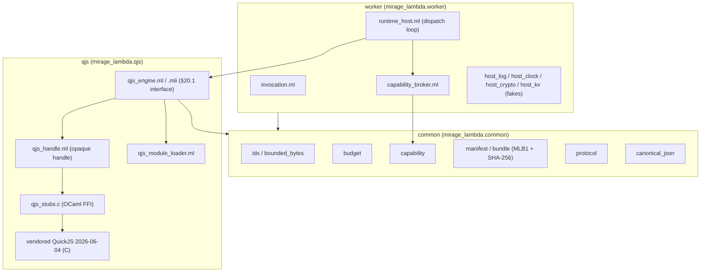
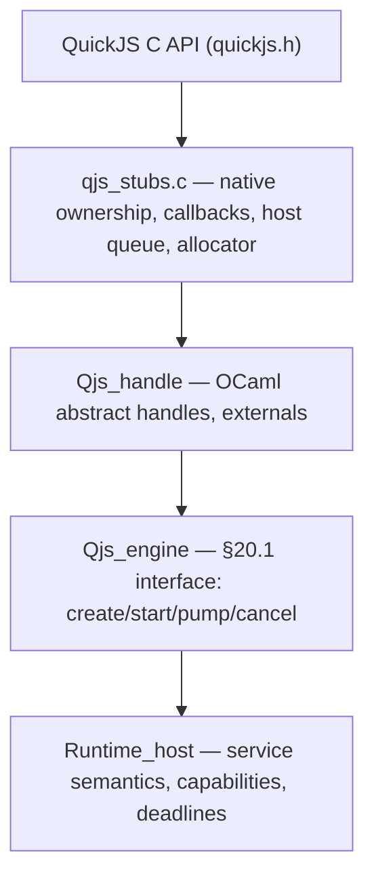

# Mirage Lambda Service — A Technical Deep Dive

This report explains how the Mirage Lambda Service embeds the QuickJS JavaScript engine inside an OCaml program and drives it from an OCaml event loop, and how that engine is wrapped in the execution semantics of a function-as-a-service runtime. The service is specified by a 5,081-line implementation guide (`mirage_lambda_service_implementation_guide.md`) that prescribes a JavaScript function cloud whose service plane and execution workers are MirageOS unikernels. At the time of this report, the first four delivery phases are implemented against the Unix target: the toolchain is pinned, QuickJS is vendored and compiling under sanitizers, the pure domain library is in place, the OCaml/C engine bridge is wired and proven against nine of the guide's eleven feasibility-probe steps, and a worker dispatch loop drives a JavaScript handler end-to-end through a host-call Promise bridge. Thirty-four automated tests pass.

The main result is that a JavaScript module can be loaded into an embedded QuickJS runtime, asked to perform host operations through a Promise-returning `host.rpc` API, and driven to completion by an OCaml loop that drains a bounded C queue, dispatches each request through a capability broker, and settles the corresponding Promise with a JSON result. The engine enforces a heap limit, a stack limit, and a CPU deadline, and it interrupts infinite loops and surfaces unhandled Promise rejections. None of this requires a unikernel yet; the same OCaml logic ports to a Solo5 HVT guest once the Mirage device implementations are plugged in behind stable interfaces.

> [!summary]
> The Mirage Lambda Service implements a JavaScript FaaS runtime in OCaml with an embedded QuickJS engine.
> 1. A pure `common/` library defines every cross-boundary type — identifiers, budgets, capabilities, manifests, bundles, protocol envelopes — with no dependency on Unix, Lwt, Mirage, TLS, or QuickJS, so the semantics are fuzzable and reusable by the CLI, control plane, worker, and tests.
> 2. The QuickJS engine is embedded through a three-layer wrapper: a C FFI that owns all `quickjs.h` includes, an OCaml handle module that exposes opaque integer handles with generation counters, and a stable `Qjs_engine` interface that the worker imports.
> 3. Asynchronous host calls cross the language boundary through a bounded plain-C queue. A JavaScript host callback creates a Promise, stores its resolving functions in a C table, and returns immediately. OCaml later drains the queue, performs the authorized operation, and calls back into C to settle the Promise. C never re-enters OCaml during I/O.
> 4. Delivery is staged into eleven phase-gated phases. Phases 0–3 are complete on Unix; the Mirage unikernel port (Phases 5–6) and the dedicated Solo5 opam switch remain open.

## The problem this work addresses

A function-as-a-service runtime for untrusted JavaScript must solve two problems that pull in opposite directions. The runtime must expose host operations — key-value access, logging, clocks, cryptographic randomness, outbound HTTP, child invocations — to user code, because a function that cannot touch anything is useless. And the runtime must deny user code every form of ambient authority — filesystem, process, socket, environment variable, dynamic library, package manager — because a function that can touch anything is a remote-code-execution platform. Node.js resolves this tension by giving the function a large ambient surface and trusting the deployer to police it. The Mirage Lambda Service resolves it by giving the function nothing ambient and granting each host operation as a typed, named, metered capability that the runtime authorizes before dispatch.

The second constraint is isolation. A `JSRuntime` in QuickJS is a useful language-level containment unit: it has its own heap, its own atom table, and its own job queue, and one runtime cannot read another's memory. But a `JSRuntime` is not a native memory-protection boundary. A bug in the QuickJS engine itself, or in the C wrapper that embeds it, can corrupt the host process. For hostile tenants the guide requires a stronger boundary: a Solo5 HVT worker unikernel, normally one tenant per VM and one active compute-bound invocation per worker. The hard isolation unit is the worker VM, not the `JSRuntime`.

These two constraints shape the implementation strategy. The service cannot be built by putting Node.js inside a small VM, because Node carries its ambient authority with it. It cannot be built by running one `JSRuntime` per invocation inside a shared process for hostile tenants, because a native engine bug compromises the whole guest. And it cannot be built by going straight to the HVT unikernel target, because the three classes of uncertainty — language-runtime embedding, unikernel portability, and distributed-service scheduling — would all fail at once, and a crash could originate in user JavaScript, the QuickJS engine, an OCaml root-lifetime mistake, a missing freestanding-libc function, a Mirage device, or the host launcher, with no way to tell which. The guide's response is to build the semantics first as a normal Unix OCaml program, port only the QuickJS engine core to the freestanding C environment, then split the system into a control-plane unikernel and a worker unikernel fleet, keeping the interfaces stable across environments.

## What shipped

At the time of this report, the implementation covers Phases 0 through 3 of the eleven-phase delivery plan. The persistence layer, the HTTP control plane, the Mirage unikernel images, the launcher fleet, and the security hardening remain open.

The shipped surface is:

- A pure `common/` library (`mirage_lambda.common`) with nine modules: `canonical_json`, `error`, `bounded_bytes`, `ids`, `budget`, `capability`, `manifest`, `bundle`, and `protocol`. It depends only on `yojson`. It contains an inline pure-OCaml SHA-256 implementation so the MLB1 bundle format can compute content digests without pulling in a crypto dependency.
- A JSON Schema and OpenAPI surface under `api/`: `function-manifest.schema.json`, `invocation-envelope.schema.json`, `openapi.yaml`, and `worker-protocol.md`.
- A vendored QuickJS release `2026-06-04` at `qjs/vendor/quickjs-2026-06-04/`, integrity-pinned by SHA-256 `b376e839b322978313d929fd20663b11ba58b75df5a46c126dd19ea2fa70ad2a`. Only the engine core is vendored; `quickjs-libc.c`, which pulls in `dlopen`, `pthread`, and the POSIX module, is excluded.
- An OCaml/C engine library (`mirage_lambda.qjs`) that compiles the five QuickJS engine-core C files as dune `foreign_stubs` and exposes a stable `Qjs_engine` interface. The FFI implements runtime creation, deterministic destruction, evaluation, module loading, a Promise bridge, a bounded job-queue pump, cancellation, and memory reporting.
- A worker runtime (`mirage_lambda.worker`) with an invocation context, a capability broker, four host-API fakes (log, clock, crypto, kv), and a dispatch loop that drives a handler to completion.
- Thirty-four automated tests across four suites: fourteen `common` property and unit tests, four `qjs` module-loader tests, twelve `qjs-engine` feasibility-probe tests, three `crowbar` fuzz tests, and one end-to-end worker test.
- Six architecture decision records under `docs/adr/`, a Phase 0 evidence report, a QuickJS freestanding-port audit template, and a chronological implementation diary in the docmgr ticket.

## Architecture at completion of Phase 3

The finished Unix form has three layers, each with a strict dependency direction. The `common` library is at the bottom and depends on nothing but `yojson`. The `qjs` library depends on `common` and on the vendored C engine. The `worker` library depends on `common` and `qjs`. Nothing in `common` may depend on Unix, Lwt, Mirage, TLS, or QuickJS, a constraint enforced by keeping it as a separate dune library.



The C FFI is the only place that includes `quickjs.h`. The OCaml side never sees a `JSValue` or a raw pointer. The `Qjs_engine` interface is the stable contract the worker imports; when the worker is later ported to a Mirage unikernel, the interface stays the same and only the C platform boundary (`qjs_port_solo5.c`) and the host-API implementations change.

## The three-layer engine wrapper

Exposing a raw QuickJS C API throughout the repository would spread `JSValue` ownership rules across every consumer and make auditing impossible. The implementation uses three layers instead, matching the guide's §36.1.

The bottom layer is `qjs/c/qjs_stubs.c`. It includes `quickjs.h`, owns every `JSRuntime`, `JSContext`, and retained `JSValue`, and exposes a small set of OCaml externals. Each external follows the OCaml C-interface discipline: `CAMLparam` and `CAMLlocal` on every primitive, no retained OCaml heap pointer without a registered root, and QuickJS exceptions converted to bounded C data before returning. The handle is an integer encoding `(generation << 16) | index` into a C-side table of `mlqjs_runtime*` pointers. A generation counter rejects stale handles after a destroy: a second use of a freed handle finds a `NULL` slot or a mismatched generation and fails cleanly rather than dereferencing freed memory.

The middle layer is `qjs/lib/qjs_handle.ml`. It declares the externals — `create`, `destroy`, `eval`, `eval_int`, `eval_string`, `pump`, `cancel`, `take_requests`, `set_module`, `eval_module`, `install_host`, `resolve`, `has_unhandled_rejection`, `mem_usage` — and presents the handle as `type t = private int`. The `private` constraint lets pattern-matching see the integer for the FFI but prevents constructing an arbitrary handle from outside the module.

The top layer is `qjs/lib/qjs_engine.ml` and its `.mli`, which implements the guide's §20.1 `QJS_ENGINE` signature. It translates between OCaml domain types and the C boundary. Engine limits, for example, are an OCaml record in `common/budget.ml`; the engine serializes them to a `|`-delimited blob of integers that the C side decodes. The bundle is passed by OCaml but the C side re-verifies digests. The worker imports only `Qjs_engine`, never `Qjs_handle`.



The separation has a concrete payoff: the `qjs-engine` test suite drives the engine through the public `Qjs_engine` interface, so when the C stubs are later re-implemented against the Solo5 freestanding libc, the tests do not change.

## Runtime construction and resource enforcement

The guide prescribes a fifteen-step runtime construction order in §24.1. The implementation follows it. Creation allocates a `mlqjs_runtime`, calls `JS_NewRuntime`, sets the memory limit and maximum stack size, installs an interrupt handler, disables blocking (`JS_SetCanBlock(rt, 0)`), installs a Promise rejection tracker, creates a raw context, and adds a reduced set of intrinsics.

The intrinsic set matters for the security boundary. The full `JS_NewContext` adds Date, Eval, WeakRef, Proxy, and the blocking-atomics surface. The raw-context path lets the implementation add only what the function contract needs: base objects, eval (required for `JS_Eval` to work even on simple expressions), JSON, RegExp, Map/Set, TypedArrays, and Promise. Date is omitted because wall time is a separate capability the worker may not be granted, and `Math.random` is never treated as cryptographic — randomness comes through the host capability.

Resource enforcement uses three mechanisms that the guide's §5.4 names explicitly as necessary-but-insufficient. `JS_SetMemoryLimit` constrains the QuickJS allocator path. `JS_SetMaxStackSize` bounds recursion. The interrupt handler bounds CPU time. The handler is a C function registered with `JS_SetInterruptHandler` that QuickJS calls periodically during execution:

```c
static int mlqjs_interrupt(JSRuntime *rt, void *opaque) {
    mlqjs_runtime *q = (mlqjs_runtime *)opaque;
    if (q->cancelled) { q->interrupt_reason = MLQJS_REASON_CANCEL; return 1; }
    uint64_t now = mlqjs_monotonic_ns();
    if (q->deadline_ns && now >= q->deadline_ns) {
        q->interrupt_reason = MLQJS_REASON_DEADLINE; return 1;
    }
    if (q->cpu_budget_ns) {
        uint64_t used = now - q->engine_start_ns;
        if (used >= q->cpu_budget_ns) {
            q->interrupt_reason = MLQJS_REASON_CPU; return 1;
        }
    }
    return 0;
}
```

Returning `1` from the interrupt handler causes QuickJS to throw an exception in the running JavaScript, which the eval wrapper observes and reports. The feasibility probe proves this on three inputs: a 256 KB heap rejects `new Array(1000000).fill(0)`; an 8 KB stack rejects infinite recursion; a 1 ms CPU budget interrupts `while(true){}`. The interrupt accounting is monotonic elapsed time, which the guide's §24.2 names as approximate; the gateway's wall deadline remains independent and authoritative.

## The module loader

User code arrives as an MLB1 bundle: a versioned binary container with a canonical JSON header, a canonical JSON manifest, a sorted list of modules each carrying a SHA-256, and a footer SHA-256 over all preceding bytes. The bundle parser in `common/bundle.ml` rejects lengths that exceed the buffer, rejects path segments that are empty or `..` or `.`, rejects unsorted or duplicate module paths, recomputes every per-module digest and the footer digest, and compares digests in constant time. The parser is total on arbitrary bytes — it returns a structured `Error.t` and never raises — which the fuzz harness verifies by feeding `crowbar`-generated bytes through it without a crash.

The worker does not hand QuickJS a filesystem path. It hands the engine an in-memory module map and installs a C module loader callback via `JS_SetModuleLoaderFunc`. When QuickJS encounters an `import` statement, it calls the loader with the resolved module name, and the loader finds the source in the bundle map and compiles it:

```c
static JSModuleDef *mlqjs_module_loader(JSContext *ctx,
                                        const char *module_name, void *opaque) {
    mlqjs_runtime *q = (mlqjs_runtime *)opaque;
    for (int i = 0; i < q->module_count; i++) {
        if (strcmp(q->modules[i].path, module_name) == 0) {
            JSValue val = JS_Eval(ctx, q->modules[i].source, q->modules[i].source_len,
                                 module_name, JS_EVAL_TYPE_MODULE | JS_EVAL_FLAG_COMPILE_ONLY);
            if (JS_IsException(val)) return NULL;
            JSModuleDef *m = (JSModuleDef *)JS_VALUE_GET_PTR(val);
            JS_FreeValue(ctx, val);  /* free the value wrapper; module stays alive */
            return m;
        }
    }
    JS_ThrowReferenceError(ctx, "could not load module '%s'", module_name);
    return NULL;
}
```

The compile-only flag is deliberate. The loader compiles the module into a `JSModuleDef` but does not execute it; QuickJS executes the module graph when the entrypoint is evaluated with `JS_EVAL_TYPE_MODULE`. The `JS_FreeValue` call after extracting the pointer is a sharp edge: the `JS_Eval` returns a `JSValue` with `JS_TAG_MODULE` whose refcount the caller owns. Extracting the pointer with `JS_VALUE_GET_PTR` and returning it without freeing the value leaks the reference, and `JS_FreeRuntime` then asserts that its garbage-collected object list is non-empty. Freeing the value wrapper drops the caller's reference; the module itself stays alive because the context's module list holds another reference. The two-module loader test — `index.js` imports `addOne` from `./lib.js` and calls `addOne(41)` — is what caught this leak, because the single-module test compiles and runs the entrypoint in one step and never exercises the loader callback.

The normalizer is passed as `NULL`, which selects QuickJS's default resolver. It strips `./` and resolves `../` relative to the importing module's base name, which is exactly the §10.5 relative-import semantics for version one. The custom normalizer that handles `cap:` virtual modules and rejects imports that escape the bundle root is a later step.

## The Promise bridge

Asynchronous host calls are the most important runtime bridge, and the design rule that makes them auditable is that C never re-enters OCaml during I/O. The guide's §22.1 states this directly: avoid an architecture where QuickJS calls arbitrary OCaml closures during asynchronous I/O. The OCaml C-interface manual requires callbacks to hold the domain lock, and C-created threads must be registered with the runtime. A queue boundary is simpler and easier to audit than direct callbacks.

The bridge has three participants: a JavaScript host callback, a bounded C queue, and an OCaml resolver. When user code calls `host.rpc("kv.get", {key: "counter"})`, the C callback `mlqjs_host_rpc` runs synchronously inside the QuickJS execution. It validates the arguments, creates a Promise via `JS_NewPromiseCapability`, stores the two resolving functions in a promise table keyed by a monotonically increasing request id, enqueues a plain-C request whose payload is the operation name and a JSON-stringified argument separated by a newline, and returns the Promise. No I/O happens in the callback. No OCaml value is retained in C.

```c
JSValue resolving[2] = { JS_UNDEFINED, JS_UNDEFINED };
JSValue promise = JS_NewPromiseCapability(ctx, resolving);
/* ... build "op\narg_json" payload ... */
uint64_t id = mlqjs_host_queue_push(&q->requests, "host.rpc", payload, plen);
if (!promise_insert(ctx, resolving[0], resolving[1], id))
    return JS_ThrowInternalError(ctx, "promise table full");
return promise;
```

Control returns to OCaml. The dispatch loop pumps the QuickJS job queue, then drains the host-request queue with `take_requests`. For each request, the capability broker parses the payload, authorizes the operation against the invocation's compiled policy, dispatches it to a fake implementation, and produces a JSON result string. The loop then calls `mlqjs_resolve`, which finds the promise slot by request id, parses the JSON result with `JS_ParseJSON`, calls the stored resolve function with `JS_Call`, frees the resolving functions, and removes the slot:

```c
JSValue val = JS_ParseJSON(q->ctx, json, json_len, "<result>");
JSValue ret = JS_Call(q->ctx, s->resolve, JS_UNDEFINED, 1, &val);
JS_FreeValue(q->ctx, ret);
JS_FreeValue(q->ctx, val);
promise_remove(q->ctx, s);
```

The loop pumps the job queue again, which runs the `.then` callback that the user code attached to the Promise, and the resolved value flows back into JavaScript. The whole sequence is synchronous in the Phase 3 fakes, but the boundary is shaped for asynchronous I/O: when the host implementations become real Mirage devices, the broker dispatch returns an Lwt promise, and the loop awaits its completion before resolving the JS Promise.

The Promise rejection tracker is the ninth probe step. Registered with `JS_SetHostPromiseRejectionTracker`, it fires when a rejected Promise has no rejection handler. The callback sets a `terminal` flag on the runtime, which `has_unhandled_rejection` exposes to OCaml. The probe verifies that `new Promise((_, reject) => reject(new Error('boom')))` with no `.catch` sets the flag.

## The dispatch loop

The worker owns the only transition path between QuickJS and the host. Its dispatch loop, in `worker/runtime_host.ml`, is a fixed sequence repeated until the handler signals completion or a turn budget is exhausted:

```ocaml
let rec drive ~impls ~max_turns engine =
  if max_turns <= 0 then Timeout (...)
  else begin
    (match Qjs_engine.pump engine ~max_jobs:64 with Ok _ -> () | Error _ -> ());
    let requests = Qjs_engine.take_host_requests engine in
    List.iter (fun req ->
      let id = req.Qjs_host_request.id in
      (match Capability_broker.dispatch impls Capability.empty req with
       | Ok json -> Qjs_engine.resolve engine id json
       | Error msg -> Qjs_engine.resolve engine id (Printf.sprintf "{\"error\":%S}" msg))
    ) requests;
    (match Qjs_engine.pump engine ~max_jobs:64 with Ok _ -> () | Error _ -> ());
    (match Qjs_engine.eval_int engine "__done ? 1 : 0" with
     | Ok 1 ->
       (match Qjs_engine.eval_string engine "JSON.stringify(globalThis.__result || null)" with
        | Ok json -> Fulfilled json
        | Error e -> Rejected ...)
     | _ -> drive ~impls ~max_turns:(max_turns - 1) engine)
  end
```

Each turn does four things. It pumps the QuickJS job queue, bounded by `max_jobs:64`, so a chain of microtasks cannot monopolize the loop without an interrupt check. It drains the host-request queue and dispatches every request through the capability broker, resolving each Promise with the broker's result or a JSON error object. It pumps the job queue again so that resolved Promises settle their `.then` callbacks before the completion check. It checks whether the handler has set `globalThis.__done`, and if so, reads `JSON.stringify(globalThis.__result)` as the canonical result.

The `max_turns` cap is a pragmatic Phase 3 bound against infinite loops; the production version replaces it with the absolute deadline from the invocation context and calls `Qjs_engine.cancel` on timeout. The completion check via `__done` and `__result` is a Phase 3 simplification; the guide's §20.1 prescribes observing the engine's `Complete` progress directly, which is the Phase 4 replacement.

## The capability broker and host fakes

The capability broker is the authorization point. The guide's §20.2 states that the broker performs authorization and accounting before calling an operation implementation, and that it does not trust the existence of a JavaScript binding; it verifies the request against the invocation's compiled policy. The Phase 3 broker parses the `op\narg_json` payload, dispatches on the operation string, and returns a JSON result. The policy argument is currently `Capability.empty`; real policy enforcement, where each `kv.get` is checked against the grant for that binding and store, is a Phase 8 concern.

The host-API fakes are deterministic implementations for the §37.3 set. `Host_log` is a bounded buffer of structured events that truncates with a marker when `max_log_bytes` is exceeded. `Host_clock` is either real monotonic time or a scripted sequence for replay tests. `Host_crypto` is either `/dev/urandom` or a seeded PRNG. `Host_kv` is an in-memory hashtable with an injectable `fail_next` flag for fault testing. These fakes make record-and-replay and fault injection possible before any Mirage device exists.

The end-to-end test exercises all of them. A JavaScript handler calls `host.rpc("log.info", {message: "start"})`, `host.rpc("kv.put", {key: "counter", value: "1"})`, `host.rpc("kv.get", {key: "counter"})`, and `host.rpc("clock.monotonicMs", {})`. The dispatch loop drives it to completion. The test verifies that the kv store holds `"counter" -> "1"`, that the log captured the `"start"` event, and that the result JSON carries the kv value and a clock reading.

## The feasibility probe

The guide's §34.2 defines an eleven-step probe that must pass on both the Unix target and the Solo5 HVT target before the architecture is allowed to accumulate around the engine. Nine of the eleven steps are proven on Unix; the tenth, building and booting on HVT, is gated on a dedicated Mirage opam switch that is not yet created.

| Step | Probe requirement | Unix status |
|---|---|---|
| 1 | Create and destroy `JSRuntime`/`JSContext` repeatedly | proven (×100) |
| 2 | Evaluate `1 + 2` and extract the integer `3` | proven |
| 3 | Load a two-module program via the custom module loader | proven |
| 4 | Call an exported async handler and drain the job queue | proven |
| 5 | Create a host Promise, retain resolvers, settle from OCaml | proven |
| 6 | Enforce a small heap limit, observe controlled OOM | proven |
| 7 | Enforce a stack limit with recursive JavaScript | proven |
| 8 | Interrupt `while (true) {}` via the interrupt callback | proven |
| 9 | Receive an unhandled rejection via the rejection tracker | proven |
| 10 | Build and execute the same probe on Solo5 HVT | open (needs Mirage switch) |
| 11 | 100k create/eval/destroy cycles under ASan/UBSan | proven at 10k |

The tenth step is the only open Unix-adjacent gate, and it is blocked on infrastructure, not on the engine. The eleventh step is reduced to 10,000 cycles in the test suite for time; a standalone 100,000-cycle run under AddressSanitizer and UndefinedBehaviorSanitizer is the evidence-run form.

## Why the engine core compiles freestanding

QuickJS's upstream build includes `quickjs-libc.c`, a POSIX convenience layer that drags in `dlopen`, `pthread_create`, filesystem access, signals, and the standard OS module. None of that can exist in a Solo5 HVT guest, which has no POSIX libc, and none of it should exist in the Unix build either, because it is the surface through which ambient authority leaks into the engine. The vendoring step extracts only the engine core: `quickjs.c`/`quickjs.h`, `cutils`, `dtoa`, `libregexp` with its opcode header, `libunicode` with its generated tables, and the `VERSION` and `LICENSE`. The build script compiles these five C files with `-fsanitize=address,undefined` and the strict warning set, passing the `CONFIG_VERSION`, `CONFIG_ATOMICS`, and `CONFIG_STACK_CHECK` defines that the upstream Makefile sets.

The §34.3 missing-symbol audit is the activity that turns this from "it compiles on Unix" into "it will link on HVT." The audit compiles the engine objects against the ocaml-solo5 freestanding libc and records every unresolved symbol, classifying each as already supplied by the minimal libc, linkable through the target math library, replaceable by a deterministic shim, reachable only from excluded POSIX code, or unacceptable and requiring an engine patch. The audit template is in place; running it requires the dedicated Mirage switch.

## Open questions and near-term next steps

The implementation has several deliberate simplifications that the guide names as later phases. The dispatch loop uses a turn counter rather than the absolute deadline; the production form reads the invocation deadline and calls `cancel` on expiry. The capability broker passes `Capability.empty` rather than the invocation's compiled policy; real per-operation authorization is Phase 8. The custom `JS_NewRuntime2` allocator with size tracking is written but unused — the Phase 2 probe uses `JS_NewRuntime` with `JS_SetMemoryLimit` because the default allocator's size tracking makes the heap limit work, and the custom allocator's accounting is a Phase 8 concern. The promise table is a C global rather than per-runtime, which is safe for the single-invocation worker but should be per-runtime for multi-runtime tests.

The near-term next steps follow the phase graph:

- **Phase 4 — single-appliance MVP.** Build the control plane on Unix: ingress, auth, admin and invoke APIs, artifact store, registry, metadata writer, admission, scheduler, worker pool, launcher client, recovery, telemetry, and the developer CLI. The end-to-end demonstration is deploy-a-bundle, resolve-an-alias, invoke-sync, invoke-async, observe-logs, crash-recover.
- **Phase 5 — Mirage control-plane unikernel.** Port the control plane to a Mirage unikernel over a Chamelon KV block device and TLS. This and Phase 6 require the dedicated Mirage opam switch.
- **The HVT gate.** Create the Mirage switch, run the missing-symbol audit, cross-compile `qjs_port_solo5.c`, boot the HVT image, and capture the QuickJS/OCaml/Mirage/build digests. This closes probe step 10.

## Related work in the vault

The companion `go-go-host` lambda runtime control plane solves a related but distinct problem: it runs always-on express sites and on-demand JavaScript functions on a hosted platform, using a Goja runtime inside a Go process with a Postgres control-plane store. This project shares the function-as-a-service shape — deploy a bundle, invoke a named handler, record the call — but differs in the isolation boundary and the runtime. Where `go-go-host` relies on the Go process boundary and a warm pool of Goja runtimes, the Mirage Lambda Service targets a hardware-virtualized Solo5 worker per tenant and an embedded QuickJS engine with no ambient authority. Comparing the two clarifies which constraints are properties of the function-cloud shape and which are properties of the unikernel-and-capability choice.

## Project working rule

> [!important]
> Prove each phase on the Unix target with sanitizers and an executable test before any unikernel or fleet work that depends on it. The interfaces are kept stable across environments so the Unix proof is carried into the unikernel, not rewritten.
