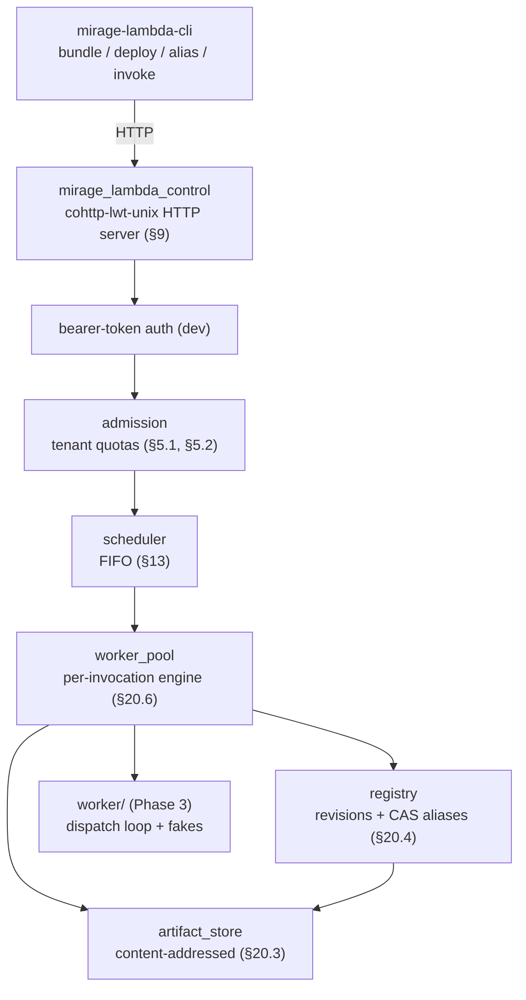

# Mirage Lambda Service — Phases 4–5: From Unix MVP to the HVT Gate

This report picks up where the earlier Mirage Lambda deep dive left off. The earlier report covered Phases 0–3: the pure common library, the three-layer QuickJS OCaml/C wrapper, the Promise bridge, and the worker dispatch loop, all proven on Unix. This report covers what came next: the single-appliance control plane that turns the engine into a deployable service (Phase 4), the missing-symbol audit and dedicated Mirage switch that close the unikernel-portability question (Phase 0 HVT), and the Mirage control-plane unikernel that ports the service plane to Solo5 HVT (Phase 5).

The main result is that a developer can now bundle a JavaScript module, deploy it through a CLI to a running control plane, move an alias to the new revision, and invoke it synchronously or asynchronously — the full §38.2 demonstration on Unix. The unikernel port now cross-compiles to a valid Solo5 HVT image: the toolchain, lockfile, duniverse, and cross-compile all work, and a single-token functor-arg fix resolved the last type mismatch. The only remaining gate to a running unikernel is a host-level TAP network device, which is an environment permission, not a code problem.

> [!summary]
> Phases 4–5 took the engine from "runs on Unix" to "serves an API on Unix" and then to "configures and cross-compiles for HVT."
> 1. Phase 4 adds an HTTP control plane (artifact store, registry with CAS aliases, admission, scheduler, worker pool) and a developer CLI; the §38.2 end-to-end demo (deploy → alias → sync/async invoke) passes on Unix.
> 2. The §34.3 missing-symbol audit against the ocaml-solo5 freestanding target found that no engine patch is needed: excluding `quickjs-libc.c` removes POSIX, compiling out `CONFIG_ATOMICS` removes pthread, and wall-time is shimmed through the §21.4 platform boundary.
> 3. The Phase 5 HVT build was blocked on an opam-monorepo behavior, not a code error: the lockfile solver reads the default switch, not `OPAMSWITCH`. Setting the dedicated switch as default unblocked the lockfile (92 entries), the duniverse pull (91 repos), and the solo5 cross-compile.
> 4. The last code gate is resolved: the `cohttp_server` device passes `Cohttp_mirage.Server.Make(Conduit)` whose `listen` carries a `unit -> int` port-thunk, and `Conduit_mirage.server` needs a plain `int`; evaluating the thunk (`\`TCP (port ())`) makes the HVT image build. The only remaining gate to a running unikernel is a host TAP device (a `CAP_NET_ADMIN` permission), not code.

## From engine to service: Phase 4

Phase 3 proved the execution semantics in a normal process: a JavaScript handler calls host operations through a Promise bridge, and an OCaml dispatch loop drains a C queue, dispatches each request through a capability broker, and settles the Promise. Phase 4 wraps that engine in the service plane that the guide's §9 specifies: an authenticated HTTP API for deploying function revisions, moving aliases, and invoking functions synchronously and asynchronously.

The control plane is a single cohttp-lwt-unix process. It has six components, each a small module with a narrow responsibility.



The artifact store is content-addressed. A deployment uploads an MLB1 bundle; the store recomputes the SHA-256 on ingest and again on read, so a corrupted or swapped object fails loudly rather than serving wrong code. The registry holds immutable revisions keyed by `(tenant, function, digest)` and aliases keyed by `(tenant, function, alias)` with an optional compare-and-set precondition so two concurrent alias moves do not silently lose an update. Admission enforces per-tenant quotas — rate, concurrency, queue count, queued bytes — and rejects impossible deadlines before the work is scheduled.

The worker pool creates a fresh `Qjs_engine` per invocation. There is no runtime reuse in Phase 4, by design: the guide's §38.1 explicitly defers runtime reuse. Each invocation resolves the qualifier to a revision digest, fetches the bundle, parses it (re-verifying digests), compiles the capability policy, creates the engine, loads the modules, and drives the dispatch loop to completion. The same `Qjs_engine` interface proven in Phase 2 is the contract the pool imports; nothing about the engine changes between Phase 3 and Phase 4.

The end-to-end demonstration is a single shell session. A manifest and a one-line JavaScript handler are bundled into MLB1, deployed to the control plane, an alias `prod` is moved to the new revision, and the function is invoked:

```text
$ mirage-lambda-cli bundle manifest.json index.js -o echo.mlb
bundle: echo.mlb (769 bytes, 1 module)
$ mirage-lambda-cli deploy echo.mlb -t default -f echo
{"function":"echo","revision":"sha256:5ebae7c8...","runtime":"quickjs-2026-06-04","bundleBytes":769}
$ mirage-lambda-cli alias default echo prod 5ebae7c8...
{}
$ mirage-lambda-cli invoke default echo prod -e '{"hello":"world"}'
{"invocationId":"inv-1","durationMs":0.0}
{"echoed":{"hello":"world"},"invocationId":"inv-1"}
$ mirage-lambda-cli invoke default echo prod -e '{"hello":"async"}' --async
{"invocationId":"inv-2"}
```

The synchronous invocation returns the handler's result inline. The asynchronous invocation returns an invocation id and enqueues the work. This is the §38.3 exit gate on Unix: deployment and invocation are usable through the CLI, and the content digest and revision id are stable across the flow.

## The freestanding-port question: does the engine need a patch?

Before porting anything to HVT, the guide's §34.3 requires a missing-symbol audit: compile the QuickJS engine objects against the ocaml-solo5 freestanding libc and classify every unresolved symbol. The audit's purpose is to convert the assumption "the engine core is portable" into evidence, and to find out whether a patch is needed before the architecture accumulates around it.

The audit compiled the five engine-core objects (`quickjs`, `cutils`, `dtoa`, `libregexp`, `libunicode`) and extracted the undefined symbols with `nm -u`. The finding is that no engine patch is required, but two build decisions are.

The first decision is the exclusion of `quickjs-libc.c`. The upstream QuickJS build links a POSIX convenience layer that drags in `dlopen`, `pthread_create`, filesystem access, signals, and the standard OS module. The vendoring step keeps only the engine core and excludes that file. The audit confirmed the effect: with `quickjs-libc.c` excluded, the engine objects reference none of `dlopen`, `fork`, `exec`, `opendir`, `fopen`, `signal`, or any of the `require`/`std`/`os` JavaScript modules. The exclusion is what makes the freestanding port tractable.

The second decision is `CONFIG_ATOMICS`. The engine's `pthread_mutex` and `pthread_cond` references are entirely behind the `CONFIG_ATOMICS` preprocessor guard — they belong to the `Atomics.wait`/`notify` waiter and the class-id mutex. A single-threaded worker that calls `JS_SetCanBlock(rt, false)` (already done in `qjs_stubs.c`) does not take those paths. Compiling without `CONFIG_ATOMICS` removes the pthread dependence. The worker is single-threaded by design: the guide's §22.1 mandates that OCaml drives C and C never re-enters OCaml during I/O, so there is no second thread to synchronize with.

Two symbol classes remain and are handled by the platform boundary, not the engine. `gettimeofday` and `localtime_r` belong to the optional wall-time path and the Date intrinsic. The Date intrinsic is already excluded (the build does not call `JS_AddIntrinsicDate`), and wall time is a separate capability the worker may not be granted — the §21.4 platform boundary function `mlqjs_wall_time_ms` returns 0 when wall time is not granted, so the engine never sees real wall time through the standard built-ins. The math symbols (`ceil`, `sqrt`, `exp`, etc.) link through the target math library in the Solo5 sysroot; the memory and string symbols (`memcpy`, `malloc`, `snprintf`) are supplied by ocaml-solo5's nolibc.

The audit's conclusion is a table of decisions, not a patch. The engine core is portable to Solo5 HVT with two build flags (`-DCONFIG_STACK_CHECK` without `-DCONFIG_ATOMICS`) and the existing platform boundary. The remaining gate was the HVT boot itself, which confirms the math library and floating-point environment at runtime; the image now builds, and the boot awaits only a host TAP device.

## The HVT toolchain: a behavior, not a bug

Building a Mirage unikernel for the HVT target uses `mirage configure -t hvt`, which generates a Makefile that drives `opam-monorepo` to produce a lockfile, pull a vendored duniverse of all dependencies, and cross-compile the unikernel with dune's solo5 context. The lockfile step is where the build failed for a long time, and the failure was misleading.

The error message was precise and wrong-seeming: `The dune-universe opam repository ... doesn't appear to be set up on this switch. Add it ... by running: opam repository add dune-universe git+https://github.com/dune-universe/opam-overlays.git`. The repository was already added, with that exact name and URL, confirmed by `opam repo list`. All ten dune ports the lockfile wanted (`zarith`, `ptime`, `ocamlfind`, `num`, `mtime`, `logs`, `fmt`, `cmdliner`, `bos`, `astring`) existed in the repository.

The cause was found by running the lock with `--verbose`. The solver logged `Solve using current opam switch: CP.2025.08.0~8.20~2025.01` — the Coq-platform switch, not the `mirage-lambda` switch the work was happening in, despite `OPAMSWITCH=mirage-lambda` being set and `opam switch show` returning `mirage-lambda`. Reading the opam-monorepo source (`cli/lock.ml`) showed why: the solver uses `OpamGlobalState.with_` and `OpamSwitchState.with_`, which read the **default** switch recorded in the opam root config, not the `OPAMSWITCH` environment variable. The `dune-universe` repository only exists on the `mirage-lambda` switch, so against the Coq switch the error was correct: the repository genuinely was not configured there.

The fix is one command: `opam switch set mirage-lambda`, which sets the default switch globally. After that, the lockfile generates with 92 entries, `opam monorepo pull` fetches 91 vendored repositories, and the solo5 cross-compile context builds Zarith, cohttp, and the rest of the dependency tree. The toolchain was never broken; opam-monorepo just reads a different switch selector than the shell does.

One more Makefile wrinkle is worth recording. The `mirage configure`-generated `repo-add` recipe adds the dune-universe repository under the name `opam-overlays`, but opam-monorepo's `is_duniverse_repo` checks for the exact name `dune-universe` (it compares `OpamUrl.to_string repo.repo_url` against the literal string `git+https://github.com/dune-universe/opam-overlays.git`, and the repository must be registered under that name). After every `mirage configure`, the Makefile needs a `sed` patch to rename the repository from `opam-overlays` to `dune-universe`. It is a one-liner, but it is the kind of detail that costs an hour if you do not know it.

## The unikernel: from a type error to a built HVT image

With the toolchain unblocked, the Mirage unikernel configures cleanly. The `config.ml` declares the device composition: a network stack, a read-only certificate KV, a read/write state KV, and a Cohttp server over the stack. The `unikernel.ml` implements the boot functor with structured logging and a `/healthz` endpoint. `mirage configure -t hvt` type-checks the composition and generates the build files.

The build initially stopped at the final unikernel-functor type-check. The `cohttp_server` device passes `Cohttp_mirage.Server.Make(Conduit)` as the `Http` argument to the unikernel functor. That module's `listen` function has type `Conduit_mirage.server -> t -> unit Lwt.t`. The value mirage wires into `start` is `listen` partially applied to the conduit, so the unikernel must call it as `http <server> <httpd>`, where `<server>` is a `Conduit_mirage.server`. That type is `[ `TCP of int | `TLS of Tls.Config.server * server | `Vchan of ... ]` — the `TCP` variant carries a plain listening port as an `int`.

The unikernel reads the port from a command-line argument registered through `Mirage_runtime.register_arg`, which returns `int runtime_arg`, an alias for `unit -> int` — a thunk, not a plain integer. Passing `` `TCP port `` therefore produced `` `TCP of unit -> int ``, which the type system rejected against `` `TCP of int ``. The error message reported the mismatch as a functor-signature difference (`` [> `TCP of unit -> int ] `` versus `Conduit_mirage.server`), which obscured the one-token cause.

The fix is to evaluate the thunk before constructing the variant: `` `TCP (port ()) ``. That single change makes `make build` produce `dist/mirage-lambda-control.hvt` — 13,955,336 bytes of statically-linked, freestanding ELF, with a solo5 manifest that declares exactly one device, a `NET_BASIC` interface named `service`. `solo5-elftool query-manifest` confirms the image is a valid solo5 HVT binary. The build reproduces cleanly from `dune build --profile release --root . ./dist` under the mirage-lambda switch.

The only remaining gate to a running unikernel is the boot itself. `solo5-hvt` attaches the unikernel's declared `NET_BASIC` device to a host TAP interface, and creating a TAP interface requires `CAP_NET_ADMIN` (or `sudo`). The development machine used here lacks that permission non-interactively, so the boot was not executed in this session. This is an environment gate, not a code gate: the image exists, the manifest is valid, and the boot command is `solo5-hvt --net:service=tap100 dist/mirage-lambda-control.hvt --port=8080` once a TAP device exists.

## A state-KV simplification and its deferral

The Phase 5 boot proof uses the in-memory KV (`kv_rw_mem`) for the state store rather than the durable Chamelon-over-block device the guide prescribes. The `chamelon` device in mirage 4.11.2 has an API mismatch that needs separate resolution: `chamelon ~program_block_size` returns an OCaml function `block impl -> kv_rw impl` rather than the `(block -> Kv.rw) impl` the DSL `$` operator expects, so both the `$` form and the plain-application form fail in different ways. The boot proof does not need durable state; the durable Chamelon store is §39.2 step 4 (metadata writer and recovery), after the boot and TLS steps. Deferring it keeps the HVT boot unblocked.

## What ships, and what is handed off

At the handoff point, the repository has 28 commits, 31 passing tests, two opam switches, a vendored and integrity-pinned QuickJS, a Unix control plane and CLI with a working end-to-end demonstration, and a Mirage unikernel that configures, cross-compiles, and produces a valid HVT image. The handoff document at the repository root (`HANDOFF.md`) records the image-builds state, the precise remaining boot command (create a TAP device with root, run `solo5-hvt --net:service=tap100 dist/mirage-lambda-control.hvt --port=8080`, curl `/healthz`), the two-switch build, five environment gotchas that each cost real time, and a first-day checklist. The next engineer starts at a TAP device and ends at a `/healthz` response — the last open §34.2 probe step.

## Related work in the vault

The earlier `PROJECT REPORT - Mirage Lambda Service - A Technical Deep Dive` covers Phases 0–3 in textbook depth: the three-layer engine wrapper, the Promise bridge, the module loader, and the dispatch loop. This report is its continuation and assumes its context. The `go-go-host` lambda runtime control plane report covers a sibling project: a hosted JavaScript function runtime in Go with a Goja engine and a Postgres control plane. The two share the function-cloud shape but differ in the isolation boundary and the runtime, and reading them together clarifies which constraints are properties of the function-cloud pattern and which are properties of the unikernel-and-capability choice.

## Project working rule

> Prove each phase on Unix with sanitizers and an executable test before any unikernel or fleet work that depends on it. Keep interfaces stable across environments so the Unix proof is carried into the unikernel, not rewritten.
