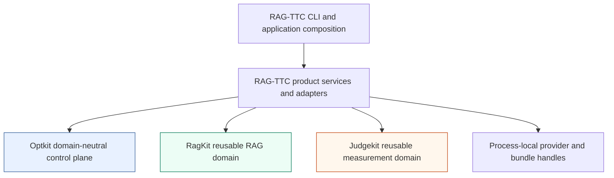

# Optkit and RAG-TTC: Durable, Attributed RAG Experiments

A RAG experiment is only useful when its treatment can be identified, its execution can be resumed, its evidence can be inspected, and its measurements can be interpreted under the protocol that produced them. OPTKIT-002 implemented that complete path. The work introduced a domain-neutral experiment control plane in Optkit, extracted one canonical TTC retrieval and answer path in RAG-TTC, preserved reusable RAG algorithms in RagKit, integrated Judgekit as a separately attributable measurement system, and proved the composition with a durable six-episode campaign.

This report explains the resulting architecture and the implementation sequence that made it safe to reach. It focuses on the decisions that affect correctness: semantic characterization before refactoring, policy filtering before ranking boundaries, immutable runtime identities, stage-aware loss diagnosis, queue-first terminal persistence, idempotent reconciliation, historical remeasurement under distinct epochs, and executable dependency guards.

The earlier RAG-TTC architecture is documented in [[ARTICLE - rag-ttc - Architecture of a Reproducible Go RAG Evaluation System]] and [[PROJECT REPORT - rag-ttc - Simplifying a Recoverable and Measurable RAG Experiment System]]. Judgekit's independent measurement model is documented in [[PROJECT REPORT - judgekit - A Provider-Neutral Evaluation Library]]. OPTKIT-002 connects those systems without merging their domain responsibilities.

> [!summary]
> - Optkit now owns durable, domain-neutral snapshots, artifacts, episodes, campaign facts, queues, leases, budgets, observations, estimates, and read-only projections. It does not import RagKit, Judgekit, RAG-TTC, RagOpt, or Coinvault.
> - RAG-TTC now has one canonical retrieval service and one canonical customer application service below tools and transports. Retrieval records its prepared identity and every ranking stage, and source-role policy is enforced before fusion and external reranking.
> - A product-owned Optkit adapter executes the real TTC retrieval service in a complete-block campaign. Terminal queue results are persisted before journal facts, then reconciliation commits budget usage, episode completion, observations, estimates, and campaign completion without duplicate semantic execution.
> - Sealed historical answers can be measured repeatedly with Judgekit under new protocols and Optkit measurement epochs without rerunning retrieval or answer generation. Reports record contract, protocol, current instance, prompts, expected and observed models, cache behavior, usage, and duration.

## 1. What the project had to establish

The starting repositories already contained useful mechanisms. RagKit contained documents, chunks, representations, content stores, lexical and vector search, fusion, reranking, and grounded-answer records. RAG-TTC contained explicit experiment commands, TTC product policy, customer and admin applications, run directories, evaluation code, and several production paths. Judgekit contained provider-neutral measurement contracts and claim judging. RagOpt contained candidate, run, gate, report, and review orchestration. The supplied Optkit implementation contained a generic campaign model, but it had not yet been proved against a real product.

The missing property was a coherent execution path across those systems. A product campaign needed to answer all of the following questions with durable evidence:

1. Which exact retrieval treatment ran?
2. Which candidates existed at each retrieval stage?
3. Did authorization policy affect fusion or leave the process through reranking?
4. Where did required evidence disappear?
5. Did direct evaluation execute the same product behavior as serving?
6. Can a process restart after leasing, execution, or measurement without repeating the semantic operation?
7. Can a judge protocol change without repeating retrieval and generation?
8. Can the generic framework remain independent from RAG and product code?
9. Which old orchestration paths are actually superseded, and which still preserve behavior that has not been reproduced?

These questions forced a product-first implementation strategy. A large repository consolidation would have obscured behavioral differences and made deletion difficult to justify. Instead, each phase established one semantic property and retained evidence for the next phase.

## 2. The final ownership model

The final design uses four stable responsibility domains and one product composition domain.

| Repository | Responsibility | Examples | Explicit exclusions |
| --- | --- | --- | --- |
| Optkit | Domain-neutral experiment control and query plane | snapshots, artifacts, episodes, campaigns, queues, leases, budgets, observations, estimates, projections | chunks, embeddings, source roles, TTC routes, judge prompts |
| RagKit | Reusable RAG-domain mechanics | documents, chunks, representations, indexes, search, fusion, reranking, hydration, answer records | campaigns, TTC admission policy, Judgekit execution |
| Judgekit | Reusable measurement domain | contracts, instances, protocols, reports, claim judging, calibration | TTC source meaning, Optkit scheduling, provider profiles |
| RAG-TTC | TTC product semantics and composition | prepared routes, source policy, direct customer turns, fixtures, Optkit adapters, Judgekit instruments | generic framework internals |
| RagOpt | Retained legacy orchestration pending parity | frozen I5 candidate/evaluation command, historical runstore and review readers | new OPTKIT-002 campaign work |

The dependency direction is executable:



Optkit's boundary test runs `go list -json ./...`, inspects production, test, and external-test imports, and rejects direct imports from all product, RAG, and measurement modules. RagKit and Judgekit have corresponding guards with repository-specific rules. The tests matter because documentation cannot prevent a convenient import from reversing ownership later.

The composition remains in RAG-TTC because it is the only layer that knows all of the following at once:

- which TTC corpus and source roles are authorized;
- which prepared route a caller may name;
- how evidence is admitted to a customer turn;
- which snapshots and cases represent a TTC experiment;
- how a TTC answer becomes a Judgekit instance;
- which deterministic and probabilistic constructs belong in the campaign.

## 3. Characterization before extraction

The first semantic implementation phase did not move retrieval code. It created a cross-product fixture that records the behavior to preserve.

The canonical fixture is `rag.semantic-fixture/v1`, stored under the OPTKIT-002 ticket and copied byte-for-byte into RAG-TTC and Coinvault testdata. Its SHA-256 is:

```text
2fa045999a8a89039e00dd60b3fec2bc17b732d557eb00746e207620a5fbdc7f
```

It contains three documents, three chunks, three representations, lexical and vector rankings, role metadata, positive and authorization-negative cases, expected retrieval stages, evidence budgets, citation labels, and answer expectations. A ticket-local script verifies that both product copies remain identical to the canonical bytes.

This fixture establishes several laws that are easy to lose during refactoring:

- lexical and vector channels retain deterministic candidate order;
- collapse and fusion produce an exact expected chunk order;
- authorization removes an analyst-only candidate from a public route;
- admitted evidence receives deterministic citation labels;
- repeated evidence reuses its existing label;
- item and rune budgets produce explicit omissions;
- no-answer cases remain explicit rather than becoming empty success rows.

The fixture belongs to neither product at runtime. Each product has a strict local decoder and tests the responsibility it owns. RAG-TTC tests retrieval and evidence behavior. Coinvault tests authorization-before-use and run-scoped evidence admission. This arrangement shares semantics without requiring either product to import the other's code or an unpublished test-support module.

A concrete lesson emerged while creating the fixture. The initial rune budget admitted the first named-route evidence but prevented a later fallback route from admitting the expected second distinct chunk. The fixture was corrected by increasing the rune budget while preserving the independent item-count failure. The correction made the scope of evidence state explicit: admission is not a pure function of one retrieval response; it depends on the active ledger.

## 4. One canonical retrieval service

Before P2, the model-facing search tool owned channel execution, collapse, fusion, augmentation, hydration, and result shaping. That made serving behavior difficult to invoke directly from evaluation or an experiment system.

P2 introduced this API in `rag-ttc/pkg/ttc/search/service.go`:

```go
type RetrievalRequest struct {
    Query          string
    RequestedRoute string
}

func (s *Service) Retrieve(
    ctx context.Context,
    request RetrievalRequest,
) (RetrievalResult, error)
```

The service now owns TTC retrieval semantics independently of Geppetto, HTTP, WebSocket, and sessionstream. The model tool retains model-input bounds, per-conversation evidence admission, citation labels, tool registration, and model-facing result shaping. This is a permanent application boundary, not a compatibility implementation.

The distinction is important:

```text
retrieval service
  query + prepared route
  -> channel candidates
  -> collapsed candidates
  -> policy-filtered candidates
  -> fused candidates
  -> optional augmentation
  -> policy recheck
  -> optional reranking
  -> hydrated source evidence

search tool session
  retrieval result
  -> per-turn evidence admission
  -> stable labels
  -> bounded model-facing output
```

The direct service returns channels, fused hits, hydrated evidence, the selected-route observation, runtime identity, and stage trace. The tool delegates to it and maintains the evidence ledger. The P1 fixture calls both paths and proves equal ranked evidence.

The service does not accept searchers, source-role lists, corpus paths, provider configuration, or arbitrary route definitions in `RetrievalRequest`. Runtime callers may name only a route that was prepared by the composition root. This prevents model-controlled input from constructing an unreviewed retrieval treatment.

## 5. Runtime identity is part of the treatment

A route name is not enough to identify an experiment treatment. Two executions named `hybrid` can differ in corpus, route configuration, query transform, role policy, evidence limits, reranker, or tool description.

P3 introduced `RuntimeIdentity` with identities for:

- bundle;
- corpus;
- resolved configuration;
- query transform;
- retrieval policy;
- evidence policy;
- reranker;
- tool description.

The output also records the effective result limit and whether it came from a default, a request, or a clamped request. These values are computed during verified preparation and execution rather than copied from ambient flags after the fact.

The resulting rule is strict:

```text
intended treatment identity == observed treatment identity
```

If any identity differs, the evaluator records a treatment mismatch. It does not silently score the ranking as if the requested intervention had run.

The identities are research fingerprints. They prove consistent content-derived attribution within the system; they are not cryptographic signatures or remote attestations. This distinction keeps the implementation proportional to the research objective while still preventing accidental cross-treatment aggregation.

## 6. Why policy filtering precedes fusion and reranking

Source-role policy must run before any stage at which unauthorized candidates can affect allowed results or leave the process.

The implemented ordering is:

```text
lexical raw
  -> lexical collapse
  -> lexical policy filter

vector raw
  -> vector collapse
  -> vector policy filter

allowed channel candidates
  -> weighted reciprocal-rank fusion
  -> optional augmentation
  -> policy recheck
  -> bounded external reranking
  -> hydration and verified source lookup
```

The P3 policy fixture gives the forbidden candidate rank 1 in one channel. Late filtering would still let its rank alter reciprocal-rank contributions assigned to permitted candidates. Early filtering produces the permitted candidate's expected score of `2/61`, rather than a score derived from `1/61 + 1/62` after the unauthorized candidate influenced rank positions.

The same rule applies to external reranking. An unauthorized source cannot be included in the reranker request and removed afterward, because the source text has already crossed a provider boundary. Tests use a reranker spy and assert that it receives only permitted candidates.

The route role list is also intersected with an immutable server-owned floor. A prepared route may narrow authorized roles but cannot widen them. RAG-TTC's customer preparation currently permits `faq`, `page`, `post`, `product`, and `ttc_guide`; unknown roles fail during preparation.

A final policy recheck runs after augmentation. This is not the primary authorization boundary. It is an internal invariant that catches an augmenter that reintroduces a disallowed candidate.

## 7. Stage traces make retrieval failures diagnosable

Every significant retrieval boundary emits a `RetrievalStage`:

```go
type RetrievalStage struct {
    Name              string
    Status            string
    InputCount        int
    OutputCount       int
    ChunkIDs          []string
    CandidateArtifact CandidateArtifactReference
    ErrorClass        string
}
```

The candidate reference uses schema `ttc-retrieval-candidate-set/v1` and a deterministic digest of the ordered candidate IDs. The core stage names are:

```text
lexical.raw
lexical.collapsed
lexical.policy_filtered
vector.raw
vector.collapsed
vector.policy_filtered
retrieval.fused
retrieval.augmented
retrieval.policy_recheck
retrieval.reranked
evidence.hydrated
evidence.returned
evidence.admitted
```

Reranker failure is visible but not necessarily terminal. The service preserves fused order and marks the reranking stage `degraded` with a bounded error class when provider execution or pool hydration fails. A consumer can distinguish a completed rerank from a deterministic fallback without losing the retrieval result.

P4 built `pkg/ttc/retrievaleval` over these traces. It separates three case modes:

- `positive` cases require one member from each target group;
- `authorization_negative` cases identify targets that must not appear after policy;
- `answer_or_judge_only` cases are retained for downstream stages without entering retrieval denominators.

Positive target groups represent alternatives. If several chunks satisfy one evaluation unit, retrieving any member covers the group. Recall and nDCG therefore operate over groups rather than requiring every interchangeable chunk.

The evaluator normalizes channel-specific evidence into a logical funnel:

```text
raw
collapsed
policy_filtered
fused
augmented
policy_rechecked
reranked
returned
admitted
```

For each required group, it records the first transition from present to absent. A failed case can therefore report that the target was:

- missing from all raw channels;
- removed during collapse;
- removed by policy;
- lost in fusion;
- lost during augmentation or policy recheck;
- lost in reranking;
- below the return limit;
- rejected during evidence admission.

It also records relevant-candidate rank movements between adjacent logical stages. The delta is `from_rank - to_rank`, so a positive value means rank improvement.

Query failures remain rows. The suite declares whether they count as zero or are excluded from a positive denominator. Treatment mismatches, authorization violations, latency, and provider-call counts remain explicit aggregate fields. This avoids the common evaluation error in which failed rows disappear and make aggregate quality appear higher.

## 8. The direct customer application boundary

Retrieval-only campaigns cannot prove answer behavior or transport parity. P5 introduced `rag-ttc/pkg/ttc/customerapp` as the canonical customer-domain turn below HTTP, WebSocket, and sessionstream.

Its direct API is:

```go
func (s *Service) RunTurn(
    ctx context.Context,
    request Request,
) (Result, error)
```

The service owns:

- the bounded provider/tool loop;
- a fresh search session and evidence ledger;
- checked orchestration instructions;
- structured answer output;
- citation-label and immutable chunk-ID validation;
- safe abstention;
- explicit failure classification;
- content-free application events;
- a redacted durable trajectory projection.

The result distinguishes `completed`, `abstained`, and `failed`. Failures distinguish validation, cancellation, retrieval miss, policy removal, admission truncation, generation failure, malformed output, unsupported claims, unresolved citations, presentation failure, provider-call limit, and tool failure.

A retrieval miss is not automatically a terminal application failure. The model can produce a valid safe abstention. In contrast, malformed structured output or unresolved citations fail the answer contract.

The in-memory `Result` contains answer text, search calls, admitted evidence, and detailed failures because immediate validation needs them. `Result.Trajectory()` deliberately removes customer questions, model prose, source text, and raw failure messages:

```go
type Trajectory struct {
    Schema           string
    SessionID        string
    TurnID           string
    Status           Status
    Abstained        bool
    CitationChunkIDs []string
    FailureCodes     []FailureCode
    ProviderCalls    int
    DurationNanos    int64
}
```

Provider webchat composition now invokes this direct service through `customerapp.EngineAdapter`. Direct and served tests compare status, answer, citations, contract, evidence, failures, and provider calls. The transport still owns streaming, snapshots, and turn persistence, but it no longer owns another customer tool loop.

## 9. The Optkit execution model

Optkit's imported baseline provides the domain-neutral records used by the product adapter:

- `space` materializes immutable configuration snapshots;
- `artifact` stores content-addressed payloads with sensitivity labels;
- `episode` records and seals execution trajectories;
- `measure` defines epochs and observations;
- `experiment` expands trials and calculates estimates;
- `campaign` validates commands and appends authoritative control events;
- `scheduler` owns durable work items, leases, and terminal results;
- `budget` reserves and commits resource quantities;
- `projection` rebuilds read models from journal facts;
- `query` exposes bounded read-only projections;
- `system` binds a durable snapshot to a process-local executable factory.

The `system.Registry` is the key P6 addition to Optkit. Its interfaces are intentionally small:

```go
type Factory interface {
    SystemID() record.SystemID
    ConfigSchema() record.SchemaID
    CaseSchema() record.SchemaID
    Prepare(context.Context, artifact.Store, space.SnapshotRecord) (Prepared, error)
}

type Prepared interface {
    SystemID() record.SystemID
    SnapshotID() record.SnapshotID
    CaseSchema() record.SchemaID
    Run(context.Context, artifact.Ref, int64, episode.Sink) (episode.RunResult, error)
}
```

Snapshots and queue work contain schema-identified artifact references. Provider clients, credentials, open indexes, and bundle handles remain in the product composition root. After preparation, the registry verifies that the returned executable identifies the requested system, snapshot, and case schema. A buggy factory cannot silently execute a different snapshot.

This design handles heterogeneous product systems without requiring one generic Go type for every configuration and case. Typed decoding occurs inside the product factory, where domain meaning is available.

## 10. The RAG-TTC Optkit adapter

`rag-ttc/pkg/ttc/optkitcampaign` imports both Optkit and the TTC service. It defines strict, product-owned schemas:

```text
system:rag-ttc-retrieval/v1
schema:rag-ttc.optkit-retrieval-config/v1
schema:rag-ttc.optkit-retrieval-case/v1
schema:rag-ttc.optkit-retrieval-output/v1
```

A `RetrievalConfig` contains only:

- a prepared runtime name;
- a checked route name;
- a positive result limit.

A `RetrievalCase` contains a case ID, mode, query, required target groups, and forbidden targets. It reuses the retrieval evaluator's case validation but does not contain runtime searchers or authorization configuration.

The prepared executable decodes the case artifact, emits `retrieval.input`, invokes the process-local TTC executor, emits one `retrieval.stage` event for every observed stage, attaches the canonical output, emits `retrieval.completed`, and returns resource usage for one query and the number of results.

This is the exact point where product semantics enter the generic framework. Optkit receives schema identities, artifact references, trajectory events, usage, and an episode result. RAG-TTC retains route preparation, search execution, source policy, and target semantics.

## 11. Complete-block campaign construction

The first real campaign deliberately uses a fixed design rather than adaptive candidate search. It compares two limits across three deterministic cases:

```text
arms:    limit-1, limit-2
cases:   three semantic fixture cases
repeats: one
cells:   2 arms × 3 cases × 1 repeat = 6 episodes
```

`experiment.NewCompleteBlockTrial` creates one episode per arm-case-repeat cell. Pairing controls case difficulty when calculating the treatment delta. The fixed design also keeps failures attributable to the control plane rather than an optimizer.

Initialization performs these steps:

1. Validate every arm configuration.
2. Materialize one immutable snapshot per arm.
3. Validate and store every case as a canonical artifact.
4. Create a dataset manifest and complete-block trial.
5. Define finite query and result budgets.
6. Append campaign creation, plan compilation, and start facts.
7. Expand episode specifications.
8. Create one durable work item per episode.
9. Reserve worst-case budget claims.
10. Append budget-reserved and episode-scheduled facts.
11. Enqueue all work items.

The result budget is conservative: every episode reserves up to 100 results even though the fixture returns fewer. Reconciliation later commits actual usage.

## 12. Why terminal queue results precede journal completion

The scheduler queue and campaign journal are separate durable authorities. There is no transaction spanning both stores. The implementation therefore chooses an ordering that makes restart repair possible.

During execution:

```text
lease work
append lease fact if needed
append attempt-started fact if needed
prepare exact snapshot
run product executable
seal trajectory
store episode result
store canonical completion artifact
complete queue item with completion artifact
```

Only after the queue has a terminal result does reconciliation append the derived campaign facts:

```text
for each expected episode:
    load deterministic work item
    if queue result is not terminal:
        continue
    decode canonical completion and episode result
    if usage fact is absent:
        commit actual budget and append UsageCommitted
    if episode completion fact is absent:
        append EpisodeCompleted
    calculate deterministic score
    if observation fact is absent:
        append ObservationRecorded

if every episode has a valid observation:
    calculate arm means and paired estimates
    append missing EstimateRecorded facts
    complete the campaign if it is still running
```

The queue result contains the canonical artifact required to repair the journal. If the process stops after terminal queue persistence but before `EpisodeCompleted`, restart does not rerun retrieval. It reads the result and appends the missing facts.

The campaign tests interrupt at four boundaries:

- after lease;
- after terminal queue result;
- after the first observation;
- during an in-flight canceled execution.

After lease expiry or process restart, the runner reclaims work, folds existing campaign state, avoids invalid duplicate lease or attempt transitions, and continues from the retained state. Observation identities use construct, epoch, subject, value, evidence, and repeat rather than replay time, so reconciliation can recognize existing semantic observations.

The final deterministic campaign produces:

| Arm | Mean target coverage | Sample size |
| --- | ---: | ---: |
| `limit-1` | 0.8333333333333334 | 3 |
| `limit-2` | 1.0 | 3 |

The paired mean delta is:

```text
limit-2 - limit-1 = +0.16666666666666666
```

The CLI's `run`, resumed `run`, and `inspect` commands emit byte-identical JSON for a completed campaign. That equality proves that inspection and restart rebuild the terminal summary from durable state rather than process-local variables.

## 13. Measurements require epochs

A numeric value does not identify a measurement. An Optkit measurement epoch includes:

- construct;
- instrument;
- protocol;
- implementation;
- calibration identity;
- redaction identity where applicable.

The P6 deterministic score uses construct `retrieval.target-coverage`, instrument `rag-ttc.deterministic-target-coverage/v1`, protocol `complete-block/v1`, and the implementation package identity. Each observation refers to the episode result artifact that supports it.

This model prevents observations from different protocols from being combined merely because their construct names match. It becomes more important in P7, where a judge prompt, model, cache policy, or contract can change independently of the answer being measured.

## 14. Sealed historical answers and Judgekit

P7 separates answer execution from judge execution. A historical answer record contains only post-execution material:

- stable instance ID;
- question;
- candidate answer;
- admitted evidence;
- optional reference and required facts;
- retrieval identities;
- metadata;
- references to separate deterministic contract artifacts.

The record is bounded to 256 KiB per question, candidate, or evidence item and at most 64 evidence items. It is stored with confidential sensitivity. The deterministic answer-contract result is emitted as a separate internal trajectory event so probabilistic judging does not replace mechanical validation.

`judgeinstrument.Instrument.Measure` performs this sequence:

```text
load and verify sealed Optkit trajectory
locate exactly one sealed-answer event
verify nested deterministic artifacts
build a fresh Judgekit evidence set and instance
store the instance as confidential
execute Judgekit with cache use or bypass
validate report attribution
store report as confidential
create one Optkit observation per construct
store observations as internal artifacts
```

Retrieval and answer providers are not dependencies of `Measure`. A protocol change therefore does not rerun them.

### 14.1 Evidence-hidden claim extraction

Judgekit's claim extractor now accepts `ClaimExtractionInput`, which contains input, candidate, and metadata but does not expose evidence, reference answers, or required facts. Support judging receives the full instance only after the claim list is fixed.

This compile-time separation prevents an extraction prompt renderer from selecting claims based on which statements are easy to support with the evidence. It does not require a signature service or a hardened custody subsystem.

### 14.2 Current-content identity

`eval.BindCurrentIdentity` recomputes the evidence-set digest and then the enclosing instance digest at the judge execution boundary. The caller's previous digest is not trusted. This catches stale identity after content mutation.

The nested order is necessary. Recomputing only the outer instance while retaining a stale evidence-set digest would produce an identity over inconsistent state.

### 14.3 Expected and observed model identity

Judgekit protocols identify the expected provider, model, revision, and settings. Every generation result identifies the model that actually served it. Validation occurs before generated output enters accepted cache or report state.

Cache entries now store the attributed `GenerationResult`, not only generated text. A cache hit can therefore retain observed model, token counts, duration, and prompt attribution from the execution that originally produced it.

### 14.4 Report provenance

A sealed report includes `RunProvenance`:

```go
type RunProvenance struct {
    ContractDigest        string
    ProtocolDigest        string
    InstanceDigest        string
    PromptTemplateDigests map[string]string
    ExpectedModel         protocol.ModelIdentity
    CacheMode             string
    Generations           []PromptExecution
}
```

Each prompt execution records the stage, attempt, rendered prompt digest, observed model, cache-hit state, token counts, and duration. Structural repair attempts therefore remain individually attributable.

The product instrument validates that report instance, protocol, contract, and cache mode equal the active measurement request before creating observations.

### 14.5 Failure and missing output are not scores

A judge provider failure produces confidential failure evidence and `StatusFailed` observations with value `judge_failed`. It does not become a zero quality score.

A valid report that omits a configured construct produces `StatusUnknown` with value `missing_output`. Other constructs in the same report can still be measured. A not-applicable dimension becomes `StatusInapplicable`.

This preserves the distinction between:

- poor answer quality;
- failed measurement execution;
- absent measurement output;
- a construct that does not apply.

The remeasurement test measures one sealed answer under two protocol digests. The instance artifact remains the same, the measurement epoch changes, and the earlier observations remain byte-for-byte unchanged.

## 15. The read-only scientific explorer

The campaign UI was implemented as OPTKIT-003 during OPTKIT-002 P2.5. It is intentionally read-only. Campaign creation, parameter changes, lifecycle commands, and decisions remain in CLI or application command paths, commonly operated by LLM agents. The browser supports navigation, replay, comparison, search, provenance inspection, and bounded artifact previews.

The query service rebuilds campaign summaries from authoritative journal facts and immutable artifacts. Its key bounds are:

```text
API version:             optkit.query/v1
default event page:      200
maximum event page:      500
maximum payload preview: 256 KiB
```

The HTTP server uses Go 1.22 `http.ServeMux` patterns and registers only `GET` routes. A POST to the API returns 405. Security headers include a self-only content security policy, frame denial, no-referrer policy, and content-type sniffing denial.

Event sequence is the common cursor for pagination, replay, and SSE:

```text
GET /api/v1/campaigns/{id}/events?after=<seq>&limit=<n>
GET /api/v1/campaigns/{id}/stream?after=<seq>
Last-Event-ID: <seq>
```

SSE polls authoritative journal head rather than depending on an in-memory event bus. A reconnect can therefore resume events produced by another process. Each event preview is subject to sensitivity, size, and valid-JSON checks. Confidential and restricted artifacts are not exposed.

The UI demonstrates an important architecture property: authoritative facts and rebuildable views are separate. New navigation projections can be added without changing campaign command semantics or storage-table contracts.

## 16. Deleting only behavior that was actually superseded

P8 did not delete RagOpt wholesale. It performed a caller inventory and classified every remaining dependency.

The obsolete path was the outer customer `ToolRegistryFactory` and `buildProviderToolRegistry`. After P5, production serving already used:

```text
provider engine
  -> realruntime ApplicationEngineFactory
  -> ragsearch.Handle.NewApplicationEngine
  -> customerapp.EngineAdapter
  -> customerapp.Service.RunTurn
  -> per-turn search session registry
```

The old outer registry had test-only callers and would have created a second plausible customer tool loop. It was removed in a dedicated RAG-TTC commit, deleting 78 lines without a compatibility layer.

The remaining RAG-TTC `tool-eval optimize` path is different. It still owns behavior that P6 and P7 do not reproduce:

- locked candidate asset and profile digests;
- feedback and validation split selection;
- full answer generation;
- per-cell embedding, generation, and judge budgets;
- legacy gate policy and promotion report;
- native session and outcome artifacts;
- resumable historical run-directory layout.

RAG-TTC and Coinvault also retain active `ragopt/pkg/runstore` and `ragopt/pkg/review` readers. Coinvault uses additional candidate, evaluation, gate, policy, compare, and report packages.

Deleting those paths would remove behavior, not duplicate behavior. The migration inventory defines explicit parity gates: typed Optkit candidate snapshots, full customer-answer episodes, equivalent budgets, Judgekit epochs, hard constraints, paired estimates, promotion evidence, historical import or projection, frozen-fixture comparison, caller switch, and only then deletion.

This is the project's consolidation rule:

> Replace a path after its behavior is reproduced, validated, and its callers have switched. Do not infer parity from similar package names.

## 17. Failure modes that changed the implementation

The implementation diary records failures as part of the technical evidence. Several failures materially improved the design.

### 17.1 Workspace-only unpublished modules

RAG-TTC requires local Optkit and Judgekit as `v0.0.0` during this branch. An all-version workspace replacement failed:

```text
go: workspace module github.com/go-go-golems/optkit is replaced at all versions
in the go.work file. To fix, remove the replacement from the go.work file or
specify the version at which to replace the module.
```

A version-specific replacement resolved workspace builds:

```text
replace github.com/go-go-golems/optkit v0.0.0 => ./optkit
replace github.com/go-go-golems/judgekit v0.0.0 => ./judgekit
```

`go mod tidy` with `GOWORK=off` still fails because `v0.0.0` is unpublished. This remains release work, not a hidden success condition.

### 17.2 Structured CLI requirements

The first Optkit campaign commands used raw Cobra flags. Glazed's analyzer rejected them:

```text
define CLI flags with cmds.WithFlags(fields.New(...)) instead of raw Cobra/pflag/flag APIs
```

The commands were converted to `cmds.GlazeCommand`, declared fields in their command descriptions, and emitted structured rows through a processor. The analyzer is enforcing machine-readable command behavior required by agent-operated workflows.

### 17.3 Queue output placed under a reset directory

The first CLI smoke redirected `run.json` into the same store root passed with `--reset`. Reset correctly deleted the path, and the parser later reported `FileNotFoundError`. The validation now uses separate store and output directories. This keeps campaign reset semantics correct rather than weakening reset to accommodate a test.

### 17.4 Asynchronous observability assertions

Three unrelated chatserver assertions surfaced across full race runs: heartbeat timeout, subscription denial telemetry, and reconnect telemetry. In each case, the protocol frame and observer callback were asynchronous effects. Immediate metric reads were not synchronized with observer completion.

The final failure reported every expected outcome except `Reconnects`, which was still zero. The correction waits for the exact reconnect metric and structured reconnect log with a bounded deadline. It passed 100 race-enabled repetitions. Production transport behavior did not change.

The general rule is direct:

```text
receiving a protocol acknowledgement
!= observing completion of every asynchronous telemetry callback
```

Tests must wait for the side effect they assert.

### 17.5 Validation around unrelated worktree state

The primary Optkit worktree contained an unrelated malformed edit in `store/sqlite/rows.go`. P7, P8, and final validation did not stash, edit, or discard it. They created a detached worktree at committed Optkit `HEAD`, generated a temporary absolute-path `go.work`, tested RAG-TTC against that exact checkout, and removed the worktree through a shell trap.

This proves committed behavior without changing user state and without allowing unrelated uncommitted code to affect the result.

### 17.6 Documentation was part of delivery behavior

The first reMarkable upload failed because the diary encoded a prompt line break as literal `\n`, which Pandoc interpreted as an undefined TeX control sequence. Replacing it with the actual verbatim line break fixed PDF generation. The final six-document bundle uploaded successfully.

This failure is not part of runtime architecture, but it demonstrates why the ticket retained exact delivery commands and failures instead of reporting only the final upload.

## 18. Final validation evidence

The final validator executes current behavior and verifies accumulated evidence. It does not only search old transcripts for success markers.

The closure gate performed:

| Area | Validation |
| --- | --- |
| Semantic fixture | Byte identity in RAG-TTC and Coinvault; pinned SHA-256 |
| Optkit | Full unit, race, vet, lint, no-CGO unit, and static build |
| RagKit | Full unit, race, build, vet, and lint with `GOWORK=off` |
| Judgekit | Full unit, race, build, vet, and lint with `GOWORK=off` |
| RagOpt | Full unit, race, build, vet, and lint for retained behavior |
| RAG-TTC | Focused semantic tests, full unit/race, build, vet, lint, and Glazed vet |
| Coinvault | Retained RagOpt command characterization |
| Dependency boundaries | Optkit, RagKit, and Judgekit import guards |
| Campaign durability | Fresh run, resume, inspect, journal verification, identical JSON |
| Delivery | Docmgr doctor, all tasks closed, final slip, reMarkable bundle |

The fresh closure campaign was:

```text
campaign:5059080a270edd4c1078fe186692d4ee
```

It completed six episodes with the expected paired delta. Initial run, resumed run, and inspect output compared byte-for-byte. The transcript ends with:

```text
FINAL_VALIDATION=PASS
```

The complete ticket bundle was uploaded as:

```text
/ai/2026/08/25/OPTKIT-002/
  OPTKIT-002 Pragmatic RAG TTC Vertical Slice.pdf
```

## 19. Running the implemented campaign

The current workspace commands are:

```bash
# Start a new deterministic two-arm campaign.
go run ./cmd/rag-ttc experiment optkit-rag run \
  --store ./tmp/optkit-rag \
  --reset \
  --format json

# Resume an existing campaign.
go run ./cmd/rag-ttc experiment optkit-rag run \
  --store ./tmp/optkit-rag \
  --campaign <campaign-id> \
  --format json

# Inspect without mutation.
go run ./cmd/rag-ttc experiment optkit-rag inspect \
  --store ./tmp/optkit-rag \
  --campaign <campaign-id> \
  --format json
```

The important operational assertion is:

```text
completed run output == resumed run output == inspect output
```

The complete closure validator is:

```bash
cd /home/manuel/workspaces/2026-08-24/use-optkit/optkit
./ttmp/2026/08/24/OPTKIT-002--implement-optkit-and-pragmatic-rag-ttc-vertical-slice/scripts/11-validate-final.sh
```

It is intentionally expensive because it spans the repositories whose boundaries and compatibility the project claims to preserve.

## 20. What is proved and what remains open

OPTKIT-002 proves a complete vertical slice for deterministic TTC retrieval campaigns and historical answer measurement. It does not yet implement the full optimization workbench described by OPTKIT-004.

The proved properties are:

- semantic fixture parity across two products;
- one direct retrieval implementation below tools and transports;
- prepared-route authority and server-owned source policy;
- identity-complete, stage-traced retrieval;
- deterministic treatment verification and target-loss diagnosis;
- one direct customer answer application below transport;
- redacted durable application trajectories;
- domain-neutral system registration in Optkit;
- restartable complete-block product campaigns;
- idempotent queue-to-journal reconciliation;
- deterministic observations and paired estimates;
- historical Judgekit remeasurement under distinct epochs;
- read-only campaign exploration;
- executable module ownership guards;
- deletion of one proven-dead product orchestration path.

The open work is explicit:

1. Publish or pin Optkit and Judgekit, remove `v0.0.0` workspace replacements, run `go mod tidy`, and restore isolated release hooks.
2. Add full answer/context campaigns before replacing the frozen I5 RagOpt command.
3. Add typed candidate snapshots, build-stage reuse, gate decisions, and promotion evidence.
4. Add historical RagOpt importers or equivalent Optkit projectors before replacing runstore and review readers.
5. Add database-side pagination, richer RAG-specific projectors, retry handling for journal version conflicts, and stronger concurrent reconciliation for large campaigns.
6. Implement the OPTKIT-004 progressive optimization funnel, artifact dependency DAG, Pareto estimates, specialist pipeline views, and promotion workflow through separate tickets.

The next architecture should preserve the properties established here. A judge-only protocol change should reuse prior retrieval and answer artifacts. A reranker change should reuse corpus preparation and indexes but invalidate downstream retrieval and answer artifacts. A chunker change should invalidate chunks and every dependent artifact. Those rules require layered configuration identities and an explicit artifact dependency graph rather than one aggregate configuration hash.

## 21. Technical conclusions

The project establishes several reusable engineering rules.

- Characterize semantic behavior before extracting a shared service. The frozen fixture supplied exact ranks, policy behavior, evidence labels, and answer outcomes against which every later phase could be checked.
- Put product semantics below transports. Direct retrieval and customer application services allow serving and experiments to execute the same behavior.
- Treat runtime identity as part of the observation. A score without the exact treatment identity cannot support a scientific comparison.
- Apply authorization before ranking boundaries and external providers. Late filtering cannot remove rank influence or provider disclosure that has already occurred.
- Record intermediate stages when failures must be diagnosed. Final recall cannot identify whether a target was absent, filtered, reranked away, truncated, or rejected during admission.
- Persist a canonical terminal result before derived journal facts when one transaction cannot cover both authorities. Reconciliation can then repair missing facts without repeating the semantic operation.
- Keep deterministic contract checks separate from probabilistic judge measurements. They have different failure semantics and different measurement epochs.
- Represent judge failure and missing output as statuses, not numeric quality values.
- Enforce repository direction with tests over production and test imports. Ownership rules that are not executable will decay.
- Delete only after parity and caller migration. Similar functionality is not sufficient evidence that a retained path is superseded.

The resulting system does not require Optkit to understand RAG, RagKit to understand campaigns, or Judgekit to understand TTC. RAG-TTC composes the independent domains and supplies the product meaning. That separation is what allows the same durable campaign machinery to evaluate other systems while preserving the full RAG-specific evidence required for this one.

## Related notes

- [[ARTICLE - rag-ttc - Architecture of a Reproducible Go RAG Evaluation System]]
- [[PROJECT REPORT - rag-ttc - Simplifying a Recoverable and Measurable RAG Experiment System]]
- [[PROJECT REPORT - rag-ttc - From Clean-Slate Toolbox to Live TTC Answer Quality Evaluation]]
- [[PROJECT REPORT - judgekit - A Provider-Neutral Evaluation Library]]
- [[ARTICLE - rag-ttc - Reproducible TTC RAG Evaluation with Blinded LLM Judges]]

## Primary source paths

- `/home/manuel/workspaces/2026-08-24/use-optkit/optkit/ttmp/2026/08/24/OPTKIT-002--implement-optkit-and-pragmatic-rag-ttc-vertical-slice/reference/01-implementation-diary.md`
- `/home/manuel/workspaces/2026-08-24/use-optkit/optkit/ttmp/2026/08/24/OPTKIT-002--implement-optkit-and-pragmatic-rag-ttc-vertical-slice/design-doc/01-phased-implementation-plan.md`
- `/home/manuel/workspaces/2026-08-24/use-optkit/optkit/system/registry.go`
- `/home/manuel/workspaces/2026-08-24/use-optkit/rag-ttc/pkg/ttc/search/service.go`
- `/home/manuel/workspaces/2026-08-24/use-optkit/rag-ttc/pkg/ttc/retrievaleval/`
- `/home/manuel/workspaces/2026-08-24/use-optkit/rag-ttc/pkg/ttc/customerapp/`
- `/home/manuel/workspaces/2026-08-24/use-optkit/rag-ttc/pkg/ttc/optkitcampaign/`
- `/home/manuel/workspaces/2026-08-24/use-optkit/rag-ttc/pkg/ttc/judgeinstrument/`
- `/home/manuel/workspaces/2026-08-24/use-optkit/judgekit/judging/claimjudge.go`
- `/home/manuel/workspaces/2026-08-24/use-optkit/judgekit/assessment/provenance.go`
