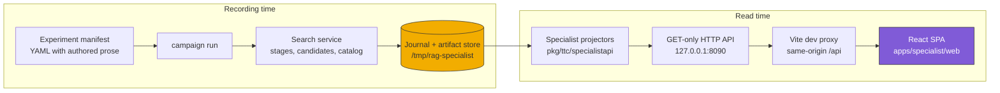
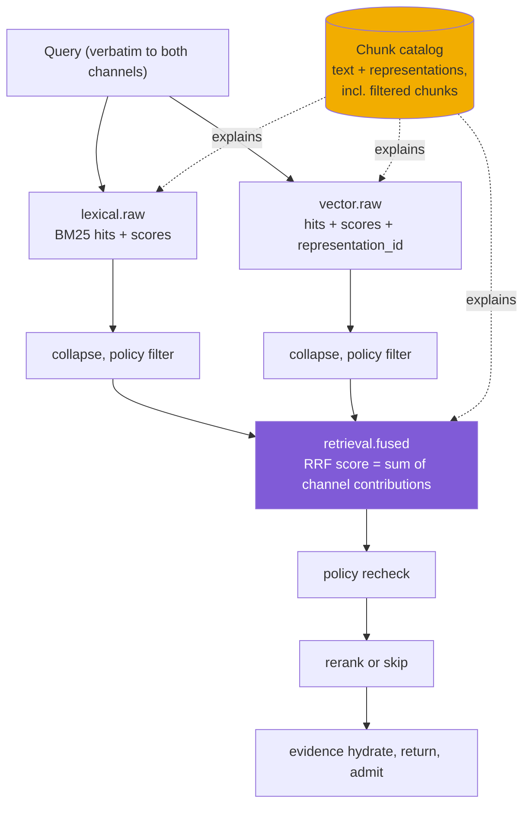

# RAG-TTC Specialist UI: From Sealed Journal to Readable Instrument

A durable experiment system records everything and explains nothing. The RAG-TTC campaign store built in OPTKIT-002 through OPTKIT-007 seals every retrieval run into a verified journal: episode specifications, stage-by-stage trajectories, content-addressed artifacts, budget accounting, and paired estimates, all reachable through a read-only projector API. What it did not have was a way for the person tuning the retrieval pipeline to *read* any of it. This report describes the construction of that reading instrument — a React frontend over the specialist API — and, more importantly, the sequence of changes that the act of reading forced back into the recording layer itself.

The central finding of this project is that observability requirements flow backwards. Building a screen that answers "why did this case fail?" repeatedly exposed data that the store had never recorded: per-stage candidate scores, the content of filtered-out chunks, the representation text a vector hit matched on. Each gap was invisible while the journal was only written and verified; each became obvious the moment a person tried to use the journal to make a decision. The frontend work therefore ended up modifying the search service's recording path three times, and the distinction between *surfacing data the store already had* and *recording data the runtime was dropping* became the organizing question of the whole effort.

This report is the frontend companion to [[PROJECT REPORT - Optkit and RAG-TTC - Durable Attributed RAG Experiments]], which documents the backend control plane the UI reads from.

> [!summary]
> - A read-only five-screen specialist workflow (cockpit → comparison → paired cases → pipeline → provenance) over `rag-ttc.specialist-api/v1`, built fixtures-first with MSW, validated live, at `rag-ttc/apps/specialist/web`.
> - An observability ladder driven by user questions: surface existing values (arm configs, preview cap) → record per-stage scored candidates → record a chunk-content catalog including filtered candidates → record per-hit representation lineage.
> - Two presentation systems with semantic contracts: an accent palette where color encodes meaning (purple = direct change, yellow = transitive recompute, green = healthy/reuse, red = failure, uncolored dither = missing data), and Tufte-principled graphics that never plot a missing value as zero.
> - Authored prose as first-class data: description fields on manifests, arms, and cases travel through the campaign spec into the API, so experiments explain themselves in their author's words.

## Why this project exists

The specialist API (OPTKIT-007) froze a projector contract with strict semantics: opaque identifiers and cursors, explicit missing-value statuses, canonical layer ordering, bounded artifact previews with stated refusal reasons. A handoff document specified the five screens and their acceptance criteria. The purpose of OPTKIT-008 was to implement that contract faithfully; the purpose of OPTKIT-009 — which grew out of using the result — was to make the implementation useful to the human it serves: an engineer improving a chatbot's retrieval quality, whose working loop is *read failures → form a hypothesis → change one thing → re-run → see what got fixed and what broke*.

The distinction matters because the two goals pull in different directions. Contract fidelity produces screens shaped like the journal: tables of identifiers, counts, and digests, all correct and all unreadable. Usefulness requires the screens to be shaped like questions: which arm won, what did I change in actual values, where did the right evidence die, what does that chunk actually say. The project's history is the record of moving from the first shape to the second without ever violating the first's semantic rules.

## Current project status

The work is complete through commit `340b7b02a` in rag-ttc (nine commits) with tickets OPTKIT-008 (closed) and OPTKIT-009 documenting every step in implementation diaries. The frontend has 36 passing vitest/MSW tests; every backend commit passed the repository's full test suite and lint gate. Live validation ran against deterministic campaigns rebuilt after each recording change, with full-page screenshots archived in the tickets.

The commit sequence tells the story compactly:

| Commit | Change |
| --- | --- |
| `09a911ae5` | Scaffold: five screens, RTK Query, MSW fixture tests, monochrome Mac System 1 design |
| `316800111` | Live-validation fixes (identifier casing fidelity, proxy override) |
| `1e77d16cd` | Flat sections, hyperslop accent palette, hashes demoted to trays, verdict-first comparison |
| `f5e5a7e29` | Description fields through manifest → campaign spec → API; manifest rewritten as prose |
| `baf6ce93f` | Tufte data graphics; plain-language ledes on every panel |
| `4ddd59f03` | Per-layer widget registry; arm config values surfaced; preview cap 4 KiB → 16 KiB |
| `20e8d4621` | Recording change: per-stage candidates with scores; stage glossary; query on pipeline |
| `4ff578c1c` | Recording change: chunk catalog (content of every touched chunk, including filtered) |
| `340b7b02a` | Recording change: representation lineage (`matched on rep-c: "…"`) |

## Architecture

The system has three tiers, and the boundary discipline between them is the project's main structural property: the SPA renders only what the projector serves, the projector serves only what the journal and artifact store contain, and the store contains only what the search service recorded at run time. Nothing is recomputed at read time. When the UI could not answer a question, the fix was therefore never a frontend workaround; it was a decision about which tier was missing the data.



The frontend is a Vite + React 19 + TypeScript application using RTK Query for the five GET endpoints and react-router for deep-linkable screens. The server intentionally exposes no CORS wildcard; all traffic crosses a same-origin dev proxy (`SPECIALIST_API` overrides the target when port 8090 is occupied, which it was, by an unrelated process). Routes mirror the navigation workflow:

```text
/                                                      campaign entry (paste ID)
/campaigns/:campaign                                   cockpit
/campaigns/:campaign/compare/:baseline/:treatment      comparison (+ ?after= cursor)
/campaigns/:campaign/episodes/:episode/pipeline        stage-by-stage replay
/campaigns/:campaign/episodes/:episode/provenance      full identity chain
```

## Implementation details

### The contract's semantic rules, and where they live in code

The handoff imposed rules that are easy to state and easy to silently violate, so each one was assigned a single component that owns it, and a test that pins it.

**Missing is never zero.** A measurement arrives as `{status, value?}` where status may be `measured`, `failed`, `unknown`, or `inapplicable`. The `Observation` component renders a numeric value only when `status === "measured"` and the value is present; every other case renders the status word on a dithered chip. `OptionalNumber` applies the same discipline to bare optionals (arm means, deltas, estimate values). The tests assert both directions: a measured zero renders as `0.000`, and a `failed` status never renders any digits. The same rule reappears in the graphics layer, where it has a second form: values missing on either side of a comparison are excluded from the plot and named in a caption beneath it.

**Identifiers are opaque.** Every route builder URI-encodes its segments; the pagination cursor is echoed byte-identically from `next_cursor` into `?after=`; nothing parses, truncates for copying, or case-transforms an ID. The one violation the project committed was instructive: a CSS rule uppercased all table header cells, so case IDs displayed as `Q-HYBRID` — presentation silently altering data. Live validation caught it; the fix scoped the label treatment to column headers (`thead th`), because row headers carry data whose casing is content.

**Server order is canonical.** Configuration layers, invalidation steps, and pipeline stages render in the order the projector serves them, and a test asserts the rendered row order equals the fixture's array order. Paired *cases*, by contrast, are sorted by |Δ| in the UI — the distinction is that layer and stage order encode upstream-to-downstream data flow (semantic), while case order encodes nothing (so the UI may impose an attention ordering, and states that it did in the table caption).

**Preview refusals are shown, not worked around.** When an artifact preview is unavailable, the UI displays the server's reason (`size_limit`, `sensitivity_policy`, `read_failed`, `not_json`) alongside the artifact's metadata, and never constructs a filesystem path. This rule later interacted with a real limit: the episode output artifact (5.3 KB) exceeded the 4 KiB preview cap, which made the entire results-inspection feature invisible. Raising the cap to 16 KiB was a projector-side policy change, not a frontend workaround, and the important detail is that the chunk catalog added later is *decoded* from the artifact rather than previewed, so it is exempt from the cap by construction.

### Fixtures-first testing and the one environment gotcha

The handoff shipped six archived server responses. The test suite replays them through MSW: handlers serve the fixtures, and the cases handler enforces the cursor contract by returning page two only when the archived `next_cursor` is echoed exactly, and the server's own 400 error body otherwise. This makes the pagination tests contract tests rather than UI tests.

One environment failure is worth recording because it will recur in any RTK Query + vitest project: `fetchBaseQuery({ baseUrl: "/api/rag/v1" })` works in every browser and fails under Node, because undici's `fetch` rejects relative URLs while the browser resolves them against `location`. Twenty of twenty-eight tests failed with an unhelpfully generic error. The fix is to resolve the base explicitly — `new URL("/api/rag/v1", location.origin).toString()` — which is identical in the browser and lets MSW intercept under jsdom.

A second property of the suite paid off repeatedly: the tests assert ARIA roles and visible words (row order, badge text, link targets), never class names or styles. Two complete visual redesigns and a widget-registry refactor later, the suite still passed without a single test edit, because `<details>` content remains queryable in the DOM whether the disclosure is open or closed.

### The design system: color as a semantic channel

The visual direction went through two user-driven iterations: first a monochrome Mac System 1 treatment (pinstripe title bars, offset shadows, dithered materials), then — on feedback — a flat system with no window chrome, square buttons, and the hyperslop.systems accent palette on a white ground. What survived both iterations is the principle that presentation attributes carry defined meanings:

| Signal | Meaning | Where it appears |
| --- | --- | --- |
| Purple (`#805bd7` / ink `#6747b5`) | The change the operator made directly; also links | `CHANGED`/`DIRECT CHANGE` badges, verdict bar, value diffs |
| Yellow (`#f2ad00` / ink `#93690a`) | Recomputation forced transitively; warnings; skipped stages | `UPSTREAM CHANGE` badges, invalidation steps, stage headers |
| Green (`#2db878` / ink `#1d7f53`) | Healthy, measured, verified, reusable | status badges, reuse steps, positive deltas |
| Red (`#ef4038` / ink `#cf2b24`) | Failure, violation, regression | failed counts, budget violation, negative deltas, narrowing segments |
| Uncolored checkerboard dither | Absence of data | missing measurements, unavailable previews |

Two constraints keep this honest. Every colored mark also carries its word, so the encoding survives monochrome printing and color-blind reading. And the dither is deliberately the only uncolored material: absence of color *is* absence of data, which means the missing-value rule from the contract has a visual identity rather than a styling accident. The darkened `-ink` variants exist because the raw accent values fail contrast requirements for small text on white.

The identifier problem was solved structurally rather than typographically: hashes are appendix material, needed for citation and hostile to reading. Every panel folds its identifiers into an `IdTray` disclosure; the config-diff and invalidation tables hide their identity columns behind a "Show identifiers" toggle; only the provenance screen — whose entire purpose is the identity chain — keeps them in the reading line.

### Data graphics under Tufte's constraints

Each graphic exists to answer one question faster than the table beneath it, is titled with that question, and obeys the project's missing-value rule. All four are dependency-free inline SVG.

**The paired slope graph** answers "which cases moved, and which regressed?" One line per case runs from the baseline score to the challenger score; rising lines are green, falling lines red, flat lines gray, and the mean is one bold purple line drawn *among* its cases. The design point is the last one: a mean plotted with its constituents cannot hide an outlier, so a +0.167 average that contains one regression would show the regression as a red line crossing the improvement. Label collision (two cases sharing a score share a y-coordinate) is resolved with a one-pass overlap resolver that pushes stacked labels apart in sorted order.

**The chunk-presence grid** answers "where did the evidence go?" Rows are chunks in first-appearance order, columns are pipeline stages in server order, filled cells mean presence. A chunk that dies at the policy filter is a row that stops; a chunk that exists only in the vector channel is a row that starts late. The grid makes no causal claim — early stages are parallel retrieval channels, not sequential custody — which is why it renders presence only.

**The stage-flow line** answers "where does the candidate set narrow?" — candidate counts across stages, with narrowing segments drawn red and stages lacking a count shown as gaps rather than zeros.

**Meter bars** answer "how much budget headroom is left?" at word size, inline with the numbers they summarize: spent ink against the limit, reserved in yellow, remainder empty.

### The per-layer widget registry

A retrieval pipeline's layers speak different languages — retrieval has limits and routes, fusion has channel weights, reranking has models and cutoffs — and a single generic table cannot explain them all. The frontend therefore routes rendering through a registry keyed two ways:

```ts
// src/layerwidgets/index.tsx
export const layerDiffWidgets: Record<string, ComponentType<LayerDiffProps>> = {
  retrieval: RetrievalDiffView,        // keyed by layer name
};
export const outputWidgets: Record<string, ComponentType<OutputWidgetProps>> = {
  "schema:rag-ttc.optkit-retrieval-output/v1": RetrievalOutputView,   // keyed by artifact schema
  "schema:rag-ttc.retrieval-stage/v1": StageRecordView,
};
```

The comparison screen consults `layerDiffWidgets` for every changed layer and renders the registered value-level diff ("candidates kept per retriever: **2 (was 1)**") above the identity-level table; `ArtifactBlock` consults `outputWidgets` by the preview's schema and renders the purpose-built view with the raw JSON demoted to a disclosure. Unregistered layers and schemas degrade to identity display and raw JSON respectively, so the registry adds capability without adding failure modes. Previews arrive typed as `unknown`; each widget's preview type treats every field as optional and renders labeled gaps ("unscored", "no channel breakdown recorded") rather than assuming shape.

### The observability ladder

The project's core narrative is four user questions, each of which forced a determination: is the data already in the store and merely unsurfaced, or was it never recorded? The two cases demand different work — a projector change versus a recording change plus a store rebuild — and conflating them wastes either a re-run (when surfacing sufficed) or an afternoon of projector archaeology (when the data simply is not there).

**Rung 1 — "What did I actually change?"** The comparison showed that the retrieval layer changed, as two 64-character identities. The actual values (`limit: 1 → 2`) were already persisted — `CampaignSpec.Arms` carries each arm's executable `RetrievalConfig` — but the API never exposed them. Verdict: surfacing. `ArmSummary` gained a `Config` field, and the same investigation raised the preview cap so the 5.3 KB output artifact (final ranked results with scores and fusion contributions, all recorded since the beginning) became visible. No store rebuild required.

**Rung 2 — "What did stage #8 actually hold?"** Stages recorded counts and chunk IDs; the per-stage "candidate artifact" turned out to be only a semantic digest over the ID list, not stored content. Every stage constructor had richer data in hand at runtime — `rag.Hit.Score`, `FusedHit.Contributions`, `Evidence.RetrievalScore` — and kept only the IDs. Verdict: recording gap. `RetrievalStage` gained `Candidates []StageCandidate` filled wherever the runtime had scores, with membership-only stages left honestly empty rather than given fabricated values:

```go
type StageCandidate struct {
    ChunkID          string             `json:"chunk_id"`
    Rank             int                `json:"rank,omitempty"`
    Channel          string             `json:"channel,omitempty"`
    RepresentationID string             `json:"representation_id,omitempty"`
    Score            *float64           `json:"score,omitempty"`
    RerankerScore    *float64           `json:"reranker_score,omitempty"`
    Contributions    []rag.Contribution `json:"contributions,omitempty"`
}
```

Because the campaign executor emits each stage struct verbatim as a trajectory event payload, this one type change enriched trajectories, previews, and the stage widget with no projector edits.

**Rung 3 — "What does that chunk say?"** Scores attached to IDs still do not let a reviewer judge relevance; chunk text existed only for final survivors, so a candidate filtered mid-pipeline could never be read. Verdict: recording gap. After all stages are built, the search tool now resolves every distinct chunk ID any stage touched through the content store and records a `ChunkCatalog` in the run output — deliberately including chunks the policy filter removed, since judging the filter requires reading what it filtered. The resolution is observability-only by contract: a content-store failure shortens the catalog and never fails the retrieval. The pipeline screen renders the catalog as a "Chunks this run touched" panel and joins text into every stage table's "What it says" column.

**Rung 4 — "What led vector.raw to return that?"** The investigation produced a precise, slightly surprising answer: the query is recorded and goes to *both* channels verbatim — no per-channel rewriting exists in this pipeline (`QueryTransformID` names an identity transform) — so there is no hidden "vector query" to display. What explains a vector hit is the *representation*: the derived searchable text the channel matches on, which can differ from the chunk's raw text. Hits carry a `RepresentationID` at runtime (previously dropped), and the semantic fixture ships the representation texts. Verdict: half surfacing (keep the ID), half recording (register the texts). Services can now `RegisterRepresentations`, the catalog carries each chunk's representations, and the stage table renders the causal chain in one row: chunk-c, rank #1, score 0.9000, *matched on `rep-c`: "inventory table quantity warehouse"* — which is exactly why an inventory question surfaces that chunk, and why the policy filter correctly kills it two stages later.



One honesty note that belongs in any reading of this system: the semantic fixture's channels are canned deterministic hit lists — that is what makes campaigns byte-for-byte reproducible — so a fixture score of 0.9 is authored, not computed similarity. The lineage fields are exactly the ones a live embedding searcher would fill; nothing changes structurally when a real corpus arrives.

### Prose as data

Terse slugs (`limit-2`, `q-policy-negative`) force every reader to reconstruct intent. The fix was to make authored prose part of the experiment data itself: `description` fields on the manifest, each arm, and each case, written at authoring time by the person who knows the *why*, persisted into the campaign spec (which is canonical at resume time — the manifest is never re-consulted), and surfaced by the projectors. The case's actual question text (`query`), persisted since the beginning, was surfaced along the same path. The cockpit now opens with the experiment's own explanation of itself, each arm states its trade, and the negative case explains that retrieving nothing is the passing behavior.

Two consequences deserve attention. First, the manifest's strict decoder (`KnownFields(true)`) means data-file enrichment always requires schema changes first; prose cannot be smuggled in. Second, description fields participate in the manifest's semantic digest, so editing prose creates a new experiment identity — arguably correct (descriptions are reviewed intent) but a deliberate contract decision that was flagged rather than assumed. Separately, adding fields to `RetrievalCase` changes case-artifact digests and thus episode semantic keys, so enriched manifests require fresh campaign runs; stage-output enrichments (rungs 2–4) change only outputs, leaving episode identities stable across store rebuilds — old episode deep links kept resolving.

### Tricky details and failure modes

**Port collisions masquerade as routing bugs.** The specialist server's health endpoint appeared to 404; the actual cause was an unrelated process owning port 8090 and answering every path with its own 404, while the real server had died at bind time inside a tmux window that closed with it. The diagnostic rule that survives: when a fresh server 404s everything, check who owns the port before reading route code. The remedy respected the neighbor process — serve on 8091 with a `SPECIALIST_API` proxy override — rather than killing it.

**Chained commit commands can hide hook failures.** A `git commit | tail` pipeline masked a pre-commit gofmt rejection (hand-aligned struct tags), leaving the work uncommitted while the transcript looked successful. Commit exit codes need to be observed directly when hooks can fail.

**Schema versioning of additive fields.** `candidates`, `chunk_catalog`, and `representation_id` were added to `rag-ttc.retrieval-stage/v1` and the output schema without version bumps. For consumers that treat these schemas as open (the UI does — every preview field is optional), this is safe; for consumers that treat them as closed, these should have been v2. The question was flagged as a contract decision rather than silently resolved.

**Recording growth.** Scored candidates grew stage payloads roughly threefold (harmless at limit 2, worth measuring before limit-50 campaigns), and representation texts are currently copied into every episode's output — fine for a fixture, but corpora with LLM-generated representations will want a per-campaign representations artifact referenced by ID.

**Sensitivity of filtered content.** The chunk catalog deliberately embeds the text of policy-*filtered* chunks in the run's `internal`-sensitivity output artifact, because reviewing the filter requires reading what it removed. For real corpora this means a restricted chunk's text lives in the experiment record; if that is unacceptable, the catalog needs its own sensitivity treatment.

## Important project docs

- OPTKIT-008 implementation diary (two steps: scaffold + live validation): `optkit/ttmp/2026/08/25/OPTKIT-008--build-rag-ttc-specialist-read-only-frontend-cockpit-to-provenance/reference/01-implementation-diary.md`
- OPTKIT-009 implementation diary (six steps: restyle, prose, graphics, widgets, recording changes): `optkit/ttmp/2026/08/25/OPTKIT-009--humanize-the-specialist-ui-scenarios-color-accents-hash-demotion/reference/01-implementation-diary.md`
- Scenarios and questions design doc (the product roadmap, written from the user's seat): `optkit/ttmp/2026/08/25/OPTKIT-009--.../design-doc/01-specialist-work-scenarios-and-questions.md`
- The OPTKIT-007 frontend handoff the build started from: `optkit/ttmp/2026/08/25/OPTKIT-007--build-rag-ttc-specialist-ui-backend-and-frontend-handoff/reference/02-frontend-engineer-api-handoff.md`
- Screenshot evidence for every validation pass: `various/screenshots/` in both tickets (01-cockpit through 17-vector-raw-lineage).

## Open questions

- Should prose edits create new experiment identities, or should description fields be excluded from the manifest's semantic digest?
- Do additive fields on artifact schemas require version bumps under this store's compatibility rules?
- How should the chunk catalog treat restricted-sensitivity chunk text in non-fixture corpora?
- Type generation: the recommended path is Go-structs-as-source-of-truth with generated TypeScript (tygo or similar, under `go generate`) for the read side, reserving protobuf for new schema families (judge traces) where cross-language contracts matter from day one — because migrating existing artifact schemas to protojson changes the bytes that semantic digests hash, which is a store-identity migration, not a codegen change.

## Near-term next steps

- Ground-truth overlay: cases already carry `required_groups` and `forbidden_targets`; badging every catalog chunk and stage candidate as expected / forbidden / incidental would make failure reading immediate — an expected chunk dying mid-pipeline *is* the failure, visually.
- Case-level side-by-side pipeline diff (both episodes' routes exist; align stages by name, diff candidate sets).
- Judge traces and verdict text in trajectories, then a failure gallery ordered worst-first — the top ask of the scenarios document, blocked on recording judge stages.
- A read-only query playground (execute against a sealed snapshot, never record) for building intuition by hand.
- Fusion/reranking/chunking widgets in the registry as their value schemas surface.

## Project working rule

Before building a view, classify its missing information: already recorded but unsurfaced (projector change, no rebuild), or never recorded (recording change, store rebuild, and a check on identity stability). The classification is cheap — read the artifact and the constructor that produced it — and every hour of this project that went badly went badly by skipping it.
