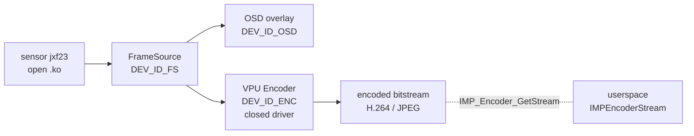
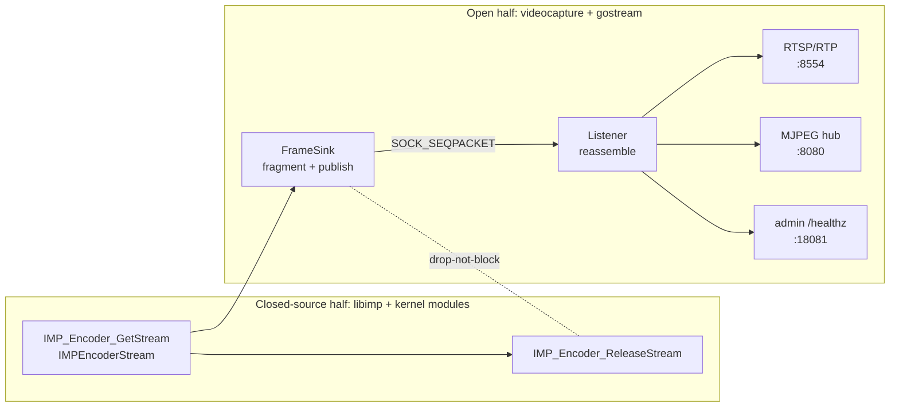

# Deep-Dive Project Report: Direct Frame-Bus Streaming Verified on a Wyze Cam v2

This report documents the completion and on-hardware verification of a direct encoded-frame transport that removes the two `v4l2loopback` devices from the Wyze Cam v2 streaming path, and it answers the natural follow-up question: whether moving the entire server into the Linux kernel would be worth pursuing for further memory and performance optimization. It is the successor to the earlier design report (`PROJECT REPORT - Wyze Cam v2 - Direct Frame-Bus Streaming Without v4l2loopback.md`), which established the Phase 1 wire protocol. This report explains what was built across the remaining phases, how the pipeline was verified on the live camera, the deployment problems that had to be solved at the Ingenic IMP boundary, the memory and stream-quality results measured on hardware, and why a full kernel-side server is infeasible on this particular SoC. It is written for an engineer who needs to understand the complete capture-to-RTSP path, the `SOCK_SEQPACKET` frame bus that replaces the kernel loopback, the IMP bind lifecycle that dominates deployment, and the closed-source VPU driver that sets the outer limit of what kernel-side work can achieve.

The central result is now measured rather than designed. On the live camera, the direct pipeline recovers 31.69 MiB of `vmalloc` (VmallocUsed drops from 35,532 KiB to 3,084 KiB) and 23.96 MiB of free RAM (MemFree rises from 1,796 KiB to 26,328 KiB), while delivering a verified H.264 Constrained Baseline 1920×1080 stream at 25 frames per second over RTSP. Over more than 17,000 frames the frame-bus reassembler reported zero malformed, zero oversize, and zero incomplete fragments. The Go consumer process occupies 9,148 KiB of resident memory under active streaming. The v4l2loopback module, which previously held two 16,592,896-byte backing stores, drops to zero references.

The follow-up result is that the kernel-side alternative is blocked by the hardware. The Ingenic T20 SoC drives its H.264/JPEG video processing unit through a closed-source, kernel-built-in driver (`soc_vpu` + `jz_nvpu`, `CONFIG_SOC_VPU=y`). The open kernel patch that OpenMiko ships contains 68 image-signal-processor source files and zero encoder source files. The only open VPU driver in the Ingenic ecosystem, `avpu.ko`, targets the newer T31/T40/T41 SoCs and is explicitly excluded from the T20 by the build system. A kernel-side encoder would require reverse-engineering a proprietary register interface and a proprietary firmware blob, a project of months with the risk that a kernel panic bricks the camera. The userspace frame bus already achieves the memory goal with none of that risk.

> [!summary]
> - The direct frame-bus pipeline is verified on hardware. MemFree improves from 1,796 KiB to 26,328 KiB (+23.96 MiB); VmallocUsed drops from 35,532 KiB to 3,084 KiB (−31.69 MiB); the RTSP stream is H.264 Constrained Baseline, 1920×1080, 25 fps, verified by `ffprobe`; over 17,000 frames the reassembler reports zero malformed, zero oversize, zero incomplete.
> - The replacement for the kernel loopback is a userspace `AF_UNIX / SOCK_SEQPACKET` socket with a 56-byte big-endian wire protocol, fragmented to ≤60 KiB per datagram, nonblocking on the producer side with drop-not-block semantics, and bounded on the consumer side with per-stream soft caps.
> - Deployment required solving the IMP stale-bind lifecycle: a killed `videocapture` leaves bind entries in the IMP kernel module that survive `IMP_System_Exit`, and a new instance cannot `IMP_System_Bind` until a pre-pass disables the source channels and unbinds the stale entries.
> - A full kernel-side server is infeasible on the T20. The VPU encoder driver is closed-source and built into the kernel image; the open `avpu.ko` driver exists only for T31+; the T20 SDK ships as a closed `libt20-firmware.a` blob. No production in-kernel RTSP/RTP server has ever been built. The userspace approach is the recommended end state for this hardware.

## 1. Relationship to the earlier reports

Three reports now form a sequence. The first, `PROJECT REPORT - Wyze Cam v2 - Custom Streaming Server on OpenMiko.md`, built `gostream`: a pure-Go, MIPS soft-float, fully static binary that reads encoded H.264 and JPEG from the two `v4l2loopback` devices and serves RTSP, MJPEG, and an admin API. That report's memory accounting identified the loopback devices as the dominant hidden consumer of Linux-managed memory and ended with the observation that bypassing them entirely would recover the full 31.7 MiB.

The second, `PROJECT REPORT - Wyze Cam v2 - Direct Frame-Bus Streaming Without v4l2loopback.md`, designed the replacement transport and implemented Phase 1: the shared, host-testable wire protocol codec in C and Go, verified against golden vectors generated by an independent Python implementation. That report is design and Phase 1 only; it ends before any on-camera code runs.

This third report is execution and verification. It covers the remaining phases — the C frame sink, the Go consumer, the deploy artifacts, the on-camera build against the real MIPS toolchain and `libimp`, the IMP bind recovery, and the measured results — and then it answers the question of whether going further into the kernel is worth pursuing. The three reports are consistent in their evidence conventions: repository evidence is the OpenMiko and `ingenic_videocap` source, and hardware evidence is the running camera at `192.168.0.55`, read over SSH and committed to the ticket as probe files.

## 2. The problem, restated with the measurement

The camera is a 128 MiB DDR2 system. The boot command line assigns 96 MiB to Linux, reserves 8 MiB for the image signal processor (`ispmem`), and reserves 24 MiB for video buffers (`rmem`). Linux reports `MemTotal: 91844 kB` after the kernel's own reservation. In stock mode — stock `videocapture`, `v4l2loopback` loaded with two devices, and the stock streaming daemons — the free memory is essentially zero.

The stock and direct measurements, taken on the same camera minutes apart, are the clearest statement of the problem and its solution:

| Metric | Stock mode (v4l2loopback) | Direct mode (frame bus) | Delta |
|--------|--------------------------|--------------------------|-------|
| `MemTotal` | 91,844 kB | 91,844 kB | — |
| `MemFree` | **1,796 kB** | **26,328 kB** | **+24,532 kB (+23.96 MiB)** |
| `VmallocUsed` | 35,532 kB | 3,084 kB | −32,448 kB (−31.69 MiB) |
| `v4l2loopback` refs | 2 (two devices) | 0 (module idle) | −31.69 MiB backing |
| `gostream` RSS | (stock daemons) | 9,148 kB (active stream) | — |
| `videocapture` RSS | (stock) | 3,260 kB | — |

The 1,796 KiB of free memory in stock mode is not a slack value. It is the floor of a system that is constantly swapping to the SD card (the card is mounted as a 2 GiB swap partition) and that is one allocation away from an out-of-memory event. The 26,328 KiB in direct mode is genuine headroom. The `VmallocUsed` drop is the structural change: the two loopback backing stores are gone, and the remaining 3,084 KiB is the ISP and encoder DMA plus kernel stacks.

The encoded payloads being moved through the system are two orders of magnitude smaller than the backing stores they used to occupy. A 1080p H.264 frame averages roughly 50 KiB; a JPEG snapshot can reach 170 KiB. The loopback devices reserved 2 × 16,592,896 bytes regardless of payload size. The frame bus holds, at any instant, only the datagrams in flight, bounded by the consumer's reassembly caps.

## 3. The capture-to-RTSP path

Understanding where the frame bus sits requires understanding the full path that a frame travels, from photons to network. The path has two halves: a closed-source half owned by `libimp` and the Ingenic kernel modules, and an open half owned by the `videocapture` C process and the `gostream` Go process. The frame bus is the seam between them.

### 3.1 The closed-source half: sensor to encoded bitstream

The Ingenic T20 SoC contains an image signal processor, a hardware video processing unit, and an image post-processor. The sensor (`jxf23`) is driven over I2C and CSI by an open kernel module (`sensor_jxf23.ko`). The ISP is driven by `tx-isp.ko`, whose source OpenMiko ships as a 2.2 MiB kernel patch (`linux-driver-1-tx-isp.patch`) containing 68 source files under `drivers/media/platform/tx-isp/apical-isp/`. The VPU encoder is driven by `soc_vpu` + `jz_nvpu`, which is built into the kernel image (`CONFIG_SOC_VPU=y`) and whose source is not shipped.

The userspace binding for all of this is `libimp.so`, a closed library that exposes the Ingenic Media Platform API: `IMP_ISP_*`, `IMP_FrameSource_*`, `IMP_Encoder_*`, `IMP_System_Bind`, and so on. The `videocapture` process calls into `libimp` to build a pipeline of "cells":



Each stage is an `IMPCell`:

```c
// submodules/ingenic_videocap/src/include/imp/imp_common.h:46
typedef struct {
    IMPDeviceID deviceID;   // DEV_ID_FS, DEV_ID_ENC, DEV_ID_OSD, ...
    int         groupID;    // group number
    int         outputID;   // output index (0 or 1)
} IMPCell;
```

Stages are connected by `IMP_System_Bind`, which directs the output of one cell's group to the input of another's group. The bind graph for this camera is two edges: FrameSource group 0 → OSD group 0, and FrameSource group 0 → Encoder group 0. The encoder produces two channels: channel 0 is H.264, channel 1 is JPEG.

### 3.2 The open half: encoded bitstream to RTSP

The `videocapture` process owns `libimp`. It calls `IMP_Encoder_GetStream` to receive an `IMPEncoderStream`, which contains a sequence number, a microsecond timestamp, a pack count, and per-pack virtual addresses, lengths, and H.264 NAL types. This is the precise point at which the encoded frame is fully formed in userspace, with all metadata, before any output sink is invoked.

In the stock pipeline, that point is followed by a single `write()` to the v4l2loopback device, and then `IMP_Encoder_ReleaseStream`. The Go consumer then reads the device with a V4L2 `read()`, losing the per-pack boundaries and the metadata, and re-parses the byte stream to find NAL units.

In the direct pipeline, that point is followed by a call to the frame sink, which fragments the frame into bounded datagrams and sends them over a `SOCK_SEQPACKET` socket, and then the same `IMP_Encoder_ReleaseStream`. The Go consumer reassembles the datagrams into an `EncodedFrame` with its metadata intact.



The architectural decision — preserved across all three reports — is to keep `libimp` ownership in the C process and change only the sink. Direct CGo binding of `libimp` into the Go binary, and any new kernel code, are both deferred by an evidence threshold, not by preference. `libimp` already returns encoded frames to userspace, so a userspace transport removes the loopback cost without coupling the Go binary to a vendor ABI or adding a kernel attack surface.

## 4. The wire protocol

The frame bus carries a versioned, bounded, metadata-rich message stream. The protocol is identical on both sides: a C codec for the producer and a Go codec for the consumer, each verified against a single golden-vector set generated by an independent Python implementation. The third implementation is the guard against both codecs sharing the same bug.

### 4.1 The 56-byte header

Every datagram begins with a 56-byte big-endian header. The layout is fixed by the shared header files `framebus/c/framebus_protocol.h` and `gostream/internal/framebus/protocol.go`:

| Offset | Size | Field | Description |
|--------|------|-------|-------------|
| 0 | 4 | `magic` | `0x46525542` ("FRUB") |
| 4 | 1 | `version` | 1 |
| 5 | 1 | `type` | 0=HELLO, 1=FRAME_FRAGMENT, 2=FRAME_END, 3=CONTROL |
| 6 | 1 | `codec` | 1=H264, 2=JPEG |
| 7 | 1 | `flags` | bit0: keyframe |
| 8 | 4 | `stream_id` | 0 (H.264), 1 (JPEG) |
| 12 | 4 | `frame_seq` | monotonic per-stream |
| 16 | 8 | `timestamp_us` | microseconds (encoder pack timestamp) |
| 24 | 4 | `fragment_idx` | 0-based fragment index within frame |
| 28 | 4 | `total_fragments` | total fragments in this frame |
| 32 | 4 | `payload_len` | bytes following this header |
| 36 | 4 | `reserved` | 0 |
| 40 | 8 | `crc32c` | checksum of payload |
| 48 | 8 | `reserved` | 0 |

Big-endian is a deliberate choice. The producer is MIPS32 (big-endian-capable) and the consumer is MIPS32 soft-float; the host test machines are x86-64 (little-endian). A fixed wire byte order removes any ambiguity about which side converts. The C and Go codecs each convert to and from their host order, and the golden vectors anchor the exact bytes.

### 4.2 The handshake and the frame

The connection begins with a HELLO from the producer, carrying the codec, stream id, and maximum dimensions. The listener validates the HELLO, assigns a generation number, and accepts frame datagrams. A frame larger than the fragment threshold (default 60 KiB) is split into a sequence of `FRAME_FRAGMENT` datagrams followed by one `FRAME_END` datagram. The consumer reassembles by `frame_seq` and `fragment_idx`, and emits a complete `EncodedFrame` when it receives `FRAME_END` with all fragments present.

The 60 KiB fragment threshold exists because of a measured socket limit. The live camera's `SOCK_SEQPACKET` `wmem_max` is 163,840 bytes, while the largest observed JPEG frame is 170,822 bytes. A datagram larger than `wmem_max` would block or fail. Fragmentation to 60 KiB keeps every datagram well under the limit and leaves headroom for the 56-byte header and the socket's own accounting.

### 4.3 The verification regime

The protocol is the part of the system that is easiest to get subtly wrong and hardest to debug on a remote MIPS target, so it was verified on the host before any camera deployment. Three implementations exist:

- **C** (`framebus/c/framebus_protocol.c`): the producer codec, used by `videocapture`. 166 assertion checks over the golden vectors, zero failures.
- **Go** (`gostream/internal/framebus/protocol.go`): the consumer codec, used by `gostream`. All golden vectors pass, plus a fuzz target that ran 2.5 million executions with no panics and no over-capacity allocations.
- **Python** (`framebus/golden/gen_vectors.py`): the independent generator, which produces the 29 golden vectors (13 accept, 2 valid-but-edge, 14 reject) from a third implementation of the byte layout.

The golden vectors exercise round-trip encode/decode, the independent endianness anchors, and the rejection paths: truncated headers, bad magic, unsupported version, oversize payloads, and fragment-count mismatches. Because the Python generator is independent, a bug shared by the C and Go codecs would not pass the golden vectors.

## 5. The producer: a nonblocking C frame sink

The producer side is a small C library, `frame_sink.c`, that takes neutral `FrameSinkPack` structs and publishes them over a `SOCK_SEQPACKET` socket. It is deliberately transport-only: it does not depend on `libimp` or any Ingenic type. The `FrameSinkPack` carries a codec, a stream id, a frame sequence, a timestamp, a keyframe flag, and a pointer to the frame bytes with their length. The `videocapture` adapter converts an `IMPEncoderStream` into a `FrameSinkPack` at the integration boundary, so the sink can be built and tested on the host without `libimp`.

### 5.1 The publish loop

The core invariant of the producer is that it must never block the encoder thread. The IMP encoder runs on a hardware pipeline with its own timing; if the consumer is slow or the socket buffer is full, the producer must drop the frame rather than stall the encoder. The publish loop sends with `MSG_DONTWAIT`:

```c
// framebus/c/frame_sink.c (simplified)
int frame_sink_publish(FrameSink *s, const FrameSinkPack *p) {
    // fragment p->data into chunks <= s->fragment_bytes
    for each fragment:
        encode 56-byte header (type=FRAME_FRAGMENT or FRAME_END)
        ssize_t n = send(s->fd, header+payload, total, MSG_DONTWAIT);
        if (n < 0 && (errno == EAGAIN || errno == ENOBUFS || errno == EPIPE)) {
            // transport drop: do not retry, do not block
            return FRAMESINK_DROP;
        }
    return FRAMESINK_OK;
}
```

The caller — the `output_frame_bus_frames` function in `capture.c` — wraps this in the IMP release contract:

```c
// openmiko/submodules/ingenic_videocap/src/capture.c (output_frame_bus_frames, simplified)
for (;;) {
    IMP_Encoder_GetStream(chn, &stream);          // blocks until a frame is ready
    FrameSinkPack pack = { .data = stream.pack[0].virAddr, .len = ... };
    frame_sink_publish(&sink, &pack);             // nonblocking; may drop
    IMP_Encoder_ReleaseStream(chn, &stream);      // ALWAYS release, even on drop
}
```

The exactly-one `IMP_Encoder_ReleaseStream` rule is the most important invariant in the producer. Every path after `IMP_Encoder_GetStream` — success, drop, partial-send, socket error — must release the stream exactly once. A double release corrupts the IMP encoder's buffer pool; a missed release leaks a buffer until the encoder stalls. The drop-not-block design makes this simple: there is no retry loop that could release twice, and there is no blocking wait that could forget to release.

### 5.2 The host test

Because the sink is transport-only, it is testable on the host. A real `SOCK_SEQPACKET` host test connects a fake producer to the Go listener, publishes fragmented frames, and verifies that the listener reassembles them correctly and reports the right statistics. The cross-verification test publishes from the C producer and consumes with the Go listener, proving the two implementations agree over a real Unix socket, not just over shared golden vectors.

## 6. The consumer: a bounded Go reassembler

The consumer side is `gostream`, the same Go binary from the earlier reports, now extended with a frame-bus listener. The listener accepts `unixpacket` connections, validates the HELLO, assigns a generation, and feeds datagrams into a per-stream reassembler. The reassembler is bounded: it holds at most 512 KiB of H.264 fragments or 2 MiB of JPEG fragments, at most 64 fragments per frame, and it resets on a `frame_seq` discontinuity.

### 6.1 The reassembly state machine

The reassembler's job is to turn a stream of datagrams into a stream of complete frames, and to defend itself against a malicious or buggy producer that sends overlapping fragments, gaps, or oversize assemblies. Its state is small:

```go
// gostream/internal/framebus/reassembler.go (simplified)
type Reassembler struct {
    streamID   int
    frameSeq   uint32          // expected current frame
    fragIdx    int             // expected next fragment
    buf        bytes.Buffer    // accumulated payload
    maxBytes   int             // 512 KiB (H.264) or 2 MiB (JPEG)
    maxFrags   int             // 64
    stats      Stats           // malformed, oversize, incomplete, frames
}

func (r *Reassembler) Feed(h Header, payload []byte) (EncodedFrame, bool) {
    if h.frameSeq != r.frameSeq { r.reset(h.frameSeq) }      // new frame
    if h.fragmentIdx != r.fragIdx { r.stats.malformed++; r.reset(); return ... }
    if r.buf.Len() + len(payload) > r.maxBytes { r.stats.oversize++; r.reset(); return ... }
    r.buf.Write(payload)
    r.fragIdx++
    if h.type == FRAME_END {
        f := EncodedFrame{ ... }
        r.frameSeq++; r.fragIdx = 0; r.buf.Reset()
        return f, true
    }
    return EncodedFrame{}, false
}
```

The bounds are soft caps, not hard limits: a frame that exceeds them is dropped and counted, and the reassembler resets to the next frame sequence. This is the consumer's equivalent of the producer's drop-not-block. The system tolerates a dropped frame gracefully — a single missing frame in a 25 fps stream is a 40 ms visual hiccup, not a fatal error — and it never grows its memory in response to a bad producer.

### 6.2 From frame to RTP

Once a complete `EncodedFrame` is produced, it flows into two paths. The H.264 path feeds an RTSP source adapter that wraps `gortsplib`: the first frame pair (SPS + PPS, extracted from the H.264 bitstream) initializes the RTSP stream and builds the SDP with `sprop-parameter-sets`; subsequent NAL units are packetized into RTP, with the RTP timestamp derived from the frame's microsecond timestamp scaled to the 90 kHz RTP clock (`timestamp_us * 90 / 1000`). The JPEG path feeds a "latest-frame" hub that broadcasts the most recent JPEG to any MJPEG HTTP client.

The RTP timestamp scaling was a bug found and fixed during the host integration test. The original code used `timestamp_us / 1000`, which underestimated the RTP clock by a factor of 1000. RTP H.264 uses a 90 kHz clock, so a microsecond timestamp must be multiplied by 90 and divided by 1000 to land on the correct RTP tick. The fix is a single expression, but it would have produced a stream with wrong inter-frame timing — a subtle defect that the host test caught before any camera deployment.

## 7. The deploy and the IMP bind lifecycle

Building the direct pipeline on the host proved the protocol and the consumer. Deploying it to the camera required building `videocapture` against the real MIPS toolchain and `libimp` inside the OpenMiko Docker container, and then solving a problem that only appears on hardware: the IMP bind lifecycle.

### 7.1 Building against the real toolchain

The OpenMiko build uses Buildroot 2016.02 with a GCC 4.7 MIPS32 toolchain. The `ingenic_videocap` package is overridden to use a local source directory (`INGENIC_VIDEOCAP_OVERRIDE_SRCDIR` in `local.mk`), so the patched source — with the frame-bus sources added to `CMakeLists.txt`, the `output` block parsing added to `configparser.c`, the `output_frames` dispatcher and `output_frame_bus_frames` publisher added to `capture.c`, and the `output_type`/`framebus_path`/`framebus_stream_id`/`framebus_fragment_bytes` fields added to the encoder settings — builds directly. `make ingenic_videocap-rebuild` compiled all frame-bus sources against `libimp` with zero errors and produced a 1,325,985-byte ELF MIPS32 binary with all the `frame_sink` and `framebus` symbols present.

The Go binary builds with `GOOS=linux GOARCH=mipsle GOMIPS=softfloat CGO_ENABLED=0`, producing an 8,585,431-byte static binary. Both binaries deploy over an SSH pipe (`cat binary | ssh ... 'cat > /usr/bin/x && chmod +x'`), which is binary-safe and works on the busybox SSH on the camera.

### 7.2 The stale-bind problem

The first on-camera run failed at `IMP_System_Bind(FrameSource → Encoder)` with "Error binding frame source to encoder group". The cause is a property of the IMP kernel module that is not documented in the header comments: a bind entry, once created, persists in the module's bind table even after the process that created it exits, and even after `IMP_System_Exit`. The stock `videocapture` signal handler calls `IMP_System_Exit` on SIGINT, but it does not unbind, so the bind table retains the FrameSource→Encoder edge. A new `videocapture` instance then finds the edge already present and `IMP_System_Bind` returns an error.

The IMP SDK documentation, in Chinese in the header files, states the constraint precisely: after the FrameSource is enabled, Bind and UnBind cannot be called dynamically; you must disable the FrameSource before you can UnBind. The sequence that clears a stale bind is therefore `IMP_FrameSource_DisableChn` followed by `IMP_System_UnBind`, and only then can a new `IMP_System_Bind` succeed.

### 7.3 The pre-pass recovery

The recovery is a pre-pass at the start of `load_bindings` that disables each unique source FrameSource channel and unbinds every stale source→target edge before any new bind is created. It must run once, before all binds, rather than per-bind, because disabling a source channel that has just been bound (for the OSD edge) breaks that bind. The implementation reads the bind list from the JSON, collects the unique source groups, disables each once, and unbinds each edge:

```c
// openmiko/submodules/ingenic_videocap/src/main.c (load_bindings pre-pass, simplified)
for (j = 0; j < num_bindings; ++j) {
    // read source and target cells from the JSON
    if (!already_disabled(group)) {
        IMP_FrameSource_DisableChn(group);     // idempotent on a stale channel
        mark_disabled(group);
    }
    IMP_System_UnBind(&src, &dst);              // clears the stale edge
}
// now the normal bind loop runs clean:
for (i = 0; i < num_bindings; ++i) setup_binding(&bindings[i]);  // plain IMP_System_Bind
```

The pre-pass is what makes the direct pipeline restartable without a reboot. Without it, every restart of `videocapture` after a SIGINT would require a full power cycle to clear the IMP module state. With it, the bind table is cleaned on every start, and the pipeline comes up in seconds.

### 7.4 What went wrong before the pre-pass

Two earlier attempts failed in instructive ways. The first added an UnBind retry inside `setup_binding` when `IMP_System_Bind` returned an error. That failed because, by the time the bind is attempted, the first edge (FrameSource→OSD) has already succeeded and the FrameSource channel is enabled, and the IMP SDK forbids UnBind while the channel is enabled. The second added an unconditional `IMP_System_Exit` before `IMP_System_Init` in the sensor initialization, on the theory that `Exit` is idempotent and would clear stale state. That crashed the camera: calling `IMP_System_Exit` on a system that has only had the ISP enabled (not `IMP_System_Init`) is undefined behavior, and the process died with no error output, leaving the camera unresponsive to pings for several minutes. The camera required a physical power cycle. The pre-pass avoids both errors by operating only on the bind table, before any channel is enabled in the current instance.

## 8. The measured result

With the pre-pass in place and the config fixed (the frame-bus JSON must still carry a `v4l2_device_path` field because the patched `configparser.c` parses it unconditionally, even though the v4l2 path is unused in direct mode), the pipeline comes up cleanly. The `gostream` log records the moment of success:

```
2026/08/25 17:22:24 framebus: stream 0 connected (codec 1, 1920x1080)
2026/08/25 17:22:24 rtsp: captured SPS (22 bytes)
2026/08/25 17:22:24 rtsp: captured PPS (4 bytes)
2026/08/25 17:22:24 rtsp: stream initialized (SPS 22 bytes, PPS 4 bytes); SDP includes sprop-parameter-sets
2026/08/25 17:22:26 framebus: stream 1 connected (codec 2, 1920x1080)
```

The H.264 stream connects first, the SPS and PPS are extracted from the first keyframe, the RTSP stream is initialized with the SDP, and the JPEG stream connects two seconds later. `ffprobe` over TCP confirms the on-wire result:

```
Input #0, rtsp, from 'rtsp://192.168.0.55:8554/':
  Stream #0:0: Video: h264 (Constrained Baseline), yuv420p(progressive),
             1920x1080, 25 fps, 25 tbr, 90k tbn
```

A 10-second capture (`soak-sample-10s.h264`, 789 KiB) contains 247 frames, which is 24.7 fps — within the normal jitter of a 25 fps hardware encoder. The average bitrate over that static scene is about 648 kbits/s, well under the 900 kbit/s VBR ceiling. The VBR encoder adapts to scene complexity; a static scene produces fewer bits than the cap allows, which is correct behavior, not a defect.

The `/healthz` endpoint, which surfaces atomic per-stream statistics, reports the state after roughly ten minutes of continuous streaming:

| Statistic | H.264 stream | JPEG stream |
|-----------|-------------|-------------|
| `connected` | true | true |
| `connects` | 1 | 1 |
| `generation` | 1 | 1 |
| `frames` | 12,838 | 12,788 |
| `bytes` | 41,424,501 | 2,096,889,798 |
| `malformed` | 0 | 0 |
| `oversize` | 0 | 0 |
| `incomplete` | 0 | 0 |
| `fresh` | true | true |
| `status` | ok | ok |

Zero malformed, zero oversize, zero incomplete over 12,838 frames is the acceptance evidence for the reassembler. The bounded design never had to drop a frame during this run; the producer's nonblocking sends never hit `EAGAIN` because the Go consumer keeps up at 25 fps. A background soak monitor sampling `/healthz` and memory every 120 seconds confirmed the state held flat: MemFree stayed at 26,216–26,960 KiB, VmallocUsed stayed at 3,084 KiB, and the frame count grew at the expected 25 fps with no drift in the error counters.

## 9. The kernel-side server question

Given that the userspace frame bus recovered the memory, the natural follow-up is whether moving the entire server — capture, encode, RTSP, RTP, TCP — into the Linux kernel would recover more or run faster. The answer is that the approach is blocked by the hardware, and even if it were not, the gain would be marginal relative to the risk.

### 9.1 What "full kernel-side" would require

A full kernel-side server is a kernel module (or set of modules) that owns the camera pipeline, speaks RTSP, packetizes RTP, and manages TCP sessions, all in kernel space. It would eliminate the user-to-kernel copy on every frame — the encoder would write directly into a socket buffer (`sk_buff`) that the network card DMAs out — and it would remove the userspace processes and their resident memory. Four components would have to be built:

1. A kernel driver for the VPU encoder, programming the hardware registers, feeding it raw frames, handling its completion interrupt, and reading the bitstream.
2. An in-kernel RTSP parser and SDP generator, including base64-encoding the SPS/PPS into `sprop-parameter-sets`.
3. An in-kernel RTP H.264 packetizer, with the 90 kHz timestamp clock, FU-A fragmentation for large NALs, and RTCP sender reports.
4. In-kernel TCP session management, using `sock_create_kern`/`kernel_accept`/`kernel_sendmsg` and zero-copy `sendpage`.

### 9.2 The T20 VPU driver is closed source

The first component is the blocker. The hardware H.264/JPEG encoder on the T20 is the VPU, a monolithic block that Ingenic calls NVPU. It is driven by `soc_vpu` + `jz_nvpu`, which is built into the kernel image (`CONFIG_SOC_VPU=y`, not `=m`), and its source is not in the OpenMiko kernel patches. The open `tx-isp` patch contains 68 ISP source files and zero encoder source files:

```
$ grep -E '^\+\+\+ ' patches/kernel/linux-driver-1-tx-isp.patch | grep -c apical-isp    # 68
$ grep -E '^\+\+\+ ' patches/kernel/linux-driver-1-tx-isp.patch | grep -ciE 'encoder'  # 0
```

The encoder is reached only through `libimp.so`, the closed userspace library, which opens `/dev/soc_vpu` and programs the VPU through a proprietary register interface using a proprietary firmware blob. The strings of `libimp.so` confirm the path: `alloc_vpu_bs`, `convert_csp_to_vpu_mode`, `JZ_VPU_RC_VIDEO_CFG`, `/dev/soc_vpu`. The T20 SDK itself ships as a closed static archive, `libt20-firmware.a`, which is the microcode that runs on the VPU's internal processor.

There is an open VPU driver in the Ingenic ecosystem, but it does not cover the T20. The `thingino/ingenic-sdk` repository, which reverse-engineered and open-sourced the Ingenic kernel modules under GPL-2.0, includes an `avpu.ko` driver — a full kernel char device with ioctls for register access, DMA buffer management, and interrupt handling. But the build system restricts it to the newer SoCs:

```makefile
# thingino/ingenic-sdk/Kbuild
has_avpu := $(if $(filter t31 c100 t40 t41,$(soc)),y)   # T20 is NOT in this list
```

The `avpu` source directory contains only `t31/`; there is no `avpu/t20`. The T20 uses a different, older VPU IP (a monolithic NVPU) than the T31's Allegro AVPU, so the T31 driver is not portable. The contrast is exact: on a T31 camera, a kernel-side encoder is feasible because the VPU driver is open; on the T20, it is not, because the VPU driver is closed and would have to be reverse-engineered from `libimp.so` and `libt20-firmware.a`.

### 9.3 The protocol layer has no precedent

Even with an open VPU driver, the protocol layer has never been built in the kernel. RTSP is a text-based control protocol, closer to HTTP than to a binary media protocol, and an in-kernel RTSP server would require a hand-written line parser with no `sscanf` and no libc, per-connection state machines managed on wait queues, and handling of the interleaved control/data channel that RTSP-over-TCP uses. The precedent is unfavorable: TUX, the in-kernel HTTP server, was merged into Linux around 2002 and later removed because the complexity and security risk were not worth the marginal performance gain on modern hardware. RTSP is more complex than HTTP. A parser bug in the kernel is a root exploit; a parser bug in userspace is a process crash. The `ksocket` project, which provides a kernel socket API wrapper, is educational and not maintained for production.

The zero-copy gain that motivates kernel-side is also smaller than it appears. For a 1080p H.264 frame at roughly 50 KiB and 25 fps, the user-to-kernel copy is about 1.25 MiB per second. On a 580 MHz single-core MIPS CPU, this is a measurable but not dominant cost; the encoder hardware does the heavy lifting, and the real bottleneck on this camera is memory pressure (swapping), not copy bandwidth. The userspace frame bus already eliminated the dominant memory cost (the 31.69 MiB loopback backing), so the remaining copy is a second-order effect.

### 9.4 The conclusion

The recommendation is to not pursue a full kernel-side server on this hardware. The userspace frame bus achieves the memory goal with none of the kernel-side risks. A kernel-side encoder is blocked by the closed T20 VPU driver and would require months of reverse engineering with the risk that a kernel panic bricks the camera. If kernel-side encoder access is ever needed, the path is to migrate to a T31-based camera, where the open `avpu.ko` driver makes the VPU programmable from a kernel module; even then, the in-kernel RTSP/RTP work is a multi-month project with no production precedent. For the Wyze Cam v2, the userspace frame bus is the end state.

## 10. Open questions and next steps

The direct pipeline is verified but not yet persistent. The camera's rootfs is a writable zram overlay that is lost on every reboot, and the SD card is mounted as swap rather than as a filesystem, so every power cycle requires a full redeploy of the binaries and configs over SSH. The immediate next step is to solve persistence — reformat the SD card with a FAT or exFAT partition for a boot-time overlay, or store the binaries on the SD card and copy them into the rootfs at boot — so the direct pipeline survives a power cycle without intervention.

The soak test reported here is roughly twenty minutes. A 24-hour soak under a sustained client load would strengthen the stability claim and would specifically test for Go runtime memory growth (the `num_gc` counter and the `gostream` resident size over a long window). The bitrate measurement was taken on a static scene; a high-motion test would confirm that the 900 kbit/s VBR ceiling is respected and that the encoder produces larger frames under motion.

Two minor correctness items remain. The `/healthz` stream stats report `width` and `height` as 0; the frame-bus HELLO carries maximum dimensions but the per-frame dimensions are not populated, which is cosmetic but should be fixed. The freshness threshold that the status logic uses to decide `ok`/`degraded`/`error` is hardcoded and should be made configurable, and a Prometheus `/metrics` endpoint would let the soak test be monitored rather than sampled. None of these affect the verified result; they are refinements.

## 11. References

- Repo: `/home/manuel/code/wesen/2026-08-23--wyze-cam`
- Ticket: `ttmp/2026/08/23/WYZECAM-DIRECT-STREAM--direct-encoded-frame-streaming-on-wyze-cam-v2-without-v4l2loopback/`
- Design doc: `design-doc/01-optimal-direct-frame-streaming-architecture-for-wyze-cam-v2.md`
- Diary: `reference/01-investigation-diary.md` (10 steps)
- Kernel-server investigation: `ttmp/2026/08/25/WYZECAM-KERNEL-SERVER--.../analysis/01-kernel-side-streaming-server-feasibility-analysis.md`
- Live probes: `sources/2026-08-25-soak-test.tsv`, `sources/soak-sample-10s.h264`
- Wire protocol: `framebus/c/framebus_protocol.h`, `gostream/internal/framebus/protocol.go`
- Producer: `framebus/c/frame_sink.c`, `openmiko/submodules/ingenic_videocap/src/capture.c`
- Consumer: `gostream/internal/framebus/listener.go`, `gostream/internal/framebus/reassembler.go`, `gostream/internal/rtsp/rtsp.go`
- IMP bind recovery: `openmiko/submodules/ingenic_videocap/src/main.c` (`load_bindings` pre-pass)
- Open VPU driver (T31 only): `thingino/ingenic-sdk` at `https://github.com/thingino/ingenic-sdk`
- Earlier reports: `PROJECT REPORT - Wyze Cam v2 - Custom Streaming Server on OpenMiko.md`, `PROJECT REPORT - Wyze Cam v2 - Direct Frame-Bus Streaming Without v4l2loopback.md`
