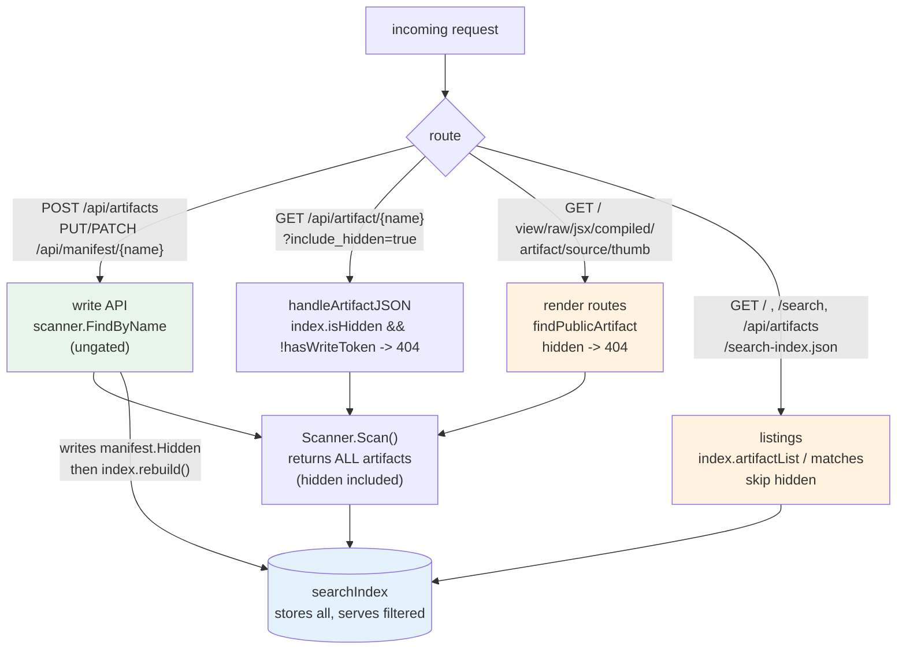

# serve-artifacts — Hiding Artifacts from the Public Site

`serve-artifacts` is a standalone Go server that serves Claude.ai artifacts (HTML, JSX, TSX) from a directory on disk, backed by a k3s deployment at `https://artifacts.yolo.scapegoat.dev`. The previous project notes documented the read gallery, the write API and production deployment, the JSON error contract, TSX support, and the live import sync. This note documents a single feature built in one session: a `hidden` flag on the artifact manifest that removes an artifact from the public site — the index, the search results, and every direct render URL — while keeping it fully manageable through the write API so it can be un-hidden. The feature exists to answer a concrete operational question: how does an operator who holds only the write token make one specific public URL stop serving, reversibly, without shell access to the volume and without rebuilding the image for each hide.

The reference repository is `/home/manuel/code/wesen/2026-03-29--serve-claude-experiments`. The work spans three code commits, from `e386e93` (the data model) through `3c4c0e8` (the API, routes, and tests), plus doc commits through `b50f0b7`. The deployed image is `ghcr.io/wesen/2026-03-29--serve-claude-experiments:sha-f516dd5`, rolled out through GitOps PR #320 in `wesen/2026-03-27--hetzner-k3s`.

> [!summary]
> The session delivered one feature with four load-bearing parts:
> 1. a **`hidden` boolean on the manifest** (`pkg/artifacts/manifest.go`), default false so every existing manifest stays visible with no migration, accepted by the strict loader because it is now a known field;
> 2. **index filtering**: the in-memory index keeps all entries but `artifactList` and `matches` exclude hidden ones, with a new `isHidden` lookup and an operator-only `IncludeHidden` query flag;
> 3. **route gating**: the public render routes resolve through a new `findPublicArtifact` helper that returns a sentinel `ErrArtifactHidden` (mapped to 404), while the write API keeps using `scanner.FindByName` directly so hidden artifacts remain manageable; and
> 4. a **token-gated operator exception** built on a new `hasWriteToken` check — distinct from the existing `authorize` access check — so the operator can still list and inspect hidden artifacts while anonymous readers (and open-writes dev mode) see nothing.

## Why this project exists

The corpus is served publicly and grows by accretion. Once an artifact is on the volume it is, by default, visible at its stable URL forever. Two operations that an operator reasonably wants were impossible through the API before this change.

The first is removal of a single artifact. The only way to stop a specific URL such as `https://artifacts.yolo.scapegoat.dev/artifact/<uuid>/artifacts/foo-schedule` from serving was to `kubectl exec` into the pod and delete the file on the corpus PVC. That requires cluster access, mutates the source of truth destructively, and — because the daily backup CronJob snapshots the whole corpus — the artifact would reappear on any restore from a backup taken before the deletion. There was no HTTP route for it: the only `DELETE` routes in the server are for collections, collection items, favorites, and tags.

The second is reversible hiding. The manifest is the only per-artifact metadata the server already loads and writes, but before this change it carried only `title`, `description`, `tags`, `original_date`, `links`, and `imports`. There was no `hidden` or `private` field, and the manifest loader uses `DisallowUnknownFields`, so an attempt to `PATCH /api/manifest/{name}` with `{"hidden":true}` was rejected with HTTP 400. Hiding through the API was not merely unsupported; it was structurally blocked.

The feature this note documents closes both gaps with one mechanism. An operator who holds the write token can hide an artifact with one authenticated `PATCH`, and un-hide it with another. The artifact leaves the public site immediately, stays on the volume and in backups, and is never unrecoverable through the API.

## The problem and the constraints

The requirements, derived from the operational goal, constrain the design tightly.

- **Reversible.** A hidden artifact must be un-hideable through the same API that hid it. This rules out any design where hiding also drops the artifact from the only lookup the write API uses.
- **Token-only.** The only credential the server knows is the shared write token. Hiding must not require cluster access, a new secret, or a new identity system.
- **Public removal, not just de-listing.** The direct render URL must return 404, not merely drop the artifact from the index page. Hiding only from listings would leave the URL serving, which defeats the goal.
- **Operator recoverability.** An operator with the token must still be able to find, inspect, and un-hide a hidden artifact. A hidden artifact that the API cannot see is a hidden artifact that can never come back through the API.
- **No leak to anonymous readers.** Hidden artifacts must not appear in any public listing, search result, facet count, or detail response to a request that does not present a valid token.

The non-goals are equally important. There is no per-user visibility or role-based access control — the server has one shared token and one hardcoded "default" user. There is no hide button in the HTML UI, because the UI holds no token. There is no conversation-level hiding — `hidden` is a per-artifact flag, and conversation-level routes (transcript, source highlight, session zip) are left ungated because they are keyed by the conversation UUID shared by all of its artifacts.

## Architecture of the hide

The mechanism is a split enforced at three layers: the scan returns all artifacts, the index filters hidden ones out of public views, and the public read routes gate on the flag while the write API does not. The split is the load-bearing decision; each layer could have been implemented differently, and the alternatives each fail one of the constraints above.



The green path is the write API; the amber paths are the public read routes and listings; the blue store is the index. The asymmetry — the write API reaches the scanner directly, the public routes reach it through a gate — is what makes hiding reversible. If the scan itself filtered hidden artifacts, the write API could hide but never un-hide, because the `PATCH` handler resolves the artifact with `scanner.FindByName` before writing the manifest.

## The manifest flag and the loader contract

The flag is a single boolean added to the manifest struct in `pkg/artifacts/manifest.go`:

```go
type ArtifactManifest struct {
	Title        string         `json:"title"`
	Description  string         `json:"description"`
	Tags         []string       `json:"tags"`
	OriginalDate string         `json:"original_date"`
	Links        []ArtifactLink `json:"links"`
	Imports      map[string]string `json:"imports"`
	// Hidden removes the artifact from the public site: it is excluded from the
	// index, search, search-index, and every per-request render route (which
	// return 404), while remaining manageable through the write API (manifest
	// PUT/PATCH, push) so it can be un-hidden. Default false keeps every
	// existing manifest visible with no migration.
	Hidden bool `json:"hidden"`
}
```

`applyManifest` copies the flag onto the `Artifact` struct with a single line: `a.Hidden = m.Hidden`. Two properties of this design matter.

The zero value is `false`. Every manifest already on the volume — including every one written by an older binary that predates the field — decodes to a visible artifact. There is no migration, no default-on risk, and no behavior change for any existing artifact until an operator explicitly hides it. The flag is opt-in by construction.

The loader is strict. `loadManifest` calls `dec.DisallowUnknownFields()`, so a manifest is rejected if it contains a key the struct does not know. Before this change, `hidden` was unknown and a `PATCH` carrying it was rejected with HTTP 400. After this change, `hidden` is a known field and the same request is accepted. This is a coordinated change across the wire format and the binary: an old binary cannot read a manifest that a new client has marked `hidden:true`, because the old binary's strict loader rejects the unknown field. The feature therefore requires the new image to be deployed before any client can rely on `hidden` being honored by the live server. The deployment sequence in a later section is what makes that true.

The scanner does not filter on the flag. `Scan()` and `FindByName()` return every artifact, hidden or not. This is deliberate and is the foundation of reversibility: the write API locates an artifact with `FindByName`, so as long as `FindByName` returns hidden artifacts, a hidden artifact can be found and un-hidden through the API.

## The index: store all, serve filtered

The in-memory search index is the cache that the index page, search, the legacy `search-index.json`, and thumbnail backfill all read. It is rebuilt at startup, on `--watch` filesystem events, and after every successful API write. Production runs without `--watch`, so the index is rebuilt only at startup and after a write — a fact that matters for the hide operation's timing, discussed below.

The index keeps all entries, hidden included, in `ix.entries`. Keeping hidden entries rather than dropping them is what lets the hot read paths answer questions about hidden artifacts without a full rescan. `hashByName` still returns the content hash for a hidden artifact, so the thumbnail handlers can manage (rerender, invalidate) a hidden artifact's cached thumbnail even though `handleThumb` 404s before serving it. A new `isHidden` lookup reads the flag for a named entry directly:

```go
func (ix *searchIndex) isHidden(name string) bool {
	ix.mu.RLock()
	defer ix.mu.RUnlock()
	for _, e := range ix.entries {
		if e.art.Name == name {
			return e.art.Hidden
		}
	}
	return false
}
```

The public-facing methods filter. `artifactList`, which backs the index page, `search-index.json`, and the thumbnail backfill walk, skips hidden entries:

```go
func (ix *searchIndex) artifactList() []artifacts.Artifact {
	ix.mu.RLock()
	defer ix.mu.RUnlock()
	out := make([]artifacts.Artifact, 0, len(ix.entries))
	for _, e := range ix.entries {
		if e.art.Hidden {
			continue
		}
		out = append(out, e.art)
	}
	return out
}
```

Search filters through the `matches` predicate. A hidden entry fails `matches` unless the query set `IncludeHidden`. The clause is placed before every other filter, and no facet dimension uses `skip == "hidden"`, so the clause also drops hidden artifacts from every facet count, not only from the result set:

```go
func (e indexEntry) matches(q searchQuery, uv userView, skip string) bool {
	a := e.art
	if a.Hidden && !q.IncludeHidden {
		return false
	}
	if skip != "type" && q.Type != "" && a.Type != q.Type {
		return false
	}
	// ... remaining filters ...
}
```

The `searchQuery` struct gains `IncludeHidden bool`. The handler honors it only for a caller that has passed the write-token check, so an anonymous reader's `?include_hidden=true` is silently ignored. The gating is covered in the next section.

The choice to store all and serve filtered, rather than drop hidden entries from the index entirely, is a decision record. Dropping them would force `handleThumb` to rescan the directory on every request to detect a hidden artifact, because a dropped entry is indistinguishable from a missing one. Keeping them makes `isHidden` an index lookup, and the cost is one `if e.art.Hidden { continue }` in the two public methods. The filtering discipline is concentrated in `artifactList` and `matches`; everything else reads the full index.

## The read routes: findPublicArtifact

The public render routes resolve an artifact through a new helper in `pkg/server/artifactapi.go` rather than through `scanner.FindByName`:

```go
var ErrArtifactHidden = errors.New("artifact is hidden")

func (s *Server) findPublicArtifact(name string) (*artifacts.Artifact, error) {
	art, err := s.scanner.FindByName(name)
	if err != nil {
		return nil, err
	}
	if art.Hidden {
		return nil, ErrArtifactHidden
	}
	return art, nil
}
```

The helper returns one of two non-nil errors for a hidden or missing artifact, and the calling routes map both to 404. The routes switched from `scanner.FindByName` to `findPublicArtifact` are the per-request render routes that serve artifact content to a browser:

| Route | Handler | Behavior for a hidden artifact |
|-------|---------|---------------------------------|
| `GET /view/{name}` | `handleView` | 404 (HTML or JSX host page) |
| `GET /raw/{name}` | `handleRaw` | 404 (raw source) |
| `GET /jsx/{name}` | `handleJSX` | 404 (mounted JSX source) |
| `GET /compiled/{name}` | `handleCompiledJSX` | 404 (precompiled bundle) |
| `GET /artifact/{name}` | `handleArtifactPage` | 404 (detail HTML page) |
| `GET /api/source/{name}` | `handleArtifactSource` | 404 (raw source under `/api`) |

`handleThumb` is the hottest of these and does not scan on its common path, so it gates on the index directly rather than through `findPublicArtifact`. The `isHidden` check is placed before the thumbnails-disabled short-circuit, so a hidden artifact 404s even when thumbnail rendering is off:

```go
func (s *Server) handleThumb(w http.ResponseWriter, r *http.Request) {
	name := r.PathValue("name")
	if s.index.isHidden(name) {
		http.NotFound(w, r)
		return
	}
	if s.thumbs == nil {
		servePlaceholderThumb(w)
		return
	}
	// ... render or serve cached thumbnail ...
}
```

The write routes are deliberately not switched. `handleManifestPut`, `handleManifestPatch`, `handleArtifactPush`, `handleThumbSave`, and `handleThumbRerender` continue to resolve artifacts with `scanner.FindByName` (or `thumbHash`, which falls back to `FindByName`). A hidden artifact remains fully manageable: it can be un-hidden, its manifest edited, its thumbnail rerendered. Gating the write routes on the flag would make a hidden artifact unrecoverable through the API, violating the reversibility constraint.

The conversation-level routes — `handleTranscript`, `handleHighlight`, `handleSession` — are also left ungated, for a different reason. They are keyed by the conversation UUID, which is shared by every artifact in the conversation. A conversation with one hidden and one visible artifact still has an accessible transcript; gating the transcript on one artifact's `hidden` flag would be wrong. Hiding is per-artifact, not per-conversation.

## The operator exception: authorize vs hasWriteToken

The detail route `GET /api/artifact/{name}` and the list flag `?include_hidden=true` need an operator exception: an operator with the token should still be able to inspect and list hidden artifacts, while an anonymous reader should not. The natural implementation is to gate the exception on the existing `authorize` function. That implementation is wrong, and the reason it is wrong is the most important detail in this feature.

`authorize` is an access check, not an identity check. Its contract, from the prior write-API work, is:

```go
func (s *Server) authorize(r *http.Request, act action) error {
	if act != actionWrite {
		return nil
	}
	if s.writeToken == "" {
		return nil // unauthenticated writes (dev/local); startup logged a warning
	}
	presented := bearerToken(r)
	if presented == "" {
		return errors.New("missing write token (Authorization: Bearer <token>)")
	}
	if subtle.ConstantTimeCompare([]byte(presented), []byte(s.writeToken)) != 1 {
		return errors.New("invalid write token")
	}
	return nil
}
```

When no write token is configured — the local development mode, and the default for every test that uses `newTestServer` — `authorize` returns nil for every request. It cannot distinguish the operator from an anonymous reader, because in that mode everyone is authorized to write. Gating the hidden-artifact exception on `authorize(r, actionWrite) == nil` would therefore fire for all readers in open-writes mode, and a hidden artifact would be served on the detail route and listed with `include_hidden=true` to anyone. The feature would leak exactly where the test suite runs.

The first implementation of this feature made that mistake. Three tests failed — `TestHideViaPatchRemovesFromPublicRoutes`, `TestHideViaPushManifest`, and `TestUnhideViaPatchRevealsArtifact` — each asserting `status = 200, want 404` for a hidden artifact on the detail route, because the test server runs with no token and the exception fired for the anonymous test client.

The fix is a distinct check, `hasWriteToken`, which is false in open-writes mode and true only when a token is configured and the presented bearer matches:

```go
func (s *Server) hasWriteToken(r *http.Request) bool {
	if s.writeToken == "" {
		return false
	}
	return s.authorize(r, actionWrite) == nil
}
```

The operator exception is then gated on `hasWriteToken`, not `authorize`. The detail route becomes:

```go
func (s *Server) handleArtifactJSON(w http.ResponseWriter, r *http.Request) {
	name := r.PathValue("name")
	if s.index.isHidden(name) && !s.hasWriteToken(r) {
		writeNotFoundJSON(w, name)
		return
	}
	if !s.writeArtifactView(w, r, name) {
		writeNotFoundJSON(w, name)
	}
}
```

And the list flag becomes:

```go
if (q.Get("include_hidden") == "true" || q.Get("include_hidden") == "1") && s.hasWriteToken(r) {
	query.IncludeHidden = true
}
```

The distinction is precise. `authorize` answers "may this request write." `hasWriteToken` answers "is this request from the operator." In token-configured production they coincide for a presented valid token and both fail for an anonymous reader. In open-writes mode they diverge: `authorize` passes for everyone, `hasWriteToken` fails for everyone. The hidden-artifact exception uses the stricter of the two, so the feature is enforced uniformly in both modes. The safer default — hidden is enforced even in dev — falls out of the choice for free.

One consequence of this design is that the operator exception is unavailable in open-writes mode. A developer running the server locally with no token cannot use `?include_hidden=true` or inspect a hidden artifact through the detail route. That is acceptable: in local development the developer has the filesystem and can inspect the manifest directly, and the alternative — leaking hidden artifacts to every reader when no token is set — is the failure the check exists to prevent.

## Setting and clearing hidden through the API

The `PATCH /api/manifest/{name}` handler already merges a partial manifest onto the artifact's current manifest. The patch struct gains a pointer field so an absent key is distinguishable from an explicit false:

```go
type manifestPatch struct {
	Title        *string                   `json:"title"`
	Description  *string                   `json:"description"`
	Tags         *[]string                 `json:"tags"`
	OriginalDate *string                   `json:"original_date"`
	Links        *[]artifacts.ArtifactLink `json:"links"`
	Imports      *map[string]string        `json:"imports"`
	Hidden       *bool                     `json:"hidden"`
}
```

The merge is a single guarded assignment in `handleManifestPatch`:

```go
if patch.Hidden != nil {
	m.Hidden = *patch.Hidden
}
s.writeManifestAndRespond(w, r, name, &m)
```

A pointer is used rather than a bare `bool` for the same reason the other patch fields use pointers: `omitempty` on a bare bool cannot distinguish "set to false" from "absent," and un-hiding requires sending `{"hidden":false}` explicitly. With `*bool`, a nil pointer means "leave unchanged," and a non-nil pointer — even one pointing at false — means "set to this value." `PUT /api/manifest/{name}` takes a full `ArtifactManifest`, which now includes `Hidden`, so it sets the flag wholesale. `POST /api/artifacts` accepts an optional `manifest` of the same full type, so a push can create an artifact that is already hidden.

The operator commands, with the token read from the `serve-artifacts-runtime` Kubernetes secret, are:

```bash
# read the write token (operator path; do not print it)
TOKEN=$(kubectl -n artifacts get secret serve-artifacts-runtime \
  -o jsonpath='{.data.write-token}' | base64 -d)

# hide an artifact
curl -X PATCH "https://artifacts.yolo.scapegoat.dev/api/manifest/<uuid>/artifacts/<name>" \
  -H "Authorization: Bearer $TOKEN" -H "Content-Type: application/json" \
  -d '{"hidden":true}'

# un-hide the same artifact
curl -X PATCH "https://artifacts.yolo.scapegoat.dev/api/manifest/<uuid>/artifacts/<name>" \
  -H "Authorization: Bearer $TOKEN" -H "Content-Type: application/json" \
  -d '{"hidden":false}'

# list hidden artifacts (operator only)
curl -H "Authorization: Bearer $TOKEN" \
  "https://artifacts.yolo.scapegoat.dev/api/artifacts?include_hidden=true&limit=5000"

# inspect one hidden artifact (operator only)
curl -H "Authorization: Bearer $TOKEN" \
  "https://artifacts.yolo.scapegoat.dev/api/artifact/<uuid>/artifacts/<name>"
```

The PATCH handler writes the manifest sidecar atomically and rebuilds the index before responding, through the existing `writeManifestAndRespond` path. The response is the artifact view, which for a just-hidden artifact includes `"hidden": true`. Hiding therefore takes effect immediately for the responding request and for every subsequent request — the index is already rebuilt when the response is written, and the render routes re-scan on each request through `findPublicArtifact`. No pod restart is needed to hide or un-hide. A restart is only needed when the corpus is mutated out of band, which the API never does.

## Operator discoverability and the no-leak argument

The `SearchDocument` — the JSON shape returned by list and detail — gains a `Hidden` field so the operator can see the flag:

```go
type SearchDocument struct {
	// ... existing fields ...
	Imports       map[string]string `json:"imports,omitempty"`
	Hidden        bool              `json:"hidden"`
}
```

The field is present on every document the operator sees. The no-leak argument has three legs, each verifiable from the code.

First, public listings use `artifactList`, which skips hidden entries. A hidden artifact never appears in `GET /api/artifacts`, `GET /search`, the index page, or `search-index.json`, so its `SearchDocument` — with its `hidden` field — is never serialized to an anonymous reader through those routes.

Second, the detail route gates on `hasWriteToken`. An anonymous reader hitting `GET /api/artifact/{name}` for a hidden artifact gets a 404 with the JSON error shape `{"error":"artifact not found: <name>"}`, indistinguishable from a genuinely missing artifact. The `hidden:true` document is returned only to a presented, matching token.

Third, `include_hidden` is ignored without a matching token. An anonymous reader sending `?include_hidden=true` gets the same result as without the flag — hidden artifacts excluded — because the handler sets `query.IncludeHidden` only when `hasWriteToken(r)` is true.

The regression tests pin all three legs. `TestHideViaPatchRemovesFromPublicRoutes` asserts that after a hide, the list total is zero, `search-index.json` does not contain the artifact's name, and `/api/artifact`, `/view`, `/artifact`, `/raw`, `/api/source`, and `/thumb` all return 404. `TestIncludeHiddenRequiresWriteToken` asserts that an anonymous listing with `?include_hidden=true` still returns zero, that an authenticated listing with the flag returns the hidden artifact with `hidden:true`, that an anonymous detail returns 404 while an authenticated detail returns `hidden:true`, and that un-hiding recovers the anonymous listing. The token-gated test uses a configured token, so it exercises the production path rather than the open-writes dev path.

## Deployment and the live hide

The feature shipped through the existing pipeline, not through manual `kubectl`. A push to `main` triggered `.github/workflows/publish-image.yaml`, which ran `go test ./...`, built the image, pushed it to `ghcr.io/wesen/2026-03-29--serve-claude-experiments:sha-f516dd5`, and opened GitOps PR #320 in `wesen/2026-03-27--hetzner-k3s`. The PR's diff was a single line — `image: sha-dcd33fe` to `image: sha-f516dd5` in `gitops/kustomize/artifacts/deployment.yaml` — and it merged as commit `74bc2fc`. ArgoCD auto-synced (the `artifacts` Application is `automated.prune+selfHeal`); a hard refresh picked up the new revision within seconds, the Deployment image updated, and the pod recreated on the new image. The `Recreate` strategy is required because the corpus PVC is `local-path` RWO and node-local, so the new pod must land where the data is.

The new code was confirmed live by a structural observation: `GET /api/artifacts` began serializing `"hidden": false` on every result, a field the previous `SearchDocument` did not have. The presence of the field is proof of the new binary.

The original operational target — `https://artifacts.yolo.scapegoat.dev/artifact/49c42982-1e48-43bc-ba8d-39a42a107a54/artifacts/foo-schedule` — was then hidden through the API. The verification, run against the live site, confirmed every constraint:

| Check | Request | Result |
|-------|---------|--------|
| Target URL gone | `GET /artifact/<uuid>/artifacts/foo-schedule` (anon) | 404 |
| Render routes gone | `GET /view`, `/raw`, `/api/source`, `/thumb` (anon) | 404 each |
| Public list excludes it | `GET /api/artifacts?limit=5000` (anon) | absent |
| Flag ignored without token | `GET /api/artifacts?include_hidden=true` (anon) | absent |
| Flag honored with token | `GET /api/artifacts?include_hidden=true` (token) | present, `hidden:true` |
| Detail with token | `GET /api/artifact/{name}` (token) | 200, `hidden:true` |
| Gallery total | `GET /api/artifacts` total | 568 → 567 |

The gallery total dropped by exactly one, confirming that only the intended artifact was affected. The hidden flag is persisted in `foo-schedule.manifest.json` on the corpus PVC, so the daily backup CronJob now snapshots the hidden state; a restore preserves it.

## Failure modes and the decisions that avoid them

| Failure mode | Cause | Mitigation in place |
|---|---|---|
| Old binary rejects `hidden` manifests | strict `DisallowUnknownFields` on an unknown field | the field is now known; the new image is deployed before any client relies on it |
| Hidden artifact served on the direct URL | render routes using `scanner.FindByName` | `findPublicArtifact` returns `ErrArtifactHidden` → 404 |
| Hidden artifact listed publicly | `artifactList`/`matches` returning all | both skip hidden unless `IncludeHidden` |
| Hidden artifact leaked via detail route | gating the exception on `authorize` (passes for all in open-writes mode) | `hasWriteToken` is false in open-writes mode; the exception uses it |
| Hidden artifact unrecoverable through the API | `Scan`/`FindByName` filtering hidden | the scan returns all artifacts; write routes use `FindByName` directly |
| Hidden thumbnail still served | `handleThumb` short-circuiting before the hidden check | `isHidden` check precedes the thumbnails-disabled short-circuit |
| Hidden flag lost on restore | backup predates the hide | the flag is persisted in the manifest sidecar, which the backup includes |
| Stale index after an out-of-band corpus write | production runs without `--watch` | hide/un-hide go through the API, which rebuilds the index before responding; no restart needed for API-driven hides |
| Conversation routes gated wrongly | gating transcript/highlight/session on one artifact's flag | those routes are left ungated; they are keyed by the conversation UUID |

## Current project status

The feature is shipped, deployed, and in use. The live site runs `sha-f516dd5`. The `foo-schedule` artifact is hidden in production and recoverable with `{"hidden":false}`. The full test suite passes (`go test ./...`), including the new `TestHideViaPatchRemovesFromPublicRoutes`, `TestHideViaPushManifest`, `TestUnhideViaPatchRevealsArtifact`, `TestHideViaPatchOnJsxArtifacts`, and `TestIncludeHiddenRequiresWriteToken` cases, plus the index-level `TestHiddenExcludedFromListAndSearch` and `TestIsHiddenAndHashByName`. The work is tracked in docmgr ticket `SERVE-20260826-HIDDEN`, with a design doc and a seven-step investigation diary.

## Important project docs

- `/home/manuel/code/wesen/2026-03-29--serve-claude-experiments/ttmp/2026/08/26/SERVE-20260826-HIDDEN--hidden-manifest-flag-soft-remove-artifacts-from-the-public-gallery-via-the-write-api/design-doc/01-hidden-flag-design-hiding-artifacts-from-the-public-site.md` — the design doc, including the three decision records.
- `/home/manuel/code/wesen/2026-03-29--serve-claude-experiments/ttmp/2026/08/26/SERVE-20260826-HIDDEN--hidden-manifest-flag-soft-remove-artifacts-from-the-public-gallery-via-the-write-api/reference/01-investigation-diary.md` — the seven-step implementation diary, including the `authorize` vs `hasWriteToken` failure and fix.
- `/home/manuel/code/wesen/2026-03-29--serve-claude-experiments/pkg/artifacts/manifest.go` — the `Hidden` field and `applyManifest`.
- `/home/manuel/code/wesen/2026-03-29--serve-claude-experiments/pkg/server/index.go` — `artifactList`, `isHidden`, `matches`, `searchQuery.IncludeHidden`.
- `/home/manuel/code/wesen/2026-03-29--serve-claude-experiments/pkg/server/artifactapi.go` — `ErrArtifactHidden`, `findPublicArtifact`, `hasWriteToken`, `manifestPatch.Hidden`.
- `/home/manuel/code/wesen/2026-03-29--serve-claude-experiments/pkg/server/server.go` — the render-route switches and the `handleThumb`/`handleArtifactJSON`/`handleSearch` gating.
- `/home/manuel/code/wesen/2026-03-27--hetzner-k3s/gitops/kustomize/artifacts/deployment.yaml` — the image tag bumped to `sha-f516dd5` via GitOps PR #320.
- Earlier vault notes: [[PROJ - serve-artifacts - Write API, Production Deployment, and the JSON Contract]], [[PROJ - serve-artifacts - TSX, Per-Artifact Import Maps, and devctl Orchestration]], [[PROJ - claude.ai Artifact Import to artifacts.yolo - Export Diff, the Push API Provenance Gap, and Syncing the Live Gallery]].

## Open questions

- Should there be a CLI verb — `serve-artifacts hide <name>` and `unhide <name>` — wrapping the `PATCH`, so an operator does not have to construct the `curl` by hand? The API supports it; the convenience is the only thing missing.
- The `hidden` flag is per-artifact. A conversation with several artifacts that should all be hidden requires one PATCH per artifact. Is a conversation-level hide worth adding, and if so, how should it interact with the per-artifact flag and the ungated conversation routes?
- Should the operator-only view in the HTML UI surface a hidden count or a hidden badge? The UI holds no token today, so this would require a new authenticated operator surface, which is a larger change than the flag itself.
- The hidden state travels with the corpus backup because it lives in the manifest sidecar. Is that the right home, or should it move to the SQLite userdata store alongside favorites and collections — and if it does, how does the scanner learn the flag without a per-request database read?

## Near-term next steps

- Add `hide`/`unhide` CLI verbs that wrap the `PATCH /api/manifest/{name}` call, reusing the existing `connection` section and `apiclient`.
- Document the operator runbook — hide, list-hidden, un-hide — in the repo's help pages alongside the existing write-API documentation.
- Consider a `POST /api/index/rebuild` endpoint or production `--watch` to close the stale-index gap for out-of-band corpus writes, which remains open from the prior deployment work and is independent of the hidden flag.

## Related vault notes

- [[PROJ - serve-artifacts - Write API, Production Deployment, and the JSON Contract]] — the write API, the production k3s topology, the Vault-injected write token, and the JSON error contract that this feature extends.
- [[PROJ - serve-artifacts - TSX, Per-Artifact Import Maps, and devctl Orchestration]] — TSX support and the manifest `imports` field, the most recent structural addition to the manifest before `hidden`.
- [[PROJ - claude.ai Artifact Import to artifacts.yolo - Export Diff, the Push API Provenance Gap, and Syncing the Live Gallery]] — the live import sync and the push API provenance gap.
- [[PROJ - Serve Artifacts Stateful Migration - PVCs, Vault Write-Token, and an ArgoCD Sync-Wave Deadlock]] — the stateful PVCs and the Vault write token that the live hide relies on.

## Project working rule

> [!important]
> Hiding is a presentation flag enforced at the index and the read routes, never at the scan. The scan returns all artifacts so the write API can un-hide; the public routes gate so anonymous readers see nothing; the operator exception uses `hasWriteToken`, not `authorize`, so it never fires in open-writes mode. Any new read route that serves artifact content must resolve through `findPublicArtifact` or check `index.isHidden` first; any new write route must keep using `scanner.FindByName` directly.
