# ByteRange Sizing: A Deep Dive into Duplicate-File Detection by Size, Prefix, and Full Hash

This report documents a measurement-driven investigation into the `byteRange` constant in a duplicate-file detector. The detector's second stage groups same-sized files by their first `byteRange` bytes before a full-content hash confirms true duplicates. The original implementation hardcoded `byteRange = 10`. The investigation asked whether that value makes sense, whether larger chunks are more performant, and whether they lead to different results. The answer, grounded in a measured sweep over a 9120-file synthetic corpus, is that `byteRange = 10` is wrong for any realistic corpus: it produces false-positive candidate groups that force wasted full-content hashing, the false-positive cliff tracks the longest common header among same-sized files, and the performance optimum is a band of approximately 80 to 256 bytes rather than a single point. The report also instruments the pipeline to measure blocking input/output per stage and finds that the dominant cost is the fixed number of file opens in the prefix stage, not the bytes read per open — which means the next performance lever is concurrency, not a larger prefix size.

> [!summary]
> - **`byteRange = 10` is not a safe default.** On a corpus with 64-byte common headers, it produces 40 false-positive candidate groups, forcing 320 extra full-content hashes and approximately 1.33 megabytes of wasted reads. A full-content confirm stage guarantees correctness at any `byteRange`, so the cost of a bad value is purely performance, but that cost is real and measurable.
> - **The false-positive cliff tracks the longest common header.** The value of `byteRange` at which false positives drop to zero is `header_size + 1`, not a universal constant. With a 16-byte header the cliff is at 32; with a 1024-byte header it is at 1536. There is no safe small value.
> - **The optimum is a band, not a point.** Once false positives are zero, the marginal cost of the prefix stage grows linearly with `byteRange` while the confirm stage is already minimal. Total wall time is lowest in the 80 to 256 byte band and rises monotonically beyond 512 bytes.
> - **Blocking I/O is dominated by prefix-stage opens.** The prefix stage performs 6160 `openat()` calls at every `byteRange` because its candidate set is fixed by the size-grouping stage. `byteRange` only trims the confirm-stage open count from 1120 to 800. The next performance lever is bounded concurrency in the prefix stage, not a larger prefix.

## Why this project exists

The question originated from a single Go function, `findDuplicateByBytes`, that grouped same-sized files by their first 10 bytes and returned the resulting groups as candidate duplicates. The function used `byteRange = 10` as a hardcoded constant and constructed its map key by concatenating the file size and the raw prefix bytes with `fmt.Sprintf("%d%s", size, firstBytes)`. Two questions needed answering before the function could be trusted or tuned: does the value 10 produce correct results, and is it performant?

Answering those questions required reconstructing the entire detection system around the function, because the prefix stage is only one stage of a funnel. The prefix stage is a cheap pre-filter whose quality depends entirely on the byte structure of the files it examines, and its cost cannot be understood without the confirm stage that follows it. The investigation therefore built a complete four-stage pipeline, a reproducible synthetic corpus with a known duplication structure, a sweep harness that varies `byteRange`, and a per-stage input/output instrumentation layer.

## Current project status

The repository contains a complete, tested, and benchmarked implementation. The library lives in `pkg/dupfind/dupfind.go` with unit tests in `pkg/dupfind/dupfind_test.go`. Three command-line tools exist: `cmd/dupfind` runs the pipeline and prints confirmed groups, `cmd/gencorpus` builds a reproducible corpus, and `cmd/benchrange` sweeps `byteRange` values and writes per-value statistics to a CSV file. All measurements, plots, and documentation are stored in docmgr ticket `DBC-1` under `ttmp/2026/08/26/DBC-1--byte-range-sizing-investigation-for-duplicate-bytes-check`.

All unit tests pass. `go vet` is clean. The benchmark results are reproducible from a fixed random seed. The investigation has produced a recommendation: replace the hardcoded `byteRange = 10` with a configurable default of 128, fix the map key construction, and keep the full-content confirm stage as the ground truth.

## Project shape

The system is a four-stage funnel that discards files as cheaply as possible, escalating to more expensive tests only for files that survive the cheaper ones.

1. **Walk.** Recursively list every regular file under a root directory and record its path and size. Symlinks and directories are skipped.
2. **GroupBySize.** Group files by size and keep only sizes shared by at least two files. A file with a unique size can never be a duplicate, so it is dropped with zero input/output beyond the initial `stat`.
3. **FindDuplicateByBytes.** Within each same-size group, read the first `byteRange` bytes of every file and key by the combination of size and prefix. Files that share both size and prefix are candidates. This is the cheap pre-filter and the only stage whose behavior depends on `byteRange`.
4. **ConfirmDuplicates.** For every candidate group, hash the entire content of every file with SHA-256. Two files are true duplicates if and only if their full hashes are equal. This stage never produces a false duplicate; it is the ground truth.

## Architecture

### The pipeline as a data-flow diagram

```mermaid
flowchart LR
    R[root directory] --> W[Walk]
    W -->|FileMeta path,size| G[GroupBySize]
    G -->|map size to paths<br/>keep len >= 2| F[FindDuplicateByBytes]
    F -->|read first N bytes per file<br/>key = size + prefix| C[ConfirmDuplicates]
    C -->|full SHA-256 per candidate| O[confirmed duplicate groups]
    style F fill:#ffe0b2
    style C fill:#c8e6c9
```



The prefix stage, `FindDuplicateByBytes`, is the only stage whose cost and quality depend on `byteRange`. The confirm stage, `ConfirmDuplicates`, is the ground truth and guarantees correctness at every `byteRange`. The investigation optimizes the sum of the prefix stage cost and the confirm stage cost, because the size-grouping stage is fixed by the corpus.

### The trade-off controlled by `byteRange`

`byteRange` sets a trade-off between the cheap prefix stage and the expensive confirm stage. A small `byteRange` reads few bytes per file in the prefix stage but is weak as a filter: many non-duplicate files that merely share a header — image magic bytes, structured-file opening braces, license preambles — survive into the confirm stage and are fully hashed. These are false positives of the prefix stage. A large `byteRange` reads many bytes per file in the prefix stage but is a strong filter, so fewer files reach the expensive confirm stage.

The performance optimum is the smallest `byteRange` that pushes false positives to zero for the header structure of the corpus, plus a safety margin. The correctness optimum is any `byteRange`, because the confirm stage is the ground truth. The investigation measures both.

## The problem, stated precisely

A prefix-stage false positive for a same-size group is a group of two or more files whose first `byteRange` bytes are identical but whose full contents differ. The confirm stage catches every false positive and never reports a false duplicate, so the system is correct at every `byteRange`. The cost of a false positive is purely performance: it makes the confirm stage hash files it did not have to.

The investigation defines the following metrics, recorded in the `Stats` struct:

- `NumCandidates`: groups surviving the prefix stage.
- `NumCandidateFiles`: files inside candidate groups that reach the confirm stage.
- `FalsePositives`: candidate groups that did not collapse to a single distinct content.
- `FirstBytesRead`: bytes read by the prefix stage, capped at file size.
- `BytesRead`: bytes read by the confirm stage.
- `Stage2IOSeconds`, `Stage3IOSeconds`: wall time blocked in input/output syscalls per stage.

The ground truth is invariant across all `byteRange` values: 200 confirmed groups and 800 confirmed files for the test corpus. The sweep is therefore a pure performance and filtering study.

## Implementation details

### The original function, reproduced verbatim

The user's original function is reproduced unchanged in `FindDuplicateByBytesOriginal` so that the benchmark compares like with like and so that tests can demonstrate its latent bug. The relevant lines are:

```go
const byteRangeOriginal = 10

func FindDuplicateByBytesOriginal(basePath string, duplicateBySize map[int64][]string) (map[string][]string, error) {
    if !filepath.IsAbs(basePath) {
        return nil, &pathNotAbs{path: basePath}
    }
    filesByBytes := make(map[string][]string)
    for size, paths := range duplicateBySize {
        for _, path := range paths {
            firstBytes, err := getFirstBytes(filepath.Join(basePath, path), byteRangeOriginal)
            if err != nil {
                return nil, err
            }
            // BUG: unseparated concatenation.
            key := fmt.Sprintf("%d%s", size, firstBytes)
            // ... group by key ...
        }
    }
    // ... drop singletons ...
    return filesByBytes, nil
}
```

### The key construction bug

The map key `fmt.Sprintf("%d%s", size, firstBytes)` concatenates the decimal size and the raw prefix bytes with no delimiter. A collision would require two different sizes `a` and `b` and byte tails such that `Sprintf(a) + B_a == Sprintf(b) + B_b`. The test `TestKeySeparatorIsInjectiveUnderReadSemantics` exhaustively verifies that no collision is possible for sizes 1 through 5000 under the current read semantics, because `getFirstBytes` reads `min(size, N)` bytes, which ties the byte-tail length to the size. If the read length were ever decoupled from the size — for example, if the caller passed pre-computed bytes — the key would collide.

The corrected version uses a safe separator and hex-encodes the bytes so the size field cannot bleed into the byte field:

```go
key := fmt.Sprintf("%d:%x", size, firstBytes)
```

The fix removes a fragile invariant at zero cost and is one of the investigation's recommendations.

### The parameterized prefix stage

The corrected, parameterized prefix stage takes `byteRange` as an argument and uses absolute paths directly, because the `Walk` stage produces absolute paths. The singleton-removal loop is also tightened to delete any group with fewer than two files, which is equivalent to the original but clearer.

```go
func FindDuplicateByBytes(basePath string, duplicateBySize map[int64][]string, byteRange int) (map[string][]string, error) {
    if !filepath.IsAbs(basePath) {
        return nil, &pathNotAbs{path: basePath}
    }
    if byteRange < 1 {
        return nil, fmt.Errorf("byteRange must be >= 1, got %d", byteRange)
    }
    filesByBytes := make(map[string][]string)
    for size, paths := range duplicateBySize {
        for _, path := range paths {
            firstBytes, err := getFirstBytes(path, byteRange)
            if err != nil {
                return nil, err
            }
            key := fmt.Sprintf("%d:%x", size, firstBytes)
            files, ok := filesByBytes[key]
            if !ok {
                filesByBytes[key] = []string{path}
                continue
            }
            filesByBytes[key] = append(files, path)
        }
    }
    for key, paths := range filesByBytes {
        if len(paths) < 2 {
            delete(filesByBytes, key)
        }
    }
    return filesByBytes, nil
}
```

### The confirm stage as ground truth

The confirm stage hashes the entire content of every candidate file. Two files are true duplicates if and only if their full hashes are equal. Because the confirm stage reads every byte of every candidate, its cost is bounded by the candidate count, which the tuned `byteRange` keeps small.

```go
func ConfirmDuplicates(candidates map[string][]string) (map[string][]string, error) {
    confirmed := make(map[string][]string)
    for _, paths := range candidates {
        if len(paths) < 2 {
            continue
        }
        byHash := make(map[string][]string)
        for _, path := range paths {
            h, err := FullHash(path)
            if err != nil {
                return nil, err
            }
            byHash[h] = append(byHash[h], path)
        }
        for h, group := range byHash {
            if len(group) < 2 {
                continue
            }
            confirmed[h] = append(confirmed[h], group...)
        }
    }
    return confirmed, nil
}
```

### Per-stage blocking input/output instrumentation

To measure where wall time is spent, the `Stats` struct embeds an `IOStats` struct that counts open and read syscalls per stage and records the wall time spent blocked in those syscalls. The instrumentation wraps the open, read, and close window for each file access, so it captures the blocking portion of input/output and excludes CPU hashing time, which happens after the read returns.

```go
type IOStats struct {
    Stage2Opens     int
    Stage2Reads     int
    Stage2IOSeconds float64
    Stage3Opens     int
    Stage3Reads     int
    Stage3IOSeconds float64
}

func openReadFirstN(path string, n int, ioSt *IOStats) ([]byte, error) {
    if ioSt != nil {
        ioSt.Stage2Opens++
        t0 := time.Now()
        defer func() { ioSt.Stage2IOSeconds += time.Since(t0).Seconds() }()
    }
    f, err := os.Open(path)
    if err != nil {
        return nil, err
    }
    defer f.Close()
    buf := make([]byte, n)
    nr, err := io.ReadFull(f, buf)
    if ioSt != nil && err == nil {
        ioSt.Stage2Reads++
    }
    if err != nil && err != io.ErrUnexpectedEOF && err != io.EOF {
        return nil, err
    }
    return buf[:nr], nil
}
```

The `Run` orchestrator uses the instrumented helpers inline for both stages, so the input/output bookkeeping comes from the same single pass that produces the confirmed groups. There is no double counting and no separate measurement pass. The instrumentation is gated behind a non-nil `ioSt` check, so production calls that pass `nil` pay nothing.

## Measurement method

### The corpus

The corpus is generated by `cmd/gencorpus` with a fixed random seed of 1, producing 9120 files totaling 55 megabytes. It contains three populations that stress different `byteRange` values:

- 8000 unique random files with distinct sizes and content.
- 200 true-duplicate groups of 4 copies each, with exact content.
- 40 header-collision groups of 8 members each, sharing a 64-byte header but with distinct 4096-byte bodies.

The header-collision groups are the population that punishes small `byteRange`. Every member of a header-collision group has the same size and the same first 64 bytes, so any `byteRange` of 64 or less groups all 8 members as a single candidate group of 2 or more, even though their bodies differ. A `byteRange` of 65 or more separates them at the prefix stage.

### The sweep harness

`cmd/benchrange` takes a comma-separated list of `byteRange` values, a number of timed iterations, and an optional cold-cache flag. It runs one warmup iteration to populate the page cache, then times the requested number of iterations and writes the averaged wall time and per-value statistics to a CSV file. The cold-cache flag evicts the page cache before each timed iteration using `posix_fadvise(DONTNEED)`, which does not require root privileges.

The sweep values used for the primary measurement are 1, 2, 4, 8, 10, 16, 24, 32, 48, 64, 65, 80, 96, 112, 128, 160, 256, 384, 512, 768, 1024, 1536, 2048, 3072, 4096, 6144, 8192, and 16384. The values 48, 64, 65, 80, and 96 were added to make the false-positive cliff visible.

### Cross-validation with `strace`

The in-code open and read counts were cross-validated with `strace -f -c -e trace=openat,read,close,newfstatat`. The strace run reported 7288 `openat` calls, 8413 `read` calls, and 7287 `close` calls. The instrumented code reported 7280 opens (6160 prefix stage plus 1120 confirm stage), which matches the strace count within the 8 opens that the Go runtime performs. The strace run also showed that `openat` and `close` dominate syscall time, which confirms that file opening, not reading, is the dominant per-file cost.

## Findings the measurement surfaced

### `byteRange = 10` is not a safe default

On the test corpus, `byteRange = 10` produces 40 false-positive candidate groups and 1120 candidate files that reach the confirm stage. The confirm stage reads 4.608 megabytes across those 1120 files. At `byteRange = 80`, false positives drop to zero, the confirm stage reads 3.276 megabytes across 800 files, and the 1.33 megabyte difference is the wasted hashing of the 40 header-collision groups that the prefix stage failed to filter.

### The false-positive cliff tracks the longest common header

To prove the cliff is not an artifact of one header size, the sweep was repeated on four corpora with header sizes of 16, 64, 256, and 1024 bytes. In every case, the false-positive cliff moved to `header_size + 1`.

| Header size (bytes) | Cliff (`byteRange` where false positives reach zero) | False positives just below the cliff | False positives at and above the cliff |
|--------------------:|----------------------------------------------------:|--------------------------------------:|----------------------------------------:|
| 16 | 32 | 20 | 0 |
| 64 | 96 | 20 | 0 |
| 256 | 384 | 20 | 0 |
| 1024 | 1536 | 20 | 0 |

There is no universal safe small `byteRange`. The safe value depends on the longest common header among same-sized files in the corpus, which is not knowable without sampling.

### The optimum is a band, not a point

Once false positives reach zero, the marginal cost of the prefix stage grows linearly with `byteRange` because it reads more bytes per file, while the confirm stage is already at its minimum. Total wall time is lowest in the 80 to 256 byte band, where the prefix stage reads between 0.49 and 1.58 megabytes and the confirm stage reads a constant 3.28 megabytes. Beyond 512 bytes, the prefix stage cost grows faster than the confirm savings, and total time rises monotonically to 219.97 milliseconds at 8192 bytes.

### Blocking input/output is dominated by prefix-stage opens

The per-stage input/output instrumentation reveals the mechanism behind the wall-time curve. The prefix stage performs 6160 `openat` calls at every `byteRange`, because its candidate set is fixed by the size-grouping stage, not by `byteRange`. The confirm stage performs 1120 opens at `byteRange = 10` and 800 opens at `byteRange = 80` and above. `byteRange` only trims the confirm-stage open count, not the prefix-stage open count.

| `byteRange` | Wall (ms) | Prefix blocked (ms) | Confirm blocked (ms) | Total blocked (ms) | Prefix opens | Confirm opens |
|-------------:|----------:|-------------------:|--------------------:|-------------------:|--------------:|--------------:|
| 10 | 101.51 | 40.36 | 17.71 | 58.06 | 6160 | 1120 |
| 65 | 88.78 | 34.24 | 13.11 | 47.35 | 6160 | 806 |
| 80 | 98.99 | 38.39 | 12.76 | 51.15 | 6160 | 800 |
| 128 | 92.50 | 40.06 | 13.60 | 53.66 | 6160 | 800 |
| 8192 | 219.97 | 59.59 | 19.10 | 78.69 | 6160 | 800 |

In the cold-cache run, where the page cache is evicted before each iteration, approximately 90 percent of the 540 milliseconds of blocked time is in the prefix stage. The confirm stage is a small tail. The optimum band is the same in the cold run as in the hot run.

## What was deliberately not deleted

The original function `FindDuplicateByBytesOriginal` is kept verbatim, including its `byteRangeOriginal = 10` constant and its unseparated `Sprintf("%d%s", ...)` key. It is not deleted because the benchmark needs a faithful reproduction to compare against the corrected version, and the tests need it to demonstrate the latent key bug. The corrected, parameterized version lives in `FindDuplicateByBytes`. The two coexist by design.

## Working practices worth repeating

The investigation followed a measurement-first loop that is worth repeating for any tuning question. The loop is: reproduce the original behavior faithfully, parameterize the knob, define the metrics that distinguish "different results", build a reproducible corpus that stresses the knob, sweep, plot, and only then draw conclusions. The conclusion is grounded in measured data, not asserted from intuition.

The false-positive cliff was almost hidden by the first sweep, which used coarse ranges and jumped from 64 to 128. Adding the values 48, 64, 65, 80, and 96 made the cliff obvious. When a sweep is expected to reveal a transition, the range should be dense around the suspected transition point.

The cold-cache approximation via `posix_fadvise(DONTNEED)` is worth keeping. It does not require root privileges, unlike `echo 3 > /proc/sys/vm/drop_caches`, and it magnifies the blocking portion of input/output so the per-stage split is unmistakable. It is best-effort, because the operating system may re-fault pages, but the shape of the curve matches the hot run.

## Open questions

The recommendation of a configurable default of 128 is safe for the test corpus, but a tree of files with 2-kilobyte license preambles would need approximately 2 kilobytes. The safe value depends on the corpus's header structure, which is not knowable a priori. An open question is whether the prefix stage should auto-tune `byteRange` by sampling the longest common prefix among same-size groups, instead of using a fixed default.

A second open question is whether the confirm stage should early-out on the first differing block, instead of hashing entire non-duplicates. A streaming hash with a limit would reduce the wasted bytes on false-positive groups that survive a sub-optimal `byteRange`.

A third open question is whether the prefix stage should run concurrently. The measurement shows that the prefix stage's 6160 opens dominate blocking input/output and are independent of `byteRange`. A bounded goroutine pool that opens and reads many files at once should cut the prefix stage's wall time roughly by the pool size, which is a larger lever than any `byteRange` value.

## Near-term next steps

- Implement Stage 2 concurrency with a bounded goroutine pool and re-measure. The prediction is that it cuts the prefix stage's wall time roughly by the pool size.
- Add a streaming `HashWithLimit` so the confirm stage can early-out on the first differing block.
- Add `perf stat` for a deeper cold-cache view, including task-clock, context-switches, and page-faults.
- Sample the longest common prefix among same-size groups to auto-tune `byteRange`.

## Project working rule

Measure the trade-off, do not assert it. The `byteRange` knob is a trade-off between a cheap prefix stage and an expensive confirm stage, and its optimum is a function of the corpus's header structure. The safe value is the smallest `byteRange` that pushes false positives to zero plus a safety margin, and the next performance lever is concurrency in the prefix stage, not a larger prefix size. Correctness is never at risk because the confirm stage is the ground truth.

## Important project docs

- Design doc and intern implementation guide: `ttmp/2026/08/26/DBC-1--byte-range-sizing-investigation-for-duplicate-bytes-check/design-doc/01-byte-range-sizing-analysis-design-and-intern-implementation-guide.md`
- Benchmark results and plots: `ttmp/2026/08/26/DBC-1--byte-range-sizing-investigation-for-duplicate-bytes-check/reference/02-benchmark-results-and-plots.md`
- Investigation diary: `ttmp/2026/08/26/DBC-1--byte-range-sizing-investigation-for-duplicate-bytes-check/reference/01-investigation-diary.md`
- Sweep data: `ttmp/2026/08/26/DBC-1--byte-range-sizing-investigation-for-duplicate-bytes-check/scripts/bench-sweep.csv`, `bench-sweep-cold.csv`, `bench-io-hot.csv`, `bench-io-cold.csv`
- Plots: `ttmp/2026/08/26/DBC-1--byte-range-sizing-investigation-for-duplicate-bytes-check/reference/plot-01-wall-time.png` through `plot-07-io-open-counts.png`

## Current user-facing commands

- `dupfind -root <dir> -byte-range <N>`: run the pipeline and print confirmed groups with a statistics and an input/output summary.
- `gencorpus -root <dir> -seed <n> -unique <n> -dup-groups <n> -dup-copies <n> -dup-size <n> -header-groups <n> -header-members <n> -header-size <n> -body-size <n>`: build a reproducible corpus.
- `benchrange -root <dir> -ranges <csv> -iters <n> -out <csv> [-evict]`: sweep `byteRange` values and write per-value statistics.
