# Optkit Workbench: From Typed Coordinates to Whole-Pipeline Semantic Configuration

The optimization workbench needs one semantic path from an operator's requested coordinate change to a reviewed candidate, an executable configuration, a dependency-aware invalidation plan, and a durable campaign record. Before this work, the repositories already contained the individual mechanisms required for that path: typed Optkit variables, immutable snapshots, canonical patches, candidate records, a twelve-layer RAG graph, strict experiment manifests, a durable campaign runner, read-only specialist projections, and a working numbergame demonstration. The missing property was composition under one explicit contract.

This report covers the program design in OPTKIT-011 and the completed backend chain from OPTKIT-012 through OPTKIT-018: architecture closure, generic catalogs/bindings, whole-pipeline RAG configuration, runtime-honest RAG variables, pure proposal compilation, canonical sealing/persistence, historical candidate projection, and the authorized workbench command API. OPTKIT-012 through OPTKIT-018 are closed. Their production code, explicit migrations, tests, diaries, tasks, evidence scripts, roadmap state, physical work-slip receipts, and docmgr validation are committed.

The central result is precise:

```text
serialized variable request
  -> typed codec and domain
  -> pure PipelineConfig update
  -> derived twelve-layer graph
  -> diff and invalidation plan
  -> canonical durable patch during sealing
  -> campaign snapshot and historical projections
```

No browser, manifest, CLI parser, or proposal service needs a separate mutation implementation. The same typed variable declaration supplies serializable metadata and executable behavior.

> [!summary]
> - OPTKIT-012 accepted six architecture decisions, locked candidate/catalog identity rules, chose explicit v2 schemas without v1 fallback adapters, and proved generic binding erasure with a compile/runtime experiment.
> - OPTKIT-013 implemented six lossless value kinds, deterministic semantic/full catalog identities, type-erased executable registries, candidate identity v2, and a complete numbergame campaign proof.
> - OPTKIT-014 now represents every RAG arm as one validated `PipelineConfig`, derives all twelve graph identities from that value, supplies law-tested lifted lenses, stores whole-pipeline snapshots, and rejects manifests that try to author `config + layers` independently.
> - OPTKIT-015 routes `fusion.rrf_k` into real reciprocal-rank arithmetic, registers the first executable RAG catalog, and freezes pipeline-derived fixture identities with exact score and contribution evidence.
> - OPTKIT-016 compiles serialized mutations into deterministic, diagnostic-rich, no-write drafts and exposes native catalog/proposal Glazed commands.
> - OPTKIT-017 advances manifests and campaigns explicitly to v3, seals through `PatchBuilder`, records candidate/snapshot facts idempotently, and proves restart after source-manifest removal.
> - OPTKIT-018 projects sealed candidate meaning and exposes separately authorized catalog, compile, preview, and seal applications through strict HTTP contracts and a live composed server.
> - Fresh Go suites, race checks, lint, builds, CLI inspections, a six-episode RAG campaign, physical work-slip receipts, docmgr records, and committed artifacts provide evidence for each completed phase.

## 1. Why the optimization workbench required new foundations

The prior vertical slice documented in [[PROJECT REPORT - Optkit and RAG-TTC - Durable Attributed RAG Experiments]] proved that Optkit can execute a real TTC campaign durably. It also exposed a structural limitation: the snapshot contained only a retrieval configuration while the experiment graph described twelve layers.

The old executable configuration was:

```go
type RetrievalConfig struct {
    Preparation string
    Route       string
    Limit       int
}
```

The graph separately named:

```text
corpus
chunking
representations
embeddings
indexes
retrieval
fusion
reranking
evidence
context
answer
judge
```

This created two sources of semantic truth. A manifest supplied the values that the executor used and a manually authored graph that the read side displayed. Validation proved only that the retrieval graph node matched the retrieval struct. The fusion node could claim one identity while search execution used a hardcoded reciprocal-rank constant of `60`.

The prior variable model had a second gap. `space.Variable[C,V]` already contained everything required to mutate a typed configuration safely:

- `Lens[C,V]` read and replaced one coordinate;
- `Domain[V]` validated legal values;
- `Codec[V]` decoded and encoded canonical values;
- `PatchBuilder[C]` applied assignments and materialized a child snapshot.

That variable could not be invoked from a serialized request without retaining its `V` type. A browser or manifest can send:

```json
{"variable":"fusion.rrf_k","value":20}
```

It cannot call `space.Set(builder, variable, float64(20))` directly. A descriptor-only catalog would describe the field but would not execute it. A type switch in the compiler would execute it but would duplicate registration semantics for every future variable.

The workbench therefore needed four foundational properties before proposal compilation or React work could begin:

1. A serializable value model must preserve machine values, not only labels.
2. Every descriptor must have exactly one executable typed binding created from the same declaration.
3. One aggregate RAG value must determine snapshots, runtime preparation, and graph identity.
4. Draft compilation must remain pure; only sealing may invoke artifact-writing patch mechanics.

## 2. The backend-first program map

OPTKIT-011 became the umbrella program rather than another implementation ticket. The architect brief was imported verbatim, checked by SHA-256, and translated into nine independently shippable child tickets:

| Ticket | Responsibility | Program state at report time |
| --- | --- | --- |
| OPTKIT-012 | Architecture closure and workbench contracts | Complete |
| OPTKIT-013 | Generic catalogs, domains, bindings, and candidate intent | Complete |
| OPTKIT-014 | Whole-pipeline RAG configuration and graph derivation | Complete |
| OPTKIT-015 | Real fusion configuration and first RAG catalog | Complete |
| OPTKIT-016 | Pure proposal compiler and Glazed CLI | Complete |
| OPTKIT-017 | Proposal sealing, candidate manifests, campaign persistence | Complete |
| OPTKIT-018 | Candidate projections and workbench command API | Complete |
| OPTKIT-019 | React workbench framework and RRF vertical slice | Designed; implementation pending |
| OPTKIT-020 | Artifact-valued prompt variable proof | Designed; implementation pending |

The authoritative roadmap is:

```text
/home/manuel/workspaces/2026-08-24/use-optkit/optkit/ttmp/2026/08/26/
OPTKIT-011--layer-sections-and-variable-registry-for-candidate-proposals/
design-doc/04-backend-first-optimization-workbench-program-roadmap.md
```

The dependency sequence is intentional:

```mermaid
flowchart LR
    A[OPTKIT-012<br/>contracts]
    B[OPTKIT-013<br/>catalog and bindings]
    C[OPTKIT-014<br/>PipelineConfig and graphs]
    D[OPTKIT-015<br/>real RRF variable]
    E[OPTKIT-016<br/>pure compiler]
    F[OPTKIT-017<br/>sealing and persistence]
    G[OPTKIT-018<br/>read and command APIs]
    H[OPTKIT-019<br/>React scalar proof]
    I[OPTKIT-020<br/>artifact variable proof]

    A --> B --> C --> D --> E --> F --> G --> H --> I
```



Each child ticket received a long-form intern guide, a strict implementation diary, concrete tasks, source relations, and a dedicated reMarkable bundle. The guides range from roughly 394 to 639 lines. The initial documentation program was committed in four dependency-oriented batches and delivered as ten ticket bundles plus a separate program diary.

This upfront work prevented later implementation from silently changing candidate identity, compatibility policy, or package ownership.

## 3. OPTKIT-012: closing the architecture before writing downstream APIs

OPTKIT-012 accepted six decisions. These are normative implementation contracts, not general design preferences.

### 3.1 Whole-pipeline configuration

New RAG snapshots contain `optimization.PipelineConfig`, not a retrieval-only struct and not an untyped map. Every layer has an explicit semantic value, including layers that are currently frozen.

```go
type PipelineConfig struct {
    Corpus          FrozenConfig
    Chunking        FrozenConfig
    Representations FrozenConfig
    Embeddings      FrozenConfig
    Indexes         FrozenConfig
    Retrieval       RetrievalConfig
    Fusion          FusionConfig
    Reranking       FrozenConfig
    Evidence        FrozenConfig
    Context         FrozenConfig
    Answer          FrozenConfig
    Judge           FrozenConfig
}
```

A frozen layer still carries a required version. An empty struct would make distinct implementations share identity. A `map[string]any` would remove typed validation and replace stable field contracts with JSON-path conventions.

### 3.2 Serializable catalog and executable bindings

The catalog is data. It can cross JSON, YAML, HTTP, and artifact boundaries. Bindings retain Go behavior. One registration operation creates both.

```text
typed Variable[C,V]
  -> descriptor in Catalog
  -> typedBinding[C,V] behind Binding[C]
```

The accepted binding operations are:

```go
type Binding[C any] interface {
    ID() VariableID
    Descriptor() VariableDescriptor
    ReadCanonical(C) (json.RawMessage, error)
    Normalize(json.RawMessage) (json.RawMessage, error)
    ApplyPure(C, json.RawMessage) (C, error)
    Assign(*PatchBuilder[C], json.RawMessage) error
}
```

`ApplyPure` is for repeated draft edits. `Assign` is for sealing through the existing durable patch path.

### 3.3 Discriminated value specifications

Value metadata uses a closed `kind` discriminator. Optional fields cannot imply a kind by accident. The accepted classes are integer, finite float, boolean, string, choice, and artifact reference.

Choices carry canonical machine JSON and human labels separately:

```json
{
  "kind": "choice",
  "choices": [
    {"value": "none", "label": "No noise"},
    {"value": "small", "label": "Small seeded noise"}
  ]
}
```

The prior implementation exposed only sorted labels. A serialized client could display “Small seeded noise” but could not know that the typed value was `"small"`.

### 3.4 Candidate identity v2

Candidate identity now includes semantic proposal intent:

- parent, patch, and child identities;
- structured proposer kind and actor identity;
- strategy and hypothesis;
- expected metric and groups;
- ordered regression risks;
- motivating case IDs and optional diagnostic digest;
- semantic catalog identity.

Creation time and catalog prose are excluded. Editing a hypothesis or risk creates a different candidate. Editing punctuation in a catalog description does not.

### 3.5 Catalog provenance

The architecture distinguishes:

```text
SemanticCatalogID = machine meaning and legality
FullCatalogID     = exact catalog including labels and documentation
```

Candidates hash the semantic catalog ID. Durable proposal records retain the exact full catalog artifact used during authoring. This permits historical rendering without making copy edits semantic.

### 3.6 Read and write boundaries

`specialistapi` remains a historical, GET-only projection boundary. Proposal compilation, preview, and sealing belong in a transport-independent application service. CLI and HTTP adapt that service. A single server process may host both route sets without making the read package a command handler.

## 4. The compatibility and migration decision

Repository guidance explicitly rejects unrequested compatibility adapters. The architect brief requested a migration story and suggested retaining historical access. OPTKIT-012 resolved the conflict with an explicit policy:

- New catalogs, candidates, pipeline snapshots, manifests, campaign specs, and work items use new schema IDs.
- Checked-in authoring assets migrate to v2.
- No aliases, dual fields, fallback decoders, or automatic v1 conversion are added.
- A v1 retrieval snapshot is never interpreted as a v2 pipeline snapshot.
- Historical stores remain historical facts. They can be read with their original software or through already exported projections.
- Resuming or mutating a v1 campaign with the v2 authoring path is unsupported.
- Any future compatibility work requires a separate ticket naming exact fixtures and read-only versus resume requirements.

This policy made later implementation direct. `Targets` was removed rather than retained beside `ExpectedImprovement`. `config + layers` was removed rather than decoded and ignored. Old asset filenames were replaced rather than kept as hidden aliases.

## 5. Proving that generic type erasure works

Before implementing OPTKIT-013, OPTKIT-012 added an isolated compile/runtime proof:

```text
optkit/ttmp/2026/08/26/OPTKIT-012--.../scripts/contractproof/main.go
```

The proof captures a typed integer variable behind `Binding[Config]`, normalizes JSON ` 3 ` to canonical `3`, applies it without a store, replays it through `PatchBuilder`, and compares the two child values.

The observed output was:

```text
contract proof OK: binding=proof.count normalized=3
child=snapshot:66a8f22a39cd7757e339cedc507a8e706aa7e133c8663094ce2a8e9e077625c4
```

The underlying adapter is short because it does not reconstruct typing after erasure. The generic struct captures `V` when registered:

```go
type typedBinding[C, V any] struct {
    variable Variable[C, V]
}

func (b typedBinding[C,V]) ApplyPure(c C, raw json.RawMessage) (C, error) {
    value := b.variable.Codec.Decode(raw)
    b.variable.Domain.Validate(value)
    return b.variable.Lens.Put(c, value)
}
```

This result removed the need for reflection and a global switch over variable kinds.

## 6. OPTKIT-013: lossless values and domains

OPTKIT-013 replaced `DomainDescriptor` with `ValueSpec`. The production files are:

```text
optkit/space/valuespec.go
optkit/space/domain.go
optkit/space/variable.go
```

The discriminated shape is:

```go
type ValueSpec struct {
    Kind         ValueKind
    IntegerRange *IntegerRangeSpec
    FloatRange   *FloatRangeSpec
    Choices      []ChoiceSpec
    String       *StringSpec
    Artifact     *ArtifactSpec
}
```

Validation requires exactly the payload selected by `Kind`:

| Kind | Required payload | Critical validation |
| --- | --- | --- |
| `int` | `integer_range` | minimum ≤ maximum |
| `float` | `float_range` | finite bounds, minimum ≤ maximum |
| `bool` | none | any payload rejected |
| `string` | `string` | regular expression compiles |
| `choice` | non-empty `choices` | canonical JSON, nonblank labels, unique machine values |
| `artifact_ref` | `artifact.schema` | valid schema ID and exact ref schema |

The typed domain contract now receives the codec when describing itself:

```go
type Domain[V any] interface {
    Validate(V) error
    Descriptor(Codec[V]) (ValueSpec, error)
}
```

This is important for choice values. `fmt.Sprint` would lose JSON type information. Encoding through `Codec[V]` uses the same representation as assignment normalization and patch artifacts.

`NewVariable` derives the value specification and canonical default from the typed domain and codec:

```go
func NewVariable[C,V any](
    metadata VariableMetadata,
    lens Lens[C,V],
    domain Domain[V],
    codec Codec[V],
    defaultValue *V,
) (Variable[C,V], error)
```

`Variable.Validate` derives the specification again and compares canonical JSON. Manually editing descriptor bounds without changing the typed domain is rejected.

The tests cover:

- inclusive integer and float boundaries;
- values immediately outside ranges;
- NaN and both infinities;
- malformed discriminators and extraneous payloads;
- deterministic choice ordering and exact machine values;
- required artifact schemas;
- canonical defaults;
- descriptor/domain drift.

## 7. Ordered catalogs with semantic and full identity

`space.Catalog` is immutable after construction. Its internal section slice is unexported. `Sections()` and `Lookup()` return deep copies, including nested raw JSON, probes, ranges, choices, strings, and artifact specs.

Catalog creation validates:

- non-empty catalog and sections;
- unique section IDs;
- globally unique variable IDs;
- complete section and variable documentation;
- complete value specifications;
- canonical defaults;
- stable binding versions;
- valid probes and cost hints.

Identity uses two projections:

```text
semantic projection:
  section IDs and order
  variable IDs, keys, schemas and order
  value legality and defaults
  sensitivity and cost hint
  binding version and probes

full projection:
  every semantic field
  section labels and prose
  variable labels and prose
```

The schemas are:

```text
schema:optkit.catalog-semantic/v1
schema:optkit.catalog/v1
```

Strict JSON decoding rebuilds the catalog and recomputes both IDs. Supplying a different `id` with unchanged sections fails. This turns catalog identity into a verified statement about content rather than a trusted field.

Tests demonstrate three separate behaviors:

```text
documentation edit -> semantic ID same, full ID changes
domain edit        -> semantic ID changes, full ID changes
section reorder    -> semantic ID changes, full ID changes
```

Order is semantic because the accepted catalog defines stable section and variable organization. It is not reconstructed from map iteration.

## 8. Executable registries without a parallel mutation path

`space.Registry[C]` joins the catalog to immutable bindings. Go does not permit generic methods, so registration is a package function:

```go
func Register[C,V any](
    builder *RegistryBuilder[C],
    section SectionID,
    variable Variable[C,V],
) error
```

Registration rejects:

- a nil builder;
- an unknown section;
- an invalid typed variable;
- duplicate variable IDs;
- duplicate local keys within one section;
- descriptor/domain disagreement.

The private adapter performs the same sequence for every serialized value:

```text
Codec[V].Decode(raw)
  -> Domain[V].Validate(value)
  -> Codec[V].EncodeCanonical(value)
```

After normalization, the caller chooses one operation:

```text
ApplyPure(config, canonical)
  -> Lens.Put
  -> no artifact writes

Assign(patchBuilder, canonical)
  -> space.Set
  -> PatchBuilder.Build later stores values and child snapshot
```

A parity test materializes the same base twice, applies one serialized mutation through a binding, applies the same typed value directly through `space.Set`, and compares both patch and child snapshot IDs.

The registry map is copied at build time and never mutated afterward. Race validation therefore tests concurrent readers rather than relying on locks around mutable registration state.

## 9. Candidate identity v2 in production

The new candidate API accepts one structured intent:

```go
type CandidateIntent struct {
    Proposer            Proposer
    Strategy            string
    Hypothesis          string
    ExpectedImprovement ExpectedImprovement
    Risks               []string
    Motivation          Motivation
}
```

Proposer kind is a closed set:

```text
human
llm
search
```

The actor remains a namespaced `record.ActorRef`. Required strategy, hypothesis, and metric fields reject blank values but are stored and hashed exactly as supplied. The implementation does not silently trim prose before hashing.

Normalization is field-specific:

- expected-improvement groups are sorted and deduplicated;
- motivating case IDs are sorted and deduplicated;
- risks retain authored order;
- duplicate risks are rejected;
- creation time is converted to UTC and excluded from identity.

The new schema is:

```text
schema:optkit.candidate-identity/v2
```

Tests mutate each semantic field independently and require a new candidate ID. Separate tests change only creation time and require the same ID. Group/case reorderings and duplicates normalize to the same ID. Risk reorderings produce a different ID.

## 10. Numbergame as the complete generic proof

Numbergame now declares two ordered sections:

```text
math
  math.multiplier

noise
  noise.mode
```

The registry is built from the same `MultiplierVariable` and `NoiseVariable` used by direct typed code. The campaign draft path receives raw JSON:

```go
binding, _ := registry.Binding("math.multiplier")
serializedValue := json.RawMessage("3")
preview, _ := binding.ApplyPure(baseline.Value, serializedValue)

builder := space.NewPatchBuilder(baseline, store, ConfigCodec())
binding.Assign(builder, serializedValue)
patch, challenger, _ := builder.Build(ctx)

if preview != challenger.Value {
    return error
}
```

The proof extends beyond an equality check. It runs the complete campaign, persists the candidate proposal, reloads it from the journal, validates the embedded exact catalog, and verifies:

```text
candidate.SemanticCatalogID == proposal.Catalog.SemanticID
```

Schemas advanced directly:

```text
schema:numbergame.candidate-proposal/v2
numbergame.lab-bundle/v2
```

A fresh exported bundle recorded:

```text
semantic catalog:
sha256:f9150e2ac397b7e701d091e10b42a5f79ba6d81ceb0ab28c8327148ccaf40359

episodes: 8
decision: eligible
```

This proves that catalog serialization, strict decoding, typed binding execution, durable patches, candidate identity, campaign facts, and readback compose as one generic path.

## 11. OPTKIT-014: one semantic value for the RAG pipeline

`rag-ttc/pkg/ttc/optimization/config.go` now owns the pipeline model. The aggregate schema is:

```text
schema:rag-ttc.pipeline-config/v2
```

Layer schemas remain independently versioned:

```text
schema:rag-ttc.config.corpus/v1
schema:rag-ttc.config.chunking/v1
schema:rag-ttc.config.representations/v1
schema:rag-ttc.config.embeddings/v1
schema:rag-ttc.config.indexes/v1
schema:rag-ttc.config.retrieval/v1
schema:rag-ttc.config.fusion/v1
schema:rag-ttc.config.reranking/v1
schema:rag-ttc.config.evidence/v1
schema:rag-ttc.config.context/v1
schema:rag-ttc.config.answer/v1
schema:rag-ttc.config.judge/v1
```

The retrieval configuration names the result limit accurately:

```go
type RetrievalConfig struct {
    Preparation      string
    Route            string
    FinalResultLimit int
}
```

This value is the maximum number of final evidence results returned after the retrieval pipeline. It is not BM25 top-K or vector top-K. The prior UI and manifest copy described it incorrectly as “candidates kept per retriever”; the v2 assets and specialist widget now use “final results returned.”

Fusion is explicit:

```go
type FusionConfig struct {
    RRFK float64
}
```

Validation rejects zero, negative values, NaN, infinities, and values above `1000`. OPTKIT-015 made this coordinate executable: the semantic fixture constructor now requires the pipeline RRF value and supplies it to `SearchConfig`, selected route identity, and the actual `WeightedRRF` call.

## 12. Graph derivation as the only authoring path

`optimization.DeriveGraph` owns one ordered topology table:

```text
corpus
  -> chunking
  -> representations
       -> embeddings
       -> indexes (representations + embeddings)
  -> retrieval
  -> fusion
  -> reranking
  -> evidence
  -> context
  -> answer
  -> judge
```

The implementation iterates canonical layer order. For each layer it:

1. selects the typed local value from `PipelineConfig`;
2. resolves direct dependency local identities already created upstream;
3. calls `NewConfigRef` with layer schema, local value, and dependency IDs;
4. stores the local identity by layer;
5. passes all refs to `NewGraph` for resolved-digest and graph-ID computation.

```go
func DeriveGraph(config PipelineConfig) (Graph, error) {
    config.Validate()
    for definition in pipelineLayerDefinitions {
        dependencies := identities(definition.DependsOn)
        ref := NewConfigRef(
            definition.Layer,
            definition.Schema,
            definition.Value(config),
            dependencies,
        )
        refs = append(refs, ref)
    }
    return NewGraph(refs)
}
```

The deterministic baseline with final result limit `2` has graph ID:

```text
config-graph:8861fa4568950d3148f20ecaaf96aa1195cea09697784f39706d7d5a184f9970
```

The test locks that ID and compares dependency topology against the prior semantic fixture. The fixture's manually named local identities are not retained; only its reviewed dependency topology and layer schemas are used as characterization evidence.

## 13. Direct changes and transitive invalidation

Graph diff and invalidation intentionally answer different questions.

`Diff` compares local layer identity and schema:

```text
Did this layer's own semantic value change?
```

`Plan` compares resolved digests:

```text
Must this layer be recomputed because it or an upstream dependency changed?
```

Changing `Fusion.RRFK` from `60` to `20` produces:

| Layer range | Local identity | Resolved digest | Plan |
| --- | --- | --- | --- |
| corpus through retrieval | unchanged | unchanged | reuse |
| fusion | changed | changed | recompute: `direct_change` |
| reranking through judge | unchanged | changed | recompute: `upstream_change` |

Changing only `Retrieval.FinalResultLimit` reuses corpus through indexes, marks retrieval as direct change, and marks fusion through judge as upstream changes.

Changing corpus version changes only the corpus local identity but changes every resolved digest. Corpus is a direct change; all later layers are upstream changes.

This distinction is required for future build-stage reuse. A downstream layer can retain its local settings while still requiring new artifacts because one of its inputs changed.

## 14. Layer-local and lifted lenses

`optimization/lenses.go` defines aggregate lenses for all twelve fields and field-local lenses for retrieval and fusion:

```text
RetrievalPreparationFieldLens
RetrievalRouteFieldLens
RetrievalFinalResultLimitFieldLens
FusionRRFKFieldLens
```

`LiftPipelineLens` composes a layer lens and a local field lens:

```go
func LiftPipelineLens[L,V any](
    layer Lens[PipelineConfig,L],
    field Lens[L,V],
) Lens[PipelineConfig,V]
```

The composed write path is:

```text
read layer from PipelineConfig
  -> copy and update one local field
  -> copy and replace one aggregate layer
  -> validate complete PipelineConfig
  -> return updated aggregate
```

The tests run `space.CheckLensLaws` for all twelve aggregate lenses and the four lifted field lenses:

- get-put;
- put-get;
- put-put.

They also compare the entire aggregate after a fusion update and require that only `Fusion.RRFK` changed. An invalid write returns an error and the original aggregate rather than a partially modified value.

The helper is RAG-local for now. This lets RAG-TTC pass isolated `GOWORK=off` tests against its published Optkit dependency; it does not require an unpublished local Optkit API.

## 15. Runtime and campaign migration

The campaign adapter no longer owns `RetrievalConfig`. It consumes `optimization.PipelineConfig` and exposes a v2 system identity:

```text
system:rag-ttc-pipeline/v2
```

`Factory.Prepare` loads snapshots with `optimization.PipelineConfigCodec`, validates all layers, and gives the complete value to the process-local executor.

The executor contract is now:

```go
type Executor interface {
    Execute(
        context.Context,
        optimization.PipelineConfig,
        RetrievalCase,
    ) (search.SearchOutput, error)
}
```

Campaign arms contain:

```go
type Arm struct {
    ID          string
    Description string
    Pipeline    optimization.PipelineConfig
}
```

Initialization validates each pipeline, derives its graph, materializes a whole-pipeline snapshot, and persists the graph beside the arm in the campaign specification. `RunOptions` no longer accepts caller-authored graphs. The campaign derives them again, which prevents an application adapter from supplying a graph that disagrees with the snapshot.

Campaign and work schemas advanced:

```text
schema:rag-ttc.optkit-campaign-spec/v2
schema:rag-ttc.optkit-episode-work/v2
```

The trial protocol now names the aggregate execution path:

```text
rag-ttc.pipeline/v2
```

A direct parity test executes the baseline `PipelineConfig` through `SemanticFixtureExecutor`, executes the prior direct search tool with the equivalent query and final result limit, and requires equal `SearchOutput` values.

## 16. Strict v2 manifests

The v1 manifest repeated a retrieval config and twelve `layers` entries per arm. The v2 manifest carries one complete pipeline:

```yaml
schema: rag-ttc.experiment-manifest/v2
preparation: rag.semantic-fixture/v1
arms:
  - id: limit-1
    pipeline:
      corpus: {version: fixture-v1}
      chunking: {version: fixture-v1}
      representations: {version: fixture-v1}
      embeddings: {version: fixture-v1}
      indexes: {version: fixture-v1}
      retrieval:
        preparation: rag.semantic-fixture/v1
        route: default
        final_result_limit: 1
      fusion: {rrf_k: 60}
      reranking: {version: fixture-v1}
      evidence: {version: fixture-v1}
      context: {version: fixture-v1}
      answer: {version: fixture-v1}
      judge: {version: fixture-v1}
```

`ValidateManifest` derives the graph from `arm.Pipeline`. There is no `Layers` field in `ManifestArm`.

Strict decoding tests inject both stale shapes:

```yaml
config: ...
layers: ...
```

Both fail with unknown-field errors. The implementation does not decode and ignore them.

At OPTKIT-014, checked-in assets advanced to full-arm v2 files. OPTKIT-017 later removed those runtime assets and replaced them explicitly with:

```text
semantic-limit-v3.yaml
semantic-limit-challenger-v3.yaml
```

The v3 files preserve accurate `final_result_limit` prose while expressing challengers as baseline-relative registered mutations. BM25 and vector top-K remain fixture-owned values.

## 17. CLI and fresh campaign evidence

The Glazed application path successfully validated, inspected, diffed, and dry-ran the v2 assets. The correct command root is singular:

```bash
rag-ttc experiment optkit-rag ...
```

The first smoke attempt used `experiments` and failed with:

```text
Error: unknown command "experiments" for "rag-ttc"
Did you mean this?
    experiment
```

The corrected validation produced:

```text
manifest schema: rag-ttc.experiment-manifest/v2
arms:            2
cases:           3
episodes:        6
status:          valid
```

The dry run reported six query units, 600 worst-case result units, and `mutation=false`; the store path remained absent.

A fresh durable campaign then completed:

```text
campaign: campaign:69829bf109068f1498ba9b598fef5ac1
status: completed
events: 47
episodes: 6
failed_terminal: 0
paired_delta: 0.16666666666666666
budget_violated: false
```

Independent status reconstruction returned the same terminal summary. Verification reported:

```text
journal_verified: true
direct_payloads_verified: true
events: 47
unique_direct_payloads: 47
```

The campaign commands do not accept an output-format flag at the leaf command. An attempted `--output json` failed with `unknown flag: --output`; the successful evidence was captured from the structured default table.

## 18. Specialist projection and frontend contract

The historical campaign specification stores each full pipeline. The specialist projection still exposes a bounded retrieval configuration under `ArmSummary.Config`, but its type now comes from `optimization.RetrievalConfig` rather than the campaign adapter.

The wire field changed from:

```json
{"limit":2}
```

to:

```json
{"final_result_limit":2}
```

The specialist TypeScript contract and retrieval diff widget were updated accordingly. The visible label changed from the incorrect “candidates kept per retriever” to “final results returned.”

Frontend validation completed during OPTKIT-014 phase 6:

```text
pnpm typecheck: pass
pnpm test:      9 files, 45 tests pass
pnpm build:     pass
```

Backend projector tests now verify:

- both arm configs are present;
- projected limits are `1` and `2`;
- every persisted arm pipeline validates;
- every persisted graph equals a fresh derivation from that pipeline;
- every snapshot uses `schema:rag-ttc.pipeline-config/v2`;
- every snapshot uses `system:rag-ttc-pipeline/v2`.

These specialist/frontend changes were committed as RAG-TTC `9c56a7df`. The final ticket guide, diary, logs, work-slip receipts, tasks, and roadmap closure were committed in Optkit as `c11ce40c`.

## 19. Physical work-slip and documentation discipline

The implementation uses thermal work slips as phase-boundary evidence. Each ticket has:

- one plan slip listing all phases;
- one start slip before every phase;
- one done slip after fresh phase evidence exists.

The receipts are stored under:

```text
optkit/ttmp/2026/08/26/<TICKET>/various/work-slips/
```

Every printer response captured:

```yaml
ok: true
printed: true
status_code: 200
```

OPTKIT-012 printed five start/done pairs. OPTKIT-013 and OPTKIT-014 each printed six start/done pairs. Every ticket now has its plan plus all required phase-start and phase-done receipts committed; all 37 print logs report `printed: true`.

The diaries preserve:

- the exact user prompt;
- assistant interpretation and inferred intent;
- commit hashes;
- commands and outputs;
- failures and fixes;
- design consequences;
- review instructions;
- future work;
- absolute file relations.

This creates three independent records of progress: Git history, docmgr diary/changelog state, and physical print receipts.

## 20. Commit history

### Optkit

| Commit | Result |
| --- | --- |
| `35b6305` | Created the backend-first roadmap and imported architecture program |
| `428f6b8` | Designed OPTKIT-012 through OPTKIT-014 |
| `83d0f4f` | Designed OPTKIT-015 through OPTKIT-017 |
| `ec784b0` | Designed OPTKIT-018 through OPTKIT-020 |
| `9013d26` | Recorded guide validation and reMarkable delivery |
| `b1fcf17` | Accepted OPTKIT-012 workbench contracts |
| `872c3ef` | Recorded architecture-gate handoff |
| `1949a1d` | Added lossless value specifications and domains |
| `72c0cae` | Added deterministic semantic/full catalogs |
| `9f2d534` | Added executable variable registries |
| `c482572` | Added candidate semantic intent v2 |
| `4b90f21` | Proved catalog/binding path through numbergame |
| `6567319` | Made bundle event projection exhaustive |
| `d0b694c` | Closed OPTKIT-013 with diary and validation evidence |
| `c11ce40` | Closed OPTKIT-014 with guide, diary, CLI/campaign evidence, and all phase-slip receipts |
| `5c1acb4` | Published the completed OPTKIT-012–014 implementation guide/diary bundles to reMarkable |
| `de05f55` | Closed OPTKIT-015 with runtime/catalog proof scripts, fixture migration, diary, and implementation delivery |
| `759ef01`–`b45db55` | Added typed binding failures and pure/verified snapshot derivation for proposal compilation |
| `0782031` | Closed OPTKIT-016 with compiler/CLI/no-write evidence and all phase receipts |
| `bde7ed0`–`4d8d93f` | Added pre-seal intent validation, YAML names, and normalized intent identity |
| `e6277dc` | Closed OPTKIT-017 with sealing/restart proofs and all phase receipts |
| `02d6f9f`, `2a3bf15` | Closed and finalized OPTKIT-018 API/security evidence and delivery |

### RAG-TTC

| Commit | Result |
| --- | --- |
| `e26d4ef` | Defined complete `PipelineConfig` and strict validation |
| `3055aa4` | Derived graphs from pipeline values and locked invalidation behavior |
| `f1b0759` | Added law-tested aggregate and lifted lenses |
| `61422e3` | Migrated snapshots, campaigns, manifests, assets, and projections to v2 pipelines |
| `9c56a7d` | Projected final-result-limit semantics accurately and completed specialist readback tests |
| `d9d6d086` | Routed configured float64 RRF into real fixture fusion and pinned the published Optkit registry API |
| `5b7ad758` | Registered the first executable retrieval/fusion RAG catalog |
| `20266fd2` | Advanced the optimization fixture to pipeline-derived v3 identities |
| `1e926542`–`eaef2024` | Implemented deterministic pure compiler, catalog/proposal CLI, exhaustive diagnostics, and no-write proof |
| `1e57f539`–`71343d87` | Implemented strict candidate manifests, canonical sealing, campaign spec v3, idempotent facts, and public sealer |
| `3144759e`–`4c38094a` | Implemented sealed candidate projection, catalog ETags, auth/errors, command applications, strict HTTP, and server composition |
| `f3d42719` | Published TypeScript workbench handoff contracts |
| `07e3bbe8` | Redacted sensitive binding diagnostics while preserving stable machine codes |

Every RAG-TTC code commit ran the repository pre-commit hook, including golangci-lint, Glazed vet, and the complete Go test suite.

## 21. Failures that materially improved the implementation

### 21.1 A malformed contract-proof literal

The first contract-proof format pass failed with:

```text
main.go:93:3: missing ',' before newline in composite literal
```

The `Lens` composite literal lacked one closing brace. Inspecting the exact source range and correcting the literal produced a clean `gofmt`, `go run`, and `go vet` result.

### 21.2 Multi-repository docmgr URI resolution

Running `docmgr doctor` from inside `optkit/` produced false missing-file warnings for `repo://optkit/...` and `repo://rag-ttc/...`. Running from the workspace root resolved repository URIs correctly. Final doctor commands therefore use:

```text
/home/manuel/workspaces/2026-08-24/use-optkit
```

### 21.3 Exhaustive event projection

OPTKIT-013's first full lint run reported an incomplete `switch campaign.EventKind` in `cmd/numbergame-demo`. Adding a default branch did not satisfy this repository's exhaustive-linter configuration. The final code lists every journal-only event kind in one explicit grouped case.

This is preferable to a default because a future event kind now forces projection review.

### 21.4 CLI command and output assumptions

Two CLI assumptions failed during OPTKIT-014 smoke testing:

```text
experiments -> actual root is experiment
--output json -> unsupported on the leaf campaign command
```

The implementation did not add aliases or new flags to make the smoke script pass. The test commands were corrected to the actual public CLI.

### 21.5 Accurate result-limit naming

The original manifest prose and specialist widget described `Limit` as a per-retriever candidate limit. Runtime evidence showed that it is the maximum returned result count supplied to `SearchInput`. The field became `FinalResultLimit` / `final_result_limit`, and the checked-in assets now describe it as a post-pipeline result boundary.

This correction matters because OPTKIT-015 now exposes `fusion.rrf_k` independently from `retrieval.final_result_limit`. Per-retriever top-K, fusion arithmetic, and final result truncation remain distinct runtime contracts and graph coordinates.

## 22. Validation state

### OPTKIT-012

- Focused Optkit and RAG-TTC baselines passed.
- Generic binding proof compiled and ran.
- `go vet` passed for the proof.
- The package dependency scan covered 255 packages without a cycle.
- All six decisions and the compatibility policy were accepted.
- All tasks and docmgr doctor passed.

### OPTKIT-013

- `make ci-check` passed: formatting, vet, full CGO tests, full non-CGO tests, and build.
- `make race` passed across Optkit.
- `make lint` passed with zero issues.
- The fresh numbergame campaign completed eight episodes and returned an eligible decision.
- Catalog identity, tamper detection, registry parity, candidate identity, and historical readback tests passed.
- All tasks and docmgr doctor passed.

### OPTKIT-014 so far

- Every RAG-TTC commit passed full pre-commit lint, Glazed vet, and Go tests.
- Focused optimization, campaign, workbench, specialist API, and command tests pass.
- Pipeline config codec and validation tests pass.
- Graph topology, golden identity, direct-change, transitive invalidation, and reuse tests pass.
- All aggregate and lifted lens-law tests pass.
- Baseline direct-runtime parity passes.
- Strict v2 manifest tests reject `config` and `layers`.
- CLI validate, inspect, diff, and dry-run pass.
- A fresh six-episode campaign and direct-payload verification pass.
- Specialist frontend typecheck, 45 tests, and production build pass.
- The dependency scan contains 255 packages and no cycle.

Phase 6 then closed successfully. Final backend lint/tests/build, focused race tests, specialist typecheck/tests/build, dependency scan, fresh campaign verification, tasks, relations, changelog, roadmap, and doctor all passed. The phase-6 done slip printed with `ok: true`, `printed: true`, and a two-segment printer response. The only remaining Optkit worktree item is the unrelated pre-existing untracked `numbergame-demo` directory.

## 23. Schema and identity migration reference

| Concept | Previous | Current |
| --- | --- | --- |
| Candidate identity | `schema:optkit.candidate-identity/v1` | `schema:optkit.candidate-identity/v2` |
| Numbergame proposal | `schema:numbergame.candidate-proposal/v1` | `schema:numbergame.candidate-proposal/v2` |
| Numbergame lab bundle | `numbergame.lab-bundle/v1` | `numbergame.lab-bundle/v2` |
| Catalog semantic identity | absent | `schema:optkit.catalog-semantic/v1` |
| Full catalog identity | absent | `schema:optkit.catalog/v1` |
| RAG system | `system:rag-ttc-retrieval/v1` | `system:rag-ttc-pipeline/v2` |
| Snapshot config | retrieval-only v1 | `schema:rag-ttc.pipeline-config/v2` |
| Manifest | `rag-ttc.experiment-manifest/v1` | `rag-ttc.experiment-manifest/v3` |
| Campaign spec | `schema:rag-ttc.optkit-campaign-spec/v1` | `schema:rag-ttc.optkit-campaign-spec/v3` |
| Candidate draft | absent | `schema:rag-ttc.candidate-draft/v1` |
| Candidate proposal envelope | absent | `schema:rag-ttc.candidate-proposal/v1` |
| Workbench HTTP API | absent | `rag-ttc.workbench-api/v1` |
| Episode work | `schema:rag-ttc.optkit-episode-work/v1` | `schema:rag-ttc.optkit-episode-work/v2` |
| Trial protocol | `rag-ttc.retrieval/v1` | `rag-ttc.pipeline/v2` |
| Retrieval limit field | `limit` | `final_result_limit` |

No row in this table has a hidden fallback decoder.

## 24. The proposal path enabled by this work

OPTKIT-016 and OPTKIT-017 implement draft and seal as separate operations, and OPTKIT-018 exposes those applications through an authorized transport boundary.

### Pure compilation

```text
CompileProposal(parent, requested mutations):
    require parent schema == PipelineConfig/v2
    reject duplicate variable IDs
    current = parent.Value

    for request in variable-ID order:
        binding = registry.Binding(request.variable)
        normalized = binding.Normalize(request.value)
        before = binding.ReadCanonical(current)
        current = binding.ApplyPure(current, normalized)
        append {variable, before, normalized}

    current.Validate()
    beforeGraph = DeriveGraph(parent.Value)
    afterGraph = DeriveGraph(current)
    diff = Diff(beforeGraph, afterGraph)
    plan = Plan(beforeGraph, afterGraph)

    return draft without writing artifacts
```

### Durable sealing

```text
SealProposal(parent, normalized draft, intent):
    verify parent and catalog still match draft
    builder = NewPatchBuilder(parent, store, PipelineConfigCodec)

    for mutation in draft.mutations:
        binding = registry.Binding(mutation.variable)
        binding.Assign(builder, mutation.after)

    patch, child = builder.Build()
    require child.Value == draft.ChildConfig
    require DeriveGraph(child.Value) == draft.AfterGraph

    candidate = NewCandidate(
        parent.ID,
        patch.ID,
        child.ID,
        intent,
        registry.Catalog().SemanticID,
        now,
    )

    persist exact catalog artifact and proposal facts idempotently
```

This separation is now implementable without inventing a second mutation algebra.

## 25. Backend completion record and next consumer

### OPTKIT-014 closure result

The final closure completed every required step:

1. Full RAG-TTC lint, tests, build, focused race checks, and specialist frontend checks passed after the final projection edits.
2. The specialist/backend changes were committed as `9c56a7df`.
3. The guide records actual schema IDs, runtime behavior, migration policy, and validation evidence.
4. The diary contains one strict implementation step per phase with exact commits, failures, smoke commands, and review guidance.
5. All implementation tasks are checked, the ticket is closed, and the parent roadmap marks OPTKIT-014 complete.
6. `docmgr doctor` passes for OPTKIT-011 through OPTKIT-014 from the workspace root.
7. The phase-6 done slip and all prior start/done receipts are retained and committed.
8. Current completed guide/diary PDFs were uploaded separately to `/ai/2026/08/26/OPTKIT-012`, `/OPTKIT-013`, and `/OPTKIT-014`, with explicit success receipts committed in each ticket.

### OPTKIT-015 completion

`fusion.rrf_k` now reaches actual `WeightedRRF` arithmetic and route identity. The first RAG registry exposes executable `retrieval.final_result_limit` and `fusion.rrf_k` bindings. Deterministic evidence records:

```text
k=60: chunk-a=0.01639344262295082, chunk-b=0.03252247488101534
k=20: chunk-a=0.047619047619047616, chunk-b=0.09307359307359307
```

Every contribution is checked against `weight/(k+rank)`. The fixture order does not flip for this pair, and the report does not claim otherwise. The route policy ID and fusion graph identity change. Final-result-limit tests prove that returned count changes without changing lexical raw, vector raw, or fused candidates.

The first catalog has semantic ID `sha256:d3034d1d61cb5da92649bf9d199015e25a6e5223ed50741f594ceba2093730b6` and full ID `sha256:d20f66171bfe0c5ef1a7ba4aade490c1d98b7c4d4d791e52b4b1f2a417c6f6ca`. The frozen optimization fixture advanced to v3 and rejects any graph that differs from a fresh derivation of its embedded pipeline.

### OPTKIT-016: pure proposal compilation

`ProposalCompiler` now receives a verified typed parent and the executable registry. It has no store or journal field. Compilation performs these operations in order:

```text
validate registry/catalog and parent record/value
  -> group by variable ID and reject every duplicate occurrence
  -> sort IDs
  -> normalize with registered codec/domain
  -> read canonical before bytes
  -> apply registered lens in memory
  -> derive child graph
  -> compute shared diff and invalidation plan
  -> derive preview capabilities and sorted diagnostics
  -> compute semantic draft digest
```

The draft schema is `schema:rag-ttc.candidate-draft/v1`. Digest inputs include parent ID, semantic catalog ID, normalized mutations, child semantic config digest, before/after graph IDs, capability modes/probes, diagnostic machine fields, and sealability. Human messages, capability reasons, request order, and timestamps are excluded.

The compiler returns complete operator diagnostics for empty, unknown, duplicate, malformed, wrong-type, out-of-domain, no-op, application, child, and graph failures. Valid independent mutations remain visible in a partial preview, but any error prevents sealing. Sensitive descriptors suppress raw codec/domain/apply details.

The Glazed CLI exposes current catalog list/show plus proposal compilation from repeated `variable=JSON` assignments or one strict mutation array. Actual JSON retains complete nested domain and draft values. One hundred built-command compilations preserved the exact watched filesystem hash, with no SQLite, artifact, or journal path.

### OPTKIT-017: canonical sealing and campaign custody

Manifest authoring advanced explicitly to `rag-ttc.experiment-manifest/v3`. One complete baseline and baseline-only candidate deltas replace the old full-arm wire shape. V2 assets were removed; there is no fallback decoder or dual `arms + candidates` interpretation.

Sealing distrusts client-computed child fields. It recompiles original mutations, verifies the draft digest, stores the exact catalog, and replays normalized values through `Binding.Assign` and `PatchBuilder`. The durable result verifies child config, snapshot identity, graph, patch ancestry, candidate intent, and semantic catalog provenance.

Campaign spec v3 stores each arm's complete pipeline, snapshot, and frozen graph. Candidate records store parent/treatment IDs, seal-request digest, candidate, patch, catalog/envelope/snapshot refs, canonical mutations, graphs, and invalidation plan. The old parallel graph map was removed.

Each candidate enters the journal in one command-indexed transaction:

```text
CandidateProposed
SnapshotMaterialized
```

The campaign-scoped idempotency key identifies the command; a normalized semantic request digest distinguishes retries from key reuse with changed payload. Exact retries return prior events without advancing the journal. Conflicts and invalid states leave the head unchanged.

A fresh campaign contains 49 events: the prior 47 execution events plus one candidate and one snapshot fact. Verification covers all direct event payloads and nine unique nested refs. An interrupted campaign completes after its only source manifest is deleted. Completed status, verification, resume, cockpit, comparison, candidate intent, mutations, snapshots, and graphs also remain available after deletion.

### OPTKIT-018: historical reads and command applications

Historical comparison now projects candidate intent and mutation labels from the sealed catalog artifact. Candidate absence remains absence. Catalog corruption or lineage mismatch is an error; current registry prose is never used as a fallback.

The separate workbench application owns stored parent/case resolution, policy, current catalog reads, compilation, deterministic preview, principal binding, and sealing. The registered RRF preview executes the actual semantic fixture before and after the draft change and returns internal typed evidence.

The HTTP command boundary is separate from `specialistapi`:

```text
GET  /api/rag/workbench/v1/catalog
GET  /api/rag/workbench/v1/catalog/variables/{variable}
POST /api/rag/workbench/v1/proposals:compile
POST /api/rag/workbench/v1/previews:run
POST /api/rag/workbench/v1/proposals:seal
```

Bearer authentication uses a validated `actor:` principal. Six authorization actions distinguish catalog, compile, preview, seal, and restricted artifact access. Seal binds candidate proposer identity to the principal and accepts one `Idempotency-Key` header. Request JSON is strict, single-valued, and limited to 1 MiB. Typed errors determine status codes; internal causes and sensitive binding values are not emitted.

`campaign serve` mounts the historical GET handler and workbench handler under disjoint prefixes in one standard-library mux. Live evidence proved read-only specialist health, 401 without workbench credentials, catalog reads, compile, actual preview, seal, and byte-equal retry. Sanitized JSON and TypeScript contracts are retained for the PBUI proposal workspace.

### Remaining implementation track

The backend contract chain through OPTKIT-018 is complete. The next implementation consumer is the PBUI track, especially OPTKIT-023's proposal workspace and RRF vertical slice. OPTKIT-020 remains the later asset-valued prompt-coordinate proof. Those consumers must reuse the compiler/sealer/API contracts rather than recreating mutation, identity, authorization, or preview behavior.

## 26. Review map

Start with these files in order:

```text
Optkit contracts and generic mechanism
  optkit/space/valuespec.go
  optkit/space/domain.go
  optkit/space/variable.go
  optkit/space/catalog.go
  optkit/space/binding.go
  optkit/space/candidate.go

Generic proof
  optkit/examples/numbergame/model.go
  optkit/examples/numbergame/demo.go
  optkit/examples/numbergame/registry_test.go

RAG aggregate and graph
  rag-ttc/pkg/ttc/optimization/config.go
  rag-ttc/pkg/ttc/optimization/derive.go
  rag-ttc/pkg/ttc/optimization/lenses.go

Runtime and authoring migration
  rag-ttc/pkg/ttc/optkitcampaign/system.go
  rag-ttc/pkg/ttc/optkitcampaign/campaign.go
  rag-ttc/pkg/ttc/experimentworkbench/manifest.go
  rag-ttc/assets/configs/experiments/optkit-rag/semantic-limit-v3.yaml

Proposal compile and seal
  rag-ttc/pkg/ttc/experimentworkbench/proposal.go
  rag-ttc/pkg/ttc/experimentworkbench/sealing.go
  rag-ttc/pkg/ttc/experimentworkbench/workbench_service.go

Workbench HTTP
  rag-ttc/pkg/ttc/workbenchapi/server.go
  rag-ttc/cmd/rag-ttc/cmds/experiments/optkitrag/serve.go

Projection contract
  rag-ttc/pkg/ttc/specialistapi/types.go
  rag-ttc/pkg/ttc/specialistapi/projector.go
  rag-ttc/apps/specialist/web/src/api/types.ts
  rag-ttc/apps/specialist/web/src/layerwidgets/retrieval.tsx
```

The ticket-level sources are:

```text
/home/manuel/workspaces/2026-08-24/use-optkit/optkit/ttmp/2026/08/26/
  OPTKIT-011--layer-sections-and-variable-registry-for-candidate-proposals/
  OPTKIT-012--architecture-closure-and-optimization-workbench-contracts/
  OPTKIT-013--optkit-semantic-catalog-and-executable-variable-bindings/
  OPTKIT-014--whole-pipeline-rag-configuration-and-graph-derivation/
  OPTKIT-015--real-fusion-configuration-and-first-rag-optimization-catalog/
  OPTKIT-016--proposal-compiler-and-glazed-cli/
  OPTKIT-017--proposal-sealing-candidate-manifests-and-campaign-persistence/
  OPTKIT-018--candidate-projections-and-workbench-command-api/
```

## 27. Technical conclusions

The work establishes these rules for the remaining program:

- A variable's serializable legality and executable behavior come from one typed declaration.
- Serialized input is decoded by the real typed codec, not a generic `any` conversion.
- Draft application and durable sealing share codec, domain, and lens; only sealing writes artifacts.
- Catalog semantic identity excludes prose but includes every machine field that can change legality or execution.
- Candidate identity includes proposal intent and semantic catalog provenance but excludes timestamps and presentation copy.
- One aggregate semantic configuration determines snapshot identity, runtime preparation, graph identity, diff, and invalidation.
- Graph dependency topology is declared once in code and derived for manifests and campaigns.
- A local layer can remain unchanged while its resolved digest changes because an upstream dependency changed.
- Frozen layers require explicit versioned values.
- Runtime code rejects semantic coordinates it cannot yet execute rather than accepting and ignoring them.
- Strict schema decoders reject stale fields; v3 candidate manifests do not preserve a hidden v2 full-arm source.
- Historical projectors read sealed campaign facts and do not reconstruct identity from current manifests.
- Physical phase receipts, diaries, tests, and Git commits provide separate evidence channels for substantial implementation work.

These foundations and backend applications narrow the remaining problem. Proposal compilation, canonical sealing, idempotent campaign custody, candidate projection, authorization, deterministic RRF preview, and strict command transport are implemented production contracts. The remaining UI and asset-coordinate tickets can consume those contracts rather than redefining them locally.

## Related notes

- [[PROJECT REPORT - Optkit and RAG-TTC - Durable Attributed RAG Experiments]]
- [[PROJECT REPORT - RAG-TTC Specialist UI - From Sealed Journal to Readable Instrument]]
- [[ARTICLE - rag-ttc - Architecture of a Reproducible Go RAG Evaluation System]]
- [[PROJECT REPORT - rag-ttc - Simplifying a Recoverable and Measurable RAG Experiment System]]

## Project working rule

> [!important]
> A new optimization coordinate must be defined once as a typed semantic field, domain, codec, lens, descriptor, and binding. Proposal compilation, manifests, HTTP, and React consume that registration. They do not implement coordinate semantics independently.
