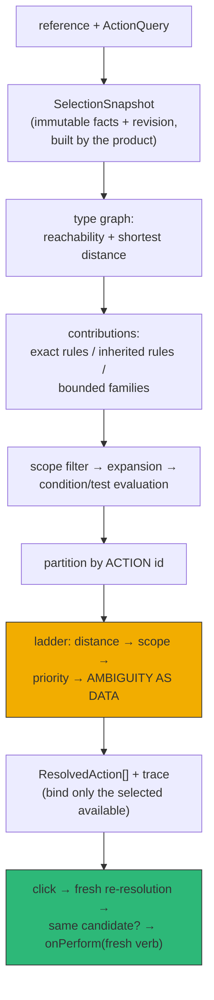

# PBUI Action Selection Kernel: From Descriptor Callbacks to a Pure Resolver

This report documents the implementation of PBUI-ACTIONS-2, which replaced the
action-discovery mechanism at the center of the PBUI presentation system. In
one working session, an exact-type descriptor callback — one function per
presentation type, returning finished menu rows — was replaced by a pure
action-selection kernel with a validated type graph, four-state availability,
deterministic override resolution, ambiguity returned as data, and fresh
revalidation before any verb executes. Three products (datalab-ui, the
pbui-chat demo, and the shared pbui-workbench tile menu) were migrated onto
the kernel without changing a single visible menu label, and the migration was
verified by golden fixtures at every step. The work landed as eight phases,
eight code commits, and 1,224 passing tests across seven suites.

> [!summary]
> - **One seam replaced, everything else preserved.** The kernel replaces
>   exactly the `descriptor.actions()` lookup. Gestures, focus, Escape
>   ownership, accept mode, serializable verbs, and the product verb routers
>   are unchanged, and the pre-existing behavior tests pass unmodified.
> - **The equivalence method carried the migration.** Golden menu fixtures
>   were frozen before any code moved (with action identity fixed first, so
>   the fixtures would not fossilize positional ids), and every later phase
>   was reviewed as a diff against them: three re-pins, zero label changes.
> - **Ambiguity, absence, and staleness became explicit values.** A tie
>   between rules is data that renders as a non-executable row; absence
>   splits into `inapplicable` (permits fallback) and `hidden` (suppresses
>   it); and a clicked menu row is re-resolved against fresh state before its
>   verb is delegated.

## Why this project exists

PBUI is a presentation-based UI system in the CLIM tradition: every domain
value a product renders is wrapped in a `Presentation` carrying a typed
reference `{type, value}`, right-clicking opens an object menu, and a pending
`accept` request lets any matching object on screen satisfy a command. Until
this project, the menu content came from one place: a per-type descriptor
object whose optional `actions(value, environment)` callback returned finished
rows. `ObjectMenu` performed a single exact-type lookup
(`src/presentation/registry.ts`) and rendered whatever came back.

That design is deterministic and cheap, but it conflates four ownership models
that the products had begun to need separately. Representation naturally has
one owner per concrete type; actions may have many independent contributors;
inherited behavior belongs to semantic type relationships; and live generated
actions can be created after the descriptor map was closed. Each product had
grown a workaround: the shared workbench tile descriptor accepted an
`extra(tile)` callback that concatenated product rows last; the sandbox
wrapped the entire registry in `withGeneratedActions` to append agent-created
actions at lookup time; and two products manufactured action identifiers of
the form `${ptype}:${index}:${label}`, which change identity whenever a label
is edited or a row is inserted. Separately, the perform path delegated
whatever verb had been baked into the menu row at render time — state changes
between render and click were silently ignored.

A prior research ticket (PBUI-ACTIONS-1) had produced a 2,198-line
source-audited design for the replacement, written against a slightly older
snapshot of the repository. This project turned that design into working code
against current HEAD, with four explicit amendments where the codebase had
moved or the design left integration questions open.

## Current project status

All eight phases are implemented and committed on the `task/use-optkit`
branch of the pbui repository:

| Phase | Commit | Content |
| --- | --- | --- |
| P0 | `fbfa492` | Golden menu fixtures; semantic verb-derived action ids in both product adapters |
| P1 | `b58e23b` | The pure kernel under `src/presentation/actions/` (50 tests) |
| P2 | `db3269e` | Kernel behind `ObjectMenu` with an automatic legacy adapter; zero product changes |
| P3 | `e33f213` | Workbench contribution fragments; datalab field/datum/doc/stage on rules |
| P4 | `7f528d2` | All 19 chat-demo types on rules; generated-actions family replaces the sandbox wrapper |
| P5 | `37b51d6` | Demonstrated-reuse inheritance: `inspectable`/`watchable` replace eight rules with two |
| P6 | `ae29000` | Typed accept: subtype satisfaction, translator edges, chooser ambiguity |
| P7 | `9dc7768` | Remaining eleven datalab types; deletions and deprecations; versions 0.7.0/0.3.0/0.3.0 |

Final test counts: root pbui 168, workbench-protocol 44, pbui-workbench 125,
pbui-sandbox 104, datalab-ui 533, pbui-chat 237, chat demo 13 — 1,224 total,
all green. Two decisions were deliberately left open for team review: the
four amendments to the source design, and a delete-versus-deprecate
adjudication described at the end of this report.

## Project shape

The work lives in the pbui monorepo:

- `src/presentation/actions/` — the kernel: identities, type graph,
  availability, conditions, registry, resolver, trace, perform evaluation,
  and the legacy adapter (eleven modules, six test files).
- `src/presentation/translators/` — typed accept: translator declarations and
  the acceptance resolver.
- `src/presentation/createPbui.tsx` — the integration surface: the provider,
  `ObjectMenu`, `AcceptChooser`, and the `performAction` path.
- `packages/pbui-workbench/src/actions.ts` — the shared tile menu as
  contribution fragments a product spreads into its own registry.
- `packages/datalab-ui/src/pbui/actions.ts` — datalab's complete menu system
  as declarations: fifteen types, one bounded family, two inherited rules.
- `packages/pbui-chat/demo/src/pbui/actions.ts` — the chat demo's nineteen
  types, the workbench fragment consumed through a projection, and the
  generated-actions family.
- `ttmp/2026/08/26/PBUI-ACTIONS-2--type-directed-action-selection-engine-in-the-pbui-package/`
  — the docmgr ticket: the imported source design, the implementation intern
  guide with the drift audit and amendments, a ten-step diary, and the
  archived work slips printed at each phase boundary.

## The problem, stated precisely

The pre-existing lookup path was:

```text
PresentationReference {type, value}
        │
        ▼
registry.descriptorFor(reference.type)      exact map lookup
        │
        └── descriptor.actions(value, environment) ── PresentationAction[]
```

Five requirements could not be expressed without ad hoc seams:

1. **Independent contribution.** A closed per-type callback needs a merge
   owner. The `extra` callback and the registry wrapper both reintroduced
   array-order semantics: whoever concatenates last, wins placement, and
   nothing arbitrates conflicts.
2. **Inheritance.** A child type sees only its own callback. Datalab carried
   an identical Inspect row in seven descriptors and an identical Watch row
   in three, by copying.
3. **Explanation.** A callback can return a disabled row, but the framework
   cannot say why a rule was not discovered, which fact it read, or which
   competitor displaced it.
4. **Stable identity.** Ids derived from labels and array positions cannot
   support overrides, traces, or any check that the row clicked is the row
   executed.
5. **Fresh execution.** The menu row's verb was computed at render time and
   delegated verbatim at click time. A conversation that closed, a capability
   that lapsed, or a generated action that was deleted between the two
   moments changed nothing.

## Architecture

### The kernel in one picture



### Five identities

The design rests on keeping five kinds of name apart, because each feeds a
different mechanism:

- A **runtime type id** names a node in a nominal type graph. Concrete nodes
  correspond to keys of the product's `PresentationValues`; abstract nodes
  (`inspectable`) exist only for action inheritance and carry no payload.
- A **rule id** (`datalab.field.map.x`) names one declaration by one package.
  It is globally unique in a registry and appears in traces.
- A **family id plus instance key** (`datalab.datum.filters/keep:region`)
  identifies one instance of a dynamic contribution. Keys must be stable for
  the same semantic instance; array index and label are forbidden as
  identity.
- An **action id** (`chart.mapping.x`) names the conceptual operation.
  Several rules implementing one action id compete; different action ids
  accumulate. The rule/action distinction is what makes overrides
  expressible at all, and the registry rejects a rule whose id equals its
  action id.
- Menu `group` and `order` are presentation metadata. Changing them must
  never change which rule wins, and a dedicated test enforces it.

### Availability has four states, because absence has two meanings

```ts
type Availability =
  | { kind: "available" }
  | { kind: "unavailable"; because: string; code?: string }
  | { kind: "inapplicable"; because: "not-relevant" | "not-applicable" }
  | { kind: "hidden"; because: "not-disclosed" | "policy" };
```

The user interface still renders three outcomes — enabled, disabled with a
reason, absent — but the resolver needs four states because an absent
candidate can mean two different things during override resolution. An
`inapplicable` candidate leaves the competition entirely, so a less-specific
implementation of the same action may win instead: a restore operation on a
live file is simply not relevant, and its absence must not block a genuine
fallback. A `hidden` candidate stays in the competition: if it wins its
partition, no row is shown *and* less-specific fallbacks stay suppressed. A
non-disclosed `secret-file.open` must not let a generic `document.open` leak
through. The distinction is a policy-safety mechanism, not a taxonomy, and
the migration used it immediately: datalab's "Make the ACTIVE chart" on the
already-active document, "Switch to it" on the current stage, and
"Group by + count" on quantitative columns all became `inapplicable`,
replacing conditional row construction with declarative absence.

The `unavailable` state carries forward an invariant the codebase had already
fought for once: one field expresses both the fact of unavailability and its
reason (`disabledBecause` in the old row shape), so an available action with
a stale reason and a disabled action with no explanation are both
unrepresentable. The kernel adds a second guarantee on top: an unavailable
row never carries a bound verb, so bypassing the DOM `disabled` attribute
cannot execute anything.

### The resolver

Resolution is a pure function of a registry, a query, and a snapshot. The
precedence ladder inside one action partition is: smallest type distance,
then nearest active scope, then highest explicit priority, then **ambiguity
returned as data with nothing selected**. Registration order, import order,
labels, and menu order are never tie-breakers; a permutation test constructs
the registry in reversed order and requires identical winners, statuses,
ambiguity sets, and bound verbs.

```text
resolve(query, snapshot):
  ancestors ← graph.ancestors(query.subject.type)      # BFS, shortest distance
  for each contribution reachable through ancestors:
      reject if no declared scope is active            # traced
      rules:    status ← when-condition, then test()   # traced
      families: expand(context); reject duplicate keys # traced
      drop inapplicable; keep available/unavailable/hidden
  partition candidates by action id
  for each partition:
      winner ← min distance → min scope index → max priority
      tie    → record SelectionAmbiguity; select nothing
      losers → traced as shadowed by the winner
  bind ONLY the uniquely selected available candidate
  hidden winners emit no row (their selection is visible in the trace)
  sort visible rows by (group, order, label, action)   # presentation only
```

Two implementation details are worth recording. First, the trace is emitted
by the same branches that select — there is no second debug resolver, so an
explanation can never disagree with the menu it explains. Second, binding
runs only after selection and only for available winners: binders may be
expensive, and a bound verb on an unselected or disabled candidate would be a
misleading audit value.

### Fresh revalidation

A rendered menu is not durable authority. When a row is clicked,
`performAction` rebuilds the snapshot, re-resolves the stored query, and
applies three checks before delegating:

```ts
if (fresh.ambiguities.some(a => a.action === stale.action))  refuse("action-became-ambiguous");
const current = fresh.actions.find(a => a.action === stale.action);
if (!current)                                   refuse("action-no-longer-resolves");
if (current.candidateId !== stale.candidateId)  refuse("action-implementation-changed");
if (current.status.kind !== "available")        refuse("action-no-longer-available", reason);
await onPerform(current.verb);                  // the FRESH verb, never the stale one
```

Requiring the same *candidate* — not merely the same action id — prevents a
newly registered, more specific rule from silently changing the semantics of
a row the user already chose. Revalidation is not authorization: state can
change after it, agents can bypass menus entirely, and the product routers
and approval gateways remain the security boundary. The raw
`pbui.perform(verb)` path is deliberately unchanged for chrome buttons and
toolbars, which construct their verbs at click time from live props and never
had the staleness problem.

### Typed accept

The accept mechanism — a pending typed object request that any matching
presentation can satisfy — previously converted foreign types through an
ordered array of callbacks, first success wins. Phase 6 replaced this with
two rules. First, subtyping is substitutability, not conversion: if the
clicked reference's concrete type is a graph subtype of an accepted target,
the request settles with the *original* reference, so downstream code can
still dispatch on the concrete type. Second, translators are declared edges
(`{id, from, to, match, scopes?, when?, priority?, translate}`), reduced by
the same nearest-scope-then-priority ladder, and a genuine remainder opens an
explicit chooser rather than picking by registration order. The chooser is a
transient surface in the existing Escape/focus infrastructure: Escape
dismisses the chooser while the accept request stays pending, and one
resolution function serves both the highlight state and the click, so what
lights up as acceptable is exactly what a click can settle.

## The migration method

### Freeze behavior before touching identity, and fix identity before freezing

Phase 0 did two things in a deliberate order. The two products that
manufactured `${ptype}:${index}:${label}` ids were first moved to ids derived
from verb content (`${ptype}.${kind}[.${discriminant}]`), with a collision
guard that throws on duplicates. Only then were golden fixtures recorded:
full menu rows — id, label, verb, danger, reason — for representative
references in every consumer. Recording the goldens first would have
fossilized positional identity into the migration fence, and every later
phase would have failed goldens for identity reasons rather than behavior
reasons.

The collision guard proved its worth within minutes of existing: the chat
demo's conversation menu emitted two `view.open` verbs (one open-tile entry
per application), a duplicate the positional ids had silently tolerated for
the descriptor's entire life.

### The golden-audit protocol

Each product migration re-pinned its goldens, but never blindly. The
protocol, applied three times (Phases 3, 5, and 7):

1. Run the golden suite with snapshot update.
2. Filter the snapshot diff down to lines that are neither ids nor labels.
3. Count label lines on both sides and check for singletons — a label that
   appears only as an addition or only as a removal is a behavior change.
4. Review whatever survives.

Across all three re-pins, the only surviving diff class was `verb: undefined`
on disabled rows — the kernel's bind-only-available invariant, reviewed once
in Phase 3 and accepted as a deliberate semantic upgrade. Labels never
changed: 82 datalab rows and 19 demo rows were byte-identical before and
after their migrations.

### One engine from day one, zero product changes

Phase 2 put the kernel behind `ObjectMenu` for every product simultaneously,
without any product opting in. When `createPbui` receives no action registry,
it builds one internally around a single `legacyDescriptorFamily` that calls
the existing descriptor callbacks at resolution time, maps `disabledBecause`
to `unavailable`, preserves row order through metadata, and namespaces action
ids as `legacy.<type>.<id>` so legacy rows can never compete with real rules.
The property this buys is architectural, not cosmetic: there is exactly one
selection engine at every point of the migration, the pre-existing
presentation and accessibility test suites pass unmodified, and — because
revalidation re-runs the descriptor callback at click time — even unmigrated
products lost the stale-verb defect before any of their code changed.

Partial migration then became a first-class state through one convention: a
migrated type deletes its `actions()` callback, and an absent callback is how
the legacy family knows to stay silent for that type. No exclusion lists, no
double rows, and a crisp per-type answer to "which engine speaks for this
menu".

### Shared packages contribute fragments, not callbacks

The source design removed the tile descriptor's `extra` callback but did not
specify how a shared package contributes to a product-owned registry. The
answer implemented here: pbui-workbench exports `workbenchTypeDefinitions`,
`workbenchScopes`, and `workbenchTileContributions(options)`, and a product
spreads them into its own `createActionRegistry` alongside its own rules. A
`project` option maps the product's tile value onto the canonical `TileRef`
when the shapes differ — the chat demo's tile presentation carries a wire
reference, and the option let it consume the shared rules unchanged rather
than forking them. Products add their own tile entries as ordinary rules for
subject `"tile"` under their own rule ids; the kernel's override and
ambiguity machinery arbitrates, and no package needs to know who else
contributes.

### Inheritance only where duplication proved it

Phase 5 followed the design's rule that abstract runtime nodes require
demonstrated reuse. Datalab qualified: identical Inspect rules on every
migrated type and identical Watch rules on three became two inherited
declarations on abstract `inspectable` and `watchable` nodes. Three details
mattered. Inherited rules receive the *original* concrete reference — runtime
subtyping never coerces payloads — so the inspect verb still names the
concrete presentation type. Stage is inspectable but deliberately not
watchable, because its menu never offered Watch and inheritance must not add
rows as a refactoring side effect. And the chat demo deliberately stayed
flat: its Inspect rows sit at wildly different menu positions per type, and a
single inherited order value would have reordered menus. That is a finding
about the limits of inheritance under a shared order space, not a failure,
and it is recorded as such.

## Findings the migration surfaced

**Construction-time validation converts latent module cycles into startup
crashes.** The old `createPbui` only closed over its options, so a
long-standing import cycle in the chat demo (descriptors importing the chat
store, the chat store importing the runtime, the runtime importing the
registry of descriptors) had been silently tolerated: modules evaluated
against partially initialized neighbors, and nothing read the missing values
until after initialization completed. The kernel's construction guard
(`translators` requires `actions`) read one of those values at create time
and crashed the provider. The repair was structural rather than cosmetic: a
dependency-light `conversationFacts` slot that the chat store registers into
at startup, with descriptors and the snapshot builder reading through the
slot at call time. An unregistered slot resolves to the honest
"not in this browser's list" state. The general lesson: any move from
closure-deferred reads to construction-time reads must be reviewed together
with the module graph, and the crash is a feature — the cycle was real.

**Snapshots make cost boundaries auditable.** Datalab draws a hard line
between cheap schema access and expensive table evaluation (per-render code
may resolve field types; only menu-time code may evaluate rows). The
snapshot builder preserved this line by construction: it derives only
schema-level facts (`targetDocId`, `fieldType`, categorical column names),
and its revision string is composed from exactly those derived facts, so it
moves if and only if they move. Rules read `snapshot.product` and nothing
else, which turns a previously implicit performance discipline into a
reviewable function.

**Behavior tests survive an engine swap when they assert contracts, not
shapes.** Of datalab's 533 tests, only the two files that enumerate menu rows
needed edits across the entire migration; the application, organism, and
analysis tests passed untouched at every phase because the UI had only ever
spoken to menus through the seams being replaced. The one test that broke for
a semantic reason — iterating rows and reading `verb.kind` on disabled
entries — broke precisely because the kernel refuses to bind verbs to
disabled rows, and the adapted test now asserts that absence.

## What was deliberately not deleted

The source design's final phase deletes descriptor `actions()`, the legacy
engine, and the conversion array outright. Its exit criterion, however, is
"no in-repository production users," which the implementation satisfies:
after Phase 7, datalab's fifteen types, the demo's nineteen, and the shared
tile menu are all kernel-native; `withGeneratedActions` and the `extra`
callback are gone; and the only remaining users of the compat surface are
core tests and stories that exercise it on purpose. The generic affordances
themselves — the optional descriptor callback, the automatic legacy engine,
and `conversions` — were kept as `@deprecated` one-window migration paths,
because products outside this repository still consume the published 0.6.x
shapes, and version 0.7.0 deleting their only path would strand them.
`PresentationDescriptorRegistry` was introduced as the forward-looking name
for the representation registry. Hard deletion is a small mechanical commit
reserved for the next major, and the adjudication is written down in the
ticket diary rather than left to drift.

## Working practices worth repeating

The session ran as an instrumented phase loop: a physical brutalist work slip
printed at the plan, at each phase start, and at each phase end (eighteen
slips, archived as YAML in the ticket's `various/work-slips/`), one focused
code commit and one docs commit per phase, and a strict-format diary step
recording what worked, what failed verbatim, and what warrants review. Two
recurring failure modes are recorded there for future sessions: shell working
directories drift across long sessions (three separate incidents of a
command running in the wrong package; absolute paths are the cure), and
workspace packages compile against *built* dependencies, so cross-package
type changes require rebuilding the root package before its consumers
typecheck against the new surface.

## Open questions

- The four amendments to the source design (dual perform entry points, the
  optional kernel with automatic legacy adapter, shared-package contribution
  fragments, stable ids before goldens) await team review, as does the
  delete-versus-deprecate adjudication above.
- Translator conditions currently evaluate against an empty predicate map at
  the provider boundary; wiring product predicates through `createPbui` is
  deferred until a product declares a conditional translator.
- Inherited rules share one menu-order value across all subtypes, which is
  why the chat demo stayed flat. A per-type order override on inherited
  rules is the plausible extension if that product wants inheritance too.
- Storybook demonstrations of inheritance, hidden-versus-inapplicable,
  ambiguity, and translator choice are deferred; every semantic is
  test-covered, but the stories are the missing teaching artifact.

## Near-term next steps

The ragttc optimization workbench (OPTKIT-022/023, in the rag-ttc repository)
is the first greenfield consumer: it should declare rules and families
natively from day one, express its authoring gates as conditions, and shape
its accept conversions as translator edges — by which point the kernel's
claim is fully realized: adding an action is one declaration, and nothing
else in the system needs to know.

## Project working rule

A menu row is a claim about what the system will do; every mechanism in this
project exists to keep that claim honest. Identity must survive relabeling,
absence must state which kind of absence it is, ties must be visible rather
than resolved by accident, and the verb that executes must be computed from
the state in which the user acted — never from the state in which the menu
was drawn.
