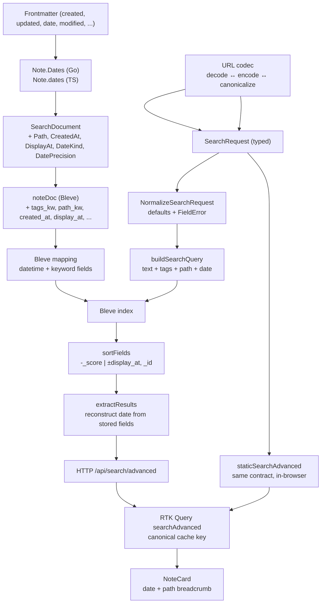
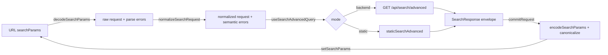

# Publish Vault: Date-Aware Advanced Search — A Technical Deep Dive

This report explains how publish-vault gained truthful authored dates and a typed advanced-search capability that composes free text, exact tags, folder prefixes, date ranges, sorting, and pagination across a persistent Bleve backend and an in-browser static search, behind a canonical shareable URL. The work implements the design package merged as PV-SEARCH-027 (PR #26, merge `708685ae`) and is delivered as PV-SEARCH-028 (PR #27). The central result is that a search result's date can be treated as authored frontmatter metadata with explicit provenance — created or updated, date or timestamp — rather than as a filesystem checkout timestamp or a build-time fallback, and that one typed `SearchRequest` object can drive the Bleve query builder, the HTTP endpoint, the static-mode predicate, and the URL codec without any of them re-implementing the contract. The implementation spans six phases, twenty-seven changed files, and roughly 2,700 lines of new Go and TypeScript, including shared cross-language fixtures and contract tests that prove backend and static modes include and order the same notes for structured filters.

The decisive design choices are three. First, search dates are resolved from strict frontmatter aliases only, and a missing or invalid date stays missing rather than being masked by a filesystem or current-date fallback. Second, exact structured filters use separate keyword and datetime fields that leave the existing analyzed `#tag` discovery behavior untouched, so the feature is additive. Third, the browser URL is the committed search request: a pure codec decodes it into a typed request, a single funnel commits changes back, and an invalid URL renders a reset action instead of being silently corrected. These choices make the feature safe to add to a deployed service — the legacy `/api/search` endpoint and the existing `useSearchQuery` hook keep working — and they make the static and dynamic modes provably agree on inclusion even though their text ranking cannot match Bleve's scoring.

> [!summary]
> 1. Search dates are authored frontmatter metadata with explicit kind and precision, never `os.FileInfo.ModTime()` and never a build-time `new Date()`. A higher-precedence invalid alias does not fall through to a lower alias, so an author mistake stays visible instead of being masked by a stale value.
> 2. One typed `SearchRequest`/`SearchResponse` drives the Bleve query builder, the HTTP `/api/search/advanced` endpoint, the static `staticSearchAdvanced` predicate, and the canonical URL codec. The legacy `/api/search` endpoint delegates to the same implementation and keeps its bare-array response during a compatibility window.
> 3. Static frontmatter parsing switched to `js-yaml` `JSON_SCHEMA` so unquoted RFC3339 scalars survive serialization as strings; the default YAML schema would have resolved them to `Date` objects that the serializer truncates to `YYYY-MM-DD`.
> 4. The browser URL is the committed request state. A round-trip invariant — `decode(encode(canonicalize(request))) == canonicalize(request)` — keeps shared URLs reconstructable, and a canonical RTK Query cache key prevents equivalent tag orderings from creating duplicate cache entries.

## The problem this work addresses

publish-vault serves an Obsidian vault as a single-binary Go service with a React frontend. Before this work, the search surface exposed one free-text parameter and returned a bare array capped at thirty results. A search result carried a title, an excerpt, a list of tags, a slug, and a score. It carried no path and no date. Three properties of the existing system made a structured-search feature hard to add safely.

The first property is that the date a note appeared to have was not a single concept. The dynamic backend read `os.FileInfo.ModTime()` during `Vault.loadNote` and stored it directly as `Note.ModTime`. The static frontend parsed frontmatter with `js-yaml` under its default schema, took the `created` key when it was a `Date`, took the string `created` when it was a string, and substituted `new Date()` — the build or runtime date — when `created` was absent. A `modTime` value therefore meant "filesystem checkout time" in one runtime and "the authored `created` date, or today's date if missing" in the other. The production vault arrives through `git-sync`, which creates a fresh worktree for each revision; Git does not preserve original filesystem modification times on checkout, so the dynamic `ModTime` described the checkout, not the author's intent. Displaying either value without provenance could make a false claim about when a note was written.

The second property is that the search surface could not express structured constraints. There was no exact tag filter, no path filter, no date range, no sort control, and no pagination. A user who wanted "all notes tagged `go` under `Research/KB` written in January 2024, newest first" had no way to ask for it. The Bleve index mapped only `title`, `body`, `tags` (analyzed), and `excerpt`; there were no keyword fields for exact matching and no datetime fields for range or sort queries. Adding these fields is additive, but the index mapping is a derived snapshot, so every change is a migration-by-rebuild rather than an in-place schema edit.

The third property is that the two runtimes already disagreed in ways that a parity requirement would expose. The backend `searchByTag` used a prefix query for tag queries of at most three characters and a fuzziness-one match query for longer tags, so `#go` could include a note tagged `golang` dynamically. The static `staticSearch` required an exact normalized tag, so `#go` would exclude `golang` statically. Requiring "static parity with current behavior" was therefore contradictory, because there was no single current behavior to reproduce. A second divergence lived one layer earlier: the default `js-yaml` schema resolved an unquoted `updated: 2024-01-15T13:45:00-05:00` to a JavaScript `Date`, and `serializeFrontmatter` truncated every `Date` to `toISOString().slice(0, 10)`, so an authored RFC3339 instant lost its time, its timezone offset, and its `timestamp` precision before any date resolver could inspect it. A static date resolver that received only truncated values could never match a backend that received the full instant.

The PR #26 review of the design package surfaced both divergences explicitly, and the design was corrected before implementation began: the static parser must use `JSON_SCHEMA`, and the legacy `#tag` inclusion must select one canonical contract rather than calling both current. This report describes how those corrections were implemented and how the four consumers — Bleve, HTTP, static, and URL — were built on one typed contract so they cannot drift again.

## What shipped

The implementation is organized into six phases, each a reviewable commit slice with a gate that the next phase depends on.

- **Phase A — canonical authored-date domain.** `pkg/vault/date.go` defines `NoteDate`, `NoteDates`, `NoteDateKind`, `DatePrecision`, `InvalidDateReason`, and `ResolveNoteDates`. It accepts `created` then `date` for the created concept and `updated`, `modified`, then `last_updated` for the updated concept, matched case-insensitively, and parses strict `YYYY-MM-DD` or RFC3339 values. A higher-precedence invalid value does not fall through to a lower alias. The vault records a content-free `concept:reason` invalid-date counter, never the key spelling or value. `Note` gains a `Dates` field and `SearchDocument` gains `Path`, `CreatedAt`, `UpdatedAt`, `DisplayAt`, `DateKind`, and `DatePrecision`. A shared fixture at `testdata/search-date-cases.json` drives both Go and TypeScript resolver tests. The static `parseFrontmatter` switches to `js-yaml` `JSON_SCHEMA` so unquoted scalars stay strings.
- **Phase B — typed request and Bleve mapping.** `pkg/search/request.go` defines `SearchRequest`, `SearchResponse`, `SearchResultDate`, `DateOnly`, the `TagMode`/`DateField`/`SearchSort` enums, `NormalizeSearchRequest` with stable `FieldError` values, and `Effective()`. The Bleve `noteDoc` gains `tags_kw`, `path`, `path_kw`, three datetime fields, `date_kind`, and `date_precision`; `buildMapping` adds keyword and datetime mappings. A `buildSearchQuery` composes one query tree from independent clauses, `sortFields` returns a deterministic order, and `SearchAdvanced` runs the typed request and returns a paginated envelope. Legacy `Search` and `searchByTag` are refactored onto shared `textQueryClause`, `legacyTagQuery`, and `extractResults` helpers so there is one search implementation.
- **Phase C — advanced HTTP endpoint.** `pkg/api/search_request.go` parses repeated and singleton parameters, rejects unknown keys, and returns a stable `{"error":{"code","message","fields":[]}}` envelope on invalid input. `GET /api/search/advanced` is registered, and the legacy `GET /api/search` is rewritten to delegate to `SearchAdvanced` while keeping its bare-array response. Nine contract tests cover the envelope, empty-results-as-array, filter-only, the `before_date_from` error, unknown parameters, repeated singletons, an invalid limit, an invalid date, and the legacy bare array.
- **Phase D — frontend types, URL codec, and static parity.** `web/src/types/index.ts` adds the request, response, and date types. `web/src/search/searchParams.ts` implements `parseDateOnly`, `normalizeSearchRequest`, `canonicalizeSearchRequest`, `encodeSearchParams`, `decodeSearchParams`, and `isEffective`, mirroring the Go normalization. An RTK Query `searchAdvanced` endpoint uses a canonical `serializeQueryArgs` cache key. The static `staticSearchAdvanced` reproduces the backend's exact tag all/any, path-prefix, date-range, sort, and pagination contract, and `staticSearch` gains a `path` field. Eleven parity tests run the same Alpha/Beta/Gamma/Plain vault the Go contract tests use.
- **Phase E — search interface.** `SearchPage` is rewritten to decode the URL into a typed request, query `useSearchAdvancedQuery`, and commit changes through one `commitRequest` funnel. An accessible `AdvancedSearchPanel` edits tags, tag mode, folder prefixes, and date range. The header gains a sort select, an active-filter chip row with per-chip remove, a result count, and Prev/Next pagination. `NoteCard` renders the authored date as `<time dateTime>` with a created/updated label and the path as a breadcrumb. Invalid URL filters render a reset action.
- **Phase F — validation.** `make ci-check` passes with exit zero, `go test -race ./...` passes for every package, the web Vitest suite passes eighty-two tests, the client and SSR builds and the Storybook build succeed, golangci-lint and gosec report zero issues, and a Docker/Compose smoke against the demo vault verifies the advanced endpoint, the four-hundred error contract, and the legacy adapter with the application at roughly fifteen megabytes of memory.

## Architecture

The feature is a pipeline from authored frontmatter to a rendered card, with two execution backends — a persistent Bleve index in the Go process and an in-browser static search — that must agree on inclusion. The typed `SearchRequest` is the single contract that every stage after the vault layer consumes.



The dependency direction is strict. The date resolver depends only on frontmatter. The vault layer depends on the resolver. The search package depends on the vault's `SearchDocument` and on Bleve. The API depends on the search package and never reaches the vault directly for search — it asks the snapshot provider for the current `*search.Index`. The frontend codec depends only on the shared types; the RTK Query endpoint depends on the codec; the static search depends on the resolved `Note.dates` and on the same `normalizeSearchRequest`. The URL codec never calls Bleve and never calls the static search; it is a pure transformation, which is what makes the round-trip invariant testable in isolation.

The two backends differ in how they evaluate the same request. Bleve builds a query tree and lets the index resolve it; the static search scans every note and applies the same predicates in Go. They agree on inclusion — which notes match — and on ordering — newest, oldest, or relevance with a slug tie-break — but they do not agree on score, and the design explicitly does not promise they will. The shared fixture asserts agreement on the ordered list of slugs, not on the floating-point scores.

## Canonical authored dates

The date model is the foundation every later phase depends on, and the first decision it makes is what a date is not. It is not `os.FileInfo.ModTime()`, because a Git checkout assigns current timestamps to many notes regardless of when they were authored. It is not the static `new Date()` fallback, because a missing-date note would change its displayed date every time the static app rebuilds. It is not a value that falls through from an invalid alias to a valid one, because an author who typed `created: January someday` should see that mistake rather than have it silently masked by a stale `date` value.

The resolver accepts two concepts — created and updated — each with an ordered alias list, matched case-insensitively.

| Concept | Accepted keys, highest precedence first |
|---|---|
| Created | `created`, then `date` |
| Updated | `updated`, `modified`, then `last_updated` |

Precedence is evaluated within a concept. A valid `updated` does not erase a valid `created`; both are retained. The display date is the updated date when present, otherwise the created date, otherwise absent. The resolver selects the first alias that exists and parses its value; it does not try the next alias if the selected value is invalid, which is the no-fallthrough rule.

```go
func resolveConcept(fm map[string]interface{}, concept NoteDateKind, aliases []string) (*NoteDate, []DateWarning) {
    canonical, actualKey, ok := lookupAlias(fm, aliases)
    if !ok {
        return nil, nil
    }
    raw := fm[actualKey]
    s, ok := raw.(string)
    if !ok {
        return nil, []DateWarning{{Concept: concept, Reason: InvalidDateWrongType, Key: canonical}}
    }
    nd, reason, ok := parseNoteDate(s, canonical)
    if !ok {
        return nil, []DateWarning{{Concept: concept, Reason: reason, Key: canonical}}
    }
    return &nd, nil
}
```

The parser accepts two strict forms. A date-only value is exactly ten characters in the shape `YYYY-MM-DD` with zero-padded month and day; it becomes midnight UTC with `date` precision, and this midnight is an indexing representation, not a claim that the author acted at midnight UTC. An RFC3339 timestamp is parsed with `time.RFC3339` and normalized to UTC with `timestamp` precision. The function returns a finite, content-free reason on failure — `wrong_type`, `invalid_format`, or `invalid_calendar_date` — so the loader can count rejections without ever encoding a frontmatter key spelling or a raw value into a metric or a log line.

Precision is retained separately from `time.Time` because converting a date-only value to an instant would lose the author's intent and would shift the displayed calendar day once rendered in a timezone. The `NoteDate` struct carries `Value` (the indexed instant), `Precision` (`date` or `timestamp`), `SourceKey` (the canonical lower-case alias), and `Original` (the literal string). The API projection, `APIValue`, returns the original literal for date precision and a normalized UTC RFC3339 instant for timestamp precision, so the value that crosses HTTP is the same string a reader can verify against the source.

The loader aggregates invalid dates into a content-free counter keyed `concept:reason`, exposed by `Vault.InvalidDateCounts()`. A load that rejects two dates logs a line such as `vault load: rejected authored dates created:invalid_format=1 created:wrong_type=1`, which is safe to ship to metrics because it contains no note titles, paths, or values. The resolver runs in `loadNote`, which returns the warnings alongside the note; both callers — `LoadAll` and `ReloadNote` — aggregate the warnings under the vault lock, because `loadNote` itself runs outside the lock.

The Go parser already returns frontmatter date values as strings. The PV-SEARCH-027 probe confirmed that Goldmark's metadata normalization surfaces `2024-01-15`, `2024-01-15T13:45:00-05:00`, `"2024-01-15"`, and `January someday` all as Go strings. The Go side therefore needs no schema change. The static side does. Before this work, `parseFrontmatter` called `yamlLoad` with the default schema, which resolves unquoted timestamps to JavaScript `Date` objects, and `serializeFrontmatter` truncated every `Date` to `toISOString().slice(0, 10)`. An authored RFC3339 value could lose its instant and precision before a resolver ran. The fix is to parse with `JSON_SCHEMA`, which does not apply YAML timestamp resolution, so quoted and unquoted date and RFC3339 scalars reach the resolver as strings while ordinary JSON-compatible scalar types remain typed.

```ts
import { JSON_SCHEMA, load as yamlLoad } from "js-yaml";

const data = yamlLoad(m[1], { schema: JSON_SCHEMA });
```

A cross-language golden fixture is preferable to duplicating prose assumptions in two independent test tables. The shared `testdata/search-date-cases.json` defines thirteen cases — no dates, a date-only created, the `date` alias, `created` winning over `date`, an RFC3339 updated, created plus updated, an invalid created with no fallthrough to a valid `date`, a timezone timestamp, a non-string value, the `modified` alias, an invalid format, an invalid calendar date, and a case-insensitive key — with the expected created and updated projections, the display kind, the display value, the display precision, and the expected warnings. The Go test and the TypeScript test consume the same file and assert the same expected outputs, so a change to one resolver that diverges from the fixture fails in that runtime.

## The typed request and the Bleve mapping

The search package replaces positional growth with one request object. `SearchRequest` carries the free-text `Query`, the repeated exact `Tags` with a `TagMode` of `all` or `any`, the repeated `PathPrefixes`, a `DateField` of `display`, `created`, or `updated`, an inclusive `DateFrom` and `DateTo` of type `DateOnly`, a `Sort` of `relevance`, `newest`, or `oldest`, a `Limit`, and an `Offset`. `NormalizeSearchRequest` trims, validates, applies defaults, and canonicalizes, returning the normalized request and a list of stable `FieldError` values whose `Field` and `Code` are the machine contract and whose `Message` is for users.

`DateOnly` is a calendar date without a timezone. It parses a strict `YYYY-MM-DD` literal, validates the calendar date by round-tripping through `time.Date`, and exposes `StartUTC` (midnight UTC, inclusive range start) and `NextDayStartUTC` (midnight UTC of the next day, exclusive range end). A single-day filter `[d, d]` is therefore the half-open interval `[d, d+1)`, which includes date-only values indexed at midnight and every RFC3339 instant whose UTC date is `d`. The `Before` method uses calendar order, so `date_to < date_from` validation is timezone-independent.

The Bleve document gains six new fields, each chosen for the query it must support.

| Field | Mapping | Stored | Purpose |
|---|---|---:|---|
| `tags_kw` | keyword array | no | exact all/any tag filters |
| `path` | keyword | yes | result display |
| `path_kw` | keyword, lowercased | no | exact prefix filtering |
| `created_at` | datetime | yes | created range and reconstruction |
| `updated_at` | datetime | yes | updated range and reconstruction |
| `display_at` | datetime | yes | default range and date sorts |
| `date_kind` | keyword | yes | created/updated result label |
| `date_precision` | keyword | yes | date/timestamp formatting |

The analyzed `tags` field is preserved unchanged so the existing `#tag` prefix and fuzzy discovery keep working; `tags_kw` is a separate, exact, lowercased array for structured `tag=` filters, so a selected `go` chip matches only `go` and never `golang`. `path` preserves display spelling for the breadcrumb; `path_kw` is the lowercased, leading-slash-stripped form used for prefix queries, with a trailing slash required in the canonical prefix so `research/go` does not match `research/golang-notes` when the user selected the `research/go/` folder. The datetime fields are stored so a hit can be reconstructed without a second vault lookup, and `date_kind` and `date_precision` are stored so the result carries the provenance the date model resolved.

The query builder composes one tree from independent clauses. Text or legacy tag discovery contributes one clause; exact tags contribute a conjunction (all) or disjunction (any) of `TermQuery` over `tags_kw`; path prefixes contribute a disjunction of `PrefixQuery` over `path_kw`, because one file cannot live under two distinct folder prefixes; a date range contributes one `DateRangeInclusiveQuery` over the selected field. Categories combine with a conjunction. A filter-only request — no text, only structured filters — uses `MatchAllQuery` plus the structured clauses, so it is not blocked by the frontend's two-character text threshold.

```go
func (si *Index) buildSearchQuery(req SearchRequest) bq.Query {
    var clauses []bq.Query
    if tagQuery, ok := extractTagQuery(req.Query); ok {
        clauses = append(clauses, legacyTagQuery(tagQuery))
    } else if req.Query != "" {
        if q := textQueryClause(tokenizeQuery(req.Query)); q != nil {
            clauses = append(clauses, q)
        }
    }
    if len(req.Tags) > 0 { /* conjunction or disjunction of TermQuery over tags_kw */ }
    if len(req.PathPrefixes) > 0 { /* disjunction of PrefixQuery over path_kw */ }
    if req.DateFrom != nil || req.DateTo != nil { clauses = append(clauses, dateRangeQuery(req)) }
    if len(clauses) == 0 { return bleve.NewMatchAllQuery() }
    if len(clauses) == 1 { return clauses[0] }
    return bleve.NewConjunctionQuery(clauses...)
}
```

Sorting is deterministic. Relevance sorts by `-_score` then `_id`. Newest sorts by `-display_at` then `_id`; oldest sorts by `display_at` then `_id`. The `_id` tie-break is the document slug, so two notes with the same display date have a stable order across rebuilds. The date-range and sort concepts are deliberately separate: changing the `date_field` dropdown changes which field the range filters, but newest and oldest still sort by `display_at` in version one, so a filter change cannot silently change result ordering. The contract test pins the fact that Bleve's default missing-field behavior places undated notes last for both newest and oldest, so a Bleve upgrade cannot silently change it without a failing test.

Result extraction reconstructs the display date from the stored `display_at` instant and the `date_kind` and `date_precision` keywords. For date precision, the midnight-UTC instant formats back to the original `YYYY-MM-DD`; for timestamp precision, it formats to UTC RFC3339 at second precision. This keeps one read path and avoids storing a redundant string, but it depends on the instant having been normalized to UTC at index time. The `SearchResult` carries an optional `Date *SearchResultDate`, so a note without authored dates serializes with no `date` key rather than a null.

The byte accounting that protects the PV-MEM-002 bounded-batch mechanism is updated. `searchDocumentBytes` now counts `Path`, `DateKind`, `DatePrecision`, the lowercased `tags_kw` copy, and the lowercased `path_kw` copy, so the sixteen-document-or-one-mebibyte flush bound remains honest. The bounded-batch mechanism itself is unchanged; the new fields only add to the per-document size that the bound already measures.

## The advanced HTTP endpoint

The HTTP layer exposes the typed request without breaking the existing surface. A second route is added rather than changing the existing one, because changing `/api/search` from a bare array to an envelope would break deployed frontend bundles, scripts, and untracked clients during a deployment-order difference. The two routes are not two search implementations: both handlers call the same `SearchAdvanced` method. The new route is an explicit contract boundary and a removable legacy adapter.

`GET /api/search/advanced` accepts ten parameters. `q` is a singleton; `tag` and `path` repeat; `tag_mode`, `date_field`, `date_from`, `date_to`, `sort`, `limit`, and `offset` are singletons. The accepted set is declared in a `map[string]bool` that records whether each key may repeat. Unknown keys are rejected so a misspelled filter does not produce an unexpectedly broad result, and repeated singletons are rejected rather than taking the first or last value, because taking one silently would hide a copy-paste error.

Invalid input returns HTTP 400 with a stable envelope.

```json
{
  "error": {
    "code": "invalid_search_request",
    "message": "One or more search parameters are invalid.",
    "fields": [
      { "field": "date_to", "code": "before_date_from", "message": "date_to must be on or after date_from" }
    ]
  }
}
```

The `field` and `code` names are the machine contract; the `message` is suitable for users but is not the contract. Raw query values are never echoed into the body or the logs, so a private query string does not leak through an error response. Parse-time errors — an unknown parameter, a repeated singleton, a non-numeric limit, an invalid date — and semantic errors from `NormalizeSearchRequest` — a `date_to` before `date_from`, a `date_field` without a range, an out-of-range limit — are concatenated into one field list, so the caller sees a single coherent set of problems. A backend or index failure returns 500 with `search_unavailable` and no underlying error detail.

The helper that writes the error envelope sets the `Content-Type` header before `WriteHeader`, because setting a header after `WriteHeader` is a no-op and would leave the response without a JSON content type. Empty results serialize as `[]` rather than `null` because the handler nil-checks the slice before encoding, which the contract test asserts by checking the response body contains `"results":[]`.

The legacy `GET /api/search` is rewritten to delegate to the same `SearchAdvanced` implementation. It normalizes a request with only a query and a limit of thirty, runs the advanced search, and returns the bare result array — not the envelope — so existing consumers keep their response shape. The contract test pins that the legacy body contains no `"total":` key, confirming it is a bare array and not an envelope.

## The canonical URL codec and static parity

The browser URL is the committed search request. A shareable URL must reconstruct the same request in another browser, survive a reload, and be available to server-side and static routes. The frontend therefore owns a pure codec that decodes `URLSearchParams` into a `SearchRequest`, canonicalizes it, and encodes it back in a fixed key order. The round-trip invariant is `decode(encode(canonicalize(request))) == canonicalize(request)`, and a test exercises it end to end with a full request that carries text, two tags, a path, a date range, a sort, and a limit.

`encodeSearchParams` emits parameters in a fixed order — `q`, `tag`, `tag_mode`, `path`, `date_field`, `date_from`, `date_to`, `sort`, `limit`, `offset` — with repeated keys grouped. It omits empty values and defaults: `tag_mode=all` is emitted only when tags are present, `date_field` only when a range is present, the default `limit=30` and `offset=0`, and the effective sort is emitted explicitly so a shared URL does not change if defaults evolve. `decodeSearchParams` rejects unknown parameters and repeated singletons with the same field codes the backend uses, so an invalid URL is visible to the UI rather than silently corrected.

RTK Query needs a stable cache key, because two requests that differ only in tag order are the same search. The `searchAdvanced` endpoint sets `serializeQueryArgs` to `${endpointName}:${encodeSearchParams(canonicalizeSearchRequest(queryArgs)).toString()}`, so canonical arguments produce one cache entry. The endpoint exists in two modes: in backend mode it builds a URL against `/api/search/advanced`; in static mode its `queryFn` calls `staticSearchAdvanced` and returns the same envelope. The same hook serves both modes, which is what lets a static deployment and a dynamic deployment present one interface.

The static search must reproduce the backend's inclusion and ordering contract without reproducing Bleve's scoring. `staticSearchAdvanced` takes a `SearchRequest`, normalizes it, scans every note, and applies the same predicates the query builder does: exact tags with all/any semantics, path-prefix inclusion, date-range inclusion, and the legacy `#tag` discovery contract. It sorts by display date for newest and oldest with a slug tie-break and undated notes last, and by a hand-built text score for relevance with the same slug tie-break. It slices the result to the page and reports the total.

The legacy `#tag` contract is the one place the static search approximates Bleve rather than calling it. The backend `searchByTag` uses a prefix query for tag queries of at most three characters and a fuzziness-one match query for longer tags. The static implementation reproduces this with a prefix test for short queries and an exact-or-Levenshtein-one test for longer queries over normalized complete tags. For typical single-word tags these agree; the parity fixtures use short queries such as `#go`, which prefix-match exactly. The design does not promise score parity, and the parity tests assert agreement on the ordered list of slugs, not on floating-point scores.



Proving parity required a test that does not depend on the singleton demo vault, which is why `buildVault` was refactored into `buildVaultFromRaw(rawFiles)` and `staticSearchAdvanced` was extracted into `searchAdvancedInNotes(notes, request)`. The parity test builds the same Alpha, Beta, Gamma, and Plain vault the Go contract tests use — Alpha tagged `go, performance` with a created date and an RFC3339 updated date, Beta tagged `go`, Gamma tagged `rust`, and Plain with no dates — and asserts that the static search returns the same ordered slugs the Go `SearchAdvanced` does for every structured case: exact tag all, exact tag any, path prefix, date range over display, newest with undated last, oldest with undated last, pagination, date reconstruction, the legacy `#go` prefix contract, an ineffective request, and a compound query. Eleven parity tests run against the same fixture, so a change to one backend that diverges from the contract fails in that runtime.

## The search interface

The `SearchPage` was rewritten to treat the URL as the source of truth. It decodes the URL into a request with `decodeSearchParams`, normalizes it with `normalizeSearchRequest`, queries `useSearchAdvancedQuery`, and commits every change back through one `commitRequest` funnel that re-encodes the canonical URL. The text field, the sort, the filter panel, the chip removals, and the pagination all go through this funnel, so the URL and the request can never drift apart.

The page has two sources of truth risk: the Redux `searchQuery` slice and the URL. The new page treats the URL as canonical and uses Redux only for `activeNote` navigation; the `searchQuery` slice is no longer read here, and the text field is controlled by `request.query`, which is decoded from the URL. This removes the dual-source drift the design warned about. The query is skipped when the request is not effective — no text and no filters — or when the URL has errors, so the empty state shows the tag cloud and an invalid URL shows a reset action instead of querying.

The filter panel is an accessible modal built on the existing Radix Dialog primitive. It holds a draft of the structured filters — tags as a comma-separated list, tag mode as a select, folder prefixes as a list, the date field as a select, and the date range as two date inputs — and re-syncs from the committed request each time it opens, so canceling and reopening does not lose the draft's relationship to the URL. Apply merges the draft with the current query and sort and resets the offset to zero, because any filter change invalidates the current page. The header gains a sort select, an active-filter count badge, and a result count; the body gains an applied-filter chip row with per-chip remove and a "Reset filters" action; and the results gain Prev/Next pagination with a visible range and total.

The `NoteCard` was extended to render the authored date and the path. The date is rendered as a `<time dateTime={date.value}>` element with a label built from the kind — `Created` or `Updated` — and the value, which is the UTC calendar date for timestamp precision and the literal for date precision. Using `<time>` keeps the server-rendered text deterministic and avoids a hydration mismatch that locale formatting in the browser would cause. The path is rendered as a small breadcrumb above the title. The legacy `modTime` remains as a fallback for callers that do not carry the authored date, so the card stays usable in contexts that have not been migrated.

Invalid URL filters must stay visible. The page decodes the errors, skips the query, and renders a banner that lists each field error and offers a "Reset all" action, rather than silently clearing the URL. This is the difference between a shareable URL that a friend can debug and one that silently changes meaning when shared.

## Testing strategy

The test suite is organized around three guarantees: the date model is correct in both runtimes, the search contract is correct in both runtimes, and the HTTP and URL contracts are stable.

The date model is pinned by the shared fixture. `testdata/search-date-cases.json` defines thirteen cases, and `pkg/vault/date_test.go` and `web/src/search/noteDate.test.ts` consume the same file. A Go test asserts each case's created and updated projections, the display kind and value and precision, and the warnings; the TypeScript test asserts the same. A focused `TestParseNoteDate` and `TestIsStrictDateOnly` cover the parser's rejection of partial dates such as `2024-1-5`, space-separated datetimes, and invalid calendar dates such as `2024-13-40`. A `TestNoteDateDisplayPrecedence` confirms updated takes precedence over created and an empty `NoteDates` displays as absent. An integration test, `pkg/vault/date_integration_test.go`, confirms a real vault populates `Note.Dates` from frontmatter, that `SearchDocument` carries the instants, and that `InvalidDateCounts` aggregates rejections as content-free `concept:reason` keys.

The search contract is pinned by two parallel suites that use the same fixture vault. `pkg/search/search_advanced_test.go` builds the Alpha, Beta, Gamma, Plain vault and asserts eleven cases against `SearchAdvanced`: exact tag all, exact tag any, path prefix, date range over display, newest with undated last, oldest with undated last, pagination, date reconstruction, the legacy `#go` discovery, an ineffective request, and a compound query that narrows to one note. `web/src/vault/staticVault.advanced.test.ts` builds the same vault through `buildVaultFromRaw` and asserts the same eleven cases against `searchAdvancedInNotes`. Because the two suites assert the same ordered slugs for the same inputs, a change to one backend that diverges from the contract fails in that runtime. The request normalization is pinned by `pkg/search/request_test.go` and `web/src/search/searchParams.test.ts`, which cover defaults, tag normalization and deduplication, path normalization and traversal rejection, the date-range validation, and the limit, offset, and sort errors.

The HTTP contract is pinned by `pkg/api/search_advanced_test.go`, which asserts the envelope shape and content type, that empty results serialize as `[]`, that a filter-only request works, that `date_to` before `date_from` returns the `before_date_from` field error, that an unknown parameter returns `unknown_parameter`, that a repeated singleton returns `repeated_parameter`, that an out-of-range limit returns `limit_out_of_range`, that an invalid date returns `date_from_invalid`, and that the legacy endpoint still returns a bare array with no `total` key. The URL codec is pinned by `web/src/search/searchParams.test.ts`, which asserts the round-trip invariant with a full request, that defaults and empty values are omitted, that the encoded string is in a fixed key order, and that unknown parameters and repeated singletons decode as errors.

The static frontmatter fix is pinned by `web/src/vault/staticVault.frontmatter.test.ts`, which asserts that quoted and unquoted date-only values stay strings, that an unquoted RFC3339 value stays a full-precision string and is not a `Date`, that a `Z` timestamp stays a full-precision string, that `serializeFrontmatter` preserves both without truncation, and that ordinary JSON-compatible scalars — strings, numbers, booleans, arrays — still parse. This is the regression test for the PR #26 review finding that prompted the `JSON_SCHEMA` change.

The full gate suite passes. `make ci-check` exits zero, `go test -race ./... -count=1` passes for every package, the web Vitest suite passes eighty-two tests, the client and server-side builds succeed, and the Storybook build succeeds. golangci-lint reports zero issues and gosec reports zero issues. A Docker/Compose smoke against the demo vault verifies the production image: `/api/healthz` returns the note count and heap allocation, `/api/search/advanced?tag=zettelkasten&sort=newest` returns the envelope with a result carrying `path` and `score` and no `date` key (the demo note has no authored dates, so `date` is omitted truthfully), `/api/search/advanced?date_from=2024-02-01&date_to=2024-01-01` returns the four-hundred `before_date_from` envelope, and `/api/search?q=zettel` returns the legacy bare array. The application runs at roughly fifteen megabytes of memory for the six-note demo vault.

One empirical nuance is worth recording. The query `q=zettel` returns empty in both legacy and advanced search, because Bleve's standard analyzer tokenizes `zettelkasten` as one token and `zettel` is edit-distance greater than one from it. This is existing Bleve behavior, not a regression; the `tag=zettelkasten` filter matches because it queries the exact keyword field. The text-discovery threshold and fuzziness were intentionally left unchanged so the feature is additive.

## Working rules

A few rules emerged from this work that are worth preserving.

The first is that cross-runtime parity must begin at parsing, before normalized domain objects exist. The default `js-yaml` schema created `Date` objects that the serializer truncated, and no amount of resolver logic downstream could recover the lost instant. Configuring `JSON_SCHEMA` at the parse boundary is the only place the fix can live, and a test that exercises the full `buildVault` path — not only the pure resolver — is the only way to prove it.

The second is that inclusion and score parity are separate contracts. The static search can reproduce which notes match a structured filter and in what order without reproducing Bleve's floating-point scores, because the predicates are deterministic and the tie-break is a slug. Promising score parity would be a claim the implementation cannot keep; promising inclusion parity is a claim the shared fixture can prove.

The third is that a compatibility window is safer than a breaking change. Adding `/api/search/advanced` alongside `/api/search`, and making the legacy endpoint delegate to the same `SearchAdvanced`, means deployed bundles and scripts keep working during a deployment-order difference, and there is one search implementation to maintain. The second route is a contract boundary, not a second engine.

The fourth is that the browser URL is the committed request and Redux is draft state. Treating the URL as canonical and committing every change through one encode-decode funnel removes the dual-source drift that a Redux `searchQuery` slice and a URL parameter would otherwise create. Invalid filters must stay visible in the URL and render a reset action, because silently correcting a shared URL changes its meaning without telling the reader.

The fifth is that a missing authored date must stay missing. A filesystem or current-date fallback makes a result claim something it cannot know, and a build-time fallback makes a missing date change whenever the app rebuilds. The truthful absence — no `date` key in the response, no date row on the card — is testable, and a date-range filter excludes the note because the field is absent rather than because the field matched a substituted value.

## Important project docs

- `/home/manuel/workspaces/2026-08-25/publish-vault-mem/publish-vault/ttmp/2026/08/25/PV-SEARCH-027--date-aware-advanced-search-design-and-intern-implementation-guide/design-doc/01-date-aware-advanced-search-architecture-and-implementation-guide.md` — the merged primary design contract and phased plan.
- `/home/manuel/workspaces/2026-08-25/publish-vault-mem/publish-vault/ttmp/2026/08/25/PV-SEARCH-028--date-aware-advanced-search-implementation/design-doc/01-implementation-plan-and-design-reference.md` — the implementation phase map.
- `/home/manuel/workspaces/2026-08-25/publish-vault-mem/publish-vault/ttmp/2026/08/25/PV-SEARCH-028--date-aware-advanced-search-implementation/reference/01-investigation-diary.md` — the six-step chronological diary.
- `/home/manuel/workspaces/2026-08-25/publish-vault-mem/publish-vault/ttmp/2026/08/25/PV-SEARCH-028--date-aware-advanced-search-implementation/artifacts/final/01-phase-f-validation.md` — the validation evidence.
- `/home/manuel/workspaces/2026-08-25/publish-vault-mem/publish-vault/pkg/vault/date.go` — the canonical authored-date resolver.
- `/home/manuel/workspaces/2026-08-25/publish-vault-mem/publish-vault/pkg/search/request.go` — the typed request and normalization.
- `/home/manuel/workspaces/2026-08-25/publish-vault-mem/publish-vault/pkg/search/search.go` — the Bleve mapping, query builder, and `SearchAdvanced`.
- `/home/manuel/workspaces/2026-08-25/publish-vault-mem/publish-vault/pkg/api/search_request.go` — the advanced endpoint and error envelope.
- `/home/manuel/workspaces/2026-08-25/publish-vault-mem/publish-vault/web/src/search/searchParams.ts` — the canonical URL codec.
- `/home/manuel/workspaces/2026-08-25/publish-vault-mem/publish-vault/web/src/vault/staticVault.ts` — `staticSearchAdvanced` and `JSON_SCHEMA` parsing.
- `/home/manuel/workspaces/2026-08-25/publish-vault-mem/publish-vault/web/src/components/pages/SearchPage/SearchPage.tsx` — the URL-driven search page.

## Open questions

- Should the static legacy `#tag` fuzzy contract use Bleve's actual analyzer output rather than a Levenshtein approximation? The current prefix-or-edit-distance-one rule agrees with Bleve for typical single-word tags, but a tag containing a hyphen or a multi-word tag could diverge. A shared expected-id fixture pins the cases that matter today; a future ticket could capture the analyzer's tokenization explicitly.
- Should the advanced endpoint deprecate the legacy `/api/search` route, and on what schedule? Both routes share one implementation, so the cost of keeping both is low, but an indefinite window leaves two response shapes to document. A deprecation header or a help note would make the intent explicit.
- Should `date_field` be allowed to drive the sort as well as the range? Version one keeps sort and filter date concepts separate so a filter change cannot silently change ordering. A future explicit `sort_date_field` would let a user sort by created while filtering by updated without a hidden rule.
- Should offset pagination be replaced with a cursor for large result sets? The offset is capped at ten thousand, which is enough for a personal vault. A cursor would encode internal sort values, which are opaque and would require versioning or signing before they become public.

## Near-term next steps

- Merge PR #27 after review, then publish the optimized image and bump the GitOps image tag.
- Run a full-vault memory and index-size measurement against the private vault before the GitOps rollout, to confirm the bounded peak stays within the one-gibibyte request and two-gibibyte limit. The bounded-batch mechanism is unchanged, but the new `noteDoc` fields add to per-document size.
- Roll out to the Hetzner deployment with `maxSurge: 0` and `maxUnavailable: 1`, the single-node policy established during PV-MEM-002, to avoid an unschedulable overlap of old and new pods.
- Add a jsdom-based `SearchPage` integration test once a DOM test environment is adopted; the project currently runs Vitest in the node environment, so the page is exercised through the codec and the static search rather than through a rendered component.
- Deprecate `useSearchQuery` once all consumers migrate to `useSearchAdvancedQuery`.

## Related notes

- [[PROJ - Publish Vault - Bounded Persistent Search Indexing]] — the preceding memory optimization that established the bounded-batch mechanism this feature extends, and the single-node rollout policy.
- [[ARTICLE - Publish Vault Memory Optimization - From OOM Incidents to Phase-Attributed Baselines]] — the measurement methodology and phase-attributed baselines used to validate the bounded indexing work.

## Project working rule

> [!important]
> Treat the search request as one typed object and the browser URL as its committed representation. Resolve authored dates once at the parse boundary with a strict, no-fallthrough contract; expose structured filters as additive keyword and datetime fields that leave the analyzed discovery untouched; and prove backend and static agreement with a shared fixture that asserts ordered slugs, not scores. A missing date stays missing, and an invalid URL stays visible.
