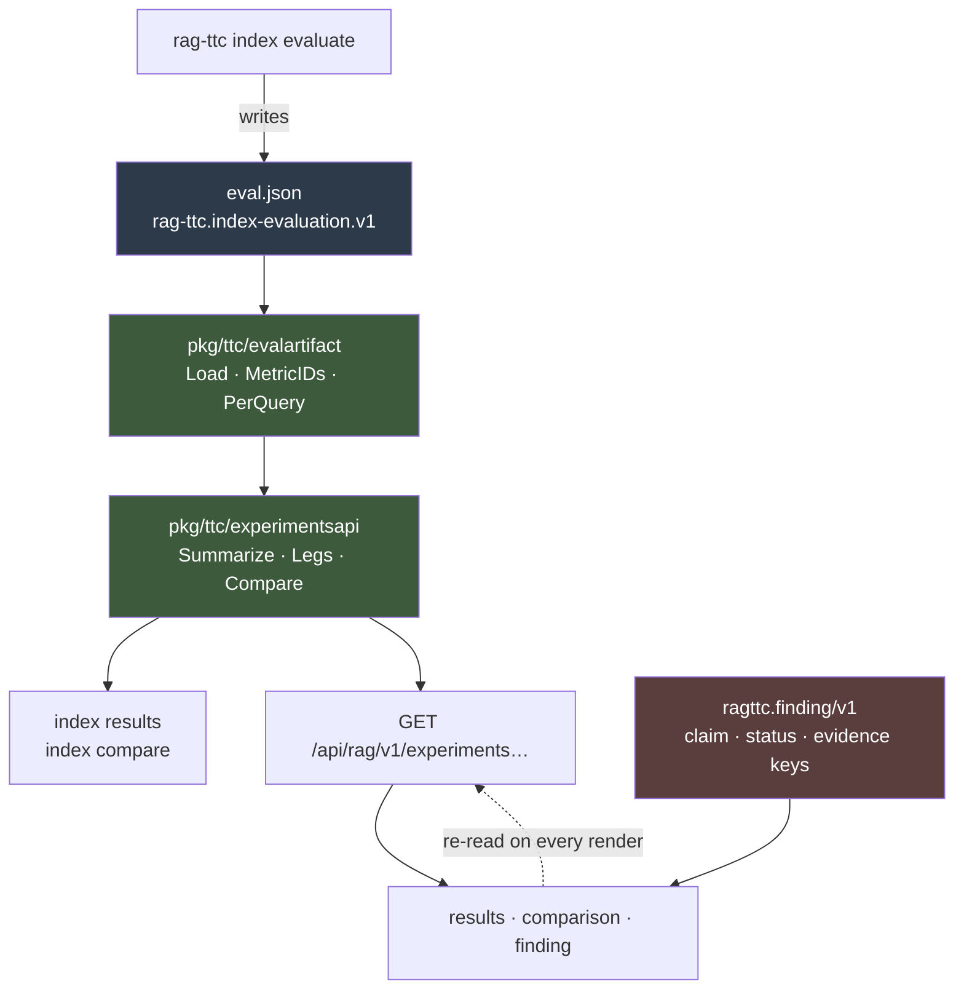

# Optkit Results Surface: Reading a RAG Measurement Without Lying About It

`rag-ttc index evaluate` has been able to measure retrieval quality for weeks. Until this ticket nothing could **read** what it measured. The command wrote a 760 KB JSON artifact and printed six summary rows; the number that actually decided the previous ticket — "18 questions got better, 11 got worse, 115 did not move" — was computed by a Python script that was deleted the same afternoon.

This report covers OPTKIT-029, which turned that artifact into a projection, two CLI commands, and three workbench tiles. It is 4,373 lines across 43 files in one session. The interesting content is not the plumbing. It is that a measurement surface exists to prevent a specific, nameable class of false conclusion, and that every design decision in this one is downstream of naming which class.

Three conclusions were available from the same artifact, all defensible, all reached by looking at a different number. The surface's job is to make the wrong two hard to reach.

> [!summary]
> - **The mean and the distribution disagreed, and the mean was winning.** Adding LLM summaries moved fusion nDCG@10 by +0.0012 while 29 of 144 questions moved and the count of perfectly-answered questions fell from 91 to 90. Nothing in this surface ever renders a mean without the shape behind it.
> - **A comparison without a stated axis has no content.** Summaries helped BM25 (+0.0153 nDCG@10), hurt the vector channel (−0.0063), and did nothing at the RRF fusion that serves users. Three answers to one question; whichever a reader sees first is the one they quote.
> - **`hit_rate_at` omits its zeros, and the program-wide "missing is never zero" rule is wrong for it.** Applying that rule uniformly removes exactly the misses from the denominator, so the metric reads 1.0000 on every leg against true values of 0.7778 to 0.8889 — a metric that can never report anything but perfection.
> - **A claim that stores its own evidence can never be contradicted.** A finding stores reference keys and no numbers; the document validator refuses unknown body keys, so the storage layer enforces falsifiability rather than a convention doing it.
> - **Two of the four defects were invisible to the test suite.** The most important one was a reachability failure: every test passed, the feature worked, and no path through the product could produce an object that used it.

## Why this project exists

The Tree Center runs a retrieval-augmented question-answering system over a corpus of horticultural content. `rag-ttc` is the experimental apparatus around it: a document corpus of up to 3,149 documents, an evaluation set of 148 real questions carrying 243 graded relevance judgments, an index builder that produces immutable bundles, and a retrieval pipeline with a lexical channel, a vector channel, and reciprocal rank fusion over both.

The previous ticket, OPTKIT-027, answered a real question with that apparatus: does paying for an LLM to write a summary of every chunk improve retrieval? The two bundles it measured index a 200-document slice into 1,979 chunks, so the summary bundle cost 1,979 generation calls. The answer was no. Those calls bought a fusion-level result indistinguishable from noise.

Reaching that answer exposed the gap this ticket fills. The evidence for it lived in three places: a JSON file nobody could read, six rows of terminal output that showed only means, and a script. A programme whose entire output is decisions about a retrieval system had no durable way to look at the results those decisions rest on.

## The number that motivates the design

Here is the whole artifact, as the surface now renders it. Two bundles — one indexed from raw chunk text, one from raw text plus LLM-written summaries — measured under three retrieval strategies against the same 144 gradeable questions.

| strategy | representations | nDCG@10 | perfect | zero | p25 |
|---|---|---|---|---|---|
| bm25 | raw | 0.7378 | 76 | 16 | 0.613 |
| bm25 | raw+summary | **0.7531** | 77 | 14 | 0.613 |
| vector | raw | **0.8599** | 87 | 2 | 0.631 |
| vector | raw+summary | 0.8536 | 86 | 2 | 0.631 |
| rrf | raw | 0.8623 | **91** | 2 | 0.765 |
| rrf | raw+summary | **0.8635** | **90** | 2 | 0.765 |

Read the last two rows carefully. The mean rose. The number of questions answered perfectly fell. Both are true, both are computed from the same 144 observations, and they support opposite recommendations.

The per-question view resolves it:

```
ndcg_at@10   18 better · 11 worse · 115 unchanged      mean moved +0.0012
             29 of 144 questions moved (20%)

ttc-y-003      −0.3869   1.0000 → 0.6131
ttc-y-029      −0.3869   1.0000 → 0.6131
ttc-y-048      −0.3691   1.0000 → 0.6309
ttc-y-051      −0.3691   1.0000 → 0.6309
ttc-expand-041 −0.2641   0.8772 → 0.6131
```

Twenty percent of the evaluation set moved. Four questions went from a perfect ranking to one where the correct document is no longer first. The mean absorbed all of it and reported a rounding error.

This is not a subtle statistical point. It is the ordinary shape of retrieval metrics: nDCG over a graded set is bimodal, with most questions at or near 1.0 and a minority near zero. A mean of 0.86 describes almost no individual question. Two configurations with identical means can fail on disjoint sets of questions.

The design rule follows directly, and it is enforced everywhere in the surface: **no view renders a mean without its distribution.** Every leg carries ten histogram bins, the count of perfect and zero questions, and p25/p50/p75/p95. Every comparison leads with better/worse/unchanged counts and prints the mean difference beside them, in that order.

One consequence is worth stating because it looks like a mistake. The histogram bins are **fixed** at ten equal intervals over `[0,1]` for every leg, not fitted to each leg's observed range. Fitted bins produce prettier pictures and make two identical distributions look different, because the axis moves underneath them. Side-by-side comparability is the only thing the histogram is for, so the bins do not move.

## The leg: a comparison needs an axis

The artifact contains two bundles and three strategies. The naive surface offers "compare bundle A with bundle B." That surface cannot be built honestly, because the question has three different answers:

- BM25 gained 0.0153 nDCG@10 from summaries, with a win/loss of 8 better, 1 worse, 135 unchanged. The lexical channel genuinely benefits: a summary introduces vocabulary the raw chunk does not contain, and a term-frequency retriever can match it.
- The vector channel lost 0.0063, with 7 better and 14 worse. Embedding a summary rather than the source text moves the chunk's position in the space away from the questions that were already finding it.
- RRF fusion over both moved +0.0012, with 18 better and 11 worse. The two effects partly cancel, and what remains is noise.

The organising unit of the whole projection is therefore the **leg**: one `(bundle, strategy)` pair, with wire id `<bundle_id>:<strategy>`. It is the only thing in the artifact that has metrics. A comparison is always between two legs, never between two bundles, and the results tile groups legs by strategy and renders every group at once rather than offering a strategy filter. A filter would let a reader see one of the three answers and quote it as the result.

The projection refuses a comparison of a leg with itself:

```
same_leg   baseline and challenger are both "rk-65790ee2…:rrf";
           comparing a leg with itself measures nothing
```

That refusal exists because the alternative is worse than an error. Comparing a leg with itself returns 144 unchanged questions and a mean delta of exactly zero — a well-formed result that looks like a measured tie. Someone would quote it.

## Schema archaeology: when "missing is never zero" is wrong

The programme has an invariant, inherited from the record layer and repeated in every design document: **missing is never zero.** A nil score renders as absent, not `0.00`. A stage that recorded no candidates says "membership only". An unmeasured question is not a question that scored nothing.

Building the projection required reading five metrics off each per-question record. The invariant says: if a metric's cutoff key is absent, the question is ungraded for that metric, and it must be excluded from the mean rather than counted as zero.

That is wrong for one of the five metrics, and the artifact proves it.

The upstream evaluator writes per-question hit rate like this:

```go
// ragkit/rag/evaluation/retrieval.go
if hit {
    result.HitRateAt[cutoff] = 1
}
// no else branch: a miss writes nothing
```

and then aggregates like this:

```go
report.HitRateAt[cutoff] += metrics.HitRateAt[cutoff]  // Go map read: absent == 0
...
report.HitRateAt[cutoff] /= count                       // count = ALL evaluated queries
```

A miss is encoded as the absence of a key, and the absence is read back as zero by the same package that wrote it. Every other metric writes its zeros explicitly.

Counting the artifact confirms the asymmetry is real and confined:

```
across the artifact's six legs (864 per-question records):
  hit_rate_at@1    137 records have no "1" key   (16–32 of 144 per leg)
  hit_rate_at@5     43
  hit_rate_at@10    38
  precision_at, recall_at, ndcg_at, mrr:  0 missing keys anywhere
```

Applying the programme-wide rule uniformly removes precisely the misses from the denominator and leaves only the hits behind. Every remaining record has value 1. The metric becomes:

| leg | true hit_rate@1 | with absence read as "ungraded" |
|---|---|---|
| raw · bm25 | 0.7778 | 1.0000 |
| raw · vector | 0.8681 | 1.0000 |
| raw · rrf | 0.8889 | 1.0000 |

A metric that can never report anything but perfection. It would not have crashed, would not have failed a type check, and would have looked entirely plausible on a dashboard.

The rule that is actually true is asymmetric, and it lives in one function with the reasoning attached:

```go
// PerQuery reads one metric off one query's record.
//
//   - hit_rate_at OMITS a cutoff whose value is zero. Upstream writes
//     HitRateAt[cutoff] = 1 only on a hit, and its own averaging reads the
//     missing key back as 0. So for this metric — and ONLY this metric — an
//     absent cutoff means false, not unknown.
//   - every other metric writes its zeros. An absent cutoff there is a
//     genuinely unmeasured query, and it must stay absent rather than
//     becoming a zero that averages like a real observation.
func PerQuery(metrics evaluation.RetrievalMetrics, id string) (float64, bool) {
    ...
    value, ok := table[cutoff]
    if !ok && name == "hit_rate_at" {
        return 0, true      // absent means false
    }
    return value, ok        // absent means unmeasured
}
```

The method that found this generalises. The bug is undetectable by reading either the writer or the reader in isolation, because each is internally consistent. It is detectable by computing the same quantity two ways and checking both against a third number the artifact already carries — the report's own aggregate. That check is now a permanent test:

```go
// For every leg and every metric: the mean over per-question values,
// computed through PerQuery, equals the artifact's own aggregate.
if math.Abs(computed-reported) > 1e-9 {
    t.Fatalf("%s/%s %s: report says %.9f, per-query mean is %.9f", ...)
}
```

It runs against the real 148-question artifact, committed gzipped at 37 KB rather than 760 KB. Using the real artifact rather than a synthetic fixture is deliberate: the claim the projection has to support is a specific pair of numbers from a specific run, and a hand-built fixture only proves the code agrees with itself.

**A footnote on this report's own accuracy.** The first version of that Go comment, and of the three documents derived from it, said the misreading "would drop 137 of 144 queries at k=1." 137 is the total across all six legs of an 864-record artifact; the per-leg figure is 16 to 32. The error was a denominator taken from one leg and a numerator taken from all of them — the same class of mistake the surface exists to prevent, committed while documenting it. The corrected claim is stronger than the wrong one, which is the usual outcome when a number is checked rather than repeated.

## Architecture

The read path has no writes, no clock, and no provider calls anywhere in it.



Two structural decisions carry most of the weight.

**The artifact schema has one definition and two sides.** Before this ticket, `evaluationArtifact` was a private struct inside the `index evaluate` command. A reader would have needed its own copy of the shape. A schema with a private writer and a separate reader-side copy drifts in a specific and nasty way: the reader keeps parsing successfully, it just stops meaning the same thing. Moving the types into `pkg/ttc/evalartifact` and having the command depend on them makes a schema change a compile error in the reader.

**The projection functions are pure.** `Summarize`, `Legs` and `Compare` take an artifact and return wire views. No I/O, no time, no randomness. The CLI and the HTTP handlers are two thin callers of the same three functions, which is what makes the terminal a real check on the browser: a number that looks wrong in a tile can be verified without a server, a browser, or a token.

The comparison itself is small enough to state completely:

```
for every question either leg evaluated:
    before, hasBefore := baseline[query]
    after,  hasAfter  := challenger[query]
    if not (hasBefore and hasAfter):  ungraded++;  continue
    delta = after - before
    if delta >  epsilon:  better++;    record(query, delta, both rankings)
    if delta < -epsilon:  worse++;     record(query, delta, both rankings)
    else:                 unchanged++
sort recorded by delta ascending      # worst first
```

Three details in that loop are load-bearing.

The universe is every question either leg **evaluated**, not every question that has a value for the chosen metric. Building it from the metric tables would silently drop questions ungraded on both legs, and the counts would still appear to add up. A test pins the invariant: `better + worse + unchanged + ungraded` equals what the run evaluated.

A question graded on one leg and not the other is counted as `ungraded` and never averaged. It is a fact about the run, not a result, and folding it into `unchanged` would hide it.

`epsilon` defaults to `1e-9`. It is float noise, not a significance threshold, and the distinction is documented at the constant. The projection reports what moved; deciding whether the movement matters is the reader's job. Choosing a real threshold would be the projection quietly deciding what counts as an effect, and that is the reader's call to make and defend.

Only the questions that moved are transmitted. The unchanged are counted, not listed — their delta is zero by definition, so the full distribution is recoverable from the counts plus the moved list without shipping 115 rows that all say "nothing."

The refusal taxonomy names six distinct problems, each with a message that says what exists instead:

```
no_experiment_loaded   the server was started without --evaluation-artifact
experiment_not_found   a name was given and no artifact has it
leg_not_found          the experiment has no such (bundle, strategy)
metric_not_found       no leg records that metric
invalid_metric         the metric id does not parse
same_leg               baseline and challenger are the same leg
```

## A finding that can be contradicted

The third piece is a **finding**: somebody's reading of a result, as an object rather than as prose in a report. It carries a claim, a status any reader can move (`proposed` → `accepted` / `disputed` / `withdrawn`), and evidence.

The mechanism that makes it worth having is a negative one. **A finding stores no numbers.**

```
ragttc.finding/v1 — every permitted key, and nothing else:
  experiment   required   the artifact this reads
  claim        required   may be empty (unfinished is not malformed)
  status       required   proposed | accepted | disputed | withdrawn
  baseline     optional   \  all-or-nothing with challenger
  challenger   optional   /
  metric       optional   which metric the comparison is read under
  evidence     optional   reference keys, never values
  dispute      optional   REQUIRED when status is disputed
  author       optional
```

The document validator refuses any body key it does not recognise, so `mean_delta` cannot be written into a finding at all. Evidence is stored as reference keys — `queryOutcome:eval-raw-vs-summary/rk-65790ee2…:rrf->rk-7e257c3a…:rrf/ndcg_at@10/ttc-y-003` — which the tile resolves against the live projection at render time. When a finding names a comparison, the tile re-reads that comparison on every render and prints today's counts directly beneath the claim.

That is what "disputable" means here, and it is enforced by the storage layer rather than by a convention. After a rebuild, the sentence "summaries are noise at the fusion" sits above numbers that either still support it or no longer do. A finding that carried its own supporting numbers would agree with itself forever; the status field would be decoration.

Two smaller rules follow from the same idea.

**A dispute states its reason**, refused in three places: the TypeScript parser, the verb handler, and the Go validator. A status that records disagreement and cannot record why is not data.

**Disputing is not a menu item.** It carries prose, and the codebase's own precedent — `intent.setHypothesis` has no menu row either — is that a verb requiring prose is authored in a surface that can ask for it. A "Dispute" menu item that filed an empty reason would produce exactly the contentless status the validator refuses.

The metric travels in the pointer document alongside the two leg ids, which looks redundant until the numbers are compared. The same two legs read under `ndcg_at@10` are 18/11/115; under `recall_at@10` they are 8/1/135. A comparison read under a different metric is a different comparison, and a finding that cites one must reopen exactly that one.

## What the tests could not find

Seventy-three TypeScript tests and the full Go suite passed before the surface was ever opened in a browser. Running it produced four defects, and the classification is more useful than the list.

**One was cosmetic.** Finding document ids were `finding-<base36>`, and tile titles render the first eight characters of a document id. Every finding tile read `finding · finding-`. Renaming the prefix to `fnd-` fixed it.

**One was a legibility failure.** Evidence chips rendered their raw reference key: for a cited question outcome, roughly a hundred characters of bundle digest where a label belongs. They now render the descriptor's label with the key in the identifier tray, matching how every other identifier is presented in this workbench.

**One was a reachability failure, and it is the important one.** A finding created from the experiment chip carries no baseline or challenger, so it names no comparison, so the tile has nothing to re-read. Every finding the product could actually create was one that could never contradict itself — the entire disputability mechanism was unreachable through the user interface. Every test passed. The feature worked. No path through the product used it.

That defect is invisible to unit tests by construction. A test of the re-read constructs a finding with a comparison and asserts the re-read happens; it cannot observe that no user gesture produces such a finding. The fix was a button on the comparison tile that seeds a finding with both leg ids and the metric.

**The fourth was in the documentation**, and it is the `137 of 144` error described above — a wrong number in a Go doc comment, an intern guide, a handoff, and a diary, all propagated from one unchecked claim. It was found by recomputing the figure while writing this report rather than copying it forward.

The generalisation: **tests verify that a path works; they do not verify that the path is reachable, that the output is legible, or that a stated number is true.** All three of those require using the thing and checking its claims.

## Implementation details

### Metric identifiers are discovered, not enumerated

A metric is either a scalar name (`mrr`) or a name and a cutoff (`ndcg_at@10`). The available cutoffs depend on the evaluation run's `retrieve_k`, so they are read out of the report rather than hardcoded:

```go
func MetricIDs(report evaluation.Report) []string {
    ids := append([]string{}, ScalarMetrics...)          // mrr
    for _, name := range CutoffMetrics {                  // precision_at, recall_at, ndcg_at, hit_rate_at
        cutoffs := keysOf(aggregate(report, name))
        sort.Ints(cutoffs)
        for _, cutoff := range cutoffs {
            ids = append(ids, MetricID(name, cutoff))     // "ndcg_at@10"
        }
    }
    return ids
}
```

An evaluation run at `k=20` therefore reports its own cutoffs. Hardcoding `{1,5,10}` would have made such a run silently display the wrong numbers under the right labels.

The default metric is nDCG at the run's own `retrieve_k`. Falling back to the first metric alphabetically opens the surface on `hit_rate_at@1`, which moves for reasons unrelated to whatever change is under test.

### The distribution summary

```go
type MetricSummary struct {
    Metric      string
    Mean        float64             // the artifact's OWN aggregate, not a recomputation
    Graded      int
    Ungraded    int
    Minimum     *float64            // absent when nothing was graded; never 0
    Maximum     *float64
    Perfect     int                 // value >= 1
    Zero        int                 // value <= 0
    Percentiles map[string]float64  // p25 p50 p75 p95
    Buckets     []BucketView        // ten fixed bins over [0,1]
}
```

`Mean` is the artifact's published aggregate rather than a recomputation, because it is the number a reader will already have written down; the test above proves the two agree. `Perfect` and `Zero` are separate fields rather than derivable-at-render because they are the shape of the distribution: 91 perfect and 2 zero out of 144 is a completely different system from an even spread with the same mean, and that distinction changes what a reader does next.

`Minimum` and `Maximum` are pointers so that "nothing was graded" is representable without a sentinel.

### Naming and identity

An experiment is named by its file's base name — what the operator typed — so a URL and a shell history line refer to the same thing. Two artifacts resolving to one name are refused at startup rather than silently shadowed, because two artifacts under one name make every comparison ambiguous while looking perfectly normal.

Serving the experiments routes requires nothing else: no index bundle, no embedding provider, no tool configuration. Reading what an evaluation measured needs none of those, and the independence was verified by starting a server with an artifact and nothing else and curling all three routes.

### The presentation type graph

The workbench models every domain object as a presentation type with a menu derived from an inheritance graph. This ticket added four types and one abstract node:

```
inspectable
└── citable            ← new: things a claim about a measurement can point at
    ├── experiment     ← new
    └── watchable
        ├── leg            ← new
        ├── queryOutcome   ← new
        ├── case, verdict, arm, chunk, delta, document
        └── …
```

The first attempt put "Cite as evidence" on `inspectable`, which added a greyed row to all thirty types including pipeline stages, configuration layers and optimization variables — objects that are configuration, not evidence. Six golden menu tests failed at once, which was the correct outcome: the golden tests are the specification for this vocabulary, so six of them changing meant six menus that had not been thought about.

The fix was not to suppress the row but to say which types it belongs on, and the type graph is the existing mechanism for exactly that. Placing `watchable` beneath `citable` encodes a real claim: everything worth tracking over time is worth citing.

A `leg` and a `queryOutcome` are watchable, where a search `hit` is not. A hit is a fact about one ad-hoc query and dies when that query's scratch run is cleared; an outcome is a reproducible fact about a measurement, and is exactly the kind of thing worth still looking at after the next rebuild.

### The vocabulary fence

The workbench exports its verb and type vocabulary for an agent to plan against. That export has a compile-time exhaustiveness assertion: every `ProductVerb` kind must appear in the schema the agent is given. Adding two navigation verbs produced two independent compile errors before any test ran:

```
src/chat/verbs.ts(154,26): Type '"open.experiment"' is not assignable to …
vocabulary.ts(26,14): Type '{ campaign: string; … }' is missing the following
  properties from type 'Record<keyof Values, string>': experiment, leg, queryOutcome
```

It was not possible to add a menu item an agent would not know about. That is the "one vocabulary" invariant working: anything a human can do from a menu is a verb an agent could request and a trace will record.

## Current status

Complete, verified against the real artifact, and merged across seven commits.

| Measure | Value |
|---|---|
| Lines added | 4,373 across 43 files |
| New Go packages | 3 (`evalartifact`, `experimentsapi`, `apienvelope`) |
| New CLI commands | 2 (`index results`, `index compare`) |
| New HTTP routes | 3, all GET, all free |
| New tiles | 3 (`results`, `comparison`, `finding`) |
| New presentation types | 4 |
| Tests | 73 TypeScript, full Go suite, lint clean |
| Provider calls made by the surface | 0 |

The projection reproduces every number from the previous ticket's handoff: BM25 recall@10 `+0.0197`, vector nDCG@10 `−0.0063`, and RRF `18 / 11 / 115`.

## Open questions

- **Does `index evaluate` become a campaign, or stay a standalone runner?** This is the programme's live architectural fork (tracked as OPTKIT-025 G3, the instrument seam). This ticket was scoped to *reading* specifically so the fork stays open — a campaign-backed runner publishing the same artifact would serve these routes unchanged. The next substantial piece is running an evaluation from the workbench, and it cannot avoid the question.
- **What counts as noise?** The surface renders the distribution and never names it. `epsilon` is documented as float precision and explicitly not a significance threshold. Somebody has to decide the rule, and it is a judgement about this data rather than a statistic to look up.
- **Where does a decision live?** A finding is a workbench document: per-workbench UI state, with no actor, no digest, no journal, and no query surface beyond a full scan. A *decision* that must surface whenever anyone inspects a configuration months later needs the campaign store's durability and attribution instead. That is the first real backend decision in the follow-up ticket.
- **What does a decision bind to?** A sealed candidate record carries the durable configuration identity — arm id, parent arm id, seal digest, patch, invalidation plan. But the evaluation artifact's legs are *bundles*, not pipeline configurations, so a finding about `rk-65790ee2:rrf` currently has no path to an arm. Bridging that is the same seam as the catalog-to-`SearchConfig` mapping.
- **Retrieval is deterministic, so "more repeats" is not a lever.** BM25 and vector search over a fixed bundle with a cached query embedding return the same ranking every time. Variance enters only with a stochastic judge, which does not exist yet. Any confidence advice offered today can only suggest more questions or a tighter comparison.

## Near-term next steps

- Finish the agent path: an agent drafts a finding, cites the questions supporting it, and parks it `proposed` for a human to accept or dispute. The verbs are already in the exported vocabulary; the Go chat server does not yet embed that export, which is the concrete gap.
- Add a findings list. A finding is currently reachable only from the tile that created it, which is adequate for one and useless for six.
- Give decisions a durable home in the campaign store, bound to a configuration, with a chronological read over them.
- Partition the 148 questions into answerable, partially answerable, and not covered, searched generously across all strategies rather than by one configuration. This separates a retrieval problem from a content problem, which route to different people.

## Working rules

These generalise past this ticket.

- **Reconstruct the oracle before writing the code that will be checked against it.** The first commit here was the deleted Python script, rebuilt with an `--expect 18/11/115` flag that fails loudly. Everything after had something to be wrong against.
- **Test against the real artifact, not a synthetic fixture.** A fixture proves the code agrees with itself. The claim being supported was a specific pair of numbers from a specific run.
- **When two computations should agree, check them against a third number that already exists.** This is what found the `hit_rate_at` asymmetry, which is invisible from reading either side alone.
- **A well-formed result that looks like a measurement is worse than an error.** Comparing a leg with itself, or answering from a bundle other than the one asked about, both produce output somebody will quote. Refuse them by name.
- **State what the type graph means rather than putting an action everywhere and hiding it.** A greyed row that explains itself teaches the workflow; a row on thirty types teaches nothing.
- **Reachability is not correctness.** Drive the product, not the API. The most serious defect here had a passing test for the feature and no user gesture that could reach it.
- **Recompute a number before repeating it.** A figure copied from a paragraph into a doc comment, a guide, a handoff and a diary is one unchecked claim in four places.

## Related notes

- [[PROJ - PBUI Multi-Agent Workbench Completed - The Session Index, the Merge, and What the Code Refused]]
- [[PROJECT REPORT - Unified RAG Runtime - Bounded Content Source Authority and Three-Repository Cutover]]
