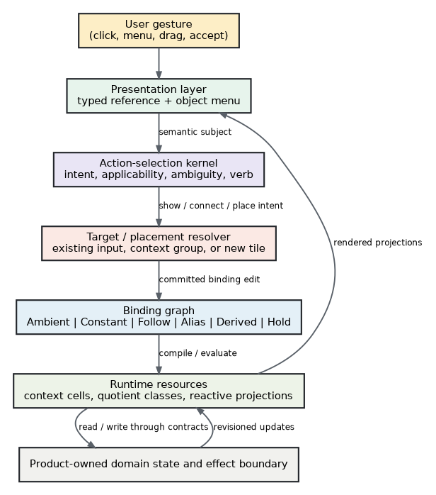
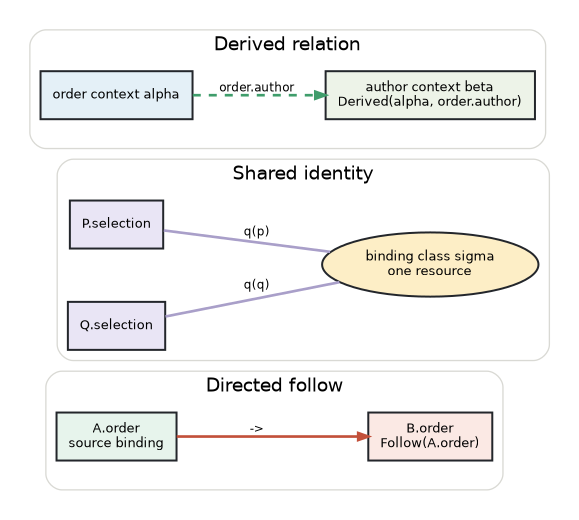
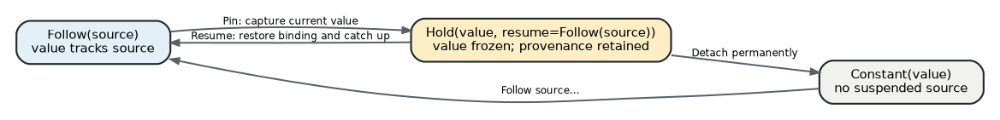
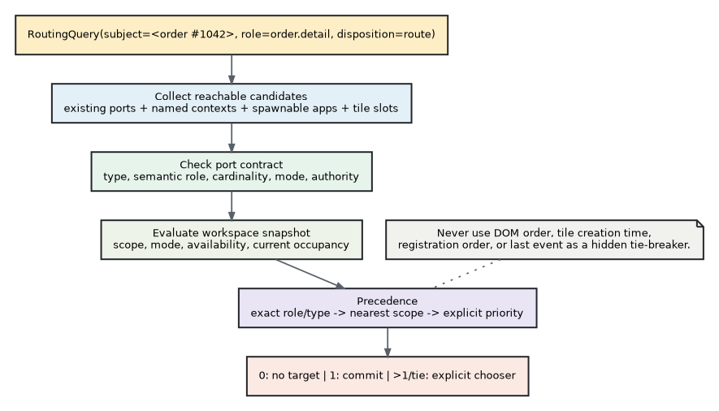
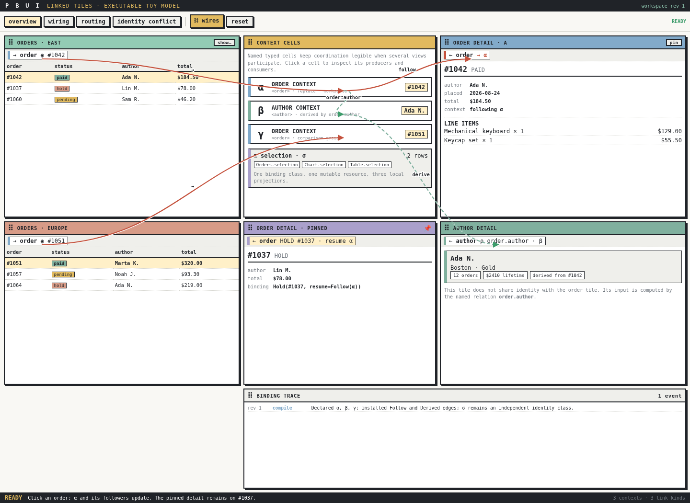
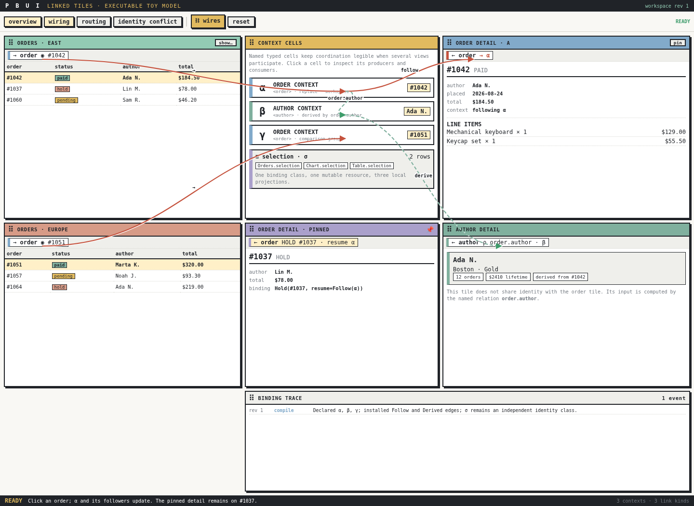
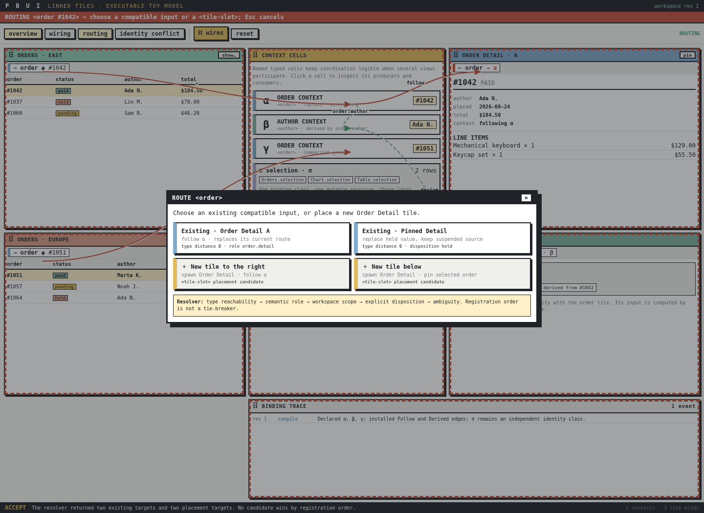
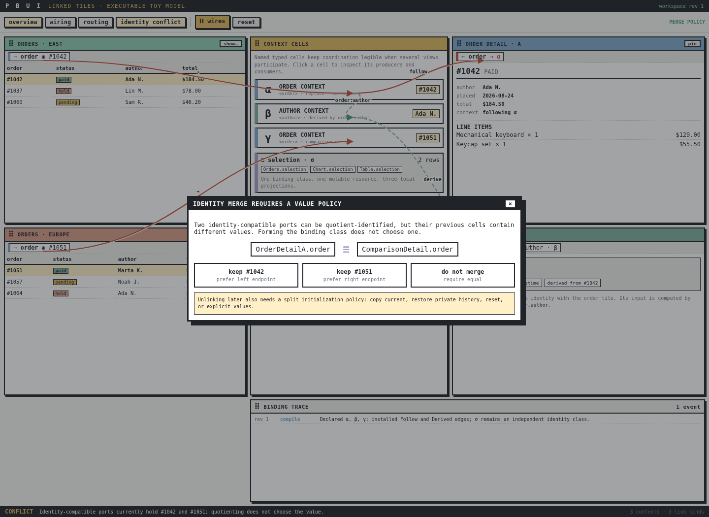
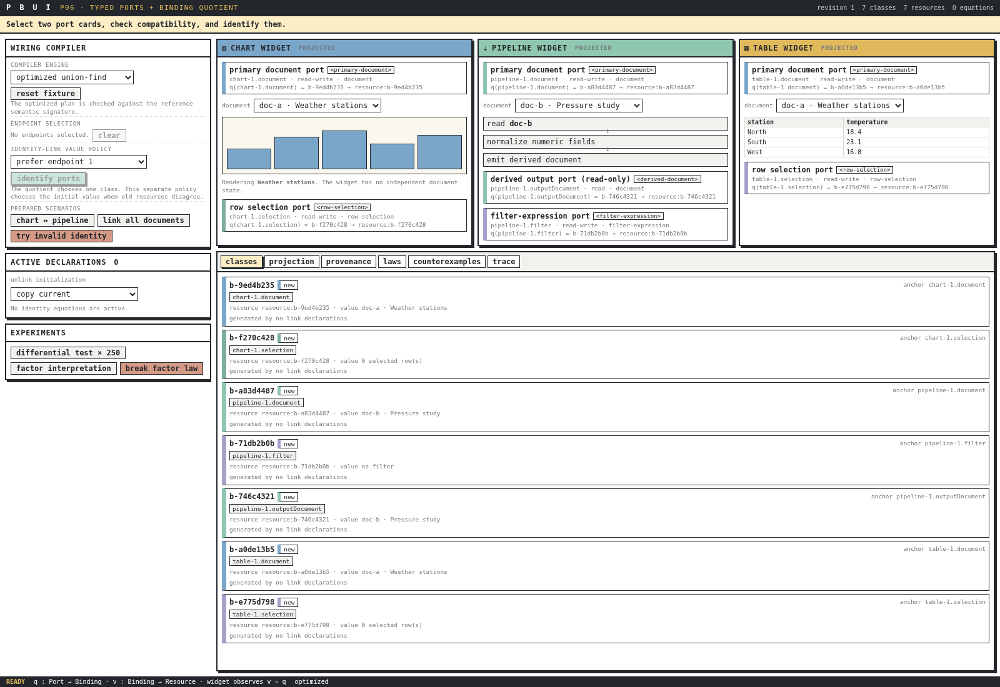

# Linked Tiles in Presentation-Based User Interfaces

This is the original PBUI linked-tiles research report that is the subject of the reading pack retrieved in [[PROJECT REPORT - PBUI Reading Pack - Retrieving Paywalled and Cloudflare-Protected Papers]]. It is mirrored here as a first-class vault report so the report and its bibliography evidence live together. The source markdown and a rendered PDF copy live in `_assets/pbui-reading-pack/` (see `linked-tiles-research-report.md` and `linked-tiles-research-report.pdf`); the 32 retrieved open-access paper PDFs cited by this report are in `_assets/pbui-reading-pack/papers/`. Figure and screenshot references below have been rewritten to resolve against that `_assets` folder from this dated section.

> [!summary]
> - A presentation-based user interface can make every visible object semantically active, but a workspace of many independently configurable tiles makes the single verb *link* hide several different semantics: follow, pin, share identity, derive through a named relation, or appear on demand.
> - The report separates the problem into **routing**, **binding**, **identity sharing**, **derived coordination**, **lifecycle**, and **placement**, and surveys CLIM presentation types, direct manipulation, coordinated multiple views, Snap-Together Visualization, Improvise, reactive/declarative dataflow, constraint and propagator systems, bidirectional transformations, and multi-window workspace management.
> - The central recommendation is a hybrid model with a small semantic core: ports carry typed **bindings** (not copied content); a binding algebra of ambient context, constants, directed followers, shared aliases, derived relations, and held/pinned values; and three deliberately distinct visual operators — `A → B` (follow), `A ≡ B` (share identity), `A --ρ→ B` (derive through relation ρ).
> - Ambient contexts make simple master-detail layouts require no wiring ceremony; identity links compile compatible port equations into typed quotient classes with one shared resource; derived links name domain relations and become bidirectional only with an explicit lens-like update law; pinning suspends a follower rather than destroying it; a sibling target resolver reuses the action kernel's type graph to route "show this order" to an existing tile or a typed placement target.
> - A dependency-free toy implementation accompanies the report (independent order contexts, followers, held tiles, derived author coordination, shared selection, late-bound routing, merge conflicts, an inspectable binding trace); the report closes with pseudocode, an API sketch, testable invariants, an empirical evaluation plan, and an incremental implementation roadmap.

---


# Abstract

A presentation-based user interface can make every visible object semantically active: an order row is not merely text but an `<order>` presentation; an author chip is an `<author>` presentation; a tile is itself a manipulable object; and commands may pause while the user supplies an acceptable typed object. That model becomes substantially more difficult when a workspace contains many independently configurable tiles. A user may want an order-detail tile to follow a table, stay pinned to one order, share a selection with another view, derive an author from the current order, or appear on demand when no suitable tile exists. The common verb *link* hides several different semantics.

This report separates the problem into **routing**, **binding**, **identity sharing**, **derived coordination**, **lifecycle**, and **placement**. It surveys the relevant literature in CLIM presentation types, direct manipulation and instrumental interaction, coordinated multiple views, Snap-Together Visualization, coordination-object systems such as Improvise, reactive and declarative dataflow, constraint and propagator systems, bidirectional transformations, and multi-window workspace management. It then relates those traditions to the supplied PBUI prototypes: the agent workbench's typed directional ports, the PBUI-ACTIONS-1 action-selection kernel, and the P06 typed binding-quotient compiler.

The central recommendation is a hybrid model with a small semantic core and several interaction surfaces. Ports carry typed **bindings**, not copied content. The binding algebra contains ambient context, constants, directed followers, shared aliases, derived relations, and held/pinned values. Three visual operators are deliberately distinct:

$$
A \rightarrow B \quad\text{follow}, \qquad
A \equiv B \quad\text{share identity}, \qquad
A \xrightarrow{\rho} B \quad\text{derive through relation }\rho.
$$

Ambient contexts make simple master-detail layouts require no wiring ceremony. Directed follow expresses asymmetric provenance. Identity links compile compatible port equations into typed quotient classes with one shared resource per class. Derived links name domain relations such as `order.author`; they are not treated as identity and become bidirectional only when an explicit lens-like update law exists. Pinning suspends a follower rather than destroying it, so unpinning restores provenance. A sibling target resolver reuses the action kernel's type graph, snapshots, stable candidate identity, explanation, and ambiguity discipline to route “show this order” to an existing tile or to a typed window-manager placement target.

A dependency-free toy implementation accompanies the report. It demonstrates independent order contexts, followers, held tiles, derived author coordination, shared selection, late-bound routing, merge conflicts, and an inspectable binding trace. The report closes with pseudocode, an API sketch, testable invariants, an empirical evaluation plan, and an incremental implementation roadmap.

# Executive synthesis

## The recommendation in one page

The design should not choose between “global selection,” “patch cables,” or “shared state” as if they were competing implementations of one concept. They are different concepts that can coexist in one workspace:

1. **Ambient context** is the default. An unconfigured order-detail tile reads a named workspace context such as `workspace.order.current`.
2. **Directed follow** is explicit asymmetric coupling. `OrdersA.order → DetailA.order` means the detail follows that particular source and exposes its provenance.
3. **Shared identity** is symmetric aliasing. `TableA.selection ≡ ChartA.selection` means both ports name one binding cell, not that two callbacks happen to copy values in both directions.
4. **Derived coordination** is a named relation. `DetailA.order --order.author→ AuthorDetail.author` applies a domain relation with declared cardinality and failure behavior.
5. **Hold/pin** is a binding state. It captures the current value while retaining a suspended source to resume later.
6. **Named context groups** become visible when many tiles participate. A context node such as `order·α` is a typed cell or hyperedge that reduces wire clutter and gives the group an inspectable identity.
7. **Late-bound routing** handles absence and multiplicity. “Show details” resolves existing compatible tile ports and spawnable tile placements; zero, one, and many candidates are distinct outcomes.
8. **Constraint/propagator coordination** is reserved for domains where contributors accumulate partial information rather than overwrite a single current object.

The user interface should expose several equivalent instruments over this one model: object menus, a small binding badge in every tile header, a link mode that highlights compatible ports, drag-and-drop shortcuts, an accept-style target chooser, and an optional coordination inspector. Wires should be available on demand rather than permanently covering the workspace.

The implementation should preserve the narrowness of PBUI-ACTIONS-1. Action resolution and binding resolution should be sibling kernels with shared vocabulary, not one generalized meta-language. The action kernel answers “which verb applies?” The binding/target kernel answers “where and under what relationship should this typed value be observed?” Both should be pure over an explicit snapshot, return ambiguity as data, produce a trace from the same path that produced the result, and revalidate before durable mutation.

## Why this is preferable to a single link model

A single edge type creates semantic accidents. If every link is a callback, symmetric identity becomes an unstable cycle. If every link is shared state, an order-to-author relationship becomes type laundering. If every tile follows one global current order, multiple independent tables compete through hidden temporal last-writer behavior. If every interaction requires wire editing, ordinary master-detail work becomes unnecessarily expensive. If every “show” command creates a new tile, workspaces grow without bound; if it always reuses a tile, pinned comparisons are overwritten.

The hybrid separates these cases while keeping the visible notation small. It also creates clear answers to lifecycle questions. Cutting a follow edge can freeze or clear a target. Splitting an identity class requires an explicit initialization policy. Removing a derived relation cannot invent an inverse. Closing a source can suspend, freeze, re-route, or clear followers according to declared policy. These are product decisions instead of incidental consequences of callback order.

## Core invariants

The proposed architecture is governed by the following invariants:

- A presentation reference is semantic data, never a DOM identity.
- Ports are local names for bindings; links do not copy tiles or domain objects.
- Direction is meaningful: `A → B` is not interchangeable with `A ≡ B`.
- Identity compatibility is stronger than payload-type equality.
- Transformed coordination names a relation and declares cardinality.
- Registration order, creation time, and screen position never resolve semantic ambiguity.
- A pinned tile retains its suspended source unless explicitly detached.
- A menu row or routing result is not durable authority; execution revalidates.
- Hidden coupling must have a visible, inspectable representation somewhere in the interface.
- Unlink, merge, source-close, and placement behavior are explicit policies.

# 1. Scope, method, and source status

## 1.1 Research questions

The report addresses five questions.

**RQ1.** What distinct meanings are hidden by the phrase “link two tiles” in a presentation-based, window-manager-style interface?

**RQ2.** Which user interactions make those meanings efficient for both ordinary and expert workflows?

**RQ3.** What mathematical models provide honest semantics for direction, aliasing, transformation, ambiguity, and lifecycle?

**RQ4.** Which parts of the supplied PBUI work can be reused, and where should new machinery remain separate?

**RQ5.** How can the design be evaluated empirically rather than only argued from elegance?

## 1.2 Attached implementation basis

The primary implementation basis is the material supplied with this project.

The **PBUI agent workbench** presents all visible entities as typed, live presentations. Its current port system gives tile applications named typed slots with `in`, `out`, or `inout` direction. A port carries a binding, not content: binding a document port to document α means that the tile looks at α; a link from one document port to another pushes the source's retargeting into the destination. A manually set or incoming binding overrides the workbench's prior implicit global bus, while clearing the binding returns the tile to that fallback [@pbuiworkbench2026].

The **PBUI-ACTIONS-1 design** separates representation descriptors from independently contributed actions. It defines a validated nominal runtime type graph, immutable revisioned selection snapshots, availability states, stable rule and action identities, registration-order-independent resolution, explicit ambiguity, compact traces, direct translators, and fresh re-resolution before execution [@pbuiactions2026]. Although its approved first phase is intentionally unary and narrow, its design discipline is directly reusable for target routing.

The **PBUI action-selection lab** explores a larger research space, including subtype inheritance, scopes and modes, direct translators, multi-subject dispatch, history projections, revalidation, and ambiguity. Some of these mechanisms were deliberately deferred from the production action design, so the lab is treated as an executable hypothesis space rather than the final core contract [@pbuiactionlab2026].

The **P06 typed ports and binding quotient compiler** gives identity wiring a more rigorous semantics than the agent workbench's pairwise propagation links. It partitions ports by normalized identity contracts, compiles endpoint equations into typed equivalence classes, assigns persistent class identities independently of union-find representatives, allocates one shared resource per class, and treats merge and unlink initialization as explicit policies [@p06report2026].

## 1.3 Literature-search method

The external survey prioritized primary papers, author-hosted manuscripts, institutional repositories, official project pages, and publisher records. It covers work from the early direct-manipulation and CLIM literature through coordinated multiple views, reactive visualization systems, and recent declarative coordination libraries. The search was updated through **August 27, 2026**. Recent work is included to locate the design relative to current implementation practice, but the architecture is not made dependent on any unreviewed trend.

The report distinguishes three levels of claim:

- **Source-derived claims** summarize attached artifacts or cited papers.
- **Design synthesis** combines those ideas into a PBUI-specific proposal.
- **Open questions** identify points not settled by the sources or prototype.

## 1.4 Copyright and reading-pack policy

The bundle contains the supplied source artifacts and an indexed reading pack. Full external papers are included only where redistribution permission is clear enough for this delivery; otherwise the bundle contains stable citation records, direct access links, and a retrieval script. This avoids silently republishing publisher-controlled material while still making the literature reproducible.

# 2. Problem decomposition: six problems, not one

Consider an e-commerce workspace with two order tables, several order details, an author detail, a fraud panel, and an empty region in the window-manager layout. A user clicks `<order #1042>`. Several independent questions arise.

## 2.1 Routing

Routing asks:

> Which existing or potential destination should receive this presentation?

A route may reuse an unpinned detail, target a detail already associated with the source table, open a chooser among compatible details, create a new detail tile, or ask the user to choose a placement region. Routing is a search and resolution problem. It is not yet a persistent relationship.

## 2.2 Binding

Binding asks:

> What does this destination observe after routing completes?

The destination might be fixed to #1042, follow the selected order in Table A, follow the workspace's ambient order, alias a shared binding class, or derive its value from another binding. Binding is persistent workspace configuration.

## 2.3 Coordination

Coordination asks:

> What relation connects changes at one participant to observations at another?

Identity, copy, follow, projection, join, filter derivation, and bidirectional consistency are different relations. “Order detail and author detail are linked” most likely means a function or relation `order.author`; it does not mean their values are equal.

## 2.4 Lifecycle

Lifecycle asks:

> What happens when a user pins, unpins, cuts, closes, duplicates, replaces, or moves a participant?

A design that specifies propagation but not lifecycle is incomplete. Pinning may freeze a value while remembering a source. Closing a source may freeze followers, clear them, reroute them to ambient context, or mark them unresolved. Splitting an identity class requires a policy for the new cells' initial values.

## 2.5 Placement

Placement asks:

> Where does a new destination live in the workspace?

In a WM-style PBUI, placement is not a minor rendering detail. A new tile may split the source, occupy an empty leaf, open in another workspace, replace an existing application, or become a transient popover. A placement zone can itself be a typed presentation accepted by a command.

## 2.6 Explanation and control

Explanation asks:

> How can the user predict why a tile changed, what it follows, and how to stop or resume that behavior?

This is the human-factors counterpart to provenance. Coordinated-view systems repeatedly find that users lose track of which views are coupled. The topology must therefore be inspectable through badges, highlighting, traces, or a metavisual coordination view.

## 2.7 A canonical order scenario

The design target can be expressed as the following state:

```text
Orders Table A
  order  →  order context α
                 ├─ Order Detail 1  [following α]
                 ├─ Order Detail 2  [held at #991; resume α]
                 └─ order.author → author context β
                                      ├─ Author Detail
                                      └─ Author Activity

Orders Table B
  order  →  order context γ
                 └─ Order Detail 3  [following γ]
```

A click in Table A changes α and therefore the author derived through β. The held detail stays at #991 but knows how to resume α. Table B remains independent. A “show details” command can reuse a suitable detail or offer a WM placement target when none exists.

{width=94%}

# 3. Foundations in the supplied PBUI work

## 3.1 Presentations as semantic references

CLIM's enduring contribution is the separation of a domain object, its semantic type, and its current visual representation. The supplied PBUI follows that tradition: an object can be re-presented in many tiles while retaining a typed reference and an object menu. This makes target selection and link construction natural PBUI operations because ports, links, contexts, and even placement zones can themselves be presentations.

The interaction implication is important. A command need not open a conventional configuration form containing every object in the workspace. It can enter an accept mode and let the user point at an already visible typed object. In the proposed design, the acceptable target may be an `<order-detail-port>`, a `<context order>`, a `<tile>`, or a `<tile-slot>`.

## 3.2 The action kernel as a model of disciplined resolution

PBUI-ACTIONS-1 provides a reusable pattern:

```text
semantic reference + query + immutable snapshot
                 ↓
validated declarations and type reachability
                 ↓
applicability → specificity → scope → explicit priority
                 ↓
unique result, explained unavailability, or ambiguity
                 ↓
fresh revalidation before effect
```

The binding system should not be implemented as another action family, because topology and action selection have different state and lifecycle. It should, however, share the following vocabulary:

- the nominal runtime type graph;
- stable declaration and candidate IDs;
- scopes and explicit contextual facts;
- immutable revisioned snapshots;
- direct translators with no implicit path search in the first phase;
- availability with explanations;
- ambiguity as a result rather than first-match behavior;
- compact provenance emitted by the real resolution path;
- fresh revalidation before changing workspace topology.

This common vocabulary makes a future developer inspector coherent: the same type graph can explain why an action is inherited, why a tile port accepts an order, and why an order can be translated into an author only through a named relation.

## 3.3 The agent workbench's binding-over-content model

The agent workbench already has a productive asymmetric model. A tile declares typed directional ports. A binding stores the typed object at a port. A link pushes that binding from source to destination. Two tiles that point to the same chart document edit the same world object; the wire moves the pointer rather than copying the document [@pbuiworkbench2026].

This model has several strengths:

- it is compatible with the existing global selection bus;
- it gives links explicit direction and visible provenance;
- it allows exact type matches and named adapters;
- it supports direct manual binding via accept mode;
- it makes ports and links themselves inspectable presentations;
- it exposes source-close and fan-in policy in the tile's back side.

It also reveals where the research must go further. The current bidirectional operation is two directed links with cycle suppression. That is useful behavior, but it does not state that two local names are one identity. Fan-in uses first- or last-writer policy, which may be suitable for some event-like ports but is unsafe as the default meaning of a single-valued business context. Adapter functions also need a clearer boundary between harmless projection and a domain relation with cardinality and update semantics.

## 3.4 P06 and the distinction between follow and identity

P06 studies a narrower operation: **identity wiring**. Its central statement is not “A updates B,” but:

> The local names `A.port` and `B.port` denote one global binding.

For every normalized contract fiber $\kappa$, P06 collects local ports $P_\kappa$ and endpoint equations $R_\kappa$. The two endpoint functions

$$
s_\kappa,t_\kappa:R_\kappa\rightrightarrows P_\kappa
$$

are coequalized by a quotient map

$$
q_\kappa:P_\kappa\rightarrow Q_\kappa,
\qquad q_\kappa\circ s_\kappa=q_\kappa\circ t_\kappa.
$$

In finite sets, this is the connected-component partition generated by undirected identity equations. A runtime resource is allocated per class, and all projections in one class alias that resource. P06 correctly separates this mathematical structure from four operational policies:

- which old value wins when unequal cells are merged;
- how split cells are initialized on unlink;
- how long-lived binding IDs survive topology change;
- how reads and writes are authorized and scheduled.

That separation is the foundation for using `≡` as a genuinely different operator from `→`.

## 3.5 The role of typed port contracts

P06's most important practical lesson is that a payload type is not an identity contract. Two ports may both carry `OrderRef` or `DocumentRef` while having different semantic roles, mutability, authority, cardinality, or lifetime. The proposed system therefore normalizes a port contract with at least:

```ts
interface PortContract {
  valueType: RuntimeTypeId;
  semanticRole: string;
  cardinality: "one" | "optional" | "many";
  mode: "read" | "write" | "read-write" | "event-source" | "event-sink";
  authorityDomain: string;
  updateAlgebra: string;
  lifetime: "tile" | "workspace" | "persistent" | "replicated";
}
```

Identity compatibility is initially definitional equality of normalized fields. Directed or derived compatibility uses explicit, named declarations rather than weakening identity equality.

# 4. Literature survey

## 4.1 CLIM presentation types: semantic output and typed acceptance

CLIM is not merely a widget set. Its presentation layer tags output with semantic type and object identity, then establishes typed input contexts in which the user can type or point to an acceptable presentation [@rao1991clim; @moore2008clim]. Moore's implementation account is especially relevant because it emphasizes presentation-type inheritance, method dispatch, and translators as an object system for interaction rather than a visual class hierarchy [@moore2008clim].

Three CLIM ideas matter directly.

First, **output is retained as semantic interaction material**. A row rendered several function calls deep can still satisfy a later command's request. That supports source-first interactions such as “show this order” and target-first interactions such as “bind this tile's author port; now click an author.”

Second, **acceptance is a temporary global interaction mode with a type contract**. A placement resolver can therefore ask for one of several semantic target types instead of opening a monolithic modal. The PBUI action design's later direct-translator proposal is a disciplined modernization: subtype acceptance preserves the original concrete reference; direct translators are named; multiple paths produce a chooser rather than first-match behavior.

Third, **presentation types are not data coercions**. A type relationship governs applicability and acceptance, but does not justify pretending that a child payload has a parent's memory representation. This aligns with both PBUI-ACTIONS-1 and the proposed separation between an `order` port and an `author` port connected by `order.author`.

CLIM by itself does not provide a modern answer to persistent multi-tile topology. Its contribution is the semantic substrate and the typed gesture model. The binding graph is a layer above it.

## 4.2 Direct manipulation: visible objects, reversibility, and semantic distance

Shneiderman characterized direct manipulation by continuous representation of the objects of interest, physical actions instead of complex syntax, and rapid, incremental, reversible operations with immediately visible effects [@shneiderman1983direct]. Hutchins, Hollan, and Norman analyzed directness in terms of the gulfs of execution and evaluation and the semantic and articulatory distances between intention, action, system state, and feedback [@hutchins1986direct].

These criteria argue against hiding all coordination in a global bus. The user should be able to see, at least on demand, that a detail follows Table A, is held at #1042, or derives an author through a relation. They also argue against making the full graph permanently visible: excessive wires increase perceptual and articulatory cost. The right target is **progressive directness**:

- ordinary operation uses a compact binding badge;
- hovering or selecting a badge highlights its group and immediate provenance;
- link mode exposes compatible ports and placement targets;
- a coordination inspector reveals the complete graph;
- all topology operations are undoable and have previews.

Reversibility must be semantic rather than merely historical. “Unpin” should resume the suspended source because that is the user's likely inverse intention. “Unlink identity” cannot generally restore private pre-merge values without history, so the interface must ask for or declare an initialization policy.

## 4.3 Instrumental interaction: linking as a reusable instrument

Beaudouin-Lafon's instrumental interaction model extends direct manipulation by inserting an **interaction instrument** between user and domain object [@beaudouinlafon2000instrumental]. An instrument is reified: it has state, may be activated spatially or temporally, can act on different domain objects, and can itself be manipulated by meta-instruments. The model evaluates techniques by degree of indirection, degree of integration, and degree of compatibility.

This provides a strong vocabulary for the PBUI linking experience.

- The **chain handle**, port rail, or “connect” command is the instrument.
- Orders, authors, tile ports, contexts, and placement zones are domain objects.
- A modal link mode is temporal activation; dragging a chain handle is spatial activation.
- The port inspector and topology editor are meta-instruments that operate on the link instrument's products.
- A pinned state is reified as a badge with resume and detach operations rather than an invisible boolean.

Degree of indirection suggests minimizing both spatial travel and conceptual transformation. Dragging an order value directly onto a detail tile can mean “fix this value,” while dragging the chain handle means “establish an ongoing relationship.” Using two affordances prevents one gesture from ambiguously meaning both copy and follow.

Degree of integration favors tile-header badges that combine status, provenance, and an activation target in one small representation. Degree of compatibility favors operators whose visible form matches their semantics: arrows for direction, equality-like notation for aliasing, and labeled edges for transformations.

The related principles of **reification, polymorphism, and reuse** reinforce this approach [@beaudouinlafon2000reification]. Coordination relationships should be first-class objects; the same linking instrument should work across presentation types; and users should be able to reuse a context group or relation declaration rather than recreate pairwise edges.

## 4.4 Brushing and the coordinated-multiple-views tradition

Brushing established the value of interactively selecting records in one statistical view and observing corresponding marks in another [@becker1987brushing]. The broader coordinated-and-multiple-views (CMV) literature generalized this into linked selection, synchronized navigation, filtering, overview-detail, drill-down, and details-on-demand.

Baldonado, Woodruff, and Kuchinsky's design guidelines remain useful because they separate the decision to use multiple views from the design of their coordination [@baldonado2000guidelines]. Multiple views are justified by diversity, complementarity, decomposition, or parsimony; once used, they require careful allocation of display space and time, self-evident relationships, cross-view consistency, and attention management. These guidelines map almost directly onto tiled PBUI workspaces:

- multiple order details support comparison and history, not mere duplication;
- pinned and following states must be self-evident;
- identical link operators should behave consistently across applications;
- the system should attract attention to changes without causing every tile to flash;
- coordination should not consume more space than the views it serves.

Roberts' survey describes CMV as mature but not solved, noting persistent challenges in coordination design, scalability, view management, and the user's comprehension of relationships [@roberts2007cmv]. Yi and colleagues' interaction taxonomy is also useful: *connect* is a user intention alongside select, explore, reconfigure, encode, abstract/elaborate, filter, and navigate [@yi2007interaction]. Treating connect as an intention means the UI should resolve an appropriate semantic operation rather than assume that every connection is a wire.

## 4.5 Snap-Together Visualization: relational coordination and user construction

North and Shneiderman's Snap-Together Visualization is the closest historical precedent to the complete user problem [@north2000snap; @north2000snapusers]. Snap allowed users to compose independently implemented visualizations and coordinate them without programming. Its conceptual model was relational:

- a visualization corresponds to a relation;
- an item in a view corresponds to a tuple;
- primary keys identify items;
- joins determine which items in other views are related;
- actions such as selection or loading propagate through those relations.

This is more expressive than a global record ID. It naturally distinguishes a one-to-one coordination from one-to-many drill-down and many-to-many relations. For the order example, an order table can coordinate an order detail through primary-key identity while coordinating an author detail through a foreign-key join. The relation is part of the coordination declaration.

Snap demonstrated brushing, overview-detail, drill-down, synchronized scrolling, and details-on-demand. Its user studies suggested that users could construct and operate coordinated visualizations after short training, and that coordinated overview-detail arrangements improved task performance in the studied conditions [@north2000snapusers]. Just as important are the reported difficulties. Window management and data preparation consumed time; users sometimes forgot which views were coordinated; and the authors proposed visual overviews and debugging support for the coordination structure.

Those findings support three PBUI decisions:

1. The **relation name** must be visible or inspectable on a derived edge.
2. Large groups require **metavisualization** rather than only local wires.
3. Routing and window placement must be integrated with coordination instead of left as a separate afterthought.

Snap's relational model should not be copied literally. PBUI presentation types include non-tabular objects, effects, and typed actions. But the key insight survives: cross-entity coordination is a declared relation, not an accidental type adapter.

## 4.6 Coordination objects, shared parameters, and Improvise

Boukhelifa, Roberts, and Rodgers model coordination by sharing abstract visualization parameters and coordination objects rather than wiring hard-coded callbacks between views [@boukhelifa2003coordination; @boukhelifa2003software]. This shifts the unit of reuse from a pair of widgets to an abstract object such as a selection, navigation range, or filter. It is a direct precedent for **named context cells**.

Improvise similarly supports highly coordinated visualization construction through shared objects and a dataflow-like architecture [@weaver2004improvise]. Views can share controls, data, filters, and other objects; users construct coordinated systems interactively rather than compile a fixed dashboard. The limitation of any rich coordination system is that topology becomes difficult to understand. Weaver's later metavisualization work treats the coordination structure itself as visualizable data [@weaver2005coordination; @weaver2006metavis]. Views, lenses, and embeddings reveal dynamic interface structure in situ.

For PBUI, the implication is that the coordination graph should have at least two presentations:

- a local, compact presentation in each tile header;
- a global metavisual presentation showing contexts, relations, classes, unresolved conflicts, and dormant/suspended edges.

The graph should be generated from the actual runtime declarations, not maintained as a parallel diagram. Otherwise it becomes a misleading documentation layer.

## 4.7 Recent declarative coordination: use-coordination and Mosaic

Use-coordination translates an abstract coordination model into a JSON grammar and a React library [@keller2024usecoordination]. Components declare coordination types and scopes, then read and set shared coordinated state through hooks. Its optional hierarchical coordination is particularly relevant to workspaces with local groups and global defaults. The work demonstrates that coordination can be decoupled from chart type and used with complex components such as medical imaging views.

This is strong evidence for a **coordination-space representation** rather than bespoke tile-to-tile callbacks. However, PBUI needs stronger distinctions than a generic shared state hook. It must represent direction, identity, relation cardinality, pin/resume state, authority, and lifecycle. Use-coordination is therefore an implementation precedent for named scopes and declarative specifications, not a complete semantic model for PBUI links.

Mosaic addresses scalable, interoperable data views by having clients publish declarative data needs to a coordinator backed by a database [@heer2024mosaic]. It generalizes shared selections so charts, tables, menus, and text search can participate in linked interactions. Mosaic's contribution is architectural separation: clients describe needs; a coordinator manages data processing and optimization. That separation aligns with the proposed target resolver and context graph. Still, Mosaic's central abstraction is query and selection coordination over data, whereas PBUI must also coordinate arbitrary domain references and persistent WM topology.

Together, these recent systems show that declarative coordination remains an active problem and that modern UI frameworks benefit from first-class coordination specifications. The PBUI opportunity is to add a precise typed semantics and direct-manipulation interaction model to that direction.

## 4.8 Reactive dataflow, FRP, and streaming visualization

Functional reactive programming distinguishes time-varying values, often called behaviors, from discrete event streams [@elliott1997fran]. General dataflow languages and process networks similarly model computation as actors connected by channels, with different scheduling and determinism assumptions [@kahn1974semantics; @lee1995dataflow; @johnston2004dataflow]. These traditions illuminate directed follow links.

A single-valued order context is behavior-like: at each logical time it has a current `OrderRef`. Clicking a row is an event that updates that behavior. A detail view reads the behavior. This is cleaner than treating every row click as a command that imperatively finds all current details.

Reactive Vega makes interaction events, input data, and scene-graph elements first-class streaming sources in one dataflow graph [@satyanarayan2016reactive]. Declarative interaction work factors low-level events into named semantic signals so downstream logic depends on stable interaction concepts rather than pointer details [@satyanarayan2014declarative]. A recent formalization of Vega's transformation semantics further illustrates the value of making graph execution and type assumptions explicit [@petrlikova2026vega].

The lesson is not that PBUI should become Vega. It is that directed links should have a clear operational graph, versioned updates, and defined cycle behavior. The recommended initial rule is simple:

- `Follow` edges between single-valued bindings form a directed acyclic graph after collapsing identity classes.
- Identity cycles are represented by `≡` quotient classes, not by mutually recursive arrows.
- Event-source ports may use different fan-in and scheduling policies, declared by their update algebra.

This avoids relying on a generic “seen set” to give semantic meaning to feedback. Cycle suppression is a useful guard; it is not a consistency model.

## 4.9 Constraint systems, ThingLab, and propagators

Constraint-oriented systems such as ThingLab let users build simulations by connecting objects and declaring relations that the system maintains [@borning1981thinglab]. Propagator networks generalize this style: autonomous propagators communicate through shared cells, and cells can accumulate information rather than store only a last-written value [@radul2009propagator]. If cell contents form an information ordering, monotone contributions can converge without arbitrary last-writer policy.

This provides a seventh model for linked tiles: a **constraint/propagator network**. It is appropriate when several tiles contribute compatible partial facts—for example, date bounds, inferred filters, or validation evidence. It is not the default model for “current order,” because two different complete order identities are normally conflicting alternatives, not partial information to join.

The distinction can be stated algebraically. A replacement cell uses an update operation such as

$$
\mathrm{write}:D\times D\rightarrow D,
$$

whose policy may choose first, last, or reject. A propagator cell instead uses a join-semilattice

$$
(D,\sqsubseteq,\sqcup)
$$

and accumulates information monotonically:

$$
d_{t+1}=d_t\sqcup \Delta d.
$$

Only port contracts declaring such an update algebra should accept many independent producers without an explicit selector.

## 4.10 Bidirectional transformations and lenses

A derived relation is usually one-way. Given an order, `order.author` can produce an author. Editing the author tile does not necessarily say how to rewrite the order. When a relationship is intended to support updates in both directions, the bidirectional-transformations literature provides the right standard [@foster2005lenses; @czarnecki2009bx; @bohannon2006relational].

A simple lens consists of

$$
\mathrm{get}:S\rightarrow V,
\qquad
\mathrm{put}:S\times V\rightarrow S.
$$

Two canonical well-behavedness laws are:

$$
\mathrm{put}(s,\mathrm{get}(s))=s \tag{GetPut}
$$

and

$$
\mathrm{get}(\mathrm{put}(s,v))=v. \tag{PutGet}
$$

Often a third stability law is desired:

$$
\mathrm{put}(\mathrm{put}(s,v_1),v_2)=\mathrm{put}(s,v_2). \tag{PutPut}
$$

The practical rule is strict: a pair of arrows is not a lens. A transformed PBUI link is editable in both directions only when the product supplies an explicit update procedure and states which laws or conflict policies it satisfies. Otherwise the reverse operation should be unavailable or separately modeled.

## 4.11 Window and workspace management

Rooms addressed window thrashing by grouping windows into virtual workspaces associated with tasks [@henderson1986rooms]. Elastic Windows explored hierarchical space partitioning and multi-window operations, supporting rapid restructuring of tiled layouts [@kandogan1997elastic]. Task Gallery studied a spatial environment for task switching and window groups [@robertson2000taskgallery]. These systems establish that window placement and task context are part of the interaction model, not merely visual decoration.

For PBUI this supports three conclusions:

- workspace scope is a legitimate contextual input to target resolution;
- a newly spawned tile should be attached to the source task/context group;
- placement should be offered through visible WM regions, with preview and undo.

The binding topology may span workspaces, but the UI should disclose that fact. A follower whose source is in another workspace should carry an external-source marker and offer “go to source.”

## 4.12 Visual notation and cognitive cost

A wiring interface is a visual programming notation. Green and Petre's Cognitive Dimensions highlight viscosity, hidden dependencies, premature commitment, role expressiveness, consistency, and progressive evaluation as relevant properties [@green1996cognitive]. Larkin and Simon explain why diagrams can outperform prose when they group related information and make perceptual inferences cheap [@larkin1987diagram]. Moody's Physics of Notations adds principles such as semiotic clarity, perceptual discriminability, semantic transparency, complexity management, and cognitive integration [@moody2009physics].

These ideas justify the three-operator notation:

- `→` has one semantic role: asymmetric following;
- `≡` has one semantic role: shared identity;
- a labeled edge has one semantic role: transformation/relationship.

They also justify progressive complexity management. A permanent full graph has poor visual scalability. A hidden global bus has poor dependency visibility. Binding badges plus on-demand wires plus a metavisual graph provide several coordinated representations at different scales.

# 5. The design space of fundamental models

This chapter examines each model as a complete alternative before presenting the hybrid. Each can be implemented coherently; the question is what interaction burden and semantic limitation it imposes.

## 5.1 Model A: one ambient workspace context

### 5.1.1 Mental model

The workspace has a current object for each important semantic role:

```text
workspace.order.current
workspace.author.current
workspace.customer.current
```

Clicking a row updates the relevant current object. Any tile without an explicit override reads that context. A newly created order detail immediately shows the current order.

This is the simplest generalization of the agent workbench's legacy global selection. It resembles dynamically scoped variables: a component asks the current environment for a value rather than naming a producer.

### 5.1.2 Interaction

The default tile header displays a badge such as:

```text
o order · workspace
```

Clicking the badge opens commands:

- bind to current value;
- follow a particular source;
- join or create a named local context;
- inspect who writes this context;
- clear override and resume workspace context.

When an order row is activated, the table writes `workspace.order.current`. All ordinary order details update. “Open pinned detail” creates a tile fixed to the row rather than updating the ambient context.

### 5.1.3 Formal model

Let $K$ be a set of typed context keys and

$$
\Gamma:K\rightharpoonup \mathrm{Ref}
$$

be the workspace environment. A port bound to `Ambient(k)` evaluates as

$$
\llbracket \mathrm{Ambient}(k)\rrbracket_W=\Gamma_W(k).
$$

A local explicit binding has precedence over the ambient environment:

$$
\mathrm{effective}(p,W)=
\begin{cases}
\llbracket B(p)\rrbracket_W, & p\in\mathrm{dom}(B),\\
\Gamma_W(\mathrm{fallbackKey}(p)), & \text{otherwise.}
\end{cases}
$$

### 5.1.4 Strengths

- Minimal setup for standard master-detail layouts.
- New tiles have useful content immediately.
- No visible wire graph is required for common tasks.
- Existing PBUI behavior can be preserved as a typed, named fallback.
- Workspace duplication can snapshot contexts naturally.

### 5.1.5 Failure modes

The model becomes confusing when several tables write the same context. “Most recent click wins” is an implicit fan-in policy whose temporal nature is rarely intended. Details jump even when the user thought they belonged to another table. Cross-workspace sources are invisible. There is no local provenance beyond “workspace.”

A robust ambient model therefore needs writer visibility, named roles, and an easy escape to explicit follow or fixed binding. It should not be the only model.

### 5.1.6 When to use it

Use ambient context for:

- the first instance of a common detail tile;
- workspaces organized around one primary subject;
- low-stakes exploratory coordination;
- backward-compatible fallback behavior.

Avoid it for independent parallel investigations, pinned comparison sets, destructive controls, or any role with several equally active producers.

## 5.2 Model B: directed follow links

### 5.2.1 Mental model

A destination follows a particular source:

```text
OrdersEast.order → OrderDetail.order
```

The arrow answers both “why did this change?” and “which direction does influence flow?” It is a persistent relationship between bindings, not a one-time copy.

### 5.2.2 Interaction

A user can establish a follower in several ways:

- choose **Follow this source** from a row/table menu, then accept a compatible tile;
- choose **Connect** on a destination badge, then accept a source;
- drag a chain handle from a source port to a destination port;
- invoke **Show details** and choose disposition **reuse and follow**;
- select a source port in link mode, which highlights compatible destinations.

The destination badge shows provenance:

```text
→ Orders East · order
```

Hovering highlights the immediate source and wire. Clicking the badge offers go-to-source, pin, detach, reverse when legal, inspect relation, and change source.

### 5.2.3 Operational model

After identity classes are collapsed, directed follow forms a graph $G_F=(V,E_F)$. A source update carries a logical version and typed value:

$$
e=(p_s,p_d,\kappa), \qquad
u=(r,n).
$$

The destination's effective binding becomes a reference to the source binding, so propagation can be pull-based:

$$
B(p_d)=\mathrm{Follow}(p_s),
\qquad
\llbracket \mathrm{Follow}(p_s)\rrbracket_W=
\mathrm{effective}(p_s,W).
$$

A reactive implementation may push invalidation notifications rather than values. Pull evaluation avoids duplicated state; push invalidation avoids re-evaluating every consumer on every render. In either case, the graph semantics are the same.

### 5.2.4 Cycle policy

A pair of arrows does not automatically create identity. The recommended initial rule rejects a new follow edge if it creates a cycle in the collapsed follow graph:

```text
if reachable(destination, source):
    reject("follow-cycle; use shared identity or a declared feedback operator")
```

Event streams or domain-specific feedback loops can later declare separate scheduling and convergence semantics. A generic visited set may prevent infinite recursion, but it does not determine which fixed point or update order the user intended.

### 5.2.5 Fan-out and fan-in

Fan-out is ordinary: one order context may drive several details. Fan-in to a single-valued replacement port is not ordinary. A destination with two producers should require one of:

- an explicit active-source selector;
- a priority policy visible in the UI;
- a merge operation defined by the port's update algebra;
- conversion to shared identity if the values are intended to be one cell;
- an ambiguity/conflict state.

“First writer wins” and “last writer wins” remain available for event-oriented or deliberately temporal contracts, but should not be inherited as universal defaults.

### 5.2.6 Strengths

- Clear provenance and predictable independent groups.
- Natural one-to-many master-detail behavior.
- Fits reactive implementation techniques.
- Easy to pin, suspend, resume, or reroute.
- Does not require source and target contracts to be identical when a declared relation is inserted.

### 5.2.7 Failure modes

- Large graphs produce wire clutter.
- Pairwise edges duplicate configuration when many participants share one context.
- Cycles and fan-in require policies.
- A raw arrow can conceal whether values are copied, referenced, or transformed unless the UI and model are precise.

## 5.3 Model C: shared binding identity

### 5.3.1 Mental model

Two ports are two local names for one state:

```text
Table.selection ≡ Chart.selection
```

Neither follows the other. There is one binding class and one mutable resource. Direction is meaningless at the identity layer, although individual port modes may govern who can read or write.

### 5.3.2 Interaction

The UI should say **Share binding** or **Make the same context**, not “make bidirectional.” Compatible ports highlight with an equality-style operator. If their existing cells disagree, the operation previews the future class and asks for a merge policy:

```text
Share order context?
  Detail A currently #1042
  Detail B currently #991

  use #1042 | use #991 | cancel
```

The resulting badges carry the same class identity:

```text
≡ order · σ
```

Hovering one badge highlights every member of σ. A context inspector shows members, contract, shared value, link declarations, writers, readers, and history.

### 5.3.3 Mathematical semantics

Fix a normalized identity contract $\kappa$. Let $P_\kappa$ be its finite port occurrences and $R_\kappa$ its declared identity equations. The quotient relation $\sim_\kappa$ is the least equivalence relation containing every declared pair:

$$
\sim_\kappa = \mathrm{EqClosure}
\left(\{(s(r),t(r))\mid r\in R_\kappa\}\right).
$$

The class space is

$$
Q_\kappa=P_\kappa/\sim_\kappa
$$

with projection $q_\kappa:P_\kappa\to Q_\kappa$. A runtime allocation

$$
v_\kappa:Q_\kappa\to \mathrm{Cell}_\kappa
$$

gives each class one cell. For linked ports:

$$
q_\kappa(p)=q_\kappa(p')
\implies
v_\kappa(q_\kappa(p))=v_\kappa(q_\kappa(p')).
$$

The universal factorization property explains why downstream interpretations should operate on classes. Any port-level interpretation $g:P_\kappa\to X$ that assigns equal results to every declared pair factors uniquely through the quotient:

$$
\exists!\bar g:Q_\kappa\to X
\quad\text{such that}\quad
g=\bar g\circ q_\kappa.
$$

This can support one subscription allocator, one serializer, one inspector representation, or one capability record per binding class.

### 5.3.4 Persistent identity

Union-find is an efficient compiler implementation, but its representative must not become the external binding ID. Representatives depend on union order and rank heuristics. A persistent identity layer should compare old and new classes, retain IDs through unchanged topology, and apply deterministic lineage policy on merge and split [@tarjan1975unionfind; @p06report2026].

### 5.3.5 Merge and split policy

The quotient tells us which names become equal, not which pre-existing value should survive. If cells disagree, the topology edit is a conflict until a policy is chosen. Similarly, quotienting has no canonical inverse. On split, new cells may:

- copy the current shared value;
- restore remembered private values;
- reset to declared defaults;
- receive user-selected values.

The UI must distinguish **remove one equation** from **separate these ports**. If another path still connects them, removing one equation does not split the class.

### 5.3.6 Strengths

- Strong symmetric semantics.
- Transitivity and fan-out emerge without callback meshes.
- One visible group replaces many pairwise wires.
- Exact basis for shared selection, shared document context, and jointly controlled parameters.
- Supports principled explanation and persistence.

### 5.3.7 Failure modes

- Requires strict contract design.
- Merge/split lifecycle is more explicit than casual users may expect.
- Components can still diverge if they copy class state into private caches.
- Misusing identity for transformations creates unsound interfaces.

## 5.4 Model D: named derived relations

### 5.4.1 Mental model

The target is computed from the source through a domain relation:

```text
OrderDetail.order --order.author→ AuthorDetail.author
```

The relation name is part of the user's explanation. It may be a pure projection, a database lookup, a join, a query, or a bounded computation.

### 5.4.2 Relation signature

A relation declaration has at least:

```ts
interface Relation<S extends RuntimeTypeId, T extends RuntimeTypeId> {
  id: string;
  from: S;
  to: T;
  cardinality: "zero-or-one" | "exactly-one" | "many";
  direction: "forward" | "lens";
  evaluate(source: PresentationReference<S>, snapshot: Snapshot): readonly PresentationReference<T>[];
  put?: (source: PresentationReference<S>, target: PresentationReference<T>, snapshot: Snapshot) => Verb;
}
```

Mathematically, a forward relation is a partial finite-valued function

$$
\rho:\mathrm{Ref}_\tau\rightharpoonup
\mathcal P_{\mathrm{fin}}(\mathrm{Ref}_\sigma).
$$

A `zero-or-one` target resolves as follows:

$$
\mathrm{resolve}_\rho(r)=
\begin{cases}
\mathrm{empty}, & |\rho(r)|=0,\\
\mathrm{unique}(x), & \rho(r)=\{x\},\\
\mathrm{ambiguous}(\rho(r)), & |\rho(r)|>1.
\end{cases}
$$

A `many` target should bind to a collection context or a view capable of displaying many items. It should not silently take the first.

### 5.4.3 Interaction

The relation may be chosen through:

- a menu such as **Connect through… → author**;
- dragging from an order port to an author port, after which the chooser shows legal relations;
- automatic suggestion when only one declared relation connects source and target types;
- a relation palette in the coordination inspector.

The edge displays a compact label. Hovering shows cardinality, provenance, snapshot revision, and current result. If the lookup is pending or failed, the target badge reports that state rather than keeping a stale value without explanation.

### 5.4.4 Forward updates versus lenses

The ordinary relation is forward-only. A user editing the author tile performs actions on the author object; the edit does not flow backward through `order.author` unless a product supplies a real bidirectional contract. When it does, the relation should be labeled as a lens and its put behavior should be revalidated through the product's serializable verb boundary.

### 5.4.5 Strengths

- Honest model for cross-entity coordination.
- Generalizes relational joins from Snap-Together.
- Supports cardinality and ambiguity explicitly.
- Relation identity can be inspected, logged, secured, and tested.
- Separates read projection from update semantics.

### 5.4.6 Failure modes

- Relation evaluation may be asynchronous or expensive.
- Chains can become long and hard to understand.
- Automatic path search creates surprising semantics and performance.
- Reverse editing is unsafe without explicit laws and conflict handling.

The first implementation should permit direct edges only. Chaining can be introduced later with path previews, bounded search, and ambiguity diagnostics.

## 5.5 Model E: named context groups and hyperedges

### 5.5.1 Mental model

Several tiles participate in a named typed context:

```text
              ┌─ Detail A
Table A → [order · α]
              ├─ Detail B
              └─ Fraud Panel
```

The context node is not merely a visual junction. It is a first-class workspace object with identity, contract, value, writers, readers, lifecycle, and presentation actions.

### 5.5.2 Why a context node helps

Pairwise wires grow approximately with relationships; a shared context makes one group comprehensible as one object. It also gives the user a place to configure fan-in policy, rename the group, pin or snapshot it, move it across workspaces, inspect history, and attach a derived relation once for all consumers.

This model combines the coordination-object tradition, Improvise shared objects, use-coordination scopes, and P06 binding classes. The key implementation question is whether a named context is:

- a shared identity class given a friendly persistent name;
- a directed hub with one active producer and many consumers;
- a propagator cell with a declared join algebra;
- a routing address that can be rebound to different underlying cells.

The UI can present all as contexts, but the semantic subtype must remain inspectable.

### 5.5.3 Interaction

A user can select several tile badges and choose **Group as context…**. The system proposes a type and role based on contract compatibility. The context receives a short name such as α, a descriptive name such as “East orders,” and a scope. Tiles display the context badge instead of individual wires. Clicking the context opens a local topology view.

### 5.5.4 Strengths

- Scales better than many visible wires.
- Reifies coordination for reuse and inspection.
- Supports workspace/task organization.
- Natural place for provenance and policy.

### 5.5.5 Failure modes

- Adds a new abstraction users must learn.
- Can hide direction if every group looks identical.
- Naming and scoping can become administrative overhead.
- Context groups can become “global variables with better typography” unless writers and policies remain visible.

## 5.6 Model F: late-bound routing and typed placement

### 5.6.1 Mental model

The user asks to *show* an object, not to manipulate topology directly. The system resolves a destination appropriate to the subject, representation role, current workspace, and disposition.

```text
show(<order #1042>, role=order.detail, disposition=route)
```

Candidate destinations include existing tile ports, named contexts, and constructors paired with WM placement targets.

### 5.6.2 Candidate model

```ts
interface TargetCandidate {
  id: string;
  kind: "existing-port" | "context" | "spawn-placement";
  targetType: RuntimeTypeId;
  role: string;
  scopeIndex: number;
  disposition: "follow" | "hold" | "replace" | "spawn";
  status: Availability;
  perform(snapshot: Snapshot): WorkspaceVerb;
}
```

A routing query contains:

```ts
interface ShowQuery {
  subject: PresentationReference;
  desiredRole: string;
  preferredDisposition: "route" | "follow" | "pinned" | "new";
  sourceTile?: TileId;
  gesture: "primary" | "menu" | "drag" | "agent";
}
```

### 5.6.3 Resolution discipline

A practical precedence order is:

1. type compatibility or one direct translator;
2. exact semantic role;
3. requested disposition;
4. active workspace/scope proximity;
5. explicit association with the source tile/context;
6. product-declared priority;
7. ambiguity.

Screen distance and recency may influence presentation order, but should not silently break semantic ties unless the product explicitly adopts that policy. Registration order is never a tie-breaker.

### 5.6.4 Zero, one, and many

- **Zero existing candidates:** offer spawnable applications and typed placement zones.
- **One unique strong candidate:** perform directly for an explicit primary gesture, subject to user preference.
- **Many candidates:** open an accept-like chooser with explanations and previews.
- **No valid placement:** return explained unavailability.

A `<tile-slot>` presentation can represent the left, right, top, bottom, center-replace, new-workspace, or floating destinations recognized by the WM. During placement accept mode, those regions light up just as typed fields do in ordinary PBUI accept mode.

### 5.6.5 Strengths

- Solves the “no detail is open” case.
- Lets ordinary users act on objects without learning graph editing.
- Integrates window management with coordination.
- Reuses the action kernel's strongest principles.

### 5.6.6 Failure modes

- Automatic reuse can overwrite a tile the user considered important.
- Too many preference rules can make routing inscrutable.
- Spawning can cause workspace growth.
- Routing results become stale as topology changes.

The resolver therefore requires visible dispositions, pin awareness, provenance, and revalidation before topology mutation.

## 5.7 Model G: constraint and propagator networks

### 5.7.1 Mental model

Tiles contribute information to shared cells; propagators derive additional information until the network reaches quiescence. The network is not centered on one current object but on a set of mutually constraining facts.

Example:

```text
DateRangePicker.range  ─┐
                       ├→ feasibleQuery.range
DataAvailability.range ─┘
```

If each contributor narrows a set of possible dates, the cell can intersect information monotonically. A last-writer register would be wrong.

### 5.7.2 Formal model

For each cell, let $(D,\sqsubseteq,\sqcup)$ be an information semilattice. A propagator

$$
f:D_1\times\cdots\times D_n\rightarrow D_m
$$

is monotone. When inputs gain information, it proposes an output increment that joins with existing content. Under finite-height or suitable continuity assumptions, fair propagation converges to a least fixed point.

### 5.7.3 Interaction

A propagator UI must show more than arrows. It should expose contributors, the current accumulated fact, contradictions, and the rule that combined them. Inconsistency is not “last writer lost” but a first-class diagnostic.

### 5.7.4 Strengths

- Principled many-to-one coordination.
- Good for constraints, validation, partial selections, and inferred contexts.
- Order-independent under monotone joins.
- Supports explanation in terms of contributing evidence.

### 5.7.5 Failure modes

- Much more complex mental and implementation model.
- Many business-object selections are alternatives, not partial facts.
- Non-monotonic updates require retraction/truth-maintenance machinery.
- Fixed-point behavior can be hard to predict and visualize.

It should be an opt-in port algebra rather than the foundation of all links.

## 5.8 Comparative assessment

| Model | Setup cost | Provenance | Multi-source behavior | Cross-type support | Lifecycle burden | Best fit |
|---|---:|---:|---:|---:|---:|---|
| Ambient context | very low | low unless surfaced | implicit writer competition | through context writers | low | ordinary master-detail |
| Directed follow | medium | high | requires selector/conflict policy | direct relation/translator | medium | independent linked groups |
| Shared identity | medium | group-level | one shared class | exact identity contract only | high at merge/split | shared selection/state |
| Derived relation | medium | high | cardinality-aware | native purpose | medium/high | order→author, joins |
| Named context group | medium | high | policy at context node | depends on context kind | medium | large workspaces |
| Late-bound routing | low per invocation | explained candidate | ambiguity result | type graph/translators | medium | open/reuse/spawn |
| Propagator network | high | evidence-level | monotone join | arbitrary typed propagators | high | constraints/inference |

No single row dominates. The recommended architecture combines the first six and leaves propagators as a declared extension.

# 6. Recommended hybrid interaction model

## 6.1 One semantic graph, several interaction instruments

The semantic graph should be independent of the way it was edited. Object menus, tile badges, link mode, drag-and-drop, command palettes, and agent-generated verbs all produce the same serializable topology operations. This prevents the advanced wiring interface from becoming a second, incompatible configuration system.

The ordinary UI is context-oriented:

- every relevant tile has one or more compact binding badges;
- an unwired input shows its ambient source explicitly;
- following shows an arrow and source name;
- aliasing shows `≡` and context/class name;
- derived bindings show the relation name;
- held bindings show a pin plus the suspended source;
- unresolved or ambiguous bindings show a diagnostic state.

Wires are an overlay activated on hover, selection, or wiring mode. The complete graph is available in a dedicated coordination inspector.

## 6.2 Three operators

{width=90%}

### Follow: `A → B`

The destination's effective binding is obtained from the source. It is asymmetric, acyclic in the ordinary replacement-value subgraph, and records source provenance.

### Share: `A ≡ B`

Both ports are projected into one compatible binding class. It is symmetric and transitive. Merge and split values are governed by explicit policy.

### Derive: `A --ρ→ B`

The target is computed through a named typed relation with cardinality. Reverse edits require a separately declared lens or effect handler.

## 6.3 Pinning as suspension

Pinning should not be implemented as “cut the edge and keep the last value.” That loses provenance and makes unpin ambiguous. The state machine is:

{width=72%}

$$
\mathrm{Following}(s)
\xrightarrow{\mathrm{pin}}
\mathrm{Held}(r,\mathrm{Following}(s))
\xrightarrow{\mathrm{unpin}}
\mathrm{Following}(s).
$$

The captured reference $r$ is the effective value at pin time. While held, source changes do not alter the visible value. The badge can still indicate that the suspended source has advanced:

```text
[PIN] #1042 · resume Orders East (now #1060)
```

A separate **Detach** command converts the state to a permanent constant and discards the suspended source. A **Fork pinned copy** command duplicates the tile, holds the copy, and leaves the original follower active. This is the fastest comparison workflow.

## 6.4 Source-first, target-first, and relation-first workflows

### Source-first

1. Invoke `Show details…` on `<order #1042>`.
2. Resolver highlights existing detail targets and placement zones.
3. Choose an existing tile or new placement.
4. Choose or inherit disposition: follow source, hold value, or use ambient context.

### Target-first

1. Open the `order` badge on an Order Detail.
2. Choose `Follow a source…`, `Bind an order…`, or `Join a context…`.
3. PBUI accept mode highlights compatible presentations.
4. Selection produces a serializable topology verb.

### Relation-first

1. Open the coordination inspector.
2. Add a relation edge from `order·α` to a new/existing `author` context.
3. Choose `order.author` from legal direct relations.
4. Attach one or more author consumers.

All three workflows edit the same binding terms.

## 6.5 Drag-and-drop semantics

Drag-and-drop should use distinct handles to avoid overloading:

- dragging the **value body** onto a compatible tile means bind or hold this concrete value;
- dragging the **chain handle** means establish ongoing follow/share/derive coordination;
- dragging the **tile title** remains a window-manager operation;
- dragging a **context badge** moves or attaches the context object.

A drop preview must name the operation before commit:

```text
Follow Orders East.order → Author Detail.order
```

or

```text
Bind Author Detail.order = Order #1042 (fixed)
```

If several relations are legal, the drop opens a chooser rather than guessing.

## 6.6 The coordination inspector

The inspector should be a metavisual view generated from the actual graph. It displays:

- named contexts and identity classes as nodes;
- source and destination ports;
- follow arrows and relation labels;
- held bindings with dotted suspended edges;
- cross-workspace links;
- conflicts and ambiguities;
- port contracts and compatibility reasons;
- current values and revisions;
- declarations and lineage after merge/split;
- optional recent update trace.

It should support filtering by tile, type, context, relation, workspace, and status. Selecting any graph item highlights the corresponding tile badges. Editing operations are presented as ordinary PBUI actions with previews and undo.

## 6.7 Accessibility

The visual notation must have a complete non-visual representation.

- Every badge is a keyboard-focusable control with a concise accessible name: “Order binding, following Orders East, current Order 1042.”
- Link mode is an explicit Escape-owned surface, not an ad hoc document listener.
- Compatible, incompatible, same-class, and ambiguous states are conveyed by text and ARIA state, not color alone.
- The coordination inspector has a table/tree alternative listing source, relation, destination, state, and actions.
- When a tile changes due to coordination, live-region output should state the source and new value without flooding updates.
- Motion and pulsing honor `prefers-reduced-motion`.
- Focus returns to the invoking badge or a connected owning tile after a transient chooser closes.

# 7. Formal semantic model

## 7.1 Types, references, tiles, and ports

Let $T$ be a finite set of nominal runtime presentation types with subtype preorder $\preceq$. A semantic reference is a dependent pair

$$
r=(\tau,v), \qquad \tau\in T,\ v\in V_\tau.
$$

Let $L$ be the set of tile identities. A port occurrence is

$$
p=(\ell,n,\kappa),
$$

where $\ell\in L$, $n$ is a local name, and $\kappa$ is a normalized contract.

A contract is modeled as

$$
\kappa=(\tau,\mathrm{role},\mathrm{card},\mathrm{mode},
\mathrm{authority},\mathrm{algebra},\mathrm{lifetime}).
$$

The contract's `valueType` determines reference type. The remaining fields determine whether identity is semantically valid and how updates may behave.

## 7.2 Binding algebra

A port binding is generated by:

$$
\begin{aligned}
b ::=\;& \mathrm{Ambient}(k)\\
  \mid&\ \mathrm{Constant}(r)\\
  \mid&\ \mathrm{Follow}(p)\\
  \mid&\ \mathrm{Alias}(c)\\
  \mid&\ \mathrm{Derived}(b,\rho)\\
  \mid&\ \mathrm{Hold}(r,b)\\
  \mid&\ \mathrm{Unresolved}(d).
\end{aligned}
$$

Here $k$ is a context key, $c$ a persistent identity-class ID, $\rho$ a named relation, and $d$ a diagnostic.

This algebra distinguishes **where the value comes from** from **what the value is**. A constant contains a concrete reference. A follower names a source port. An alias names a shared class. A derived binding wraps another binding and a relation. A hold contains both the captured value and its suspended binding.

## 7.3 World state

A workspace world is

$$
W=(\Gamma,B,Q,C,\mathcal R,\Pi,\nu),
$$

where:

- $\Gamma$ maps ambient keys to typed cells;
- $B$ maps ports to binding terms;
- $Q$ is the compiled identity partition and persistent class metadata;
- $C$ maps class/context IDs to runtime cells;
- $\mathcal R$ is the relation registry;
- $\Pi$ is workspace/window-manager topology;
- $\nu$ is a revision or logical clock.

## 7.4 Evaluation

Binding evaluation is partial because contexts may be empty, relations may fail, and ambiguity may remain unresolved.

$$
\llbracket \mathrm{Ambient}(k)\rrbracket_W=\mathrm{read}(\Gamma(k))
$$

$$
\llbracket \mathrm{Constant}(r)\rrbracket_W=r
$$

$$
\llbracket \mathrm{Follow}(p)\rrbracket_W=
\llbracket B_{\mathrm{eff}}(p)\rrbracket_W
$$

$$
\llbracket \mathrm{Alias}(c)\rrbracket_W=\mathrm{read}(C(c))
$$

$$
\llbracket \mathrm{Hold}(r,b)\rrbracket_W=r
$$

For a single-valued relation:

$$
\llbracket \mathrm{Derived}(b,\rho)\rrbracket_W=
\mathrm{one}(\rho(\llbracket b\rrbracket_W,W)),
$$

where `one` returns empty, unique, or ambiguous according to cardinality.

The effective binding of an unconfigured input uses its declared fallback:

$$
B_{\mathrm{eff}}(p)=
\begin{cases}
B(p), & p\in\mathrm{dom}(B),\\
\mathrm{Ambient}(\mathrm{fallback}(p)), & \text{otherwise.}
\end{cases}
$$

## 7.5 Update semantics

Updates are directed at writable resources, not arbitrary binding syntax.

- Writing through `Constant` is normally invalid because a constant is a binding expression, not a mutable cell.
- Writing through `Ambient(k)` updates the ambient cell if the port mode and authority allow it.
- Writing through `Alias(c)` updates the shared class cell.
- Writing through `Follow(p)` is rejected unless the contract explicitly permits write-through and a unique writable source is identified.
- Writing through `Derived` requires a declared `put`/lens or creates a normal action on the derived object, not a reverse propagation.
- Writing while held affects the held object's domain state only if an action explicitly does so; it does not change the suspended source binding.

This keeps topology operations separate from domain effects.

## 7.6 Follow-graph well-formedness

Collapse all alias ports to their quotient class. Construct the directed graph induced by `Follow` and the forward dependency of `Derived`. For ordinary replacement-value contracts, require acyclicity:

$$
\mathrm{acyclic}(G_{FD}).
$$

If an edge would form a cycle, the resolver returns an explained rejection and suggests legal alternatives:

- share identity, if contracts are identical;
- declare a lens or state machine;
- declare an event/feedback algebra;
- reverse or remove an existing edge.

## 7.7 Identity compatibility

Two ports may be identified only if

$$
\mathrm{normalize}(\kappa_p)=\mathrm{normalize}(\kappa_q).
$$

This is deliberately stricter than

$$
\mathrm{valueType}(p)=\mathrm{valueType}(q).
$$

The strict rule prevents, for example, a read-only derived order from becoming the same cell as a read-write primary order, or a low-authority context from being merged into an administrative context.

Variance or compatible modes can be explored later as separate operations. They should not weaken the initial identity theorem.

## 7.8 Relation compatibility and cardinality

A direct relation $\rho:\tau\to\sigma$ can connect source port $p$ to target port $q$ when:

$$
\mathrm{valueType}(p)\preceq \tau,
\qquad
\sigma\preceq \mathrm{valueType}(q)
$$

or when direct translators make those endpoints acceptable. Its cardinality must be compatible with the target's cardinality. A `many` result cannot feed a `one` port without an explicit selection operator.

## 7.9 Pin, unpin, and detach laws

Let $b$ be a live binding and $r=\llbracket b\rrbracket_W$. Pinning produces:

$$
\mathrm{pin}_W(b)=\mathrm{Hold}(r,b).
$$

Unpinning restores the suspended binding:

$$
\mathrm{unpin}(\mathrm{Hold}(r,b))=b.
$$

Therefore:

$$
\mathrm{unpin}(\mathrm{pin}_W(b))=b,
$$

provided no explicit topology migration invalidates $b$. If the source disappears while held, unpin produces an unresolved state or applies the declared source-close policy.

Detach intentionally discards provenance:

$$
\mathrm{detach}(\mathrm{Hold}(r,b))=\mathrm{Constant}(r).
$$

This distinction gives Pin and Detach different, predictable inverses.

## 7.10 Routing as explained selection

Let a routing query be $q$ and snapshot $S$. The registry generates a finite set of candidates $K(q,S)$. Each candidate has a semantic score tuple:

$$
\mathrm{rank}(k)=
(d_{type},d_{role},d_{disp},d_{scope},d_{affinity},-priority).
$$

Smaller is better except explicit priority. Candidates that are unavailable remain visible with one reason; inapplicable candidates leave the competition; hidden candidates may suppress unsafe generic fallback. Selection proceeds lexicographically over declared dimensions. If several candidates remain equal, the result is ambiguity.

{width=94%}

## 7.11 System invariants

A conforming implementation should continuously test:

1. Every declared port has one effective binding or one explicit unresolved diagnostic.
2. Every alias port belongs to exactly one identity class.
3. Every identity class is contract-homogeneous.
4. Every direct identity declaration projects its endpoints to the same class.
5. Persistent binding identity is independent of union-find representative choice.
6. The ordinary follow/derived dependency graph is acyclic after alias collapse.
7. No selected unavailable, hidden, or ambiguous routing candidate has an executable topology verb.
8. Every topology mutation revalidates its candidate against a fresh snapshot.
9. Pin followed by unpin restores the suspended binding unless lifecycle policy explicitly prevents it.
10. A one-valued target never receives an arbitrary member of a multi-valued relation.
11. Registration and enumeration order do not change semantic winners.
12. The coordination inspector is generated from the same declarations and compiled graph used at runtime.

# 8. Algorithms and pseudocode

The pseudocode in this chapter is intentionally explicit about phases. Discovery is pure. Topology mutations are serializable verbs. The mutation layer recompiles and allocates transactionally. UI rendering consumes the installed plan.

## 8.1 Effective binding evaluation

```text
function evaluatePort(port, world, visiting = emptySet): Result<Reference>:
    if port in visiting:
        return Error("dependency cycle", path = visiting + port)

    binding = world.explicitBindings.get(port)
    if binding is null:
        key = world.portDefinition(port).fallbackContext
        binding = Ambient(key)

    return evaluateBinding(binding, world, visiting + port)

function evaluateBinding(binding, world, visiting): Result<Reference>:
    match binding:
        Ambient(key):
            return world.contextCell(key).read()

        Constant(reference):
            return Ok(reference)

        Follow(sourcePort):
            return evaluatePort(sourcePort, world, visiting)

        Alias(classId):
            return world.identityResource(classId).read()

        Hold(reference, suspended):
            return Ok(reference)

        Derived(sourceBinding, relationId):
            source = evaluateBinding(sourceBinding, world, visiting)
            if source is Error: return source

            relation = world.relations.get(relationId)
            results = relation.evaluate(source.value, world.snapshot)
            return settleCardinality(relation.cardinality, results)

        Unresolved(diagnostic):
            return Error(diagnostic)
```

The evaluator is suitable for a simple prototype. A production system should memoize by revision and binding identity, invalidate downstream consumers through a dependency index, and preserve structured diagnostics rather than stringify errors.

## 8.2 Adding a directed follow edge

```text
function planFollow(sourcePort, destinationPort, snapshot): Resolution:
    source = snapshot.portDefinition(sourcePort)
    destination = snapshot.portDefinition(destinationPort)

    compatibility = resolveDirectCompatibility(
        source.contract,
        destination.contract,
        snapshot.translators,
        snapshot.relations
    )

    if compatibility.none:
        return Unavailable("source cannot feed destination", compatibility.trace)

    proposedDependency = dependencyEdge(
        sourcePort,
        destinationPort,
        compatibility.relation
    )

    collapsedGraph = snapshot.graph.afterAliasCollapse()
    if createsCycle(collapsedGraph, proposedDependency):
        return Unavailable(
            "this follow would create a cycle; share identity or declare feedback semantics",
            cycleWitness(collapsedGraph, proposedDependency)
        )

    if destination.hasOtherLiveProducers:
        return AmbiguousOrConflict(
            "destination already has a producer",
            producerChoices(destination)
        )

    return Available(
        verb = AddFollowLink(
            id = stableLinkId(sourcePort, destinationPort),
            source = sourcePort,
            destination = destinationPort,
            relation = compatibility.relationId
        )
    )
```

## 8.3 Identity compatibility

```text
function checkIdentityCompatibility(left, right): Compatibility:
    L = normalizeContract(left.contract)
    R = normalizeContract(right.contract)

    mismatches = []
    for field in [
        valueType,
        semanticRole,
        cardinality,
        mode,
        authorityDomain,
        updateAlgebra,
        lifetime
    ]:
        if L[field] != R[field]:
            mismatches.push({ field, left: L[field], right: R[field] })

    if mismatches is empty:
        return Compatible(fingerprint = hash(L))
    else:
        return Rejected(
            summary = "ports are not identity-compatible",
            mismatches = mismatches
        )
```

This conservative equality can later be extended with separately named operations such as read-only projection, authority mediation, or replication. Those should not be smuggled into the identity judgment.

## 8.4 Compiling identity declarations

```text
function compileIdentityPlan(ports, declarations, previousPlan): Plan:
    prepared = validateAndPartitionByContract(ports, declarations)
    semanticClasses = []

    for fiber in prepared.contractFibers:
        uf = UnionFind(fiber.portKeys)
        for equation in fiber.identityLinks:
            uf.union(equation.left, equation.right)

        for members in uf.groups():
            semanticClasses.push({
                contract: fiber.contract,
                members: sort(members),
                generatingLinks: declarationsInside(members)
            })

    normalized = canonicalSort(semanticClasses)
    persistent = assignPersistentClassIds(previousPlan, normalized)
    certificate = checkPlanLaws(ports, declarations, persistent)

    if not certificate.valid:
        throw CompilerInvariantFailure(certificate)

    return persistent.withCertificate(certificate)
```

For assurance, a transparent graph-closure reference compiler can produce a normalized semantic signature and compare it with the optimized union-find result, as P06 does.

## 8.5 Transactional identity merge

```text
function applyIdentify(command, session): Outcome:
    fresh = session.snapshot()
    check = session.checkIdentityLink(command.left, command.right, fresh)
    if not check.compatible:
        return Refused(check.explanation)

    candidateDeclarations = fresh.links + command.declaration
    candidatePlan = compileIdentityPlan(
        fresh.ports,
        candidateDeclarations,
        fresh.plan
    )

    mergeGroups = findMergedPriorClasses(fresh.plan, candidatePlan)
    allocation = planResources(candidatePlan, fresh.resources)

    for group in mergeGroups:
        values = currentReadyValues(group, fresh.resources)
        chosen = applyMergePolicy(command.mergePolicy, values)
        if chosen is Conflict:
            return Refused(chosen.diagnostic)
        allocation.assign(group.newClass, chosen.value)

    commitAtomically(
        declarations = candidateDeclarations,
        plan = candidatePlan,
        resources = allocation
    )

    return Applied(trace = candidatePlan.lineage)
```

The topology compiler does not mutate live resources while it is still discovering a conflict.

## 8.6 Unlink and class split

```text
function applyUnlink(command, session): Outcome:
    fresh = session.snapshot()
    declaration = fresh.links.find(command.linkId)
    if declaration is null:
        return Refused("link no longer exists")

    candidateDeclarations = fresh.links without declaration
    candidatePlan = compileIdentityPlan(
        fresh.ports,
        candidateDeclarations,
        fresh.plan
    )

    splitGroups = findSplitPriorClasses(fresh.plan, candidatePlan)
    allocation = planResourceReuse(candidatePlan, fresh.resources)

    for split in splitGroups:
        values = initializeFragments(
            split,
            policy = command.splitPolicy,
            currentValue = fresh.resources[split.oldClass].read(),
            history = fresh.detachedValueHistory,
            defaults = fresh.payloadDefaults
        )
        if values is Conflict:
            return Refused(values.diagnostic)
        allocation.assignAll(values)

    commitAtomically(candidateDeclarations, candidatePlan, allocation)
    return Applied(trace = candidatePlan.lineage)
```

Removing one equation may leave the class unchanged. The command result should state whether the endpoints actually separated.

## 8.7 Pin, unpin, detach, and fork

```text
function pin(port, snapshot): TopologyVerb:
    currentBinding = snapshot.effectiveBindingTerm(port)
    currentValue = evaluatePort(port, snapshot).requireUnique()
    return SetBinding(
        port,
        Hold(reference = currentValue, suspended = currentBinding)
    )

function unpin(port, snapshot): TopologyVerb:
    match snapshot.explicitBinding(port):
        Hold(_, suspended):
            return SetBinding(port, suspended)
        otherwise:
            return NoOp("port is not held")

function detach(port, snapshot): TopologyVerb:
    result = evaluatePort(port, snapshot).requireUnique()
    return SetBinding(port, Constant(result))

function forkPinned(tile, port, placement, snapshot): TopologyVerb:
    current = evaluatePort(port, snapshot).requireUnique()
    return CompositeWorkspaceVerb([
        SpawnTile(copyOf = tile, placement = placement),
        SetBinding(newTile(port), Hold(current, snapshot.effectiveBindingTerm(port)))
    ])
```

## 8.8 Relation evaluation

```text
function settleCardinality(cardinality, results): Result:
    unique = stableDeduplicate(results)

    match cardinality:
        "exactly-one":
            if size(unique) == 1: return Ok(unique[0])
            if size(unique) == 0: return Error("required relation has no result")
            return Ambiguous(unique)

        "zero-or-one":
            if size(unique) == 0: return Empty
            if size(unique) == 1: return Ok(unique[0])
            return Ambiguous(unique)

        "many":
            return Ok(CollectionReference(unique))
```

A relation cache should be keyed by relation ID, source identity/version, and snapshot dependency revision. An asynchronous result carries a generation token so obsolete requests cannot overwrite a newer source.

## 8.9 Target resolution

```text
function resolveShow(query, snapshot): ResolutionResult:
    candidates = []

    for port in snapshot.openInputPorts:
        candidate = candidateForExistingPort(query, port, snapshot)
        if candidate.reachable:
            candidates.push(candidate)

    for context in snapshot.namedContexts:
        candidate = candidateForContext(query, context, snapshot)
        if candidate.reachable:
            candidates.push(candidate)

    for constructor in snapshot.tileConstructors:
        for placement in snapshot.availablePlacements:
            candidate = candidateForSpawn(query, constructor, placement, snapshot)
            if candidate.reachable:
                candidates.push(candidate)

    evaluated = candidates.map(c => evaluateCandidate(c, query, snapshot))
    live = evaluated excluding inapplicable
    groups = partitionByConceptualDisposition(live)
    selected = []
    ambiguities = []

    for group in groups:
        maxima = selectByTuple(
            group,
            [typeDistance, roleDistance, dispositionDistance,
             scopeIndex, sourceAffinity, negativePriority]
        )
        if size(maxima) == 1:
            selected.push(bindTopologyVerb(maxima[0]))
        else:
            ambiguities.push(explainTie(maxima))

    return stablePresentationSort(selected, ambiguities)
```

## 8.10 Fresh revalidation

```text
function performTarget(staleCandidate, environment): PerformResult:
    freshSnapshot = snapshotFor(staleCandidate.query, environment)
    freshResult = resolveShow(staleCandidate.query, freshSnapshot)

    current = freshResult.findByCandidateId(staleCandidate.candidateId)
    if current is null:
        return Refused("target no longer resolves")
    if current.status != available:
        return Refused(current.reason)
    if current.workspaceRevision != staleCandidate.workspaceRevision:
        // drift is allowed only if the same candidate and semantics remain selected
        recordDrift(staleCandidate, current)

    freshVerb = current.bind()
    return environment.workspaceRouter.apply(freshVerb)
```

The stale workspace verb is never applied.

# 9. Proposed TypeScript API

The following API is a design sketch, not a mandate for exact generic syntax. It emphasizes the semantic boundaries.

## 9.1 Port and contract declarations

```ts
export type RuntimeTypeId = string;
export type PortId = string;
export type ContextId = string;
export type BindingClassId = string;
export type RelationId = string;

export interface PortContract {
  readonly valueType: RuntimeTypeId;
  readonly semanticRole: string;
  readonly cardinality: "one" | "optional" | "many";
  readonly mode: "read" | "write" | "read-write" | "event-source" | "event-sink";
  readonly authorityDomain: string;
  readonly updateAlgebra: string;
  readonly lifetime: "tile" | "workspace" | "persistent" | "replicated";
}

export interface PortDefinition {
  readonly id: PortId;
  readonly tileId: string;
  readonly name: string;
  readonly direction: "in" | "out" | "inout";
  readonly contract: PortContract;
  readonly fallbackContext?: string;
  readonly documentation?: string;
}
```

## 9.2 Binding terms

```ts
export type Binding<Ref> =
  | { readonly kind: "ambient"; readonly key: string }
  | { readonly kind: "constant"; readonly reference: Ref }
  | { readonly kind: "follow"; readonly source: PortId }
  | { readonly kind: "alias"; readonly classId: BindingClassId }
  | {
      readonly kind: "derived";
      readonly source: Binding<Ref>;
      readonly relationId: RelationId;
    }
  | {
      readonly kind: "hold";
      readonly reference: Ref;
      readonly suspended: Binding<Ref>;
    }
  | { readonly kind: "unresolved"; readonly diagnostic: BindingDiagnostic };
```

## 9.3 Relations

```ts
export interface Relation<Ref, ProductFacts, Verb> {
  readonly id: RelationId;
  readonly from: RuntimeTypeId;
  readonly to: RuntimeTypeId;
  readonly cardinality: "exactly-one" | "zero-or-one" | "many";
  readonly scopes: readonly string[];
  readonly description: string;

  evaluate(context: {
    readonly source: Ref;
    readonly snapshot: BindingSnapshot<ProductFacts>;
  }): readonly Ref[] | Promise<readonly Ref[]>;

  put?(context: {
    readonly source: Ref;
    readonly proposedTarget: Ref;
    readonly snapshot: BindingSnapshot<ProductFacts>;
  }): Verb;

  readonly laws?: readonly ("GetPut" | "PutGet" | "PutPut")[];
}
```

## 9.4 Snapshots and resolution

```ts
export interface BindingSnapshot<ProductFacts> {
  readonly revision: string | number;
  readonly workspaceRevision: string | number;
  readonly typeGraphVersion: string | number;
  readonly scopes: readonly string[];
  readonly modes: ReadonlySet<string>;
  readonly capabilities: ReadonlySet<string>;
  readonly ports: ReadonlyMap<PortId, PortDefinition>;
  readonly bindings: ReadonlyMap<PortId, Binding<PresentationReference>>;
  readonly identityPlan: IdentityPlan;
  readonly placements: readonly PlacementReference[];
  readonly product: Readonly<ProductFacts>;
}

export interface TargetResolutionResult<Verb> {
  readonly candidates: readonly ResolvedTarget<Verb>[];
  readonly ambiguities: readonly TargetAmbiguity[];
  readonly trace: readonly TargetTraceEntry[];
  readonly snapshotRevision: string | number;
}
```

## 9.5 Serializable topology verbs

```ts
export type WorkspaceBindingVerb =
  | { kind: "binding.set"; port: PortId; binding: SerializableBinding }
  | { kind: "follow.add"; id: string; source: PortId; destination: PortId }
  | { kind: "follow.remove"; id: string; closePolicy: "freeze" | "clear" | "ambient" }
  | {
      kind: "identity.add";
      id: string;
      left: PortId;
      right: PortId;
      mergePolicy: MergePolicy;
    }
  | { kind: "identity.remove"; id: string; splitPolicy: SplitPolicy }
  | { kind: "derived.add"; id: string; source: PortId; destination: PortId; relation: RelationId }
  | { kind: "derived.remove"; id: string }
  | { kind: "tile.spawn"; app: string; placement: PlacementReference; initialBindings: Record<string, SerializableBinding> }
  | { kind: "tile.fork-held"; tile: string; placement: PlacementReference; ports: readonly string[] };
```

The workspace router remains responsible for authorization, transactions, undo history, persistence, and collaboration policy. The resolver only chooses and revalidates intent.

# 10. UI interaction specification

## 10.1 Tile-header binding badge

Each app declares which input bindings deserve primary header badges. A badge has the following visual states:

| State | Example | Meaning |
|---|---|---|
| ambient | `o order · workspace` | reading declared workspace fallback |
| following | `→ Orders East` | following one source/context |
| shared | `≡ order · σ` | member of one identity class |
| derived | `author ← order.author` | computed through named relation |
| held | `[PIN] #1042` | captured value; source suspended |
| fixed | `* #1042` | permanent constant binding |
| empty | `o order · none` | no value available |
| unresolved | `[!] order` | conflict, ambiguity, missing relation, or closed source |

The badge's compact form is an overview, not the complete explanation. Its menu and hover documentation show source, current value, class/relation ID, scope, revision, suspended source, and legal actions.

## 10.2 Object menu actions

An `<order>` presentation may offer:

```text
Open / show
  Show details…
  Open pinned detail
  Compare in new detail

Connect
  Drive workspace order
  Follow this source into…
  Connect through author…

Meta
  Inspect routes and compatible targets
```

These are action-kernel contributions. Their verbs invoke the binding target resolver; they do not directly find tiles in action binders.

## 10.3 Port menu actions

An input port may offer:

```text
Bind
  Bind to an object…
  Follow a source…
  Join a shared context…
  Derive through a relation…

Current relationship
  Pin / unpin
  Detach as fixed value
  Change source
  Go to source
  Inspect context or relation
  Remove relationship…
```

An output port offers send/bind source, connect to another tile, inspect consumers, and create a named context.

## 10.4 Link mode

Link mode is a transient PBUI surface with explicit ownership.

1. User selects a source port or value.
2. Compatible exact destinations highlight strongly.
3. Destinations reachable through one direct relation or translator highlight distinctly and name the adapter.
4. Identity-compatible ports show `≡`; follow-compatible ports show `→`; relation-compatible ports show the relation set.
5. Incompatible ports remain visible but subdued; focusing one explains mismatched fields.
6. Selecting a destination previews the topology verb and any merge/fan-in conflict.
7. Commit installs the relationship; Escape aborts and restores focus.

## 10.5 Routing and placement chooser

When no suitable detail exists, the command enters a combined target and placement mode. Existing compatible tile bodies and WM zones become acceptable presentations. The chooser might read:

```text
SHOW <order #1042> AS order.detail

Existing targets
  Order Detail A — currently following Orders East
  Order Detail B — pinned to #991 (would not be replaced)

New targets
  + split right of Orders East
  + split below Orders East
  + empty slot in workspace “Fulfillment”
  + new workspace
```

Pinned targets are normally inapplicable to a generic route rather than merely lower priority. They can remain available under an explicit **replace pinned** disposition.

## 10.6 Wires and graph overlay

Wires use geometry only as an explanatory view; screen position does not define semantics. Recommended styles:

- solid arrow for active follow;
- double/equality segment or shared halo for alias class;
- solid labeled arrow for derived relation;
- dotted arrow for suspended source under a held binding;
- dashed gray edge for inactive/out-of-scope declaration;
- red broken edge for unresolved conflict;
- off-workspace portal marker for remote source.

The overlay should route around tile content where possible and provide bundling at named context nodes. Users can filter by selected tile or context to avoid full-graph clutter.

## 10.7 Notifications and change attribution

When a tile changes because of coordination, the visible transition should be attributable without forcing a modal. A short temporary message can say:

```text
Order Detail → #1042 · from Orders East
Author Detail → Ada Chen · via order.author
```

Rapid updates should coalesce by source and target. A trace pane records complete events for debugging, but ordinary operation should not produce telemetry noise.

## 10.8 Undo and history

Topology mutation is undoable as a serializable workspace command. Undo restores declarations, binding terms, persistent class lineage, and allocation policy result. For identity merge/split, undo should preserve enough history to restore the exact previous cells rather than rerun a potentially different default policy.

A lightweight history item includes:

```ts
{
  verb,
  inverseOrSnapshot,
  actor,
  beforeRevision,
  afterRevision,
  affectedPorts,
  affectedClasses,
  policyChoices,
  timestamp
}
```

# 11. Fan-in, conflicts, cycles, and lifecycle policy

## 11.1 Fan-in policy belongs to the port contract

The workbench prototype exposes first- and last-writer fan-in. That is useful as a laboratory, but a production contract should name its algebra:

- `single-producer`: reject a second live producer;
- `active-source`: one explicit selector chooses among sources;
- `last-event`: ordered event stream, latest event updates state;
- `priority-register`: explicit source priority, ties conflict;
- `set-union`: monotone accumulation;
- `intersection`: constraint narrowing;
- `custom:<id>`: trusted product-defined merger with trace.

The UI should render the algebra in the context inspector and ask for a selector or policy when connecting would violate it.

## 11.2 Conflict is a state, not an exception message

Conflicts can arise from:

- merging unequal identity cells;
- multiple results for a one-valued relation;
- competing producers under a single-producer contract;
- stale topology candidate after workspace changes;
- missing/closed source;
- authority mismatch;
- failed asynchronous relation;
- lens update rejection.

A conflict object contains candidate values, contributing declarations, contract, and legal resolutions. The target tile may continue showing its last valid value, but it must visibly mark that the binding is unresolved and avoid presenting the stale value as current truth.

## 11.3 Source-close policy

A follow or derived link declares one of:

- `freeze`: replace with a constant/hold of the last valid value;
- `clear`: become empty/unresolved;
- `ambient`: fall back to declared ambient context;
- `reroute`: invoke target resolver for another compatible source;
- `close-dependent`: close the target if it was spawned as an owned dependent;
- `prompt`: ask at close time when more than one reasonable outcome exists.

The default for detail views should usually be `freeze` or `ambient`, not silent close. An owned transient popover may use `close-dependent`.

## 11.4 Tile duplication

Duplicating a tile should offer or remember a policy:

- duplicate presentation and keep the same binding expression;
- duplicate and hold current value;
- duplicate and create an independent ambient fallback;
- duplicate and join the same identity class.

A plain structural clone that accidentally aliases mutable state is dangerous. The chosen semantics should be visible in the preview.

## 11.5 Workspace duplication and templates

A workspace template should persist declarations symbolically. Contexts may be marked:

- template-local, receiving fresh IDs on instantiation;
- workspace-global, referring to existing ambient contexts;
- persistent, reconnecting to a saved class/resource;
- parameter, requiring a typed value at instantiation.

This is analogous to hygienic cloning: local context names are fresh, while intentional external references remain external.

## 11.6 Cross-workspace links

Links may span workspaces, as the agent workbench prototype permits. The design should nevertheless make remote topology explicit. A tile badge shows the workspace name; source navigation switches workspaces; closing or deleting a remote workspace produces a reviewed lifecycle operation listing dependents.

# 12. Toy implementation

## 12.1 Purpose and limits

The accompanying toy is a dependency-free HTML/CSS/JavaScript implementation of the recommended interaction vocabulary. It is not the production PBUI core and does not attempt the full P06 persistent quotient compiler. Its purpose is to make the semantic distinctions operable and screenshotable.

The implementation contains:

- two independent order tables and contexts α and γ;
- one following order detail;
- one held/pinned order detail with resumable provenance;
- an author context β derived through `order.author`;
- shared selection class σ;
- compact binding badges and an on-demand wire view;
- a routing modal with existing-port and spawn-placement candidates;
- an identity merge conflict with explicit value choice;
- a trace of topology and value events;
- preset scenes for documentation.

Run it with:

```bash
python3 -m http.server 8765 --directory toy
```

and open:

```text
http://localhost:8765/?scene=overview
```

## 12.2 Overview scene

{width=100%}

The overview demonstrates the main product behavior. Selecting an order in the East table changes context α and its followers. The held tile stays fixed while showing that its suspended source exists. The author detail follows β, which is derived from α through `order.author`. The Europe table drives γ and does not disturb α.

## 12.3 Wiring scene

{width=100%}

The wiring scene makes the graph explicit. Directed arrows show asymmetric follow. Shared identity is represented by a class/context node rather than a pair of reverse arrows. The relation edge is labeled. The scene is intentionally denser than ordinary operation to evaluate the notation and graph inspector.

## 12.4 Routing scene

{width=100%}

The routing scene shows how existing compatible destinations and new placement zones coexist in one resolution result. Pinned destinations are explained rather than overwritten. The model does not use screen order or registration order to break an equal semantic tie.

## 12.5 Identity-conflict scene

{width=100%}

This scene demonstrates the P06 boundary. The topology operation can determine the future class while remaining unable to select a prior cell value. The user or product policy resolves the merge before commit.

## 12.6 Supplied P06 laboratory

{width=100%}

The P06 artifact provides the stronger identity compiler behind the report's `≡` semantics. It includes both reference and union-find compilers, resource allocation, merge/split policy, trace, plan checks, counterexamples, and a small Lean model [@p06report2026].

## 12.7 Toy state representation

The toy uses a direct representation close to the report's algebra:

```js
const binding = {
  kind: "hold",
  reference: { type: "order", value: "1042" },
  suspended: {
    kind: "follow",
    source: "orders-east/order"
  }
};
```

The routing modal constructs candidate records rather than directly mutating a target. The conflict modal similarly gathers an explicit merge value before installing an identity state. This structure is small enough to inspect but large enough to demonstrate the critical distinctions.

# 13. Evaluation plan

A formal model does not establish that users understand or prefer the interface. The design should be evaluated in stages.

## 13.1 Research hypotheses

**H1 — comprehension.** Participants will predict update propagation more accurately with distinct `→`, `≡`, and labeled relation operators than with a generic link operator.

**H2 — ordinary efficiency.** Ambient context plus late-bound routing will reduce actions and completion time for simple master-detail tasks relative to explicit wiring-only interaction.

**H3 — parallel work.** Explicit following and hold/resume will reduce accidental detail replacement when participants work with two independent tables.

**H4 — graph comprehension.** Binding badges plus on-demand metavisualization will yield better topology recall than hidden global coordination or always-visible wires.

**H5 — lifecycle recovery.** Participants will recover from pin, source-close, merge, and unlink operations more accurately when policy previews and suspended provenance are visible.

## 13.2 Experimental conditions

A controlled study could compare four conditions:

1. **Ambient-only:** all compatible views follow one global current object; pin is a fixed override.
2. **Wire-only:** all coordination is explicit pairwise links.
3. **Context-only:** named shared contexts without local wire provenance.
4. **Hybrid:** ambient defaults, explicit follow, shared identity, relations, hold/resume, and routing.

A fifth expert condition may expose the full coordination inspector from the start.

## 13.3 Tasks

Tasks should exercise semantic differences rather than cosmetic preference.

1. Open an order detail when none exists.
2. Make Detail A follow Table A and Detail B follow Table B.
3. Pin one order for comparison, continue browsing, then resume.
4. Open the current order's author in a linked author detail.
5. Make a chart and table share the same selection.
6. Explain why an author detail changed after an order click.
7. Repair a target with two competing producers.
8. Merge two shared contexts with different values.
9. Unlink one equation in a transitive identity group and predict whether the class splits.
10. Close a source tile and select the desired dependent behavior.
11. Reconstruct or identify a hidden cross-workspace connection.
12. Route an order to one of several suitable details without overwriting a pinned tile.

## 13.4 Measures

### Performance

- task completion time;
- number of topology operations;
- pointer travel and mode switches;
- number of spawned tiles;
- number of undo/recovery operations.

### Correctness

- accidental overwrite of held/pinned content;
- incorrect target choice;
- mistaken identity versus follow link;
- incorrect cardinality resolution;
- unresolved conflict left unnoticed;
- propagation prediction accuracy.

### Comprehension

After each scenario, ask participants to draw or select:

- which tiles change when a source changes;
- which tile or context is authoritative;
- whether two values are aliases or copies;
- what unpin or unlink will do;
- which relation produced a derived value.

### Subjective workload and confidence

- NASA-TLX or a shorter workload instrument;
- confidence in predicting effects;
- perceived clutter;
- perceived control;
- preference by task class.

### Learnability

Record first successful task, errors before success, retention after a delay, and transfer to an unfamiliar domain such as files/editors or patient/study views.

## 13.5 Qualitative method

Use think-aloud sessions to capture the vocabulary participants naturally use: “follow,” “lock,” “same selection,” “connected through customer,” “open another,” and so forth. The UI terminology should be revised toward stable user concepts rather than requiring users to learn implementation terms such as quotient or propagator.

A card-sorting exercise can test whether users classify scenarios into the same semantic families as the architecture. Critical-incident interviews should focus on moments where a tile changed unexpectedly or a user could not find its source.

## 13.6 Instrumentation

The runtime should log semantic events, not raw click sequences only:

```text
route.query
route.ambiguity
route.selected
binding.follow.added
binding.held
binding.resumed
identity.merge.previewed
identity.merge.committed
identity.split
relation.resolved
relation.ambiguous
source.closed
binding.unresolved
undo.applied
```

Each event carries stable context, port, candidate, relation, and class IDs plus revisions. This supports workflow analysis without reconstructing meaning from pixels.

## 13.7 Prototype validation before user study

Automated tests should establish:

- permutation invariance of target candidates;
- reference and union-find quotient agreement;
- direct relation cardinality behavior;
- pin/unpin law;
- cycle rejection;
- merge/split policy completeness;
- stale candidate refusal;
- accessibility-tree labels for every badge state;
- screenshot regression for all documented scenes.

# 14. Architecture and implementation roadmap

## 14.1 Layered architecture

```text
PBUI presentations and accept surfaces
                ↓
action resolver             target/binding resolver
        \                      /
         shared type graph, snapshots, traces
                        ↓
serializable workspace topology verbs
                        ↓
identity compiler + dependency compiler + relation runtime
                        ↓
persistent declarations, resources, history, undo
                        ↓
tile projections and renderers
```

The dependency compiler handles follow/derived edges and cycle checks. The identity compiler handles compatible equivalence classes. The relation runtime handles evaluation and asynchronous lifecycle. The workspace router owns side effects.

## 14.2 Phase 0: freeze current behavior

Before replacing the workbench port engine, capture current behavior:

- exact port declarations per app;
- adapters and their current results;
- binding precedence over the global bus;
- first/last fan-in behavior;
- source-close freeze/clear behavior;
- reverse and bidirectional link behavior;
- connect-modal matching and accept flows;
- cross-workspace links;
- layout/swap/close wiring migration.

Add scenario tests and screenshots so migration differences are intentional.

## 14.3 Phase 1: normalized contracts and serializable declarations

Introduce the stronger `PortContract` without changing visible behavior. Migrate each current port type to a semantic role, cardinality, mode, authority, algebra, and lifetime. Persist links as declarations with stable IDs and provenance rather than only derived runtime structures.

Keep current directed follow semantics under the name `follow`. Existing adapters become provisional direct relation declarations with explicit IDs.

## 14.4 Phase 2: binding algebra and badges

Replace raw `{ptype,value,src}` port state with binding terms. Preserve ambient fallback. Implement:

- `Ambient`;
- `Constant`;
- `Follow`;
- `Hold`;
- `Unresolved`.

Add tile-header badges, pin/resume/detach, go-to-source, and the binding trace. Continue rendering the existing wire overlay.

## 14.5 Phase 3: target and placement resolver

Create a pure resolver parallel to the action kernel. Add typed `<tile-slot>` presentations and constructors. Migrate “connect to tile” and “show/open” actions to candidate resolution with stable IDs, scopes, explicit dispositions, trace, and fresh revalidation.

Do not yet infer multi-step relations or automatic chains.

## 14.6 Phase 4: P06 identity backend

Integrate or adapt the P06 compiler:

- strict identity compatibility;
- retained declarations;
- reference and optimized compilers;
- persistent class IDs;
- transactional merge/split allocation;
- plan certificates and explain API;
- shared context/class badges.

Replace “bidirectional = two arrows” for identity-compatible ports with `≡`. Keep genuine paired event links as a separate operation if needed.

## 14.7 Phase 5: direct relation registry

Introduce named direct relations and the `Derived` binding. Migrate current adapters such as hunk-to-file only after classifying them:

- harmless total projection;
- partial zero-or-one relation;
- many-valued relation;
- expensive/asynchronous lookup;
- product action rather than binding relation.

Add cardinality-aware choosers and relation trace. Preserve direct edges only.

## 14.8 Phase 6: coordination inspector and named contexts

Build the metavisual graph from installed plans and declarations. Add context creation, renaming, scoping, group highlighting, remote workspace portals, conflict resolution, and filters. Evaluate wire density and badge comprehension before making the inspector the default advanced tool.

## 14.9 Phase 7: selective bidirectional and propagator extensions

Only demonstrated use cases should justify:

- lens-like `put` operations with stated laws;
- event feedback/state machines;
- semilattice propagator cells;
- transformed path composition;
- replicated topology.

Each extension must add contract vocabulary, resolver diagnostics, and lifecycle semantics rather than reuse the ordinary arrow by convention.

## 14.10 Relationship to PBUI-ACTIONS-1

The action implementation plan should proceed independently. Once the core action resolver is stable, shared modules may expose:

```text
type graph
scope stack
snapshot revision conventions
availability constructors
stable IDs
compact trace infrastructure
direct translator registry
focus/Escape surfaces
```

Do not move binding topology into action conditions or add general graph search to the action resolver. A `presentation.show` action should produce a serializable intent that the target resolver handles.

# 15. Security, authority, collaboration, and persistence

## 15.1 UI availability is not authority

A compatible port and an available routing candidate do not authorize a domain mutation or a topology change. The workspace router and product effect boundary must re-check capability, ownership, revision, and collaboration policy. `authorityDomain` in a port contract prevents unsafe identity sharing and informs UI explanations; it does not replace authorization.

## 15.2 Generated and agent-driven operations

An agent may ask which targets or relationships are reachable without performing effects. The resolver can expose bounded introspection:

```ts
listReachableTargets(subjectType, role, scopes)
listDirectRelations(fromType, toType, scopes)
explainBinding(port, snapshot)
```

Agent-generated topology verbs remain data interpreted by trusted handlers. Arbitrary JavaScript relation bodies or binders should not cross the portable boundary.

## 15.3 Collaborative workspaces

In a multi-user workspace, topology declarations and cell values may have different replication needs. Identity topology is a graph-edit log; shared cell values follow their domain's concurrency model. A local hold may be personal while a named context is shared. The contract should therefore distinguish visibility and replication scope.

A production collaborative design needs explicit decisions on:

- whether pinning is per-user or shared;
- whether context values are authoritative or views over domain state;
- conflict-free topology editing versus server-serialized transactions;
- cross-user source-close behavior;
- attribution and undo ownership.

P06 deliberately does not solve replicated topology, and this report does not infer one.

## 15.4 Persistence

Persist declarations and semantic bindings, not runtime callback subscriptions or union-find parents. A workspace snapshot includes:

- tile/app/layout tree;
- port definitions and contract versions;
- explicit binding terms;
- ambient context declarations;
- identity link declarations and persistent class metadata;
- follow and derived declarations;
- relation and translator IDs;
- selected merge/split policy outcomes where needed;
- source-close policies;
- unresolved diagnostics requiring user attention.

On load, validate contract and relation versions before allocating resources. Missing apps or relations produce tombstoned/unresolved graph nodes rather than silently dropping topology.

# 16. Risks, limitations, and open questions

## 16.1 Risk: semantic richness overwhelms ordinary users

Seven models are useful for designers, not as seven equal toolbar buttons. The ordinary interface should lead with `workspace`, `follow`, and `pin`; share and derive appear when relevant; propagator semantics remain specialized. Progressive disclosure and consistent badges are essential.

## 16.2 Risk: contexts become disguised globals

Named contexts can still produce hidden coupling. Mitigation: show writers and consumers, distinguish directed hubs from identity classes, provide source attribution on changes, and let users localize or fork a context.

## 16.3 Risk: relation registry becomes an ontology project

A universal relation graph invites unbounded path search and semantic debate. Mitigation: register only relations required by real interactions, support direct edges first, require cardinality and explanation, and keep domain lookup in product-owned snapshot/evaluation code.

## 16.4 Risk: persistent binding IDs create surprising lineage

After complex merge/split sequences, which fragment retains an old ID is policy. P06 supplies a deterministic strategy, but users may care more about friendly names than IDs. The UI should show lineage and allow renaming; external APIs should not infer semantic priority from retained ID.

## 16.5 Risk: component-local caches violate alias semantics

One resource per identity class guarantees equality only for components that render through projections. Shadow local state can diverge. The component API and tests should prohibit or detect duplicated authoritative state for shared ports.

## 16.6 Risk: asynchronous relations show stale values

An order-to-author lookup may complete after the source has changed. Use generation tokens and source revision checks. A target may show the last valid result with a “refreshing from #1060” state, but must not label it as current without qualification.

## 16.7 Risk: wire overlay has poor scalability

Wires are explanatory, not the sole representation. Context bundling, selection filtering, local neighborhoods, relation labels on demand, and a tabular/tree inspector mitigate visual clutter.

## 16.8 Risk: the model becomes a second programming language

The same concern appears in PBUI-ACTIONS-1. Keep the core algebra small. Conditions and relations are named product declarations. Avoid arbitrary expression DSLs, implicit path search, automatic theorem proving, and universal advice machinery until specific interactions require them.

## 16.9 Open question: role subtyping

Should `primary-order` be compatible with `comparison-order`, or should role compatibility always be a named operation? The conservative answer is exact identity roles and explicit follow compatibility. Empirical implementation experience may justify a role lattice later.

## 16.10 Open question: collections and selections

A many-valued relation may produce a set, ordered sequence, query, or lazy collection. These have different equality and update semantics. The contract should not collapse all into `many`. A later design may distinguish set selection, ordered focus history, and query-backed collection.

## 16.11 Open question: route preference learning

The system could learn that a user normally routes East-table orders to Detail A. Such learning risks opaque behavior. A safer first step is an explicit “remember this association” declaration visible in the context graph.

## 16.12 Open question: transient versus persistent targets

Some detail views are durable tiles; others are popovers. Target candidates need disposition and lifetime. The interaction study should test whether users understand when a target will remain, follow, or disappear.

# 17. Conclusion

The linked-tile problem is not fundamentally about drawing cables between rectangles. It is about maintaining understandable relationships among typed semantic references in a persistent, configurable workspace.

The supplied PBUI work already contains most of the necessary conceptual pieces. Presentation references and accept mode make visible objects suitable command arguments. The action-selection design supplies a disciplined model of type-directed reachability, snapshots, explanation, ambiguity, and revalidation. The agent workbench demonstrates practical typed directional ports and backwards-compatible fallback. P06 supplies the rigorous identity operation: compatible endpoint equations generate quotient classes whose members share one resource, while merge, split, identity persistence, and authority remain explicit policies.

The literature confirms that these concerns recur across interaction systems. Direct manipulation demands visible, reversible state. Instrumental interaction argues for reified, reusable link instruments. Coordinated-view research shows the analytical value of linking but repeatedly exposes user difficulty in remembering coordination. Snap-Together demonstrates relational joins as a user-composable model. Coordination-object and Improvise systems show the value of shared abstract objects and metavisualization. Reactive dataflow gives direction and incremental update semantics. Propagators offer a principled model for information-accumulating fan-in. Lenses establish the standard for honest bidirectional transformation. Workspace research makes placement and task context first-class.

The resulting architecture is deliberately plural at the interaction level and small at the semantic level. Ambient context handles the common case. Directed follow represents provenance. Shared identity represents aliasing. Named relations represent transformation. Hold represents pinning without provenance loss. Named contexts manage scale. Late-bound routing integrates open tiles with placement. Constraint semantics remain opt-in.

The most important design commitment is that ambiguity and policy do not disappear into timing or registration order. When two targets are equally legitimate, the user chooses. When two identity cells disagree, merge policy is explicit. When a one-valued relation returns many objects, the result is ambiguous. When a source closes, lifecycle policy is named. That commitment makes a highly configurable WM-style PBUI predictable enough to become a working instrument rather than a collection of surprising synchronized windows.

\newpage

# Appendix A. Compact semantic reference

## A.1 Binding terms

```text
Ambient(context-key)
Constant(reference)
Follow(source-port)
Alias(binding-class)
Derived(source-binding, relation-id)
Hold(reference, suspended-binding)
Unresolved(diagnostic)
```

## A.2 Visual operators

```text
A → B             target B follows source A
A ≡ B             A and B name one shared identity cell
A --relation→ B   B is derived from A through a named relation
```

## A.3 Lifecycle operations

```text
pin       Follow(s) → Hold(current, Follow(s))
unpin     Hold(r, b) → b
detach    Hold(r, b) → Constant(r)
cut       remove declaration; apply source-close/split policy
fork      clone tile and hold current value in clone
```

## A.4 Routing outcomes

```text
zero candidates      offer spawn/placement or explain unavailability
one unique candidate may perform for explicit primary policy
many equal candidates ambiguity / accept-style chooser
stale candidate       fresh re-resolution and refusal if winner changed
```

# Appendix B. Decision table for product designers

| Scenario | Recommended semantic form | Why |
|---|---|---|
| ordinary table → detail | ambient context or follow | low setup; provenance when multiple tables exist |
| several details show same current order | named context with fan-out | fewer pairwise edges |
| compare one fixed order while browsing | hold/fork held | retains resume source |
| chart and table share selection | identity class `≡` | one selection resource |
| order → author | direct derived relation | unequal types and domain join |
| author edit changes order's author | declared lens/action | reverse update requires product semantics |
| two sources feed one current-order input | selector/conflict, not last-writer default | values are alternatives |
| filters combine by intersection | propagator/meet algebra | monotone information combination |
| no order detail exists | target + placement resolver | route can spawn |
| source tile closes | declared freeze/clear/ambient/reroute policy | lifecycle is product intent |
| unlink identity group | recompile declarations + split policy | quotient has no inverse |
| connection crosses workspace | remote-source marker + navigation | avoid hidden dependency |

# Appendix C. Trace examples

## C.1 Target resolution

```json
{
  "query": {
    "subject": { "type": "order", "value": "1042" },
    "role": "order.detail",
    "disposition": "route"
  },
  "candidateId": "tile:detail-a/order",
  "stages": [
    { "stage": "type", "result": "pass", "distance": 0 },
    { "stage": "role", "result": "pass", "role": "order.detail" },
    { "stage": "pin", "result": "pass", "note": "target is not held" },
    { "stage": "scope", "result": "pass", "scopeIndex": 0 },
    { "stage": "selected", "result": "selected", "because": "unique best target" }
  ]
}
```

## C.2 Derived relation ambiguity

```json
{
  "binding": "Derived(Follow(orders.selection), order.primaryAuthor)",
  "source": { "type": "order", "value": "1042" },
  "relation": "order.primaryAuthor",
  "cardinality": "zero-or-one",
  "results": [
    { "type": "author", "value": "a17" },
    { "type": "author", "value": "a22" }
  ],
  "status": "ambiguous",
  "because": "relation returned two authors for a one-valued target"
}
```

## C.3 Identity merge conflict

```json
{
  "operation": "identity.add",
  "left": "detail-a/order",
  "right": "comparison/order",
  "futureClass": ["detail-a/order", "comparison/order"],
  "priorValues": [
    { "class": "order-alpha", "value": "1042" },
    { "class": "order-gamma", "value": "991" }
  ],
  "status": "requires-policy",
  "choices": ["prefer-left", "prefer-right", "user-choice", "cancel"]
}
```

# Appendix D. Reproduction and bundle layout

```text
linked-tiles-research-bundle/
  report/
    linked-tiles-research-report.md
    linked-tiles-research-report.pdf
  toy/
    index.html
    styles.css
    app.js
    README.md
  screenshots/
    01-overview.png
    02-wiring.png
    03-routing.png
    04-conflict.png
    05-p06-binding-lab.png
  diagrams/
    semantic-layers.{png,svg,dot}
    link-kinds.{png,svg,dot}
    pin-state.{png,svg,dot}
    target-resolver.{png,svg,dot}
  bibliography/
    references.bib
    paper-index.md
    paper-index.csv
  papers/
    README.md
    licensed/
    links/
    fetch-open-access-reading-pack.sh
  source_materials/
    supplied PBUI and P06 artifacts
  MANIFEST.md
```

The toy needs only a static HTTP server. The report PDF is built with Pandoc and XeLaTeX using the included bibliography.

\newpage

# References {-}

::: {#refs}
:::
