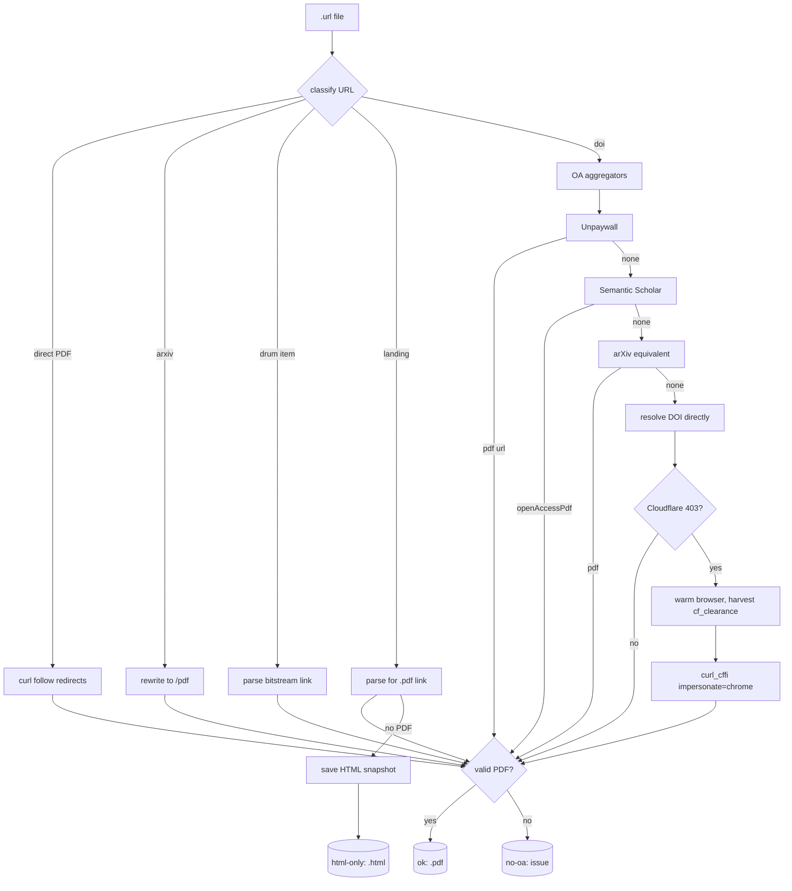

# PBUI Reading Pack: Retrieving Paywalled and Cloudflare-Protected Papers

This report explains how a bibliography of 43 externally retrievable citations was reduced to a local reading pack of 32 verified PDFs plus 2 HTML snapshots, and why the difference between a paywalled paper and a merely Cloudflare-protected paper is the single most important technical distinction in the retrieval process. The work is ticket `PAPERS-DL` in the research bundle at `/home/manuel/Downloads/PBUI-linked-tiles-research-bundle`, which ships a BibTeX bibliography, a paper index, and one Internet Shortcut (`.url`) file per citation in `papers/links/`.

The bundle's own helper, `papers/fetch-open-access-reading-pack.sh`, downloads only the 12 entries whose `.url` already names a direct public PDF endpoint. The remaining 31 entries are a mixture of paywalled publisher pages, Cloudflare-protected open-access pages, repository landing pages, and legitimate HTML documentation sites. A first automated pass built around Unpaywall, Semantic Scholar, arXiv, and DRUM parsers recovered 15 PDFs and classified the rest as failures or "no open-access copy found." That classification was wrong for a large fraction of the residual set, and the reason it was wrong is the subject of this report.

The decisive technical fact is that two different bot-protection systems behave in two different ways. Cloudflare's `cf_clearance` cookie is bound to the TLS fingerprint that solved the challenge, so a cookie harvested from a real Chromium session is rejected when replayed by `curl` or Python `requests`, which use a different ClientHello. AWS WAF's `aws-waf-token` cookie is not fingerprint-bound in the same way and can be replayed with `curl` once solved in a browser. Once the Cloudflare case is handled with `curl_cffi`'s Chrome TLS impersonation, a second surprising fact emerges: OpenAlex's `is_oa` flag is unreliable for ACM's free back-catalog, marking several freely-served ACM papers as closed access. Six papers that three OA aggregators agreed were paywalled were in fact downloadable once Cloudflare was cleared.

> [!summary]
> 1. The 43 link files split by fetch strategy: direct PDF endpoints (12, handled by the bundle's own script), arXiv abstracts, DRUM item pages, author/landing pages, DOI-redirected publisher pages, and HTML documentation sites. A unified downloader (`papers/download-all-papers.py`) classifies each and applies the right parser or OA API.
> 2. Cloudflare (`dl.acm.org`, `onlinelibrary.wiley.com`, `tandfonline.com`, `journals.sagepub.com`) returns 403 to `curl`/`requests` even with a valid `cf_clearance` cookie, because the cookie is bound to the TLS fingerprint that solved the challenge. `curl_cffi` with `impersonate="chrome"` reproduces Chromium's ClientHello and is accepted. AWS WAF (`infoscience.epfl.ch`, `ieeexplore.ieee.org`) returns HTTP 202 with `x-amzn-waf-action: challenge`; its `aws-waf-token` cookie is replayable by plain `curl` once solved in a browser.
> 3. OpenAlex, Unpaywall, and Semantic Scholar each reported `is_oa=False` for six ACM DOIs (ahlberg, baldonado, bohannon, borning, cockburn, johnston) that ACM in fact serves free once Cloudflare is cleared. OA-aggregator flags are a hint, not a verdict, for ACM's old back-catalog. Probe the `/doi/pdf` endpoint empirically.
> 4. Three repository-migration cases required content-path discovery rather than cookie replay: DRUM moved to DSpace 7 (item UUIDs 404, but canonical handles `1903/NNNN` survive on the Wayback Machine); EPFL infoscience moved from `/record/<id>/files/<name>.pdf` to `/server/api/core/bitstreams/<uuid>/content`; `conal.net` serves the Fran paper over plain HTTP because its HTTPS layer is down.
> 5. The downloader's PDF validator rejects Ghostscript-converted PDFs that prefix `%PDF-` with a DSC comment (`%%[ ProductName: GPL Ghostscript ]%%`). Valid PDFs are recognized by searching for `%PDF-` in the first 2 KB, not by requiring it at offset 0. This is a latent bug worth fixing in `download-all-papers.py`.
> 6. Final tally: 32 PDFs + 2 HTML snapshots recovered; 9 papers have no open-access copy and are recorded as issues in `papers/ISSUES.md`. The `surf annas-archive download --doi` command, the intended path for paywalled papers, aborted in this session and is a follow-up.

## Assets in this vault section

The retrieved reading pack and the original research report are mirrored into this vault section so the report and its evidence live together. All files below are committed to the vault; paths are relative to `Projects/2026/08/27/`.

- `[[linked-tiles-research-report.pdf]]` — the original PBUI linked-tiles research report (the subject of the reading pack), 1.3 MB, 2704 lines of source markdown. Embedded here as the primary artifact.
- `_assets/pbui-reading-pack/papers/` — the 32 retrieved open-access paper PDFs, one per citation key (e.g. `borning1981thinglab.pdf`, `satyanarayan2017vegalite.pdf`, `hutchins1986direct.pdf`). These are personal-research-use copies retrieved by the methods described in this report; reuse rights remain those of each source publisher/author.
- `_assets/pbui-reading-pack/papers/ISSUES.md` — the 9 entries with no open-access copy and the suggested follow-ups.
- `_assets/pbui-reading-pack/papers/paper-index.md` — the grouped reading guide explaining how each source contributes to the report.

The same set is also uploaded to the reMarkable cloud at `/ai/2026/08/27/PAPERS-DL` (the 32 papers plus the research report PDF, via `remarquee cloud put`).

## The problem this work addresses

The PBUI linked-tiles research bundle cites 48 bibliography entries. Five are internal supplied artifacts (the P06 package, the action-selection lab, the workbench prototype, and two design records). The remaining 43 are externally retrievable citations, each represented by a `.url` Internet Shortcut in `papers/links/` that contains a stable DOI, repository, author, or project URL.

The bundle deliberately does not redistribute publisher- or author-controlled PDFs. The `papers/README.md` and `papers/LICENSES.md` explain that a publicly reachable paper is not automatically licensed for third-party redistribution, so the bundle preserves citations and retrieval paths and provides an opt-in download helper for personal research use. The helper, `papers/fetch-open-access-reading-pack.sh`, is a sequence of `curl` commands targeting the 12 entries whose `.url` already points directly at a public PDF endpoint.

The task "download all papers linked in `./papers/links`" therefore means: for each of the 43 `.url` files, retrieve the cited content into `papers/downloaded/<key>.pdf` when an open-access copy exists, and record the ones that do not. The first design question is how to classify the 31 entries the bundle's script does not handle.

## Classifying the 43 link files

The `.url` files fall into six fetch strategies. The downloader `papers/download-all-papers.py` implements a classifier that selects one:

| Class | Signal | Example | Handler |
|-------|--------|---------|---------|
| Direct PDF | URL ends in `.pdf` or `/download` | `lri.fr/.../paper.pdf` | `curl` follow redirects |
| arXiv | `arxiv.org/abs/<id>` | `arxiv.org/abs/2606.15013` | Rewrite to `arxiv.org/pdf/<id>.pdf` |
| DRUM item | `drum.lib.umd.edu/items/<uuid>` | `drum.lib.umd.edu/items/f4355611-...` | Parse HTML for `/bitstreams/<uuid>/download` |
| Landing page | author/lab/project page | `idl.uw.edu/papers/mosaic` | Parse HTML for first `.pdf` link; else save HTML snapshot |
| DOI | `doi.org/<doi>` | `doi.org/10.1145/191666.191775` | Unpaywall → Semantic Scholar → arXiv-equiv → direct resolution |
| HTML doc | project/documentation site | `use-coordination.dev` | Save HTML snapshot when no PDF exists |

The classifier is sufficient to route the easy cases. The work is in the cases it routes correctly but that still fail, and in the cases the OA APIs get wrong. Before those, it is worth recording what the first automated pass actually produced.

## The baseline and the first automated pass

The baseline is the bundle's script. It downloads 12 entries with direct-PDF URLs. Eleven succeeded as valid PDFs. The twelfth, `maier2010observer`, hit HTTP 429 from EPFL infoscience and was retried later.

The first pass of `download-all-papers.py` added four PDFs beyond the baseline:

- `boukhelifa2003coordination`, from a Kent pubs landing page that exposed a PDF link.
- `heer2024mosaic`, from `idl.uw.edu/papers/mosaic`, which redirected to a PDF.
- `petrlikova2026vega`, by rewriting `arxiv.org/abs/2606.15013` to the PDF endpoint.
- `shneiderman1983direct`, from Semantic Scholar's `openAccessPdf` field.

The same pass produced seven failures and 19 "no open-access copy found." The failures are more informative than the no-OA classifications, so they are examined first.

## The two bot-protection systems behave differently

Seven entries failed for infrastructure reasons rather than paywall reasons. Four of them (ACM and Wiley) and the later six ACM papers all reduce to one distinction: the difference between Cloudflare and AWS WAF.

### Cloudflare binds the challenge cookie to the TLS fingerprint

`dl.acm.org`, `onlinelibrary.wiley.com`, `tandfonline.com`, and `journals.sagepub.com` are fronted by Cloudflare. A first request to any of them returns an HTTP 403 body titled "Just a moment..." and a JavaScript challenge. A real browser executes the challenge and receives a `cf_clearance` cookie. Subsequent requests with that cookie succeed — but only from a client whose TLS ClientHello matches the one that solved the challenge.

The decisive consequence is that harvesting `cf_clearance` from a Playwright-controlled Chromium session and replaying it with `curl` or Python `requests` does not work. The cookie is accepted, the request reaches the origin, and the origin rejects it with 403 because the TLS fingerprint differs. The same cookie replayed by a client that reproduces Chromium's ClientHello is accepted.

`curl_cffi` is a Python binding around `curl-impersonate`, which patches curl's TLS stack to emit a chosen browser's ClientHello. Passing `impersonate="chrome"` to a `curl_cffi.requests.get` call makes the request indistinguishable to Cloudflare from the Chromium session that earned the `cf_clearance`. The pipeline is therefore:

```text
1. Playwright navigates to a page on the protected domain.
2. Wait for the "Just a moment..." challenge to clear (title flips to the article title).
3. Read cf_clearance (and JSESSIONID, MAID, __cf_bm) from page.context().cookies().
4. Read the exact User-Agent from page.evaluate(() => navigator.userAgent).
5. curl_cffi.requests.get(url, impersonate="chrome",
       headers={User-Agent, Cookie, Accept}) within minutes, before cf_clearance rotates.
```

The freshness constraint is real. Cloudflare re-solves the challenge and rotates `cf_clearance` periodically, and the cookie expires on the order of hours. The browser-warm, cookie-grab, and `curl_cffi` request must happen in quick succession. A batch that grabs the cookie, then runs other commands, then calls `curl_cffi` will see 403 "Just a moment..." again and must re-warm.

### AWS WAF does not bind the token to the TLS fingerprint

`infoscience.epfl.ch` and `ieeexplore.ieee.org` are fronted by AWS WAF rather than Cloudflare. A first request returns HTTP 202 with `x-amzn-waf-action: challenge` and an empty body, and sets an `aws-waf-token` cookie after the JavaScript challenge clears. The token is bound to the IP and User-Agent but, in practice, not to the TLS fingerprint.

The consequence is that an `aws-waf-token` harvested from a Playwright session can be replayed by plain `curl` with the same User-Agent. No TLS impersonation is needed. The EPFL paper that failed with 429 in the baseline and 202 in the first pass was retrieved by:

```text
1. Browser navigates to the EPFL record URL; AWS WAF clears; the browser
   redirects to the new DSpace 7 entity page.
2. Clicking the "Download" button reveals the real bitstream content endpoint
   /server/api/core/bitstreams/<uuid>/content.
3. Read aws-waf-token from page.context().cookies().
4. curl -H "Cookie: aws-waf-token=$TOKEN" -A "<same UA>" <bitstream URL>
```

The two systems are not symmetric, and treating them as the same "bot protection" leads to the wrong tool. Cloudflare requires TLS impersonation; AWS WAF requires only a harvested token. The table that captures the difference:

| System | Challenge response | Token name | Token bound to TLS fingerprint? | Retrieval tool |
|--------|-------------------|-----------|-------------------------------|----------------|
| Cloudflare | 403 "Just a moment..." | `cf_clearance` | Yes | `curl_cffi` `impersonate="chrome"` + cookie + UA |
| AWS WAF | 202 `x-amzn-waf-action: challenge` | `aws-waf-token` | No (IP + UA) | plain `curl` + cookie + UA |

## OA aggregators are wrong about ACM's free back-catalog

After the four Cloudflare-confirmed OA papers (henderson, rao, tarjan, larkin) were retrieved with `curl_cffi`, six ACM DOIs remained that OpenAlex, Unpaywall, and Semantic Scholar each reported as closed access. The first instinct was to record them as paywalled issues. An empirical probe proved that instinct wrong.

The probe was a controlled comparison. A freshly harvested `cf_clearance` was used with `curl_cffi` to fetch `/doi/pdf/<doi>` for a known-OA control (tarjan) and three of the "closed" DOIs (ahlberg, borning, cockburn). The control returned a PDF, as expected. Each of the three "closed" DOIs also returned a PDF.

```text
CONTROL_tarjan           st=200 len=  664958 pdf=True
ahlberg1994visual        st=200 len= 1616509 pdf=True
borning1981thinglab       st=200 len= 2064411 pdf=True
cockburn2009review        st=200 len= 6237425 pdf=True
```

All six were then retrieved and verified with `pdfinfo`:

| Key | Pages | Bytes | Venue |
|-----|-------|-------|-------|
| ahlberg1994visual | 7 | 1,616,509 | CHI 1994 |
| baldonado2000guidelines | 10 | 2,125,961 | AVI 2000 |
| bohannon2006relational | 10 | 327,938 | PODS 2006 |
| borning1981thinglab | 35 | 2,064,411 | TOPLAS 1981 |
| cockburn2009review | 31 | 6,237,425 | CSUR 2009 |
| johnston2004dataflow | 34 | 835,518 | CSUR 2004 |

The lesson generalizes beyond this bundle. ACM Digital Library serves a large fraction of its old back-catalog free, but its metadata does not consistently mark those items as open access, and the aggregators that inherit that metadata inherit the gap. For ACM DOIs, the reliable test is to clear Cloudflare and request `/doi/pdf/<doi>`. A 200 with `application/pdf` and a `%PDF-` body means the paper is retrievable regardless of what OpenAlex reports.

The earlier 403s on these six DOIs were not a paywall. They were a stale `cf_clearance` that had rotated between the browser-warm step and the `curl_cffi` batch. The 6,000-byte "Just a moment..." HTML body is the diagnostic: it names Cloudflare, not the publisher. The publisher paywall, by contrast, returns an abstract page with purchase links after Cloudflare clears. The two cases are distinguishable after the challenge is solved.

## Repository migrations require content-path discovery

Three papers could not be retrieved by cookie replay because the URL in the `.url` file no longer resolves to a file. Each required discovering the current content path.

### DRUM moved to DSpace 7 and the item UUIDs changed

The DRUM links use the form `drum.lib.umd.edu/items/<uuid>`. One of them, `north2000snap`, resolved to an item page that exposed two bitstreams: an original PostScript file and a Ghostscript-converted PDF. The PDF was retrieved directly.

The other, `north1997taxonomy`, returned a genuine "Page not found" 404. A `HEAD` request had reported 200, which is a DRUM quirk: the server returns 200 for `HEAD` and 404 for `GET` on missing items. The canonical DRUM handle form `1903/NNNN` is what the Wayback Machine archived. The recovery path was:

```text
1. archive.org/wayback/available?url=drum.lib.umd.edu/handle/1903/2082
   -> closest snapshot timestamp and URL.
2. Fetch the archived handle page.
3. Extract the original bitstream path /bitstream/handle/1903/2082/umi-umd-2049.pdf.
4. Fetch that bitstream through the same Wayback snapshot.
```

The retrieved file is the full 78-page UMI dissertation containing the taxonomy chapter, not the chapter alone. The chapter is contained within it.

### EPFL infoscience moved to a DSpace 7 REST content endpoint

The `maier2010observer` link points at `infoscience.epfl.ch/record/148043/files/DeprecatingObservers2010.pdf`. That path now redirects to a DSpace 7 entity page at `/entities/publication/<uuid>`. The entity page renders a "Download" button whose target is the real content endpoint `/server/api/core/bitstreams/<uuid>/content`. The bitstream UUID is not derivable from the record number in the `.url` file; it must be discovered by navigating the entity page.

The bitstream endpoint is fronted by AWS WAF. After the browser cleared the challenge, the `aws-waf-token` was replayed with `curl` against the content endpoint, and the full 18-page PDF was retrieved. The stale path in the `.url` file is the only signal that a migration happened; the downloader cannot know the new bitstream UUID without rendering the entity page.

### conal.net serves the Fran paper over plain HTTP

The `elliott1997fran` link uses `https://conal.net/papers/icfp97/`. The HTTPS endpoint times out on TCP connect: the site's TLS layer is down. Plain HTTP on port 80 returns 200. The landing page links to `icfp97.pdf`, fetched over HTTP. The downloader's `requests` library treated the connect timeout as a hard failure. A future run should fall back to HTTP when HTTPS connect-times-out, because a non-trivial number of older academic personal pages are in this state.

The Fran paper is also available as an ACM BRONZE open-access copy at `dl.acm.org/doi/pdf/10.1145/258949.258973`, but that path is Cloudflare-protected. The author's HTTP copy is the lower-friction retrieval.

## The idl author-copy convention

Three papers (satyanarayan2017vegalite, satyanarayan2014declarative, heer2012dynamics) are paywalled at their publishers but have author-hosted copies on the UW Interactive Data Lab site. The `.url` files point at DOIs or at `idl.uw.edu/papers/<slug>` landing pages. One slug, `declarative-interaction-design`, returns 404 on the current idl site.

The author copies live at `idl.cs.washington.edu/files/` and follow a stable filename convention: `YYYY-<CamelName>-<Venue>.pdf`. The three relevant files were located by probing candidate filenames against the files endpoint:

```text
https://idl.cs.washington.edu/files/2017-VegaLite-InfoVis.pdf
https://idl.cs.washington.edu/files/2014-DeclarativeInteraction-UIST.pdf
https://idl.cs.washington.edu/files/2012-InteractiveDynamics-CACM.pdf
```

All three returned `application/pdf` with valid PDF bodies. The idl site serves these directly without Cloudflare or WAF, so plain `curl` suffices. The slug in the bibliography is not always the filename; the convention is the reliable lookup key.

## The PDF validator is too strict

`north2000snap` was initially classified as a failure by the first pass, with the note "not a PDF (first bytes b'%%[ P')". The downloaded file began with:

```text
%%[ ProductName: GPL Ghostscript ]%%
%PDF-1.4
%<binary>
5 0 obj
<</Length 6 0 R/Filter /FlateDecode>>
```

This is a valid PDF. Ghostscript prepends Document Structuring Convention (DSC) comments before the `%PDF-` header when it converts PostScript to PDF. The PDF specification permits leading bytes before `%PDF-`; readers are required to locate the `%PDF-` marker rather than assume it is at offset 0.

The downloader's validator was:

```python
with p.open("rb") as fh:
    head = fh.read(5)
return head == b"%PDF-"
```

This rejects any PDF with a DSC preamble. The fix is to search a small leading window:

```python
with p.open("rb") as fh:
    head = fh.read(2048)
return b"%PDF-" in head
```

`qpdf --check` confirmed the Ghostscript PDF was syntactically valid with no stream errors, and `qpdf --linearize` rewrote it so `file` reports "PDF document, version 1.4, 9 page(s)" instead of "data". The validation bug is latent in `download-all-papers.py` and would silently misclassify any Ghostscript-produced or DSC-prefixed PDF in future runs.

## The retrieval pipeline as a state machine

The complete process for one link file is a state machine over the retrieval methods. Each state either produces a verified PDF, an HTML snapshot, or transitions to the next method. The terminal states are `ok`, `html-only`, and `no-oa`.



The two paths that required the most engineering are the Cloudflare path (`warm browser → cf_clearance → curl_cffi`) and the AWS WAF path (`warm browser → navigate to content endpoint → aws-waf-token → curl`). Both depend on a real browser session. The OA-aggregator path is pure HTTP and fails closed for ACM, which is why the empirical Cloudflare probe is the necessary fallback for ACM DOIs.

## The downloader's first-pass report and its corrections

`download-all-papers.py` writes a JSON report to `papers/download-report.json` with a per-entry status. The first pass reported 15 `ok`/`cached`, 19 `no-oa`, 2 `html-only`, 7 `fail`, and 0 `skip`. That report was accurate about the methods it tried and inaccurate about the residual set, because the residual set required methods it did not implement.

The corrections, in order:

1. idl author copies (3 PDFs): located by the `YYYY-<CamelName>-<Venue>.pdf` convention.
2. EPFL AWS WAF (1 PDF): browser-discovered bitstream endpoint + `aws-waf-token` replay.
3. DRUM Ghostscript PDF (1 PDF): re-fetched the correct bitstream, relaxed the validator, normalized with `qpdf`.
4. DRUM Wayback (1 PDF): resolved the 404 item UUID through the archived handle.
5. conal.net HTTP (1 PDF): fell back to plain HTTP.
6. Cloudflare OA via `curl_cffi` (4 PDFs): henderson, rao, tarjan, larkin.
7. ACM free back-catalog (6 PDFs): ahlberg, baldonado, bohannon, borning, cockburn, johnston.

The sum is 32 PDFs. The report's value is that it records what each method tried, which makes the corrections auditable. A future run should fold the corrections back into `download-all-papers.py` so the report reflects the final state rather than the first pass.

## The issues: papers with no open-access copy

Nine entries have no open-access copy and are recorded in `papers/ISSUES.md`. They divide into two groups.

Seven are paywalled publisher pages where no OA copy was found through any aggregator or author search:

| Key | Publisher | Why it is an issue |
|-----|-----------|-------------------|
| becker1987brushing | Taylor & Francis | T&F serves abstract only after Cloudflare clears. |
| boukhelifa2003software | Sage (was Palgrave) | Sage paywall. |
| green1996cognitive | Elsevier | ScienceDirect paywall. |
| moody2009physics | IEEE | IEEE Xplore paywall. |
| north2000snapusers | Elsevier | ScienceDirect paywall. |
| weaver2004improvise | IEEE | IEEE Xplore paywall. |
| yi2007interaction | IEEE | IEEE Xplore paywall. |

Two are linked to an HTML architecture essay rather than the underlying paper PDF:

| Key | Linked URL | Why it is an issue |
|-----|-----------|-------------------|
| weaver2005coordination | `cs.ou.edu/~weaver/improvise/architecture/mv/index.html` | HTML essay, self-signed cert (`curl -k` fetchable); the InfoVis 2005 paper is paywalled with no OA. |
| weaver2006metavis | same HTML essay | No DOI; the CMV 2006 paper has no OA copy. |

The intended follow-up for the paywalled set is `surf annas-archive download --doi <DOI> --save-to <path>`, which drives Anna's Archive through the surf browser host. The command aborted in this session, so the paywalled papers were recorded as issues rather than pursued further, per the working instruction to skip the hard cases when there are issues and capture them in the ticket.

Two further entries are legitimately HTML and were saved as snapshots rather than PDFs: `keller2024usecoordination` (the Use-Coordination project site) and `radul2009propagator` (the MIT propagators tech-report page). These are not failures; they are the cited form of the source.

## The final reading pack

The 32 PDFs, with page counts and sizes, form the local reading pack:

| Key | Pages | Bytes |
|-----|-------|-------|
| ahlberg1994visual | 7 | 1,616,509 |
| baldonado2000guidelines | 10 | 2,125,961 |
| beaudouinlafon2000instrumental | 8 | 476,319 |
| beaudouinlafon2000reification | 8 | 295,542 |
| becker1987brushing | — | — (issue) |
| bohannon2006relational | 10 | 327,938 |
| borning1981thinglab | 35 | 2,064,411 |
| boukhelifa2003coordination | 10 | 445,178 |
| boukhelifa2003software | — | — (issue) |
| cockburn2009review | 31 | 6,237,425 |
| czarnecki2009bx | 25 | 209,730 |
| elliott1997fran | 11 | 223,498 |
| foster2005lenses | 14 | 264,867 |
| green1996cognitive | — | — (issue) |
| heer2012dynamics | 10 | 5,603,178 |
| heer2024mosaic | 14 | 7,338,351 |
| henderson1986rooms | 33 | 4,581,592 |
| hutchins1986direct | 28 | 348,952 |
| johnston2004dataflow | 34 | 835,518 |
| kandogan1997elastic | 11 | 1,116,967 |
| larkin1987diagram | 36 | 1,782,579 |
| lee1995dataflow | 27 | 3,112,7275 |
| maier2010observer | 18 | 209,549 |
| moody2009physics | — | — (issue) |
| moore2008clim | 12 | 166,036 |
| north1997taxonomy | 78 | 354,599 |
| north2000snap | 9 | 521,253 |
| north2000snapusers | — | — (issue) |
| petrlikova2026vega | 14 | 823,002 |
| rao1991clim | 21 | 1,501,206 |
| roberts2007cmv | 11 | 806,482 |
| robertson2000taskgallery | 8 | 436,030 |
| satyanarayan2014declarative | 10 | 3,169,147 |
| satyanarayan2016reactive | 10 | 2,477,837 |
| satyanarayan2017vegalite | 10 | 7,265,280 |
| shneiderman1983direct | 13 | 6,545,129 |
| tarjan1975unionfind | 11 | 664,958 |
| weaver2004improvise | — | — (issue) |
| weaver2005coordination | — | — (issue, HTML essay) |
| weaver2006metavis | — | — (issue, HTML essay) |
| yi2007interaction | — | — (issue) |

Two HTML snapshots complete the retrievable set: `keller2024usecoordination.html` and `radul2009propagator.html`. The 62 MB total is small enough to keep the whole pack in the bundle's `downloaded/` directory.

## Working rules for retrieving a bibliography reading pack

The project produced a compact set of rules that should survive changes to the source set.

1. **Classify before fetching.** The `.url` form determines the fetch strategy. A DOI is not a landing page is not a direct PDF. Routing everything through the DOI resolver wastes effort and misses author copies.
2. **Distinguish Cloudflare from AWS WAF.** A 403 "Just a moment..." body names Cloudflare and requires TLS impersonation. A 202 with `x-amzn-waf-action: challenge` names AWS WAF and accepts plain `curl` with a harvested token. The retrieval tools are different.
3. **Reproduce the browser's TLS fingerprint for Cloudflare.** `curl_cffi` with `impersonate="chrome"` plus a fresh `cf_clearance` and the exact Chromium User-Agent is the minimum viable Cloudflare retrieval. Plain `curl` with the same cookie is rejected at the origin.
4. **Harvest cookies and use them immediately.** Both `cf_clearance` and `aws-waf-token` rotate and expire. The browser-warm, cookie-grab, and replay must happen in one quick sequence. A 6,000-byte "Just a moment..." body on replay means the cookie went stale; re-warm.
5. **Do not trust OA-aggregator flags for ACM.** OpenAlex, Unpaywall, and Semantic Scholar each marked six freely-served ACM papers as closed. For ACM DOIs, clear Cloudflare and request `/doi/pdf/<doi>`. A 200 `application/pdf` body is the verdict.
6. **Distinguish a Cloudflare re-challenge from a publisher paywall.** Both return 403 to `curl`. After Cloudflare clears, a paywalled article shows an abstract page with purchase links; a free article exposes a PDF. The 403 alone is not the paywall.
7. **Search for `%PDF-` in the first 2 KB, not at offset 0.** Ghostscript and other converters may prefix `%PDF-` with DSC comments. A strict offset-0 check misclassifies valid PDFs as failures.
8. **Resolve stale repository URLs through the Wayback Machine.** DRUM item UUIDs 404, but canonical handles survive in snapshots. EPFL record paths redirect through new entity pages; the bitstream content endpoint must be discovered by navigation. `conal.net` is HTTPS-down but HTTP-up.
9. **Save HTML snapshots for documentation sites, do not force a PDF.** Project sites and tech-report pages that have no PDF are the cited form. Saving the HTML is the correct retrieval, not a failure.
10. **Record paywalled papers as issues, do not bypass them.** A reading pack that respects publisher access control records what could not be retrieved and why. The follow-up path is a legitimate access channel, not a circumvention.

## Artifacts and files worth reading

The retrieval work is captured in the bundle at `/home/manuel/Downloads/PBUI-linked-tiles-research-bundle`:

- `papers/links/*.url` — the 43 Internet Shortcut files, one per citation.
- `papers/fetch-open-access-reading-pack.sh` — the bundle's own 12-entry direct-PDF helper.
- `papers/download-all-papers.py` — the unified classifier and downloader (Unpaywall, Semantic Scholar, arXiv, DRUM, landing, DOI). Contains the strict-validator bug to fix.
- `papers/download-report.json` — the first-pass per-entry status report.
- `papers/downloaded/` — the 32 PDFs and 2 HTML snapshots.
- `papers/ISSUES.md` — the 9 entries with no open-access copy and the suggested follow-ups.
- `papers/README.md`, `papers/LICENSES.md`, `papers/licenses/` — the rights and attribution notices that explain why PDFs are links rather than redistributed files.
- `diary.md` — the chronological per-step diary of the retrieval, including exact commands, errors, and the Cloudflare vs AWS WAF distinction as it was discovered.
- `bibliography/paper-index.md`, `bibliography/paper-index.csv`, `bibliography/references.bib` — the bibliography and reading guide.

The docmgr ticket `PAPERS-DL` at `ttmp/2026/08/27/PAPERS-DL--download-all-papers-linked-in-papers-links` tracks the tasks: recoverable low-hanging fruit, Cloudflare-blocked OA via browser session, paywalled-only as issues, and diary maintenance.

## Open questions and next steps

1. **Fix `download-all-papers.py`.** Fold the seven correction methods back into the classifier so the report reflects the final state. Relax the PDF validator to search for `%PDF-` in the first 2 KB. Add an HTTP fallback when HTTPS connect-times-out. Add a Cloudflare branch that warms a browser and replays with `curl_cffi`.
2. **Pursue the paywalled set through Anna's Archive.** The `surf annas-archive download --doi <DOI> --save-to <path>` command is the intended channel. It aborted in this session; retry it for the seven paywalled DOIs and the two Weaver papers.
3. **Persist the browser-cookie pipeline.** The browser-warm → cookie-grab → `curl_cffi` sequence is reusable for any Cloudflare-protected academic source. A small `scripts/` helper in the bundle would make future reading-pack refreshes a single command.
4. **Reconcile the retrieved PDFs with the paper index.** The `bibliography/paper-index.csv` records an `access` column ("DOI/publisher record; access conditions vary" vs "Publicly reachable PDF link"). After this retrieval, the column should reflect which entries now have a local copy and which remain issues.
5. **Spot-check the ACM back-catalog PDFs.** The six papers OpenAlex misclassified were validated by magic bytes and `pdfinfo` page count, not by reading every page. ACM back-catalog PDFs are occasionally watermarked or restricted-resolution; a spot check confirms they are the full articles.

## Conclusion

The reading pack went from 12 direct-PDF downloads to 32 verified PDFs plus 2 HTML snapshots by recognizing that the residual set was not a single problem. It was four problems: repository migrations that required content-path discovery, a PDF validator that rejected valid Ghostscript output, OA aggregators that under-reported ACM's free back-catalog, and two bot-protection systems that require different retrieval tools. The Cloudflare and AWS WAF distinction is the one that matters most for future reading packs, because it determines whether a harvested cookie can be replayed with `curl` or whether the request must also reproduce Chromium's TLS fingerprint. Once that distinction is in hand, the remaining work is classification, empirical probing, and honest recording of the papers that no open-access channel serves.
