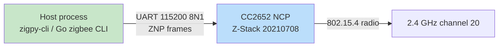
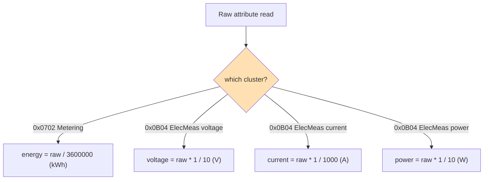

# Zigbee Control: From a Silent Serial Port to a Formed Network on the Sonoff Dongle-P

This report documents a hardware bring-up of a Zigbee coordinator and the protocol-level debugging that was required to reach a working, sniffable network. The starting condition was a Sonoff "Zigbee 3.0 USB Dongle Plus" that appeared completely silent on its serial port when addressed with the EmberZNet EZSP protocol, an nRF52840 dongle running an 802.15.4 sniffer, an M5Stack H2 based on the ESP32-H2, and a ThirdReality Smart Plug Gen 2 (`3RSP02028BZ`) as the intended target device. The goal was to make the Sonoff act as the network coordinator ("host"), to bring the nRF52840 into a position where it could decrypt the traffic, and to record the exact device fingerprint required to control the plug. The work produced a formed Zigbee network on channel 20, the network and link keys needed to decrypt its traffic, a verified cluster fingerprint for the plug, and a Go architecture for the command-line tools that will drive the system.

The interesting part of the work is not the formation itself. It is the sequence of identifications and corrections that had to happen first: the Sonoff "Dongle Plus" is sold in two chip variants that share one product string and one USB-UART chip, and the only reliable way to distinguish them is to probe the protocol each one speaks; the coordinator's formation step enforces a radio-frequency energy scan that refuses to build a network on a noisy channel, and that scan is implemented inside the vendor firmware where it cannot be bypassed from the host library; and the device fingerprint of the plug lives in a manufacturer-specific Zigbee cluster that standard tooling will not discover unless it is told to look for it.

> [!summary]
> - **The Sonoff "Dongle Plus" is ambiguous hardware.** The product string "Sonoff Zigbee 3.0 USB Dongle Plus" covers two radios: the `ZBDongle-E` (Silicon Labs EFR32MG21, EmberZNet EZSP) and the `ZBDongle-P` (Texas Instruments CC2652P2, Z-Stack ZNP). Both use the same Silicon Labs CP210x USB-UART, so the USB product string cannot tell them apart. The dongle in this project is the `-P`. Addressing it with `bellows` (EZSP) produced total silence, which was correct behavior for the wrong protocol, not a fault.
> - **No reflashing was needed.** The `-P` shipped as a working Z-Stack coordinator. `zigpy-znp` reads it at 115200 baud out of the box. The entire EZSP flashing path, including a downloaded `ncp-uart-sw` Gecko bootloader image, was discarded once the chip was identified.
> - **Formation is gated by an RF energy scan inside the firmware.** `zigpy radio ... znp ... form` refused with `FormationFailure: too much RF interference`. The refusal originates in the TI Z-Stack commissioning step, below the host library, and cannot be overridden by forcing a channel mask from Python. The fix was physical: move the dongle away from the USB 3.0 gigabit adapter that was radiating into the 2.4 GHz band. After the move, formation succeeded on channel 20.
> - **The formed network's keys are the sniffer's input.** Formation produced PAN `0xF18F` on channel 20, a network key of `bd:b7:69:38:44:ba:af:3d:08:1c:39:a0:15:b1:51:3e`, and a trust-center link key of `5a6967426565416c6c69616e63653039` (the well-known `ZigbeeAlliance09`). Both keys are entered into Wireshark's ZigBee dissector to decrypt captures from the nRF52840, which must itself be locked to channel 20.
> - **The plug's fingerprint lives in a manufacturer cluster.** The ThirdReality `3RSP02028BZ` exposes standard On/Off, Metering, and Electrical Measurement clusters, plus a manufacturer-specific cluster `0xFF03` (manufacturer code `0x1233`) that holds reset-energy, countdown, and LED-brightness attributes. The metering divisor is `3600000`, so the energy counter is in watt-hours, not kilowatt-hours, until the host scales it.

## Why this project exists

The project's stated goal is to build a "Zigbee master": a program that forms a Zigbee network, accepts device joins, and directly controls a ThirdReality smart plug, without using Home Assistant or any off-the-shelf hub. The tools are to be written in Go using the glazed command framework, and the system is to be understood deeply enough that, in later phases, a reprogrammed "fingerprinter" device can impersonate the plug and an M5Stack CoreS3 paired with a Gateway H2 can replace the Sonoff as the master.

Building a master from scratch requires three things to be true at once. The coordinator must be a working Zigbee network so that devices can join it. The sniffer must be able to decrypt the traffic so that the join handshake and the control commands can be observed and reproduced. And the target device's exact cluster and attribute layout must be known so that the master can send it the correct frames. None of these can be assumed. The Sonoff's silence meant the coordinator was not yet understood. The sniffer's decryption requires keys that only the coordinator can produce. And the plug's manufacturer cluster is not part of the standard Zigbee Cluster Library, so it has to be recovered from a device database rather than derived from the specification.

The bring-up therefore proceeded in the only order that is valid: identify the coordinator's protocol, form a network on it, recover the keys, and only then turn to the sniffer and the plug. The report follows that order.

## Current project status

The coordinator is live. The Sonoff `-P` is running Z-Stack `20210708` on a CC2652, its IEEE address is `00:12:4b:00:2a:9a:75:ec`, and it is acting as the coordinator at network address `0x0000`. A network is formed with PAN ID `0xF18F`, extended PAN ID `6d:53:a9:25:c5:00:c5:c8`, on channel 20. The network key and trust-center link key have been captured and stored. An open-coordinator-format backup of the network has been written to the ticket's `sources/` directory.

The design documentation for the Go tooling, the plug fingerprint, and the sniffer pipeline is complete and stored in a docmgr ticket (`zigbee-control`) and uploaded to reMarkable. The Go command-line skeleton, the nRF52840 Wireshark extcap installation, and a live capture of a plug join are the remaining bring-up steps. The design doc in the ticket currently assumes the `-E`/EZSP variant and must be corrected to the `-P`/ZNP variant; that correction is tracked as an open item.

The repository for this work is `/home/manuel/code/wesen/2026-08-27--zigbee-control`. The docmgr ticket is `ttmp/2026/08/27/zigbee-control--zigbee-master-host-sniffer-and-thirdreality-smart-plug-gen2-control-go-glazed`. All probe outputs, the firmware reference, the Zigbee2MQTT converter source, the sniffing guide, and the network backup are stored under that ticket's `sources/` directory.

## The three radios and their roles

Three IEEE 802.15.4 radios are connected to the machine. Each has a distinct role in the system, and confusing the roles is the first and most common mistake in a Zigbee bring-up.

| Role | Device | USB ID | Serial device | Chip | Firmware / stack |
|---|---|---|---|---|---|
| Coordinator host | Sonoff ZBDongle-P | `10c4:ea60` | `/dev/ttyUSB0` | TI CC2652P2 | Z-Stack `20210708` (ZNP) |
| Packet sniffer | Nordic nRF52840 dongle | `1915:154b` | `/dev/ttyACM0` | nRF52840 | nRF Sniffer for 802.15.4 |
| Test stand-in / future master | M5Stack H2 | `303a:1001` | `/dev/ttyACM1` | Espressif ESP32-H2 | 802.15.4 + BLE, ESP-IDF |

The coordinator is the trust center. It forms the network, chooses the channel and PAN ID, generates the network key, and transports that key to each joining device encrypted under a link key. The Sonoff plays this role. The sniffer is a passive capture device. It listens on one channel at a time, wraps each received 802.15.4 frame in the Zigbee Encapsulation Protocol (ZEP, UDP port 17754), and feeds the stream into Wireshark through an extcap plugin. The sniffer cannot decrypt by itself and cannot inject packets; it is strictly an observer. The nRF52840 plays this role. The stand-in is a second 802.15.4 radio that, in this phase, will be programmed to impersonate the smart plug so that the host and the sniffer can be exercised without the real plug, and in a later phase will become the master itself. The ESP32-H2 plays this role.

The serial devices are addressed through their stable `/dev/serial/by-id/` symlinks rather than the raw `/dev/tty*` names, because the raw names renumber when devices are replugged.

```
/dev/serial/by-id/usb-ITead_Sonoff_Zigbee_3.0_USB_Dongle_Plus_34042a009b45ed119cb2c58f0a86e0b4-if00-port0
/dev/serial/by-id/usb-Nordic_Semiconductor_ASA_nRF_802154_Sniffer_51B00E2465477D3D-if00
/dev/serial/by-id/usb-Espressif_USB_JTAG_serial_debug_unit_48:31:B7:CA:45:5B-if00
```

## The Sonoff naming ambiguity

The single most important identification in the project is the chip variant of the Sonoff dongle, because the two variants speak different host protocols and require different firmware. Getting this wrong leads either to total silence, which is merely confusing, or to a destructive firmware flash, which bricks the device.

The "Sonoff Zigbee 3.0 USB Dongle Plus" is sold as two distinct products that share one retail name:

- **ZBDongle-E.** The radio is the Silicon Labs EFR32MG21. It runs EmberZNet as a Network Co-Processor and speaks the EmberZNet Serial Protocol (EZSP) over the UART. The host library for this variant is `bellows`, which sits on top of `zigpy`.
- **ZBDongle-P.** The radio is the Texas Instruments CC2652P2. It runs the TI Z-Stack and speaks the Zigbee Network Processor (ZNP) protocol over the UART. The host library for this variant is `zigpy-znp`, which also sits on top of `zigpy`.

Both variants use the same Silicon Labs CP210x USB-to-UART bridge, so both present the same USB vendor and product ID (`10c4:ea60`) and the same USB product string ("Sonoff Zigbee 3.0 USB Dongle Plus"). Neither the `lsusb` output nor the `udevadm` product attribute can distinguish them. The distinction is only visible at the protocol layer: the two stacks answer different handshakes.

The design doc for this project initially assumed the `-E` variant and prepared to flash the EmberZNet `ncp-uart-sw` coordinator image. That assumption was wrong, and proving it wrong before any firmware was written was the first real result of the bring-up.

## How the chip was identified without flashing

The reliable identification method is to attempt the protocol handshake for each variant and observe which one answers. The `zigpy-cli` tool exposes a unified interface that can drive any of the `zigpy` radio backends, so the same command shape probes both protocols:

```
zigpy radio --baudrate 115200 {ezsp|znp} <PORT> info
```

The `info` subcommand opens the serial port, performs the backend's reset and handshake, and reads the network state if a network is formed.

The EZSP path, driven through `bellows`, was attempted first. At 115200 baud with no flow control, the port returned zero bytes. At 115200 baud with hardware flow control, `bellows` reached its internal `startup_reset` step and raised `TimeoutError` at the ASH `reset()` call. Both failures are consistent: the EmberZNet ASH layer expects an RSTACK frame (`0x80`) after a CAN-byte (`0x1A`) reset, and an EFR32 NCP answers with one; a CC2652 running ZNP does not answer ASH at all, because ASHP is not its protocol.

A raw probe was written to characterize the port without relying on any host library. The script sends the ASH reset sequence and labels every received byte:

```python
# scripts/01-sonoff-ash-probe.py (excerpt)
CAN = b"\x1a"          # ASH CAN / reset byte
ser.write(CAN * 8)
time.sleep(0.8)
resp = drain()
# 0x80 => RSTACK (healthy EZSP NCP), 0xc0/0x7e => noise, empty => no EZSP
```

The probe returned silence at 115200 baud and a small number of unlabeled bytes at 76800 and 57600 baud with the RTS line driven active-low. None of the bytes was an RSTACK frame. The conclusion was that the port was physically alive (the dongle's USB-UART was enumerating and the radio was responding to electrical reset) but was not speaking EZSP.

The ZNP path was then attempted:

```
zigpy radio --baudrate 115200 znp /dev/ttyUSB0 info
```

This succeeded immediately and printed a fully formed network. The dongle was a `-P`, it was already a coordinator, and it already had a network:

```
PAN ID:                0x1A62
Extended PAN ID:       00:12:4b:00:2a:9a:75:ec
Channel:               11
Device IEEE:           00:12:4b:00:2a:9a:75:ec
Device NWK:            0x0000
Network key:           01:03:05:07:09:0b:0d:0f:00:02:04:06:08:0a:0c:0d
```

The network key `01:03:05:07:09:0b:0d:0f:00:02:04:06:08:0a:0c:0d` is the well-known Zigbee2MQTT default key, which is why `zigpy-znp` logged the warning "Your network is using the insecure Zigbee2MQTT network key!" during formation. The dongle had been preconfigured by a previous owner, not by the factory.

The identification was complete. The EZSP flashing path was discarded. No `.gbl` image was written to the device. The correct host stack for this hardware is `zigpy-znp`, driven either through the `zigpy-cli` front end or through the `zigpy` Python API.

## The network/co-processor split

Understanding why the coordinator is driven from a separate host process, rather than running the entire Zigbee stack on the radio, clarifies the rest of the architecture. The CC2652 on the Sonoff runs the Z-Stack firmware as a co-processor. The radio, the MAC, the network layer, and the timing-critical parts of the stack live on the CC2652. The host process, in this phase the `zigpy-cli` tool and in later phases the Go `zigbee` binary, owns the application logic and the device database. The two communicate over a UART at 115200 baud using the ZNP protocol, which is a request/response framing on top of the serial line.



The host sends high-level commands — form a network, open for joins, send this ZCL frame to that address — and the co-processor turns them into radio transmissions and reports received frames back. The split exists because the Zigbee stack has hard real-time requirements at the MAC layer that a general-purpose host operating system cannot meet reliably, but the application logic above the stack has no such requirements and is far easier to develop and test on the host.

## Formation and the RF energy-scan gate

With the coordinator identified and the host stack confirmed, the next step was to form a fresh network. The project's requirement was a clean network under the project's own keys, so the pre-existing Zigbee2MQTT network was not acceptable.

Formation is the act of a coordinator creating a new network: it picks a channel, a PAN ID, an extended PAN ID, and a network key, writes them into its non-volatile storage, and starts participating in the network at network address `0x0000`. In the `zigpy-cli` tool, the command is:

```
zigpy radio --baudrate 115200 znp /dev/ttyUSB0 form
```

The first `form` attempt wiped the pre-existing network and then failed:

```
zigpy.exceptions.FormationFailure: Network formation refused: there is too much
RF interference. Make sure your coordinator is on a USB 2.0 extension cable and
away from any sources of interference, like USB 3.0 ports, SSDs, 2.4GHz routers,
motherboards, etc.
```

The failure is not a `zigpy` decision. It is a decision made inside the TI Z-Stack firmware during the commissioning step that follows the network-parameter write. The Z-Stack performs an energy scan across its channel mask before it agrees to bring up a network, and it refuses to form if the noise floor on the candidate channel is above its threshold. The host library cannot override this, because the scan runs in the firmware after the host has handed off control.

An attempt was made to bypass the gate by forcing a single channel through the `zigpy` Python API rather than the CLI. A script was written that set the channel to 15 and the network key to the well-known Zigbee2MQTT key before calling `form_network`:

```python
# scripts/06-znp-form-channel.py (excerpt)
app.config[CONF_NWK][CONF_NWK_CHANNEL] = CHANNEL
app.config[CONF_NWK][CONF_NWK_KEY] = [0x01,0x03,0x05,0x07, ...]
await app.form_network()
```

The attempt failed at the same point, deeper in the stack:

```
zigpy_znp.api.start_network -> request_callback_rsp -> TimeoutError
zigpy.exceptions.FormationFailure: Network formation refused: there is too much
RF interference.
```

The trace shows the refusal happening during the `start_network` commissioning request, after the network parameters were already written. The gate is in the firmware, and the only way past it is to reduce the actual radio-frequency noise.

## Why the noise was present

The source of the interference was identified from the USB topology. The machine has two USB buses: a USB 2.0 bus and a USB 3.0 bus. USB 3.0 ports and cables radiate broadband noise that overlaps the 2.4 GHz band used by Zigbee; this is a documented effect (the Intel white paper "USB 3.0 Radio Frequency Interference Impact on 2.4 GHz Wireless Devices" describes the mechanism). The `lsusb -t` output showed a Realtek RTL8153 gigabit ethernet adapter running at 5000 Mbit/s (USB 3.0) on the USB 3.0 bus, close to the Sonoff on the USB 2.0 bus. The laptop's Bluetooth radio, also a 2.4 GHz device, was a secondary contributor.

The decisive observation was that the dongle had shipped with a working network on channel 11 in exactly this physical configuration. The noise floor was therefore borderline, not impossible. A network that already exists tolerates noise far better than a network that is being formed, because formation runs the strict one-time energy scan while steady-state operation does not. This is why the pre-existing network had survived in a noisy spot where a fresh formation was refused.

The fix was physical. The dongle was moved to a different USB port, away from the USB 3.0 adapter, on a short extension. The `form` command was run again. This time it succeeded, and the subsequent `info` read back a complete network.

## The formed network

The formed network is the first concrete deliverable of the project, because its keys are the input to the sniffer. The full state, captured by `zigpy radio ... znp ... info` and stored in `sources/18-znp-info-formed.txt`, is:

```
PAN ID:                0xF18F
Extended PAN ID:       6d:53:a9:25:c5:00:c5:c8
Channel:               20
Channel mask:          [20]
NWK update ID:         0
Device IEEE:           00:12:4b:00:2a:9a:75:ec
Device NWK:            0x0000
Network key:           bd:b7:69:38:44:ba:af:3d:08:1c:39:a0:15:b1:51:3e
Network key sequence:  0
Network key counter:   0
```

A backup in the open-coordinator-backup format was written by `zigpy radio ... znp ... backup` and stored in `sources/19-znp-backup.txt`. The backup confirms the coordinator identity and the trust-center link key:

```
node:        ieee 00124b002a9a75ec, nwk 0000, type coordinator
             model CC2652, manufacturer Texas Instruments
             version Z-Stack 20210708, CodeRevision 20210708
tc_link_key: key 5a6967426565416c6c69616e63653039
```

Two keys matter for the sniffer. The network key encrypts every network-layer frame after the join. The trust-center link key protects the join handshake, in which the network key is transported to a new device. The link key here is `5a6967426565416c69616e63653039`, which is the ASCII string `ZigbeeAlliance09` rendered as hex bytes. This is the well-known trust-center link key that most Zigbee 3.0 networks use unless a device ships with a unique install code.

The coordinator is now in a known state, on a known channel, with known keys. The sniffer can be configured against it.

## The key hierarchy and what the sniffer sees

Zigbee encrypts traffic at two layers, and decrypting a capture requires both keys because the two layers protect different parts of the join. Understanding which key decrypts what is what makes a captured trace readable instead of opaque.

The network key is a single 16-byte AES-128 key shared by every device on the network. It encrypts the network-layer (NWK) frame of every unicast, broadcast, and multicast after a device has joined. The trust-center link key is a 16-byte AES-128 key shared between the coordinator (the trust center) and one joining device. It encrypts the application-layer (APS) frame that carries the network key to that device during the join. That transport frame is the famous "Transport Key" frame, and it is sent with its NWK layer unencrypted so that a sniffer can capture it; only its APS payload, which contains the network key, is encrypted under the link key.

The consequence is that a sniffer capturing a join sees, in order: the unencrypted beacon request and association frames; the Transport Key frame, whose NWK layer is clear but whose APS payload is encrypted under the link key; and then the fully NWK-encrypted traffic that follows. To read all of it, Wireshark needs both keys.

| Key | Scope | Value (this network) | Decrypts |
|---|---|---|---|
| Network key (NWK) | network-wide | `bd:b7:69:38:44:ba:af:3d:08:1c:39:a0:15:b1:51:3e` | every NWK frame after join |
| Trust-center link key (APS) | coordinator↔joiner | `5a:69:67:42:65:65:41:6c:6c:69:61:6e:63:65:30:39` | the Transport Key frame at join |

The keys are entered into Wireshark under `Edit > Preferences > Protocols > ZigBee`, with the security level set to `AES-128 Encryption, 32-bit Integrity Protection`, and each key added under `Pre-configured keys` with byte order set to `Normal`. The nRF52840 sniffer must be locked to channel 20, the network's channel, because the sniffer listens on exactly one channel at a time and cannot follow a network that is not on its channel.

There are two ways to obtain the network key. The first, used here, is to read it from the coordinator at formation time. The second, useful when the coordinator's printout was not captured, is to recover it from the captured Transport Key frame: with the link key loaded in Wireshark, the dissector decrypts the Transport Key's APS payload and displays the network key in the packet tree. The first method is authoritative and should always be used when the coordinator is under the project's control; the second is the recovery path for networks the project did not form.

## The plug fingerprint, recovered from a converter

The target device is the ThirdReality Smart Plug Gen 2, model `3RSP02028BZ`. Controlling it requires knowing exactly which clusters and attributes it exposes, on which endpoint, and with which manufacturer code, because the frames the master sends must match that layout. The standard Zigbee Cluster Library defines the common clusters, but the plug also has a manufacturer-specific cluster that standard tooling will not discover unless it is told to look for it.

The authoritative source for the fingerprint is the Zigbee2MQTT device converter source, not the Zigbee specification. Zigbee2MQTT maintains a TypeScript file per vendor that maps each model to its clusters, its scaling factors, and its manufacturer-specific attributes. The file for Third Reality is `src/devices/third_reality.ts` in the `zigbee-herdsman-converters` repository. The relevant entry, for model `3RSP02028BZ`, is reproduced in structure below.

The identity fields are:

| Field | Value |
|---|---|
| Model ID (ZCL Basic `0x0005`) | `3RSP02028BZ` |
| Vendor | `Third Reality` |
| Manufacturer code | `0x1233` |
| Profile ID | `0x0104` (Home Automation) |
| Device type | Router (mains-powered) |
| OTA | supported |

The manufacturer code `0x1233` is the value that must be carried in the ZCL header of any frame that touches the manufacturer-specific cluster. It is not the same across all Third Reality devices; the converter file uses `0x1407` for some other Third Reality products. A previous memory-based research pass guessed `0x1266`, which is wrong for this model. The converter source is the ground truth, and it was fetched and stored verbatim in `sources/08-z2m-converters-third_reality.ts`.

The plug exposes one primary endpoint, endpoint 1, with the following server (input) clusters:

| Cluster ID | Name | Key attributes |
|---|---|---|
| `0x0000` | Basic | `0x0004` ManufacturerName, `0x0005` ModelIdentifier, `0x0007` PowerSource |
| `0x0003` | Identify | `0x0000` IdentifyTime |
| `0x0004` | Groups | group membership |
| `0x0005` | Scenes | scene storage |
| `0x0006` | On/Off | `0x0000` OnOff, `0x4000` StartUpOnOff, `0x4002` OffWaitTime |
| `0x0702` | Simple Metering | `0x0000` CurrentSummationDelivered, `0x0400` InstantaneousDemand, `0x0301` Multiplier, `0x0302` Divisor |
| `0x0B04` | Electrical Measurement | `0x0505` RMSVoltage, `0x0508` RMSCurrent, `0x050B` ActivePower, `0x0600`–`0x0605` multipliers and divisors |
| `0x0019` | OTA Upgrades | image version, status |
| `0xFF03` | ThirdReality custom | see below |

The custom cluster `0xFF03` is the part that standard tooling does not discover. It carries the plug's non-standard features, all of which are manufacturer-specific and must therefore set the manufacturer-specific bit in the ZCL frame control byte and carry `0x1233` in the header:

| Attribute ID | Name | Type | Access | Meaning |
|---|---|---|---|---|
| `0x0000` | resetTotalEnergy | uint8 | write | write `1` to reset the energy counter |
| `0x0001` | countdownToTurnOff | uint16 | write | seconds until automatic off |
| `0x0002` | countdownToTurnOn | uint16 | write | seconds until automatic on |
| `0x0010` | ledBrightness | uint8 | write | LED brightness, 0 to 100 percent |
| `0x0020` | allowBind | uint8 | write | allow binding entry |

The metering and electrical-measurement scaling factors are defined in the converter's `configure` block and must be applied by the host to every raw reading. The energy divisor is `3600000`, which means the raw `CurrentSummationDelivered` counter is in watt-hours and must be divided by `3600000` to yield kilowatt-hours. The voltage divisor is `10`, so a raw reading of `1205` is `120.5 V`. The current divisor is `1000`, so a raw reading of `500` is `0.5 A`. The power divisor is `10`, so a raw reading of `600` is `60.0 W`.



The scaling factors are the most error-prone part of the host code. A host that reads `600` from the power attribute and reports `600 W` is wrong by a factor of ten, and the error is invisible until the reading is compared against a known load. The Go code that performs the scaling is therefore written as a small, tested function rather than inline arithmetic.

## The On/Off frame, end to end

The simplest control operation is switching the plug on. Building the frame by hand clarifies what the host actually sends and what each field is for.

The On/Off cluster is `0x0006`. Its commands are cluster-specific: `0x00` is Off, `0x01` is On, `0x02` is Toggle. The plug is the server (it holds the OnOff attribute); the host is the client (it sends the command). The ZCL frame the host builds is:

```
Frame Control:  type = cluster-specific, direction = client-to-server,
                manufacturer-specific = false, disable default response = false
TSN:            the next transaction sequence number (matches request to response)
Command ID:     0x01 (On)
Payload:        (none)
```

The frame is wrapped in an APS data frame addressed to the plug's network address, endpoint 1, profile `0x0104`, cluster `0x0006`, and sent through the coordinator as a unicast. The transaction sequence number (TSN) is what lets the host correlate the plug's response (a default-response or a state report) with the command it sent. The host must generate TSNs that do not collide with in-flight reports, because a report and a response that share a TSN are indistinguishable.

For the manufacturer-specific cluster, the frame is the same except that the manufacturer-specific bit is set in the frame control byte and the two-byte manufacturer code `0x1233` is inserted after the frame control byte and before the TSN. The host must not send `0xFF03` commands without that header, because the plug will reject them as out-of-cluster.

## The Go tooling architecture

The host's long-term home is a Go command-line tool structured with the glazed framework. The `zigpy-cli` tool used for bring-up is a temporary bridge; it proves the coordinator works and produces the keys, but the project's requirement is a Go master. The architecture is designed so that the protocol backend can be swapped without changing the command layer.

The command tree is organized by responsibility:

```
zigbee
  coordinator    info, form, permit, backup, restore
  device         list, discover, on, off, toggle, read, bind, report
  plug           power, energy, voltage, current, led, countdown-off,
                 countdown-on, reset-energy
  sniff          capture, parse, join-trace
```

The `plug` subcommands are convenience wrappers over the `device` commands that hardcode the `3RSP02028BZ` endpoint, clusters, and scaling factors. The `sniff` subcommands drive the nRF52840 extcap and parse the resulting pcap.

The seam that allows the protocol backend to change is the `Host` interface. The command layer calls only `Host` methods; it never touches the radio directly. In the first phase, the implementation of `Host` bridges to `zigpy` and `zigpy-znp` over a Python sidecar or subprocess. In a later phase, a native Go ZNP implementation can replace the bridge without changing any command code.

```go
// internal/host/host.go
type Host interface {
    Info(ctx context.Context) (NCPInfo, error)
    Form(ctx context.Context, p FormParams) (Network, error)
    PermitJoin(ctx context.Context, d time.Duration) error
    Backup(ctx context.Context) (Backup, error)
    Restore(ctx context.Context, b Backup) error

    ActiveEndpoints(ctx context.Context, ieee EUI64) ([]byte, error)
    SimpleDescriptor(ctx context.Context, ieee EUI64, ep byte) (SimpleDescriptor, error)

    SendZcl(ctx context.Context, dst Destination, f zcl.Frame) (zcl.Frame, error)
    Bind(ctx context.Context, src Destination, cluster uint16, dst Destination) error
    ConfigureReporting(ctx context.Context, dst Destination, r ReportingConfig) error

    Events() <-chan Event
}
```

The `Events` channel is first-class because the host is not a request/response system alone. Devices publish reports asynchronously, joins and leaves arrive asynchronously, and the device database and the sniffer correlation both depend on a stream of events rather than on individual queries. A `Host` that only exposed `SendZcl` would force the command layer to poll, which is both slow and wrong for a protocol whose devices push state.

The scaling logic for the plug is isolated in a `thirdreality` package so that it can be unit-tested against the exact raw values from the converter:

```go
// internal/thirdreality/plug.go
const ManufacturerCode = 0x1233
const SpecialClusterID = 0xFF03

func EnergyKWh(raw uint64, divisor uint32) float64 {
    return float64(raw) / float64(divisor) // divisor = 3600000
}

func ElecScaled(raw uint16, mult, div uint16) float64 {
    if div == 0 { return 0 }
    return float64(raw) * float64(mult) / float64(div)
}
```

The reason this is a package rather than inline code is that the same scaling is used by the `plug` commands and by the pcap parser, and a single implementation prevents the two from drifting. The pcap parser must apply the same scaling to readings it extracts from captured reports that the live `plug read` command applies to readings it gets from the radio.

## The decision to bridge to zigpy first

A research pass over the Go ecosystem found no production-grade Go implementation of either EZSP or ZNP. The one Go EZSP experiment that exists is small and stale. The `gopacket` library, which is the standard Go pcap reader, does not ship dissection layers for IEEE 802.15.4 or Zigbee, so a native Go sniffer parser would have to implement those layers by hand. The consequence is that a fully native Go master would require porting a large, timing-sensitive protocol stack before a single device could be controlled.

The project's decision is to bridge to the mature Python `zigpy`/`zigpy-znp` stack for the protocol layer in the first phase, while writing the command layer, the pcap parser, and the scaling logic in Go. The bridge keeps the protocol correctness in the hands of the library that already has it, and concentrates the Go effort on the parts that are the project's actual contribution: the command interface, the device model, the capture analysis, and the plug-specific logic. A native Go ZNP implementation remains possible in a later phase, behind the same `Host` interface, with no change to the command layer.

The tradeoff is a Python runtime dependency for the first phase. That dependency is acceptable because the bridge is an internal implementation detail of one interface, and the interface is designed to hide it.

## What the ESP32-H2 stand-in is for

The M5Stack H2 is an Espressif ESP32-H2, confirmed with `esptool` as revision v0.1 with IEEE 802.15.4 and Bluetooth 5 LE. Its role in this phase is to impersonate the smart plug so that the host and the sniffer can be exercised without the real plug. In a later phase it becomes the master, replacing the Sonoff.

The stand-in is necessary because the real plug is a sealed mains device that cannot be instrumented, cannot be made to misbehave on command, and cannot be reprogrammed through any accessible interface. A stand-in that exposes the same endpoint, the same clusters, and the same scaling factors as the real plug lets the host and sniffer be debugged deterministically. The stand-in responds to On/Off commands, emits fake metering reports with the real scaling, and joins the network using the well-known link key, exactly as the real plug does.

The stand-in's value is that the `Host` interface and the `thirdreality` package are keyed on the fingerprint, not on the physical device. The same code path that controls the real plug controls the stand-in. When the stand-in behaves correctly under the sniffer, the host code is correct, and the real plug is then a substitution rather than a new integration.

## Open questions

- The device ID on endpoint 1 (`0x0100` versus `0x010A`) is taken from the converter's convention and not yet confirmed against a live `SimpleDescriptor` from a joined plug. The first successful join must dump the real `NodeDescriptor` and `SimpleDescriptor` and diff them against the fingerprint in this report.
- The trust-center link key reported by the backup is `ZigbeeAlliance09`. Z-Stack `20210708` may accept devices that join with a unique install code printed on a QR label rather than the well-known key. Whether the `3RSP02028BZ` ships with such a code is not yet known; the device label must be inspected.
- The design doc in the ticket still assumes the `-E`/EZSP variant. It must be corrected to `-P`/ZNP throughout the hardware, host, and formation sections, and the reMarkable upload refreshed.
- The nRF52840 sniffer extcap has not yet been installed into Wireshark's extcap directory, and no capture has yet been decrypted end to end. The keys and channel are known; the install is the next hands-on step.

## Near-term next steps

1. Install the nRF Sniffer for 802.15.4 extcap into `/usr/lib/x86_64-linux-gnu/wireshark/extcap/`, select the `nRF 802154 Sniffer` interface, and lock it to channel 20.
2. Load the network key and the `ZigbeeAlliance09` link key into Wireshark's ZigBee dissector and confirm a capture decrypts.
3. Open the coordinator for joins (`zigpy radio ... znp ... permit`), factory-reset the plug, and capture the join to confirm the live fingerprint.
4. Correct the design doc from `-E`/EZSP to `-P`/ZNP and re-upload the bundle to reMarkable.
5. Build the Go `zigbee` skeleton: the glazed command tree, the `Host` interface, and a `host/bridge` stub that drives `zigpy-znp`. Wire one end-to-end test against the ESP32-H2 stand-in.

## Project working rule

Identify the radio's protocol before any firmware action, because the product string is ambiguous and the two variants share a USB-UART chip. Formation is gated by a firmware energy scan that the host cannot override; when formation is refused on RF interference, the fix is physical, not programmatic. The plug's fingerprint lives in the vendor's converter source, not in the Zigbee specification, and its manufacturer-specific cluster requires the manufacturer code in every ZCL header that touches it. The keys that make the sniffer useful are produced by the coordinator at formation; capture them then, and treat the network key and the trust-center link key as a matched pair, because the join handshake is only readable with the second and the steady-state traffic is only readable with the first.

## Related artifacts

- Repository: `/home/manuel/code/wesen/2026-08-27--zigbee-control`
- docmgr ticket: `ttmp/2026/08/27/zigbee-control--zigbee-master-host-sniffer-and-thirdreality-smart-plug-gen2-control-go-glazed`
- Design doc: `design-doc/01-zigbee-master-system-analysis-design-and-implementation-guide.md` in the ticket
- Investigation diary: `reference/01-investigation-diary.md` in the ticket
- Probe scripts: `scripts/01-sonoff-ash-probe.py`, `scripts/02-sonoff-rts-probe.py`, `scripts/06-znp-form-channel.py` in the ticket
- Formed network capture: `sources/18-znp-info-formed.txt` in the ticket
- Coordinator backup: `sources/19-znp-backup.txt` in the ticket
- Plug converter source: `sources/08-z2m-converters-third_reality.ts` in the ticket
