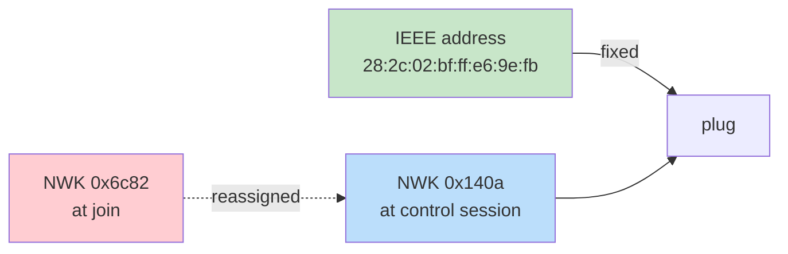

# Zigbee Control II: Sniffer, a Real Join, the Live Fingerprint, and Closing the Control Loop

This report is the second chapter of the zigbee-control bring-up. The first chapter, [[PROJECT REPORT - Zigbee Control - From a Silent Serial Port to a Formed Network on the Sonoff Dongle-P|Zigbee Control I]], ended with a formed network on the Sonoff ZBDongle-P: channel 20, PAN ID `0xF18F`, the coordinator's network key and the well-known trust-center link key in hand. This chapter picks up there and carries the work to its first complete conclusion: a packet sniffer that decrypts the network's traffic, a real device join captured end to end, the target plug's fingerprint recovered from the air rather than from a device database, and a control loop that switches the plug on and off with the round-trip captured on the wire.

The work answers four questions in order. Can a passive sniffer decrypt a network whose keys the coordinator already disclosed? Can a real commercial device join the network we formed, and can the join handshake be read in full? Does the device's advertised fingerprint match the one a device database predicted, and where does it differ? Can the coordinator actually command the device, and does the device confirm the command on the air? Each question is answered with a captured packet trace rather than an assertion.

The target device is the ThirdReality Smart Plug Gen 2, model `3RSP02028BZ`. The coordinator is the Sonoff ZBDongle-P, a Texas Instruments CC2652P2 running Z-Stack `20210708`. The sniffer is a Nordic nRF52840 dongle running the nRF Sniffer for 802.15.4 firmware. All three are on the same desk and on the same radio channel. The repository is `/home/manuel/code/wesen/2026-08-27--zigbee-control`; the docmgr ticket `zigbee-control` holds the captured traces, the scripts that produced them, and a ten-step investigation diary.

> [!summary]
> - **The sniffer decrypts the network with the coordinator's keys.** A captured Route Request frame, network-layer encrypted, was decrypted in Wireshark after the coordinator's network key was added to the preconfigured-keys table. The dissector matched the key, printed its label, and revealed the route request payload. The sniffer pipeline is therefore proven end to end: nRF52840 captures on channel 20, Wireshark dissects the 802.15.4 TAP frame, the network key decrypts the network layer.
> - **A real join was captured in full.** The ThirdReality plug joined the coordinator in 194 captured packets. The trace contains the beacon request, the coordinator's beacon, the association request and response, the transport-key frame decrypted under the well-known link key, the device announcement, the node descriptor response carrying manufacturer code `0x1233`, and the active-endpoint and simple-descriptor responses that reveal the device's cluster layout.
> - **The live fingerprint differs from the device-database prediction in three places.** The plug advertises a ZLL Commissioning cluster (`0x1000`) and a second endpoint for Green Power that the Zigbee2MQTT converter does not list, and it does not advertise the manufacturer-specific cluster `0xFF03` at all. The manufacturer code `0x1233` is confirmed live against the captured node descriptor, not against memory.
> - **The control loop closes.** The coordinator sent a ZCL On command and, fifteen seconds later, a ZCL Off command to the plug. Both were captured on the sniffer; the plug acknowledged each with a Default Response carrying SUCCESS and reported its OnOff attribute changing to On and then back. The plug's network address had changed between the join and the control session, which forced the host to resolve the address dynamically rather than cache it.

## Why this report exists

The first report established the coordinator and the keys but stopped short of using them. A coordinator that has formed a network and a sniffer that can listen are not, by themselves, useful. They become useful only when a device joins, when the join can be read, when the device's exact cluster layout is known, and when the coordinator can command the device and the device can confirm the command. This report documents each of those steps as it happened, with the packet-level evidence that each step produced.

The report is also a record of the debugging that the work required. None of the four questions answered itself on the first attempt. The sniffer produced an empty capture until traffic was generated on the coordinator. The join capture initially targeted the wrong serial device after a replug reassigned the device files. The control session hung on a network address that had changed since the join. Each failure is recorded here because each failure taught a constraint that the final Go tooling must respect.

## Current project status

The system is at a working milestone. The coordinator is live on channel 20 with a known network key and trust-center link key. The sniffer is installed, configured, and proven to decrypt the network's traffic. The ThirdReality plug is joined to the coordinator and is actively reporting its electrical measurements without being polled. The coordinator can switch the plug on and off, and the round-trip is captured and decrypted. The investigation diary in the ticket records ten chronological steps; the captured traces, the scripts, and the decoded packet dumps are stored under the ticket's `sources/` directory.

What remains is the move from a Python-driven host to a Go-driven host. The Python `zigpy` library has been the host for the bring-up because it already implements the Z-Stack network processor protocol and the Zigbee Cluster Library; the Go side has not yet been written. The design document in the ticket specifies the Go architecture, the `Host` interface that separates the command layer from the protocol backend, and the decision to bridge to `zigpy` in the first phase before any native Go implementation of the network processor protocol is attempted.

## The sniffer and the decryption pipeline

The sniffer is a passive observer. It listens on one channel, wraps each received 802.15.4 frame in the Zigbee Encapsulation Protocol, and feeds the stream into Wireshark through an extcap plugin. It does not transmit, it does not decrypt, and it does not follow a network that moves to a channel it is not listening on. Its value is entirely dependent on two things being true at once: the sniffer must be on the same channel as the network, and Wireshark must hold the keys that decrypt the network's traffic.

### The extcap plugin and the capture format

The Nordic nRF Sniffer for 802.15.4 firmware was already on the nRF52840 dongle, and the Wireshark extcap plugin that drives it was already installed in the personal extcap directory at `~/.local/lib/wireshark/extcap/nrf802154_sniffer.py`, version `0.8.0`. No flashing and no installation were required. The plugin reports itself to Wireshark with a single interface, the nRF dongle's serial device, and a channel selector with values 11 through 26. The capture it produces uses data link type 283, IEEE 802.15.4 with a TAP pseudo-header, which prepends each frame with a header carrying the received signal strength, the channel assignment, and the link quality indicator.

The capture is invoked directly from the command line, which is how every trace in this report was produced:

```
python3 nrf802154_sniffer.py \
  --extcap-interface /dev/serial/by-id/usb-Nordic_Semiconductor_ASA_nRF_802154_Sniffer_... \
  --capture --fifo out.pcap --channel 20 --metadata ieee802154-tap
```

The `--fifo` argument is the output file. The plugin opens it for writing in binary mode and streams the pcap header followed by each captured frame. The `--metadata ieee802154-tap` argument selects the TAP pseudo-header format, which is what makes the channel and signal strength visible in Wireshark's packet tree.

### The problem with an idle network

The first capture on channel 20 produced zero packets. The formed network was idle. A coordinator with no joined devices and no pending work transmits almost nothing: an occasional link-status broadcast, nothing more. The sniffer was not broken; there was simply nothing to capture.

The remedy was to generate traffic on the coordinator while the sniffer ran. The `zigpy radio` command exposes a `permit` subcommand that opens the network for joining, and a `network-scan` subcommand that performs an active scan. Both cause the coordinator to broadcast. A script was written, `scripts/07-sniff-while-driving-coordinator.py`, that starts the sniffer in the background, runs both coordinator commands, and then stops the sniffer. The capture it produced, `sources/21-sniff-ch20-with-traffic.pcap`, contained twelve packets, all from the coordinator at network address `0x0000`.

### The encryption that required the network key

The captured packets were not all readable at first. The MAC layer of the coordinator's broadcasts was unsecured, because a permit-join broadcast must be readable by any device that might want to join. The network layer, however, was secured. The first packet's network-layer security header reported `Key Id: Network Key`, a frame counter of 1250, and a six-byte payload labelled `Encrypted Payload`. The dissector could see the frame structure but could not read the command inside it.

The network key was the coordinator's, captured at formation time and stored in `sources/18-znp-info-formed.txt`: `bd:b7:69:38:44:ba:af:3d:08:1c:39:a0:15:b1:51:3e`. Wireshark stores preconfigured keys in a user-accessible table file at `~/.config/wireshark/zigbee_pc_keys`, in a comma-separated format with one key per line:

```
"5A:69:67:42:65:65:41:6C:6C:69:61:6E:63:65:30:39","Normal","ZigbeeAlliance09"
"BD:B7:69:38:44:BA:AF:3D:08:1C:39:A0:15:B1:51:3E","Normal","zigbee-control NWK (ch20 PAN 0xF18F)"
```

The first line was already present; it is the well-known trust-center link key. The second line, the network key, was added. The original file was backed up before the modification. With the network key loaded, the same packet's decode changed. The `Encrypted Payload` label disappeared, the security header printed the matched key and its label, and the payload decoded to a network-layer command:

```
ZigBee Security Header
    Security Control Field: 0x28, Key Id: Network Key, Extended Nonce
    Frame Counter: 1250
    [Key: bdb7693844baaf3d081c39a015b1513e]
    [Key Label: zigbee-control NWK (ch20 PAN 0xF18F)]
Command Frame: Route Request
    Command Identifier: Route Request (0x01)
    Command Options: 0x08, Many-to-One Discovery: With Source Routing
    Route ID: 0
    Destination: 0xfffc
    Path Cost: 0
```

The matched key and the decoded route request are the proof that the sniffer pipeline works. The coordinator's many-to-one route request, network-layer encrypted, was recovered to its command identifier and its route parameters. The twelve-packet capture decoded to a sequence of permit-join requests, route requests, and link-status broadcasts, all from the coordinator.

A detail worth recording: Wireshark's preconfigured-keys table is tried for network-layer decryption, not only for link-key decryption. The captured network key was therefore sufficient to decrypt the steady-state traffic without a captured join. The join, with its transport-key frame, is the recovery path for a network whose key was not captured at formation; it is not the only path.

## Capturing a real join

The join is the event that makes a device part of the network. It is also the event that a sniffer is most useful for, because the join handshake carries the network key to the joining device in a frame that, when decrypted with the link key, can be read in full. Capturing a join requires three things to happen at the same time: the sniffer must be listening on the network's channel, the coordinator must have its network open for joining, and the device must be put into pairing mode and powered on.

### The orchestration script

The three requirements were met by a single script, `scripts/08-capture-join.py`. The script starts the nRF52840 sniffer on channel 20 as a background subprocess, opens the coordinator for joining with `zigpy radio ... znp ... permit -t 240` as a second background subprocess, and then waits for a capture window during which the plug is paired. Both subprocesses are stopped at the end, and the script prints a summary of the capture.

The decision to run the permit-join command in the background was forced by a failure. The `permit` command blocks for the duration of the join window; it does not return after opening the network. The first version of the script called it with `subprocess.run` and a thirty-second timeout, which killed the command before the window opened. The corrected version runs it as a `Popen` and lets it live for the whole window.

The decision to address both radios by their `/dev/serial/by-id/` symlinks was also forced by a failure. After the nRF52840 dongle was unplugged and replugged, the operating system reassigned the device files: the nRF52840 moved from `/dev/ttyACM0` to `/dev/ttyACM1`, and the ESP32-H2, a second CDC-ACM device on the same machine, took `/dev/ttyACM0`. The sniffer, invoked against `/dev/ttyACM0`, hit a `termios.error: (5, 'Input/output error')` on the serial flush and produced no capture file. The by-id symlinks, which are stable across replugs, removed the ambiguity.

### The join handshake, packet by packet

The plug was powered on and factory-reset to pairing mode by holding its button for ten seconds until its LED flashed. The capture that followed, `sources/26-join-ch20.pcap`, contains 194 packets. The first thirty of them are the join handshake, and each frame is a step in the protocol.

| Frame | Time | Flow | Content |
|---|---|---|---|
| 1 | 0.00 s | broadcast | Beacon Request |
| 6 | 8.68 s | `0x0000` → broadcast | Beacon, EPID `6d:53:a9:25:c5:00:c5:c8` |
| 7 | 9.78 s | `28:2c:02:bf:ff:e6:9e:fb` → `0x0000` | Association Request, FFD |
| 11 | 10.27 s | `00:12:4b:00:2a:9a:75:ec` → plug | Association Response, PAN `0xf18f`, Addr `0x6c82` |
| 13 | 10.44 s | `0x0000` → `0x6c82` | Transport Key |
| 16 | 10.45 s | `0x6c82` → broadcast | Device Announcement, Nwk `0x6c82`, Ext `ThirdReality_bf:ff:e6:9e:fb` |
| 23 | 10.53 s | `0x6c82` → `0x0000` | Node Descriptor Response, Manufacturer Code `0x1233` |
| 29 | 10.58 s | `0x6c82` → `0x0000` | Active Endpoint Response, 2 endpoints: 1, 242 |

The beacon request in frame 1 is the plug scanning for networks. The coordinator's beacon in frame 6 advertises the network's extended PAN ID, which matches the one captured at formation. The association request in frame 7 carries the plug's IEEE address, `28:2c:02:bf:ff:e6:9e:fb`, and the association response in frame 11 assigns it the network address `0x6c82`. The transport-key frame in frame 13 is the coordinator sending the network key to the plug, encrypted under the well-known link key; with the link key loaded, Wireshark decrypts it and the network key it carries is the same one captured at formation. The device announcement in frame 16 broadcasts the plug's presence to the network, and the manufacturer string in the extended address field, `ThirdReality_bf:ff:e6:9e:fb`, is the first on-air confirmation of the device's identity.

### The node descriptor and the manufacturer code

The node descriptor response in frame 23 is the frame that confirms the manufacturer code. The Zigbee2MQTT device converter predicted manufacturer code `0x1233` for this model; a memory-based research pass had guessed `0x1266`. The captured node descriptor settles the question:

```
ZigBee Device Profile, Node Descriptor Response, Nwk Addr: 0x6c82, Status: Success
    Manufacturer Code: 0x1233
    Stack Profile: ZigBee PRO
    ... Extended Active Endpoint List Available: False
    ... Extended Simple Descriptor List Available: False
```

The manufacturer code is `0x1233`. The device is a ZigBee PRO router. The node descriptor revision is 21. This is the value the host must carry in the manufacturer-specific bit of any ZCL frame that touches the plug's vendor cluster, and it is now known from the device itself rather than from a database.

## The live fingerprint

The active-endpoint response in frame 29 reports two endpoints: endpoint 1 and endpoint 242. The coordinator then sends a simple-descriptor request for each, and the responses reveal the cluster layout of each endpoint. This layout is the device's fingerprint, and it is the authoritative source for what the host can address on the device.

### Endpoint 1

Endpoint 1 is the primary endpoint, on profile `0x0104` (Home Automation). Its simple descriptor reports eight input (server) clusters and one output (client) cluster.

| Direction | Cluster ID | Name |
|---|---|---|
| input (server) | `0x0000` | Basic |
| input (server) | `0x0003` | Identify |
| input (server) | `0x0004` | Groups |
| input (server) | `0x0005` | Scenes |
| input (server) | `0x0006` | On/Off |
| input (server) | `0x1000` | ZLL Commissioning |
| input (server) | `0x0b04` | Electrical Measurement |
| input (server) | `0x0702` | Simple Metering |
| output (client) | `0x0019` | OTA Upgrade |

### Endpoint 242

Endpoint 242 is the Green Power proxy, on profile `0xa1e0`. Its simple descriptor reports no input clusters and one output cluster:

| Direction | Cluster ID | Name |
|---|---|---|
| output (client) | `0x0021` | Green Power |

### Where the live fingerprint differs from the prediction

The Zigbee2MQTT device converter, the source used for the design document's fingerprint table, lists the same standard clusters but omits two of the advertised clusters and lists one cluster that the device does not advertise. The three differences are:

1. The ZLL Commissioning cluster `0x1000` is present on endpoint 1's input list. The converter does not list it. Its presence means the device can be commissioned by touchlink in addition to the network steering that was used here.
2. Endpoint 242, the Green Power proxy, is present. The converter does not list it. Green Power is a low-power profile for batteryless devices; the plug exposes the proxy side of it.
3. The manufacturer-specific cluster `0xFF03` is not in the simple descriptor. The converter defines it, with attributes for reset-energy, countdown timers, and LED brightness. The plug does not advertise it; the host must write its attributes directly, with the manufacturer-specific bit set in the ZCL frame control and the manufacturer code `0x1233` in the header. It is reached by knowledge, not by discovery.

The lesson is that a device database is the authoritative source for the scaling factors and the manufacturer-specific attributes, but the simple descriptor is the authoritative source for the advertised cluster set. A host that relies on the database alone would miss the ZLL and Green Power clusters; a host that relies on the simple descriptor alone would miss the vendor cluster. Both are needed.

## Live measurements from the air

After the join, the plug began to report its electrical measurements without being polled. The reports are ZCL Report Attributes commands on the Electrical Measurement and Simple Metering clusters, sent from the plug to the coordinator. Three of them, from the join capture, are sufficient to confirm that the scaling factors in the design document are correct.

| Frame | Cluster | Attribute | Raw value | Scaled |
|---|---|---|---|---|
| 160 | `0x0006` On/Off | `0x0000` OnOff | Off | — |
| 162 | `0x0b04` Electrical Measurement | `0x0505` RMS Voltage | 1186 | 118.6 V (divisor 10) |
| 164 | `0x0b04` Electrical Measurement | `0x0300` AC Frequency | 60 | 60 Hz |

The voltage reading, 1186, divided by the electrical-measurement voltage divisor of 10, is 118.6 volts, which is a plausible mains voltage. The frequency reading, 60, is 60 hertz, which is the North American mains frequency. The OnOff attribute is Off, which is the plug's state at the time of the join. The scaling is not a guess; it is the value the design document's table predicted, applied to a real reading and producing a real result.

## Closing the control loop

The control loop is the test that the coordinator can command the device and the device can confirm the command. The test sends a ZCL On command, waits fifteen seconds, and sends a ZCL Off command, all while the sniffer captures the traffic. The commands are sent through the `zigpy` library, which builds the ZCL frame, addresses it to the plug's endpoint, and sends it through the coordinator's network processor.

### The host library and the command path

The `zigpy-cli` command-line tool exposes radio-level operations — form, permit, backup, scan — but it does not expose a ZCL send command. Sending a ZCL command requires the `zigpy` library directly. The script `scripts/09-send-onoff.py` opens the coordinator with `ControllerApplication.startup()`, resolves the plug by its IEEE address, and calls the On/Off cluster's `on()` and `off()` helpers, which build and send the correct cluster-specific command frames.

The relevant calls, in order:

```python
app = ControllerApplication(cfg)
await app.startup()                      # connects and loads the network
dev = app.add_device(ieee, nwk)          # register the plug in the in-memory table
await dev.initialize()                   # ZDO discovery of the plug
onoff = dev.endpoints[1].on_off          # the On/Off cluster client
await onoff.on()                         # sends ZCL On (command id 0x01)
await asyncio.sleep(15)
await onoff.off()                        # sends ZCL Off (command id 0x00)
```

Each call returns a `Default_Response` carrying a status. A `SUCCESS` status means the plug received the command, executed it, and acknowledged it. The script prints both responses:

```
[onoff] ON -> Default_Response(command_id=1, status=<Status.SUCCESS: 0>)
[onoff] OFF -> Default_Response(command_id=0, status=<Status.SUCCESS: 0>)
```

### The network address that changed

The plug's network address was `0x6c82` during the join capture. By the time of the control session, it had changed to `0x140a`. Network addresses are assigned by the coordinator at join and can be reassigned on a rejoin; the IEEE address is permanent. The first version of the control script added the plug at `0x6c82`, the address captured during the join, and the `initialize()` call hung because the plug no longer answered at that address. The address `0x140a` was recovered from the plug's link-status broadcasts in the sniffer capture, and the script was updated to add the plug at that address. The control session then succeeded.



The host must key the device on the IEEE address and resolve the network address at runtime, either from the coordinator's device table or from a ZDO request. A cached network address is a latent bug, because it will eventually be wrong.

### The captured round-trip

The control session was captured in `sources/31-onoff.pcap`, 134 packets. The On and Off commands and their acknowledgements are the core of the trace.

| Frame | Time | Flow | Content |
|---|---|---|---|
| 83 | 0.87 s | `0x0000` → `0x140a` | ZCL OnOff: On, Seq 13 |
| 85 | 0.91 s | `0x140a` → `0x0000` | Report Attributes: OnOff = On |
| 87 | 0.91 s | `0x140a` → `0x0000` | Default Response, Seq 13, SUCCESS |
| 117 | 15.96 s | `0x0000` → `0x140a` | ZCL OnOff: Off, Seq 14 |
| 121 | 15.99 s | `0x140a` → `0x0000` | Default Response, Seq 14, SUCCESS |

The On command in frame 83 is a cluster-specific ZCL frame, direction client-to-server, command identifier `0x01`, transaction sequence 13. The plug's response has two parts: a Report Attributes command in frame 85 that announces the OnOff attribute changed to On, and a Default Response in frame 87 that acknowledges the command with `SUCCESS` and the matching sequence 13. The fifteen-second pause is visible on the wire: frame 83 is at 0.87 seconds, frame 117 is at 15.96 seconds, and the difference is the requested pause. The Off command in frame 117 is the same frame with command identifier `0x00`, and the plug's Default Response in frame 121 acknowledges it with `SUCCESS`.

The verbose decode of the On command confirms the frame structure the design document described:

```
Cluster: On/Off (0x0006)
Frame Control Field: Cluster-specific (0x01)
    Direction: Client to Server
Sequence Number: 13
Command: On (0x01)
```

The cluster is `0x0006`, the frame type is cluster-specific, the direction is client-to-server, and the command is `0x01`. The host built the frame the design document specified, the coordinator transmitted it, the plug received it, and the plug reported the state change. The control loop is closed.

## The debugging that the work required

The four questions answered in this report each required a debugging step that is worth recording, because each step exposed a constraint the final tooling must respect.

The sniffer produced an empty capture until traffic was generated on the coordinator. A formed but idle network transmits almost nothing. The remedy was to drive the coordinator with permit-join and network-scan commands while the sniffer ran. The constraint is that a sniffer capture is only as useful as the traffic on the channel; an idle network yields an empty trace even when the sniffer is working perfectly.

The sniffer initially targeted the wrong serial device after a replug reassigned the device files. The nRF52840 and the ESP32-H2 are both CDC-ACM devices, and the operating system assigns `/dev/ttyACMx` indices in enumeration order. A replug moved the nRF52840 from `ttyACM0` to `ttyACM1`, and the ESP32-H2 took `ttyACM0`. The remedy was to address both radios by their stable `/dev/serial/by-id/` symlinks. The constraint is that a script that opens a serial device by its raw `/dev/tty*` name is one replug away from targeting the wrong device.

The join capture initially captured nothing because the plug was not powered on. An empty capture has two causes — a broken sniffer or an absent network — and they are indistinguishable from the empty pcap alone. The diagnostic that separated them was that even the coordinator's own permit-join broadcasts were absent, which pointed at the sniffer or the serial path rather than at the plug. The constraint is that an empty capture must be diagnosed by checking for the coordinator's own traffic, not by assuming the sniffer is broken.

The control session hung on a network address that had changed since the join. The plug's network address was `0x6c82` at join and `0x140a` at the control session. The remedy was to recover the current address from the plug's link-status broadcasts and to add the device at that address. The constraint is that a network address is a runtime-resolved value, never a cached one; the IEEE address is the stable key.

## Open questions

- The manufacturer-specific cluster `0xFF03` is not advertised in the simple descriptor. The host can write its attributes by direct manufacturer-specific frames, but whether the plug accepts writes to all five documented attributes — reset-energy, countdown-off, countdown-on, LED brightness, allow-bind — has not been tested against the live device.
- The trust-center link key in the backup is `ZigbeeAlliance09`. Whether the plug ships with a unique install code printed on a QR label, which would supersede the well-known key on newer units, has not been checked. The device label would have to be inspected.
- The design document in the ticket still assumes the `-E`/EZSP variant of the Sonoff dongle. The hardware is the `-P`/ZNP variant. The document's host, formation, and sniffer sections must be corrected to the ZNP variant, and the reMarkable upload refreshed.
- The Go `zigbee` command-line skeleton has not been written. The Python `zigpy` library has been the host for the bring-up; the Go side, structured with the glazed framework behind a `Host` interface, is the next implementation step.

## Near-term next steps

1. Correct the design document from `-E`/EZSP to `-P`/ZNP throughout the hardware, host, and formation sections, and re-upload the bundle to reMarkable.
2. Build the Go `zigbee` skeleton: the glazed command tree, the `Host` interface, and a `zigpy-znp` bridge implementation that wraps the on/off flow the Python script just proved.
3. Implement dynamic network-address resolution in the Go host, keyed on the IEEE address, so that a changed network address does not hang the host as it hung the first control script.
4. Implement the `plug` convenience commands — power, energy, voltage, current — against the report stream, with the verified scaling factors.
5. Test the manufacturer-specific cluster `0xFF03` writes against the live plug, starting with the LED brightness attribute.

## Project working rule

A sniffer capture is only as useful as the traffic on the channel; generate traffic before concluding the sniffer is broken. Address every serial device by its stable by-id symlink, because a replug will reassign the raw device files. A network address is a runtime value that the coordinator can reassign on a rejoin; the host keys on the IEEE address and resolves the network address each session. A device's advertised cluster set comes from the simple descriptor; its vendor-specific attributes come from a device database; both are needed, and they differ in predictable ways. The control loop is proven when the captured trace shows the command, the device's state report, and the device's default response with a matching sequence number.

## Related artifacts

- Repository: `/home/manuel/code/wesen/2026-08-27--zigbee-control`
- docmgr ticket: `ttmp/2026/08/27/zigbee-control--zigbee-master-host-sniffer-and-thirdreality-smart-plug-gen2-control-go-glazed`
- First chapter: [[PROJECT REPORT - Zigbee Control - From a Silent Serial Port to a Formed Network on the Sonoff Dongle-P]]
- Investigation diary: `reference/01-investigation-diary.md` in the ticket (ten steps)
- Sniffer capture with traffic: `sources/21-sniff-ch20-with-traffic.pcap`
- Decryption proof: `sources/24-pkt1-decode-withkey.txt`
- Join capture: `sources/26-join-ch20.pcap` (194 packets)
- Join handshake decode: `sources/28-join-handshake-decode.txt`
- Live fingerprint findings: `sources/30-live-fingerprint-findings.md`
- On/Off capture: `sources/31-onoff.pcap` (134 packets)
- On/Off frame summary: `sources/33-onoff-frames.txt`
- Capture scripts: `scripts/07-sniff-while-driving-coordinator.py`, `scripts/08-capture-join.py`, `scripts/09-send-onoff.py`
