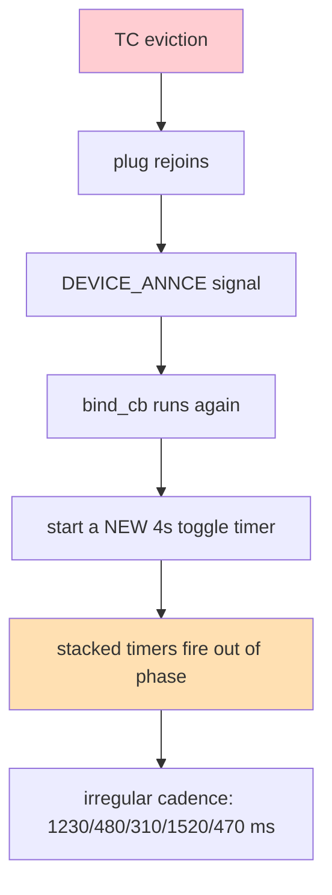

# Zigbee Control III: The ESP32-H2 Coordinator and the Trust-Center Eviction

This report is the third chapter of the zigbee-control bring-up. The first chapter, [[PROJECT REPORT - Zigbee Control - From a Silent Serial Port to a Formed Network on the Sonoff Dongle-P|Zigbee Control I]], made a Sonoff ZBDongle-P the coordinator. The second chapter, [[PROJECT REPORT - Zigbee Control II - Sniffer, a Real Join, the Live Fingerprint, and Closing the Control Loop|Zigbee Control II]], captured a real device join and closed the control loop. This chapter replaces the Sonoff with an ESP32-H2 as the coordinator and records the one bug that made that replacement difficult: the ESP-Zigbee SDK's trust center evicts a commercial Zigbee 3.0 router about fifteen seconds after it joins, producing a join-remove-rejoin loop. The fix is a single configuration call that makes the trust center lenient, and the chapter is mostly the story of finding it.

The work answers a question that the first two chapters did not have to ask. The Sonoff's Texas Instruments Z-Stack is a lenient trust center: it accepts a device that joins with the well-known `ZigbeeAlliance09` link key and lets it stay. The ESP-Zigbee SDK's trust center is strict by default: it accepts the same join, then attempts a link-key exchange with the new device, and if that exchange does not complete within a timeout, it removes the device. The ThirdReality plug, a standard commercial Zigbee 3.0 router, joins cleanly but does not complete that exchange, so the ESP32-H2 evicts it. The chapter is about identifying that mechanism on a packet sniffer and disabling it with the SDK's own configuration API.

The repository is `/home/manuel/code/wesen/2026-08-27--zigbee-control`. The firmware is a modified copy of the ESP-Zigbee SDK's `HA_on_off_switch` example under `firmware/esp_zigbee_HA_sample/HA_on_off_switch/`. The docmgr ticket `zigbee-h2-coordinator` holds the design guide, the implementation diary, and the captured traces.

> [!summary]
> - **The ESP32-H2 is a working Zigbee coordinator.** A modified `HA_on_off_switch` builds with ESP-IDF 5.5.4 and the ESP-Zigbee SDK, flashes to the M5Stack H2 over USB-Serial/JTAG, and forms a network on channel 20. The ThirdReality plug joins it, the H2 binds to the plug's On/Off server cluster, and a periodic toggle switches the plug on and off every four seconds. The relay clicks on a clean four-second beat.
> - **The stock SDK evicts commercial routers.** Out of the box, the ESP-Zigbee trust center removes a joining device that does not complete a post-join link-key exchange within its timeout. The plug does not complete it, so the H2 sends a `Remove Device` ZDO command about fifteen seconds after the join, and the plug leaves and rejoins, in a loop. The TI Z-Stack on the Sonoff does not enforce this exchange, which is why the same plug was stable on the Sonoff.
> - **The fix is one call.** `esp_zb_secur_link_key_exchange_required_set(false)` after `esp_zb_init()` makes the trust center lenient. The join still uses the link key to transport the network key; only the follow-up exchange is skipped. After the call, the plug joins, the `ZDO Device Authorized` signal still fires, but no `Remove Device` follows, and the plug stays. The toggle cadence becomes a clean four seconds.
> - **A second bug, found while debugging the first.** The eviction caused the plug to rejoin repeatedly, and the example re-ran its bind callback on every rejoin, starting a new periodic toggle timer each time. Multiple timers stacked and fired out of phase, producing an irregular cadence. Two boolean guards — one that allows only a single toggle timer, one that binds only once — fixed the stacking independent of the eviction.

## Why this report exists

The first two chapters proved the system on the Sonoff. The Sonoff is a known-good coordinator, but it is not the project's intended coordinator. The stated direction is a master that runs on an M5Stack CoreS3 paired with a Gateway H2, with the Sonoff as a fallback. Before that master can be built, the ESP32-H2 must be proven as a coordinator that can control a real device. This chapter is that proof, and it records the one real obstacle in the way: a trust-center policy mismatch between the ESP-Zigbee SDK and a commercial device that the TI Z-Stack tolerates by default.

The chapter is also a record of how the obstacle was found. The eviction is not logged as an error. The trust center reports `ZDO Device Authorized` with a success status and then quietly removes the device. The only way to see the removal is to capture it on a packet sniffer, which is why the sniffer pipeline built in the second chapter was necessary before this chapter could be written. The debugging sequence — serial log, then sniffer capture, then a targeted configuration change — is the reusable part of the work.

## The firmware

The firmware is the ESP-Zigbee SDK's `HA_on_off_switch` example, copied into the repository and modified. The example is a Zigbee coordinator with an On/Off switch function: it forms a network, opens it for joining, and on a device announcement issues a Match Descriptor request for an On/Off server, binds its switch client to that server, and sends a Toggle command on a button press. The ThirdReality plug exposes an On/Off server cluster, so it is, in the example's vocabulary, the "light."

Three modifications were made to the stock example.

The first is the channel. The example's `esp_zb_switch.h` defines the primary channel mask as channel 13. Channel 20 was already in use and known to be clean at the dongle's physical location, so the mask was changed to channel 20 to avoid the radio-frequency interference that had affected the Sonoff's formation.

The second is the trust-center policy, and is the subject of most of this report. The third is a periodic toggle that replaces the button press, so the relay can be heard without wiring a button to the board. The toggle re-arms itself every four seconds through the SDK's one-shot scheduler alarm.

```c
static void esp_zb_task(void *pvParameters) {
    esp_zb_cfg_t zb_nwk_cfg = ESP_ZB_ZC_CONFIG();   // coordinator
    esp_zb_init(&zb_nwk_cfg);
    esp_zb_secur_link_key_exchange_required_set(false);  // lenient TC (the fix)
    esp_zb_on_off_switch_cfg_t switch_cfg = ESP_ZB_DEFAULT_ON_OFF_SWITCH_CONFIG();
    esp_zb_ep_list_t *ep = esp_zb_on_off_switch_ep_create(HA_ONOFF_SWITCH_ENDPOINT, &switch_cfg);
    esp_zb_device_register(ep);
    esp_zb_set_primary_network_channel_set(ESP_ZB_PRIMARY_CHANNEL_MASK);
    ESP_ERROR_CHECK(esp_zb_start(false));
    esp_zb_stack_main_loop();   // does not return
}
```

The build uses ESP-IDF 5.5.4 and the ESP-Zigbee SDK's managed components (`esp-zboss-lib` and `esp-zigbee-lib`, version 1.6.0). The IDF environment is sourced with `. ~/esp/esp-idf-5.5.4/export.sh` before any build or flash command. The target is set with `idf.py set-target esp32h2`, and the firmware is flashed over the H2's USB-Serial/JTAG interface at the stable by-id serial path.

## The join that succeeded and the device that would not stay

The first formation worked. The H2 booted, initialised the Zigbee stack, formed a network on channel 20 with a randomly chosen PAN ID, and opened the network for joining for one hundred and eighty seconds. The serial log was unambiguous:

```
I (411) ESP_ZB_ON_OFF_SWITCH: Initialize Zigbee stack
I (421) ESP_ZB_ON_OFF_SWITCH: Device started up in non factory-reset mode
I (1031) ESP_ZB_ON_OFF_SWITCH: Network(0x68bb) is open for 180 seconds
```

The plug was factory-reset and powered on. It joined. The H2 found it, bound to it, and the serial log reported success:

```
I (3061) ESP_ZB_ON_OFF_SWITCH: ZDO signal: NWK Device Associated (0x12), status: ESP_OK
I (3091) ESP_ZB_ON_OFF_SWITCH: New device commissioned or rejoined (short: 0x9f3e)
I (3121) ESP_ZB_ON_OFF_SWITCH: Found light
I (3131) ESP_ZB_ON_OFF_SWITCH: Bound successfully!
```

Then, about fifteen seconds later, the device left, and the cycle repeated at a new short address:

```
I (18071) ESP_ZB_ON_OFF_SWITCH: ZDO signal: ZDO Device Authorized (0x2f), status: ESP_OK
I (18101) ESP_ZB_ON_OFF_SWITCH: ZDO signal: ZDO Leave Indication (0x13), status: ESP_OK
I (29421) ESP_ZB_ON_OFF_SWITCH: ZDO signal: NWK Device Associated (0x12), status: ESP_OK
I (29451) ESP_ZB_ON_OFF_SWITCH: New device commissioned or rejoined (short: 0xbefd)
```

The `ZDO Device Authorized` signal carries a success status, which is misleading. The signal is not an error; it is the trust center noting that the authorization step completed. The leave that follows it is the trust center removing the device. The serial log alone does not say who removed whom or why; it only shows that the device associated, was authorised, and then left, over and over.

## Reading the eviction on the sniffer

The sniffer built in the second chapter was turned on the H2's network. The capture, `sources/03-h2-loop-sniff.pcap`, contains the full join handshake, decrypted with the well-known `ZigbeeAlliance09` link key, and the eviction that followed it.

The join is the same handshake the second chapter documented for the Sonoff, now with the H2 as the coordinator. The H2's MAC is `48:31:b7:ff:fe:ca:45:5b`, and its beacon advertises the extended PAN ID `Espressif_ff:fe:ca:45:5b`. The plug's association request carries its IEEE address, the association response assigns it a short address, and the H2 sends the transport-key frame:

```
ZigBee Network Layer Data, Dst: 0xadac, Src: 0x0000
    Security Control Field: 0x30, Key Id: Key-Transport Key, Extended Nonce
        Key Id: Key-Transport Key (0x2)
        [Key: 5a6967426565416c6c69616e63653039]
        [Key Label: ZigbeeAlliance09]
    Command Frame: Transport Key
        Key Type: Standard Network Key (0x01)
        Key: f2fbb180f11df6062f5885ffcab36cf4
```

The transport key decrypted cleanly. The H2's network key is `f2fbb180f11df6062f5885ffcab36cf4`, recovered from the capture by the same method used for the Sonoff: the link key decrypts the transport frame, and the network key is inside it. With that key loaded into Wireshark's preconfigured-keys table, the rest of the capture decrypted.

Between the join and the eviction, the plug worked. It reported ZCL attributes, and the H2 sent Default Response frames in reply. The capture shows the plug's OnOff reports and the coordinator's acknowledgements flowing for about fifteen seconds. Then, at the twenty-six-second mark, the H2 sends four `Remove Device` commands in quick succession:

```
81  26.533160  0x0000 → 0xadac  Remove Device
82  26.538320  0x0000 → 0xadac  Remove Device
83  26.543349  0x0000 → 0xadac  Remove Device
84  26.548362  0x0000 → 0xadac  Remove Device
...
86  29.325515  0xadac → Broadcast  Leave
```

The `Remove Device` is a ZDO command, identifier `0x07`, sent by the coordinator to the plug, carrying the plug's IEEE address. The plug obeys it and broadcasts a `Leave`. The capture is the proof of who removed whom: the coordinator removed the device. No `Update Key` or other command precedes the removal; the trust center simply removes the device after a timeout.

| Time | Frame | Flow | Content |
|---|---|---|---|
| 11.53 s | 14 | `0x0000` → plug | Transport Key (decrypted with `ZigbeeAlliance09`) |
| 11.55 s | 18-22 | both | Match Descriptor request/response, bind setup |
| 13-21 s | 30-79 | both | plug reports attributes, H2 sends Default Responses |
| 26.53 s | 81-84 | `0x0000` → plug | Remove Device (×4) |
| 29.33 s | 86 | plug → broadcast | Leave |

The mechanism is now visible. The plug joins, receives the network key, and is functional. The trust center then attempts a link-key exchange. The plug does not complete it. After the trust center's timeout, the trust center removes the plug, the plug leaves, and because the plug is still in pairing mode and the network is still open, it rejoins, and the cycle repeats.

## Why the Sonoff did not evict the plug

The same plug joined the Sonoff in the second chapter and stayed. The Sonoff's coordinator is the Texas Instruments Z-Stack, version `20210708`, on a CC2652. The Z-Stack is a lenient trust center: it transports the network key under the link key and does not require the joining device to complete a follow-up link-key exchange. The ESP-Zigbee SDK, by default, is a strict trust center: it transports the network key under the link key and then requires the exchange, removing the device if the exchange does not complete.

The difference is a default, not a capability. The ESP-Zigbee SDK exposes the policy through `esp_zb_secur_link_key_exchange_required_set`, documented as allowing the coordinator to "let the end device stay in network without a TC-link key exchange." The Sonoff's behaviour is the ESP-Zigbee SDK's behaviour with that setting disabled. The fix is to disable it.

## The fix

The trust-center policy call is added to the Zigbee task, immediately after `esp_zb_init`:

```c
esp_zb_init(&zb_nwk_cfg);
esp_zb_secur_link_key_exchange_required_set(false);
```

The call is made before the stack starts. The trust center remains the trust center; it still generates and transports the network key under the link key. Only the post-join link-key exchange requirement is removed. The network is still encrypted at the network layer; the join still uses the link key to protect the network key in transit. What is removed is the requirement that the joining device prove possession of a unique link key after the join, which is the requirement the commercial plug does not meet when it joins with the well-known key.

This is a deliberate lowering of the trust center's standard, appropriate for a personal network. A stricter deployment would provision each device with a unique install code and use the SDK's install-code APIs to enforce per-device link keys. For a network under a single owner's control, where the threat model is a casual eavesdropper rather than a determined attacker, the lenient setting is acceptable, and it is the setting that makes commercial Zigbee 3.0 routers stay on the network.

## The stacked-timer bug

The first eviction fix was `esp_zb_tc_policy_set_distributed_security(true)`, which reduced the eviction but did not eliminate it. While that partial fix was in place, a second bug became visible: the toggle cadence was irregular. The relay clicked in a pattern of roughly 1230, 480, 310, 1520, and 470 milliseconds, repeating. The pattern sums to about four thousand milliseconds, which was the clue.

The example's signal handler runs the bind callback on every `ESP_ZB_ZDO_SIGNAL_DEVICE_ANNCE`, which fires on every join and every rejoin. The bind callback, on success, started a new periodic toggle timer. Each eviction caused a rejoin, each rejoin re-ran the bind callback, and each bind started another four-second timer. Several timers running concurrently and firing out of phase produced the irregular pattern: the five intervals in the pattern are five timers interleaving, and they sum to the four-second period of any one of them.



Two boolean guards removed the stacking independent of the eviction. A `s_toggle_running` flag allows only one toggle timer to start. A `s_bound` flag runs the bind only once, so rejoins do not re-enter the bind callback. With both guards, even if the plug rejoins, no new timer starts, and the cadence stays regular.

```c
static bool s_toggle_running = false;
static bool s_bound = false;

static void bind_cb(esp_zb_zdp_status_t zdo_status, void *user_ctx) {
    if (zdo_status == ESP_ZB_ZDP_STATUS_SUCCESS) {
        s_bound = true;
        ...
        if (!s_toggle_running) {
            s_toggle_running = true;
            esp_zb_scheduler_alarm((esp_zb_callback_t)emit_toggle, 0, 4000);
        }
    }
}
```

The guards are a defensive measure. The real fix is the lenient trust center, which stops the eviction and therefore the rejoins. But the guards make the toggle robust to any residual rejoin, and they cost nothing.

## The result

With the lenient trust center and the guards in place, the H2 was erased and re-flashed so it formed a fresh network (PAN `0xcae7`) with the new policy. The plug was factory-reset and joined at short address `0x992a`. The H2 found it, bound to it, and started the periodic toggle:

```
I (134421) ESP_ZB_ON_OFF_SWITCH: New device commissioned or rejoined (short: 0x992a)
I (134451) ESP_ZB_ON_OFF_SWITCH: Found light
I (134461) ESP_ZB_ON_OFF_SWITCH: Bound successfully!
I (134461) ESP_ZB_ON_OFF_SWITCH: Start periodic on/off toggle every 4 seconds
```

The toggle cadence, measured over the next forty seconds, is a clean four thousand and ten milliseconds, every interval:

```
4010 4010 4010 4010 4010 4010 4010 4010 4010
```

The `ZDO Device Authorized` signal still appears, once, between two toggles:

```
I (146501) ESP_ZB_ON_OFF_SWITCH: Send 'on_off toggle' command
I (149401) ESP_ZB_ON_OFF_SWITCH: ZDO signal: ZDO Device Authorized (0x2f), status: ESP_OK
I (150511) ESP_ZB_ON_OFF_SWITCH: Send 'on_off toggle' command
```

No `Remove Device` follows it. No `Leave` follows it. The plug stays, the toggles continue, and the relay clicks on a four-second beat. The trust center still notices that the link-key exchange did not complete — the `Authorized` signal is the notice — but it no longer acts on that notice. The lenient setting is exactly the policy change the documentation describes: the device stays in the network without the exchange.

The control loop is closed on the ESP32-H2. The H2 is the coordinator, the plug is the controlled device, and the round-trip is a periodic toggle that the relay confirms audibly.

## The two trust centers, compared

The chapter's central observation is that two compliant Zigbee coordinators behave differently toward the same commercial device, and the difference is a configuration default. The table makes the comparison explicit.

| | Sonoff ZBDongle-P (TI Z-Stack) | ESP32-H2 (ESP-Zigbee SDK, default) | ESP32-H2 (lenient) |
|---|---|---|---|
| Coordinator chip | CC2652 | ESP32-H2 | ESP32-H2 |
| Network key transport | under `ZigbeeAlliance09` | under `ZigbeeAlliance09` | under `ZigbeeAlliance09` |
| Post-join link-key exchange | not required | required | not required |
| Commercial router after join | stays | evicted (~15 s) | stays |
| Configuration | default | default | `esp_zb_secur_link_key_exchange_required_set(false)` |

The Sonoff and the lenient ESP32-H2 behave identically toward the plug. The default ESP32-H2 is the outlier, and the outlier is fixed by one call.

## What was learned

The eviction is not an error; it is a policy. The serial log reports `ZDO Device Authorized` with a success status and then a leave, and nothing in the log says the leave was forced by the coordinator. The sniffer is the only way to see the `Remove Device` command that the coordinator sends. A trust-center policy problem is invisible without a packet capture.

A commercial Zigbee 3.0 router that joins with the well-known link key is not broken. It is a device that completes the join and the network-key transport and then does not complete a link-key exchange that one coordinator requires and another does not. The same device is stable on a lenient trust center and evicted on a strict one. The device's behaviour is constant; the coordinator's policy is the variable.

The ESP-Zigbee SDK exposes the policy directly. `esp_zb_secur_link_key_exchange_required_set` is documented for exactly this case, and the fix is a single line. The harder part was finding that the line was needed, which required the sniffer to see the removal and the SDK headers to find the call.

A rejoin re-triggers every callback that the join triggers. The example's bind callback ran on every `DEVICE_ANNCE`, and every rejoin started a new periodic timer. A callback that starts a recurring action must guard against being started more than once, or the action will stack. The guards are cheap and they make the firmware robust to rejoins that the trust center may still cause for other reasons.

## Open questions

- The `ZDO Device Authorized` signal still fires once with the lenient trust center. Whether it fires on every rejoin, and whether a rejoin still occurs occasionally, has not been measured over a long window. A multi-hour capture would confirm the plug is truly stable.
- The H2's network key is not printed in the serial log. It is recovered from a captured transport-key frame, as documented here. A firmware change to print the key at formation would remove the need for a capture to key the sniffer.
- The toggle is a fixed four-second cadence. The Go host, when it drives the H2, will need a controllable trigger — a UART command or a GPIO button — rather than a periodic timer. The firmware change is small and is the next step before the Go integration.
- Path B, in which the H2 joins the Sonoff's existing network as an end device, has a design guide in ticket `zigbee-h2-router-join` but has not been implemented. The lenient-trust-center lesson does not apply to Path B directly, because in Path B the H2 is not the trust center; the Sonoff is, and the Sonoff is already lenient.

## Near-term next steps

1. Replace the periodic toggle with a UART-triggered on/off, so the Go host can command the H2 over the serial port.
2. Capture a long window of the lenient-trust-center network on the sniffer to confirm the plug is stable over hours, not just minutes.
3. Print the H2's network key at formation, so the sniffer can be keyed without a join capture.
4. Implement Path B as the second step, reusing the Sonoff's existing network and the sniffer's existing keys.

## Project working rule

A device that joins and then leaves is not necessarily a broken device; it may be a device that the trust center removed. The serial log will not say so, because the removal is a policy action with a success status, not an error. Capture the join on a sniffer and look for a `Remove Device` command from the coordinator before concluding the device is at fault. When the coordinator is the ESP-Zigbee SDK and the device is a commercial Zigbee 3.0 router joining with the well-known link key, the removal is the SDK's strict trust-center default, and the fix is `esp_zb_secur_link_key_exchange_required_set(false)`. A callback that starts a recurring action must guard against running more than once, because a rejoin re-triggers every join callback, and unguarded recurring actions stack.

## Related artifacts

- Repository: `/home/manuel/code/wesen/2026-08-27--zigbee-control`
- Firmware: `firmware/esp_zigbee_HA_sample/HA_on_off_switch/main/esp_zb_switch.c`
- docmgr ticket: `zigbee-h2-coordinator`
- Loop capture (before the fix): `sources/03-h2-loop-sniff.pcap` in the ticket
- Irregular-timing log (stacked timers): `sources/08-h2-irregular-timing.log` in the ticket
- First chapter: [[PROJECT REPORT - Zigbee Control - From a Silent Serial Port to a Formed Network on the Sonoff Dongle-P]]
- Second chapter: [[PROJECT REPORT - Zigbee Control II - Sniffer, a Real Join, the Live Fingerprint, and Closing the Control Loop]]
- Reference example: `~/esp/esp-zigbee-sdk/examples/esp_zigbee_HA_sample/HA_on_off_switch/`
- Trust-center API: `esp_zb_secur_link_key_exchange_required_set` in `~/esp/esp-zigbee-sdk/components/esp-zigbee-lib/include/esp_zigbee_secur.h`
