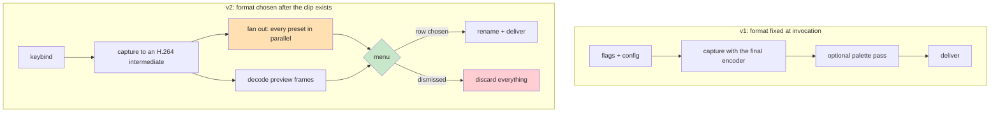

# snipmov: Building a Screen Recorder, and a Catalogue of Its Defects

This report covers the complete construction of `snipmov`, a Linux tool that records a rectangular screen region and delivers it as a shareable clip. It was designed and built in one session across two tickets: `SCREENCAST-001` produced the recorder, and `SCREENCAST-002` added a post-capture export menu and a preset system. The result is 8,325 lines of Go, of which 2,124 are tests, across twelve packages, with seven third-party dependencies and exactly two hard runtime requirements — `ffmpeg` and an X11 display.

The technically interesting parts are documented in [[PROJECT REPORT - snipmov - Compositing a Selection Overlay Without a Compositor]], which covers the X11 acquisition model, the selection overlay, container finalization, and the GIF palette measurement. This report does not repeat them. It covers what that one could not: the second half of the system — deferred encoding, presets, the menu, and the clipboard — and then does something the first report only gestured at, which is to treat the project's eighteen defects as data and ask what they have in common.

The answer to that question is the most transferable thing the project produced. **The overwhelming majority of defects were not logic errors. They were cases of the program communicating something untrue** — a filename that claimed a format it did not carry, a flag documented in help text that did nothing, a checkbox that could not affect anything, a `--dry-run` line that could not be run. A design document specifies behaviour and interfaces; it has no vocabulary for the gap between what a program does and what it implies. That gap is closed only by using the program and looking at its output.

> [!summary]
> - **Design-first paid, and its limits were visible.** Twenty-five of twenty-six acceptance checks passed on their first execution against a 1,328-line specification written before any code. Every defect that survived was in the category the specification could not describe.
> - **Twelve of eighteen defects were miscommunications rather than miscomputations.** The program computed correctly and then said something false about the result. This class is invisible to unit tests, which assert on values rather than on what a user is told.
> - **Documenting a trap does not prevent it.** The rule "every icon must be drawn, never typed" was written up after `U+25B6` rendered as a missing-glyph box — and the next renderer shipped `U+23CE`, which rendered as a missing-glyph box. Only a check prevented the third occurrence.
> - **Two misdiagnoses came from experiments that varied two things at once.** WebP appearing not to animate from `x11grab` was actually a static capture; four flag combinations agreed with a theory that was not there because every trial changed the source as well as the flag.
> - **The clipboard question could not be reasoned about, only measured.** An X selection owner serves one target set at a time, and which one an application reads is a property of that application. Three defaults were wrong before a five-minute test with a purpose-built tool produced the right one.

## Why this project exists

The requirement is narrow. A person is in a chat window or a bug report; something on screen is faster to show than to describe; they want to draw a box around it, let it run for ten seconds, and drop the result into the conversation already open, within about twenty seconds.

Decomposing that into steps with a time budget produces three constraints that existing Linux tools violate. The invocation must not create a window, because a window covers the region being recorded, takes focus from the application being demonstrated, and under a tiling window manager rearranges the layout that is the subject of the recording. The stop signal must be reachable without leaving the region under observation. And delivering the file is part of the tool rather than the user's problem.

Every existing option fails at least one. Peek is a window. OBS is a broadcast studio requiring a Display Capture source and a Crop filter with typed offsets. `byzanz-record` has the right command-line shape but requires knowing the rectangle in advance. The honest baseline is the shell function every power user writes:

```bash
rec() {
  read -r X Y W H < <(slop -f '%x %y %w %h')
  ffmpeg -f x11grab -framerate 25 -video_size "${W}x${H}" -i "+${X},${Y}" \
         -c:v libx264 -crf 23 -preset veryfast -pix_fmt yuv420p out.mp4
}
```

That function is the correct shape with roughly eight defects, each of which gets patched by a different person into a different, subtly broken snippet. The project's scope is therefore one sentence: **snipmov is `slop | ffmpeg | xclip` collapsed into a single dependency-free binary with those defects fixed, and nothing else.**

## Current project status

Complete and verified. The source is at `/home/manuel/code/wesen/2026-08-27--screen-mov-recording`.

| Measure | Value |
|---|---:|
| Go source | 8,325 lines |
| of which tests | 2,124 lines |
| Package test suites | 12, all passing under `-race` |
| Acceptance checks (`05-definition-of-done.sh`) | 35/35 |
| Selector harness under Xvfb | 14/14 |
| Menu harness under Xvfb | 12/12 |
| Design documentation | 9,133 lines across two tickets |
| Commits | 47 |
| Hard runtime dependencies | 2 (`ffmpeg`, an X11 display) |

Two documentation packages are on the reMarkable at `/ai/2026/08/27/SCREENCAST-001` and `/ai/2026/08/27/SCREENCAST-002`, each comprising an analysis, an architecture specification, an intern implementation guide, and a chronological diary.

## Architecture, and the change that reshaped it

The system began with the format fixed before recording. It ended with the format chosen after.



The motivation for the change is that the correct format is a property of what was captured and where it is about to be pasted, and the user frequently knows neither when they press the keybind. The remedy in v1 is to record again, which is cheap in principle — the rectangle is remembered — and expensive in practice, because the behaviour being demonstrated has to be made to happen a second time.

### Honouring a non-goal rather than eroding it

`SCREENCAST-001` listed a GUI as an explicit non-goal. Adding a menu therefore required either honouring that or stating plainly why it no longer applied.

The reasoning behind the original constraint was specific: a window *at invocation* covers the region, steals focus, and rearranges the tiling layout. None of that applies after recording has stopped. The constraint was about timing rather than about windows, and the rule that survives is **no window before the recording ends**. Writing that reinterpretation down, rather than quietly adding a window, is what allows a future reader holding both documents to see that the non-goal was respected.

## Presets

A preset is a name plus every parameter needed to produce a file, plus where the file goes. The defining property is that **a preset is fully determined**: choosing one leaves no further decision to make, which is what allows the menu to contain exactly one decision rather than six.

```toml
[[preset]]
name       = "tiny-gif"
label      = "Tiny GIF"
format     = "gif"
max_width  = 480
fps        = 12
max_colors = 64
clipboard  = true
save       = false
```

Three design decisions in the preset system are worth stating because each has a non-obvious justification.

**A preset carries no trim, delay or region.** Those are properties of the capture rather than of the export, and a preset must be applicable to a clip that already exists — which, in the menu path, it always is.

**`Preset.EncodeOptions()` projects onto the existing `encode.Options`.** A preset adds no encoding capability; it names a combination of capabilities the tool already had. Consequently every argv builder and its golden tests carried over untouched. Giving `Preset` its own encoding logic would have created a second place to change a filtergraph.

**Config presets replace the built-ins rather than merging.** Append would leave a user unable to remove a built-in they dislike, since their config could only grow the list. Merge-by-name would let them override entries but not reorder, and order is the menu's order — which matters because presets are ordered fastest-first, so the row most likely to be wanted is the row most likely to have finished encoding. Replace gives full control at the cost of a cliff, and `snipmov preset init` writes the built-ins into the config so the cliff has a one-command bypass.

Validation runs when the config loads, not when a preset is used. A typographical error in the fourth preset must not surface an hour later when it is first selected. One validation rule is worth quoting because it encodes a judgement rather than a constraint:

```go
if !p.Clipboard && !p.Save {
    return fmt.Errorf("preset %q does nothing: set clipboard or save", p.Name)
}
```

A preset that produces a file and then discards it is always a mistake, so it is reported as a configuration error rather than executed as a silent no-op.

## The deferred pipeline

Capture writes one near-lossless H.264 intermediate at CRF 18 into a session directory; every preset is then encoded from it in parallel.

```go
func (f *Fan) Run(ctx context.Context, ps []preset.Preset) <-chan Result
```

`Run` returns immediately rather than waiting. Three properties are each enforced by a test:

- **Concurrency is bounded** at `min(4, NumCPU)`. Four concurrent `ffmpeg` processes produced a measured 1.5–1.9x speedup on eight cores rather than 4x, because each is already multithreaded and they contend. More concurrency buys nothing and starves the goroutine drawing the menu.
- **Exactly one `Result` per preset, always**, including failures and including cancellation. The menu ranges over the channel expecting one row per preset; a result that never arrives leaves a permanently pending row with no explanation.
- **Failures are isolated.** This is the property most likely to be implemented wrongly, because the idiomatic Go construct here is an `errgroup` — and an `errgroup` cancels its context on the first error, which would terminate the three sibling encodes.

Session directories live under `$XDG_RUNTIME_DIR` rather than `/tmp`: it is `tmpfs`, mode 0700, and cleared at logout, so a crash cannot leave a recording of someone's screen readable by other users. A startup sweep removes directories whose owning process is gone.

### The measurement that determined the architecture

The design rests on pre-encoding completing before the user chooses. The first measurement of four presets in parallel returned **782 ms**, which supports the sentence "nobody reads a five-row menu and decides in under 782 ms" — a sentence that was written, and was wrong.

Repeating the measurement against busier screen content produced 1,994 ms. Then 1,060. Then 1,806. With the machine under load, three consecutive runs at 2,790 / 2,874 / 2,851.

The real range is **0.8 to 2.9 seconds**, varying with two things the tool cannot control: how much is changing on screen, and what else the machine is doing. The slowest figures came from a loaded machine, which is the realistic condition, because the user has just finished demonstrating something.

That inverted the emphasis of the design. Asynchronous row population moved from a caveat to a requirement, with two companions: the menu must remain usable while rows are pending, and presets should be ordered fastest-first. The measurement script was rewritten to run N iterations and report a range, because one sample is not a measurement.

## The menu, and rendering without a widget toolkit

The menu is drawn directly with `golang.org/x/image` — no GTK, no Fyne, no Gio, no cgo. That decision was validated with a prototype before any production code was written.

The usual reason to adopt a widget toolkit is that it makes an application look native and modern. Here that is precisely what is not wanted: the design is monochrome System 1, and every toolkit's default behaviour works against it. The second reason is layout and widget behaviour, but the required widget set is small — label, list with selection, radio group, checkbox, slider, button, image view — and the layout is an accumulator over a few named constants.

| Question | Measured answer |
|---|---|
| Widget toolkit needed? | No. 347 lines covered all seven widgets. |
| cgo? | No. `CGO_ENABLED=0` produces a statically linked binary. |
| Dependencies added | `golang.org/x/image` alone; the fonts ship inside it. |
| Full repaint cost | 1.3 ms at 1320×940. Font faces parse in 3.7 µs, once. |

The package splits three ways so that only one file requires X11: `model.go` is pure state, `render.go` is a pure function from model to framebuffer, and `window.go` owns the connection. Model and renderer are therefore fully testable without a display, including assertions no model test could make — that the output is monochrome, that the selected row actually inverts, and that nothing is drawn outside the dialog and its shadow.

### The focus problem

This is the one genuinely novel X11 problem in the second ticket, and it is worth stating precisely because the symptom is baffling.

The menu must be **override-redirect**, for the same reason the selection overlay is: under i3 an ordinary window is tiled, which rearranges the workspace at the worst possible moment. Override-redirect instructs the window manager to ignore the window entirely.

But **the window manager is what assigns keyboard focus, and it ignores override-redirect windows.** The menu therefore never receives a `FocusIn`, and every keystroke goes to whatever was focused before. The window is visible, clearly on top, and typing does nothing at all.

The resolution is to grab the keyboard outright, with a retry loop, because another client — frequently the window manager's own grab from the keybind that launched the tool — may hold one. Unlike the selection overlay, this grab is **not** best-effort: the overlay survived a failed keyboard grab because Escape still worked whenever nothing else held focus, whereas a menu that silently ignores input cannot be operated at all. A failed grab therefore falls back to exporting the first preset and logging why.

### The event model

One goroutine owns the UI, because X connections are not safe for concurrent use and neither is the render state.

```go
for {
    select {
    case r := <-w.results:  w.model.Apply(r); w.dirty = true   // an encode finished
    case ev := <-xev:       w.handle(ev)                        // input
    case <-tick.C:          w.blit(w.sheet, w.frame)            // advance the preview
    case <-ctx.Done():      return nil, ErrDismissed
    }
    if w.dirty { w.repaint(); w.dirty = false }
}
```

`pumpX` exists as the only other goroutine touching X, and it only reads events: `xgb.Conn.WaitForEvent` blocks and cannot participate in a `select`.

The chrome and the preview contend for the same pixels — the chrome is a full-window `PutImage`, the preview a `CopyArea` into the middle of it. The ordering rule that resolves it: `repaint` always blits the current frame immediately after uploading the chrome, and the tick blits *without* repainting. The expensive path is rare and self-repairing; the frequent path is one server-side copy. Reversing that would push megabytes per second over the socket for a preview occupying a fifth of the dialog.

### The preview, and why it matters

Frames are decoded once through `ffmpeg` to raw `bgra`, uploaded as one pixmap grid, and looped with a `CopyArea` per tick.

Requesting `bgra` rather than `rgba` is the substantive detail: an X server at depth 24 with 32 bits per pixel and `LSBFirst` byte order — what every x86 Xorg reports — wants `B,G,R,pad` in memory, so each decoded frame reaches `PutImage` with no per-pixel conversion at all.

The grid matters because a single tall strip hits driver limits: 60 frames at 360 rows is 21,600 and acceptable, but 105 frames is 37,800 and exceeds the common 32,767 pixmap dimension limit.

Selecting a ready row switches the preview to **that preset's actual encoded output**. This is the single most valuable behaviour in the menu, and it follows directly from the first ticket's central finding: the naive GIF path produced a file 40% smaller while retaining 91 of the source frame's 12,069 colours, at SSIM 0.757 against the two-pass pipeline's 0.999. Palette damage is invisible in file-size terms. Showing the real encoded result at the moment of choice makes it visible before the user commits.

## The keybind as the entire interface

The tool is invoked from a window manager binding, and the workflow it was
designed for is one key pressed repeatedly:

| Press | While | Does |
|---|---|---|
| 1st | idle | select a region and start recording |
| 2nd | recording | stop, and open the export menu |
| 3rd | menu open | dismiss, discarding the clip |

Verifying that composition — rather than its components — found two defects on
the primary path, neither of which any existing test could see.

**`RunMenu` held no single-instance lock**, so a second press could not stop the
recording. A `--menu` capture started without `--duration` can *only* be stopped
that way, so the workflow was not merely degraded but impossible; the first
attempt to test it hung until killed.

**Adding the lock broke it differently.** The stopping press sends `SIGINT`,
which cancelled the context the fan-out and the menu were also using — so the
recording stopped and the menu was dismissed in the same instant, and the user
pressed stop and received nothing. The capture and the menu need separate signal
contexts. That also settles what a further press means with the menu open,
where there is no recording to stop: it dismisses.

**`--delay` existed but was invisible.** It was a `time.After` and a log line
nobody reads. A pre-roll the user cannot see is indistinguishable from the tool
being slow to start: they press the keybind, nothing happens, and they either
wait uncertainly or press again. It now draws a countdown badge over the region
about to be captured, which also confirms *where* the recording will land. It
takes no keyboard or pointer grab, so the user can arrange whatever they are
about to demonstrate while it counts.

The general point is that **every component here had passing tests, and the
composition of them had never been executed.** Press, press, press was not a
sequence any check performed until someone asked how to use the tool.

## The clipboard, and the limits of reasoning

The clipboard produced three consecutive wrong answers and is the clearest example in the project of a question that cannot be reasoned about.

There are two mechanisms for putting a file on an X clipboard, and they serve different applications. `x-special/gnome-copied-files` carries a `file://` URI, which GTK file managers paste as a file and browsers ignore entirely. `image/png`, `image/gif` and similar carry the actual bytes, which is what web-based clients accept for paste-to-upload.

**The first default was the file URI.** It was landing correctly — the payload was verifiably on the clipboard and retrievable — but it was the wrong offer for the application the tool exists to paste into. Pasting into a file manager would have worked; pasting into a chat window did nothing.

**The second default was per-format byte targets**, asserted from memory: that browsers and Electron applications read `image/png` and `image/gif`. Searching corrected this. Chromium — and therefore Slack, Discord and VS Code — supports only `image/png` for images on X11, not GIF, not WebP, not JPEG; Firefox reads many more. This is why a JPEG copied with `wl-copy` will not paste into Slack while one copied from GIMP or Firefox will: those offer PNG among their targets. `x-special/gnome-copied-files` is not universal either, since MATE uses its own variant.

**The third answer was to stop guessing.** An X selection owner serves one target set at a time, and which one an application reads is a property of that application. Any default is wrong for someone. So `snipmov clip FILE --try-all` walks the candidate targets, pausing after each so the file can be pasted, records which worked, and prints the config line to keep.

Tested against Slack on X11, that produced an unambiguous result:

| Target | Pastes | Filename | Video |
|---|---|---|---|
| `image/png` | yes, and GIF bytes still animated | `image.png` — wrong extension | — |
| `text/uri-list` | yes, every format | correct extension | **renders as a playable video** |

Two findings fall out. **Slack does not validate content against the declared MIME type**: it accepted GIF bytes offered as `image/png` and the result still animated, because it uploads the bytes and sniffs the real type server-side. The declared target is used to locate and name the data, not to interpret it. And on a pass/fail test both targets tie — the discriminators were the filename and the video rendering, neither of which a check asking only "did it paste?" would have surfaced.

`text/uri-list` is now the default for every format, and the per-format mapping was deleted rather than re-guessed. With one correct answer, a mapping is only a place for the wrong answer to return.

The remaining correct fix is a clipboard owner that advertises several targets and serves whichever is requested, which is what GIMP and Firefox do and why their copies paste everywhere. `xclip` can own exactly one, so that means implementing the selection protocol including the INCR extension for payloads above the maximum request size. It is recorded as a follow-up rather than half-attempted.

## The defects, treated as data

Eighteen defects were found and fixed. Categorising them is more informative than listing them.

### Category one: the program said something untrue (twelve of eighteen)

None of these is a logic error. In each case the computation was correct and the communication was not.

| Defect | The untrue statement |
|---|---|
| Temp file named `clip.mp4.part` | The filename claimed a format ffmpeg could not infer; it fails with *Unable to choose an output format* |
| `--dry-run` output unquoted | Claimed to be a runnable command; the shell consumed the filtergraph's semicolons |
| Enum flags validated at use | Accepted a value that would later be rejected, after the recording was over |
| `ffmpeg` located after selection | Asked the user to drag a rectangle for a run that could not succeed |
| Config `format` overrode `-o clip.gif` | Produced an MP4 under a `.gif` name |
| `-v` never raised the log level | A flag documented in help text that did nothing at all |
| "Save to disk" checkbox | Could not affect anything; the file was always kept |
| `U+23CE` in the footer | Rendered as a missing-glyph box |
| `Result.Err` in a table row | Multi-line ffmpeg stderr destroyed the layout |
| Clipboard offered a file URI | Claimed to be pasteable into applications that ignore that target |
| Window height fixed at four rows | Would have clipped a user's list of eight presets |
| `--delay` with no visible feedback | A pre-roll nobody can see is indistinguishable from the tool being slow to start |

The pattern is that a specification describes *behaviour and interfaces*. It has no vocabulary for the difference between what a program does and what a user is entitled to conclude from what they are shown. Unit tests inherit that blindness, because they assert on returned values rather than on rendered output. Every one of these was found either by looking at output or by a user trying to use the result.

The two mechanisms that actually caught them are worth naming. A **checkpoint command producing human-readable output** — `snipmov _preencode` — found the table-destroying error while every concurrency test passed. And the **acceptance script**, an executable form of the definition of done, found the exit-code and dependency-ordering defects.

### Category two: races and orderings (four of eighteen)

| Defect | Mechanism |
|---|---|
| Duration race | Both ffmpeg's `-t` and our timer owned the same deadline; our `q` aborted container finalization |
| Clipboard stdin race | `cmd.Stdin` as a `strings.Reader` is copied on a goroutine only `Wait` covers, and we deliberately never `Wait` |
| Concurrent `--dry-run` | Both took the single-instance lock; the loser decided it was the second keybind press and exited silently |
| The stop press dismissed the menu | The capture and the menu shared one signal context, so the press that stopped the recording cancelled the encodes and discarded the clip in the same instant |

The duration race is the most instructive. It failed reliably at 320×240 and passed reliably at 640×480, because winning depended on how long finalization took, which depended on how much data there was. It had presumably existed since the first ticket; a preset setting 12 fps merely shifted the timing enough to lose consistently. **A latent race becomes a reliable bug when an unrelated feature perturbs the timing**, which is the argument for stress loops rather than single checks in the acceptance script.

The fix was structural rather than narrow. The tempting patch — make `Stop` tolerate an already-exited process — narrows the window without closing it and would have made the bug rarer and much harder to find. Recognising that the real problem was *two independent timers for one deadline* took longer and is the only fix that removes the race.

### Category three: misdiagnoses (two)

Both came from experiments that varied two things at once.

**WebP appearing not to animate from `x11grab`.** `libwebp_anim` fed from `x11grab` produced a 198-byte still with no `ANIM` or `ANMF` chunks, while identical settings fed from an mp4 or from `lavfi` produced a proper animation. Four flag combinations — `-fps_mode`, `setpts`, explicit `-r`, the `fps` filter — changed nothing, which felt like confirmation. It was not. The variable was **motion**: `libwebp_anim` collapses identical frames, so a motionless source produces a one-frame WebP from any input. The `x11grab` captures were of a static screen region; the working sources both had motion. Putting a moving pointer in frame produced 50 animation frames directly from `x11grab`.

**Chromium's clipboard behaviour, asserted from memory** and corrected only because the user asked whether a search had been done. It had not.

The shared lesson: **every experiment agreeing with a theory means nothing if every trial changed the same second variable.** The corrective action is not more bisection but asking what else differs between the working and failing cases.

### The one that documenting failed to prevent

After `U+25B6` rendered as a missing-glyph box in the prototype, a section was written into that prototype's README titled *every icon must be drawn, never typed*. The next renderer shipped `U+23CE` in its footer, which rendered as a missing-glyph box.

The correct response is not more care. `MissingGlyphs` now uses `sfnt.GlyphIndex` and a test checks every string the renderer draws. Had that existed when the prose was written, the second occurrence would have been impossible rather than merely known about.

## Working practices that produced the outcome

**Measure before asserting, and quote the command.** Every factual claim in the design documentation was produced by running a command, and the command appears next to the claim. This falsified two claims that were about to be written from memory — the `-select_region` option that reshaped an implementation plan, and the GIF dithering recommendation that reversed a default. A design document whose facts are checkable is falsifiable; one whose facts are recalled is not.

**Order milestones against dependency order.** The natural sequence is geometry, X11, selection, capture, encoding. That is wrong for a builder, because the X11 chapter is the largest and hardest and sits in front of any working program. Inverting it so that the first milestone stubs selection out behind `--region` means a working recorder exists on day one, and the hardest component is the only unknown when it is reached. The cost is that `--region` becomes a permanent documented feature rather than scaffolding — which is correct anyway, since it is also what makes the tool scriptable.

**Write prototypes that compile.** The pure packages were built and tested during the documentation phase, then ported into `internal/` unchanged apart from the import path. Code in a markdown file has never been compiled; code in a directory with a passing test has.

**Write the diary at phase boundaries.** Exact error text, exact measurements, exact commands were recorded while still exact. Reconstruction produces approximations, and approximations are what make a diary worthless six months later.

**Turn acceptance criteria into a script.** `05-definition-of-done.sh` is the implementation guide's checklist in executable form, at 35 checks. A checklist that is read is a checklist someone agreed with; a checklist that is executed is one that was tested.

## Failure modes worth carrying elsewhere

**A warning that still produces output is more dangerous than an error.** Rendering documentation to PDF emitted *Missing character: There is no ┌ (U+250C)* and produced a valid PDF anyway. Uploading without checking would have shipped a document with every diagram blank, reported as success. The guard now treats those warnings as failures.

**Guessing what a tool lacks is worse than asking it.** The first version of that guard carried a hardcoded blocklist of suspect glyphs and immediately flagged eleven arrows that render correctly. Parsing the renderer's own warnings is both authoritative and shorter.

**An X clipboard is a promise, not a store.** The owning client serves the data on request, which is why `xclip` forks and persists. The reflexive `defer cmd.Wait()` empties the clipboard the instant the tool exits.

**Read an error for what it implies about state, not for its line number.** A LaTeX failure pointed at line 6591 of a generated file that does not exist on disk. What located the bug was the shape of the message: prose with backslash-escaped spaces means LaTeX believed it was inside a verbatim block, and prose is never verbatim, so a code span had opened where none was intended — an inline triple-backtick in a document about code fences.

**Tests measure the wrong thing, and it is worth counting how.** Four times in this project a test failed before the code was at fault. Three were about how a value is *represented* rather than what it is: counting bytes where runes were meant, forgetting that a drop shadow is legitimate ink, and ANSI colour codes defeating a numeric extraction from a log line.

The fourth was structural and more instructive. A check for "a further keypress dismisses the menu" reported the wrong result four times running, and each fix exposed a different fault beneath: no timeout on a `wait` for a recording that runs to a ten-minute safety cap; using a real capture as the stop signal, which starts *its own* ten-minute recording when the lock is already gone; inferring dismissal from the **absence of output**, which conflates it with a failed grab, a dead display or a crash; and finally the actual cause — the *preceding* check armed `( sleep 6; xdotool key 1 ) &`, and when its own menu finished first that keypress landed in the next test's menu and exported instead of dismissing.

**A keypress armed on a timer fires whenever it likes.** Both checks now wait for evidence — a specific line appearing in the log — before acting, and every fixed sleep that gated an action was replaced. Synchronising a test on a clock rather than on a signal produces cross-test interference that looks exactly like a product bug, which is why it took four attempts to stop blaming the code.

## Open questions

The multi-target clipboard owner is the largest outstanding item. Owning the CLIPBOARD selection and advertising `TARGETS` with `image/png`, `text/uri-list`, `x-special/gnome-copied-files` and the rest would make the default irrelevant and match what GIMP and Firefox do. The cost is the INCR protocol for payloads above the maximum request size.

The preview decodes synchronously on the UI goroutine, costing roughly 200 ms. That is acceptable before the first plausible keystroke, but the same call runs on selection change, so arrowing quickly between presets will stutter. It should decode in the background and swap when ready, with a cache keyed by path.

The countdown could draw the region outline as well as the number, which would make `--last` unambiguous without a full selection overlay. `--delay` is currently only useful in combination with a selection step; making it work with `--last` alone would allow a "record that same area in five seconds" binding.

The window centres on the screen rather than on the output holding the pointer, so on a multi-head setup it appears on the wrong monitor. RandR supplies the necessary rectangles.

`MaxFrames = 60` at 12 fps gives five seconds of preview, so a 30-second capture previews only its first sixth with no indication that it is truncated.

The man page at `docs/snipmov.1.scd` has never been rendered, because `scdoc` is not installed on the development machine.

## Project working rule

Measure the claim before writing it down; validate everything you can before asking the user to act; and when the question is what another program will accept, build the tool that finds out rather than improving the guess. Three clipboard defaults were wrong before a five-minute test produced the right one, and the tool that ran that test took less time to write than either wrong default had.

## Important project docs

- `SCREENCAST-001` ticket: `ttmp/2026/08/27/SCREENCAST-001--snipmov-minimal-screen-region-movie-gif-recorder-for-linux/index.md`
- `SCREENCAST-002` ticket: `ttmp/2026/08/27/SCREENCAST-002--snipmov-export-menu-and-preset-configuration/index.md`
- Diaries: `SCREENCAST-001/reference/02-diary.md` (12 steps), `SCREENCAST-002/reference/01-diary.md` (9 steps)
- Harnesses: `01-probe-environment.sh`, `02-benchmark-encoders.sh`, `04-selector-xvfb-test.sh`, `05-definition-of-done.sh`, `06-check-markdown-renders.sh`, and `SCREENCAST-002/scripts/01-measure-preencode.sh`, `02-menu-xvfb-test.sh`
- Verified prototypes: `SCREENCAST-001/scripts/03-prototype-geom-encode/`, `07-prototype-export-menu-ui/`
- reMarkable: `/ai/2026/08/27/SCREENCAST-001`, `/ai/2026/08/27/SCREENCAST-002`
- Companion report: [[PROJECT REPORT - snipmov - Compositing a Selection Overlay Without a Compositor]]

## Current user-facing commands

- `snipmov` — dim the screen, drag a rectangle, record until the keybind is pressed again.
- `snipmov --menu` — record, then choose the format from a menu of presets with measured sizes and a looping preview of the actual encoded output. Bound to a key, one press starts, the next stops and opens the menu, and a further press dismisses it.
- `snipmov --menu --delay 3` — the same, with a visible countdown drawn over the region before recording begins.
- `snipmov --preset tiny-gif -d 8` — no menu; capture straight to the final encoder, since the format is known in advance.
- `snipmov --last`, `--window`, `--full`, `--region X,Y,W,H` — the non-interactive equivalents of every interactive step.
- `snipmov region` — select a rectangle, print `WxH+X+Y`, and exit, so one selection can drive several commands.
- `snipmov preset list` / `preset init` — inspect the presets in effect; write the built-ins into the config to edit.
- `snipmov config init` / `path` / `show` — a commented config file with every key at its built-in default.
- `snipmov clip FILE --try-all` — determine which X selection target a given application accepts.
- `snipmov doctor` — report the display, `ffmpeg`, the optional helpers, the config path and the remembered region.
- `snipmov stop`, `--dry-run`, `-v` — stop a running recording; print the shell-quoted ffmpeg command lines; raise the log level.
