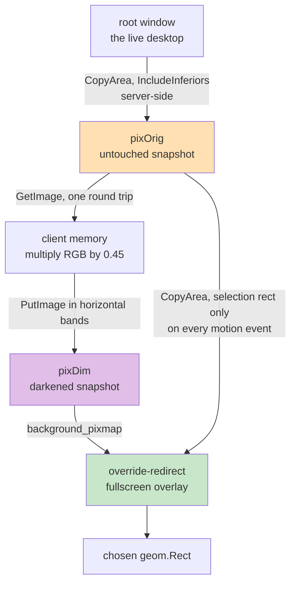

# snipmov: Compositing a Selection Overlay Without a Compositor, and Other X11 Screen-Capture Problems

This report documents the design and implementation of `snipmov`, a single-binary tool that records a rectangular region of an X11 screen into a shareable MP4, GIF, WebP, or WebM. The tool is small — 3,813 lines of Go, of which 805 are tests, with exactly two hard runtime dependencies — but it sits on top of three subsystems whose behavior is neither obvious nor well documented in one place: the X11 core protocol's drawing and grabbing primitives, `ffmpeg`'s `x11grab` demuxer and palette filters, and the process-lifecycle rules that determine whether a captured video container is playable. The report explains each of those subsystems in the terms the tool needed, states the measurements that overturned two pieces of conventional advice about GIF encoding, and analyzes the four defects that survived a 1,328-line design document to be found only by running the result.

The project was executed design-first: a complete analysis, architecture specification, and implementation guide were written and verified before any production code existed. Twenty-five of the twenty-six acceptance checks passed on their first execution. The four that did not are the most interesting part of this report, because they share a category the design document had no vocabulary for.

> [!summary]
> - **Dimming a selection overlay requires alpha blending, alpha blending requires a compositing window manager, and i3 does not run one.** The resolution is to composite the dim in the client: snapshot the root window into a pixmap, darken a copy once in client memory, use the darkened copy as the overlay window's background, and `CopyArea` the crisp selection interior back from the untouched original. Every repaint during the drag is then a server-side pixmap-to-window copy. The visible cost is that the overlay is a still image, so animation appears frozen during selection.
> - **The naive GIF conversion is smaller than the two-pass palette pipeline because it is destructive.** Measured on live screen content: `ffmpeg -i in.mp4 out.gif` produced a file 40 percent smaller at SSIM 0.757, retaining 91 distinct colors where the source frame had 12,069. The two-pass pipeline scored 0.999 and retained 254. Selecting a GIF encoder on file size alone selects the wrong one.
> - **Dithering makes screen-content GIFs both larger and less accurate.** The measured comparison is 55,411 bytes at SSIM 0.999 without dithering against 61,081 bytes at 0.9988 with `sierra2_4a`. Dithering injects high-frequency noise, and GIF's LZW compression depends on runs of identical palette indices along a scanline. The conventional recommendation is correct for photographic content and wrong for the only content this tool records.
> - **Terminating `ffmpeg` with `SIGKILL` produces an MP4 with frames and no index.** The `moov` atom is written when the muxer is flushed at end of stream. The resulting file has a plausible size and timestamp and will not open in any player. The tool escalates through three stages — write `q` to stdin, then `SIGINT`, then `SIGKILL` — and reports a possibly-truncated file rather than claiming success when it reaches the third.
> - **Four of the five implementation defects were not logic errors.** Each was the program telling the user something that was not quite true: a temporary filename that defeated `ffmpeg`'s muxer selection, a `--dry-run` line that could not be pasted into a shell, a flag validated only after the recording was over, and a documentation command that silently changed behavior. This is a category a design document is structurally unable to catch.

## Why this project exists

The triggering requirement is narrow and precise. A person is in a chat window, a pull request review, or a bug report. Something on screen is faster to show than to describe: a hover state that flickers, a progress bar that stalls, a spinner that never resolves. They want to draw a box around it, let it run for five to fifteen seconds, and produce a file they can drop into the conversation that is already open, within roughly twenty seconds of deciding to do so.

Decomposing that requirement into steps with a time budget produces three constraints that existing tools violate:

1. **The invocation must not create a window.** A window covers the region being recorded, takes focus from the application whose behavior is being demonstrated, and under a tiling window manager rearranges the layout that is the subject of the recording. The invocation must draw directly on the root window.
2. **The stop signal must be reachable without leaving the region under observation.** The user is watching the region and possibly interacting with the application inside it. A stop button inside the recorder's own window is not where the user's attention is.
3. **Delivering the file is part of the tool.** A recorder that writes a file and prints its path has completed most of the work and left the remaining, annoying portion to the user. Placing the file on the clipboard as a file reference — not as a path string — is what makes the operation feel finished.

Surveying the existing Linux tools against those three constraints produces a consistent result. Peek is region-first, which is the correct instinct, but it is a window and its selection mechanism is "move and resize a window" rather than a drag. OBS Studio is a broadcast studio whose region capture requires a Display Capture source plus a Crop/Pad filter with typed pixel offsets. `byzanz-record` has exactly the right command-line shape but requires the caller to already know the rectangle. Kooha is the correct recommendation for a Wayland GNOME user and is a window. The remaining option is the shell function every power user eventually writes:

```bash
rec() {
  read -r X Y W H < <(slop -f '%x %y %w %h')
  ffmpeg -f x11grab -framerate 25 -video_size "${W}x${H}" -i "+${X},${Y}" \
         -c:v libx264 -crf 23 -preset veryfast -pix_fmt yuv420p out.mp4
}
```

That function is the correct shape and has approximately eight defects, each of which gets patched by a different person into a different, subtly broken snippet. It also does not run on the target machine, because `slop` is not installed there. The project's scope is therefore stated in one sentence: **`snipmov` is `slop | ffmpeg | xclip` collapsed into a single dependency-free binary with those defects fixed, and nothing else.**

## Current project status

The tool is implemented, tested, and verified. The source lives at the repository root: `main.go`, `cmd/`, and `internal/` under `/home/manuel/code/wesen/2026-08-27--screen-mov-recording`. Three verification suites all pass:

| Suite | Coverage | Result |
|---|---|---|
| `go test ./...` | 8 packages; no display or `ffmpeg` required | all passing |
| `scripts/04-selector-xvfb-test.sh` | X11 selector driven by synthetic pointer events under `Xvfb` | 14/14 |
| `scripts/05-definition-of-done.sh` | Acceptance criteria from the implementation guide, against the real binary | 28/28 |

The design package lives in docmgr ticket `SCREENCAST-001` under `ttmp/2026/08/27/SCREENCAST-001--snipmov-minimal-screen-region-movie-gif-recorder-for-linux`: an environment survey, a problem-space analysis, an architecture specification, an intern implementation guide, and a 1,899-line diary, totaling approximately 5,500 lines. The full bundle is on the reMarkable at `/ai/2026/08/27/SCREENCAST-001`.

Two items remain open. The man page source `docs/snipmov.1.scd` has never been rendered, because `scdoc` is not installed on the development machine. The client-side darken step in the selection overlay has been measured as imperceptible at 1280×800 under `Xvfb` but has not been timed on the target machine's 2880×1920 panel, which is 4.2 times the pixel count.

## Project shape

The tool is one process that spawns exactly one `ffmpeg` child and, for GIF output, a second `ffmpeg` process afterward. It does not daemonize. The process tree is legible in `ps`, `Ctrl-C` does the correct thing when the tool is run from a terminal, and there is no inter-process communication beyond a lock file.

```mermaid
flowchart TD
    K[keybind or shell] --> C[cmd: flags, config merge, subcommands]
    C -->|Options| A[internal/app: phase sequencing]
    A --> S[internal/selector]
    A --> R[internal/record]
    A --> E[internal/encode]
    A --> D[internal/deliver]
    S --> X[internal/x11: the only XGB consumer]
    R --> FF[internal/ffmpeg: locate, stderr ring]
    E --> FF
    X -->|geom.Rect| A
    FF --> BIN[/usr/bin/ffmpeg<br/>x11grab to libx264 / gif / libwebp_anim]
    D --> CB[xclip, notify-send, xdg-open<br/>probed, never required]
    style X fill:#ffe0b2
    style BIN fill:#c8e6c9
    style CB fill:#e1f5fe
```

Two boundaries in that diagram carry most of the design's weight.

`internal/x11` is the only package that imports XGB. Everything above it exchanges `geom.Rect` values. That constraint is what makes the rest of the program testable without an X server, and it is the seam at which a Wayland backend would be inserted. `internal/deliver` exists as its own package because every action it performs is optional and probed at runtime; keeping the "failure here does not fail the run" policy in one package prevents that leniency from leaking into code where failures do matter.

## The three subsystems

### X11: an unmediated acquisition model

On X11 the entire desktop is one drawable — the root window — into which the X server composites every application window. Any client that can connect to the server may read any pixel of it. There is no permission model, no consent dialog, and no portal. This is a well-known security weakness of X11 and it is precisely what makes a region recorder a small project rather than a large one.

Three X extensions determine what the tool can rely on. All three are present on the target machine, verified with `xdpyinfo -queryExtensions`:

| Extension | Role |
|---|---|
| `MIT-SHM` | `ffmpeg`'s `x11grab` transfers frames through a shared memory segment when this is available. Without it every frame round-trips through the X socket, and 2880×1920 at 25 frames per second is not viable. |
| `XFIXES` | The pointer is not drawn into the root window's pixels; it is a server-side overlay. `x11grab -draw_mouse 1` fetches the cursor image and hotspot through XFIXES and composites it into each frame. |
| `SHAPE` | Permits non-rectangular and click-through windows. Available, though the final overlay design did not require it. |

Wayland's model is structurally different, and understanding why determines where the abstraction boundary belongs. Under Wayland the compositor owns every buffer. A client asks `org.freedesktop.portal.ScreenCast` for access, the portal presents a system dialog, and on approval the client receives a PipeWire node identifier and a file descriptor. There is no root window; the client receives a stream of a chosen output or window, and cropping to a sub-rectangle happens downstream in the client's own filter chain. Consent is asynchronous and interactive, so the state machine gains a state between idle and armed, and the sub-second invocation budget is unachievable on first run. A Wayland backend is therefore not "the same code with a different input flag"; it is a different acquisition model behind the same `geom.Rect` interface.

### ffmpeg: `x11grab` and the palette filters

The capture command has one shape, whose every argument is load-bearing:

```bash
ffmpeg -hide_banner -loglevel error -y \
  -f x11grab -framerate 25 -video_size 640x480 -draw_mouse 1 \
  -i :0.0+100,100 [-t 10] \
  -c:v libx264 -preset veryfast -crf 23 -pix_fmt yuv420p \
  -movflags +faststart /tmp/.clip.snipmov-part.mp4
```

`-framerate` is set explicitly because the default is `ntsc`, or 29.97, which is a poor base for GIF conversion and produces non-integer frame delays. `-preset veryfast` is chosen because capture must keep pace with real time; a slower preset risks dropped frames, and quality is recovered in the second pass when there is one. `-movflags +faststart` relocates the index to the front of the file so a chat client's inline player can begin immediately.

Verifying the demuxer's options against the installed `ffmpeg` rather than quoting them from memory surfaced something that reshaped the implementation plan:

```
$ ffmpeg -hide_banner -h demuxer=x11grab
  -window_id     <int>      Window to capture. (default 0)
  -grab_x/-grab_y <int>     Initial coordinates.
  -draw_mouse    <int>      Draw the mouse pointer. (default 1)
  -follow_mouse  <int>      Move the region when the pointer nears the edge.
  -show_region   <int>      Show the grabbing region. (default 0)
  -select_region <boolean>  Select the grabbing region graphically using the pointer.
```

`ffmpeg -f x11grab -select_region 1 -i :0.0 out.mp4` is drag-to-select recording with no helper binaries at all. This made a working end-to-end binary possible on the first day of implementation. It is not the final answer for one specific reason: **`-select_region` resolves the rectangle inside `ffmpeg`'s process and never reports it back to the caller.** Every feature that requires knowing the geometry is therefore impossible on top of it — re-recording the same region, snapping dimensions to even numbers before `libx264` rejects them, clamping to the screen, and inserting a countdown between the end of selection and the start of recording, because selection happens during demuxer initialization.

That constraint is modeled explicitly rather than hidden:

```go
type Selector interface {
    // Select returns the chosen rectangle, already normalized, clamped to the
    // screen and snapped to even dimensions.
    Select(ctx context.Context) (geom.Rect, error)

    // Deferred reports whether the geometry is resolved downstream, by
    // ffmpeg's own -select_region, rather than here.
    Deferred() bool
}
```

`Deferred()` is an ugly method on an otherwise clean interface. It is ugly because the underlying situation is ugly, and concealing it behind a more pleasant abstraction would mean silently mishandling every feature that needs geometry. Making the leak visible confines the branch to one location in the caller.

### Container finalization: the `moov` atom

An MP4 stores its index — the `moov` atom — in a trailer written when the muxer is flushed at end of stream. Terminating `ffmpeg` with `SIGKILL` therefore produces a file containing frames and no index. The failure mode is unpleasant because the file looks correct: it has a plausible size, a plausible modification time, and non-zero content. The user discovers the problem when attempting to share the clip.

The escalation has three stages, in order of decreasing politeness, with the important property that the final stage does not claim success:

```go
func (s *Session) Stop() error {
    s.state = StateStopping

    // 1. The documented graceful path. Requires a stdin pipe, which means
    //    never passing -nostdin and never leaving stdin as /dev/null.
    _, _ = io.WriteString(s.stdin, "q\n")
    _ = s.stdin.Close()
    if s.waitFor(QuitGrace) { return s.finish() }

    // 2. SIGINT also finalises, though less reliably mid-write.
    _ = s.cmd.Process.Signal(os.Interrupt)
    if s.waitFor(InterruptGrace) { return s.finish() }

    // 3. Last resort. The file is probably unusable; do not claim success.
    _ = s.cmd.Process.Kill()
    s.waitFor(KillGrace)
    s.state = StateFailed
    return fmt.Errorf("%w: %s\n%s", ErrTruncated, s.TmpPath, s.stderr.Tail(20))
}
```

Two consequences follow from this that are easy to get wrong in Go specifically.

The capture child is created with `exec.Command`, not `exec.CommandContext`. `CommandContext` kills the child when the context is cancelled, and that kill is exactly the `SIGKILL` that destroys the index. Cancellation is handled in `Stop`. The *second* pass does use `CommandContext`, because it reads a finished file and writes a new one, so an interrupted run leaves only a partial output that nothing has been told about.

`cmd.Wait` may be called at most once. The session calls it in a goroutine at `Start` and passes the result through a buffered channel that is refilled after each read, so `waitFor` can be invoked from all three escalation stages. Calling it twice produces `exec: Wait was already called`.

Finally, `ffmpeg` exits non-zero when it receives `SIGINT`, so the child's exit status is not a usable success signal once the tool has asked it to stop. The actual test of success is whether the output file validates, which `finish()` performs with `ffprobe` and which degrades to a size check when `ffprobe` is absent.

## Implementation details

### Compositing a dim overlay with no compositor

This is the central technical problem of the tool. The selection interface should dim the screen and leave the selected rectangle at full brightness, with a live size readout. Dimming requires alpha blending. Alpha blending of a window against what is behind it requires a compositing manager. i3 does not run one by default, and mapping an ARGB window with no compositor causes the alpha channel to be ignored — the result is an opaque window.

Three approaches were considered and two rejected. An input-only window with an XOR rubber band drawn on the root is the classic technique; it works everywhere but produces only a thin inverted outline, with no dimming, no readout, and unpredictable colors over arbitrary content. `slop` uses a GLX overlay, which requires a compositor to look correct and introduces an OpenGL dependency.

The approach taken performs the compositing in the client, from a still image:



The sequence is:

1. `CopyArea` the root window into `pixOrig`. This is server-side; no pixels cross the socket.
2. `GetImage` `pixOrig` into client memory once, multiply each of the three color channels by 0.45, and `PutImage` the result into `pixDim`. This is the only client-side pixel work and it happens once, before the overlay is mapped, so its latency is invisible.
3. Create a fullscreen override-redirect window whose `background_pixmap` is `pixDim`.
4. On each pointer motion, repaint: `CopyArea` from `pixDim` over the previous selection to erase it, `CopyArea` from `pixOrig` for the current selection to restore full brightness inside it, stroke a border, and draw the size readout.

Every operation in step 4 is a server-side pixmap-to-window copy, so the interaction tracks the pointer smoothly at 2880×1920. The technique works identically with or without a compositor.

The visible cost is that the overlay displays a frozen screenshot. Anything animating on screen appears stopped during selection. For a recorder this is defensible — the user is choosing a region, not watching content — but it will surprise someone selecting around a playing video, so it is documented in both the README and the man page rather than left to be discovered.

### Three X11 details that fail silently

Each of these produces a wrong result with no error message, which is what makes them worth stating precisely.

**Value lists are ordered by ascending mask bit.** X11 window-attribute value lists are positional, and the server reads them in ascending order of the mask bit, not in the order the mask was written in the source. The relevant constants are `CwBackPixmap = 1`, `CwBackPixel = 2`, `CwOverrideRedirect = 512`, and `CwEventMask = 2048`:

```go
mask := uint32(xproto.CwBackPixmap | xproto.CwOverrideRedirect | xproto.CwEventMask)
// ASCENDING MASK-BIT ORDER: BackPixmap(1), OverrideRedirect(512), EventMask(2048)
values := []uint32{
    uint32(o.pixDim),
    1, // override_redirect: the window manager must not tile, decorate or focus us
    uint32(xproto.EventMaskButtonPress | xproto.EventMaskButtonRelease |
        xproto.EventMaskPointerMotion | xproto.EventMaskKeyPress |
        xproto.EventMaskExposure),
}
```

Reversing the order produces a window with an event mask of 1 and a background pixmap of 2048. There is no protocol error.

**`SubwindowModeIncludeInferiors` is required for the snapshot.** Without it, `CopyArea` from the root window copies only the root's own contents, which is usually a blank background. The child windows are the desktop. The failure presents as a snapshot showing an empty screen, with no error.

**`PutImage` of a full-screen image exceeds the maximum request length.** The limit is `setup.MaximumRequestLength`, expressed in four-byte units, and XGB does not chunk requests automatically. A 2880×1920×4 image is approximately 22 megabytes and is rejected. The dimmed pixmap is uploaded in horizontal bands:

```go
maxBytes := int(xproto.Setup(x).MaximumRequestLength)*4 - 1024  // headroom for the header
rows := maxBytes / (w * 4)
for y := 0; y < h; y += rows {
    n := min(rows, h-y)
    band := data[y*stride : (y+n)*stride]
    xproto.PutImageChecked(x, xproto.ImageFormatZPixmap, drawable, gc,
        uint16(w), uint16(n), 0, int16(y), 0, depth, band).Check()
}
```

Getting the band size slightly too large produces a protocol error attached to a *later, unrelated* request, because XGB is asynchronous. This is the reason the entire setup path uses the `...Checked(...).Check()` variants, which cost a round trip and report errors at their true origin, while the hot repaint path does not.

### The pointer grab must retry

`GrabPointer` returns `AlreadyGrabbed` whenever any other client holds an active grab. The window manager's own grab, from the keybind that launched the tool, is frequently still active at that moment. Without a retry loop the selector fails intermittently — roughly one launch in five — which is the most difficult class of bug to diagnose by hand.

```go
for i := 0; i < grabAttempts; i++ {   // 25 attempts, 20ms apart
    rep, err := xproto.GrabPointer(x, true, o.win, eventMask,
        xproto.GrabModeAsync, xproto.GrabModeAsync,
        o.win, o.cursor, xproto.TimeCurrentTime).Reply()
    if err == nil && rep.Status == xproto.GrabStatusSuccess { return nil }
    time.Sleep(grabDelay)
}
```

The keyboard grab is deliberately handled differently. It is best-effort and its failure is ignored, because `Escape` continues to work whenever nothing else holds focus, and aborting an entire selection because a menu happens to hold the keyboard is a worse outcome than a degraded cancel key.

### Geometry: one sanitization path, and one compensation

Every rectangle that leaves the selector has passed through the same function, in a fixed order:

```go
// Sanitize is the ONLY blessed way to turn raw drag coordinates into a Rect the
// rest of the program may use. The order matters: snapping before clamping can
// push a rectangle one pixel back outside bounds.
func Sanitize(raw, bounds Rect) Rect { return raw.Clamp(bounds).SnapEven() }
```

`SnapEven` exists because `libx264` with `yuv420p` chroma subsampling operates on 2×2 pixel blocks and rejects odd dimensions outright with `width not divisible by 2 (641x481)`. A hand-drawn rectangle is arbitrary, so something must snap it, and centralizing that in one function is what makes the constraint impossible to violate rather than merely unlikely.

The `Xvfb` test harness surfaced a defect that no individual step in that chain caused. On a 1280-pixel-wide screen, dragging to the right edge produced a 178-pixel-wide rectangle rather than 180. Every step was correct: the pointer is confined to the overlay window, so it stops at x = 1279; the width is therefore 179; `SnapEven` rounds that down to 178. The user, however, dragged to the edge and received a rectangle two columns short of it, with no way to express what they wanted, because the input device cannot reach the exclusive far edge.

```go
// edgeAdjust compensates for the fact that the pointer is confined to the
// overlay and therefore cannot reach the exclusive far edge of the screen.
// Drag corners stay exclusive everywhere else, so 100 -> 420 is exactly 320.
func (o *overlay) edgeAdjust(x, y int) (int, int) {
    if x >= o.bounds.Right()-1 { x = o.bounds.Right() }
    if y >= o.bounds.Bottom()-1 { y = o.bounds.Bottom() }
    return x, y
}
```

This is a correct system producing an incorrect outcome. Each step was right; the composition was wrong at exactly one input value.

## The GIF measurement

The tool's most consequential decision is not architectural. It is the GIF encoding pipeline, and it was settled by measurement that contradicted what was about to be written down.

### What a GIF is

A GIF stores at most 256 colors per frame. Each pixel is an index into a palette, and the indices are compressed with LZW along each scanline. Three properties follow directly:

- Compression comes from horizontal runs of identical indices, so anything that breaks up those runs increases file size.
- Frame delays are stored in hundredths of a second, so only divisors of 100 are exactly expressible. Requesting 30 frames per second yields 3.33-centisecond delays that round unevenly; 20 or 25 are the honest choices for screen content.
- Frame disposal combined with transparency permits delta frames: a frame can encode only its changed rectangle and leave the remainder transparent. Screen recordings are mostly static, so this is where the compression actually comes from. `paletteuse=diff_mode=rectangle` enables it.

The naive conversion, `ffmpeg -i in.mp4 out.gif`, uses a fixed palette. The two-pass pipeline computes an optimal palette from the actual clip and then maps frames onto it:

```
fps=20,
scale=800:-1:flags=lanczos,
split[a][b];
[a]palettegen=max_colors=256:stats_mode=diff[p];
[b][p]paletteuse=dither=none:diff_mode=rectangle
```

`stats_mode=diff` weights the color histogram toward pixels that change between frames. For a screen recording — a static background with a small active area — this spends the 256 palette entries on the region where the information is, rather than on unchanging background. `stats_mode=full`, the ffmpeg default, is the correct choice for video-like input.

### The measurement

`scripts/02-benchmark-encoders.sh` captures a live three-second 640×480 region and encodes it eight ways, reporting bytes, SSIM against the source frame, and distinct color counts. One representative run:

| Output | Bytes | SSIM vs source |
|---|---:|---:|
| H.264 CRF 23 mp4 | 22,629 | 1.000000 |
| animated WebP q70 | 19,080 | n/a (single-image decode) |
| VP9 CRF 32 webm | 27,483 | 0.998213 |
| **naive gif** | **32,910** | **0.756593** |
| **palette gif, no dither** | **55,411** | **0.999068** |
| palette gif, `sierra2_4a` | 61,081 | 0.998775 |
| palette gif, `bayer:3` | 67,972 | 0.975577 |
| palette gif, 64 colors | 39,610 | 0.996723 |

Distinct colors in one decoded frame, measured with ImageMagick's `-format %k`:

| Frame source | Distinct colors |
|---|---:|
| source | 12,069 |
| naive GIF | **91** |
| two-pass palette GIF | 254 |

Two conclusions follow, and both contradict a widely repeated recommendation.

**The naive path is smaller because it is destructive.** It produced a file 40 percent smaller than the two-pass pipeline while collapsing 12,069 colors to 91 and dropping SSIM to 0.757. An earlier run on a more saturated region recorded per-channel SSIM of R 0.62, G 0.64, and B 0.08 — the blue channel effectively annihilated by the fixed web palette. Any benchmark that ranks GIF encoders by file size alone selects the wrong one.

**Dithering makes screen-content GIFs both larger and less accurate.** The mechanism is direct: dithering approximates unavailable colors by injecting high-frequency noise, and LZW compresses runs of identical indices along a scanline. The noise destroys precisely the structure the compressor depends on. The recommendation to dither is correct for photographic and gradient content and wrong for user-interface content, which is the only content this tool records. The default is `dither=none`.

The absolute numbers move between runs, because the script captures whatever is on screen; across three runs the naive GIF scored 0.379, 0.606, and 0.757 depending on how saturated the region happened to be. The ordering is stable in every run. The documentation states this explicitly, because a number presented as more precise than it is will eventually be quoted back as fact.

## Testing strategy

Most of the tool is testable without a display, and the parts that are not were made testable rather than left to manual inspection.

| Layer | Method | What it establishes |
|---|---|---|
| `geom` | Table-driven unit tests over drag directions, off-screen overshoot, odd dimensions, degenerate clicks | The sanitization ordering invariant holds |
| `encode` | Golden-file argv comparison | Every flag change is visible in a diff; no `ffmpeg` needed in CI |
| `config` | One test per precedence boundary | Defaults < TOML < environment < flags |
| `record.Session` | Shell-script stubs standing in for `ffmpeg` | All three shutdown stages, without corrupting real media |
| `x11` / selector | `Xvfb` plus `xdotool`-synthesized pointer events | 14 checks including grab reliability and overlay teardown |
| End to end | `scripts/05-definition-of-done.sh` | 28 acceptance checks against the real binary |

Two of these deserve elaboration.

**The fake-ffmpeg stubs.** Testing the shutdown escalation requires an `ffmpeg` that misbehaves in a specific, chosen way. Three shell scripts provide that: one that exits when it reads `q` on stdin, one that ignores stdin but traps `INT`, and one that traps and ignores both. Injecting `Bin` and `Verifier` fields on the `Session` makes the substitution possible; both are small, honest seams rather than test-only flags, and the `Verifier` seam also serves the production path where `ffprobe` is absent.

```go
bin := fakeFFmpeg(t, `trap '' INT TERM; while :; do sleep 0.05; done`)
s := newSession(t, bin)
s.Start()
err := s.Stop()
if !errors.Is(err, ErrTruncated) {
    t.Fatalf("Stop err = %v, want ErrTruncated", err)
}
```

The suite runs in 0.7 seconds and exercises all three stages deterministically, with no real media involved.

**The `Xvfb` selector harness.** Interactive is not the same as untestable. Everything the selector does is a pure function of a pointer event sequence, and `xdotool` can synthesize those sequences. The harness runs the binary under a headless X server and asserts on the printed rectangle:

| Check | Result |
|---|---|
| drag down-right | `320x240+100+100` |
| drag up-left (normalization) | `320x240+100+100` |
| odd drag `321x241` | snapped to `320x240` |
| drag off the right edge | `180x240+1100+100` after `edgeAdjust` |
| Escape, right-click, click-without-drag | no output, exit 0 |
| `--last` | returns the previous rectangle |
| 20 consecutive grabs | 0 failures |
| overlay leak into capture | base 255, capture 254 |

The last row tests a specific failure that would otherwise be invisible: if the dimmed overlay is still mapped when `ffmpeg` starts, the clip records the tool's own 45-percent-brightness snapshot rather than the screen. The check maps a bright `xmessage` window, captures it directly (average channel value 255), captures it again through the interactive path (254, the difference being H.264 quantization), and asserts the two agree. Making the teardown ordering correct required a round-tripping `GetInputFocus` immediately after `DestroyWindow`, because XGB requests are asynchronous and the destroy may still be queued when the function returns.

A methodological note from building that check: the first version captured near-black frames and appeared to show a leak. It did not. `xsetroot -solid` and `display -window root` both fail to paint an `Xvfb` root when no window manager exists to trigger the expose, so the baseline was black as well. A negative result requires a positive control; mapping a real window made the comparison meaningful.

## The five defects, and the category they share

Twenty-five of twenty-six acceptance checks passed on their first run. The defects found during implementation are more informative than the successes.

1. **The temporary filename defeated `ffmpeg`'s muxer selection.** The intermediate was named `clip.mp4.part`, and every capture failed with `Unable to choose an output format for 'clip.mp4.part'; use a standard extension for the filename or specify the format manually.` `ffmpeg` selects its muxer from the output filename, so the extension must come last. The intermediate is now `.clip.snipmov-part.mp4` — extension preserved, dot-prefixed so a crashed run leaves a hidden file rather than something resembling a finished clip, and still in the destination directory so the final move remains a same-filesystem rename.

2. **`--dry-run` printed a command that could not be pasted anywhere.** A GIF filtergraph contains semicolons and square brackets; unquoted, a shell consumes the semicolons, splits the command, and then fails on the brackets. The entire justification for `--dry-run` is that it produces a line the user can start from, so printing something that merely resembles a command is worse than printing nothing. The fix is a `shellQuote` function tested by handing its output back to `bash` and comparing the re-split arguments against the original argv — a round trip through a real shell rather than an opinion about what requires escaping.

3. **An invalid `--gif-dither` was caught only after the recording.** The sequence was: select a region, record ten seconds, wait for the capture to finalize, then fail with `Error applying option 'dither' to filter 'paletteuse'`. The user has lost the take to a typographical error. Every enum-valued flag is now validated before anything is spawned, against the same value lists `ffmpeg` accepts.

4. **A missing `ffmpeg` exited 4 instead of 3, and was detected too late.** `ffmpeg.Locate()` was called only inside `Session.Start`, so its failure surfaced as a capture error. The exit code was the lesser problem: the check ran *after* the interactive selection, so a user without `ffmpeg` was asked to drag a rectangle for a run that could not succeed. `Locate` now runs at the top of `app.Run`, before the X connection.

5. **A config-file default overrode an explicit command-line filename.** This one surfaced after the tool was otherwise finished, when a `config init` subcommand was added to make the configuration discoverable. The generated file sets every key to its built-in default and should therefore change nothing — but with `format = "mp4"` present, `-o clip.gif` produced an MP4 under a `.gif` name. The design document had already stated the correct rule; the implementation honored it against the *built-in* default and not against the config file, which was added two milestones later. Nothing failed at the time, because no test covered the interaction of a layer that did not yet exist. The general rule: **a new precedence layer requires a test against every layer it now sits between, not only against the one above it.**

Defects 1, 2, 4, and 5 — and arguably 3 — share a category. None is a logic error. In each case the program computed correctly and then communicated something to the user that was not quite true: a filename that claimed a format it did not convey, a printed command that claimed to be runnable, a flag accepted that would later be rejected, a dependency assumed that was not present. A design document specifies behavior and interfaces; it has no vocabulary for the gap between what a program does and what it implies. That gap is found only by using the program.

The generalizable rule extracted from defects 3 and 4 is stated once and applied in both places: **validate everything that can be validated before asking the user to do something.**

## Working practices worth repeating

The project followed a strict measure-before-asserting loop. Every factual claim in the design package was produced by running a command, and the command is quoted next to the claim. Two claims that were about to be written from memory were falsified by that discipline — the `-select_region` option that reshaped the implementation plan, and the GIF dithering recommendation that reversed a default. A design document whose facts are checkable is falsifiable; one whose facts are recalled is not.

The implementation milestones were sequenced against dependency order deliberately. The natural ordering is geometry, then X11, then selection, then capture, then encoding. That is wrong for a builder, because the X11 chapter is the largest and hardest and sits in front of any working program. Inverting it so that Milestone A stubs selection out entirely behind `--region` means a working screen recorder exists on day one, and the hardest component is the only unknown when it is finally reached. The cost of that inversion is that `--region` becomes a permanent documented feature rather than temporary scaffolding — which is correct anyway, because it is also what makes the tool scriptable and testable.

Prototype code was written and tested before being embedded in the guide. The `geom` and `encode` packages were built, vetted, and tested during the documentation phase, then ported into `internal/` unchanged apart from the import path. Code in a markdown file has never been compiled; code in a directory with a passing test has.

The diary was written at each phase boundary rather than reconstructed at the end. Exact error text, exact measurements, and exact commands were recorded while they were still exact. Reconstruction produces approximations, and approximations are what make a diary worthless six months later.

## Failure modes worth carrying to other projects

**A command whose purpose is documentation must have no side effects.** Running `config init` to read the schema would, before defect 5 was fixed, have silently changed what `-o clip.gif` produced. The test that caught it compared the generated `ffmpeg` command line with and without the file, across four invocations — the actual contract. An earlier version compared resolved option structs and reported four differences that do not exist, because a zero frame rate is a sentinel meaning "use the format default" and is therefore equivalent to the template's explicit 25 without being equal to it. The temptation at that point is to add field exclusions until the test passes, producing an assertion weaker than its name claims. Testing the observable output instead of the intermediate state avoids that.

**A warning that still produces output is more dangerous than an error.** Rendering the design package to PDF emitted `Missing character: There is no ┌ (U+250C) in font [lmmono10-regular]` and produced a valid PDF anyway. Uploading without checking would have shipped a document whose every diagram was blank, reported as a success. The guard script now treats pandoc's *Missing character* warnings as failures.

**Guessing what a tool lacks is worse than asking it.** The first version of that guard carried a hardcoded blocklist of suspect Unicode glyphs and immediately flagged eleven arrow characters that render correctly. Parsing the renderer's own warnings is both authoritative and shorter.

**An X clipboard is a promise, not a store.** The selection owner serves the data when a paste occurs, which is why `xclip` forks and persists. The reflexive Go idiom — `defer cmd.Wait()`, or placing the child in a process group cleaned up at exit — empties the clipboard the instant the tool exits. `xclip` is started, reaped in a background goroutine, and otherwise left alone. Additionally, one `xclip` invocation offers exactly one target set; offering two produces two processes contesting ownership, with the second winning, so the target is a single flag rather than a list.

**Reading an error for what it implies about state beats reading it for its line number.** A LaTeX failure pointed at line 6591 of a generated file that does not exist on disk. What located the bug was the shape of the error text: prose with backslash-escaped spaces means LaTeX believed it was inside a verbatim block, and prose is never verbatim, so a code span had opened where none was intended. The cause was an inline triple-backtick in the diary — a phrase describing a fenced code block, which markdown read as the start of one, swallowing several hundred lines. An odd count of fence-prefixed lines is a cheap and reliable detector for that entire class of problem.

## Open questions

The client-side darken step is O(pixels) on the main goroutine and has been measured only at 1280×800 under `Xvfb`, where it is imperceptible. The target panel is 2880×1920, or 4.2 times the pixel count, and has not been timed. The implementation logs the duration at debug level, so `snipmov -v` answers the question directly. If it exceeds roughly 80 milliseconds the design specifies a fallback to a stippled dim, which is entirely server-side but visibly coarser on a high-density display.

Whether `-select_region`'s chosen rectangle is genuinely unrecoverable has not been confirmed against `libavdevice/xcbgrab.c`. It is now moot for the primary path, since the XCB selector shipped, but the deferred selector survives as a fallback for environments where the pointer grab cannot be acquired, and that fallback's capabilities depend on the answer.

The `edgeAdjust` compensation triggers on any coordinate at or beyond `bounds.Right()-1`, which means a deliberate drag to the second-to-last column also snaps to the edge. This appears correct — nobody aims for column 1278 — but it is a judgment call embedded in a special case, and special cases are where defects accumulate.

Whether the frozen selection overlay confuses users has not been observed. One person using it once would settle it. If it does confuse, a one-line hint in the size readout is far cheaper than a live overlay, which would require a compositor.

## Near-term next steps

- Render and proofread the man page. `docs/snipmov.1.scd` has never been passed through `scdoc`; the EXIT STATUS section uses scdoc's table syntax and is the most likely thing to be wrong.
- Time the client-side darken on the 2880×1920 panel with `snipmov -v` and implement the stipple fallback if it exceeds 80 milliseconds.
- Wire both harness scripts into a `make check` target and a CI workflow. They require `Xvfb`, `xdotool`, `xmessage`, `ffmpeg`, and ImageMagick, all available in standard runner images.
- Make the config template test fail when a field exists in `config.File` but has no template entry, via reflection over the TOML tags. The template is a Go string constant and can otherwise drift from the defaults it claims to document.
- Add a test for the `--max-length` safety cap. The path where a capture is stopped by the cap and then still encodes correctly is currently unexercised.
- Re-run the encoder benchmark against a fixed synthetic source rather than the live screen, so the absolute numbers become reproducible and regression-testable.

## Project working rule

Measure the claim before writing it down, and validate everything you can before asking the user to act. The two conclusions that most shaped this tool — that `-select_region` exists and is insufficient, and that dithering harms screen-content GIFs — were both produced by running a command rather than recalling a fact, and both reversed a decision that had already been drafted. The defects that survived the design were all cases of the program implying something untrue, which is a category no specification catches and only use reveals.

## Important project docs

- Ticket index: `ttmp/2026/08/27/SCREENCAST-001--snipmov-minimal-screen-region-movie-gif-recorder-for-linux/index.md`
- Environment survey: `.../reference/01-environment-survey-x11-capture-stack-on-this-machine.md`
- Problem space and prior art: `.../analysis/01-problem-space-and-prior-art-sharing-a-screen-clip-on-linux.md`
- Architecture and design: `.../design-doc/01-snipmov-architecture-and-design.md` (section 12a records what the implementation changed)
- Intern implementation guide: `.../tutorial/01-implementation-guide-for-a-new-intern.md`
- Implementation diary, 12 steps: `.../reference/02-diary.md`
- Scripts: `01-probe-environment.sh`, `02-benchmark-encoders.sh`, `03-prototype-geom-encode/`, `04-selector-xvfb-test.sh`, `05-definition-of-done.sh`, `06-check-markdown-renders.sh`
- reMarkable bundle: `/ai/2026/08/27/SCREENCAST-001`

## Current user-facing commands

- `snipmov`: dim the screen, drag a rectangle, record until the keybind is pressed again.
- `snipmov -d 8 -f gif`: record for eight seconds and produce a GIF through the two-pass palette pipeline.
- `snipmov --last`: reuse the previously selected rectangle.
- `snipmov --window`: click a window to record it, including its frame where the window manager advertises one.
- `snipmov --region X,Y,W,H -o path`: fully non-interactive; the scriptable equivalent of every interactive path.
- `snipmov region`: select a rectangle, print it as `WxH+X+Y`, and exit, so one selection can drive several commands.
- `snipmov stop`: stop the running recording.
- `snipmov doctor`: report the display, `ffmpeg`, the optional helpers, the config path, and the remembered region.
- `snipmov config init`: write a fully commented configuration file with every key set to its built-in default, so it changes nothing until edited and doubles as the schema. `config path` and `config show` cover the other two things people want from it.
- `snipmov ... --dry-run`: print the shell-quoted `ffmpeg` command lines and exit.
