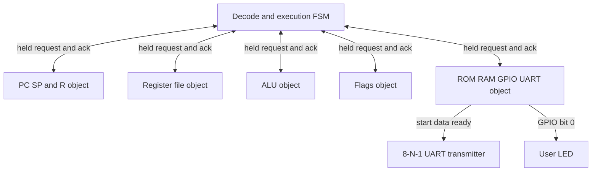

# PCA-Z80: Firmware BRAM and Physical UART on GateMate

PCA-Z80 is an 8-bit processor project for the Olimex GateMateA1-EVB. It implements a substantial Z80 subset as independently testable RTL objects, validates each instruction against an executable Python model, assembles real programs, builds a GateMate bitstream with the open-source FPGA toolchain, and runs those programs on physical hardware. The board now executes initialized firmware from inferred GateMate block RAM and emits `Hi` through the FPGA UART, the RP2040 DirtyJTAG firmware, and `/dev/ttyACM0`.

This report explains the architecture, the verification method, and the hardware path. Its main technical focus is the firmware ROM investigation, because that investigation exposed a failure class that ordinary RTL tests and FPGA resource reports did not detect: a design can infer block RAM while embedding only zero data.

> [!summary]
> - The Z80 is implemented as six held-request objects: decode, PC/SP/R, register file, ALU, flags, and memory/I/O.
> - Firmware uses a registered 512×8 inferred ROM, maps to one `CC_BRAM_20K`, and receives a complete 512-byte padded initialization image.
> - The build verifies assembler output, primitive `INIT_*` data, synthesized GateMate-cell execution, place-and-route timing, physical FPGA configuration, and host UART capture separately.
> - Physical evidence is complete: `/dev/ttyACM0` received bytes `48 69`, the string `Hi`, from Z80 code running on the GateMate.

## Why this project exists

The project began with research into Plastic Cell Architecture (PCA), a dynamically reconfigurable computing architecture in which fixed routing and configuration logic manages reconfigurable LUT-based processing regions. The founding work treats hardware functions as objects that communicate through a local message network and can be generated, connected, and removed at runtime.

The current project applies that object decomposition to a Z80. It does not yet implement the full runtime placement and pressure-based allocation system described by PCA research. Instead, it establishes the processor, object contracts, routing substrate, software toolchain, differential verification, and physical FPGA bring-up required before dynamic placement becomes a credible next step.

The distinction matters. The repository contains both:

1. a tested PCA cell/router/mesh substrate with held-request routing and anti-duplicate-delivery guarantees;
2. a working Z80 object graph connected through a held-request object bus.

The Z80 object graph has not yet been compiled by a `placer.py` tool into runtime-configured PCA cells. This is an explicit deferred phase, not an implicit claim.

## Current project status

The baseline processor and hardware flow are operational.

Implemented Z80 behavior includes:

- `NOP` and `HALT`;
- 8-bit register loads and immediate loads;
- 8-bit arithmetic and logic with Z80 flags;
- `JP`, `JR`, conditional relative jumps, `CALL`, and `RET`;
- stack `PUSH` and `POP`;
- `INC` and `DEC`;
- 16-bit register loads, increments, decrements, and `ADD HL,rr`;
- memory operands through `HL`, `BC`, `DE`, and direct addresses;
- CB-prefixed rotates, shifts, `BIT`, `SET`, and `RES`;
- a DD/FD subset covering IX/IY load, increment/decrement, and indexed load.

The software and verification stack includes:

- a Python Z80 ISA contract;
- an executable Python reference model;
- a two-pass assembler with no `eval`;
- directed and differential RTL tests;
- assembled integration programs;
- GateMate synthesis, place-and-route, pack, and load targets;
- a post-synthesis primitive-netlist test;
- physical UART capture through DirtyJTAG CDC0.

Deferred work includes the full DD/FD substitution rules, ED-prefixed operations, native Z80 `IN`/`OUT`, interrupts and alternate registers, a complete PCA object placer, and runtime pressure-based allocation.

## System architecture

The processor is decomposed into six objects. Each object exposes the same held-request request/response contract. The decode object is the transaction master; all others are targets.



### The object-bus contract

A request contains an object identifier, operation, address, write-enable, and write data. The target captures the transaction once, performs one operation, and acknowledges it. The requester holds request fields stable until acknowledgment.

The contract prevents a class of duplicated side effects. A UART write must start one frame, not one frame per cycle while request remains high. A stack update must happen once. A memory write must commit once.

The target-side structure is:

```pseudo
if reset:
    captured = false
else if selected and not captured:
    captured = true
    capture address, operation, and write data
    perform one state update or side effect
else if not selected:
    captured = false

ack = selected and captured
```

This protocol is reused across processor objects and the PCA routing substrate. The uniformity is deliberate: it makes transaction behavior independently testable and keeps latency out of instruction semantics.

### Decode as the master state machine

`obj_decode.sv` fetches instruction bytes, accumulates DD/FD/CB prefixes, selects execution paths, reads and writes objects, and increments the architectural retirement count. The implementation has many microstates because each object interaction is explicit:

```text
FETCH_PC -> FETCH_OPCODE -> INC_PC -> DECODE
         -> READ_REGISTER -> ALU_REQUEST -> WRITE_REGISTER
         -> READ_FLAGS -> BRANCH_DECISION
         -> MEMORY_READ or MEMORY_WRITE
         -> RETIRE -> FETCH_PC
```

This is not cycle-accurate Z80 bus timing. It is instruction-accurate for the implemented subset. Timing and wait-state behavior belong to the object protocol, while architectural results are compared at retirement boundaries.

## Model-first verification

The Python model preceded the RTL. It implements opcode semantics, register state, flags, prefixes, memory, stack behavior, and retirement. Each RTL milestone was checked against the model before the next instruction family was added.

The current regression contains:

| Layer | Evidence |
|---|---|
| PCA routing substrate | A→B delivery, XY routing, anti-double under stalls |
| Object graph directed/differential test | Implemented instruction families match model |
| Python model | 49 hand-computed tests |
| Assembler | 22 golden, cross-check, determinism, and padded-image tests |
| Integration | 6 assembled program model-vs-RTL tests |
| UART RTL | `Hi` decoded as bytes `48 69` |
| Synthesized primitive netlist | Initialized firmware drives LED after 51 clocks |
| Physical UART | `/dev/ttyACM0` receives `48 69` |

The key rule is that no single layer stands in for another. Model agreement does not prove synthesis initialization. A UART waveform test does not prove package-pin direction. A successful bitstream load does not prove the CPU retired an instruction.

## The initial hardware symptom

The first processor bitstream did not show a visible Z80-driven blink, even though:

- the object-graph regression passed;
- the assembler produced the expected program;
- UART simulation emitted `Hi`;
- Yosys and nextpnr completed;
- openFPGALoader configured the FPGA.

A separate hardware-counter bitstream blinked the same LED. That result established the FPGA configuration path, 10 MHz input clock, and LED pin. The remaining problem was inside the firmware/CPU path.

A second complication was the initial blink delay. The first program toggled at roughly 830 Hz and looked steady. A nested B×C countdown changed it to roughly 310 ms per transition. That fixed human visibility but did not, by itself, validate firmware embedding.

## Debugging by independently observable stages

The final investigation used eight stages:


Each stage answers one question:

1. Does basic fabric logic run?
2. Does the CPU retire instructions?
3. Does the generated file contain the intended bytes?
4. Did Yosys allocate GateMate block RAM?
5. Did Yosys encode non-zero firmware into the primitive?
6. Does the synthesized GateMate netlist execute the firmware?
7. Did the CPU issue a UART transaction?
8. Did the RP2040 and host transport the byte?

The staged method prevented early conclusions from passing simulations.

## Comparative GateMate memory research

The requested starting point was `PythonLinks/awesome-gatemate`. Representative projects were cloned under `/home/manuel/code/others/gatemate/`, with exact commits stored in the PCA-Z80 ticket.

The relevant projects were:

- `fm4dd/gatemate-riscv`, a progressive FemtoRV tutorial;
- Project Peppercorn LiteX VexRiscv, SERV, and FazyRV cases;
- Project Peppercorn ColecoVision;
- `LUTRAM_Stress_Test`;
- `pico-dirtyJtag` for the board UART bridge.

The production firmware memories use the same fundamental template:

```verilog
reg [WIDTH-1:0] mem [0:DEPTH-1];

initial begin
    $readmemh("complete-image.hex", mem);
end

always @(posedge clk) begin
    read_data <= mem[address];
end
```

Three properties recur:

- the read is synchronous and registered;
- the memory is large enough to map to block RAM;
- the initialization file is generated before synthesis.

FemtoRV also documents an explicit minimum-size experiment: a small logical memory remains logic, while a larger declaration maps to `CC_BRAM_20K`.

## Measuring the GateMate inference boundary

A ticket script synthesized isolated 8-bit ROMs across read styles and depths. The results for the installed OSS CAD Suite were:

| Read style | 256×8 | 272×8 | 512×8 | 2048×8 |
|---|---:|---:|---:|---:|
| Registered synchronous | no BRAM | 1× 20K BRAM | 1× 20K BRAM | 1× 20K BRAM |
| Asynchronous combinational | no BRAM | no BRAM | no BRAM | no BRAM |

The first attempted fix—changing the ROM to a combinational read—was wrong. The isolated experiment disproved it. The production design restored the registered read and chose 512×8, safely above the measured transition.

Yosys's installed GateMate mapper confirms why the read style matters. `brams.txt` declares synchronous clocked ports and supports physical widths 1, 2, 5, 10, and 20 bits for a 20K block. An 8-bit logical ROM maps through a 10-bit physical port.

## A BRAM resource is not proof of firmware content

After increasing the ROM, nextpnr reported:

```text
RAM_HALF: 1 / 64
```

The processor still lacked valid firmware. Converting the Yosys JSON netlist back to primitive Verilog showed one `CC_BRAM_20K`, but every initialization parameter was zero:

```verilog
.INIT_00(320'h00000000000000000000000000000000000000000000000000000000000000000000000000000000)
```

The failure came from combining two initialization mechanisms:

1. an RTL loop that initialized every ROM entry to zero;
2. a partial `$readmemh` file containing only the used program bytes.

The synthesis result retained the zero initialization instead of the intended partial overlay. The resource allocation was correct; the resource contents were wrong.

This distinction changed the build acceptance criteria. A valid firmware build must prove both:

```text
BRAM count == expected count
AND
at least one INIT parameter is non-zero
```

## The corrected firmware contract

The final design uses a complete physical image as the only ROM initializer.

### Assembler output

`zasm.py` gained an optional `--size` argument:

```bash
python3 tools/zasm.py programs/hello.asm \
    -o build -n top_prog --size 512
```

The compact program remains visible in the listing, while `.hex` and `.bin` are padded to exactly 512 bytes. Overflow is rejected.

The Python API is:

```python
image, symbols, listing = assemble(source)
write_outputs(
    image,
    symbols,
    listing,
    out_dir="build",
    name="top_prog",
    size=512,
)
```

Default calls omit `size` and remain unpadded, preserving test and integration behavior.

### ROM RTL

The ROM initializer is conditional so testbenches can load explicit fixtures without a hidden default file:

```systemverilog
logic [7:0] rom [0:ROM_DEPTH-1];
logic [7:0] rom_q;

`ifdef ROM_FILE
    initial $readmemh(`ROM_FILE, rom);
`endif

always_ff @(posedge clk or negedge rst_n) begin
    if (!rst_n) begin
        rom_q <= 8'h00;
    end else if (sel && !captured) begin
        rom_q <= rom[bus_req.addr[$clog2(ROM_DEPTH)-1:0]];
    end
end
```

The data RAM has a separate initializer and separate semantics. ROM firmware generation does not modify RAM initialization.

### Make dependency

The hardware synthesis target always generates the padded image immediately before Yosys:

```make
ROM_DEPTH ?= 512

synth:
	python3 tools/zasm.py programs/$(PROG).asm \
	  -o $(BUILD) -n top_prog --size $(ROM_DEPTH)
	yosys ... -DROM_FILE="$(BUILD)/top_prog.hex" ...
```

This prevents a clean build from using a stale firmware file.

## Verifying synthesized firmware

The repository now provides `make post_synth`.

It performs three steps:

1. Run `synth_gatemate` and write `build/top.json`.
2. Convert JSON to a GateMate primitive netlist, then check BRAM allocation and initialization.
3. Simulate the primitive netlist with GateMate cell models and require firmware-visible output.

The static checker reports:

```text
PASS: 1 CC_BRAM_20K; non-zero firmware INIT
```

The gate-level test reports:

```text
PASS: post-synth initialized ROM executed; LED=1 after 51 cycles
```

This test closes the gap between behavioral RTL and the actual primitive netlist used for place-and-route.

## Observable CPU and UART diagnostics

The top-level design has a `DEBUG_LED_MODE` parameter:

| Mode | LED source | Purpose |
|---:|---|---|
| 0 | program GPIO bit 0 | verify application behavior |
| 1 | retirement counter bit 17 | verify CPU progress |
| 2 | sticky UART-start latch | verify CPU issued UART transaction |

The sticky UART latch is required because a UART start pulse is one clock long and cannot be observed visually:

```systemverilog
always_ff @(posedge clk_10m or negedge rst_n) begin
    if (!rst_n)
        uart_seen <= 1'b0;
    else if (uart_start)
        uart_seen <= 1'b1;
end
```

Build commands select the observable without changing processor semantics:

```bash
make bit PROG=blink DEBUG_LED_MODE=1
make bit PROG=hello DEBUG_LED_MODE=2
```

Production builds use mode 0.

## The physical UART path

The UART path crosses two programmable devices and USB:

```mermaid
flowchart LR
    Z[Z80 writes address 0x0001]
    M[obj_memio emits data plus start]
    T[uart_tx serializes 115200 8N1]
    P[GateMate IO_SA_B6]
    R[RP2040 GPIO13 UART0 RX]
    D[pico-dirtyJtag CDC0]
    H[/dev/ttyACM0]

    Z --> M --> T --> P --> R --> D --> H
```

The direction was verified from the RP2040 firmware and schematic rather than ambiguous net labels:

- RP2040 UART0 TX is GPIO12, connected to FPGA `IO_SA_A6`; this is FPGA RX.
- RP2040 UART0 RX is GPIO13, connected to FPGA `IO_SA_B6`; this is FPGA TX.

The CCF therefore uses:

```text
Pin_out "uart_tx_pin" Loc = "IO_SA_B6";
Pin_in  "uart_rx_pin" Loc = "IO_SA_A6";
```

DirtyJTAG exposes two CDC bridges:

- `/dev/ttyACM0`, USB interface 01, UART0 on GPIO12/13;
- `/dev/ttyACM1`, USB interface 03, UART1 on GPIO4/5.

The Olimex FPGA debug UART uses UART0, so the host must read ACM0.

## Physical UART acceptance

The hello firmware writes `H`, waits for the transmitter, writes `i`, then performs its LED action. Because output occurs immediately after configuration reset releases, the host reader starts before FPGA configuration:

```bash
make bit PROG=hello DEBUG_LED_MODE=2 PNR_SEED=1
stty -F /dev/ttyACM0 115200 cs8 -cstopb -parenb -ixon raw
(timeout 8 cat /dev/ttyACM0 > /tmp/acm0.bin) & reader=$!
sleep 1
openFPGALoader -b olimex_gatemateevb build/top.bit
wait "$reader" || true
xxd /tmp/acm0.bin
```

The physical result was:

```text
00000000: 4869  Hi
```

A simultaneous ACM1 reader received zero bytes, confirming the expected CDC selection.

## Place-and-route behavior

The BRAM-backed design routed successfully, but router2 showed seed sensitivity. The default seed remained one wire overused after more than 3000 rip-up iterations. Seed 1 completed and met timing. The Makefile now records the seed:

```make
PNR_SEED ?= 1
```

The final hardware build uses:

- 1 `RAM_HALF` out of 64;
- roughly 17% of GateMate LUT resources;
- roughly 6% of flip-flops;
- all reported clocks above 26 MHz against a 10 MHz requirement.

A deterministic seed does not guarantee future toolchain versions produce identical placement. It makes the current build reproducible and gives future comparisons a fixed baseline.

## Failure modes and the tests that catch them

| Failure | Earlier misleading pass | Definitive test |
|---|---|---|
| LED program toggles too fast to see | RTL program behaves correctly | measure simulated edge interval; use nested delay |
| Firmware ROM remains logic | RTL `$readmemh` test passes | isolated inference matrix; `RAM_HALF` count |
| BRAM exists but contains zeros | `RAM_HALF: 1` | inspect `INIT_*`; `check_gatemate_rom.py` |
| Behavioral RTL runs, primitive netlist fails | object differential tests | `make post_synth` |
| UART serializer works but CPU never requests it | `tb_hello` waveform test | sticky `uart_seen` LED mode |
| FPGA TX pin direction reversed | UART sim passes | schematic + DirtyJTAG UART definitions |
| Correct waveform reaches wrong bridge | UART TX toggles | USB interface descriptors; ACM0 vs ACM1 capture |
| One-shot output is missed | terminal opened after load | open reader before openFPGALoader |
| Router2 does not converge | synthesis and timing estimate pass | fixed PnR seed and routed artifact |

## Reproducible validation sequence

An intern can reproduce the final evidence with these commands:

```bash
cd /home/manuel/code/wesen/2026-08-28--pca-gatemate/pca_z80
source ~/fpga/oss-cad-suite/environment

make test
make sim_hello
make post_synth PROG=blink
make bit PROG=hello DEBUG_LED_MODE=2 PNR_SEED=1
```

Expected software/synthesis evidence:

```text
49 model tests pass
22 assembler tests pass
6 integration tests pass
UART simulation decodes 48 69
1 CC_BRAM_20K with non-zero INIT
post-synth LED rises after 51 clocks
```

Physical capture:

```bash
stty -F /dev/ttyACM0 115200 cs8 -cstopb -parenb -ixon raw
(timeout 8 cat /dev/ttyACM0 > /tmp/acm0.bin) & reader=$!
sleep 1
openFPGALoader -b olimex_gatemateevb build/top.bit
wait "$reader" || true
xxd /tmp/acm0.bin
```

Expected bytes: `48 69`.

## Technical decisions

### Registered inferred ROM

The project uses inferred RTL rather than a manually instantiated `CC_BRAM_20K`. This preserves simulator portability and keeps the source close to the behavioral model. The registered read is mandatory for GateMate BRAM inference under the measured toolchain.

### 512-byte physical image

The current programs need fewer bytes, but a 256×8 declaration stays below the observed block-RAM cost threshold. A 512×8 ROM maps reliably and leaves firmware growth capacity. Physical image size is part of the target configuration, not the Z80 instruction set.

### Full image as the only ROM initializer

The assembler pads the complete image. RTL does not attempt to merge a procedural zero-fill and a partial file. This makes the file authoritative and makes the synthesized primitive inspectable.

### Post-synthesis verification is required

The processor previously passed every behavioral test while the generated BRAM contained zeros. The post-synthesis test is therefore part of the firmware-memory correctness contract, not an optional implementation detail.

### Physical transport has independent acceptance

UART simulation, UART start, package pin, RP2040 UART direction, CDC interface, and host timing are separate checks. Physical byte capture is the final transport acceptance.

## What remains incomplete

The project is a working Z80-derived processor and a tested PCA research platform, but it is not a complete Zilog-compatible implementation and not yet a dynamically reconfigured PCA processor.

Important remaining work:

- complete IX/IY substitution semantics;
- implement ED-prefixed instructions and native I/O instructions;
- add interrupts, alternate registers, and remaining flag corner cases;
- create the PCA object placer and map the processor objects onto the PCA mesh;
- add constrained-random valid-program generation with recorded seeds;
- compare fixed bus wiring with routed PCA-mesh performance and area;
- define runtime object generation and pressure-based allocation acceptance tests.

The present result is the prerequisite for those phases: firmware, synthesis, processor execution, UART, and board infrastructure are now independently verified.

## Repository references

Primary implementation paths:

- `/home/manuel/code/wesen/2026-08-28--pca-gatemate/pca_z80/rtl/obj_memio.sv`
- `/home/manuel/code/wesen/2026-08-28--pca-gatemate/pca_z80/rtl/obj_decode.sv`
- `/home/manuel/code/wesen/2026-08-28--pca-gatemate/pca_z80/rtl/top.sv`
- `/home/manuel/code/wesen/2026-08-28--pca-gatemate/pca_z80/tools/zasm.py`
- `/home/manuel/code/wesen/2026-08-28--pca-gatemate/pca_z80/tools/check_gatemate_rom.py`
- `/home/manuel/code/wesen/2026-08-28--pca-gatemate/pca_z80/sim/tb_post_synth.sv`
- `/home/manuel/code/wesen/2026-08-28--pca-gatemate/pca_z80/Makefile`

Research and design documents:

- `ttmp/.../design-doc/01-pca-z80-system-intern-onboarding-guide.md`
- `ttmp/.../design-doc/02-pca-z80-engineering-report.md`
- `ttmp/.../design-doc/03-gatemate-firmware-rom-bram-and-uart-bring-up-intern-guide.md`
- `ttmp/.../reference/01-investigation-diary.md`, especially Steps 23–24
- `sources/gatemate/repository-provenance.md`
- `sources/gatemate/rom-inference-matrix-results.txt`

## Working rules preserved by this project

- Validate architecture against an independent executable model before RTL integration.
- Validate memory inference with an isolated target-specific experiment.
- Treat allocation and initialization as separate synthesis properties.
- Inspect generated primitives when resource reports cannot prove content.
- Run the synthesized primitive netlist before loading hardware.
- Expose one stable physical diagnostic per subsystem boundary.
- Derive UART direction from transmitter/receiver electrical roles.
- Open host capture before loading firmware that emits one-shot startup bytes.
- Record PnR seeds, toolchain versions, external commits, failures, and corrected assumptions.

## Related notes

- [[PROJ - MATE-16 VM CPU on the GateMateA1-EVB]] — the preceding GateMate processor project and source of the model-first, held-request, and board bring-up discipline.
