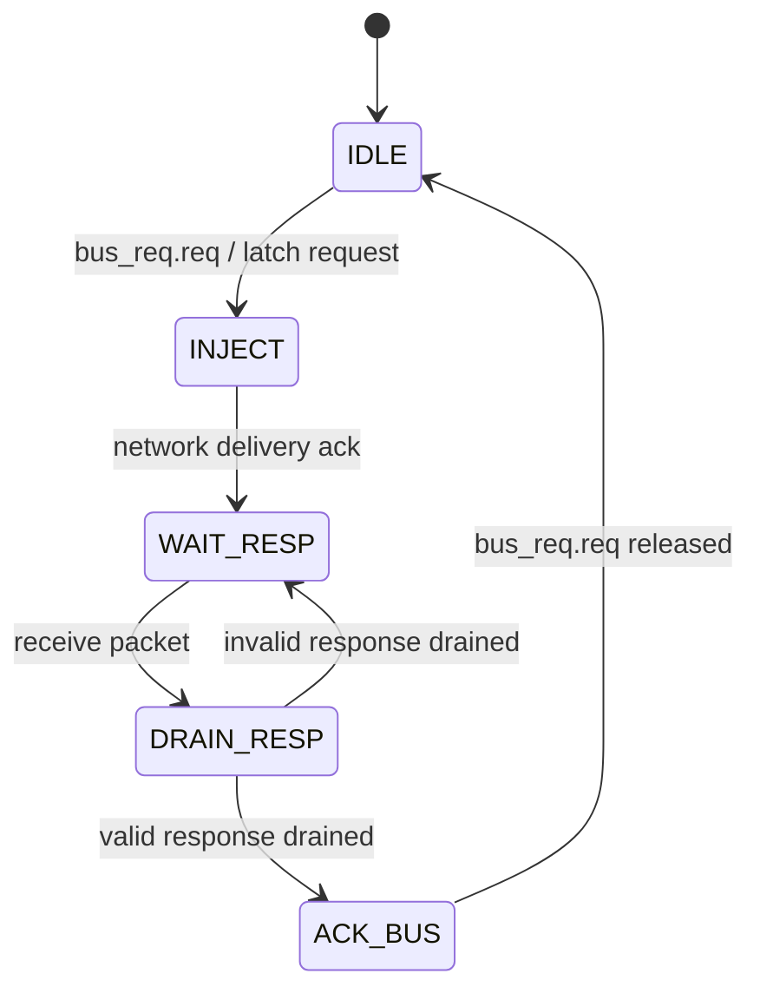
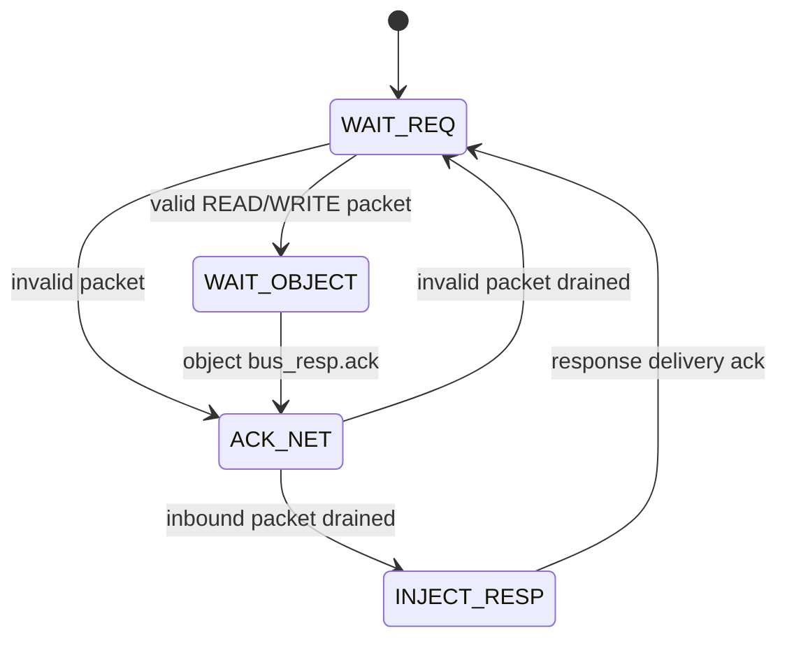

# PCA-Z80 Static Mesh Architecture and GateMate Hardware Validation

This article explains how PCA-Z80 replaces a proven direct object bus with deterministic placement and request/response transport over a physical router mesh. By the end, the reader should understand which semantics remain unchanged, why network delivery is not CPU completion, how the generated 3×2 topology executes Z80 firmware, and which reductions made the design routable on the GateMate CCGM1A1.

> [!summary]
> - The direct and mesh cores execute the same decode FSM, object modules, firmware, and memory map; only object transport changes.
> - Static placement assigns six generated coordinates. It does not relocate LUTs or object state at runtime.
> - The final 3×2, 43-bit mesh passes model-differential tests, preserves initialized BRAM, routes at 18.96 MHz, and physically emits `Hi` through CDC0.
> - The loaded mesh blink should change state every 1.614 seconds; direct visual confirmation remains pending.

## Executive summary

PCA-Z80 began with a direct held-request bus connecting one decode master to
five objects: PC/SP, memory/I/O, register file, ALU, and flags. That baseline
proved CPU semantics, firmware BRAM, LED, and UART independently of network
transport. It was intentionally retained as a differential reference.

The static mesh implementation replaces direct response aggregation with an
explicit network transaction:

1. a deterministic placer assigns every object a logical mesh coordinate;
2. a master adapter converts the held object request into a packet;
3. exact XY routers carry the request to the selected object endpoint;
4. a slave adapter presents the original held request to the unchanged object;
5. after object acknowledgement, the slave emits a response packet;
6. the response returns to decode before architectural acknowledgement.

Six assembled programs execute through this path with zero divergence from the
Python Z80 model. Injected-request, object-acceptance, and matching-response
counts are equal after each program drains. The same path synthesizes to
GateMate cells, retains one initialized `CC_BRAM_20K`, executes firmware in
post-synthesis simulation, routes at 18.96 MHz against a 10 MHz requirement,
and physically emits `48 69` (`Hi`) through DirtyJTAG CDC0.

The final hardware uses a 3×2 mesh and 43-bit packets. Earlier 3×3/67-bit and
3×2/67-bit designs met utilization and pre-route timing but did not converge in
bounded routing experiments. Removing unused routers and reducing coordinate
fields to the required two bits reduced the mesh blink build to 13,119 LUTs
(32%) and made router2 seed 1 converge. The production mesh blink image is
loaded; visual confirmation of its measured 1.614-second transition cadence is
still pending at the time of this report.

This work implements **static logical endpoint placement**. It does not move
object LUTs at runtime, transfer live object state, or implement pressure-based
dynamic placement. Those remain separate Phase 7 research.

## 1. Problem statement

A direct object bus proves that the processor decomposition is correct, but it
does not prove the central PCA claim: independently identified objects can
communicate through a routing substrate. Conversely, placing CPU behavior on a
mesh before the CPU and bus contracts are proven would combine instruction,
object, routing, placement, and hardware failures.

The implementation therefore needed to answer five questions independently:

1. How are object identities mapped to deterministic mesh locations?
2. How does a held request become a packet without changing object semantics?
3. When is a network delivery considered an architectural CPU completion?
4. How are duplicate side effects prevented under stalls?
5. Can the resulting distributed mux fabric route on the CCGM1A1?

The final architecture answers these questions without modifying the five
slave objects or the decode FSM's request/ack behavior.

## 2. Scope and terminology

### 2.1 Direct bus

The direct core is `rtl/z80_core.sv`. Decode drives one `bus_req_t` to every
object. Each object internally selects its object id. Only the selected object
asserts `bus_resp.ack`. The core ORs acknowledgements and selects read data from
the acknowledging object.

```text
obj_decode -- shared held request --> PC
                                  --> MEM/IO
                                  --> REGFILE
                                  --> ALU
                                  --> FLAGS

obj_decode <-- OR(acks) + response mux -- objects
```

This is a local RTL interconnect. It has no packet, coordinate, endpoint, or
router latency.

### 2.2 Static mesh

The mesh core is `rtl/z80_mesh_core.sv`. Every object has a generated fixed
coordinate and one local endpoint on `pca_mesh`. Decode and each slave use an
adapter. Requests and responses traverse routers.


Static means coordinates are determined before synthesis and emitted as build
artifacts. The routers still make routing decisions at runtime from packet
destination coordinates.

### 2.3 Dynamic placement

Dynamic placement would allocate or move an object at runtime based on pressure
or demand. It requires configuration transport, resource discovery, object
state transfer or reconstruction, and route updates. `CMD_CONFIG` is reserved
for that direction, but none of those mechanisms are claimed here.

## 3. Preserved object-bus contract

`rtl/z80_obj.sv` defines the original request and response:

```systemverilog
typedef struct packed {
  logic req;
  logic we;
  logic [3:0] obj;
  logic [15:0] addr;
  logic [15:0] wdata;
} bus_req_t;

typedef struct packed {
  logic ack;
  logic [15:0] rdata;
} bus_resp_t;
```

A requester holds the complete request stable until acknowledgement. The
selected object performs one acceptance, holds acknowledgement, and drops it
after request deassertion. This contract is preserved on each side of the mesh.

The `we` field must not be interpreted as "response data is unused." ALU
operations present operands using write-like requests and return
`{flags,result}`. P4 initially zeroed response data for writes, causing ALU
program divergence. The corrected slave adapter always returns the object's
actual `bus_resp.rdata`; ordinary memory/register writes naturally return zero.

## 4. Deterministic static placement

### 4.1 Canonical graph

`config/z80_objects.json` defines a 3-column by 2-row mesh, six 1×1 objects,
and five communication edges from decode to the slaves.

| Object id | Name | Final cell | Coordinate |
|---:|---|---:|---|
| 0 | decode | 0 | (0,0) |
| 1 | pc | 1 | (1,0) |
| 2 | mem | 3 | (0,1) |
| 3 | reg | 2 | (2,0) |
| 4 | alu | 4 | (1,1) |
| 5 | flags | 5 | (2,1) |

The final weighted-hop metric is 9 and the maximum route is 3 hops.

### 4.2 Placer behavior

`tools/placer.py` validates a strict versioned schema and applies deterministic
weighted greedy placement:

```text
reserve fixed cells
order remaining objects by:
  descending weighted degree
  ascending object id
  ascending name
for each object:
  score every free cell by weighted Manhattan distance
  select minimum (cost, y, x)
emit placements and exact X-then-Y review paths
```

The tool emits:

- `build/placement.json`: canonical, sorted, hashed, language-neutral evidence;
- `build/pca_placement_pkg.sv`: generated scalar constants consumed by RTL.

`make check_placement` regenerates both in memory and checks exact bytes. The
source hash is computed from the validated canonical model, so harmless input
array reordering does not change output.

### 4.3 Why generated scalar constants

Icarus 14 rejects unpacked localparam arrays:

```text
sorry: unpacked array parameters are not supported yet.
```

The generator therefore emits constants such as:

```systemverilog
localparam logic [7:0] OBJ_MEM_X = 8'd0;
localparam logic [7:0] OBJ_MEM_Y = 8'd1;
localparam int OBJ_MEM_CELL = 3;
```

`sim/test_placer.py` compiles the generated package to keep this compatibility
choice executable.

## 5. Packet representation

`rtl/pca_types.sv:37-52` defines the final packet:

```systemverilog
localparam int COORD_W = 2;
typedef struct packed {
  cmd_e cmd;                     // 3
  logic [1:0] dest_x, dest_y;    // 4
  logic [1:0] src_x, src_y;      // 4
  logic [15:0] addr;             // 16
  logic [15:0] data;             // 16
} msg_t;                         // 43 total
```

Two-bit coordinates encode 0–3 on each dimension, supporting meshes through
4×4. Address and data remain full 16-bit fields.

### 5.1 Request encoding

| Packet field | Source |
|---|---|
| `cmd` | `CMD_WRITE` when `we=1`, else `CMD_READ` |
| destination | generated coordinate for `bus_req.obj` |
| source | generated decode coordinate |
| `addr` | unchanged `bus_req.addr` |
| `data` | unchanged `bus_req.wdata` |

### 5.2 Response encoding

| Packet field | Source |
|---|---|
| `cmd` | `CMD_RESP` |
| destination | original request source |
| source | slave endpoint coordinate |
| `addr` | echoed request address |
| `data` | actual object `bus_resp.rdata` |

The master accepts a response only when command, source, destination, and echoed
address match the one outstanding request.

### 5.3 Why there is no transaction id

Decode permits one transaction in flight. Source/destination coordinates and
address are sufficient to validate the response. Adding an id would widen every
router datapath without enabling concurrency in the current CPU.

## 6. Router and mesh behavior

`pca_router` has five ports: north, south, east, west, and local. It accepts one
packet at a time and uses exact X-first, then Y routing:

```text
if dest_x > self_x: east
if dest_x < self_x: west
if dest_y > self_y: south
if dest_y < self_y: north
otherwise: local
```

Each router follows three states:

1. `IDLE`: choose and latch one input packet;
2. `FORWARD`: hold output request and packet stable until downstream ack;
3. `ACK_IN`: acknowledge the selected upstream input until it releases request.

This is packet delivery acknowledgement. It is not yet CPU architectural
acknowledgement because the target object may still need to execute and a read
or ALU result must return.

## 7. Master adapter

`rtl/z80_mesh_adapter.sv:4-78` implements five states.

### 7.1 State sequence



### 7.2 Invariants

- Request fields and packet stay stable throughout injection.
- A second request cannot enter while one response is pending.
- Injection ack increments request count but does not assert CPU ack.
- Invalid response metadata sets sticky protocol error.
- Valid `rdata` and CPU ack remain stable until decode releases request.
- Reset clears all requests, responses, counts, and outstanding state.

## 8. Slave adapter

`rtl/z80_mesh_adapter.sv:81-157` wraps each unchanged object.

### 8.1 State sequence



### 8.2 Critical ordering

The endpoint's local router is still completing the inbound request when the
object acknowledges. The slave therefore must:

1. hold object request until object ack;
2. capture object response;
3. acknowledge and drain inbound network request;
4. only then inject the response packet.

Injecting response before step 3 would contend with the same local router's
inbound handshake.

### 8.3 Anti-double side effects

The object sees one continuous held request. Its own `captured` or equivalent
state prevents repeated mutation. The adapter counts one acceptance only when
object ack first completes. Network stalls do not create a second request.

## 9. Mesh core wiring

`rtl/z80_mesh_core.sv` instantiates:

- one decode object and master adapter;
- one 3×2 `pca_mesh`;
- five slave adapters;
- the unchanged PC, memory/I/O, register, ALU, and flags objects.

Generated constants select each local mesh port. Unused ports are driven
inactive. Object id is converted to generated target coordinate in one central
lookup. The core exports:

- `mesh_protocol_error`;
- `mesh_request_count`;
- `mesh_response_count`;
- `mesh_accept_count`.

After a test program drains, these counts must agree.

## 10. Direct versus mesh execution

### 10.1 Semantic equivalence

Both modes execute the same decode FSM, object modules, assembled firmware, and
memory map. The difference is transport.

| Property | Direct bus | Static mesh |
|---|---|---|
| Request representation | `bus_req_t` wires | 43-bit packet |
| Object location | object id select | generated coordinate |
| Delivery | broadcast/select | exact XY routers |
| Completion | object ack through mux | returned `CMD_RESP` |
| Outstanding operations | one | one |
| Side-effect guard | object held-request | adapter + object held-request |
| Hardware top | `MESH_MODE=0` | `MESH_MODE=1` |

### 10.2 Latency consequence

The direct core returns local acknowledgements. Mesh mode performs outbound
routing, object execution, inbound-request drain, response routing, and CPU ack.
The same nested blink firmware therefore changes state at different rates:

| Mode | Clocks per transition | Seconds at 10 MHz | Full-period frequency |
|---|---:|---:|---:|
| Direct | ~3.10 million | ~0.310 s | ~1.6 Hz |
| Mesh | 16,139,574 | 1.6139574 s | 0.3097975 Hz |

`scripts/20-measure-mesh-blink-rate.py` measures small exact loop variants and
fits:

```text
transition_cycles(B,C) = 245*B*C + 324*C + 310
```

The production firmware loads B=C=0, which means 256 DEC iterations after
wraparound. Substituting 256 gives the reported mesh result.

## 11. Differential verification

`sim/run_mesh_integ.py` assembles one program, runs the Python model, compiles
the generated mesh core, executes it, and compares:

- PC, R, SP;
- retired instruction count;
- halted and faulted state;
- A, B, C, D, E, and F.

It additionally rejects:

- any sticky mesh protocol error;
- request/response/accept count inequality.

The six programs cover:

1. immediate/register smoke;
2. arithmetic;
3. conditional loop and flags;
4. CALL/RET;
5. PUSH/POP;
6. full self-test ending with A=8.

All six pass through actual PCA routers. The existing direct tests remain in
`make test`, preventing the network path from hiding object regressions.

## 12. UART verification through the mesh

`sim/tb_mesh_hello.sv` instantiates board top with `MESH_MODE=1`, loads
`hello.asm`, and decodes physical UART framing. It receives `48 69`.

Physical acceptance uses `scripts/18-capture-mesh-uart.sh`:

1. configure ACM0 and ACM1 raw at 115200 baud;
2. start simultaneous captures;
3. reload the exact bitstream;
4. wait six seconds;
5. dump both files.

Observed result:

```text
ACM0=2
00000000: 48 69  Hi
ACM1=0
```

This proves firmware fetch, decode, PC, memory, register operations, delay loops,
mesh routing, GPIO/UART memory mapping, UART serialization, FPGA pin direction,
RP2040 UART0 bridge, and host CDC0 delivery in one physical chain.

## 13. GateMate synthesis and routing investigation

### 13.1 Why synthesis success was insufficient

All mesh variants fit the device and passed placement timing estimates. Wide
router muxes nevertheless created congestion that prevented bounded routing.
The experiments therefore treat `router2 overuse=0` and a packed bitstream as
the acceptance boundary.

### 13.2 Controlled experiments

| Topology | Packet | LUTs | FFs | Placement max | Router/result |
|---|---:|---:|---:|---:|---|
| 3×3 | 67 bit | 22,461 (54%) | 3,852 | 47.06 MHz | router2 timeout at iter 34, overuse 5,271 |
| 3×2 | 67 bit | 16,882 (41%) | 3,623 | 56.26 MHz | router2 timeout at iter 78, overuse 988 |
| 3×2 | 67 bit | 16,882 (41%) | 3,623 | 56.26 MHz | router1 timeout, 52,475 arcs remain |
| 3×2 | 43 bit | 13,119 (32%) | 3,358 | 49.96 MHz | router2 closes at iter 185; 18.96 MHz routed |

All variants retain one `RAM_HALF`. The final hello debug image uses 13,189
LUTs and routes at 23.76 MHz.

### 13.3 What reduced cost

Removing three unused routers saved approximately 5,579 LUTs from the 3×3
version. Narrowing four coordinates from eight bits to two saved another 3,763
LUTs. Packet width reduction also lowered fanout and routing arcs.

The resulting 43-bit packet still carries every field needed by the current
static protocol. It intentionally caps coordinates at 4×4; larger meshes must
change the contract explicitly.

## 14. Firmware BRAM and post-synthesis proof

Mesh mode uses the same registered 512×8 `obj_memio` ROM. Synthesis maps it to
one `CC_BRAM_20K`. `make post_synth MESH_MODE=1 PROG=blink` performs three
checks:

1. generated netlist contains one BRAM primitive;
2. primitive `INIT_*` contains non-zero firmware;
3. GateMate primitive simulation executes mesh firmware and drives LED.

Observed post-synthesis LED assertion occurs after 227 clocks, compared with 51
clocks for the direct path. The difference is expected transport latency.

## 15. Board top and reproducible commands

`rtl/top.sv:15,48-70` selects the core at elaboration:

```text
MESH_MODE=0 -> g_direct.z80_core
MESH_MODE=1 -> g_mesh.z80_mesh_core
```

The UART transmitter and LED diagnostic selection are shared after the core.

```bash
source ~/fpga/oss-cad-suite/environment
cd pca_z80

make placement check_placement
make test
make sim_mesh_hello
make post_synth MESH_MODE=1 PROG=blink DEBUG_LED_MODE=0
make bit MESH_MODE=1 PROG=blink DEBUG_LED_MODE=0 PNR_SEED=1
openFPGALoader -b olimex_gatemateevb build/top.bit
```

The final mesh blink bitstream is 540,732 bytes. The current loaded image uses
production LED mode. Wait at least four seconds to observe a complete cycle.

## 16. Decision records

### Decision: retain the direct core

- **Context:** Network integration must not erase the known-good CPU baseline.
- **Options considered:** replace direct core; maintain separate fork; selectable top.
- **Decision:** retain `z80_core` and select direct/mesh at top elaboration.
- **Rationale:** Preserves differential isolation and physical fallback.
- **Consequences:** Both source paths compile; tests must keep both green.
- **Status:** accepted.

### Decision: deterministic generated placement

- **Context:** Handwritten coordinates drift across tests and RTL.
- **Options considered:** literals; random placer; canonical generated artifacts.
- **Decision:** strict JSON input, deterministic weighted placement, JSON + SV output.
- **Rationale:** Reproducible, reviewable, and toolchain-consumable.
- **Consequences:** Generated artifacts become build dependencies; strategy changes require versioning.
- **Status:** accepted.

### Decision: every operation returns a response

- **Context:** Router delivery ack and CPU completion have different meanings.
- **Options considered:** delivery-completes-writes; explicit response for every operation.
- **Decision:** return `CMD_RESP` for reads and write-like operations.
- **Rationale:** One architectural completion rule; preserves ALU returned data.
- **Consequences:** Higher latency and return traffic; simpler correctness model.
- **Status:** accepted.

### Decision: one transaction in flight

- **Context:** Decode is already serialized and packet has no id.
- **Options considered:** transaction ids and queues; preserve serialization.
- **Decision:** one end-to-end request at a time.
- **Rationale:** Matches CPU behavior and permits metadata correlation without widening packet.
- **Consequences:** No concurrent object operations; future concurrency requires protocol version.
- **Status:** accepted.

### Decision: 3×2 physical topology

- **Context:** 3×3 instantiates three unused full routers and failed bounded routing.
- **Options considered:** retain spare cells; exactly six cells.
- **Decision:** 3×2 canonical physical mesh.
- **Rationale:** All six endpoints fit; saves area and routing demand.
- **Consequences:** No spare probe endpoint; topology must grow for new objects.
- **Status:** accepted.

### Decision: two-bit static coordinates

- **Context:** Eight-bit coordinates dominated replicated router width and congestion.
- **Options considered:** 8-bit; 4-bit; required 2-bit width.
- **Decision:** `COORD_W=2`, packet width 43.
- **Rationale:** Supports current 3×2 and meshes through 4×4; enabled physical route closure.
- **Consequences:** Larger meshes require an explicit packet revision.
- **Status:** accepted.

## 17. Failure modes and diagnostic boundaries

| Symptom | Layer to inspect |
|---|---|
| placement bytes stale | `make check_placement` |
| object state divergence in direct and mesh | object/decode implementation |
| direct passes, mesh diverges | adapter packet or response semantics |
| count mismatch | duplicate/drop in adapter or router handshake |
| protocol error sticky | response metadata or wrong endpoint |
| BRAM allocated but firmware absent | primitive INIT checker |
| post-synth LED absent | generated netlist execution |
| pre-route timing passes, no bitstream | router congestion, not CPU semantics |
| ACM0 empty, sticky UART LED on | pin/bridge/host capture path |
| LED seems steady | wait >3.23 s; distinguish direct and mesh rates |

## 18. Limitations and open questions

1. Visual confirmation of the currently loaded mesh blink remains pending.
2. Mid-transaction reset and malformed packet paths have protocol handling but
   deserve dedicated randomized adapter tests before concurrency is added.
3. Router critical paths are routing-dominated; scaling packet width or endpoint
   count will require pipelining, segmentation, or a different switch fabric.
4. Two-bit coordinates limit the current packet to 4×4.
5. There is no transaction id or concurrent operation support.
6. Static coordinates are elaboration-time constants, not runtime placement.
7. Objects are logical endpoints; their LUTs are not physically relocated.
8. Dynamic pressure placement requires configuration, state ownership, and
   failure recovery designs not present here.

## 19. Recommended next work

### Immediate completion

- Observe at least one full 3.228-second mesh blink cycle.
- Close P5 task and print the completion slip.
- Publish this report in the final P6 bundle.

### Scale the static mesh safely

1. Add a bitstream build manifest with mode, topology, packet width, program,
   seed, commit, and hashes.
2. Add randomized adapter reset/backpressure tests.
3. Profile packet-field and router-mux critical paths.
4. Evaluate registered router stages while preserving held-request semantics.
5. Version packet schema before increasing coordinate width.

### Approach dynamic placement separately

A dynamic phase should begin with an explicit state/configuration model, not by
mutating this static contract. It must define object creation, location lookup,
state migration, quiescence, route update, rollback, and pressure metrics.

## 20. Review checklist

- [ ] Direct and mesh core selection is understood.
- [ ] Generated coordinates are not duplicated by hand.
- [ ] Router delivery ack is not confused with CPU ack.
- [ ] ALU write-like requests return object response data.
- [ ] Slave drains request before injecting response.
- [ ] Request, accept, and response counts converge.
- [ ] Packet width is 43 and coordinate limit is explicit.
- [ ] Canonical topology is 3×2.
- [ ] BRAM INIT and post-synth execution remain required.
- [ ] Router2 seed and routed timing—not placement estimate—are reported.
- [ ] Static mesh is not described as runtime relocation.

## References

### Primary implementation

- `pca_z80/rtl/pca_types.sv`
- `pca_z80/rtl/pca_router.sv`
- `pca_z80/rtl/pca_mesh.sv`
- `pca_z80/rtl/z80_obj.sv`
- `pca_z80/rtl/z80_mesh_adapter.sv`
- `pca_z80/rtl/z80_mesh_core.sv`
- `pca_z80/rtl/top.sv`
- `pca_z80/config/z80_objects.json`
- `pca_z80/tools/placer.py`
- `pca_z80/sim/run_mesh_integ.py`
- `pca_z80/sim/test_mesh_integ.py`
- `pca_z80/sim/tb_mesh_hello.sv`
- `pca_z80/Makefile`

### Reproducible ticket scripts

- `scripts/16-iverilog-placement-package-probe.sv`
- `scripts/17-tb-mesh-blink-rate.sv`
- `scripts/18-capture-mesh-uart.sh`
- `scripts/19-p5-route-experiments.sh`
- `scripts/20-measure-mesh-blink-rate.py`

### Companion documents

- design-doc 01: system intern onboarding guide
- design-doc 02: project engineering report
- design-doc 03: GateMate firmware BRAM and UART bring-up guide
- design-doc 04: continuation phase plan
- design-doc 05: normative static placer and mesh transport contract
- reference 01: chronological investigation diary

## Related notes

- [[ARTICLE - PCA-Z80 - Firmware BRAM and Physical UART on GateMate]]
- [[PROJ - MATE-16 VM CPU on the GateMateA1-EVB]]

