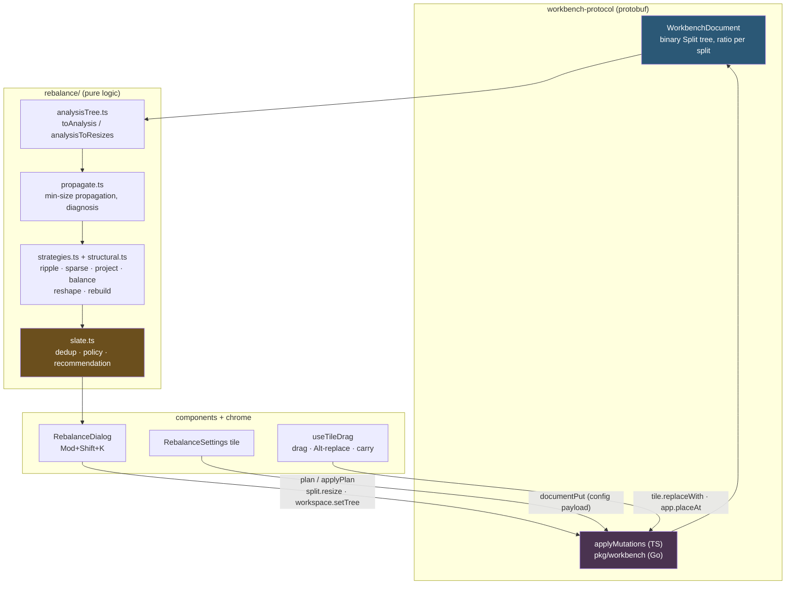
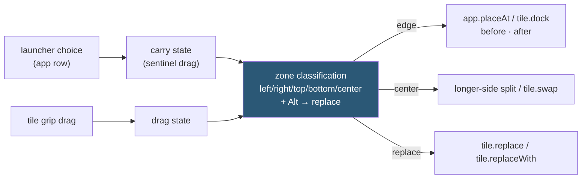

# PBUI Rebalance

This note is a deep technical analysis of PBUI-REBALANCE-1: a one-day project that added layout repair to the pbui workbench — a keyboard-invoked dialog that computes, measures, and offers repair proposals for a degenerated tile layout, plus the gesture vocabulary that grew out of it (Alt-drag replace, launcher placement mode). The project ported nine repair algorithms from a set of standalone HTML prototypes into a typed, tested engine over a protobuf document model, and the interesting engineering is in the seam between the two representations involved: the algorithms want n-ary split trees with weight vectors, and the workbench stores binary split trees with one ratio per split.

> [!summary]
> - A pure-logic repair engine (`packages/pbui-workbench/src/rebalance/`) diagnoses and repairs tile layouts through an exact, provenance-carrying adapter between the workbench's binary ratio tree and the n-ary weight tree the algorithms operate on.
> - Repairs are never applied silently. A proposal slate measures every candidate, classifies its invasiveness from the result, and one atomic `plan`/`applyPlan` commit is the only mutation path.
> - Structural repairs required one protocol change (`WorkspaceSetTree`), implemented in both the TypeScript and Go appliers with shared parity fixtures.
> - The drop-zone gesture system gained two modes: Alt while dragging replaces the target tile, and choosing an application in the launcher enters a placement mode built on the same machinery.

## Why this project exists

A tiling workspace degrades under use. Every split halves something; every divider drag is local; after enough operations a layout contains tiles a few dozen pixels wide that render as unusable slivers. The workbench already had a defense — `paneRatioBounds` in `packages/pbui-workbench/src/verbs.ts` clamps each divider so neither direct child of a split goes below 240×160 px — but that defense is split-local, and split-local floors cannot protect rendered tile size. Sizes multiply down the tree. A tile behind three splits with ratios 0.2, 0.15, and 0.3 receives 0.9 % of the screen, and every individual ratio looks healthy to a local check.

The source material for the fix was a corpus of three artifacts (imported into the ticket at `pbui/ttmp/2026/08/28/PBUI-REBALANCE-1--.../sources/`): an interactive tiling lab, a "repair lab" that generates and ranks repair proposals, and a textbook — *Repairing a Tiling Layout: a study of minimum-perturbation algorithms over n-ary split trees* — whose worked numbers were produced by the lab code itself. The textbook's central design positions carried over intact:

- Detection must be global. A pixel floor per rendered tile becomes checkable locally only after a bottom-up propagation pass.
- Repair must be ordered by invasiveness, not power. The cheapest repair that works is the correct one, and "do nothing" must be a first-class, zero-cost outcome.
- The system proposes; the user disposes. Every candidate is measured and offered; nothing is applied behind the user's back.

## Current project status

All five build phases from the design guide shipped on branch `task/add-rebalancing`, along with three follow-up features requested during review. The test surface at the end of the day: 196 tests in `pbui-workbench`, 181 in the root `pbui` package, 48 in `workbench-protocol`, and the full Go suite — all green. Everything below was verified live in a browser against Storybook and against the Gold Coin Shop reference product.

| Increment | Content | Key commits |
|---|---|---|
| Ticket + design | Intern-facing analysis/design/implementation guide, imported sources | `4d9f194` |
| P1 analysis core | Binary⇄n-ary adapter, propagation, diagnosis | `1beac56` |
| P2 strategies + slate | projectLower, RIPPLE/SPARSE/PROJECT/BALANCE, tiers, slate | `d6a1b30` |
| P3 modal + shortcut | RebalanceDialog, Mod+Shift+K route table, verbs, apply path | `0784a5c` |
| P5 settings | Settings tile, config as DocumentPayload | `fb2db6d` |
| P4 structural | `WorkspaceSetTree` mutation, RESHAPE/REBUILD, Hungarian seating | `686b923` |
| Fix + lab | Divider-thickness bug, RebalanceLab story with broken-layout presets | `f91885a` |
| Config seam | Product-injectable `RebalanceConfigStore` | `748273d` |
| Gestures | Click-to-commit cards, Alt-drag replace, launcher placement mode | `1743095`, `6b0963e`…`2da05e4`, `8465d9c`…`2da05e4` |

## Project shape

The feature lives in the pbui monorepo (`/home/manuel/workspaces/2026-08-28/add-rebalancing/pbui`) across four layers:

- `packages/workbench-protocol/` — the protobuf document model, its TypeScript applier, and mutation builders. Gained the `WorkspaceSetTree` mutation and the `replacePlacement` builder.
- `pkg/workbench/` — the Go applier, kept in lock-step with the TypeScript one through a shared parity-fixture corpus in `packages/workbench-protocol/fixtures/mutations/`.
- `packages/pbui-workbench/src/rebalance/` — the pure repair engine: `analysisTree.ts`, `propagate.ts`, `projectLower.ts`, `strategies.ts`, `repairPass.ts`, `measure.ts`, `structural.ts`, `slate.ts`, `config.ts`, `configDocument.ts`, `configStore.ts`.
- `packages/pbui-workbench/src/components/` and `src/chrome/` — the RebalanceDialog, the RebalanceSettings tile, and the shared drag/carry machinery (`useTileDrag.ts`, `TileFrame.tsx`, `shortcutRouting.ts`).

## Architecture



The dependency direction matters: the engine imports protocol *types* only, and nothing below `slate.ts` touches React or the DOM. This is what makes the whole repair pipeline testable in plain vitest with no mocking, and it is why the engine could later serve an agent-facing door with no changes.

## Implementation details

### The representation gap and the adapter

The workbench protocol stores a workspace as a binary tree. A `Split` message has exactly two children, `a` and `b`, and a single `ratio` — the fraction of the distributable extent given to `a`. A row of four tiles is therefore a chain of three nested `Split` nodes with the same direction. The repair algorithms, following the textbook, operate on n-ary trees: one `Row` node with four children and a weight vector summing to 1. The n-ary form is where the algorithms are well-posed ("make the third pane wider" names `w[2]` and its neighbors); the binary form is where mutations are addressable (`split.resize` targets one split id). The adapter (`rebalance/analysisTree.ts`) converts losslessly in both directions.

Two facts make the conversion exact rather than approximate.

The first is divider conservation. Each rendered split consumes one divider track (10 px by default) between its two children. A maximal same-direction chain over k+1 leaves contains exactly k such tracks — a chain is a full binary tree over an ordered partition, and an ordered partition of k+1 segments has exactly k cuts. Consequently the distributable space of the flattened n-ary split is exactly `extent − k·dividerPx`, wherever the chain happened to nest its dividers.

The second is that weights must be pixel shares, not ratio products. The design guide originally planned to compute a flattened child's weight as the product of the binary ratios along its chain path. That formula is wrong against the real renderer: each binary level subtracts only its own divider before applying its ratio, so ratio products drift from rendered pixels by several pixels per chain level. The shipped adapter instead lays the binary tree out first, with the exact arithmetic the `SplitPane` component renders, and defines each weight as the child's pixel extent divided by the sum of its siblings' pixel extents:

```
layoutBinary(node, rect):                     # the renderer's exact math
    avail = extent(rect, axis) - dividerPx
    first = node.ratio * avail
    recurse into a with `first`, into b with `avail - first`

toAnalysis(node, rects):
    children, chain = flattenChain(node)      # maximal same-direction run
    px[i]  = extent(rects[children[i]], axis)
    w[i]   = px[i] / Σ px                     # pixel share, NOT ratio product
```

With pixel-share weights, the uniform-gap n-ary layout reproduces the binary rendering to float precision, a property pinned by a randomized test over forty trees at 1e-6 tolerance.

Write-back runs the flattening in reverse, in pixel space. Each flattened split carries provenance: a preorder list of `ChainStep { splitId, leftCount, ratio }` records, one per binary split consumed, where `leftCount` says how many flattened children fell under that split's `a` subtree. Because a chain over m children always contributes exactly m−1 steps, the step list partitions deterministically without id lookups: after the head, the next `leftCount − 1` steps belong to the `a` side. The new ratio at each step is the `a` subtree's extent — its children's target pixels plus its internal dividers — over the pair extent:

```
writeBackChain(chain, px):
    head = chain[0]
    L, R = px[0 : head.leftCount], px[head.leftCount :]
    extA = Σ L + (|L| - 1) · dividerPx
    extB = Σ R + (|R| - 1) · dividerPx
    ratio(head.splitId) = extA / (extA + extB)      # denominator = this split's avail
    recurse into chain[1 : |L|] with L, chain[|L| :] with R
```

Only ratios that actually moved are emitted, so a weight-only repair becomes a minimal batch of `split.resize` verbs against the original split ids. The end-to-end property — perturb every weight randomly, write back, re-render the binary tree — holds exactly, which is what guarantees that a proposal's preview equals its applied result.

### Minimum-size propagation

Detection is a bottom-up pass that converts the per-tile pixel floor into a per-subtree requirement any ancestor can act on:

```
req(pane)          = (minInlinePx, minBlockPx)
req(row  q1..qn)   = ( Σ qi.w + (n-1)·gap ,  max qi.h )
req(col  q1..qn)   = ( max qi.w           ,  Σ qi.h + (n-1)·gap )
```

Requirements sum along the split axis and take the maximum across it; gaps are real pixels along the axis only. The pass is linear with memoization, and the memo is rebuilt per call because it is only valid for one tree shape. It yields three distinct feasibility questions, and keeping them distinct is what separates a correct repair system from a flailing one:

| Scale | Question | Test |
|---|---|---|
| Split-local | Can this split fix its children by moving weights? | `Σ lowerᵢ ≤ avail` |
| Subtree | Does this subtree get enough room from its parent? | `req(node) ≤ rect(node)` |
| Global | Can any weight assignment satisfy every tile? | `req(root) ≤ workspace` |

When the global test fails — a column of four 160 px-minimum tiles needs 670 px of height on a 640 px workspace — no weight algorithm can succeed, and the slate knows in advance that only structural candidates can reach zero violations.

### Weight repair strategies

Four strategies shipped, each a generator that yields trace lines and returns a new weight vector for one split. The driver (`repairPass.ts`) runs one top-down pass: because propagation already crossed the axes (a row reports the maximum of its children's heights, which its parent column satisfies as an ordinary along-axis requirement before recursing), a single pass repairs both axes with no fixpoint iteration. Hysteresis lives only in the trigger — repair fires when a deficit exceeds `0.5 + hystPx` but always repairs to the full requirement — which is what prevents re-repair loops on one-pixel window resizes.

- **RIPPLE** transfers pixels from the nearest sibling with slack, escalating outward as donors run dry. It moves the fewest dividers of any strategy and is the default recommendation on feasible layouts.
- **SPARSE** prefers a single donor able to pay a deficit in full, minimizing how many tiles change size rather than how much total change occurs.
- **PROJECT** solves `min ‖w′ − w‖²  s.t.  Σw′ = 1, w′ᵢ ≥ lᵢ` exactly. The KKT conditions give a one-parameter family `w′ᵢ = max(lᵢ, wᵢ + θ)`; since `Σ max(lᵢ, wᵢ+θ)` is monotone in θ, eighty bisection steps reach machine precision. When `Σ lᵢ ≥ 1` there is no feasible point and the floors are returned proportionally scaled — every tile equally short rather than a few catastrophically so. The textbook's verification vector, `projectLower([.5,.3,.2],[.25,.35,.10]) → [.4750,.3500,.1750]`, is a unit test verbatim.
- **BALANCE** sets every split to 1/n, projecting afterwards if equality itself violates a floor. It is deliberately kept in the slate as a user command and a measurement control, never as an automatic repair: on the four-donor test layout it moves every tile 629 px to fix a deficit RIPPLE fixes with 256 px and one divider.

The L2-versus-L0 distinction is the reason both PROJECT and SPARSE exist. PROJECT is optimal for the Euclidean objective, and the Euclidean minimizer spreads a correction across every free sibling; the user's perceptual objective is closer to counting how many boundaries visibly moved. On the 30/30/30/10 row, RIPPLE moves one divider and two tiles; PROJECT moves three dividers and four tiles; both reach zero violations.

### Measuring change, and tiers

Disruption is reported with four numbers — tiles moved, total displacement (per tile, `|Δcx|+|Δcy|+|Δw|+|Δh|`, identity-matched by placement id), largest single move, and dividers moved — because no single scalar distinguishes "everything drifted slightly" from "one tile teleported." Each result is then classified into an invasiveness tier, and the classification is measured from the result rather than declared by the algorithm that produced it. A rebuild that lands on the geometry it started from is reported as tier 0 and merges into the do-nothing card; an algorithm's ambition is not the same as its effect.

| Tier | Chip | Meaning |
|---|---|---|
| 0 | — | Geometry unchanged |
| 1 | W1 | Weights only, at most two dividers moved |
| 2 | W+ | Weights only, many dividers moved |
| 3 | ORD | Same splits, children reordered |
| 4 | STR | Tree structure changed |
| 5 | NEW | Layout rebuilt |
| 6 | OVF | Tiles moved to another workspace |

### The proposal slate

`buildSlate` runs every enabled generator against a clone of the analysis tree, measures each result, and assembles the card list through three mechanisms:

1. **Deduplication by geometry.** Results are keyed by rounded tile rectangles. Candidates landing on identical geometry merge into one card ("+4 agree"), and the deduplication map is seeded with the do-nothing baseline — so a generator that achieved nothing visibly *agrees with LEAVE AS IS* instead of silently vanishing. On a layout where one tile hogs 90 %, all four targeted strategies land on the same repair and the slate shows exactly two meaningful cards.
2. **Policy gating.** A profile (CAREFUL / BALANCED / TIDY / ANYTHING) declares which tiers are allowed and what budgets apply. Out-of-policy proposals stay visible, greyed, with the reason attached ("outside policy: rebuilds the layout") — hiding them would make the system's restraint unexplainable.
3. **One recommendation.** Among in-policy proposals achieving the slate's minimum violation count, the lowest `polScore = w_move·disp/1000 + w_struct·tier + w_aspect·ln(worstAspect) + 12·viol` wins the PICK badge. The measured tier entering the score directly is what lets CAREFUL prefer a mediocre weight repair over an excellent restructuring without any strategy knowing that policies exist.

![[pbui-rebalance-broken-story.png]]

The dialog itself (Mod+Shift+K; the second entry in a shortcut route table whose header comment had explicitly reserved space for it) renders the slate as tier-ordered cards. Each card carries an SVG thumbnail: identity hues per tile — derived with `color-mix` from the family's design tokens, because the package forbids color literals — a danger stroke on still-violating tiles, and dashed ghost rectangles with trail lines from where the four biggest movers sit today to where the proposal puts them. Applying goes through the workbench's `plan`/`applyPlan`: the verb batch is preflighted against a shadow store, committed atomically, and refused cleanly if the document changed underneath. A plain click on a card applies it and closes the dialog; Shift+click applies but keeps the dialog open, which is the path that arms the single-level Undo.

![[pbui-rebalance-after-apply.png]]

### Structural repair and the WorkspaceSetTree mutation

Structurally infeasible layouts need tree changes, and two engines provide them. RESHAPE is a greedy hill-climb over local mutations — transpose, rotate, reverse, adjacent swap, and regroup, which wraps k consecutive children of a split in a perpendicular sub-split and is the move that converts an impossible strip into a feasible grid. Every candidate is settled with a PROJECT pass before scoring, so topologies are compared on their merits rather than on unsettled weights; this is the single most consequential detail in the search. REBUILD generates a fresh target shape (grid, master, columns, dwindle) over placeholder slots and seats the existing tiles by a minimum-cost assignment (the O(n³) Hungarian algorithm over center distance plus a size term), so windows land near where they were even though every rectangle changed.

![[pbui-rebalance-lab-skinnycol.png]]

Applying a structural result required the project's one protocol change. The mutation vocabulary had no way to replace a workspace's tree wholesale, and expressing an arbitrary restructure as a sequence of dock/swap verbs would put tree-edit-distance complexity in the least testable place. The new mutation is small:

```protobuf
message WorkspaceSetTree {
  string workspace_id = 1;
  Node root_placement = 2;
}
```

It is implemented with matching semantics in the TypeScript applier (`apply.ts`) and the Go applier (`pkg/workbench/mutation.go`), and two new fixtures joined the shared parity corpus that both test suites execute. Emission back to the protocol (`emitBinary`) preserves tile identity — leaf placements keep their ids and view references, because tiers, thumbnails, and focus restoration all key on them — while minting fresh split ids and computing each chain ratio in pixel space, clamped to the `[0.05, 0.95]` band the Go server's validator enforces.

![[pbui-rebalance-lab-reshaped.png]]

The screenshot pair above shows the canonical structural case: a column of six tiles whose propagated requirement (490×1010) exceeds the workspace, every weight strategy honestly reporting "6 bad," and RESHAPE's accepted regroup taking the layout to zero violations in one move.

### Configuration and its storage seam

The repair configuration — pixel floors, hysteresis, policy profile, allowances, budgets, recommendation weights, per-generator toggles — is edited in a singleton settings tile and read by the dialog. Where that configuration lives is the importing product's decision, expressed as a two-method store contract:

```ts
interface RebalanceConfigStore {
  useConfig(host): RebalanceConfig;   // a React hook: re-renders callers on change
  save(host, config): void;
}
```

The default implementation keeps the config inside the workbench document itself, as a `DocumentPayload` (`id: rebalance-config`, `format: pbui.rebalance-config`) written with the existing `documentPut` mutation — so it serializes, restores, and syncs wherever the document does, with no second persistence mechanism. A ready-made localStorage store (per-browser, cross-tab through the `storage` event) ships as the alternative, and a product with its own settings backend implements the two methods. The settings tile is a factory, `createRebalanceSettingsApp({ store })`, and the dialog accepts the same store as a prop; a test proves a custom in-memory store serves both while the document stays untouched. Profile switches deliberately preserve the constraint fields — the pixel floors describe the screen and the user's eyes, not a repair posture.

![[pbui-rebalance-settings.png]]

### The gesture grammar: replace and placement mode

Two follow-up features extended the drop-zone system into a consistent spatial grammar. The first: holding Alt while dragging a tile turns the entire target into one drop zone whose outcome is replacement — the target keeps its rectangle and placement identity but shows the dragged tile's view; the source tile closes; the target's old view is deleted when nothing else places it. The mutation recipe is pure composition of existing mutations (`placementReplace`, then `placementClose`, then a conditional `viewDelete`), with the ordering chosen so the moving view holds its new placement before its old one closes. Alt is live state: the hook keeps the last pointer position and reclassifies on Alt keydown/keyup, so tapping the modifier flips the overlay between dock and replace without pointer movement.

The second: choosing an application in the global Ctrl+K launcher no longer places it at a guessed spot. The launcher closes and the choice is carried — the chrome's new `startTileCarry` publishes through the same module-level drag state under a sentinel id, so every tile's overlay machinery worked unchanged. Edges dock the new tile before or after the target (the protocol's `PlacementPosition.BEFORE` gained its first caller), the center splits the target's longer rendered side, and Alt means "show it in this tile instead" — the in-place replace that keeps the tile's identity. The committing click is intercepted in the capture phase, making the workspace a pure aiming surface for exactly one click; Enter takes the old default spot, preserving the fully keyboard-driven flow; Escape cancels; a refused drop (a target too small to split) re-arms the carry rather than silently ending the mode.

![[pbui-rebalance-placement-mode.png]]



The grammar that results is uniform: the same five zones, the same overlays, the same Alt meaning across both modes — a drag moves what exists, a carry places what was chosen, and Alt always means "take over that tile."

![[pbui-rebalance-demo-app.png]]

### A failure mode worth recording: the divider-thickness bug

The first real-use screenshot showed nonsense: a modest workspace diagnosed as needing 1996×1676 px, "only 6 tiles fit," and thumbnails clumped into a corner of otherwise empty cards. Both symptoms pointed at the adapter, and the adapter was exact — the corrupted value was upstream. `measureDividerPx` located the first rendered divider and read its `width`; a column divider is a full-width track roughly 10 px tall, so a ~700 px span was being measured as the gap thickness, inflating every propagation sum and inserting phantom 700 px gaps into every thumbnail layout. The track's thickness is its smaller dimension; the fix is `Math.min(width, height)`, regression-tested with both orientations. The adjacent lesson: the codebase already contained a correct divider measurement (`verbs.ts` takes `row ? width : height`), and the dialog's copy diverged from the precedent it was copying. Duplicated measurement helpers duplicate their orientation handling, or they get shared.

## Testing approach

The textbook's promise — every number in it was produced by the code it describes — made it a fixture file. The propagate tests assert the book's numbers at its reference configuration (the COMPOUND layout needs 586×268; the skinny column needs 820 px of height; the wide row of nine needs 1774 px), and the Hungarian implementation is pinned by the book's hand-computable 3×3 assignment. Where the pixel-share weight model changed the premises, tests assert the behavioral claims computed from actual pre-repair pixels (the starved tile pins to its floor; the nearest donor pays in full; PROJECT spreads exactly deficit/3 per free sibling) rather than hardcoding numbers whose derivation no longer applies.

Three property tests carry the adapter: render parity between the binary and n-ary layouts (exact to 1e-6 over random trees), write-back round-trip (unchanged weights emit zero resizes), and perturb-writeback-relayout exactness. The structural emission has a clamp-aware variant: rounds where the server's ratio band bit are excluded from the exactness assertion, with a floor on how many unclamped rounds must have run so the property keeps teeth. Above the unit layer, component tests drive the real dialog and launcher through jsdom with mocked tile geometry, the applier parity corpus runs in both languages, and every feature was additionally exercised live in Storybook via scripted pointer events before being called done.

## Important project docs

- Ticket workspace: `pbui/ttmp/2026/08/28/PBUI-REBALANCE-1--rebalancing-modal-for-the-pbui-workbench-keyboard-invoked-layout-repair-proposals/`
- The intern guide (design + implementation, with a post-build addendum recording every deviation): `design-doc/01-...intern-analysis-design-and-implementation-guide.md`
- The diary (11 steps, strict format, failures verbatim): `reference/01-diary.md`
- Imported sources: `sources/tiling-repair-textbook.md`, `sources/repair-lab-2.html`, `sources/tiling-lab-1.html`
- Interactive test workspace: Storybook story `Workbench/RebalanceLab` (nine broken-layout presets plus seeded random trees)

## Open questions

- The `emitBinary` ratio clamp trades up to ~3 % of a split's extent for server validity in already-degenerate cases; the apply status line does not yet surface when a clamp fired.
- Out-of-policy (greyed) proposal cards still commit on an explicit click — the gate constrains the recommendation, not the user's hand. Whether greyed cards should refuse plain clicks is an open product decision.
- The carry's capture-phase pointerdown swallows every click while placement mode is active, including clicks on chrome outside tiles (which cancel). Whether cancel-on-any-non-tile-click is the wanted grammar needs a second opinion.
- The RESHAPE scoring weights are the lab's empirical constants, untuned for the workbench's 240×160 defaults.

## Near-term next steps

- FOLD adapted as "overflow to a new workspace" (capacity math exists in `diagnose`; the card does not).
- The RELAX strategy (projected gradient over a displacement-plus-aspect energy) and live preview on the Surface behind the dialog.
- A refusal hint during placement mode ("that tile is too small") and a danger-tinted `data-zone="replace"` overlay style.
- Adoption of `onReplace` by the sibling products (datalab-ui, agentlogic, turboproof) — one line each.

## Project working rule

Preview must equal applied result. Every representational choice in this project — pixel-share weights, pixel-space write-back, identity-preserving emission, plan-before-apply — exists to make the thumbnail the user clicks and the layout they receive the same object, and any future change to the engine should be tested against that invariant first.
