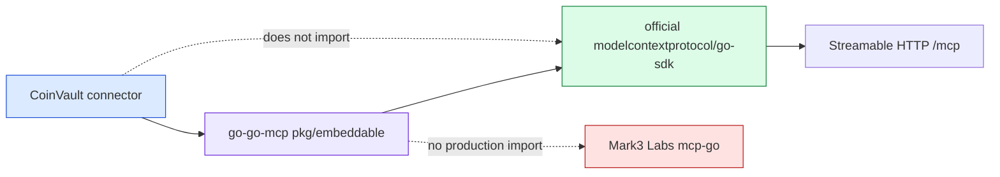
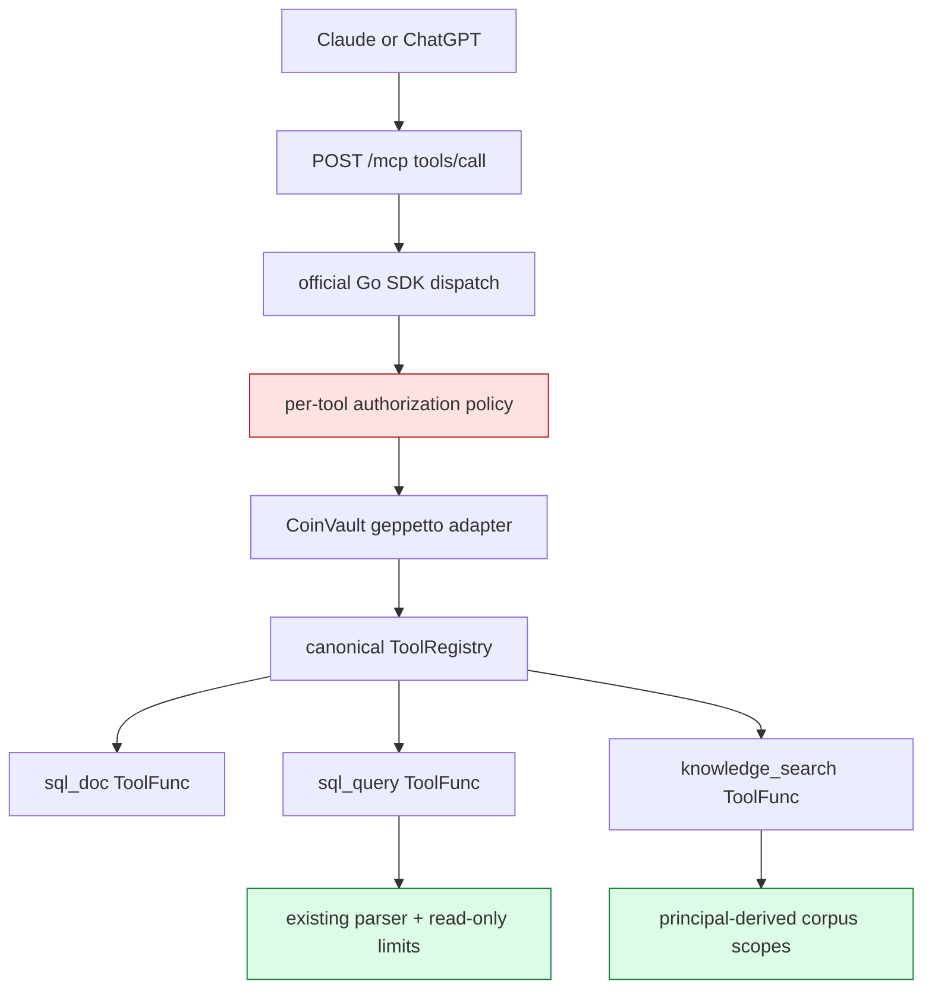
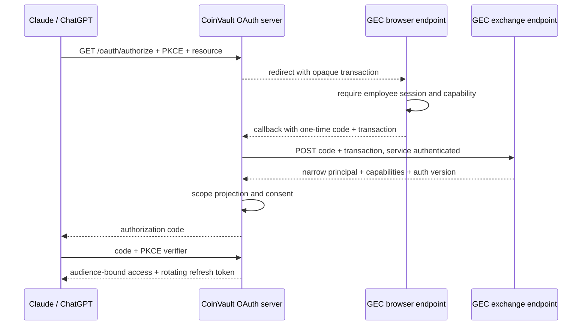
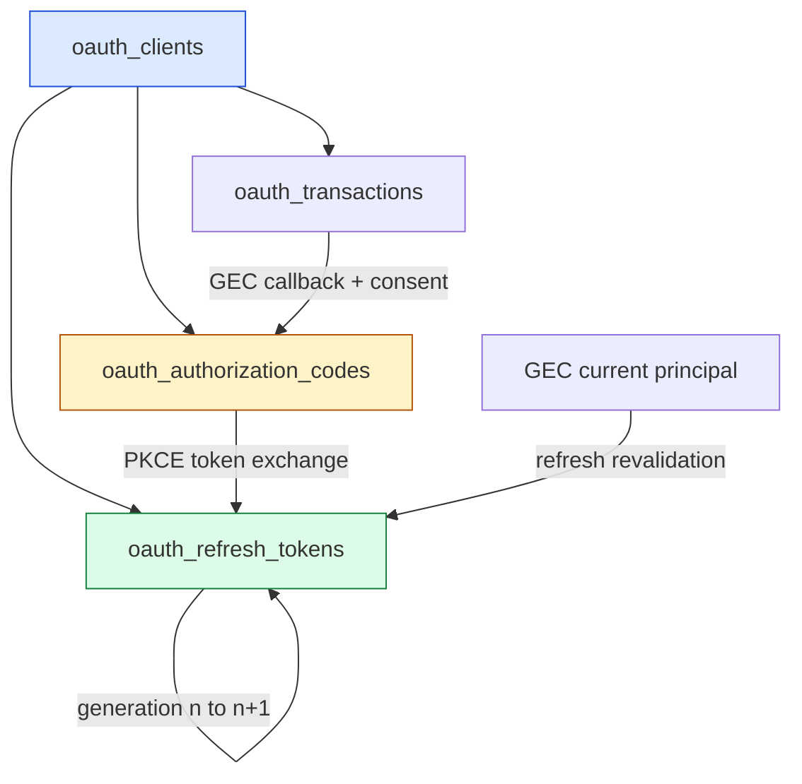

# CoinVault Remote MCP: Official Go SDK and Employee OAuth Authorization

CoinVault is becoming a remote Model Context Protocol resource server for Claude and ChatGPT. The connector exposes three existing product capabilities—SQL documentation, read-only SQL, and knowledge retrieval—without copying their implementations into a second service. The difficult part is not registering three tools. The difficult part is preserving every security boundary around those tools while changing the MCP runtime, introducing host-facing OAuth metadata, and connecting short-lived OAuth grants to durable employee capabilities owned by goldeneaglecoin.com.

This report explains the project from the protocol boundary down to persistence. It covers the migration of `go-go-mcp` from Mark3 Labs to the official `github.com/modelcontextprotocol/go-sdk`, the preservation of CoinVault's canonical geppetto tools, the shared per-tool authorization policy, the GEC capability authority and one-time assertion flow, and the durable OAuth grant store now under construction. It also records what is proven, what failed during implementation, and what remains before Claude and ChatGPT can be called interoperable.

> [!summary]
> - **The MCP runtime has been migrated completely to the official Go SDK.** `go-go-mcp` preserves its embeddable API, supports MCP `2025-06-18`, uses official stdio/SSE/Streamable HTTP transports, and contains no production Mark3 Labs import or module dependency.
> - **Tool behavior remains canonical.** `sql_doc`, read-only `sql_query`, and `knowledge_search` execute through existing geppetto `ToolFunc` implementations. SQL parser and resource limits remain intact, while knowledge corpus access is derived from the authenticated principal rather than model arguments.
> - **Authorization metadata and enforcement now share one policy.** Required scopes drive decoded tool dispatch, `_meta.securitySchemes`, HTTP challenges, and MCP `mcp/www_authenticate` result challenges. Metadata describes policy; server-side dispatch enforces it.
> - **GEC is the durable employee capability authority.** It now has explicit CoinVault capabilities, a production schema migration, an authorization version, 256-bit one-time assertions stored only as hashes, atomic replay-safe exchange, and service-authenticated current-principal lookup.
> - **The project is not finished.** The production CoinVault HTTP OAuth issuer is being built over a durable SQLite grant store. Metadata, DCR, consent, PKCE exchange, signed audience-bound access tokens, refresh revalidation, revocation, deployment, and real Claude/ChatGPT evidence remain acceptance requirements.

## 1. The problem being solved

Claude and ChatGPT can connect to remote MCP servers, discover tools, authorize a user, and call those tools from a model conversation. CoinVault already has the domain functions those hosts need. It can explain the SQL schema, execute strictly read-only SQL, and search a verified knowledge bundle. Before this project, those functions were available through local application paths and geppetto tool registries, not through a dedicated internet-facing MCP resource server with OAuth semantics.

The target system must satisfy five independent contracts at once.

1. **MCP protocol correctness.** The server must initialize as MCP `2025-06-18`, expose exact tool schemas and annotations, return structured content and result metadata, and speak Streamable HTTP in the form expected by remote hosts.
2. **OAuth resource-server correctness.** Bearer tokens must be validated for signature, issuer, expiry, exact audience, and scopes. Missing or insufficient authorization must produce RFC 9728 metadata and actionable challenges.
3. **Product safety.** `sql_query` must retain the existing parser, read-only classification, timeout, row, and byte limits. `knowledge_search` must never accept a model-controlled argument that raises corpus access.
4. **Employee authorization.** Google and AWS ALB authenticate employees at goldeneaglecoin.com, while the GEC employee record owns durable capabilities. CoinVault OAuth scopes must be a projection of those capabilities, not a second independently administered authorization database.
5. **Host interoperability.** Claude and ChatGPT must complete discovery, authorization, tool calls, refresh, insufficient-scope behavior, capability removal, and revocation against a deployed HTTPS endpoint.

The work therefore spans three repositories:

| Repository | Responsibility |
| --- | --- |
| `go-go-mcp` | MCP SDK adaptation, transports, protocol mapping, bearer middleware, auth principal context, and per-tool policy enforcement |
| `coinvault` | Connector process, canonical tool registration, product scope projection, GEC client, production OAuth issuer, and durable grant state |
| `goldeneaglecoin.com` | Employee authentication, capability administration, authorization version, one-time assertions, and refresh-time principal lookup |

The implementation rule is strict: authentication establishes who the employee is; GEC capabilities establish what that employee may receive; CoinVault OAuth scopes express the resulting grant to an MCP client; the MCP server enforces those scopes again at decoded tool dispatch.

## 2. Starting architecture and why it had to change

CoinVault originally depended on `github.com/go-go-golems/go-go-mcp`, which depended on `github.com/mark3labs/mcp-go`. Mark3 Labs supported Streamable HTTP and MCP `2025-06-18`, so the migration was not motivated by a broken protocol version. The problem was the authorization surface.

Remote MCP hosts depend on exact descriptor metadata, protected-resource metadata, bearer challenges, and token context. The Mark3 Labs tool serializer omitted host-facing fields that the project needed, including the intended security metadata shape. It was possible to add isolated serializer patches, but doing so would have left runtime-coupled authorization implemented against a backend that was already scheduled for replacement.

The chosen architecture was to preserve `go-go-mcp/pkg/embeddable` and replace its backend. CoinVault would continue to register tools and configure a server through the same facade. Only `go-go-mcp` would know the official SDK types.



This boundary has three benefits. CoinVault does not acquire a second protocol abstraction. Other `go-go-mcp` consumers receive the migration without changing their public integration. The old and new SDKs never become permanent production backends selected by a feature flag.

## 3. Freezing behavior before replacing the runtime

A runtime migration is unsafe when the old behavior is known only by inspection. Phase 0 first froze the existing wire contract with baseline and golden tests. The test suite captures:

- MCP `2025-06-18` initialization;
- exact `tools/list` output;
- successful `tools/call` output;
- result `_meta` forwarding;
- invalid token, audience, expiry, and scope rejection;
- exact middleware and lifecycle hook invocation counts.

This work found a real bug before the SDK replacement began: middleware and hooks could be invoked more than once for one tool call. Fixing that defect established a reliable baseline rather than preserving an accidental duplicate lifecycle.

The next phase created an isolated official-SDK spike. A synthetic tool proved the specific features the production migration needed:

```text
Streamable HTTP
  + raw JSON input schema
  + structured output
  + result metadata
  + RFC 9728 bearer challenge
```

Only after that spike passed did descriptor/result mapping and transport replacement begin. This sequence matters because it separates two questions:

1. Can the official SDK represent the required wire behavior?
2. Can the existing embeddable facade map its domain types into that behavior without changing callers?

The answer to both is now backed by tests rather than inferred from API documentation.

## 4. Mapping the embeddable protocol to the official SDK

The central adapter is:

- `/home/manuel/workspaces/2026-08-28/coinvault-oidc-mcp/go-go-mcp/pkg/embeddable/official_mapping.go`

A `protocol.Tool` becomes an official SDK tool while preserving name, title, description, raw input and output schemas, annotations, and metadata:

```go
func mapToolToOfficial(tool protocol.Tool) *official.Tool {
    mapped := &official.Tool{
        Name:        tool.Name,
        Title:       tool.Title,
        Description: tool.Description,
        InputSchema: tool.InputSchema,
        Meta:        cloneMeta(tool.Meta),
    }
    if len(tool.OutputSchema) > 0 {
        mapped.OutputSchema = tool.OutputSchema
    }
    // annotations are mapped field by field
    return mapped
}
```

Tool results require more care because MCP content is a tagged union. Text, image, and embedded-resource content each map to a different official SDK type. Image and resource blobs are decoded from base64. Unknown content types fail rather than disappearing.

```go
switch content.Type {
case "text":
    mapped.Content = append(mapped.Content,
        &official.TextContent{Text: content.Text})
case "image":
    data, err := base64.StdEncoding.DecodeString(content.Data)
    // append official.ImageContent
case "resource":
    // map URI, MIME type, text, and optional blob

default:
    return nil, fmt.Errorf("unsupported tool content type %q", content.Type)
}
```

Two details are easy to miss.

First, `StructuredContent` is not reconstructed from text. It remains a first-class result field. A client that understands structured output receives typed JSON without parsing a prose block.

Second, result metadata is copied into the official SDK `Meta` field. This supports normal application metadata and authorization challenges such as `mcp/www_authenticate`. Earlier in the project, `go-go-mcp/pkg/protocol.ToolResult.Meta` and its constructors were corrected so metadata could travel through every layer rather than being dropped by the backend.

## 5. Transport cutover without changing CoinVault's listener model

The official backend lives in:

- `/home/manuel/workspaces/2026-08-28/coinvault-oidc-mcp/go-go-mcp/pkg/embeddable/official_backend.go`

It implements stdio, SSE, and Streamable HTTP behind the existing embeddable configuration. CoinVault uses handler mounting rather than letting the library own the process. The connector creates one `http.ServeMux`, adds `/healthz`, authorization metadata or issuer routes, and the MCP endpoint, then owns graceful shutdown.

```text
coinvault mcp serve
  -> build canonical tool registry
  -> configure MCP server
  -> mount HTTP auth provider routes
  -> mount /.well-known/oauth-protected-resource
  -> mount /mcp
  -> listen on dedicated address
  -> shut down when context is cancelled
```

The connector does not reuse browser cookie middleware. A bearer-authenticated remote protocol endpoint has different origin, audience, and lifecycle semantics from the employee browser application. Keeping it in a dedicated process also makes resource limits, deployment, and incident response easier to reason about.

A live loopback smoke test initialized MCP, listed tools, and called a tool through the production Streamable HTTP handler after Mark3 Labs was removed. The complete `go-go-mcp` test/build/lint suite and targeted race tests passed at the cutover boundary.

## 6. Canonical tools instead of MCP-specific duplicates

CoinVault's MCP connector does not contain alternate SQL or retrieval engines. The adapter in:

- `/home/manuel/workspaces/2026-08-28/coinvault-oidc-mcp/coinvault/internal/mcpconn/tool_adapter.go`

converts geppetto tool definitions into `go-go-mcp` registrations and invokes `ToolFunc.ExecuteWithContext`. This preserves the existing domain behavior and tests.

The resulting execution path is:



### 6.1 SQL documentation

`sql_doc` exposes the existing schema documentation tool. The connector defaults to embedded documentation but accepts explicit files or globs. The tool is protected by default because schema documentation can reveal operational structure even when it cannot mutate data.

### 6.2 Read-only SQL

`sql_query` retains all existing safety mechanisms. The MCP layer does not implement its own keyword filter. The canonical SQL tool still owns:

- parser-based statement classification;
- rejection of mutating or ambiguous statements;
- execution timeout;
- maximum row count;
- maximum response bytes.

This is a significant design decision. A second implementation would eventually diverge from the application path, and the most likely divergence would occur in edge-case statement classification or resource limits.

### 6.3 Knowledge search

The connector can open a verified immutable knowledge bundle with:

```text
--knowledge-bundle <bundle>
--knowledge-scratch-dir <directory>
```

It then registers `knowledge_search` into the same canonical registry as the SQL tools. The important authorization behavior occurs at call time. Public versus analyst corpus access is derived from the authenticated MCP principal. The model cannot set an `analyst=true` argument or provide an arbitrary scope list.

```go
// conceptual shape
principal := embeddable.GetAuthPrincipal(ctx)
knowledgeScopes := KnowledgeAccessScopes(principal.Scopes)
return existingKnowledgeTool.ExecuteWithContext(ctx, args, knowledgeScopes)
```

This keeps OAuth scope interpretation at the product boundary and keeps document-level filtering inside the knowledge implementation.

## 7. One policy drives authorization metadata and enforcement

The most important runtime authorization file is:

- `/home/manuel/workspaces/2026-08-28/coinvault-oidc-mcp/go-go-mcp/pkg/embeddable/tool_authorization.go`

Each tool has one normalized policy:

```go
type ToolAuthorizationPolicy struct {
    Public         bool
    RequiredScopes []string
}
```

A protected policy must contain at least one valid scope. A public policy cannot also require scopes. Scope values are trimmed, deduplicated, validated, and sorted. That normalized value is then used in four places:

1. descriptor metadata;
2. decoded tool dispatch;
3. insufficient-scope MCP result challenges;
4. host-visible review and tests.

The descriptor metadata is generated from policy:

```json
{
  "name": "sql_query",
  "_meta": {
    "securitySchemes": [
      {
        "type": "oauth2",
        "scopes": ["coinvault:sql:read"]
      }
    ]
  }
}
```

The enforcement path does not trust that metadata. It compares the required scopes with the verified token context before invoking the tool. A failure returns an MCP error result with an actionable challenge:

```text
Bearer resource_metadata="https://mcp.example/.well-known/oauth-protected-resource",
       error="insufficient_scope",
       scope="coinvault:sql:read"
```

The result also carries:

```json
{
  "mcp/www_authenticate": ["Bearer ..."]
}
```

The governing rule is: **metadata explains the authorization contract; decoded dispatch enforces the authorization contract**. A host may ignore metadata, cache stale metadata, or call a tool directly. None of those behaviors bypass enforcement.

## 8. External OIDC and the application-owned provider boundary

`go-go-mcp` supports an external OIDC resource-server mode. It discovers the issuer, validates signatures through JWKS, checks issuer, audience, expiry, and required scopes, then places an `AuthPrincipal` in request context. This path is appropriate when a production identity provider already issues the exact audience and scopes required by the MCP resource.

CoinVault's employee model is different. GEC owns capabilities, while CoinVault must issue audience-bound MCP grants and revalidate capabilities during refresh. The existing embedded issuer in `go-go-mcp` cannot safely serve this role. It uses a development login model, an unsigned identity cookie, and in-memory Fosite grant sessions.

The project therefore added an application-owned provider seam:

```go
func WithHTTPAuthProvider(provider HTTPAuthProvider) ServerOption
```

The provider owns:

- route mounting;
- bearer-token validation;
- protected-resource metadata;
- `WWW-Authenticate` formatting.

`go-go-mcp` still owns MCP middleware and decoded tool authorization. CoinVault owns the authorization server. Tests prove that custom routes mount on the same mux, a missing bearer is rejected, a valid application principal reaches MCP dispatch, and external OIDC cannot be enabled simultaneously.

This separation prevents production employee authorization from being implemented as incremental exceptions inside a development issuer.

## 9. GEC as the durable capability authority

The GEC employee record now defines five explicit CoinVault capabilities:

| GEC capability | Meaning | Projected OAuth scope |
| --- | --- | --- |
| `coinvault` | Base eligibility | no tool scope by itself |
| `coinvault_sql_docs` | SQL documentation access | `coinvault:sql:docs:read` |
| `coinvault_sql_read` | Read-only SQL access | `coinvault:sql:read` |
| `coinvault_knowledge` | Public knowledge search | `coinvault:knowledge:read` |
| `coinvault_knowledge_analyst` | Analyst corpus access | `coinvault:knowledge:read` plus `coinvault:knowledge:analyst` |

The existing `admin` capability remains a wildcard. That behavior is explicit and tested, but it remains a production policy worth reviewing because it grants every CoinVault scope.

CoinVault implements a fail-closed pure projection in:

- `/home/manuel/workspaces/2026-08-28/coinvault-oidc-mcp/coinvault/internal/mcpauthz/capabilities.go`

Unknown capabilities grant nothing. An employee without `coinvault` or `admin` is ineligible. Duplicates and whitespace do not change the result. Analyst knowledge implies base knowledge access.

The final grant is an intersection:

```text
granted scopes =
    requested by client
  ∩ allowed for registered client
  ∩ derived from current employee capabilities
  ∩ explicitly consented by employee
```

No component can add a scope by itself. In particular, a requested scope is not a granted scope, and a durable capability is not automatically exposed to every OAuth client.

## 10. Why GEC does not share its PHP session

The GEC browser session authenticates an employee on the admin origin. Sending `PHPSESSID` to the MCP origin, encoding it into an OAuth token, or asking Claude to present it would expand the session's attack surface and erase audience separation.

The implemented design uses one-time assertions:



The GEC assertion implementation has the following properties:

- 256 bits of randomness encoded as base64url;
- at most 60 seconds of validity;
- only SHA-256 code and transaction hashes stored;
- exact callback allowlist;
- employee foreign key;
- atomic conditional `used_at` update;
- distinct invalid, replay, expired, and ineligible outcomes;
- dedicated service bearer authentication for exchange and current-principal lookup;
- no-store headers on sensitive responses.

The core atomic update is equivalent to:

```sql
UPDATE coinvault_authorization_assertions
SET used_at = UTC_TIMESTAMP(6)
WHERE code_hash = :code_hash
  AND transaction_hash = :transaction_hash
  AND used_at IS NULL
  AND expires_at > UTC_TIMESTAMP(6);
```

Exactly one affected row means success. Zero affected rows triggers a hash-only diagnostic lookup that distinguishes invalid input, replay, and expiry. Two concurrent exchanges cannot both succeed.

The exchange response is deliberately narrow:

```json
{
  "subject": "gec-employee:42",
  "employeeId": 42,
  "email": "alice@example.com",
  "displayName": "Alice Example",
  "capabilities": ["coinvault", "coinvault_sql_read"],
  "authorizationVersion": 17,
  "expiresAt": "2026-08-28T23:45:00Z"
}
```

It excludes the PHP session, Google token, ALB JWT, and full employee record.

## 11. Authorization versions and refresh-time revalidation

Capabilities can change after authorization. A ten-minute access token may remain valid until expiry, but a refresh token must not preserve removed authority.

GEC now stores `authorization_version` on employees. The value increments when either `active` or `capabilities` changes. Editing ordinary profile fields does not increment it. Non-administrators cannot mutate privilege fields through the self-service employee route; a dedicated PHPUnit test proves attempted `active=false` and `admin`/CoinVault capability changes are ignored.

CoinVault has a strict GEC client in:

- `/home/manuel/workspaces/2026-08-28/coinvault-oidc-mcp/coinvault/internal/mcpauthz/gec_client.go`

It supports:

```text
POST /rest/admin/coinvault/exchange
GET  /rest/admin/coinvault/principals/gec-employee:42
```

The client requires HTTPS except on loopback, requires a service credential, limits response bodies to 64 KiB, validates subject/employee-id agreement, and maps lifecycle statuses to typed errors without returning untrusted GEC response bodies.

The intended refresh algorithm is:

```text
load refresh grant
  -> reject used, expired, or revoked token
  -> fetch current GEC principal
  -> reject inactive or base-ineligible employee
  -> project current capability scopes
  -> intersect with previous grant and policy
  -> rotate refresh token exactly once
  -> issue reduced access token if authority decreased
  -> revoke family on replay or ineligibility
```

This algorithm never increases authority during refresh. New capabilities require a new authorization and consent flow.

## 12. Durable OAuth grant storage

The production issuer groundwork now includes:

- `/home/manuel/workspaces/2026-08-28/coinvault-oidc-mcp/coinvault/internal/mcpoauth/store.go`

The committed store persists four lifecycle objects in SQLite:

1. registered clients and exact redirect URIs;
2. authorization transactions;
3. one-time authorization codes;
4. refresh-token families.

Raw transactions, authorization codes, and refresh tokens are never stored. Their SHA-256 digests are primary keys. Typed GEC principal JSON preserves the employee subject, capability set, and authorization version through code and refresh sessions. The exact OAuth resource remains attached to every grant.



Refresh rotation enforces these invariants:

- the family id does not change;
- generation increments by exactly one;
- client id does not change;
- resource does not change;
- the old token becomes used exactly once;
- replay of a used token revokes the entire family;
- replay revocation commits before the method returns `ErrConsumed`.

The last point required deliberate transaction control. Returning an error while deferring rollback would otherwise undo the security action that the error path was supposed to perform.

At the time of this report, the working tree has begun extending the store with durable consent sessions. That work is not yet committed and is not counted as a completed issuer feature.

## 13. Validation evidence and phase commits

The migration was implemented in focused phases rather than one replacement commit.

### 13.1 go-go-mcp

| Commit | Proven boundary |
| --- | --- |
| `5b7313d` | Baseline conformance and lifecycle counts |
| `b771d7f` | Official SDK Streamable HTTP spike |
| `cac611e` | Descriptor and result mapping |
| `f936774` | Production transport cutover |
| `3f054f5` | Official OAuth middleware integration |
| `e35e09b` | Shared per-tool authorization policy |
| `7cb8b61` | Mark3 Labs removal |
| `6e2fcbc` | Application-owned HTTP auth provider seam |

The current module graph contains:

```text
github.com/modelcontextprotocol/go-sdk v1.7.0
```

A production source and dependency search finds no `mark3labs` reference.

### 13.2 CoinVault

| Commit | Proven boundary |
| --- | --- |
| `8ac4005` | Product tool scope declarations |
| `638de96` | Official-only go-go-mcp dependency |
| `daee803` | Knowledge MCP wiring and capability projection |
| `188573d` | Strict GEC authorization-service client |
| `a287135` | Application-owned MCP authorization mounting |
| `be29071` | Durable OAuth grant store |

CoinVault's complete pre-commit hooks repeatedly ran generation, embedded web build, Go build, golangci-lint, custom geppetto vet, and all `./cmd/... ./internal/...` tests. Targeted race tests cover the connector, authorization client, and OAuth store.

### 13.3 GEC

| Commit | Proven boundary |
| --- | --- |
| `f337b8329` | Centralized CoinVault employee capability vocabulary |
| `7791a6741` | Durable one-time assertion lifecycle and authorization version |
| `ed542737b` | Non-admin privilege mutation boundary |

The dedicated GEC suite passes:

```text
OK (8 tests, 24 assertions)
```

It covers code hashing, transaction hashing, successful exchange, replay, wrong transaction without consumption, expiry, callback allowlist, employee eligibility, service authentication, current-principal lookup, authorization-version increments, and non-admin mutation attempts.

## 14. Failures that changed the implementation

The failures in this project are useful because several revealed hidden contracts that source inspection had not made obvious.

### 14.1 Duplicate lifecycle invocation

The baseline hook-count test found duplicate middleware or hook execution. This was fixed before the SDK cutover, preventing the migration from treating duplication as intended behavior.

### 14.2 Port collision during live validation

The original loopback port was already owned by an unrelated `optkit` process. The smoke test was rerun on alternate ports rather than terminating unrelated work. This reinforced the rule that live test scripts should accept explicit ports and report the owning process when binding fails.

### 14.3 GEC capabilities were a MySQL `SET`

Adding PHP constants and admin choices was insufficient. The production database column enumerated allowed capabilities. Without a schema migration, new values would not persist correctly. The canonical `members.sql` test schema and production migration now change together.

### 14.4 The legacy migration helper has parser constraints

The helper discovers table names with a pattern that expects backticks and splits schema files on blank lines. The first assertion table import was not discovered; the next was split into invalid SQL. The final schema follows those constraints, and the diary records them for future migrations.

### 14.5 Host PHP and test PHP differ

The host has PHP 8.3.6, while Composer dependencies require PHP 8.4 or newer. Syntax checks work on the host, but migrations, ECS, and PHPUnit must run in the project container. The supported test runner was found under `scripts/testrunner`, where PHPUnit is intentionally installed separately from application dependencies.

### 14.6 Legacy PHPUnit discovery is partially incompatible

Several older files do not match PHPUnit 12's filename/class discovery rules. A direct legacy employee run executed 15 tests and 114 assertions but retained one unrelated message mismatch. The new `TestCoinvaultAuthorization.php` follows current naming and passes directly.

### 14.7 Static analysis rejected an otherwise valid predicate

The first GEC client commit failed `QF1001` for a boolean expression that could use De Morgan's law. The expression was rewritten and the full hook rerun. The important workflow property is that a lint failure did not result in bypassing the hook or narrowing validation.

## 15. Security properties and remaining review points

### Properties already implemented

- MCP tools call canonical product implementations.
- SQL remains parser-classified and read-only with resource bounds.
- Knowledge corpus authority comes from verified principal scopes.
- Tool enforcement occurs after decoded MCP dispatch.
- OAuth metadata and enforcement derive from one normalized policy.
- External tokens validate issuer, exact audience, expiry, and scopes.
- GEC assertions contain 256 bits of entropy and are stored only as hashes.
- GEC exchange is transaction-bound, expiring, and atomically single-use.
- Service responses omit cookies and upstream identity tokens.
- OAuth transaction, code, and refresh secrets are stored only as hashes.
- Refresh rotation preserves family/client/resource and detects replay.
- Non-admin employees cannot mutate capability or active fields.

### Review points before production

1. **Service authentication.** The current GEC exchange supports a rotated service bearer. Production should decide whether mTLS is also mandatory and ensure the reverse proxy preserves the `Authorization` header only on intended routes.
2. **Signing keys.** CoinVault needs stable externally supplied signing keys, `kid` rotation, filesystem/Vault permissions, and an operational rotation procedure. Runtime-generated keys are unacceptable.
3. **Dynamic registration policy.** DCR must validate exact redirect URI syntax and decide whether clients can update registrations after creation.
4. **Consent.** The issuer must persist a short-lived consent session after GEC assertion exchange and intersect user-selected scopes with requested, client-allowed, and capability-derived scopes.
5. **SQLite operations.** File permissions, backup, retention, WAL behavior, cleanup jobs, and single-instance assumptions need explicit deployment documentation.
6. **Admin wildcard.** GEC's existing `admin` wildcard currently projects all CoinVault scopes. This must be an accepted policy decision, not an accidental inheritance.
7. **Top-level host metadata.** Exact `tools/list` wire artifacts must be captured from both Claude and ChatGPT. `_meta.securitySchemes` is implemented, but host behavior must be tested rather than assumed.

## 16. What remains before completion

The SDK migration itself is complete. The product authorization program is not.

The production CoinVault OAuth provider still needs:

- RFC 8414 authorization-server metadata;
- RFC 9728 protected-resource metadata through the application provider;
- dynamic client registration;
- authorization request validation;
- exact redirect URI matching;
- PKCE S256 enforcement;
- GEC browser redirect and callback;
- durable consent sessions;
- authorization-code issuance and atomic bound exchange;
- stable RSA signing keys and JWKS;
- exact MCP resource audience in access tokens;
- access-token validation into `embeddable.AuthPrincipal`;
- refresh-time GEC lookup;
- scope reduction after capability removal;
- refresh-token rotation and replay family revocation;
- explicit revocation endpoint and operational controls.

After implementation, a deployed HTTPS environment must prove both hosts. The acceptance matrix includes more than successful login:

| Scenario | Claude | ChatGPT |
| --- | --- | --- |
| MCP discovery and `tools/list` | required | required |
| Browser authorization and consent | required | required |
| Authorized tool call | required | required |
| Refresh rotation | required | required |
| Insufficient-scope challenge | required | required |
| Capability removal on refresh | required | required |
| Employee disablement | required | required |
| Refresh replay and revocation | required | required |

No completion claim is valid until those results are recorded as host evidence.

## 17. How to read and extend the code

An engineer continuing the work should read the system in this order.

1. **Migration design and diary**
   - `coinvault/ttmp/2026/08/28/2026-08-28-COINVAULT-MCP-GO-SDK--migrate-coinvault-mcp-runtime-to-the-official-go-sdk/`
2. **GEC authorization design and diary**
   - `coinvault/ttmp/2026/08/28/2026-08-28-GEC-COINVAULT-MCP-AUTHZ--gec-managed-capabilities-for-coinvault-mcp-oauth-scopes/`
3. **Official runtime mapping and dispatch**
   - `go-go-mcp/pkg/embeddable/official_backend.go`
   - `go-go-mcp/pkg/embeddable/official_mapping.go`
   - `go-go-mcp/pkg/embeddable/tool_authorization.go`
4. **CoinVault connector composition**
   - `coinvault/cmd/coinvault/cmds/mcp.go`
   - `coinvault/internal/mcpconn/server.go`
   - `coinvault/internal/mcpconn/tool_adapter.go`
5. **Product authorization**
   - `coinvault/internal/mcpauthz/capabilities.go`
   - `coinvault/internal/mcpauthz/gec_client.go`
   - `coinvault/internal/mcpoauth/store.go`
6. **GEC producer**
   - `goldeneaglecoin.com/src/lib/CoinvaultAuthorizationService.php`
   - `goldeneaglecoin.com/src/rest/CoinvaultAuthorizationRest.php`
   - `goldeneaglecoin.com/tests/std/TestCoinvaultAuthorization.php`

The next implementation should remain inside `internal/mcpoauth` and satisfy `embeddable.HTTPAuthProvider`. It should not add production behavior to `embedded_dev`, parse JSON-RPC bodies in generic middleware, or duplicate product tools.

## 18. Engineering rules established by the project

- Freeze wire behavior before replacing a protocol runtime.
- Keep one production MCP backend after cutover.
- Preserve a stable application facade around third-party SDK types.
- Let the protocol SDK parse MCP; enforce tool authorization after decoded dispatch.
- Generate security metadata and runtime checks from one normalized policy.
- Treat OAuth resource, audience, client, scopes, subject, and authorization version as persisted grant state.
- Store bearer-class secrets only as cryptographic hashes when later plaintext recovery is unnecessary.
- Rotate refresh tokens exactly once and revoke the family on replay.
- Revalidate durable employee authority during refresh; never increase authority through refresh.
- Keep browser sessions on their owning origin and exchange only short-lived one-time assertions.
- Derive corpus access from authenticated principals, never model-controlled arguments.
- Do not claim host interoperability from local protocol tests.

## Related notes

- [[PROJ - CoinVault - RAG Web Chat for Gold Coin Inventory]]
- [[PROJ - go-go-mcp - Hosted OIDC and Smailnail Delivery]]
- [[PROJ - Hypha MCP - Remote Server, OAuth, and a Retro System-1 Client]]
- [[PROJ - CoinVault GEC-RAG - ragkit Extraction and knowledge_search Integration]]
- [[ARTICLE - CoinVault Production Deployment - Deep Dive Technical Analysis]]

## Current status

The official MCP Go SDK migration, transport cutover, Mark3 Labs removal, tool mapping, external OIDC validation, per-tool policy, canonical SQL and knowledge registration, GEC capability projection, GEC one-time assertions, application-owned provider seam, and committed OAuth grant store are complete and tested.

The active implementation frontier is the production CoinVault HTTP OAuth provider. The durable consent-session extension has started locally, but metadata, DCR, consent, PKCE token exchange, JWT signing, refresh revalidation, and host interoperability remain incomplete. Phase 7 and the overall project therefore remain active.

> [!important]
> Completion is defined by deployed lifecycle evidence, not by the presence of OAuth-looking endpoints. Claude and ChatGPT must each prove discovery, authorization, scoped tool execution, refresh, capability reduction, and revocation against the production-shape service.
