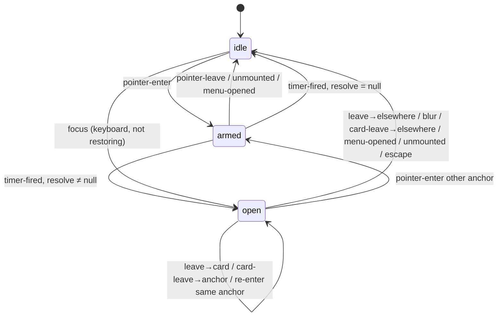

# From Review Churn to State Machine: Consolidating the PBUI Help Surface

This note records the analysis and the process behind PBUI-HELP-002: the consolidation of a hover/focus contextual-help surface that had accumulated seven code-review findings in four rounds, into one pure transition function verified by a fuzz harness. The subject is not the help feature itself. The subject is how to recognize that a stream of small interaction bugs is a single structural defect, how to formalize the behavior so the bug class closes, and what the rebuild looks like in a React codebase that already has strong conventions for pure kernels.

> [!summary]
> - Five of seven review findings against the help surface were the same defect: a state machine that existed only implicitly, distributed across six event-handler locations, missing transitions one interleaving at a time.
> - The fix was to write the machine down once — three states, a ten-event alphabet, a transition table, four invariants — as a pure function, and to automate the reviewer's method: a world-model fuzz harness that generates only physically plausible event sequences and asserts the invariants after every step.
> - React hooks remained as adapters (timers, subscriptions, lifecycle) but stopped being the home of policy. The proof that the consolidation preserved the external contract: all fifteen pre-existing runtime tests passed unchanged against the new engine.

## Why this note exists

PBUI is a React library for presenting typed objects. Its action kernel — which actions apply to a subject, in which scope, under which conditions — is a pure resolver with explicit precedence and permutation tests. PBUI-HELP-001 added a contextual help sibling: hover a presentation for 350 ms, or focus it with the keyboard, and a card of typed help items appears. The help *kernel* (which rules match, which items they contribute) followed the resolver discipline. The help *surface* (when the card opens, closes, and where it sits) was written as event-handler code, the way tooltips are usually written.

Code review on the integration PR ([hyperslop-systems/pbui#20](https://github.com/hyperslop-systems/pbui/pull/20), reviewed by an automated reviewer) then produced findings in four successive rounds. Each finding was fixed correctly; each fix was followed by a new finding. The review history is the dataset this note analyzes, and the eventual consolidation (ticket PBUI-HELP-002 in the repo's `ttmp/2026/08/29/`) is the response.

## The failure dataset

The seven findings, in review order:

| Round | Finding | Classification |
| --- | --- | --- |
| 2 | Closing the menu with the pointer returned focus to the invoker; the focus handler reopened the card | missing transition |
| 2 | The same, for keyboard-driven menu dismissal — input modality alone could not distinguish the restored focus | missing transition |
| 3 | The card clipped overflow behind `pointer-events: none`; no input could reach the hidden content | interaction gap |
| 3 | A 4 px offset between anchor and card belonged to neither element; a slow pointer crossing it fired the anchor's leave and closed the card | geometry coupled to a transition |
| 3 | Unmounting a presentation with its card open (a virtualized row being dropped) fired neither leave nor blur; the card lingered, anchored to a detached element | missing transition |
| 4 | Opening the menu inside the 350 ms hover window cleared the card but not the armed timer, which then opened help on top of the menu | missing transition |
| 4 | The vertical clamp reserved a flat 60 px regardless of the card's real height; near the viewport bottom most of the card was unreachable | geometry |

Two observations drive everything that follows.

First, five of the seven findings are one defect. Each is a legal sequence of user events — leave, focus-return, unmount, open-menu-then-timer — that the handlers had not considered. The behavior being reviewed was a state machine, but no artifact in the codebase *was* that machine. Its transitions were distributed across the `Presentation` component's four event handlers, the `Presentation` unmount cleanup, `Provider.openMenu`, the card's own mouseleave handler, the card's keydown handler, and two module-level flags. A reviewer who enumerates interleavings against that structure will always be ahead of the author who patches them, because the author has no artifact against which to check completeness.

Second, the fixes themselves were producing new state. Round 2 added an input-modality tracker and a focus-restoration mark. Round 3 added an anchor-comparison guard and an element ref that survives React's null detach. Each mechanism was correct and each was a fragment of a model that still existed nowhere.

## Diagnosis: the implicit distributed machine

The pre-consolidation help state lived in three ownership domains:

- Per-`Presentation` refs: the hover timer and the element identity. Every rendered presentation owned a potential timer, although the domain has exactly one "armed" fact at any moment. A grid of five hundred cells meant five hundred timer slots for a single logical value.
- Provider `useState`: the open card (`reference`, `resolution`, `snapshot`, `anchor`, `trigger`).
- Module globals: `lastInputWasKeyboard` and `isRestoringFocus()`.

Splitting one machine's state across three owners has a specific cost: no single place can enforce a cross-cutting rule. The round-4 timer finding demonstrates it exactly. The rule "the menu and the card never coexist" involves provider state (the menu), per-component state (the armed timer), and the open card. `openMenu` could clear the card, because the card was provider-owned; it could not cancel the timer, because the timer belonged to whichever `Presentation` had armed it. The invariant was unenforceable at any single point in the code — which is another way of saying the code had no invariants, only behaviors.

There is also a second-order symptom worth naming because it generalizes: one of the round-3 fixes was a React-semantics bug, not a domain bug. The unmount cleanup needed the element identity, but React detaches function refs (calls them with `null`) before passive effect cleanups run, so the cleanup initially read `null` and closed nothing. When policy lives in handlers and effects, debugging the policy means debugging the framework's commit ordering. This is the concrete argument for separating the two.

## The decision, and the role of hooks

The repository already contained the template for the fix. `resolveActions`, the action resolver, is a pure function with an explicit precedence ladder, and it exists because the pre-kernel descriptor system had policy scattered across call sites in the same way. The consolidation applies the same treatment one layer up: the interaction policy becomes data plus a pure function, and everything else becomes adapters.

The question of whether React hooks "make sense" for this has a precise answer with three parts:

- The machine itself must not be a hook. A hook cannot be property-tested: driving ten thousand event sequences through a component requires mounting and simulating; driving them through a pure function is a loop.
- One hook adapts the machine to React. It owns the state cell, the stable dispatch function, and the effects. This is what hooks are for — lifecycle and subscriptions — and nothing in this layer decides anything.
- Event handlers dispatch. They translate DOM facts into typed events (classifying `relatedTarget`, stamping modality flags) and contain zero policy.

The existing module-level mechanisms (the escape-surface stack, focus return, input modality) were deliberately not absorbed into the machine. They answer page-global questions — which surface owns Escape, whether a focus is a restoration — and the machine consumes their answers as event fields. A focus event arrives as `{anchor, reference, keyboard, restoring}`; the machine is deterministic on its inputs, and the platform-quirk handling stays at the edge where the platform is.

## The formal model

The state space is small, which is the point — it was always small; it was only ever *represented* as if it were large.

```ts
type HelpSurfaceState = {
  menuOpen: boolean;                      // mirrored from the actual menu
  surface:
    | { kind: "idle" }
    | { kind: "armed"; anchor; reference }
    | { kind: "open"; anchor; reference; trigger: "pointer" | "focus";
        resolution; snapshot };
};
```

The event alphabet enumerates every way the world can poke the surface. Writing it down once is half the value: the alphabet is the checklist the handlers never had.

```ts
type HelpSurfaceEvent =
  | { type: "pointer-enter"; anchor; reference }
  | { type: "pointer-leave"; anchor; into: "card" | "elsewhere" }
  | { type: "timer-fired"; anchor }
  | { type: "focus"; anchor; reference; keyboard: boolean; restoring: boolean }
  | { type: "blur"; anchor }
  | { type: "card-leave"; into: "anchor" | "elsewhere" }
  | { type: "menu-opened" } | { type: "menu-closed" }
  | { type: "unmounted"; anchor }
  | { type: "escape" };
```

The transition function is `helpSurfaceStep(state, event, deps) → state`, where `deps` injects one pure function: `resolve(reference)`, returning the help resolution and snapshot, or `null` when no rule contributes. Injecting the resolver rather than issuing a "resolve" command keeps the machine free of any command vocabulary — an early sketch had `armTimer`/`show`/`hide` commands and an interpreter, and it dissolved once two facts were acknowledged: resolution is synchronous and pure, so it can run inside the step; and the timer can be represented *as* the `armed` state, with an effect that syncs a single timeout to it. The final shape has no effects to sequence and therefore no sequencing to get wrong.

Two transition rows carry most of the historical weight:

- `menu-opened` from any state produces `{menuOpen: true, surface: idle}`. Closing the card and disarming the timer are the same cell. The round-4 timer finding is not guarded against; it is unrepresentable.
- `focus` opens the card only when `keyboard && !restoring`, and only via `deps.resolve`. Both round-2 findings are two boolean fields on one event.



The invariants restate the findings as properties:

- **I1 — mutual exclusion.** `menuOpen ⟹ surface = idle`. Covers three findings.
- **I2 — no orphan card.** An open card's anchor is mounted; a pointer-triggered card has the pointer on the anchor or the card; a focus-triggered card has keyboard focus on the anchor. Covers two findings.
- **I3 — armed is attended.** An armed timer implies the pointer is resting on that anchor and no menu is open.
- **I4 — structural laziness.** `deps.resolve` runs only inside `timer-fired` and keyboard-`focus` transitions. The original design contract ("resolve on the gesture, never per render") becomes checkable.
- **I5 — placement containment.** Geometry, handled separately below.

One deliberate refinement emerged while implementing: `pointer-leave` closes only pointer-triggered cards. A keyboard-opened card is governed by blur; a pointer that may never have been over the element has no authority over it. The spec's table was updated to match — the point of having a spec is that deviations become visible and get reconciled in one direction or the other.

## Automating the reviewer

The reviewer's method, across all four rounds, was: pick a physically possible sequence of user events, run it mentally against the handlers, and check whether the end state was intended. The verification strategy encodes exactly that method.

The table tests are conventional — one test per non-trivial cell, named after the cell. The fuzz harness is the substantive part. It maintains a world model — four anchors, a mounted set, the pointer's position, the focused element, the menu flag — and emits only events that are legal in that world. Plausibility is the load-bearing property: a naive generator emits impossible sequences (a focus at B while A never blurred) and then either misses real bugs or reports fake ones. The harness therefore routes movement through compound gestures that mirror what a browser actually dispatches:

```text
movePointer(to):
    if leaving an anchor:  dispatch pointer-leave(from, into: card | elsewhere)
    if leaving the card:   dispatch card-leave(into: anchor | elsewhere)
    if entering an anchor: dispatch pointer-enter(to)

moveFocus(to, restoring):
    if an anchor holds focus: dispatch blur(from)      # blur precedes focus
    dispatch focus(to, keyboard: coin flip, restoring)

menu close:
    dispatch menu-closed, then optionally a RESTORED focus  # the invoker
unmount(a):
    dispatch unmounted(a) only                          # neither leave nor blur fires
```

The unmount rule is worth underlining: element removal fires neither `mouseleave` nor `blur` in browsers, which is precisely why the round-3 orphan-card bug existed. The generator reproduces the pathology rather than sanitizing it.

The harness runs 400 seeded sequences of up to 60 steps — roughly 24,000 transitions per test run — and asserts I1 through I4 after every single step, with I4 checked by counting `deps.resolve` calls and requiring the triggering event to be one of the two lazy transitions. A seeded PRNG makes any failure reproducible, and the harness prints the full event trail, which is a ready-made regression test. The machine passed on the first run. That is not luck; it is what writing the transition table before the implementation buys — the table had already been made consistent on paper.

## Placement as geometry

The seventh finding was not a transition problem and did not belong in the table. The card was positioned by two inline clamps, and the vertical clamp reserved a constant 60 px regardless of the card's height, so a card near the viewport bottom extended below the fold. Clamps are point fixes for geometry the same way handler patches are point fixes for transitions.

The replacement is a pure function, `placeHelpCard(anchorRect, cardSize, viewport) → {left, top, maxHeight, side}`, with four rules applied in order: place flush below the anchor when the card fits; flip above, bottom edge flush to the anchor's top, when below cannot fit and above has more room; otherwise stay below with `maxHeight` capped to the space that exists, floored at one usable row so the content scrolls rather than clipping into a void; clamp horizontally. Flushness is a correctness property here, not styling — the round-3 gap finding established that any pixel between anchor and card belongs to neither element and turns a slow pointer crossing into a spurious close.

The component measures the rendered card in a `useLayoutEffect` (pre-paint, so the initial position never flashes) and applies the result. The function itself is verified by four rule examples plus a 2,000-case seeded property test asserting containment: the card's rendered extent stays inside the viewport, and the flush edge touches the anchor whenever adjacency is geometrically possible.

## The rebuild, and its acceptance criterion

Integration reduced to deletion of policy. The `Presentation` handlers now classify and dispatch — `relatedTarget` becomes `into: "card" | "elsewhere"`, the modality flag and the focus-restoration mark become two booleans — and nothing else. The per-component timers were deleted in favor of one provider-owned effect that syncs a single timeout to the `armed` state: armed implies a timer is running; anything else implies it is not; re-arming on a new anchor restarts it through the effect's cleanup.

Two integration seams deserve record because they recur in any machine-in-React rebuild:

- **Current environment into a pure step.** `deps.resolve` must read the current environment, but the dispatch function must be referentially stable. A ref reassigned on every render (`helpDepsRef.current = {resolve: …}`) gives the step fresh dependencies without changing dispatch identity.
- **Mirroring external state as events.** The machine needs `menuOpen`, and the menu is closed from four different code paths (`closeMenu`, `perform`, `performAction`, `accept`). Instrumenting each path would have re-created the scattered-policy problem. Instead one effect observes `menu !== null` and dispatches `menu-opened`/`menu-closed`; every close path is covered because the mirror watches the state, not the callers. The machine's menu transitions are idempotent (referential no-ops when nothing changes) so the mirror can fire freely.

The acceptance criterion for the whole rebuild was fixed in advance: every pre-existing runtime test — fifteen tests encoding the externally visible contract, including the regressions from all four review rounds — must pass unchanged. They did, on the first run after the rewire. The two open round-4 findings gained their own regressions (an armed timer advanced 1,000 ms over an open menu opens nothing and resolves nothing; the card carries a `data-side` stamped by the placement function), and both review threads were closed pointing at the machine cells that subsume them rather than at patches.

## Process notes

The consolidation was executed spec-first, and the ordering mattered:

1. A design document (the PBUI-HELP-002 intern guide, in the repo's `ttmp/2026/08/29/PBUI-HELP-002--…/design-doc/`) was written before any code: system context, the findings table, the full formal model, the invariants, the fuzz-harness design, the wiring map, and the phase plan. The document is the artifact reviewers review; subsequent findings must be modeling errors, which are worth finding, rather than interleavings, which are mechanical.
2. The machine and its verification landed green before the runtime was touched. This separates "is the model right" from "is the integration right" — two failure classes that are miserable to debug when interleaved.
3. Geometry landed as its own phase with its own property, because it is a different kind of correctness.
4. Only then was the runtime rebuilt, with the pre-existing tests as the fixed acceptance bar.

Two cost observations for calibration. The pure machine plus its full verification was roughly half a day of work — comparable to the cumulative cost of the four patch rounds it replaces, with the difference that the bug class is closed rather than thinned. And the point at which formalization became cheaper than patching was identifiable in real time: it was the moment a correct point fix for the newest finding ("ignore the timer while the menu is open") turned out to *be* a transition rule. When patches start being table rows, the table is overdue.

## Working rules

- A stream of small interaction bugs that are each "a missing case in a handler" is one bug: the state machine exists but is not written down. Count the ownership domains holding fragments of its state; more than one is the symptom.
- Write the event alphabet before the transition function. Most missing transitions are visible as soon as the full alphabet meets the full state list, before any code exists.
- Keep the machine pure and inject its one impure-looking need (here, resolution) as a pure dependency. Commands and interpreters are only necessary when effects genuinely cannot be represented as state.
- Represent timers as states and sync them with one effect. A timer that is state cannot outlive the state that armed it.
- Fuzz with a world model that emits only physically plausible sequences, including the platform's pathologies (removal without leave/blur, blur-before-focus, restored focus). Assert invariants after every step, not at sequence end.
- Mirror external state into the machine as events via an effect on the state, never by instrumenting the mutation sites.
- Fix the acceptance criterion before rebuilding: the existing behavioral tests pass unchanged. If one cannot, the divergence is a finding to adjudicate against the spec, not a test to edit quietly.
- Platform quirks (modality, focus restoration, ref detach ordering) stay at the adapter edge and enter the machine as event fields. The machine must be deterministic on its inputs.

## Where the pattern goes next

The same repository contains at least three more candidates, recorded in the ticket's deferred list: the `Presentation` click-ownership ladder (whose long comments already narrate three historical bugs — a prose transition table awaiting encoding), the accept-mode flow (a pending-promise lifecycle with three exit paths that nobody has fuzzed), and, eventually, a shared transient-surface protocol to replace the four accreted coordination mechanisms (escape stack, focus return, modality, restoration mark) once a third machine makes the common shape undeniable. The datalab shortcut router is a smaller instance of the same idea — a routing table wanting fail-fast conflict validation, with a standing red test as its motivation.

## Source material

- Repo: `/home/manuel/workspaces/2026-08-24/use-optkit/pbui`
- Machine and verification: `src/presentation/help/machine.ts`, `machine.test.ts`; geometry: `src/presentation/help/place.ts`, `place.test.ts`; runtime: `src/presentation/createPbui.tsx`, `createPbui.help.test.tsx`
- Tickets: `ttmp/2026/08/29/PBUI-HELP-001--…` (the help system and its diary, steps 1–10 spanning the review rounds) and `ttmp/2026/08/29/PBUI-HELP-002--…` (the consolidation spec and diary)
- Review history: https://github.com/hyperslop-systems/pbui/pull/20
- Commits: `f9f6b83`…`12f5e4d` (HELP-001 phases), `360c52e`/`b36270a`/`d0af22b`/`89d1afa` (the four patch rounds), `a468ac4`/`1814842`/`219c05d`/`60717c2` (HELP-002 spec, machine, geometry, runtime)
