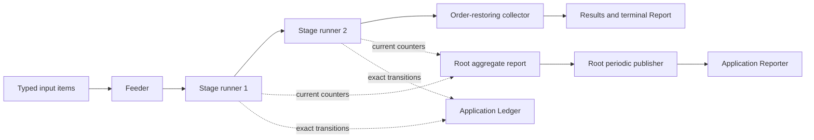
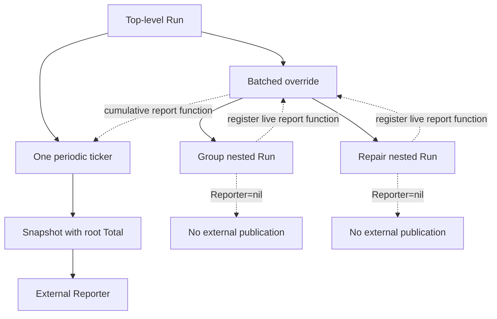

# Flowkit Live Execution Observation

Flowkit PR #9 adds a supported observation boundary for long-running execution. A caller can now receive immutable aggregate snapshots while work is running and exact lifecycle events around the run and its stages. The implementation extends Flowkit's existing reports, ledger, runners, and resource accounting rather than introducing a separate job system.

This report explains why that boundary was needed, how it was integrated across scalar, pipelined, Bulk, and Batched execution, and how review feedback changed the nested-reporting architecture. The central result is precise: one top-level run owns external progress publication, while every nested engine contributes live report state upward without publishing independently.

> [!summary]
> - Flowkit now distinguishes exact custody events from sampled aggregate snapshots.
> - Snapshots are deep-cloned, sequenced, fail-closed, and terminally consistent with the report returned by `Run`.
> - Nested Bulk and Batched execution contributes live counters to one root publisher, preserving callback order and a stable total.
> - Runner validation completes before `run_started`, so the lifecycle journal never claims that invalid work began.

## 1. The problem: terminal reports were not enough

Flowkit already produced a detailed `Report` when `Run` returned. Each named step recorded item counts, cache traffic, provider work, retries, quarantines, skipped items, resource spend, and generic meters. The runner also emitted exact item outcomes to a `Ledger` and logged selected counters every thirty seconds.

Those facilities did not form an application-facing live observation contract. A process supervising a long corpus build could not obtain the current aggregate report without waiting for completion. Parsing log lines would lose fields and couple the application to prose output. `OnResult` was too narrow because it intentionally observed successful values rather than retries, failures, budgets, and lifecycle boundaries.

The missing contract had to satisfy several constraints at once:

- It had to preserve Flowkit's existing execution semantics and input/output ordering.
- It had to work for scalar steps, streaming pipelines, Bulk calls, and Batched group-and-repair execution.
- It had to remain product-neutral: no prompts, documents, embeddings, answers, or other domain payloads belong in Flowkit observation records.
- It had to support durable consumers. If a configured sink failed, the run could not continue spending provider resources while silently losing its custody record.
- It had to impose no observation-state allocation on callers that configured neither a reporter nor a ledger.

The implemented design therefore uses two complementary channels.

| Channel | Data model | Frequency | Primary purpose |
|---|---|---:|---|
| `Ledger` | Exact lifecycle and item events | Every relevant transition | Durable custody, retry and failure diagnosis |
| `Reporter` | Immutable aggregate `Snapshot` | Initial, periodic, terminal | Progress history, graphs, rates, ETA, spend views |

The distinction is structural. A sample may skip a short-lived counter state between intervals. A ledger event records an exact transition. Conversely, reconstructing a complete aggregate progress graph from every item event would force each consumer to reproduce Flowkit's counter semantics. Both forms are necessary.

## 2. The execution model being observed

A Flowkit `Step[I,O]` combines typed work with execution policy. The policy controls concurrency, retry, resource admission, and failure handling. A step may use the standard per-item runner or a custom engine such as Bulk or Batched.

A composed pipeline is flattened into stage specifications. `runStages` builds one runner per stage, connects them with channels, and restores final output order after concurrent processing. Every stage runner already owns locked report counters. This existing `report()` method became the source for live snapshots.



Observation does not modify the data path. Inputs still flow through the same runners, cache decisions, admission gates, retry loops, and collectors. The reporter reads the same counters that produce the terminal report.

## 3. Immutable snapshots

The public aggregate contract is intentionally small:

```go
type Snapshot struct {
    Sequence  uint64    `json:"sequence"`
    StartedAt time.Time `json:"started_at"`
    UpdatedAt time.Time `json:"updated_at"`
    Total     int       `json:"total"`
    Terminal  bool      `json:"terminal"`
    Report    Report    `json:"report"`
}

type Reporter interface {
    Report(context.Context, Snapshot) error
}
```

`Sequence` orders samples within one top-level run. `StartedAt` remains stable, while `UpdatedAt` records sample time. `Total` is the top-level input count, not a nested batch count. `Terminal` distinguishes the final snapshot from periodic observations.

### 3.1 Why deep cloning is required

A Go struct copy does not copy referenced maps. `Report` and `StepReport` contain several map layers:

- the report's step map;
- retry counts by error class;
- spend snapshots by resource name;
- generic usage meters.

A reporter may retain a snapshot after its callback returns. If any map aliases a runner's live state, later execution mutates an allegedly immutable historical sample and creates data races.

The implementation recursively clones every map:

```go
func (report Report) Clone() Report {
    if report.Steps == nil {
        return Report{}
    }
    cloned := Report{Steps: make(map[string]StepReport, len(report.Steps))}
    for name, step := range report.Steps {
        cloned.Steps[name] = step.Clone()
    }
    return cloned
}
```

`StepReport.Clone` then copies retry classes, spend, and meters. Mutation-after-clone tests prove that the retained snapshot does not change.

### 3.2 Initial, periodic, and terminal delivery

A configured reporter receives:

1. an initial empty snapshot after validation and preflight;
2. periodic snapshots when `ReportInterval > 0`;
3. one terminal snapshot containing the same aggregate report returned by `Run`.

A non-positive interval disables only periodic delivery. Initial and terminal snapshots remain part of the contract.

The periodic helper owns a cancellation context. If the reporter returns an error, that context is canceled and active workers stop. The reporter error is returned to the caller with a `progress reporter` prefix. Applications that want best-effort telemetry must implement that policy explicitly by swallowing their own sink errors.

Terminal delivery runs under a bounded context derived with `context.WithoutCancel`. This permits a canceled worker run to record its final state without allowing the sink to block indefinitely. The current bound is five seconds.

## 4. Exact lifecycle events

The pre-existing ledger vocabulary described item outcomes such as `hit`, `stored`, `done`, `retry`, `quarantined`, and `skipped`. PR #9 adds:

```text
run_started
step_started
step_completed
run_completed
run_failed
```

Each event receives a Flowkit-assigned UTC timestamp. Run and step boundary events also carry totals where relevant.

The lifecycle contract is:

```text
validate policies, resources, and runners
run_started
  step_started
    item events: hit / stored / done / retry / quarantined / skipped
  step_completed
run_completed | run_failed
```

Streaming pipelines introduce one important qualification. A downstream `step_started` event means its runner has started and is ready to receive items. It does not mean the first item has already arrived. Multiple stage lifetimes overlap because pipeline stages execute concurrently.

Exactly one top-level terminal run event is emitted. Nested Batched group and repair calls retain their step and item events but do not create false root-run boundaries.

## 5. Publication ownership

The most consequential implementation detail is not the snapshot struct. It is the ownership rule for periodic publication.

> [!important]
> One top-level run owns every call to the external `Reporter`. Nested execution may expose live report state, but it may not publish independently.

This rule was established by PR review. The first implementation shared an `observationState` across nested calls. That shared state serialized sequence allocation and preserved one start time, but it did not serialize the reporter callbacks themselves.

Consider a Batched step processing two original items:

```text
root Batched run: total = 2
  group Run:      total = 1 group
  repair Run:     total = 1 missing item
```

If each nested `Run` starts its own ticker, external snapshots can alternate between totals of `2`, `1`, and `1`. The group snapshot contains only group counters; the repair snapshot contains only repair counters. In a pipeline, the outer ticker may publish concurrently with the nested ticker. Sequence numbers remain unique because allocation is locked, but callback order and report meaning are not coherent.

### 5.1 Live report registration

The corrected design separates publication from report acquisition. An internal callback allows a nested engine to register a function that returns its current report:

```go
type reportSource struct {
    mutex   sync.Mutex
    current func() Report
}

func (source *reportSource) report() Report {
    source.mutex.Lock()
    current := source.current
    source.mutex.Unlock()
    if current == nil {
        return Report{}
    }
    return current()
}
```

`Options.registerReport` is unexported. It does not become part of the public API. It connects execution layers inside the package.

For a standalone custom engine, `runCore` starts the root periodic ticker and supplies a `reportSource` to the override. For a custom engine embedded as a pipeline barrier, the outer pipeline ticker already exists. `overrideStageRunner` registers the nested engine's live report as its own current stage report.

In both cases, the nested `Options.Reporter` is set to `nil`. The nested run can still emit ledger step/item events and can still expose live counters upward, but it cannot call the application's reporter.



### 5.2 Cumulative Batched reports

Batched execution has two sequential components: completed group work and, when required, active repair work. Its report function combines a durable base report with at most one active nested report:

```go
currentReport := func() Report {
    reportMutex.Lock()
    base := report.Clone()
    active := activeReport
    reportMutex.Unlock()
    if active != nil {
        base.merge(active())
    }
    return base
}
```

When a nested phase finishes, `mergeCompleted` clears the active function before merging the final report into the base. The order matters. If the active function remained installed, the same counters would appear once in the completed base and once through the live function, doubling the result.

The resulting sample history has stable semantics:

| Sample point | Root total | Report content |
|---|---:|---|
| Initial | 2 | Empty |
| Group active | 2 | Current group counters |
| Repair active | 2 | Completed group + current repair counters |
| Terminal | 2 | Completed group + completed repair counters |

The regression test blocks the repair step long enough to observe the combined periodic state. It asserts that every snapshot retains total `2`, sequences are contiguous, and the terminal report contains each component exactly once.

## 6. Validation before lifecycle publication

The second PR review issue concerned the meaning of `run_started`. Generic policy and resource-plan validation occurred before the event, but runner-specific validation did not always occur there.

Examples included:

- a plain step with no `Do` function;
- a Bulk step with a non-positive batch size;
- a Batched step without `Group`, `DoAll`, or `Split`.

The initial implementation could emit `run_started` and `step_started`, then fail when runner construction or override execution discovered the invalid configuration. A durable ledger would claim that execution began even though the run was never executable.

PR #9 now validates in three layers before observation starts:

1. Every declared policy and nested policy is validated.
2. Resource plans are registered and monetary preflight is evaluated.
3. Override-specific validation runs, and every stage builder is probed.

Only then does Flowkit create root observation state, emit `run_started`, and publish the initial snapshot.

```text
stages = flatten(step)
validate policies(stages)
ensure resource plans(stages)
for stage in stages:
    validate override-owned configuration
    construct runner as a side-effect-free probe

initialize root observation
emit run_started
publish initial snapshot
execute
```

Bulk and Batched constructors now install private validators for configuration that their generic stage builders cannot inspect. Plain steps are checked by `newTypedRunner` during the builder probe.

A table-driven regression test runs invalid plain, Bulk, and Batched steps with both a ledger and reporter. Every case must return an error with zero ledger events and zero snapshots.

### 6.1 A constraint introduced by builder probing

Stage builders are currently side-effect free, so constructing once for validation and again for execution is safe. This is now an internal invariant. If future stage builders allocate external resources or perform irreversible work, the design should change to validate and retain prepared runners rather than probing and discarding them.

This point deserves explicit review because lifecycle correctness now depends on it.

## 7. Concurrency and failure semantics

The observation API is designed around bounded synchronous responsibility rather than unbounded buffering.

### 7.1 Reporter callbacks

The root ticker calls the reporter serially. It does not launch one goroutine per sample. The next tick cannot overtake a blocked callback. Nested engines no longer call the reporter, so they cannot race the root publisher.

This provides three useful properties:

- Snapshot callbacks arrive in sequence order.
- A slow sink creates backpressure instead of unbounded memory growth.
- A sink error cancels the active execution context.

The reporter still must be fast and bounded. A suitable durable reporter writes a compact snapshot atomically to local storage. Remote network transport should normally be decoupled behind an application-owned durable boundary.

### 7.2 Ledger semantics

Ledger events remain exact and fail-closed. Flowkit timestamps each event, while the durable ledger implementation may assign its own append sequence. Concurrent worker completion does not imply item-index order. Consumers should use event sequence or timestamp for observation order and retain item index as domain identity.

### 7.3 Cancellation and terminal delivery

Worker cancellation and terminal observation have different requirements. Workers should stop promptly. The terminal sink should receive one bounded opportunity to record the final report and terminal lifecycle event.

The implementation therefore joins errors rather than replacing one with another. A provider failure, terminal reporter failure, and terminal ledger failure can all remain visible to the caller.

## 8. Compatibility across execution shapes

The implementation was tested against every execution path that can produce reports.

| Execution shape | Observation behavior |
|---|---|
| Plain scalar step | Root initial/periodic/terminal snapshots; exact step/item lifecycle |
| Streaming pipeline | One root ticker merges locked reports from all stage runners |
| Bulk override | Bulk registers its live report with the enclosing root or pipeline ticker |
| Batched override | Group and repair register live reports upward; nested reporters are disabled |
| Cache-only execution | Hits remain visible; no provider usage is invented |
| Retry/quarantine/skip | Exact events and aggregate counters preserve existing policy semantics |
| No observers | Observation state is not initialized |

The no-observer path matters because Flowkit is a general execution library. Existing users should not pay for snapshot sequencing or clock calls unless they opt into `Ledger` or `Reporter`.

## 9. A concrete reporter

The repository includes `examples/progress-reporter`. A minimal consumer can encode each immutable snapshot directly:

```go
reporter := flow.ReporterFunc(func(ctx context.Context, snapshot flow.Snapshot) error {
    return json.NewEncoder(os.Stdout).Encode(snapshot)
})

results, final, err := flow.Run(ctx, step, items, flow.Options{
    Reporter:       reporter,
    ReportInterval: 250 * time.Millisecond,
})
```

A production durable implementation should preserve the same semantic boundary:

```text
Report(ctx, snapshot):
    encode snapshot to a temporary file
    fsync when required by custody policy
    atomically rename temporary file to latest.json
    optionally append a sampled history record
    return any persistence error
```

The application remains responsible for storage layout, retention, HTTP projection, access control, and domain-specific artifacts. Flowkit supplies execution truth, not a job database or UI protocol.

## 10. What failed during implementation

Two failures materially shaped the result.

The first was a local syntax error while introducing the reporter goroutine. A missing closing brace produced:

```text
flow/observe.go:115:3: expected ';', found '('
flow/observe.go:122:2: expression in go must be function call
```

The block structure was corrected before the runtime phase was committed. This was a mechanical failure, but recording it matters because concurrency helpers are especially sensitive to mismatched `select`, loop, and goroutine boundaries.

The second failure was architectural and was found in PR review. Sharing `observationState` prevented duplicate root lifecycle events and duplicate sequence values, but it did not create one publisher. Nested Batched runs still produced partial snapshots with local denominators and could invoke the external reporter concurrently with an outer pipeline ticker.

The correction changed the model from **shared publication state** to **root publication ownership plus nested report registration**. That distinction is now the primary concurrency invariant of the feature.

A related review finding exposed incomplete validation boundaries. The code had treated policy and resource preflight as “validation,” but override-owned execution configuration remained unchecked until after lifecycle publication. Validation now means that a stage can actually construct its runner and that its custom engine has the functions and parameters required to execute.

## 11. Verification evidence

The implementation was validated repeatedly rather than with a single successful run.

Local evidence includes:

```text
go test ./flow -count=10
ok github.com/go-go-golems/flowkit/flow

go test -race ./...
all packages passed

go vet ./...
no diagnostics

make ci-check
format, golangci-lint, logcopter, tests, generation, and build passed
```

The PR review regression tests are:

- `TestBatchedReporterUsesOneRootPublisherAndStableTotal`
- `TestInvalidRunnersEmitNoLifecycleOrSnapshots`

At the time of this report, PR #9 is open at commit `50138e7`. The two review threads have replies describing commit `89b2107` and are resolved. GitHub lint, dependency review, and secret scanning have passed; remaining workflow jobs were still running when the report was written.

## 12. Files that define the feature

The implementation is concentrated in these paths:

- `/home/manuel/workspaces/2026-08-24/use-optkit/flowkit/flow/report.go` — snapshots, reporter contract, deep cloning, lifecycle events.
- `/home/manuel/workspaces/2026-08-24/use-optkit/flowkit/flow/observe.go` — sequence state, publication, terminal timeout, periodic cancellation.
- `/home/manuel/workspaces/2026-08-24/use-optkit/flowkit/flow/run.go` — validation boundary, root lifecycle, pipeline aggregation, custom-engine report registration.
- `/home/manuel/workspaces/2026-08-24/use-optkit/flowkit/flow/bulk.go` — Bulk live-report registration.
- `/home/manuel/workspaces/2026-08-24/use-optkit/flowkit/flow/batch.go` — cumulative group/repair report aggregation and nested reporter suppression.
- `/home/manuel/workspaces/2026-08-24/use-optkit/flowkit/flow/observe_test.go` — lifecycle, reporter failure, nested ownership, and invalid-runner regression tests.
- `/home/manuel/workspaces/2026-08-24/use-optkit/flowkit/examples/progress-reporter/main.go` — executable consumer example.

The design and chronological implementation record are:

- `/home/manuel/workspaces/2026-08-24/use-optkit/flowkit/ttmp/2026/08/28/FLOWKIT-002--live-execution-observation-seam-for-long-running-flows/design-doc/01-intern-guide-to-live-flow-observation-progress-aggregation-and-safe-event-delivery.md`
- `/home/manuel/workspaces/2026-08-24/use-optkit/flowkit/ttmp/2026/08/28/FLOWKIT-002--live-execution-observation-seam-for-long-running-flows/reference/01-investigation-diary.md`

## 13. Current status and next steps

The implementation and review corrections are complete on PR #9. The remaining project task is publication: merge the PR, assign a release tag, and update consumers such as RAG-TTC from their current released Flowkit requirement.

Near-term review should focus on three points:

1. Confirm that all current and future stage builders remain side-effect free under validation probing.
2. Review the lifetime and locking of unexported live report functions under cancellation.
3. Decide whether the fixed five-second terminal delivery timeout should become configurable after a real durable consumer demonstrates the need.

The public contract should remain narrow. Flowkit should expose execution counters, lifecycle, spend, and generic meters. Scheduling, run directories, HTTP APIs, user permissions, and domain artifacts belong in consuming applications.

## 14. Working rules

- One top-level run owns external progress publication.
- Nested execution contributes reports upward and keeps its external reporter disabled.
- Snapshot data is deeply immutable after publication.
- Reporter and ledger failures are fatal when those custody seams are configured.
- Validation and preflight complete before `run_started`.
- Terminal delivery is attempted after cancellation under a bounded context.
- Generic observation records contain no domain inputs or outputs.
- No-observer execution preserves the original path and avoids observation initialization.

These rules are the compact specification for extending Flowkit with future custom runners. A new runner is complete only when its terminal report, live report, lifecycle events, cancellation behavior, and no-observer behavior satisfy the same invariants.
