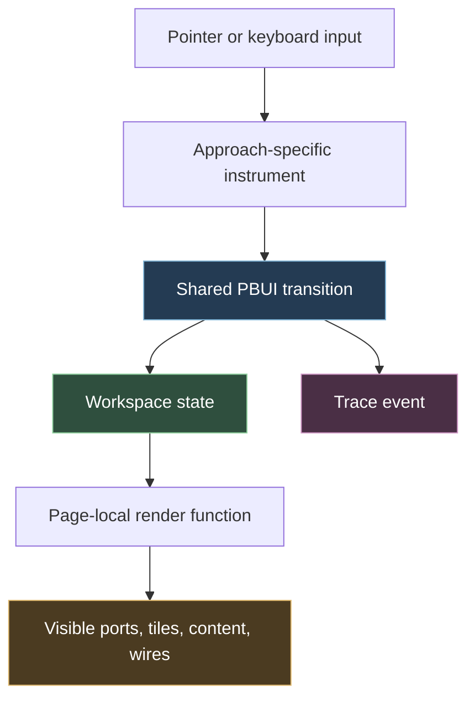
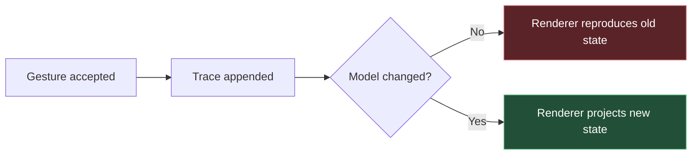

# PBUI Linked Tiles: From Plausible Demos to Verified Interaction Semantics

The PBUI linked-tiles project began with a semantic question: when one tile is connected to another, what relationship has actually been established? The first research report separated directed following, held values, shared identity, derived relations, routing, and placement. A later implementation phase turned those concepts into ten focused browser examples and one combined workspace. The examples looked complete. They displayed ports, wires, menus, trace events, popovers, drop targets, and relation declarations.

A real interaction audit showed that visual completeness had exceeded behavioral completeness. Seven of seventeen acceptance scenarios worked. Ten failed. Several handlers wrote successful trace rows without changing the visible workspace. Spawn did not create a tile. Alias did not produce a shared identity state. Derived did not render the selected relation. Ambient Pin captured a fallback value rather than the value displayed immediately before the click. Three unlink policies produced the same result.

This report explains the audit and repair as a technical system. It describes the binding model, the division between interaction instruments and semantic transitions, the Playwright harness, the browser event-order defects, the shared-core repairs, and the acceptance criteria that now govern the examples. It is written for an engineer who needs to understand the project well enough to change it without restoring trace-only behavior.

> [!summary]
> - The corrected baseline was **7 passing / 10 failing**. The repaired suite passes **17/17** using real pointer and keyboard interaction.
> - The central defect was architectural: a trace event recorded that a handler ran, but the shared model often stored no state from which the page could render the promised result.
> - The repair established one stateful semantic core for Follow, Hold, Alias, Derived, spawn, merge, and unlink, while each page retained responsibility for its specific interaction instrument and DOM projection.
> - Browser interaction is part of the semantics. `mouseleave` before `click`, nested click targets, transparent SVG hit paths, drag modifier lifetimes, and script caching all changed observable behavior.
> - Future examples are accepted only when the browser proves a visible postcondition. A `spawn` trace without an added tile is a failed spawn.

## 1. Project status

The audit is complete. The two repair commits are local to the toy repository:

- `0093676` — `fix(core): make spawn and binding lifecycle behavior real`
- `4b5f9e3` — `fix(approaches): wire every interaction to visible behavior`

The audit ticket `PBUI-LINK-UI-AUDIT` is closed. Its four tasks are complete, `docmgr doctor` passes, and the guide plus investigation diary were uploaded to reMarkable at:

```text
/ai/2026/08/29/PBUI-LINK-UI-AUDIT
PBUI Linking Examples Audit and Repair Guide
```

The implementation lives under:

```text
/home/manuel/Downloads/PBUI-linked-tiles-research-bundle/toy/
├── lib/
│   ├── core.js
│   └── core.css
└── approaches/
    ├── 01-drag-follow.html
    ├── 02-modifiers.html
    ├── 03-popover.html
    ├── 04-drop-zones.html
    ├── 05-pie.html
    ├── 06-palette.html
    ├── 07-hold-longpress.html
    ├── 08-ambient.html
    ├── 09-wire-edit.html
    ├── 10-unlink.html
    ├── combined.html
    └── index.html
```

The toy repository has no Git remote. The repair commits therefore remain local until one is configured.

## 2. What the project is testing

The project is not primarily testing whether a wire can be drawn between two boxes. It is testing whether a small binding algebra can support several direct-manipulation instruments without changing meaning from page to page.

The central terms are:

```text
Ambient(context-key)
Follow(source-port)
Hold(reference, suspended-binding)
Alias(binding-class σ)
Derived(source-binding, relation ρ)
```

These terms answer different questions.

`Ambient` says that a tile reads the current value of a named workspace context without an explicit private edge. `Follow` records directional provenance from a particular source. `Hold` freezes a concrete value while preserving enough provenance to resume. `Alias` states that two local port names denote one shared binding identity. `Derived` applies a named relation such as `order.author` or `order.items`.

Spawn is separate. It is a placement operation that creates another tile and then gives that tile a binding. A right-spawned detail can Follow the current order. A below-spawned detail can Hold the selected order. Treating spawn as a separate operation matters because a trace named `spawn` does not itself establish either placement or binding.

The visual operators preserve those distinctions:

$$
A \rightarrow B \quad \text{Follow}
$$

$$
A \equiv B \quad \text{Alias}
$$

$$
A \xrightarrow{\rho} B \quad \text{Derived}
$$

A single generic “linked” state would erase direction, identity, relation, lifecycle, and update behavior. The examples instead hold the semantic operation constant while varying the interaction used to request it.

## 3. One semantic core, multiple interaction instruments

The architecture divides responsibility along a precise boundary. An approach page owns the browser interaction. The shared core owns the binding transition. The page then projects the resulting state back into visible DOM.



An approach page may implement drag-and-drop, a popover, a pie menu, a searchable palette, long-press, hover-following, or inline wire editing. Those are not separate semantic systems. Each eventually calls one of the shared operations:

```javascript
PBUI.route(state, disposition);
PBUI.pinToggle(state, orderId);
PBUI.merge(state, choice);
PBUI.commitDerived(state, relationId, target);
PBUI.unlink(state, policy);
```

This separation only works if all three stages are present:

```text
input → model transition → visible projection
```

The pre-audit implementation often had only the first stage and a trace append. The handler ran. The event list changed. The user-facing state did not.

> [!important] Trace events are diagnostic evidence
> A trace row proves that a handler reached `bump()`. It does not prove that the model transitioned correctly, that a renderer projected the new state, or that the visible operation succeeded.

## 4. Why the first examples looked more complete than they were

The pages had strong local presentation. The port labels, wire colors, panels, and traces gave each operation a recognizable visual form. That visual form made a missing state transition difficult to notice during manual inspection.

Consider the original spawn path. A popover option called:

```javascript
PB.route(state, "new-right");
render();
```

The original `route()` implementation appended a trace event and returned. It did not add a tile descriptor to state. The page's `render()` therefore had nothing to create. The UI closed the popover and displayed a row labeled `spawn`, which resembled successful completion.

Alias and Derived had the same structure. The Ctrl-drag handler reached `merge()`, and the D-drag handler reached `commitDerived()`. The trace correctly identified `identity` or `derive`. The core did not enter a visible Alias or Derived detail mode. The target retained a Follow or Hold label.

This creates a general failure pattern:



A screenshot of an open menu cannot prove the selected command works. A trace assertion cannot prove the target changed. A static screenshot of a wire cannot prove that a real pointer can reach its target. The audit therefore had to test committed operations, not setup states.

## 5. The real-interaction audit

### 5.1 Acceptance scenarios

The reusable Playwright suite contains seventeen scenarios covering the index, ten isolated pages, and the combined page.

| Scenario | Before | Required visible outcome |
|---|---:|---|
| Index navigation | Pass | All eleven links load with HTTP 200. |
| Drag Follow | Pass | Detail displays the selected order. |
| Shift-drag Hold | Pass | Port displays `HOLD #1037`. |
| Ctrl-drag Alias | Fail | Port must display shared identity `≡ σ`. |
| D-drag Derived | Fail | Port must display a named `ρ` relation. |
| Popover Follow | Pass | Anchored popover commits and dismisses. |
| Popover spawn | Fail | Workspace tile count increases by one. |
| Drop-zone spawn | Fail | Revealed drop target creates a tile. |
| Pie Hold | Pass | Hold state is visible. |
| Pie spawn | Fail | Workspace tile count increases by one. |
| Palette Derived | Fail | Chosen relation stays open long enough to commit and renders its target value. |
| Long-press Hold | Pass | Long press freezes; short click resumes. |
| Ambient Pin | Fail | Pin freezes the order shown immediately before the click. |
| Wire editor Hold | Pass | Applied Hold is visible. |
| Wire editor Derived | Fail | Applied Derived state is visible. |
| Unlink policies | Fail | Copy, history, and reset produce distinct endpoint values. |
| Combined flow | Fail | Ambient, Hold drag, spawn, and Derived composition all succeed in one session. |

The corrected baseline was:

```json
{"total":17,"passed":7,"failed":10}
```

The final result is:

```json
{"total":17,"passed":17,"failed":0}
```

Raw evidence is preserved in this vault under:

```text
Projects/2026/08/29/_assets/pbui-linked-tiles-audit/
├── before/audit-results.json
├── before/*.png
├── after/audit-results.json
└── after/*.png
```

### 5.2 Why synthetic events were rejected

A browser can execute a handler after a script dispatches an event even when a user cannot perform the same operation. Synthetic dispatch bypasses several parts of browser behavior:

- actual hit testing;
- pointer capture and pointer movement;
- native drag lifecycle;
- modifier state across `dragstart`, `dragover`, and `drop`;
- event target selection for nested elements;
- `mouseenter` and `mouseleave` ordering;
- focus, dismissal, and click-away behavior.

The audit uses Playwright interaction primitives instead:

```javascript
await locator.click();
await locator.hover();
await locator.click({ button: "right" });
await locator.click({ delay: 520 });

await page.keyboard.down("Shift");
await page.mouse.move(source.x, source.y);
await page.mouse.down();
await page.mouse.move(target.x, target.y, { steps: 12 });
await page.mouse.up();
await page.keyboard.up("Shift");
```

The assertion is then made against the visible workspace. A spawn test counts direct tile children. A Derived test reads both the binding declaration and rendered content. An unlink test compares endpoint values after each policy.

### 5.3 Test isolation

The audit found two forms of hidden test state.

First, a long-lived browser context reused a cached `lib/core.js` after source edits. HTML updates loaded while the old transition functions remained active. This created false repair failures.

Second, a page reused across native drag scenarios retained enough pointer or modifier state to make Shift-drag intermittent. A focused event trace showed that the product was correct when executed in isolation.

The suite creates a fresh browser context for each run and a fresh page for each scenario:

```javascript
const auditContext = await page.context().browser().newContext();

async function goto(path) {
  if (!page.isClosed()) await page.close();
  page = await auditContext.newPage();
  observePage(page);
  await page.goto(base + path, { waitUntil: "networkidle" });
}
```

Isolation is part of test correctness. It prevents one scenario's document, script cache, pointer state, or focus from becoming an unstated precondition for the next.

## 6. The shared state model after repair

`PBUI.makeState()` in `toy/lib/core.js` constructs the model shared by the pages. The repaired fields relevant to linking are:

```javascript
{
  alpha: "1042",
  gamma: "1051",
  held: "1037",

  detailMode: "ambient",
  suspendedMode: null,
  hoveredOrder: null,

  identityMerged: false,
  preMerge: null,
  defaultAlpha: "1042",
  defaultGamma: "1051",

  derivedRelation: "order.author",

  spawnedTiles: [],
  spawnSeq: 0,

  events: []
}
```

This is a prototype model, not a production graph store. It nevertheless contains the minimum history needed to render and reverse the demonstrated operations.

The important state distinctions are:

- `detailMode` determines the active binding term shown by the target.
- `suspendedMode` lets Hold resume the binding it interrupted.
- `preMerge` preserves private endpoint values for history-based unlink.
- `defaultAlpha` and `defaultGamma` distinguish declared defaults from historical values.
- `derivedRelation` selects both the declaration and renderer.
- `spawnedTiles` records created tile identity, placement, binding mode, and order.

Without these fields, the renderer would have to infer semantic state from DOM or trace text. That would make the trace authoritative and produce the same false-success class the audit was designed to remove.

## 7. Repairing spawn as state plus materialization

Spawn failed in every instrument that offered it: popover, drop-zone, pie, and combined page. The defect belonged in the shared core because all four instruments requested the same placement operation.

The repaired `route()` constructs a descriptor:

```javascript
const tile = {
  id: `spawned-detail-${++state.spawnSeq}`,
  placement: which === "new-right" ? "right" : "below",
  bindingMode: which === "new-right" ? "follow" : "hold",
  orderId: state.alpha,
  source: "alpha"
};

state.spawnedTiles.push(tile);
```

The model records what was created and what it observes. The page then calls `renderSpawnedTiles()` from its normal `render()` path. This removes prior materialized spawned nodes and recreates them from descriptors.

```text
route("new-right")
    ↓
append {id, placement:right, bindingMode:follow, orderId}
    ↓
render()
    ↓
renderSpawnedTiles()
    ↓
<section class="tile spawned right">...</section>
```

This design keeps transition and projection separate while ensuring both use one source of truth. Reset constructs fresh state, so spawned tiles disappear naturally. Re-render does not duplicate them because the DOM is reconstructed from the descriptor list.

![[Projects/2026/08/29/_assets/pbui-linked-tiles-audit/after/spawned-from-popover.png]]

The postcondition is structural:

```javascript
const before = await page.locator("#workspace > section.tile").count();
await page.locator('[data-route="new-right"]').click();
const after = await page.locator("#workspace > section.tile").count();
assert(after === before + 1);
```

The repaired toy makes a deliberate semantic choice. A right-spawned detail follows current alpha. A below-spawned detail holds the selected order. Placement is represented by descriptor metadata and CSS class; the toy does not yet persist arbitrary pixel geometry.

## 8. Making Alias and Derived first-class visible modes

### 8.1 Alias

Before repair, `merge()` synchronized endpoint values but left the detail in a Hold-like mode. The trace said `identity`, while the target label said `HOLD`. This was not a cosmetic mismatch. It erased the difference between shared identity and a frozen private reference.

The repaired merge stores private history and enters Alias:

```javascript
state.preMerge = {
  left: state.alpha,
  right: state.gamma
};

const shared = chooseSharedValue(choice, state);
state.alpha = shared;
state.gamma = shared;
state.identityMerged = true;
state.detailMode = "alias";
```

The renderer can now state the actual binding:

```text
≡ σ · shared #1042
```

An intern changing this path must preserve two invariants:

1. Alias must be visible as Alias, not represented by two coincident values.
2. Pre-merge values must be retained if the history unlink policy remains supported.

Two values being equal does not prove that they share identity. Equality is an observation. Alias is a topology declaration.

### 8.2 Derived

Before repair, `commitDerived()` stored the relation identifier but did not place the generic target in Derived mode. Pages that knew how to display `ρ order.author` never received state telling them to do so.

The repaired call accepts both relation and target:

```javascript
PBUI.commitDerived(state, "order.items", "detail");
```

For a generic detail target, the transition sets:

```javascript
state.derivedRelation = relationId;
state.detailMode = "derived";
```

The declaration and value are then rendered from the same relation. `order.items` displays line items. `order.author` displays author data. `order.status` displays status. This removes a second trace-only failure: declaring one relation while rendering the output of another.

![[Projects/2026/08/29/_assets/pbui-linked-tiles-audit/after/derived-items-renderer.png]]

## 9. Relation types and target-specific palettes

The relation palette exposed a deeper issue than dismissal. It allowed the user to select `order.items` while the page always rendered an author card. A relation declaration is only meaningful when its source, target type, and output renderer agree.

The repaired registry describes both ends:

```javascript
{
  id: "order.author",
  sourceType: "order",
  targetType: "author"
}

{
  id: "order.items",
  sourceType: "order",
  targetType: "items"
}
```

The isolated palette page is a generic Derived Detail and can render every registered target type. The combined page has an author-specific target and filters candidates to `targetType === "author"`.

This gives two valid palette contracts:

| Target | Candidate policy | Renderer policy |
|---|---|---|
| Generic Derived Detail | Any reachable registered relation | Dispatch by `targetType` or relation ID. |
| Author input port | Only relations producing `author` | Render an author presentation. |

A future relation should not be added as a label alone. It needs:

- a stable relation identifier;
- a source type;
- a target type;
- cardinality if more than one output is possible;
- an output renderer or target application contract;
- explicit failure behavior for missing or ambiguous results.

## 10. Browser event ordering as semantic behavior

### 10.1 Ambient Pin

The Ambient page followed the row under the pointer. The detail correctly displayed order `#1037`. The Pin control lived outside the table. Moving the pointer from the row to Pin fired `mouseleave`, cleared `hoveredOrder`, and rendered fallback order `#1042`. Only then did the click handler freeze the value.

The user saw `#1037` and obtained `HOLD #1042`.

![[Projects/2026/08/29/_assets/pbui-linked-tiles-audit/before/08-ambient-pin.png]]

The fix introduces `lastAmbientOrder`. Entering a row updates both the active hover and the retained attended value. Leaving clears only the active hover indicator. Pin freezes the retained value.

```text
mouseenter #1037
    hoveredOrder = #1037
    lastAmbientOrder = #1037

mouseleave table
    hoveredOrder = null
    lastAmbientOrder = #1037

click Pin
    Hold(lastAmbientOrder)
```

![[Projects/2026/08/29/_assets/pbui-linked-tiles-audit/after/combined-ambient-hold.png]]

This is not an event workaround detached from semantics. Ambient attention needs a precise rule for the transition from transient attention to durable Hold. The rule is: **Pin freezes the last value presented as attended**, even if the pointer must leave the source presentation to reach the control.

### 10.2 Palette click-away

The relation palette originally tested click-away with object identity:

```javascript
if (event.target !== authorIn) closePalette();
```

The port contains nested text. Clicking the text sets `event.target` to a child `<span>` or `<b>`, not the button. The port handler opened the palette; the event bubbled to `document`; the document handler immediately closed it.

The correct boundary is containment:

```javascript
authorIn.addEventListener("click", event => {
  event.stopPropagation();
  openPalette();
});

document.addEventListener("click", event => {
  if (!palette.contains(event.target) && !authorIn.contains(event.target)) {
    closePalette();
  }
});
```

This class of bug is invisible to a synthetic call such as `authorIn.click()` followed by a direct state assertion if the harness does not wait for bubbling and visible focus. Real interaction exposed it immediately.

### 10.3 Transparent wire hit paths

Wire editing needs a forgiving hit area. The combined page drew a transparent SVG path with a wide stroke over the visible wire. That path made right-click practical, but it also intercepted pointer-up when a user dragged onto the nearby target port.

The repair disables the hit path only during drag:

```css
.workspace.drag-active .wire-hit {
  pointer-events: none;
}
```

At rest, the wide path remains available for right-click and long-press. During drag, the destination port receives the pointer. Hit testing is therefore mode-dependent, matching the active interaction.

## 11. Unlink is a policy, not an edge deletion

Shared identity destroys the distinction between two current endpoint values. When the identity class is split, the system must decide how to initialize the new independent cells.

The toy demonstrates three policies:

```text
private history before merge: left=#1037, right=#1057
declared defaults:            left=#1042, right=#1051
merge-left shared value:      #1037
```

After unlink:

| Policy | Left | Right | Meaning |
|---|---:|---:|---|
| Copy shared value | `#1037` | `#1037` | Both new cells begin with the class's final value. |
| Restore private history | `#1037` | `#1057` | Each endpoint recovers its pre-merge value. |
| Reset to defaults | `#1042` | `#1051` | Each endpoint uses its declared initialization. |

Before repair, all buttons produced `#1042/#1051`. The labels described policy, but no policy was implemented.

The repaired transition uses `preMerge`, current shared value, and defaults as separate inputs:

```javascript
function unlink(state, policy) {
  if (policy === "copy") {
    state.gamma = state.alpha;
  } else if (policy === "history") {
    state.alpha = state.preMerge.left;
    state.gamma = state.preMerge.right;
  } else if (policy === "reset") {
    state.alpha = state.defaultAlpha;
    state.gamma = state.defaultGamma;
  }

  state.identityMerged = false;
  state.detailMode = "ambient";
}
```

![[Projects/2026/08/29/_assets/pbui-linked-tiles-audit/after/unlink-history-result.png]]

The acceptance scenario deliberately uses history values different from defaults. Otherwise history and reset would produce the same visible output, and the test could not distinguish a correct implementation from a mislabeled one.

## 12. The combined page as a composition test

An isolated page proves that one instrument can request one operation. The combined page proves that several interaction layers can coexist without invalidating each other's state or hit regions.

The final combined scenario executes this sequence in one browser session:

```text
1. Hover order #1037.
2. Pin the Ambient detail.
3. Resume Ambient.
4. Shift-drag alpha to the detail target.
5. Spawn a tile through the right drop-zone.
6. Right-click the author wire.
7. Choose Derive.
8. Commit order.author from the palette.
```

The visible evidence is:

```json
{
  "ambientHeld": "HOLD #1037",
  "dragHeld": "HOLD #1042",
  "tiles": "4 -> 5",
  "authorBinding": "rho order.author"
}
```

This scenario is intentionally cross-cutting. It verifies that:

- retained Ambient attention survives movement to Pin;
- Hold preserves a suspended source;
- native drag modifiers reach the semantic dispatcher;
- drop-zone visibility and wire hit testing cooperate;
- spawned tile state coexists with existing render cycles;
- the author palette enforces target compatibility;
- a later operation does not erase the result of an earlier one.

A combined page should not replace isolated examples. When it fails, the isolated pages identify whether the defect is semantic or compositional. Both levels are required.

## 13. The reusable Playwright harness

The audit scripts live in the ticket's `scripts/` directory:

```text
scripts/01-audit-approaches.js
scripts/02-audit-after-fixes.js
scripts/03-capture-repaired-states.js
```

The first two contain the complete scenario matrix with different artifact destinations. The third captures important repaired states for documentation.

The scripts run through pi's `playwright_browser_run_code_unsafe`. The gateway supplies the `page` object. Its VM does not expose normal Node globals. During harness development, the following errors were encountered:

```text
ReferenceError: require is not defined
TypeError [ERR_VM_DYNAMIC_IMPORT_CALLBACK_MISSING]: A dynamic import callback was not specified.
ReferenceError: process is not defined
```

The reusable scripts therefore have this shape:

```javascript
async (page) => {
  const results = [];
  const auditContext = await page.context().browser().newContext();

  // Interact through Playwright.
  // Write images with page.screenshot().
  // Return structured JSON to the caller.

  return {
    total: results.length,
    passed: results.filter(x => x.ok).length,
    failed: results.filter(x => !x.ok).length,
    results
  };
}
```

Two additional harness corrections matter:

- The gateway VM did not provide the global `URL` constructor used by an early path helper.
- Playwright bounding boxes use `{x, y, width, height}`, not `{left, top, ...}`.

These were harness defects, not product defects. They were corrected before the 7/17 baseline was accepted.

### Dynamic drop-zone testing

The drop-zone does not exist as a visible target before drag begins. `locator.dragTo()` waits for a visible destination before initiating drag, so it cannot drive this interaction correctly.

The suite uses an explicit pointer sequence:

```text
read source bounding box
move to source center
mouse down
move enough to trigger drag state
wait until workspace has .drag-active
read newly visible drop-zone bounding box
move to zone center in steps
mouse up
assert tile count increased
```

This test structure follows the actual UI state machine instead of forcing the product to keep an inactive target visible for test convenience.

## 14. How to add or change an interaction safely

An interaction change should proceed in a fixed order.

### Step 1: Define the semantic operation

Write the state transition before choosing the gesture. Specify:

- source contract;
- target contract;
- binding term or placement disposition;
- values and history that must be retained;
- cancellation behavior;
- visible result;
- inverse or unlink behavior.

For a new operation named `Mirror`, this is not enough:

```text
click Mirror → trace "mirror"
```

The definition must say what state changes and how the target differs from Follow, Alias, or Derived.

### Step 2: Implement the shared transition

The transition should be callable without DOM access. It should mutate or return a model state that fully determines the promised result.

```text
transition(state, input):
    validate source and target contracts
    preserve required history
    change binding term
    record operation-specific data
    append trace from the same execution path
```

Do not use trace text as backing state. Do not make each approach page reimplement semantics.

### Step 3: Project all visible facets

The renderer must update every representation of the term:

- port label;
- port mode class;
- detail content;
- wire style and label;
- tile count or placement;
- action affordances such as Resume or Unlink;
- trace.

If only the trace changes, the operation is incomplete. If only the wire changes, the content can contradict topology.

### Step 4: Bind the interaction instrument

Implement the gesture on one focused page. Use browser-native interaction where appropriate. Make dismissal explicit. Keep `render()` free of side effects such as reopening menus.

### Step 5: Write the real-interaction scenario

The test must perform the gesture and assert a visible postcondition. It should fail if the operation is reduced to a trace append.

```javascript
await performGesture();
assert(await binding.textContent() === expectedBinding);
assert((await content.textContent()).includes(expectedValue));
```

### Step 6: Add the combined composition

After the isolated page passes, add the operation to the combined page and test it in sequence with existing instruments. This finds pointer interception, stale state, and render-cycle conflicts.

## 15. Design decisions preserved by the repair

### Visible postconditions define correctness

The project accepts a behavior when the browser displays the promised result. State and trace inspection can supplement that result, but cannot replace it. This decision is specific to interaction prototypes: their product is observable behavior.

### Spawn descriptors belong in shared state

Four instruments can spawn. Directly appending DOM from each handler would duplicate semantics and make reset inconsistent. A descriptor plus common renderer is sufficient for the current toy without introducing a full window-manager subsystem.

### Relation declarations and output renderers must agree

A Derived port declaring `order.items` cannot render an author because both were reached from `order`. Compatibility is defined at the relation target, not only at the source.

### Fresh pages isolate native interaction scenarios

Native drag, focus, pointer, and script cache state are not useful shared fixtures. Each scenario begins with a clean page. This makes the suite slower than one-document unit tests and substantially more trustworthy.

### Interaction hit areas are mode-dependent

A wide wire hit path improves wire editing while idle and blocks a port while dragging. The correct behavior is not one permanent z-order; it is explicit pointer participation per interaction mode.

## 16. Current limitations

The repaired examples now demonstrate their declared behavior, but they remain a research toy.

**Spawned tiles are not full graph participants.** They display correct Follow or Hold state, but their ports cannot yet become independent sources or destinations. A production implementation would assign stable port IDs and include them in route resolution and wire geometry.

**Placement is semantic rather than persistent.** Right and below are represented by descriptor and CSS. The toy does not store split-tree topology, pixel coordinates, or workspace persistence.

**Relations are static.** The registry and renderer dispatch are handwritten. A production PBUI should obtain relation contracts from presentation or action declarations and report unsupported target renderers explicitly.

**Touch is not implemented.** Native HTML5 drag-and-drop is not a complete touch interaction. The Pointer surface remains the intended fallback, but the examples need Pointer Events and touch-specific acceptance scenarios before making a mobile claim.

**The repository has no remote.** The repaired commit history exists only in the local toy repository.

These limitations do not invalidate the audit result. The suite accepts the behaviors the pages advertise. It does not claim that the toy is a complete workspace runtime.

## 17. Working rules

The following rules should remain with the project:

- A trace event is not a user-visible postcondition.
- A spawned operation must add a visible tile DOM element.
- Alias must be represented as shared identity, not inferred from equal values.
- Derived must name a relation and render a value compatible with its target type.
- Hold must preserve the source it can resume.
- Ambient Pin freezes the last value presented as attended.
- Unlink must declare how new independent cells are initialized.
- Wide invisible hit areas must not intercept other active instruments.
- Focused examples and combined composition tests serve different purposes; retain both.
- Test native browser interactions with native pointer and keyboard actions.
- Use a fresh page per scenario and a fresh context after shared-script edits.
- Preserve before-fix evidence. It documents why each acceptance condition exists.

## 18. Files to read first

An engineer entering the project should read these files in order:

1. `toy/lib/core.js` — state, transitions, relation renderers, and spawn materialization.
2. `toy/approaches/01-drag-follow.html` — the smallest complete interaction-to-transition-to-render path.
3. `toy/approaches/02-modifiers.html` — one gesture dispatching Follow, Hold, Alias, and Derived.
4. `toy/approaches/06-palette.html` — relation search, containment, and target-specific rendering.
5. `toy/approaches/08-ambient.html` — transient attention and durable pin semantics.
6. `toy/approaches/10-unlink.html` — identity lifecycle and initialization policies.
7. `toy/approaches/combined.html` — composition, dynamic drop-zones, and wire hit testing.
8. `PBUI-LINK-UI-AUDIT/.../scripts/02-audit-after-fixes.js` — executable acceptance contract.
9. `PBUI-LINK-UI-AUDIT/.../design-doc/01-interaction-examples-end-to-end-audit-and-repair-guide.md` — detailed audit evidence and API reference.

## 19. Conclusion

The audit changed the status of the linked-tiles examples from visually persuasive demonstrations to behaviorally verified prototypes. The significant change was not the number of event handlers or CSS rules. It was the restoration of a complete path from user input to semantic state to visible projection.

The repaired core now stores enough information to make its claims observable. Spawn has tile descriptors and DOM materialization. Alias and Derived are binding modes. Relations select compatible renderers. Hold retains provenance. Identity merge retains private history. Unlink policies produce distinct states. The pages then implement several instruments over those same transitions.

The Playwright suite is the executable boundary of the project. Its 17 scenarios prove that the browser can perform the gestures and that the workspace reaches the promised visible states. Future work should extend that boundary rather than returning to trace-only assertions.

## Related notes

- [[PROJECT REPORT - PBUI Linked Tiles - Interaction Models, Formal Semantics, and an Architecture for Routing, Binding, and Coordination]] — the foundational research report defining routing, binding, identity, derived coordination, lifecycle, and placement.
- [[PROJECT REPORT - PBUI Reading Pack - Retrieving Paywalled and Cloudflare-Protected Papers]] — the evidence-retrieval report and open-access reading pack supporting the original design research.
