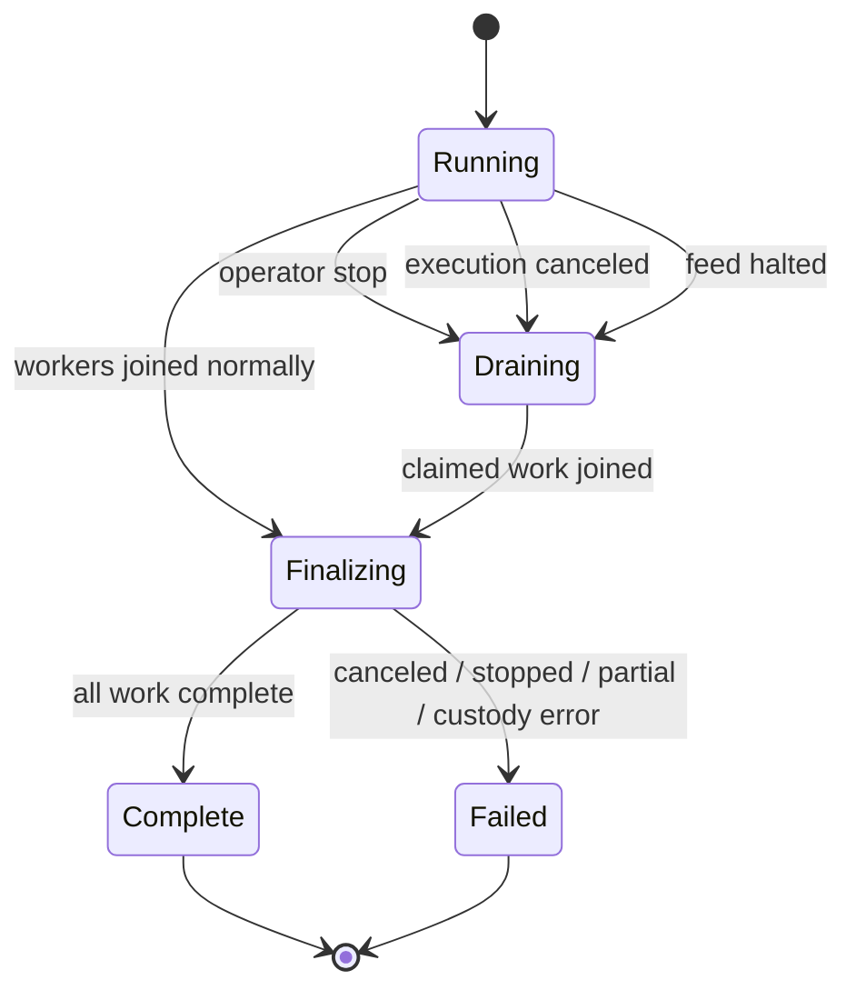

# RAG-TTC PR #8: Explicit Context at Authorization, Transport, and Custody Boundaries

RAG-TTC pull request #8 assembles a large workbench system: authorized proposal commands, persistent PBUI documents, an agent seat with a smaller grant set than the human seat, live benchmark execution, unit-level artifacts, and a React interface that reads all of those surfaces. The second automated review round found three P1 defects after the first review findings had been addressed. Each defect occurs in a different subsystem, but they share one architectural cause: a value that establishes permission or correctness is created at one boundary and discarded before the effect that depends on it.

The three lost values are the authenticated principal, the bearer credential, and the uncanceled persistence context. Losing the principal turns authorization into authentication. Losing the credential turns a protected synchronization protocol into anonymous HTTP. Losing the persistence context turns a durable finalization phase back into cancellable execution. The implementation already contains the right concepts—action grants, a stored workbench token, and `context.WithoutCancel`—but the concepts do not reach the final I/O calls.

This report explains the three findings in detail, derives a common design rule, and proposes a narrow implementation program. The goal is not to introduce a new framework. The goal is to encode the contracts that the project documentation already states so that future code cannot silently omit the context required by a sensitive read, an authenticated request, or a terminal custody write.

> [!summary]
> - The work API authenticates a token but reduces the result to a boolean. Because the authenticated principal is discarded, the agent token can read restricted answer and judge artifacts despite lacking `artifact.read.restricted`.
> - The document host now requires bearer authentication, but the bespoke browser synchronization client sends no credentials. Native `EventSource` cannot attach an `Authorization` header, and the current local-only fallback never retries when a token is entered later.
> - The benchmark runner creates an uncanceled persistence context after its workers stop, then uses the canceled execution context for result feeds, summaries, distributions, and some terminal recorder operations. Cancellation can therefore erase the projections needed to account for paid work.
> - All three defects are instances of one rule: if an effect requires authority, credentials, or custody guarantees, that context must remain an explicit value until the exact effect boundary that consumes it.

## 1. Scope and current state

The pull request is open at [wesen/rag-ttc#8](https://github.com/wesen/rag-ttc/pull/8). At reviewed head `c0361a0c0`, it contains approximately 42,868 added lines across 300 files. That size matters because the workbench is not one application layer. It is a composition of several independently designed systems:

- Optkit candidate compilation and sealing;
- multi-principal bearer authentication;
- PBUI presentation and verb routing;
- workbench document persistence and synchronization;
- durable benchmark execution and progress recording;
- bounded work projections;
- explicit-open restricted artifact reads;
- agent/human co-authoring and approval.

The first review round found four concrete defects: unauthenticated document routes, post-hoc answer-call accounting, missing bundle identity on comparison hits, and in-memory document advancement before persistence. Those were addressed and then hardened in commits `88bc8000a` and `c0361a0c0`. The hardening pass moved answer-call admission to the actual provider boundary, made document writes atomic, preserved lane identity through trail navigation, and wrapped every document route under the bearer authenticator.

The second Codex review completed against `c0361a0c0` and raised three new P1 findings:

1. **Enforce restricted-artifact authorization** in `pkg/ttc/workapi/http.go`.
2. **Send bearer credentials with document sync** in `apps/workbench/web/src/sync.ts`.
3. **Persist cancellation results with the uncanceled context** in `internal/benchmark/groundedqa/service.go`.

No implementation for these findings had been started when this report was written. The repository working tree contained only the pre-existing untracked `tmp/` directory.

## 2. The architectural paths involved

The findings touch three execution paths. Reading them side by side reveals the common structure.

```mermaid
flowchart TD
    subgraph RestrictedRead[Restricted artifact read]
        T1[Bearer token] --> A1[Authenticator]
        A1 --> P1[Principal]
        P1 --> Z1[Authorizer action/resource check]
        Z1 --> R1[Restricted artifact projector]
        R1 --> B1[Answer or judge body]
    end

    subgraph DocumentSync[Workbench document synchronization]
        T2[Stored workbench token] --> C2[Credential source]
        C2 --> F2[Authenticated fetch]
        C2 --> S2[Authenticated SSE fetch]
        F2 --> H2[Document host]
        S2 --> H2
    end

    subgraph BenchmarkFinalization[Benchmark finalization]
        X3[Cancellable execution context] --> W3[Answer and judge workers]
        W3 --> C3[Workers joined]
        C3 --> P3[Uncanceled persistence context]
        P3 --> O3[Ordered result feeds]
        P3 --> M3[Summary and distributions]
        P3 --> T3[Terminal recorder transition]
    end

    style P1 fill:#805bd7,color:#fff
    style C2 fill:#805bd7,color:#fff
    style P3 fill:#805bd7,color:#fff
    style B1 fill:#ef4038,color:#fff
    style H2 fill:#f2ad00
    style T3 fill:#2db878
```



The intended paths have the same form:

```text
establish required context
  -> retain it across intermediate layers
  -> validate it at the point of effect
  -> perform the effect
```

The current defects each remove the middle term:

```text
authentication -> principal discarded -> sensitive projection
stored token   -> token not threaded  -> anonymous network request
persist ctx    -> ctx replaced        -> cancellable custody write
```

This is not a naming problem. It changes the set of operations the system permits and the set of durable facts the system can guarantee.

## 3. The central design rule: context must reach the effect boundary

A useful abstraction is to model an effect as a function whose result depends on both ordinary input and an explicit context value:

$$
E : I \times C \rightarrow R
$$

where:

- $I$ is the domain input;
- $C$ is the context required to perform the effect correctly;
- $R$ is the result, including an error when the context does not permit the effect.

For the three findings:

| Effect | Domain input $I$ | Required context $C$ |
| --- | --- | --- |
| Read a benchmark artifact | job, unit, artifact kind | principal plus authorization policy |
| Synchronize a workbench document | document ID, revision, body | current bearer credential |
| Publish terminal benchmark custody | completed records and run state | uncanceled persistence context |

If code transforms $C$ into a weaker value before $E$ executes, it cannot enforce the original contract. A boolean `authenticated=true` cannot distinguish an agent from a human. A URL cannot reconstruct a bearer token that was never supplied. A canceled `context.Context` cannot express “persist this result even though execution stopped.”

The corresponding implementation rule is direct:

> Functions that perform protected or durable effects must receive the context required by those effects through their signatures or required dependencies.

This rule has several concrete consequences:

- An authentication helper should return a `Principal`, not only `bool`.
- A restricted projector should be unreachable unless authorization has succeeded for its action and resource.
- A protected transport should require a credential source rather than consulting optional ambient state inconsistently.
- A finalization routine should accept a persistence context and should not also receive the execution context for its writes.

The project already uses this pattern successfully in other places. `experimentworkbench.WorkbenchService` receives an `Authorizer`. RTK Query APIs use `prepareHeaders` to obtain the current token at request time. Pipeline artifact writes use `context.WithoutCancel` after provider work has already been paid for. The new work is to make those patterns complete at the three uncovered boundaries.

## 4. Finding one: authentication is not restricted-artifact authorization

### 4.1 The policy that already exists

The action vocabulary is defined in `pkg/ttc/experimentworkbench/workbench_contracts.go`:

```go
const (
    ActionCatalogRead             Action = "catalog.read"
    ActionProposalCompile         Action = "proposal.compile"
    ActionPreviewRun              Action = "preview.run"
    ActionProposalSeal            Action = "proposal.seal"
    ActionArtifactReadRestricted  Action = "artifact.read.restricted"
    ActionArtifactWriteRestricted Action = "artifact.write.restricted"
)
```

The serve command defines two grant sets in `cmd/rag-ttc/cmds/experiments/optkitrag/principals.go`:

```go
func humanActions() map[experimentworkbench.Action]struct{} {
    return map[experimentworkbench.Action]struct{}{
        experimentworkbench.ActionCatalogRead:             {},
        experimentworkbench.ActionProposalCompile:         {},
        experimentworkbench.ActionPreviewRun:              {},
        experimentworkbench.ActionProposalSeal:            {},
        experimentworkbench.ActionArtifactReadRestricted:  {},
        experimentworkbench.ActionArtifactWriteRestricted: {},
    }
}

func agentActions() map[experimentworkbench.Action]struct{} {
    return map[experimentworkbench.Action]struct{}{
        experimentworkbench.ActionCatalogRead:     {},
        experimentworkbench.ActionProposalCompile: {},
        experimentworkbench.ActionPreviewRun:      {},
    }
}
```

The relationship is a strict subset:

$$
G_{agent} \subset G_{human}
$$

In particular:

$$
artifact.read.restricted \notin G_{agent}
$$

This is not an inferred policy. The OPTKIT-024 design states it explicitly: restricted chunk contents and prompts reach the agent only under `artifact.read.restricted`, and denial must produce a metadata-only fallback. The agent-seat diary records that restricted artifact reads were deliberately withheld in v1.

### 4.2 The endpoint that exposes restricted bodies

`RAG-TTC-QA-ARTIFACTS-001` added:

```text
GET /api/rag/v1/work/{job}/units/{unit}/artifacts/{kind}
```

for:

```text
sealed-answer
judge-outcome
judge-report
```

The endpoint returns raw producer-owned JSON in `BenchmarkUnitArtifactView.Body`. The bodies include:

- the customer question;
- generated answer prose;
- citations and evidence prose;
- extracted claims;
- per-claim reasons;
- judge dimensions and report content.

The bounded unit projection is intentionally safe: `BenchmarkUnitView` contains lifecycle state, counts, construct values, failure classifications, and artifact references. The raw prose appears only through `BenchmarkUnitArtifact`.

The design doc calls this a restricted route. The implementation currently protects it with the same authentication helper as every work route:

```go
func (server Server) unitArtifact(w http.ResponseWriter, request *http.Request) {
    if !server.authenticate(w, request) {
        return
    }
    view, err := server.Projector.BenchmarkUnitArtifact(...)
    // ...
}
```

The helper discards the principal:

```go
func (server Server) authenticate(w http.ResponseWriter, request *http.Request) bool {
    if _, err := server.Authenticator.Authenticate(request); err != nil {
        // 401
        return false
    }
    return true
}
```

Once authentication returns `true`, a human token and an agent token are indistinguishable. The projector receives no principal and no action. The authorizer never runs.

### 4.3 Why route-wide authentication is insufficient

Authentication answers:

```text
Which principal presented this credential?
```

Authorization answers:

```text
May this principal perform this action on this resource?
```

The required decision is:

$$
allow(p, a, r)
$$

where:

- $p$ is `Principal`;
- $a$ is `ActionArtifactReadRestricted`;
- $r$ identifies the benchmark artifact resource.

The security invariant is:

$$
\neg allow(p, artifact.read.restricted, r)
\Rightarrow
restrictedBody(p,r) = unavailable
$$

The current implementation instead enforces only:

$$
authenticated(p) \Rightarrow restrictedBody(p,r)
$$

That grants the agent a capability explicitly absent from its action set.

### 4.4 Recommended server design

`workapi.Server` already imports `experimentworkbench`, so it can use the established interface without introducing a new authorization abstraction:

```go
type Server struct {
    Projector     Projector
    Authenticator Authenticator
    Authorizer    experimentworkbench.Authorizer
}
```

`Handler` should reject construction unless both dependencies exist. A fail-open default is inappropriate because the server exposes a route whose sensitivity is part of its contract.

Authentication should retain the principal:

```go
func (server Server) authenticate(
    w http.ResponseWriter,
    request *http.Request,
) (experimentworkbench.Principal, bool) {
    principal, err := server.Authenticator.Authenticate(request)
    if err != nil {
        writeUnauthorized(w)
        return experimentworkbench.Principal{}, false
    }
    return principal, true
}
```

The restricted handler should then authorize before projection:

```go
principal, ok := server.authenticate(w, request)
if !ok {
    return
}

resource := experimentworkbench.Resource{
    Kind: "benchmark-unit-artifact",
    ID: jobID + "/" + unitID + "/" + kind,
}
if err := server.Authorizer.Check(
    request.Context(),
    principal,
    experimentworkbench.ActionArtifactReadRestricted,
    resource,
); err != nil {
    writeAuthorizationError(w, err)
    return
}

view, err := server.Projector.BenchmarkUnitArtifact(jobID, unitID, kind)
```

The projector should remain principal-free. Its responsibility is safe path resolution from journal references, typed artifact decoding, and bounded reads. Policy belongs at the HTTP/application boundary before the projector performs the restricted read.

### 4.5 Error semantics

The distinction should remain visible on the wire:

| Condition | Status | Code |
| --- | ---: | --- |
| Missing or invalid bearer credential | 401 | `unauthenticated` |
| Valid principal without restricted-read grant | 403 | `forbidden` |
| Unknown unit or unreferenced artifact | 404 | existing typed work error |
| Unreadable or corrupt durable artifact | 500 | existing typed work error |

Returning 404 for authorization denial would conceal resource existence but would also diverge from the command API’s established `forbidden` semantics. The existing application policy uses explicit 403 responses, so consistency favors 403 here.

### 4.6 Test matrix

The minimum regression matrix is:

| Credential | Grant | Expected artifact route result |
| --- | --- | ---: |
| none | none | 401 |
| unknown token | none | 401 |
| agent token | compile + preview | 403 |
| human token | restricted read | 200 |

Two additional checks are valuable:

- The bounded unit metadata route remains available to both authenticated principals unless a separate policy says otherwise.
- The projector is not invoked on authorization failure. A spy projector or an impossible artifact fixture can prove the check occurs before the read.

## 5. Finding two: document synchronization must be an authenticated protocol

### 5.1 How the document host changed

The first review correctly found that the document host exposed layouts, drafts, watchlists, conversation pointers, and workbench state without authentication. The fix mounted the entire prefix behind `multiBearerAuthenticator`:

```text
/api/rag/workbench-docs/v1/
```

That server-side change was correct. It also changed the frontend transport contract. Every document operation now requires a bearer credential:

- startup GET;
- create POST;
- snapshot PUT;
- conflict refresh GET;
- SSE stream GET.

The current client in `apps/workbench/web/src/sync.ts` supplies none.

### 5.2 The anonymous calls

Startup and refresh use bare fetch:

```ts
const response = await fetch(`${HOST}/workbenches/${encodeURIComponent(id)}`);
```

Snapshot updates set content and revision headers but no authorization:

```ts
const response = await fetch(`${HOST}/workbenches/${encodeURIComponent(id)}`, {
  method: "PUT",
  headers: {
    "Content-Type": "application/json",
    "X-Workbench-Revision": String(revision),
  },
  body: snapshotBody(),
});
```

Creation also omits the token:

```ts
await fetch(`${HOST}/workbenches`, {
  method: "POST",
  headers: { "Content-Type": "application/json" },
  body: snapshotBody(),
});
```

Streaming uses native `EventSource`:

```ts
stream = new EventSource(`${HOST}/workbenches/${encodeURIComponent(id)}/stream`);
```

The browser `EventSource` API does not permit arbitrary request headers. It therefore cannot carry `Authorization: Bearer ...` under the current bearer-token design.

### 5.3 Why the failure persists after the token is entered

The app already stores the workbench token in Redux and local storage. RTK Query clients use the correct pattern:

```ts
prepareHeaders: (headers, { getState }) => {
  const token = (getState() as { auth: { token: string | null } }).auth.token;
  if (token) headers.set("Authorization", `Bearer ${token}`);
  return headers;
}
```

Document sync is a separate transport and does not use that path. On startup, its unauthenticated GET receives 401. The generic fallback branch changes state to `local`:

```ts
setState("local");
return;
```

Later mutations cannot recover:

```ts
push() {
  if (stopped || state === "local") return;
  // ...
}
```

Entering a token changes Redux and local storage, but the sync object has no credential input, no token subscription, and no restart transition. The badge remains local and layouts or drafts never reach the server.

The resulting state machine is incomplete:

```text
starting --401--> local
local --token entered--> local
```

The required transition is:

```text
local/unauthenticated --token entered--> starting --> synced
```

### 5.4 Why adding headers to individual calls is not enough

A narrow patch could read local storage and add a header to the four `fetch` calls. That would leave three correctness gaps:

1. The SSE stream would still be anonymous because native `EventSource` cannot carry the header.
2. Tokens that exist only in the current Redux session would be invisible when local storage is unavailable.
3. A sync instance that already entered `local` state would not restart after a token change.

The transport needs a credential lifecycle, not copied header literals.

### 5.5 Recommended credential source

The token currently has two roles:

- Redux state drives UI capability and RTK Query headers.
- Local storage provides persistence across reloads.

A small credential module can become the shared source beneath both users:

```ts
export interface CredentialSource {
  getToken(): string | null;
  subscribe(listener: () => void): () => void;
}
```

The auth slice can call the module when `setToken` runs. Document sync receives the source explicitly:

```ts
startDocumentSync(workbench, id, credentials)
```

Every protected request uses one helper:

```ts
async function authenticatedFetch(
  input: RequestInfo | URL,
  init: RequestInit = {},
): Promise<Response> {
  const token = credentials.getToken();
  const headers = new Headers(init.headers);
  if (token) headers.set("Authorization", `Bearer ${token}`);
  return fetch(input, { ...init, headers });
}
```

The helper should read the token at request time. Capturing the initial token would make refresh and reconnect use stale credentials.

### 5.6 Authenticated SSE over fetch

Bearer tokens should not be added to the stream URL. Query parameters appear in browser history, proxy logs, diagnostics, and referrer-sensitive systems. Cookies would require a broader authentication redesign. Under the current contract, the correct streaming client is `fetch` with a readable response body:

```ts
const controller = new AbortController();
const response = await authenticatedFetch(streamURL, {
  headers: { Accept: "text/event-stream" },
  signal: controller.signal,
});

if (!response.ok || !response.body) {
  // classify authentication, absence, or transient failure
}

const reader = response.body
  .pipeThrough(new TextDecoderStream())
  .getReader();
```

The parser only needs the subset emitted by the Go host:

```text
event: revision
data: 6

```

A compact parser can accumulate text until a blank line, read `event` and `data`, and dispatch revision bumps. It should:

- abort on `stop()`;
- abort and restart when the credential changes;
- reconnect after transient stream termination with a bounded delay;
- avoid concurrent streams for one sync object;
- call authenticated `refresh()` only when the remote revision exceeds the local revision;
- preserve the existing `inflight || dirty` race rule.

### 5.7 Credential-aware sync states

The current states are `starting`, `synced`, `refused`, and `local`. The exact public vocabulary can remain small, but internally the sync client should distinguish reasons:

| Condition | Behavior |
| --- | --- |
| No token | Remain usable locally; subscribe for a future token |
| Token rejected with 401 | Do not report host absence; wait for credential change or retry policy |
| Host route absent, bare text 404 | Local-only mode |
| Document absent, JSON 404 | Seed from local snapshot |
| Validator rejects document | `refused`; preserve local state |
| Network disconnect after sync | Keep dirty state and reconnect |

Calling every non-OK startup response `local` loses operational information. At minimum, a 401 should remain distinguishable in logs and should be recoverable when the credential changes.

### 5.8 Required tests

The existing sync suite has six useful behavioral tests: adopt, seed, local-only fallback, conflict, validator refusal, and SSE refresh. It currently stubs `EventSource`, which encodes the unauthenticated transport assumption.

The revised suite should prove:

1. Every GET, POST, PUT, and refresh request contains the current bearer header.
2. The stream request contains the bearer header.
3. The stream parser delivers revision events and ignores stale revisions.
4. A 401 without a token does not permanently disable synchronization.
5. Setting a token restarts startup and opens a new authenticated stream.
6. Replacing a token aborts the old stream and reconnects with the new token.
7. `stop()` aborts the stream and prevents reconnect.
8. A bare-mux 404 remains the host-absent signal.

The tests should use an abort-aware fake `fetch` stream rather than a fake `EventSource`.

## 6. Finding three: cancellation must not cancel custody

### 6.1 The pipeline’s durability contract

`RAG-TTC-QA-LIVE-001` defines a durable per-unit pipeline:

```text
queued -> answering -> answer_ready -> judging -> complete
                     -> judge_failed
       -> answer_failed
```

The implementation follows a strict order: an artifact is written before the journal event that references it. Worker-level writes use an uncanceled context once provider work has occurred:

```go
persist := context.WithoutCancel(ctx)
```

The diary records the rationale directly: journal and artifact writes for already-paid work must survive cancellation.

After answer and judge workers join, `Run` creates another uncanceled context:

```go
persist := context.WithoutCancel(ctx)
```

It uses that context for process-fatal reporting and `cancelPending`. It then switches back to `ctx` for the final projections.

### 6.2 The canceled writes

The ordered result feed uses `ctx`:

```go
for _, record := range completedRecords {
    if err := run.AppendJSONL(ctx, "results/per-question.jsonl", record); err != nil {
        return RunResult{}, err
    }
    if record.Unit.Status == customerapp.StatusFailed || record.Unit.FailedStage != "" {
        if err := run.AppendJSONL(ctx, "results/failures.jsonl", record.Unit); err != nil {
            return RunResult{}, err
        }
    }
}
```

Summary and distribution files also use `ctx`:

```go
run.WriteJSON(ctx, "results/benchmark-summary.json", summary)
run.WriteJSON(ctx, "results/construct-distributions.json", Distributions(completedRecords))
```

Some terminal recorder branches use `ctx` as well:

```go
recorder.Fail(ctx, ...)
recorder.CompleteOverlappingPhase(ctx, ...)
recorder.Complete(ctx, ...)
```

When the caller cancels `ctx`, a context-aware append can fail immediately. `Run` then returns `RunResult{}` before reaching the cancellation branch that calls `recorder.Fail(persist, ...)`. The durable unit journal may contain completed work while the ordered projections are absent and the generic work record remains nonterminal.

### 6.3 Execution and finalization are different phases

The runner needs two contexts with distinct responsibilities:

| Context | May be canceled? | Permitted operations |
| --- | --- | --- |
| `execCtx` | Yes | provider calls, new claims, ordinary computation |
| `persistCtx` | No cancellation inherited | artifact writes, journal transitions, result projections, terminal recorder state |

The state machine should make the transition explicit:



Cancellation stops execution. It does not skip finalization. Once workers have joined, finalization performs no new provider spending and should use only the persistence context.

### 6.4 The durability property

For a completed unit $u$, the desired temporal property is:

$$
completed(u) \Rightarrow \Diamond durableProjection(u)
$$

Cancellation of execution should not negate that property:

$$
cancel(execCtx) \land completed(u)
\Rightarrow
\Diamond durableProjection(u)
$$

The final run status has a corresponding property:

$$
RunCreated \Rightarrow \Diamond (RunComplete \lor RunFailed)
$$

A context-canceled return before `recorder.Fail` violates the second property. The run can remain observably active or incomplete even though its process has returned.

### 6.5 Recommended finalization structure

The post-worker code should be consolidated into one finalization routine that receives only `persistCtx` for writes. A simplified structure is:

```go
waitForWorkers()
persistCtx := context.WithoutCancel(execCtx)

if pipe.fatalErr != nil {
    return failCustody(persistCtx, pipe.fatalErr)
}

if err := pipe.cancelPending(persistCtx); err != nil {
    return failCustody(persistCtx, err)
}

completed, skipped := collectRecords(records)
if err := writeOrderedResults(persistCtx, run, completed); err != nil {
    return failCustody(persistCtx, err)
}

summary := Summarize(...)
if err := writeSummaryAndDistributions(persistCtx, run, summary, completed); err != nil {
    return failCustody(persistCtx, err)
}

terminalReason := classifyTerminalReason(
    execCtx.Err(),
    operatorStopRequested(),
    skipped,
)
return finalizeRecorder(persistCtx, recorder, terminalReason, outputs, summary)
```

This shape removes the possibility of accidentally selecting `ctx` for one final file. `writeOrderedResults`, `writeSummaryAndDistributions`, and `finalizeRecorder` should not accept the execution context.

### 6.6 Terminal reason as data

The current function distributes terminal logic across several branches. A small internal value can make the outcome exhaustive:

```go
type terminalKind string

const (
    terminalComplete terminalKind = "complete"
    terminalCanceled terminalKind = "canceled"
    terminalStopped  terminalKind = "stopped"
    terminalPartial  terminalKind = "partial"
    terminalFatal    terminalKind = "fatal"
)

type terminalReason struct {
    Kind  terminalKind
    Cause error
}
```

This is not a new public schema. It is an internal device that makes finalization a total function over known outcomes. Go’s exhaustive linting can then force a decision when a new terminal kind appears.

### 6.7 Recorder errors are custody errors

Several `recorder.Fail` calls are currently ignored:

```go
_ = recorder.Fail(...)
```

`Recorder.Fail` appends a failure row, flushes the progress record, and calls `run.Fail`. Any of those writes can fail. If the terminal record cannot be persisted, custody is compromised and the caller should receive that failure. The original semantic error and the persistence error can be joined:

```go
if err := recorder.Fail(persistCtx, cause); err != nil {
    return result, errors.Join(cause, fmt.Errorf("persist terminal failure: %w", err))
}
```

The function should still return the non-empty `RunResult` containing `RunID` and `RunDirectory` whenever a run has been created. That gives operators a stable location for recovery even when finalization reports an error.

### 6.8 Cancellation regression test

The existing tests cover cooperative operator stop and stop-after-failure. They do not cancel the execution context during a live unit and assert final custody.

A deterministic cancellation test should:

1. Start a run with a controlled provider that blocks after at least one unit reaches a durable terminal state.
2. Cancel the run context while another unit is active or queued.
3. Release any controlled worker needed to drain.
4. Assert `Run` returns a cancellation error and a non-empty `RunID`/directory.
5. Assert `results/per-question.jsonl` contains completed units.
6. Assert `results/benchmark-summary.json` and `results/construct-distributions.json` exist and decode.
7. Assert the unit journal accounts for every selected unit.
8. Assert runstore status and work progress are both `failed`.
9. Assert no phase remains `running`.

The test should use the real runstore and recorder, not mocks, because the defect is specifically about context-aware durable writes across those components.

## 7. Why the three findings appeared together

The documentation had already named each requirement:

- OPTKIT-024 says restricted text requires `artifact.read.restricted`.
- OPTKIT-022 says document state synchronizes through the host and SSE.
- QA-LIVE says writes for paid work must survive cancellation.
- QA-ARTIFACTS calls its artifact route restricted.

The defects appeared because each requirement was implemented in one layer and assumed in another.

### 7.1 Contract evolution was local rather than end to end

The document routes were initially unauthenticated. Adding authentication fixed the server boundary but did not update the browser protocol. A route contract change must trigger a census of every client operation, including long-lived streams and recovery paths.

A useful checklist for an HTTP contract change is:

```text
server route
  -> direct fetch clients
  -> generated/RTK clients
  -> streaming clients
  -> tests and fakes
  -> startup and reconnect state machines
  -> operational diagnostics
```

The document host fix covered only the first item.

### 7.2 Multi-principal authentication increased the need for authorization

When only one human token exists, authentication and authorization can appear equivalent because every authenticated principal has the same grants. OPTKIT-024 introduced an agent principal with fewer actions. At that moment, every endpoint that returns sensitive data needed an explicit action classification.

The action set is a capability lattice. Adding a lower-authority principal exposes any handler that reduces principals to an undifferentiated authenticated class. This is why the restricted route became unsafe even though its authenticator was functioning correctly.

### 7.3 Cancellation safety was implemented locally but not phase-wide

The benchmark pipeline uses `context.WithoutCancel` in worker artifact and journal paths. The finalizer also creates `persist`. The design is therefore understood, but it is applied call by call. A single lingering `ctx` is enough to break the end-of-run contract.

This class of defect is best prevented structurally: once execution enters finalization, functions should accept only the persistence context. Reviewers should not have to verify every call manually against two in-scope context variables.

## 8. A narrow systemic pattern, not a broad framework

The three findings justify one small architectural pattern: **required effect context must be explicit and retained**. They do not justify a universal context container or a new dependency injection framework.

The pattern has three concrete forms in this project.

### 8.1 Server form: principal and authorizer

```text
Authenticate(request) -> Principal
Authorize(ctx, Principal, Action, Resource) -> error
Project(input) -> view
```

A restricted handler must perform all three operations in order. Public or merely authenticated handlers may omit the authorization action only when the policy explicitly says authentication is sufficient.

### 8.2 Client form: credential-aware transport

```text
CredentialSource.getToken()
  -> authenticatedFetch(request)
  -> protected HTTP or SSE endpoint
```

Every protected network path uses the same source. Token changes are events that can restart long-lived transports.

### 8.3 Runtime form: execution and persistence contexts

```text
execCtx -> work that may stop
persistCtx -> custody writes and terminal state
```

The transition occurs after workers stop claiming and join. Finalization does not select between the two contexts; it receives only `persistCtx`.

## 9. Recommended implementation sequence

The fixes are independent enough to commit separately, but they should share the same review vocabulary.

### Phase 1: Restricted artifact authorization

1. Add required `Authorizer` to `workapi.Server`.
2. Change authentication helper to return the principal.
3. Add an authorization helper with 401/403 mapping.
4. Gate only the raw artifact route with `ActionArtifactReadRestricted`.
5. Pass the existing `grantAuthorizer` from `composeAPIHandler`.
6. Add human/agent/unknown-token route tests.
7. Audit remaining work routes and record that bounded metadata remains authentication-only.

This phase is server-local and should be the smallest commit.

### Phase 2: Authenticated document transport

1. Extract a shared credential source from the auth slice’s persistence logic.
2. Make `startDocumentSync` require that source.
3. Route startup, refresh, create, and PUT through one authenticated fetch helper.
4. Replace native `EventSource` with fetch-based SSE.
5. Add abort/reconnect behavior and token-change restart.
6. Rewrite sync tests around fetch streams and credential transitions.
7. Verify live: no token → local usability; valid token → adopt/seed and stream; token replacement → reconnect.

This phase should not place tokens in URLs and should not read Redux directly from a low-level transport module if that creates a module cycle.

### Phase 3: Cancellation-safe finalization

1. Introduce finalization helpers that accept only `persistCtx`.
2. Move ordered feeds, summary, distributions, and recorder terminal calls behind those helpers.
3. Capture terminal reason after workers join.
4. Handle `recorder.Fail` errors rather than discarding them.
5. Preserve non-empty run identity on post-creation failures.
6. Add the real cancellation custody test.
7. Run race tests for grounded QA.

### Phase 4: Integrated review

Run:

```bash
GOWORK=off go test ./...
GOWORK=off golangci-lint run
go vet ./...
go test -race ./internal/benchmark/groundedqa -count=1

cd apps/workbench/web
npm run typecheck
npm test
```

Then reply to the three Codex threads with the exact policy, transport, and custody changes and request another review.

## 10. Alternatives rejected

### 10.1 Treat every authenticated principal as fully authorized

This contradicts the project’s agent grant set and makes `agentActions` misleading. It would also prevent future principal classes with different artifact scopes.

### 10.2 Put authorization inside `Projector.BenchmarkUnitArtifact`

That would couple a pure read projector to HTTP principal policy and make non-HTTP callers manufacture principals. The application/HTTP boundary should authorize; the projector should resolve durable facts safely.

### 10.3 Send the bearer token in the SSE query string

This exposes credentials in URLs and does not solve credential lifecycle or restart behavior. It should not be used.

### 10.4 Add authorization headers to only GET and PUT

Create, refresh, and stream would still fail. The client would remain split across inconsistent transports.

### 10.5 Keep native `EventSource` and rely on browser cookies

The server does not use cookie authentication. Introducing cookies would change the authentication model, CSRF posture, deployment contract, and tests. It is much larger than replacing the streaming client.

### 10.6 Use `context.Background()` for finalization

`context.WithoutCancel(ctx)` is preferable because it retains request-scoped values while removing cancellation and deadline propagation. The project already uses it consistently in paid-work artifact paths.

### 10.7 Replace only the four reviewed `ctx` calls

That would fix the immediate defect but leave two context variables available throughout terminal branching, making recurrence likely. Finalization helpers with a single context parameter encode the rule more strongly.

## 11. Review checklist for future changes

### Authorization checklist

- Does authentication return a principal that remains available?
- Is the operation assigned an explicit action?
- Is the resource identity stable and specific enough for policy?
- Is authorization checked before sensitive I/O?
- Are 401 and 403 distinct?
- Does a lower-authority principal have a negative test?

### Protected transport checklist

- Does every request path use the same credential source?
- Do create, refresh, retry, and streaming paths carry credentials?
- Can the transport react to token replacement or removal?
- Can a 401 recover without a reload?
- Are credentials absent from URLs and logs?
- Does `stop()` terminate long-lived requests and reconnect loops?

### Custody checklist

- Has paid or externally visible work occurred?
- Which writes must survive execution cancellation?
- Is there one explicit transition into finalization?
- Can every created run reach `complete` or `failed`?
- Are terminal write failures returned rather than ignored?
- Does cancellation testing inspect durable files and projected status, not only return errors?

## 12. File reference map

### Restricted artifact authorization

- `/home/manuel/workspaces/2026-08-24/use-optkit/rag-ttc/pkg/ttc/workapi/http.go`
  - `Server`, `unitArtifact`, and `authenticate`.
- `/home/manuel/workspaces/2026-08-24/use-optkit/rag-ttc/pkg/ttc/workapi/benchmark.go`
  - `BenchmarkUnitArtifactView` and `BenchmarkUnitArtifact`.
- `/home/manuel/workspaces/2026-08-24/use-optkit/rag-ttc/pkg/ttc/experimentworkbench/workbench_contracts.go`
  - actions, principals, resources, and `Authorizer`.
- `/home/manuel/workspaces/2026-08-24/use-optkit/rag-ttc/cmd/rag-ttc/cmds/experiments/optkitrag/principals.go`
  - human and agent action sets.
- `/home/manuel/workspaces/2026-08-24/use-optkit/rag-ttc/cmd/rag-ttc/cmds/experiments/optkitrag/serve.go`
  - composition point for authenticator and authorizer.

### Authenticated document synchronization

- `/home/manuel/workspaces/2026-08-24/use-optkit/rag-ttc/apps/workbench/web/src/sync.ts`
  - startup, create, snapshot PUT, refresh, and SSE.
- `/home/manuel/workspaces/2026-08-24/use-optkit/rag-ttc/apps/workbench/web/src/store/store.ts`
  - auth slice and token persistence.
- `/home/manuel/workspaces/2026-08-24/use-optkit/rag-ttc/apps/workbench/web/src/api/workbench.ts`
  - established RTK Query bearer-header pattern.
- `/home/manuel/workspaces/2026-08-24/use-optkit/rag-ttc/apps/workbench/web/src/api/work.ts`
  - second established bearer-header pattern.
- `/home/manuel/workspaces/2026-08-24/use-optkit/rag-ttc/apps/workbench/web/src/test/sync.test.ts`
  - existing synchronization contract tests and fake `EventSource`.

### Cancellation-safe finalization

- `/home/manuel/workspaces/2026-08-24/use-optkit/rag-ttc/internal/benchmark/groundedqa/service.go`
  - worker coordination, `persist`, ordered projections, and terminal branches.
- `/home/manuel/workspaces/2026-08-24/use-optkit/rag-ttc/internal/benchmark/groundedqa/pipeline.go`
  - per-unit `context.WithoutCancel` precedent.
- `/home/manuel/workspaces/2026-08-24/use-optkit/rag-ttc/pkg/ttc/workrun/recorder.go`
  - terminal `Complete` and `Fail` custody operations.
- `/home/manuel/workspaces/2026-08-24/use-optkit/rag-ttc/internal/benchmark/groundedqa/pipeline_test.go`
  - operator-stop tests and location for cancellation coverage.

## 13. Source documentation and historical intent

The implementation should be reviewed against these project documents:

- `OPTKIT-022`: workbench product package, Go document host, and optimistic document synchronization.
- `OPTKIT-024`: agent principal, capability grants, restricted artifact policy, and approval-gated danger verbs.
- `RAG-TTC-QA-LIVE-001`: durable unit lifecycle, artifact-before-event ordering, safe stopping, and persistence context requirements.
- `RAG-TTC-QA-ARTIFACTS-001`: explicit-open restricted answer and judge artifact route.

Related vault reports:

- [[PROJECT REPORT - Optkit Workbench - From Typed Coordinates to Whole-Pipeline Semantic Configuration]]
- [[PROJECT REPORT - RAG-TTC Specialist UI - From Sealed Journal to Readable Instrument]]
- [[PROJECT REPORT - Optkit and RAG-TTC - Durable Attributed RAG Experiments]]
- [[PROJ - PBUI Workbench Tiles - A Reusable Server-less Shell and the Chat Agent on Tiles]]
- [[PROJECT REPORT - Proving WebSocket Heartbeat Arbitration - From Review Counterexample to Seeded Runtime Fuzzing]]

## 14. Open questions

### Should every work route receive an explicit action?

The immediate requirement is restricted artifact read. A route-wide capability matrix could make future policy visible, but assigning actions to metadata routes without a product requirement may add ceremony without improving safety. The recommended first step is explicit authorization on sensitive routes plus a short audit comment explaining why bounded metadata routes remain authentication-only.

### Should document synchronization expose an `unauthenticated` badge state?

The current public states include `local` and `refused`. A distinct state would improve diagnostics, but it changes visible vocabulary and CSS/tests. The minimum requirement is recoverability on token change and logs that distinguish 401 from host absence. Product review can decide whether the badge needs a fifth state.

### Should finalization have its own timeout?

`context.WithoutCancel` removes cancellation and deadlines. Local filesystem writes are expected to complete quickly, but a future remote store could block. A bounded persistence timeout created from `context.Background()` would sacrifice inherited values; a bounded child of `WithoutCancel(ctx)` would preserve them. The current local runstore does not require this change, but the finalization helper creates a natural place to add it later.

### Should restricted work artifacts receive sensitivity labels?

The endpoint currently encodes restriction in route policy and artifact kind. An explicit sensitivity field in `BenchmarkUnitArtifactView` could make client behavior more declarative, but it does not replace server authorization. It should be considered only if clients need multiple sensitivity classes.

## 15. Current implementation decision

The three review findings should be addressed individually in code but under one shared rule:

> Preserve required context until the effect boundary, and make omission visible in function signatures, required dependencies, or state transitions.

The practical outcome is intentionally small:

- one authorizer dependency and one action check in the work API;
- one shared credential source and one authenticated transport in the browser;
- one explicit non-cancellable finalization phase in the benchmark runner.

This approach fixes the reviewed defects, matches existing project contracts, and strengthens the code where future work is most likely: additional agent principals, additional protected document operations, and additional terminal benchmark projections.

## Project working rule

> [!important]
> When a subsystem establishes authority, credentials, or custody guarantees, do not reduce them to a boolean or recover them from ambient state. Carry the original context explicitly to the exact operation whose correctness depends on it, and test the negative path at that boundary.
