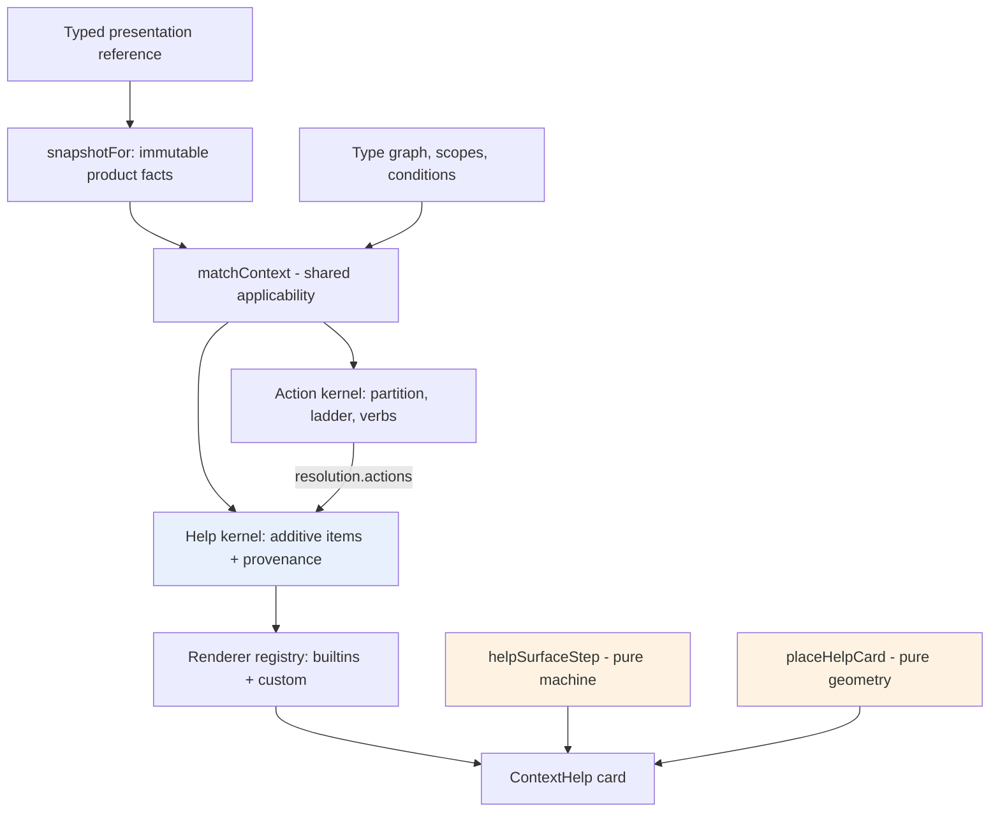

# Typed Contextual Help in PBUI: Kernel, Renderers, Surface, and Products

This note is a complete technical account of the PBUI contextual help system: what question it answers, how its four layers divide the work, and how two products with opposite shapes — Datalab and the rag-ttc workbench — integrate it. The system was built as tickets PBUI-HELP-001 and PBUI-HELP-002 in `/home/manuel/workspaces/2026-08-24/use-optkit/pbui`. A reader who finishes this note should be able to author help rules for a new PBUI product, add a custom renderer, and explain why the system is structured as a sibling of the action kernel rather than as a tooltip library.

The interaction-state consolidation that hardened the runtime surface has its own analysis in [[ARTICLE - From Review Churn to State Machine - Consolidating the PBUI Help Surface]]. This note covers the system; that note covers the process that fixed its weakest layer.

> [!summary]
> - Help is the action kernel's sibling question. Actions ask "which operations apply to this typed subject, in this scope, given these facts?" and select one implementation per operation. Help asks "which explanations apply?" and accumulates every match. One shared matcher answers applicability for both, so a menu and its help card can never disagree.
> - Content is data naming a renderer: five built-in item kinds (text, bounded Markdown, fields, notice, actions) plus a registry for product-defined typed React renderers. No built-in has an HTML path.
> - The delivery surface — hover after a 350 ms rest, or keyboard focus, one `role="tooltip"` card — is driven by a pure state machine and a pure placement function, both property-tested.
> - The two integrations demonstrate the two authoring strategies: Datalab uses one exact rule plus a custom renderer on its most important type; rag-ttc uses three inherited rules on abstract graph nodes to cover roughly thirty types at once.

## The problem: five bad ways to explain an object

Before this system, a PBUI product wanting to explain an object on screen had these options, all in production use somewhere:

- a hard-coded browser `title` string at the component call site;
- explanatory text in the presentation descriptor, which cannot see query-local facts;
- a tooltip component that re-implements the action rules' predicates to say why something is disabled;
- opening the Inspector for information that should be available at a glance;
- a product-specific popover with no connection to presentation identity.

Each fails the same test: explanation depends on context, and these mechanisms cannot see it. A field's useful description depends on its live data type in the current pipeline output. A protected object explains itself differently inside an editor scope than in a global one. An action's disabled reason already exists — computed by the action kernel — and any tooltip that re-derives it will eventually disagree with the menu it sits next to. The requirement, stated precisely: one typed way to compute contextual help from the same facts the action system reads, with product-defined rendering for content that is not prose.

## The architectural premise: a sibling kernel

PBUI's action kernel resolves a query in two conceptual halves. The front half determines contextual reachability: find the subject's concrete type and its ancestors in the nominal type graph, find the nearest active scope among the rule's declared scopes, and evaluate declarative conditions and named predicates against an immutable fact snapshot the product built for this query. The back half is competition: partition candidates by action id, prefer smallest type distance, then nearest scope, then highest priority, and return ambiguity as data rather than guessing.

Help needs the first half exactly and the second half not at all. Two rules that explain one object are composition, not conflict; there is nothing to select and no verb to bind. That observation fixes the architecture:

| | Actions | Help |
| --- | --- | --- |
| Applicability | shared matcher | shared matcher |
| Multiple matches for one subject | compete per action id; one wins or ambiguity is returned | all contribute; order is display metadata |
| Type distance, scope nearness, priority | precedence — decides the winner | ordering — decides display position only |
| Non-available status | participates in override (an unavailable specific rule suppresses a generic fallback) | contributes nothing; only `available` matches |
| Output | verbs behind fresh revalidation | inert items naming renderers |

The shared front half was extracted into `matchContext` (`src/presentation/context/match.ts`): one pure function owning exact-versus-subtype reachability, shortest ancestor distance, nearest active scope, condition evaluation, and match provenance. Two details of the extraction matter enough to record.

First, the action caller does not pass its `when` condition to the matcher. In the action kernel, a failing condition produces a *status* — `unavailable` or `hidden` — that stays in the competition, because an unavailable specific rule must suppress its generic fallback. The matcher's condition stage is a binary reject, which is the correct semantics for help (only `available` matches) and the wrong one for actions. The two callers share the machinery and keep their own terminal semantics, which is the entire design in one sentence.

Second, the action resolver's trace interleaves an invocation check *between* the matcher's type and scope stages: a type-reachable rule failing both invocation and scope must trace `invocation-not-allowed`, not `no-active-scope`. The refactor therefore holds the matcher's rejection and acts on it after the invocation check. The proof that this preserved behavior byte-for-byte: a set of freeze fixtures written *before* the extraction (trace shapes asserted with full-object equality) plus the product's menu golden tests, all passing unchanged.

## The help kernel: rules, items, additive resolution

A help rule mirrors an action rule minus everything verb-shaped:

```ts
define.exact("field", {
  id: "datalab.field.help",          // names this declaration
  scopes: ["datalab"],               // nearest active scope must match
  when: predicate("…"),              // optional; only `available` matches
  help: ({ subject, snapshot }) => [ // returns items; subject.value narrowed
    markdownHelp.create({ id: "field.meaning", order: 0, payload: { … } }),
  ],
});
```

Exact rules receive the concrete payload type; inherited rules — declared on a graph node, matching every subtype — receive the original generic reference, because runtime subtyping never coerces payloads. The narrowing is type-level only; at runtime both contexts are the same object, a property inherited directly from the action factories.

An item is data naming a renderer:

```ts
interface HelpItem<Payload> {
  id: HelpItemId;      // unique within one resolution — duplicates THROW
  kind: HelpKind;      // selects a renderer
  title?: string;
  order?: number;      // display ordering, never a filter
  payload: Payload;
}
```

Resolution walks every registered rule through the matcher, evaluates the optional `test` (non-`available` contributes nothing), collects items with provenance, rejects duplicate ids loudly — a duplicate is an authoring defect between two packages, and the error names both rules — and sorts by five keys: type distance ascending, scope index ascending, rule priority descending, item order ascending, item id ascending. The final id key makes the output independent of registration order by construction rather than by sort-stability accident. The registry construction is fail-fast in the action registry's style: duplicate rule ids, unknown types, unknown scopes, unknown predicates, and non-finite priorities all throw immediately; unlike the action registry there is no collision analysis, because help rules cannot collide.

The five-key sort has one consequence worth internalizing for authoring: distance dominates. An item from a rule on the concrete type always precedes an item from a rule on an ancestor, regardless of `order`. In rag-ttc this is what places the watch-status line (declared on `watchable`, distance 1 from a case) above the generic identity block (declared on `inspectable`, distance 3) with no coordination between the two rules.

## Renderers: typed extension without an HTML path

The React half lives in `src/components/ContextHelp/`, outside the pure kernel. Its central helper bundles a kind with its renderer and a constructor, so a product cannot spell the kind differently when registering and when emitting:

```ts
const fieldSummaryHelp = defineHelpItem<FieldSummaryPayload>(
  "datalab.field-summary",
  FieldSummaryHelp,           // ComponentType<HelpRendererProps<Payload>>
);
// …later, in a rule:
fieldSummaryHelp.create({ id: "field.summary", order: 10, payload: { … } });
```

`createHelpRendererRegistry` throws on duplicate kinds; an *unknown* kind at render time warns and omits that one item, because one package shipping an unregistered kind must not blank every other package's help. Renderers receive the resolved item (payload plus provenance), the subject, and the snapshot.

The five built-ins and their contracts:

| Kind | Payload | Notes |
| --- | --- | --- |
| `help.text` | `{ text }` | one paragraph, rendered as text |
| `help.markdown` | `{ markdown, compact? }` | bounded subset; see below |
| `help.fields` | `{ fields: {label, value}[] }` | description list; the destination for user-controlled values |
| `help.notice` | `{ tone: info\|warning\|error, message }` | tone is visual metadata; the message always stands as text |
| `help.actions` | `{ actions: ActionsHelpEntry[] }` | informational rows; see below |

The Markdown renderer reuses the block parser proven in the pbui-chat transcript — paragraphs on blank lines, single-newline breaks, `**strong**`, inline code, fenced blocks, bullet lists, headings — minus the chat mention syntax. Everything becomes React text nodes; no code path can emit markup from content, which is asserted by an injection test (`` arrives as literal text). One deliberate omission: there is no `escapeMarkdown` helper, although the original design sketch referenced one. The subset has no backslash-escape grammar, so an honest escaper cannot exist; the documented rule is that arbitrary user-controlled strings go in the fields item, and authored Markdown interpolates nothing it does not control.

The actions item embodies the system's one hard integration rule. Its payload type, `ActionsHelpEntry`, is the structural slice of a `ResolvedAction` (id, label, description, danger, status) — so a rule builds it by resolving the *action* registry with the same subject and snapshot and passing `resolution.actions` straight through. Both product test suites pin this with `expect(shown).toEqual(resolved)`: the rows in the card are the action resolution, not a reconstruction. Rows are informational in this release; if they ever become clickable, clicks must route through `performAction` so fresh revalidation holds.

## The delivery surface

The runtime is opt-in: `createPbui({ …, help, helpRenderers })`. With neither configured, `Presentation` dispatches nothing, allocates nothing, and renders byte-identical DOM — a property with its own test, which is what let the feature land in a shared library without a migration.

The externally visible contract:

- Resting the pointer on a presentation for 350 ms opens its card; keyboard focus opens it immediately with identical content. Pointer-borne focus (a click) and *restored* focus (the menu handing focus back on close) open nothing — distinguishing those took an input-modality tracker and a synchronous mark around the focus-return dispatch, both consumed as event fields.
- Resolution is lazy and structural: the machine that drives the surface can only call the resolver inside its timer-fired and keyboard-focus transitions, and an empty resolution opens no card.
- The card is `role="tooltip"`, referenced by `aria-describedby` on the subject only while open, never focused, and closes on leave, blur, Escape (through the shared escape-surface stack), menu opening, and anchor unmount. The pointer may travel into the card to scroll it; PageUp/PageDown page a keyboard-opened card.
- Placement is a pure function: flush against the anchor (a gap belongs to neither element and turns a slow crossing into a spurious close), flipped above when below cannot fit, height capped to the space that exists so overflow scrolls instead of clipping.



The machine and geometry boxes are the PBUI-HELP-002 layer; their derivation from four rounds of review findings, the transition table, and the fuzz harness are in the companion note. For this note's purposes the relevant fact is the division: the kernel decides *what* help is, the machine decides *when* it shows, the geometry decides *where*, and none of the three imports React.

## Two products, two authoring strategies

The integrations are instructive because they sit at opposite ends of the rule-granularity spectrum.

**Datalab** (`packages/datalab-ui/src/pbui/help.tsx`) has one deeply-explained type. A single exact rule on `field` composes three items: authored Markdown about what a field is, a custom `FieldSummaryHelp` renderer showing the field's live inferred type and target chart — read from the same `snapshotFor` facts the field's action rules read — and the actions item. The custom renderer is the proof of the extension seam: domain visualization without touching PBUI core, registered as `[...builtinHelpItems, fieldSummaryHelp]`.

**rag-ttc** (`apps/workbench/web/src/pbui/help.tsx`) has roughly thirty presentable types under three abstract graph nodes, `inspectable` → `citable` → `watchable`. Three inherited rules cover the entire vocabulary:

- `inspectable` contributes identity (type, stable `refKey`) and the actions item — every object, one rule;
- `citable` contributes evidence status against the active draft and active finding, reading the same `WorkbenchFacts` sets that make Cite/Uncite contextual on menus, and contributes *nothing* when nothing is cited — additive help has no empty sections;
- `watchable` contributes what watchability means and a live watchlist status line.

A small `TYPE_MEANING` table adds authored Markdown for the five types whose semantics the type graph documents (hit, chunk, leg, experiment, chunkPreview). The table is deliberately partial: a type without an entry still gets identity, status, and actions. This is the pattern to prefer when a vocabulary is wide — one rule per abstract capability plus a data table, not one rule per type.

| | Datalab | rag-ttc |
| --- | --- | --- |
| Types covered | 1 (`field`) | ~30 (via 3 abstract nodes) |
| Rule style | exact | inherited |
| Custom renderer | yes (`datalab.field-summary`) | no (built-ins suffice) |
| Contextual status | field type, target chart | watchlist, draft evidence, finding evidence |
| Test strategy | resolution-level + action parity | resolution-level + action parity + status toggling |

## Design decisions that held, and what was deferred

Three decisions from the original design survived contact with implementation, review, and two products unchanged. Help is additive with no override ladder — duplicate item ids are authoring errors, and rules never shadow each other. Only `available` matches — a rule wanting to *explain* an unavailable action emits an actions item, whose rows carry the reason from the action kernel, rather than importing override semantics into help. And help reads the introspection snapshot — the same `snapshotFor` invocation the action system uses for non-performing queries — so no product changed its snapshot contract to adopt help.

The deliberate deferrals are recorded as decisions rather than gaps: no asynchronous rule evaluation or network-loaded content; no multi-selection help; no help-specific authorization framework and no second predicate language (the named-predicate escape hatch stays the only one); no agent-facing help export or hover analytics; no raw HTML, links, tables, or Markdown plugins; no touch long-press; no interactive (clickable) card, which would require the focus-return machinery the menu uses; no re-resolution of an open card on snapshot revision changes (a tooltip may show facts one revision old — `performAction`'s fresh revalidation still protects every mutation); and no anchor tracking under page scroll, where the eventual answer is a `scroll` event that closes the card, as menus conventionally do.

## Working rules for authoring help

- Read the facts the action rules read, through the snapshot, and nothing else. If a status in the card can disagree with a menu, the rule is reading the wrong source.
- Never re-derive applicability. To show actions or their disabled reasons, resolve the action registry and pass `resolution.actions` through.
- Prefer inherited rules on abstract graph nodes when the vocabulary is wide; add per-type prose through a partial data table, not per-type rules.
- Put user-controlled values in the fields item. Authored Markdown interpolates only what the author controls.
- Return an empty item list when there is nothing contextual to say; additive help renders no empty sections.
- Give every rule, item, and custom kind a stable id, and expect duplicates to throw — that is the composition contract between packages.
- Remember that type distance dominates display order across rules; use `order` only to arrange items within one conceptual layer.

## Source material

- Kernel: `src/presentation/help/` (`types.ts`, `define.ts`, `registry.ts`, `resolve.ts`, `machine.ts`, `place.ts`); shared matcher: `src/presentation/context/match.ts`
- Renderers: `src/components/ContextHelp/` (`registry.ts`, `builtins.tsx`, `markdown.tsx`, `HelpContent.tsx`); runtime: `src/presentation/createPbui.tsx`
- Products: `packages/datalab-ui/src/pbui/help.tsx` (+ `test/help.test.ts`); `/home/manuel/workspaces/2026-08-24/use-optkit/rag-ttc/apps/workbench/web/src/pbui/help.tsx` (+ `src/test/help.test.ts`)
- Tickets: `ttmp/2026/08/29/PBUI-HELP-001--…` (design doc, ten-step diary) and `ttmp/2026/08/29/PBUI-HELP-002--…` (surface spec); review history: https://github.com/hyperslop-systems/pbui/pull/20
- Authoring documentation for consumers: the "Contextual help" section of the pbui `README.md`; live examples: the `WithContextualHelp` story and the two product workbenches
- Related: [[ARTICLE - From Review Churn to State Machine - Consolidating the PBUI Help Surface]]
