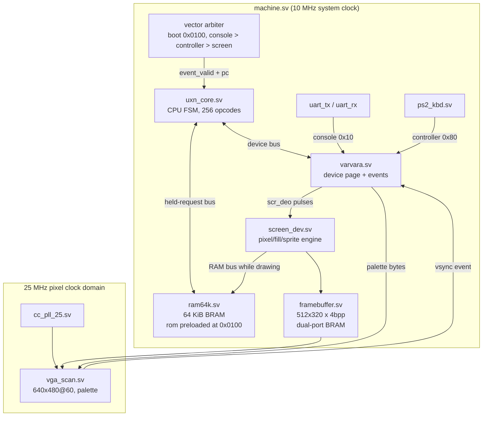
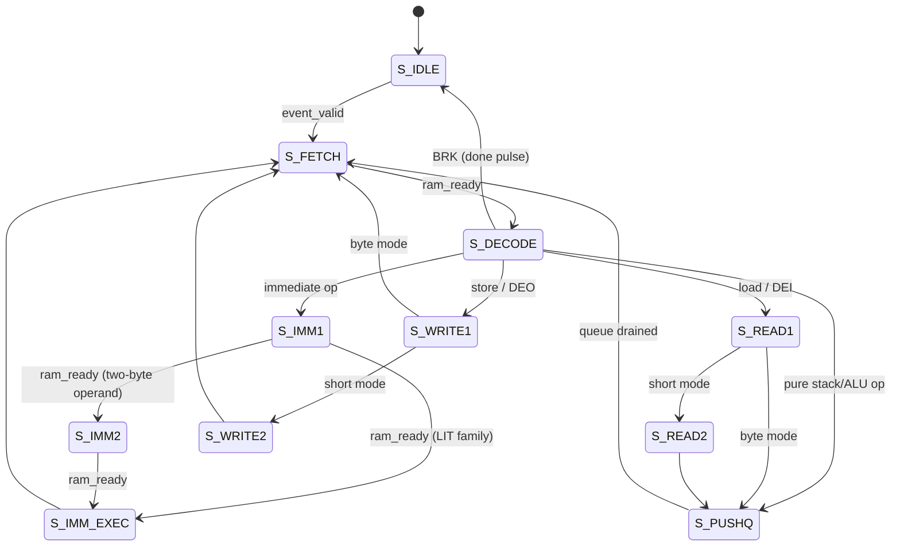
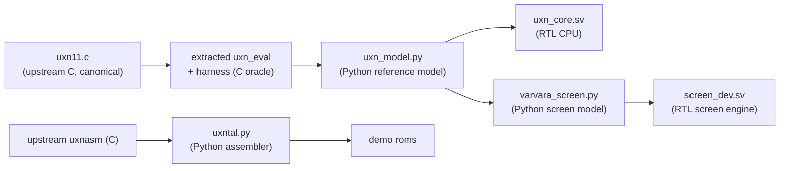

# Uxn Computer

This project implements a complete Uxn/Varvara computer — CPU, memory, console, keyboard, clock, and display — in the FPGA fabric of an Olimex GateMateA1-EVB, using only open-source tools. The CPU is a hardware realization of the Uxn stack machine specified by Hundred Rabbits: 32 base operations, two 256-byte stacks, a flat 64 KiB address space, and a 256-byte device page that connects the machine to its peripherals. The project follows the same methodology as the earlier MATE-16 and PCA GateMate projects: an executable reference model, a bit-identical assembler, a multi-cycle RTL core, and differential testing at every layer.

> [!summary]
> The project has three defining properties:
> 1. a full Uxn CPU executing all 256 opcode encodings directly in FPGA logic, verified instruction-by-instruction against an extracted C oracle
> 2. a Varvara device layer — UART console, PS/2 keyboard, uptime clock, VGA screen with the complete sprite blending semantics — driven by a serialized vector arbiter
> 3. a verification chain in which every hardware bug found in this project was caught by a differential test, never by inspection alone

## Why this project exists

Uxn is a portable computing target created by Devine Lu Linvega (neauoire) of Hundred Rabbits. Instead of porting applications to each operating system, the Hundred Rabbits software stack (the *Left* text editor, *Nasu* sprite editor, *Orca* sequencer) targets one small virtual machine that can be implemented anywhere in a few thousand lines of code. The VM is deliberately small enough that a complete implementation fits in an FPGA alongside its peripherals, which turns it into a well-bounded hardware project: the entire architectural specification is one C function (`uxn_eval` in `uxn11.c`, roughly 90 lines), and any deviation between hardware and specification is measurable.

The engineering goal of this project is a computer that boots a Uxn rom on real hardware, prints on a serial console, reads a PS/2 keyboard, and draws on a VGA monitor — with every layer verified in simulation before it reaches the board.

## Current project status

The project is implemented through the device layer (phases P1–P4 of the ticket plan complete) and the screen engine is functionally verified against a Python model of the drawing semantics. Remaining work is the animated screen-vector demo (a 60 Hz event-dispatch issue under investigation), board-level integration, synthesis and place-and-route for the full system, and hardware bring-up.

What exists today:

- `uxn/tools/` — an opcode table, a bit-exact Python reference model of the CPU, a Uxntal assembler whose output is byte-identical with upstream `uxnasm`, and a Python model of the screen device
- `uxn/rtl/` — `uxn_core.sv` (CPU FSM), `ram64k.sv`, `varvara.sv` (device system), `machine.sv` (event arbiter), `uart_tx.sv`/`uart_rx.sv`, `ps2_kbd.sv`, `framebuffer.sv`, `screen_dev.sv`, `vga_scan.sv`, `cc_pll_25.sv`
- `uxn/programs/` — `hello.tal`, `echo.tal`, `keys.tal`, `count.tal`, `bounce.tal`, `draw.tal` (screen-op torture test), `torture.tal` (assembler rune coverage)
- `uxn/sim/` — four pytest suites: toolchain unit tests, RTL-vs-model CPU differential, machine-level peripheral tests, screen framebuffer differential
- a ticket workspace (`ttmp/2026/08/30/UXN-GM-001--*`) with an intern-grade design document, a chronological diary, and 26 numbered investigation scripts
- vendored reference sources in `sources/uxn/` (uxn11 emulator, upstream uxnasm, prjpeppercorn PS/2 and VGA reference designs) plus a compiled C oracle harness around the verbatim extracted `uxn_eval`

## Project shape



The system is a two-clock design. The CPU, devices, and draw engine run at the board's 10 MHz oscillator frequency; the VGA scanner runs at 25 MHz from an on-chip PLL. The only signals crossing domains are the framebuffer (a true dual-port block RAM with one port per domain) and the vsync event, which is synchronized into the system clock by a two-flop synchronizer.

The remainder of this note is a subsystem-by-subsystem tour. Each section explains the subsystem's contract, its mechanism, and the details that are not obvious from reading the code.

---

## Subsystem 1: The Uxn machine model

Every other subsystem exists to serve this model, so it is worth stating completely before any hardware appears.

The architectural state is:

| State | Size | Role |
|---|---|---|
| `pc` | 16 bit | program counter; `0x0100` after boot |
| `ram` | 64 KiB | one flat byte-addressed space for program and data |
| `wst` | 256 B | working stack |
| `rst` | 256 B | return stack |
| `wsp`, `rsp` | 8 bit each | stack pointers, interpreted as counts |
| `dev` | 256 B | Varvara device page |

Two properties of this state deserve emphasis because they shape the hardware.

First, the stacks wrap rather than trap. The pointers are 8-bit counts and every arithmetic on them is implicitly modulo 256. Pushing onto a full stack overwrites the deepest entry; popping an empty stack reads whatever the pointer happens to address. There are no stack-overflow faults in Uxn, so the hardware needs no fault machinery at all — but it also means the differential tests must model the wrap exactly, or the tests will disagree with the reference on precisely the programs that exercise it.

Second, a rom is not a separate memory. Every Uxn emulator loads the rom file into RAM at address `0x0100` and starts executing there; the 256 bytes below it ("zero page") are ordinary writable memory that programs use for variables. The hardware therefore uses a single 64 KiB RAM initialized at synthesis time from a full-size `$readmemh` image with the rom preloaded. A `.rom` file on disk is raw program bytes; the zero page exists only inside the machine.

Execution is vector-driven rather than continuous. The machine runs one vector (a routine address) to completion — it stops when the program executes `BRK` — and then idles until a device event selects the next vector. A nonzero write to `System/state` (device port `0x0f`) stops event dispatch entirely, which is how programs exit.

## Subsystem 2: The opcode encoding

Every opcode byte decomposes into a 5-bit base operation and three mode bits:

```
 7   6   5   4  3  2  1  0
+---+---+---+-----------------+
| k | r | 2 |   base op (5b)  |
+---+---+---+-----------------+
  k = 0x80  keep mode: read operands, do not pop
  r = 0x40  return mode: operands come from the return stack
  2 = 0x20  short mode: operands are 16-bit
```

The base operations:

| Byte | Name | Byte | Name | Byte | Name | Byte | Name |
|---|---|---|---|---|---|---|---|
| 00 | `BRK` | 08 | `EQU` | 10 | `LDZ` | 18 | `ADD` |
| 01 | `INC` | 09 | `NEQ` | 11 | `STZ` | 19 | `SUB` |
| 02 | `POP` | 0a | `GTH` | 12 | `LDR` | 1a | `MUL` |
| 03 | `NIP` | 0b | `LTH` | 13 | `STR` | 1b | `DIV` |
| 04 | `SWP` | 0c | `JMP` | 14 | `LDA` | 1c | `AND` |
| 05 | `ROT` | 0d | `JCN` | 15 | `STA` | 1d | `ORA` |
| 06 | `DUP` | 0e | `JSR` | 16 | `DEI` | 1e | `EOR` |
| 07 | `OVR` | 0f | `STH` | 17 | `DEO` | 1f | `SFT` |

Eight of the 256 encodings are immediates that shadow `BRK`'s mode-bit slots:

| Byte | Name | Effect |
|---|---|---|
| `0x20` | `JCI` | pop a byte from the working stack; if nonzero, add the following signed 16-bit word to `pc` |
| `0x40` | `JMI` | add the following 16-bit word to `pc` |
| `0x60` | `JSI` | push `pc` as a short onto the return stack; add the following word to `pc` |
| `0x80` | `LIT` | push the next byte |
| `0xa0` | `LIT2` | push the next two bytes as a short |
| `0xc0` | `LITr` | push the next byte onto the return stack |
| `0xe0` | `LIT2r` | push the next two bytes onto the return stack |

The immediate family exists because straight-line code constantly pushes constants and jumps; giving these one-byte opcodes with inline operands removes two bytes and one stack round-trip from each occurrence. Note that all immediates consume operand bytes from the instruction stream — they are the only opcodes besides the memory loads that extend the instruction beyond a single byte.

A worked example fixes the notation. The uxntal line `#0002 #0004 ADD2` assembles to the bytes `a0 00 02 a0 00 04 38`: two `LIT2` immediates followed by `ADD2 = 0x18 | 0x20`. Executing it pushes `00 02`, pushes `00 04`, then `ADD2` pops both shorts, adds them, and pushes `00 06`. The same instruction in byte mode (`ADD`, opcode `0x18`) would pop two bytes and push one.

## Subsystem 3: Operand semantics

The operand forms are where Uxn accumulates most of its subtlety, and where this project's reference-implementation archaeology paid off. Each operation reads up to three operands, named `x` (top of stack), `y` (second), `z` (third). In short mode each operand spans two stack bytes — high byte pushed first, so the low byte is on top — and the read depths shift accordingly.

The uniform rule for the common case:

| Operand | byte mode depth | short mode depths (hi, lo) |
|---|---|---|
| `x` | 1 | 2, 1 |
| `y` | 2 | 4, 3 |
| `z` | 3 | 6, 5 |

Seven operations deviate from the uniform rule, and each deviation is load-bearing:

- **`LDZ`, `STZ`, `LDR`, `STR`, `DEI`, `DEO`, `SFT`** read `x` as a byte always. Their `x` operand is an address, a port number, or a shift amount; a 16-bit shift amount or an 8-bit port would be nonsense.
- **`LDA`, `STA`** read `x` as a short always. Absolute addressing consumes a full 16-bit address even in byte mode, which is why `LDA`'s byte-mode pop count is 2, not 1.
- **`JCN`** reads its condition `y` as a single byte at depth 2 (byte mode) or depth 3 (short mode) — the condition is always one byte regardless of the address width.
- **`STZ`, `STR`, `DEO`, `SFT`** read `y` from depths 3 and 2 in short mode (rather than 4 and 3), because their `x` is only one byte wide.
- **`STA`** reads `y` from depths 4 and 3 in short mode and depth 3 in byte mode, because both its `x` (short address) and its shifted `y` position account for the address width.

One more asymmetry: the comparison operations `EQU`, `NEQ`, `GTH`, `LTH` push a **byte** result even in short mode. A program that does `EQU2` gets a one-byte 0 or 1 on the stack.

There is a trap here for anyone implementing from the C source. The reference implementation defines its operand reads with preprocessor macros, and the short-mode low byte reads as if it were at depth `o2+1`. It is not. Because the macro body subtracts without parentheses, the preprocessor emits `ptr - o2 + 1`, which binds as `(ptr - o2) + 1` — depth `o2 - 1`. Reading the macros as written produces wrong operand depths for exactly the operations listed above; reading the *preprocessed* expansion (`cc -E`) produces the correct ones. This project resolved three such ambiguities by compiling the extracted `uxn_eval` into a runnable oracle and asking it, rather than by staring at the source.

## Subsystem 4: The CPU core

`uxn_core.sv` implements the machine model as a multi-cycle finite state machine. It is deliberately not pipelined: at 10 MHz the machine retires roughly two million instructions per second, which is far beyond what a 60 Hz frame loop needs, and a non-pipelined design makes every architectural write happen at an identifiable cycle, which is what the differential test compares.



### The held-request bus

The core talks to memory and devices through one contract, inherited unchanged from the MATE-16 project:

- the master raises `req` with stable `addr`, `we`, and `wdata` fields;
- the slave answers with a single-cycle `ready` pulse, with `rdata` valid during that cycle;
- at most one transaction is outstanding at a time.

The contract has two consequences worth naming. It lets every slave be a two- or three-line state machine, and it makes backpressure trivial: a slave that is not ready simply holds `ready` low, and the master stalls inside its current instruction with all request fields stable. The console device uses exactly this to stall the CPU when its UART FIFO is full, and the screen device uses it to stall the CPU while the draw engine works.

### The push queue

The heart of the core is a uniform commitment scheme that mirrors the reference implementation's evaluation order for every operation:

1. read `x`, `y`, `z` from the operand stack without popping;
2. pop `k1` bytes (byte mode) or `k2` bytes (short mode) from the source stack — unless keep mode is active, in which case nothing is popped;
3. push between zero and six result bytes to a single target stack, at the base left by the pop.

The six-byte bound comes from `ROT2` and `OVR2`, which push three shorts. A small queue drains one byte per cycle into the target stack at the captured base, and the target stack's pointer is updated once, when the last byte is written. Two operations push to the *other* stack than the one they read from — `STH` moves its operand across, and `JSR` pushes the return address across — so the queue carries a destination-stack bit, and its base for those operations is the other stack's current pointer.

This uniformity has a cost and a benefit. The cost is that a byte-mode `SWP` and a short-mode `ROT` take different numbers of queue-drain cycles (two versus six), so per-opcode cycle counts vary. The benefit is that there is exactly one place in the design where stack pointers change, and the differential test can therefore compare a single well-defined "state after retirement" snapshot per instruction.

### The immediate path

Immediates read their inline operand bytes through the ordinary fetch path — `S_IMM1` and `S_IMM2` are fetch states addressed at `pc` — and then commit in `S_IMM_EXEC`. `JCI` is the only immediate that touches the stacks: it decrements the working-stack pointer and tests the byte it lands on. `JSI` pushes the post-operand `pc` onto the return stack and then applies the relative jump. The `LIT` family pushes one or two operand bytes onto the working or return stack according to its two mode bits.

## Subsystem 5: The memory subsystem

There are three memories in the machine, and each exists for a different reason.

**The main RAM** (`ram64k.sv`) is a 64 KiB × 8 block RAM behind the held-request contract. Its transaction is two cycles: the request is latched on the first cycle (writes commit at the latch edge), and `rdata` with a `ready` pulse is presented on the second. The full-image `$readmemh` initialization happens through a synthesis-time macro, so the same module serves simulation (testbench preloads) and hardware (ROM baked into the bitstream). One 64 KiB image maps to thirteen of the GateMate's 40 Kb block RAMs.

**The stacks** live in fabric, not block RAM. They need three simultaneous asynchronous read ports — `x`, `y`, and `z` are all peeked combinationally in the decode cycle — and this Yosys flow does not infer distributed RAM for asynchronous-read memories at all (verified with a minimal test case). The stacks therefore synthesize to 4096 flip-flops and a large multiplexer tree. This is the single largest area consumer in the CPU; the mitigation path, if the final design runs out of room, is to serialize the peeks through one synchronous read port at the cost of one to three cycles per instruction.

**The framebuffer** (`framebuffer.sv`) is 81,920 bytes — 512 × 320 pixels at four bits per pixel — organized as 256 bytes per row with two pixels per byte. A pixel's byte address is the bit concatenation `{sy[8:0], sx[8:1]}`: nine row bits, eight column bits, and the pixel's parity selects the nibble. No adder participates in pixel addressing. The memory is a true dual-port block RAM with the engine's port in the 10 MHz domain and the scanner's port in the 25 MHz domain; block RAM is the only structure in the FPGA that can safely be read from two clock domains at once, which is why the framebuffer is a memory and not a register file.

## Subsystem 6: The assembler

`uxn/tools/uxntal.py` is a Uxntal assembler whose output must be — and is, by test — byte-identical with the upstream C assembler `uxnasm` for every program in the repository. Its interest is not parsing but the places where Uxntal's encoding rules are not what they appear to be.

A Uxntal source line consists of whitespace-separated tokens, and each token's first character selects its meaning:

| Token | Meaning |
|---|---|
| `\|0100` | pad to absolute address `0x0100` |
| `$08` | pad forward 8 bytes |
| `@name` | define a top-level label (sets the scope) |
| `&name` | define a sublabel (scoped to the last `@`) |
| `#12` / `#1234` | `LIT` byte / `LIT2` short |
| `.label` | `LIT` byte: zero-page address of label |
| `,label` | `LIT` byte: relative address of label |
| `;label` | `LIT2` short: absolute address |
| `=label` | raw short: absolute address, no `LIT` |
| `-label` | raw byte: zero-page address |
| `_label` | raw byte: relative address |
| `?label` | `JCI` + relative short |
| `!label` | `JMI` + relative short |
| `label` (bare) | `JSI` + relative short |
| `"text` | emit the characters of the text |
| `00`–`ff` (bare hex) | raw byte (two digits) or short (four digits) |

Three rules discovered the hard way are worth recording. First, hex digits are **lowercase only**: `ADD2` is a mnemonic, but `add2` would be a raw short, because the assembler's hex alphabet is `"0123456789abcdef"`. Second, sublabel references resolve their scope at the point of reference, not at the end of assembly. Third, trailing zero bytes are trimmed from the output file — the reference assembler's "high-water mark" rule — so a program ending in `BRK` produces a file whose last byte is *not* the `BRK`; the byte is written but not counted, and the loader's zero-initialized RAM supplies the zero anyway.

The assembler also emits the full 64 KiB `$readmemh` image for FPGA builds, with the rom placed at `0x0100` and the zero page explicitly zero.

## Subsystem 7: The reference model and the C oracle

`uxn/tools/uxn_model.py` is a line-by-line Python port of the extracted `uxn_eval`, and the C oracle is that same extracted function compiled with a harness that loads a rom, runs it, and dumps everything observable: stack pointers, both stacks, and FNV-1a hashes of the full 64 KiB RAM and the 256-byte device page.

The oracle harness exists because the questions this project needed answered were of the form "what does the reference do here," and the fastest reliable way to answer them is to run the reference. The harness is 170 lines: state declarations matching `uxn_eval`'s globals, stub device handlers that store and log, and a `main` that prints the state dump on `stderr`.

The model preserves the evaluation order exactly — peek, pop (unless keep), then effect — because the RTL preserves it, and the two are compared per retired instruction. The model also carries a per-instruction snapshot mode: at every fetch it records both stack pointers and both stacks, which makes the state *after* instruction *i* directly comparable with the RTL testbench's retirement snapshot. This pairing turned every RTL bug hunt in the project into a five-minute exercise: run both, find the first snapshot where they differ, read the opcode at that `pc`.

## Subsystem 8: The device page

`varvara.sv` implements the Varvara device system: a 256-byte register file with live read overrides, deferred write effects, and the event machinery that turns device activity into vector dispatch.

Devices occupy 16-byte pages. The pages this machine implements:

| Page | Device | Hardware |
|---|---|---|
| `0x00` | System | stack pointers, palette, debug, exit state |
| `0x10` | Console | UART receive and transmit |
| `0x20` | Screen | draw engine, framebuffer, VGA |
| `0x80` | Controller | PS/2 keyboard |
| `0xc0` | DateTime | uptime clock |

The CPU reaches the device page through two opcodes. `DEI` reads a port; some ports are computed live rather than stored (the stack pointers, the screen dimensions, the controller button byte, the date and time). `DEO` writes a port; some writes have side effects (a console byte enters the UART FIFO, a screen-port write starts or parameterizes a drawing operation, a `System/state` write halts event dispatch).

The `DEO2` rule deserves its own paragraph. A short-mode `DEO` writes two ports: the high byte first, then the low byte. In the reference implementation, only the *second* write runs the port's side-effect handler; the first is a bare store. The hardware encodes this with a `raw` flag on the device bus: the CPU's `DEO2` sequence issues the high-byte write with `raw` set and the low-byte write without. The screen engine depends on this — it must observe the high-byte write to `Screen/x` to shadow the register, but it must not treat it as a drawing operation.

The transaction protocol on the device bus is a two-phase deferred serve. The request fields are latched on the first cycle; the effects are applied on the second, but only if the serve condition holds. The serve condition is where backpressure lives:

```
serve_ok = not (write targets a console TX port and the TX FIFO is full)
       and not (write targets a screen port and the draw engine is busy)
```

If the condition fails, the request stays latched and `ready` stays low, and the CPU waits inside its `DEO` with the bus stable. No byte is ever dropped. When the condition clears, the effects fire and the handshake completes.

## Subsystem 9: The event arbiter

`machine.sv` contains the arbiter that turns device events into vector dispatches, and its design is a direct hardware reading of an emulator's main loop.

The loop an emulator runs is: check for pending input; if any, write it into the device page and call `uxn_eval(vector)`. The hardware version:

1. after reset, fire the reset vector `0x0100` once;
2. when the CPU is idle and events are pending, select one by priority — console, then controller, then screen;
3. pulse `ev_grant` so the device system consumes the event's data (pop the receive FIFO into `Console/read`, set `Console/type`, present the pending key byte);
4. if the event's vector is nonzero, latch it and pulse `event_valid` — the core loads it and runs to `BRK`;
5. on the core's `done` pulse, issue `ev_done` so the device system can perform post-vector cleanup — the controller's transient `key` byte is cleared here, exactly as the reference clears it after the vector returns;
6. return to step 2.

Two details make this robust. A zero vector is dispatched as a *consumption without invocation*: the event's data is consumed (the received byte is dropped from the FIFO, as the reference's input routine reads from its stream regardless) but no vector runs. And a two-bit grant lockout prevents double-consumption: after a grant, the arbiter waits a few cycles before considering the next event, because the device system clears its pending flag one cycle after the grant, and a same-cycle re-evaluation would grant the same event twice.

The controller semantics that the arbiter implements follow the reference exactly: a key press sets `Controller/key`, fires the vector, and clears the key byte after the vector; a button press or release sets or clears bits in `Controller/button` and fires the vector; a modifier-only event (shift alone) updates the button byte — shift is the Select button — without a key event.

## Subsystem 10: The console

The console device maps two device behaviors onto one UART: `Console/write` (`0x18`) and `Console/error` (`0x19`) both transmit; received bytes arrive through the console vector with the byte in `Console/read` (`0x12`) and `1` (stdin) in `Console/type` (`0x17`).

Transmit is the simpler direction. A write to a transmit port pushes one byte into a 16-deep FIFO; the UART transmitter drains it. The FIFO exists because the CPU can emit console bytes far faster than 115200 baud drains them — a tight print loop produces a byte every few microseconds while the line needs 87 — and the deferred-serve backpressure described in the device-page section turns a full FIFO into a CPU stall rather than data loss.

Receive is the direction with real timing. The `uart_rx` module synchronizes the input line through two flip-flops, detects the start bit's falling edge, waits one and a half bit periods to reach the middle of the first data bit, samples eight data bits at bit-period intervals, and validates the stop bit. A received byte enters a receive FIFO in the device system; the event machinery then makes it visible to the program exactly once, through the console vector.

The demo programs make good test vectors for this subsystem. `hello.tal` exercises only the transmit direction and the exit path; its machine-level test asserts the full banner on the captured UART output and `System/state = 0x80` at the end. `echo.tal` installs a console vector that copies `Console/read` to `Console/write`; its test injects bytes into the receive line at the pin level and asserts them on the transmit capture — which exercises the receiver, both FIFOs, the vector dispatch, and the transmit backpressure in one pass.

## Subsystem 11: The PS/2 keyboard

The PS/2 subsystem has two parts: a wire-level receiver (`ps2_kbd.sv`) and a scancode translator (inside `varvara.sv`).

The wire protocol is: the keyboard drives both lines; the host reads data on the falling edge of the keyboard's clock. A frame is eleven bits — start (0), eight data bits LSB-first, odd parity, stop (1) — at a keyboard-driven clock around 10–16 kHz. The receiver is the Grant Searle design from the prjpeppercorn test cases, adapted: both lines pass through synchronizers, the clock passes additionally through a majority filter over nine samples to reject contact bounce, and the receiver samples on the filter's falling edge.

The edge detector deserves its own paragraph because it was the site of the project's most instructive receiver bug. The filter's falling edge is not a signal; it is a *condition over time*: the filtered clock output is still high, but the newest eight samples are all low. In the ported design this condition holds for exactly one cycle — the cycle in which the shift register reads `100000000` — and detecting exactly that pattern (`stable == 9'b100000000`) makes the edge fire once per transition. The naive formulations both fail: keying on the filtered clock's own transition fires too late (the data may have changed), and the upstream form `bitclk && ~|stable[7:0]` fires for two consecutive cycles (once at `100000000`, again at `000000000`), double-sampling every bit and corrupting every frame.

The translator is a four-state machine over scancode set 2 — `IDLE`, `EXT` (saw the `E0` extended prefix), `BREAK` (saw the `F0` release prefix), `EXT_BREAK` — with three lookup tables: make-code-to-ASCII (with a shifted-ASCII column, since the shift state is tracked), extended-code-to-button-bit, and base-code-to-button-bit. The button mapping follows Varvara's controller model: arrow keys and Home map to the direction and Start bits; Ctrl, Alt, and Shift map to the A, B, and Select bits; printable keys map to the `key` byte with shift applied. Releases of button keys clear bits and fire the controller vector; releases of printable keys do nothing, matching the reference, which only clears button bits on key release.

## Subsystem 12: The screen engine

The screen engine is the largest peripheral and the one with the most intricate semantics. This section covers the representation first, then the three operations, then the automation model.

### Representation

Each pixel is four bits: two bits of foreground layer and two bits of background layer, packed as a nibble `{fg, bg}`, two nibbles per framebuffer byte. A pixel's displayed color index is `fg != 0 ? fg : bg` — the foreground layer's color 0 is transparent. The palette has four entries, loaded from the `System/r`, `System/g`, `System/b` device shorts: entry `i` takes its 4-bit red component from the high or low nibble of `r`'s byte `i/2`, and likewise for green and blue.

The layering rule means the *background* is the base image and the *foreground* is an overlay that only shows where it is nonzero. Drawing operations select their plane with control bit `0x40`.

### Pixel and fill

A write to `Screen/pixel` (`0x2e`) takes a control byte: bits 1–0 are the color, bit 6 selects the layer, bit 7 requests fill, and bits 5–4 select the fill quadrant. A non-fill pixel operation writes one layer value at `(x, y)` and then, if the corresponding auto bits are set, moves the cursor one pixel in a direction controlled by the same flip bits. A fill operation colors the entire quadrant of the screen bounded by the current position — from `(x, y)` to the right and bottom edges by default, to the left and top edges when the flip bits are set — provided the anchor is on-screen.

The fill is the engine's performance boundary: the implementation writes one pixel per three cycles (a read-modify-write of the framebuffer byte), so a full-screen fill costs about 50 ms at 10 MHz. Programs that repaint the whole screen each frame will not sustain 60 Hz without a faster fill path; this is a documented limitation with a known fix (burst-filling whole bytes) deferred until the machine runs on hardware.

### Sprites

A write to `Screen/sprite` (`0x2f`) paints an 8×8 tile from main memory at the current cursor. The control byte carries: bit 7 for two bits per pixel, bit 6 for the layer, bit 5 for vertical flip, bit 4 for horizontal flip, and bits 3–0 for the blend mode.

In one-bit mode the engine reads eight bytes from `Screen/addr`; in two-bit mode it reads sixteen (the second plane eight bytes above the first). For each output pixel, the source bit index is `flipx ? col : 7 - col` and the source row is `flipy ? 7 - row : row`, so flips are pure re-indexing with no data movement.

The blend nibble does two things. If `blend % 5 == 0`, the operation is see-through: pixels whose source color is zero are skipped entirely. Otherwise — or for nonzero source colors — the destination layer value comes from a fixed 16×4 table indexed by blend mode and source color:

```
blend 0: 0 0 1 2        blend 1: 0 1 2 3        blend 2: 0 2 3 1
blend 3: 0 3 1 2        blend 4: 1 0 1 2        blend 5: 1 1 2 3
   ...                      ...                      ...
blend F: 3 3 1 2
```

The table's two planes in the reference (`blend_lut[b][1]` and `[b][0]`) hold the same two-bit values shifted into different bit positions of the pixel byte; the hardware applies the plane selection when it writes the nibble, so one table serves both.

### Auto-advance

The auto byte (`0x26`) removes the per-tile register updates that make sprite loops verbose in other Varvara implementations:

- bit 0 (*auto-col*): each tile of a multi-tile operation steps `y` by 8, and after the operation the cursor's `x` advances by 8;
- bit 1 (*auto-row*): each tile steps `x` by 8, and after the operation the cursor's `y` advances by 8;
- bit 2 (*auto-addr*): the data address advances by 8 (one-bit) or 16 (two-bit) per tile;
- bits 7–4: the number of *additional* tiles — a single `DEO` can paint up to sixteen 8×8 tiles in one operation.

The naming reads oddly until the operations are separated: within one sprite operation, tiles stack along one axis (a column going down for auto-col, a row going right for auto-row), while the *cursor* — the position a subsequent `DEO` starts from — advances along the other axis. The canonical idiom `#16 .Screen/auto DEO` followed by `#01 .Screen/sprite DEOk DEO` paints two adjacent rows: the first `DEO` draws its tiles left to right, leaves the cursor eight pixels lower, and the immediate `DEOk` re-execution draws the second row.

The engine takes mastership of the main RAM bus while it draws, reading sprite data directly from the program's own memory. This is safe because the CPU is, at that moment, stalled inside the screen-port `DEO` waiting for the deferred-serve condition; the moment the engine finishes, the serve completes and the CPU proceeds. The CPU's view of the RAM handshake is gated by the engine's busy signal — without that gate, the CPU's stalled fetch state would observe the engine's `ready` pulses and latch sprite-data bytes as opcodes. That exact failure existed in this project for an afternoon and is archived in the ticket's debug scripts.

## Subsystem 13: The VGA scanner and the clock domain

`vga_scan.sv` produces standard 640×480@60 timing from a 25 MHz pixel clock: 800 total pixel clocks per line (640 visible, 16 front porch, 96 sync, 48 back porch), 525 lines per frame (480 visible, 10, 2, 33), negative-polarity syncs. The 512×320 image is centered with a 64-pixel horizontal and 80-line vertical offset; outside the image the scanner emits color 0.

The scanner reads the framebuffer one pixel at a time through the memory's second port. Because block RAM reads are synchronous — data appears one cycle after the address — the scanner pipelines by one stage: the counters drive the address for position *n*, and the composite logic displays position *n − 1*. The composite is three operations deep: select the nibble by the delayed pixel's parity, take `fg != 0 ? fg : bg` for the color index, and look up the index in the palette nibbles forwarded from the device page.

The pixel clock comes from `cc_pll_25.sv`, a wrapper around the Cologne Chip `CC_PLL` primitive configured for 10 MHz in, 25 MHz out. In simulation the wrapper substitutes a plain oscillator model that locks after a microsecond, so the same testbenches run against both the sim model and the synthesis primitive.

The one signal that crosses from the pixel domain into the system domain is the vertical-sync event. It passes through a two-flop synchronizer and an edge detector in the 10 MHz domain and becomes the screen event in the device system — the source of the 60 Hz `Screen/vector` dispatch. The framebuffer itself needs no synchronization: block RAM's two ports are independent, a CPU-side write burst is orders of magnitude slower than the scan rate, and upstream Varvara does not double-buffer, so a tear in a frame is acceptable.

## Subsystem 14: The clock, and the system device

The DateTime device is an uptime clock. The board has no battery-backed RTC, so the machine reports a fixed nominal date — 2026-01-01, a Thursday, hence dotw 4 — plus hours, minutes, and seconds counted from power-on, and days-count in the day and day-of-year ports. Programs that need "is time passing" work; calendrical programs will be wrong by construction. This is a documented divergence, recorded in the design document's decision log.

The system device's other ports are small but consequential: `System/wst` and `System/rst` read the CPU's live stack pointers (implemented as read overrides, since the pointers change on every instruction); the palette shorts feed the VGA scanner as described; `System/debug` bit 0 dumps the stack pointers over the console (a reduced form of the reference's stack dump, because the stack *contents* are not routed to the device bus); and `System/state` is the machine's halt.

## Subsystem 15: Verification methodology

The project's verification is a chain of oracles, each validated against the one below it:



Four test families execute the chain:

- **Model vs C oracle.** A generator produces random-but-valid programs — seeded stack literals, then a straight-line body of random opcodes drawn from all 256 encodings with jump families excluded, then a pop-drain and `BRK`. The harness runs each program on both, and compares stack pointers, both stacks, and the RAM and device-page hashes. The exclusion of jumps is a known gap, covered instead by directed roms (`j_sr`, `j_ci`, `j_si`) assembled by the gold assembler.
- **Assembler vs upstream.** Every `.tal` in the repository, plus thirty randomly generated sources, are assembled by both assemblers and compared byte-for-byte.
- **RTL vs model.** The same generator feeds an iverilog testbench around the core. The testbench records the retirement trace — program counter and opcode of every retired instruction, with a stack snapshot per retirement — and dumps the final state. The comparison is trace-equal *and* state-equal.
- **Screen engine vs screen model.** The Python model records every screen-port write during a model run of `draw.tal` (a program covering pixels, fills, both sprite depths, flips, several blends, both auto axes, and clipping, including negative coordinates), replays them into the Python drawing model, and compares the resulting framebuffer with the RTL dump, all 81,920 bytes.

The per-instruction snapshot pairing is the technique that made this productive. The model records its state at every fetch; the RTL records its state at every retirement. Since retirement of instruction *i* is the fetch of instruction *i + 1*, the two sequences index directly, and the first differing index names the offending opcode. Every CPU bug in the project was located this way in minutes.

## Subsystem 16: Synthesis view

The full machine synthesizes cleanly with `synth_gatemate -luttree -nomx8`:

| Resource | Count |
|---|---|
| cells | 28,372 |
| block RAMs (40 Kb) | 13 (main RAM) + framebuffer |
| flip-flops | 6,656 |
| LUT-trees | ~29,000 of 40,960 (≈70%) |

A place-and-route trial of the CPU, RAM, and device system closes timing at 11.1 MHz against the 10 MHz board clock — a thin margin that motivated two prepared mitigations: a sequential divider to replace the combinational `DIV`, and a serialized stack-read path. Routing at 70% utilization with `router2` runs upward of thirty minutes, which is a workflow constraint more than a technical one.

## Common failure modes found

Every hardware bug in this project was caught by a differential or directed test. The significant ones:

- **C macro operator precedence.** The reference implementation's operand macros read as if a short operand's low byte sits at stack depth `o2+1`; because the macro body lacks parentheses, the preprocessor produces `ptr-o2+1`, which is depth `o2-1`. Reading the source naively produces wrong operand depths for `STZ`/`STR`/`DEO`/`SFT` short modes. The preprocessed expansion (`cc -E`) is the only trustworthy reading; the extracted C oracle settled three such ambiguities in minutes.
- **Vacuous fuzz.** The first fuzz run "passed" 1050 programs because the generator emitted roms with a 256-byte zero prefix; both model and oracle executed `BRK` at `0x0100` immediately and compared identical unexecuted state. A rom file is raw program bytes — the zero page exists only in the emulator's memory. Directed tests exposed the vacuity; the fixed fuzz then found three real model bugs in minutes.
- **Lowercase-only hex in uxnasm.** `ADD2` is a mnemonic, but `add2` would be a raw short, because the assembler's hex alphabet is lowercase-only. Porting the assembler required matching this exactly for byte-identical output.
- **PS/2 clock filter edge.** The ported PS/2 receiver fired its bit-sampling edge twice per falling clock transition in simulation (once when the newest 8 samples were all low, again when all 9 were), double-sampling every bit. The fix samples on the unique pattern where the newest 8 samples are low and the oldest is still high.
- **Event pulse loss.** The draw engine's busy signal rose one cycle after the screen-port write pulse that started it, leaving a one-cycle window in which a following screen write could be served, its pulse arrive while the engine had already left idle, and the write be lost. The fix asserts busy combinationally during the pulse.
- **Cross-master bus ready sharing.** While the draw engine owned the RAM bus, the shared RAM `ready` pulses belonged to engine transactions, but the stalled CPU in its fetch state observed them and latched sprite-data bytes as opcodes, executing garbage. The fix gates the CPU's view of `ready` with the engine's busy signal.

## Current user-facing commands

From the repository root with the OSS CAD Suite environment sourced:

```bash
python3 -m pytest uxn/sim -q                    # all test suites (~15 min)
python3 -m uxn.tools.uxntal file.tal out.rom    # assemble
python3 -m uxn.tools.uxntal file.tal out.rom --hex out.hex
```

The ticket scripts run the differential harnesses directly:

```bash
python3 ttmp/2026/08/30/UXN-GM-001-*/scripts/01-model-oracle-difftest.py --n 200 --seed 1
python3 ttmp/2026/08/30/UXN-GM-001-*/scripts/02-rtl-difftest.py --n 25 --seed 1
```

## Important project docs

- Design document (intern-grade, all port maps and decision records):
  `ttmp/2026/08/30/UXN-GM-001--uxn-varvara-computer-on-the-gatematea1-evb/design-doc/01-uxn-computer-design-and-implementation-guide.md`
- Investigation diary (chronological, includes every failure verbatim):
  `ttmp/2026/08/30/UXN-GM-001--uxn-varvara-computer-on-the-gatematea1-evb/reference/01-investigation-diary.md`
- Vendored semantic oracle: `sources/uxn/uxn11/src/uxn11.c`, extracted oracle harness `sources/uxn/oracle/`

## Open questions

- The screen vector (60 Hz vsync event) dispatch does not yet produce framebuffer output in the machine-level bounce test; the event path is under investigation with the archived debug testbenches.
- Whether timing closes after adding the VGA output pins, given the 11.1 MHz estimate against the 10 MHz clock.
- Full-screen fill operations cost three cycles per pixel, which will not sustain 60 Hz for programs that repaint the whole screen every frame.

## Near-term next steps

- Resolve the screen-vector event dispatch and land the `bounce.tal` machine test.
- Board integration: `top.sv`, pin constraints for the PS/2 and VGA connectors, synthesis, place-and-route, bitstream, and on-board bring-up of the demo roms.
- If area or timing gets tight, the two prepared mitigations are a sequential divider and a reduced-port stack read path.

## Project working rule

Every layer gets an executable oracle before it gets an implementation, and every implementation is only believed after a differential test says so. When the reference is C, extract it and compile it rather than reading it; when the reading and the compiled behavior disagree, the compiled behavior wins.
