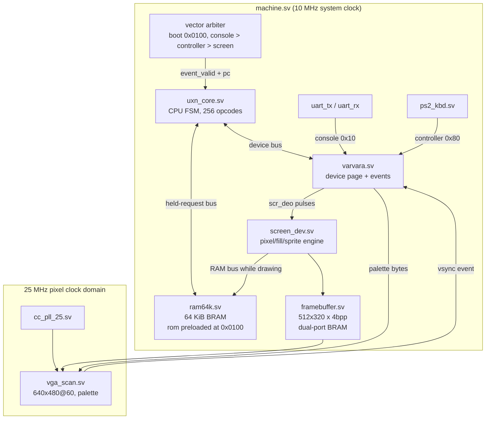
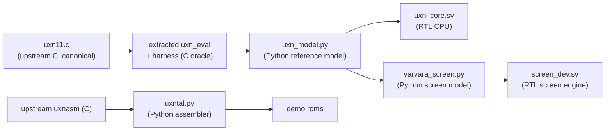

# Uxn Computer

This project implements a complete Uxn/Varvara computer — CPU, memory, console, keyboard, clock, and display — in the FPGA fabric of an Olimex GateMateA1-EVB, using only open-source tools. The CPU is a hardware realization of the Uxn stack machine specified by Hundred Rabbits: 32 base operations, two 256-byte stacks, a flat 64 KiB address space, and a 256-byte device page that connects the machine to its peripherals. The project follows the same methodology as the earlier MATE-16 and PCA GateMate projects: an executable reference model, a bit-identical assembler, a multi-cycle RTL core, and differential testing at every layer.

> [!summary]
> The project has three defining properties:
> 1. a full Uxn CPU executing all 256 opcode encodings directly in FPGA logic, verified instruction-by-instruction against an extracted C oracle
> 2. a Varvara device layer — UART console, PS/2 keyboard, uptime clock, VGA screen with the complete sprite blending semantics — driven by a serialized vector arbiter
> 3. a verification chain in which every hardware bug found in this project was caught by a differential test, never by inspection alone

## Why this project exists

Uxn is a portable computing target created by Devine Lu Linvega (neauoire) of Hundred Rabbits. Instead of porting applications to each operating system, the Hundred Rabbits software stack (the *Left* text editor, *Nasu* sprite editor, *Orca* sequencer) targets one small virtual machine that can be implemented anywhere in a few thousand lines of code. The VM is deliberately small enough that a complete implementation fits in an FPGA alongside its peripherals, which turns it into a well-bounded hardware project: the entire architectural specification is one C function (`uxn_eval` in `uxn11.c`, roughly 90 lines), and any deviation between hardware and specification is measurable.

The engineering goal of this project is a computer that boots a Uxn rom on real hardware, prints on a serial console, reads a PS/2 keyboard, and draws on a VGA monitor — with every layer verified in simulation before it reaches the board.

## Current project status

The project is implemented through the device layer (phases P1–P4 of the ticket plan complete) and the screen engine is functionally verified against a Python model of the drawing semantics. Remaining work is the animated screen-vector demo (a 60 Hz event-dispatch issue under investigation), board-level integration, synthesis and place-and-route for the full system, and hardware bring-up.

What exists today:

- `uxn/tools/` — an opcode table, a bit-exact Python reference model of the CPU, a Uxntal assembler whose output is byte-identical with upstream `uxnasm`, and a Python model of the screen device
- `uxn/rtl/` — `uxn_core.sv` (CPU FSM), `ram64k.sv`, `varvara.sv` (device system), `machine.sv` (event arbiter), `uart_tx.sv`/`uart_rx.sv`, `ps2_kbd.sv`, `framebuffer.sv`, `screen_dev.sv`, `vga_scan.sv`, `cc_pll_25.sv`
- `uxn/programs/` — `hello.tal`, `echo.tal`, `keys.tal`, `count.tal`, `bounce.tal`, `draw.tal` (screen-op torture test), `torture.tal` (assembler rune coverage)
- `uxn/sim/` — four pytest suites: toolchain unit tests, RTL-vs-model CPU differential, machine-level peripheral tests, screen framebuffer differential
- a ticket workspace (`ttmp/2026/08/30/UXN-GM-001--*`) with an intern-grade design document, a chronological diary, and 26 numbered investigation scripts
- vendored reference sources in `sources/uxn/` (uxn11 emulator, upstream uxnasm, prjpeppercorn PS/2 and VGA reference designs) plus a compiled C oracle harness around the verbatim extracted `uxn_eval`

## Project shape



The system is a two-clock design. The CPU, devices, and draw engine run at the board's 10 MHz oscillator frequency; the VGA scanner runs at 25 MHz from an on-chip PLL. The only signal crossing domains is the framebuffer (a true dual-port block RAM with one port per domain) and the vsync event, which is synchronized into the system clock by a two-flop synchronizer.

## Architecture

### The Uxn machine model

The entire architectural state is: a 16-bit program counter (starts at `0x0100` because roms are loaded into RAM at that address), two 256-byte stacks with 8-bit count pointers that wrap modulo 256, 64 KiB of byte-addressed memory holding both program and data, and a 256-byte device page. There are no general-purpose registers and no interrupt system; control flow between the CPU and its devices is cooperative and vector-based.

Every opcode byte decomposes into a 5-bit base operation and three mode bits: `0x20` selects short (16-bit) operands, `0x40` selects the return stack as the operand stack, and `0x80` suppresses the operand pop (keep mode). The 25 base operations other than `BRK` combine with 8 mode combinations to fill 248 of the 256 encodings; the remaining 8 encodings are immediates that shadow `BRK`'s mode-bit slots: `JCI` (jump conditional immediate), `JMI` (jump immediate), `JSI` (call immediate), and the four `LIT` variants that push the following operand bytes onto a stack.

The machine executes one vector at a time. A device event (a received console byte, a key press, a vertical blank) writes its ports into the device page and invokes the vector stored at that device's vector port. When the program executes `BRK`, the CPU returns to idle until the next event. A write of a nonzero value to `System/state` (port `0x0f`) stops further event dispatch.

### The CPU as a multi-cycle FSM

`uxn_core.sv` implements the CPU as a 12-state machine: fetch, decode, push-queue drain, immediate fetch, and read/write states for memory and device transactions. The bus contract is the held-request pattern proven in the MATE-16 project: the master raises a request with stable address and data fields, the slave answers with a single-cycle ready pulse, and at most one transaction is outstanding. This contract is what makes the differential test well-defined — every architectural state change happens at an identifiable cycle.

The most important structural decision in the core is the push queue. Every operation's effect reduces to one uniform sequence, mirroring the reference implementation's evaluation order: read operands `x`, `y`, `z` from the operand stack without popping; pop `k1` or `k2` bytes unless in keep mode; then push zero to six result bytes to a single target stack at the popped base. The queue drains one byte per cycle, which keeps the stack memories single-write-port and makes operation ordering exactly reproducible.

Operand addressing follows the reference implementation precisely, including its non-obvious cases: `LDA` and `STA` always consume a full 16-bit address even in byte mode; `LDZ` and `STZ` wrap their second byte at the 256-byte zero-page boundary; `JCN`'s condition byte sits at a different depth in short mode than in byte mode; comparisons push a byte result even in short mode; `DEI2` reads two ports with the first read's side effects visible to the second; and `DEO2` writes its high byte to the device page without triggering that port's side-effect handler.

### The device system and event arbitration

`varvara.sv` implements the device page as a 256-byte register file with live read overrides and deferred side effects. Its device-bus handshake is a two-phase transaction: the port, write-enable, raw flag, and data are latched in one cycle, and the effects are applied in the next cycle when the serve condition holds. The serve condition is where backpressure lives: writes to console ports stall while the UART transmit FIFO is full, and writes to screen ports stall while the draw engine is busy. No byte is ever dropped; the CPU simply waits inside its `DEO` instruction.

`machine.sv` contains the vector arbiter, which serializes events exactly as an emulator's main loop would: the reset vector `0x0100` fires once after reset; afterwards, pending console, controller, or screen events are dispatched one at a time, each writing its event data into the device page, invoking the vector if it is nonzero, and performing post-vector cleanups (clearing the transient `Controller/key` byte) when the vector returns.

### The screen engine

`screen_dev.sv` implements the current Varvara screen semantics: a 512×320 framebuffer with two independent 2-bit layers per pixel, composited at scanout as `fg != 0 ? fg : bg` into a four-entry palette defined by the `System/r`, `System/g`, `System/b` shorts. Pixel operations write or fill (by quadrant, to the screen edge) a single layer value. Sprite operations read 8 or 16 bytes from main memory and paint an 8×8 tile through a fixed 16×2×4 blend table, with horizontal and vertical flips, per-tile auto-advance in either axis, automatic address advance, and up to 16 tiles per operation.

The engine takes mastership of the main RAM bus while drawing, which is safe because the CPU is at that moment stalled inside its own device handshake. Per-pixel clipping to the 512×320 window handles the signed 16-bit coordinate space, including partially off-screen sprites.

## Implementation details

### Verification chain

The project's central method is a chain of oracles, each validated against the one below it:



The C oracle is the verbatim extracted `uxn_eval` from `uxn11.c` compiled with a harness that loads a rom, runs it, and dumps stack pointers, both stacks, and FNV-1a hashes of the full RAM and device page. The Python model is a line-by-line port of the same function; a fuzz harness generates random-but-valid programs (stack-seeded literals, straight-line random opcodes over all 256 encodings) and compares every observable. The RTL differential harness runs the same programs through an iverilog testbench and compares the retired instruction trace and final state byte-for-byte against the model.

The screen differential works the same way: the Python model records every screen-port write (including the raw high-byte half of `DEO2` writes, which the RTL engine also observes), replays them into a Python implementation of the drawing semantics, and compares the resulting 81,920-byte framebuffer with the RTL dump.

### Memory organization

The 64 KiB main memory is a single block RAM initialized at synthesis from a full-size `$readmemh` image produced by the assembler; this matches how every Uxn emulator loads a rom (the file is raw program bytes placed at `0x0100`, and the zero page below it is scratch space). The framebuffer is 80 KiB organized as 256 bytes per row with two pixels per byte; a pixel's byte address is `{sy[8:0], sx[8:1]}`, which needs no adder. The two stacks live in fabric (flip-flops and multiplexers) because this Yosys flow does not infer distributed RAM for asynchronous-read memories — the stacks need three simultaneous read ports for operand peeks, which block RAM cannot provide and LUTRAM inference does not support here.

### Instruction sequencing example

The `DEO2` path illustrates the FSM's operation:

```
S_FETCH   ram[pc] -> ir (opcode 0x37 = DEO2), pc++
S_DECODE  x = port byte (depth 1), y = value short (hi depth 3, lo depth 2)
          pop 3 bytes; dport1 = port, dport2 = port+1 (Uint8 wrap)
          wbyte1 = y>>8 (raw: no side effect), wbyte2 = y&0xff
S_WRITE1  device write port, raw        -> ready
S_WRITE2  device write port+1, side effect -> ready, retire
```

The raw flag exists because the reference implementation writes a `DEO2` high byte directly into the device array without calling the side-effect handler; a `DEO2` to `Screen/x` must not be interpreted as a drawing operation, but the engine must still observe it to shadow the register's high byte.

## Common failure modes found

Every hardware bug in this project was caught by a differential or directed test. The significant ones:

- **C macro operator precedence.** The reference implementation's operand macros read as if a short operand's low byte sits at stack depth `o2+1`; because the macro body lacks parentheses, the preprocessor produces `ptr-o2+1`, which is depth `o2-1`. Reading the source naively produces wrong operand depths for `STZ`/`STR`/`DEO`/`SFT` short modes. The preprocessed expansion (`cc -E`) is the only trustworthy reading; the extracted C oracle settled three such ambiguities in minutes.
- **Vacuous fuzz.** The first fuzz run "passed" 1050 programs because the generator emitted roms with a 256-byte zero prefix; both model and oracle executed `BRK` at `0x0100` immediately and compared identical unexecuted state. A rom file is raw program bytes — the zero page exists only in the emulator's memory. Directed tests exposed the vacuity; the fixed fuzz then found three real model bugs in minutes.
- **Lowercase-only hex in uxnasm.** `ADD2` is a mnemonic, but `add2` would be a raw short, because the assembler's hex alphabet is lowercase-only. Porting the assembler required matching this exactly for byte-identical output.
- **PS/2 clock filter edge.** The ported PS/2 receiver fired its bit-sampling edge twice per falling clock transition in simulation (once when the newest 8 samples were all low, again when all 9 were), double-sampling every bit. The fix samples on the unique pattern where the newest 8 samples are low and the oldest is still high.
- **Event pulse loss.** The draw engine's busy signal rose one cycle after the screen-port write pulse that started it, leaving a one-cycle window in which a following screen write could be served, its pulse arrive while the engine had already left idle, and the write be lost. The fix asserts busy combinationally during the pulse.
- **Cross-master bus ready sharing.** While the draw engine owned the RAM bus, the shared RAM `ready` pulses belonged to engine transactions, but the stalled CPU in its fetch state observed them and latched sprite-data bytes as opcodes, executing garbage. The fix gates the CPU's view of `ready` with the engine's busy signal.

## Current user-facing commands

From the repository root with the OSS CAD Suite environment sourced:

```bash
python3 -m pytest uxn/sim -q                    # all test suites (~15 min)
python3 -m uxn.tools.uxntal file.tal out.rom    # assemble
python3 -m uxn.tools.uxntal file.tal out.rom --hex out.hex
```

The ticket scripts run the differential harnesses directly:

```bash
python3 ttmp/2026/08/30/UXN-GM-001-*/scripts/01-model-oracle-difftest.py --n 200 --seed 1
python3 ttmp/2026/08/30/UXN-GM-001-*/scripts/02-rtl-difftest.py --n 25 --seed 1
```

## Important project docs

- Design document (intern-grade, all port maps and decision records):
  `ttmp/2026/08/30/UXN-GM-001--uxn-varvara-computer-on-the-gatematea1-evb/design-doc/01-uxn-computer-design-and-implementation-guide.md`
- Investigation diary (chronological, includes every failure verbatim):
  `ttmp/2026/08/30/UXN-GM-001--uxn-varvara-computer-on-the-gatematea1-evb/reference/01-investigation-diary.md`
- Vendored semantic oracle: `sources/uxn/uxn11/src/uxn11.c`, extracted oracle harness `sources/uxn/oracle/`

## Open questions

- The screen vector (60 Hz vsync event) dispatch does not yet produce framebuffer output in the machine-level bounce test; the event path is under investigation with the archived debug testbenches.
- Synthesis of the full machine measures roughly 70% LUT utilization and 11.1 MHz maximum frequency against a 10 MHz board clock. Place-and-route at that utilization with `router2` is slow (over 30 minutes); whether timing closes after adding the VGA output pins is open.
- Full-screen fill operations cost three cycles per pixel (about 50 ms per full screen at 10 MHz), which is far slower than any emulator. Programs that repaint the full screen every frame will not sustain 60 Hz without a faster fill path.

## Near-term next steps

- Resolve the screen-vector event dispatch and land the `bounce.tal` machine test.
- Board integration: `top.sv`, pin constraints for the PS/2 and VGA connectors, synthesis, place-and-route, bitstream, and on-board bring-up of the demo roms.
- If area or timing gets tight, the two prepared mitigations are a sequential divider (the combinational `DIV` is a large share of the LUT budget) and a reduced-port stack read path.

## Project working rule

Every layer gets an executable oracle before it gets an implementation, and every implementation is only believed after a differential test says so. When the reference is C, extract it and compile it rather than reading it; when the reading and the compiled behavior disagree, the compiled behavior wins.
