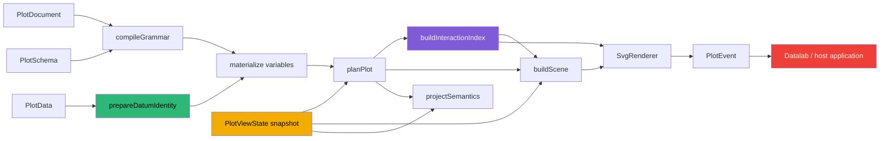
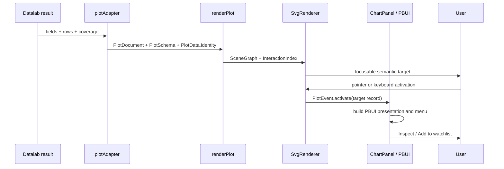

# PROJECT REPORT - Hyperslop Plot - Stable Identity, Semantic Interaction, and Immutable View State

A plot becomes an interactive analytical system only when an event can preserve meaning across data reorder, statistical transformation, coordinate projection, rendering, application routing, and a later render. A pointer coordinate is not enough. A copied row is not enough. A scene-node index is not enough. Each of those values describes one transient stage of rendering, while product interaction needs a stable reference to the analytical datum or derived result that the mark represents.

This report explains the interaction architecture implemented in HSPLOT-011 for `@hyperslop-systems/plot`. The work replaced positional `PlotHit` payloads with stable source and derived datum identities, a canonical semantic target index, renderer-neutral events, immutable runtime view state, explicit scale and coordinate inversion, and pointer/keyboard-equivalent brushing. It then proved the package boundary against Datalab: 360 stable semantic datum targets drove an application-owned inspection menu without introducing PBUI actions, Redux state, or physical row copies into Plot.

The report begins from the completed Plot 0.3 architecture described in [[PROJ - Hyperslop Plot - Building a Frontend Grammar of Graphics as a Staged Compiler]] and [[PROJECT REPORT - Hyperslop Plot v0.2 - From Grammar to Published PBUI Runtime]]. It focuses on what changed after the grammar, compiler, planner, semantics model, scene graph, and Plot 0.3 package boundary were stable.

> [!summary]
> - Stable datum identity is declared over logical `FieldId` values before variable projection. Row order, display labels, and scene positions never define semantic identity.
> - Derived statistical rows carry deterministic identities and bounded public lineage. Full lineage remains available inside the transformation chain without entering serialized output.
> - Scene nodes carry only opaque target IDs. Semantic values, identities, bounds, and panel navigation live in one sorted JSON-safe `InteractionIndex`.
> - `PlotViewState` is immutable runtime input outside `PlotDocument`. It controls visible domains, focus, hover, selection, and brush state without mutating grammar bytes.
> - Pointer and keyboard brushing use the same semantic selection builder. Brush events contain device bounds, scaled bounds, stable target IDs, and stable datum IDs.
> - Datalab owns inspection verbs and physical-field lookup. Plot reports semantic facts and never decides which product action follows an event.

## 1. The problem: rendering identity is not analytical identity

The pre-HSPLOT-011 implementation attached a `PlotHit` object directly to interactive scene nodes. Source marks used a key derived from the row index. The React host exposed `onHit`, and the SVG renderer emitted the copied payload when a user clicked or pressed Enter.

That design supported immediate activation, but its identity semantics were unstable. Consider a row at index 17. After sorting, filtering, streaming replacement, or a different query window, index 17 may refer to another observation. A product that stores the hit as a selection would then highlight a different datum on the next render. The visible interaction could appear correct during one frame while violating continuity across frames.

The failure is more severe for statistical output. A mean, density sample, regression fit, boxplot summary, or histogram bin does not correspond to one source row. Assigning one row index to such a mark discards the relationship between the derived result and its contributing observations. Copying the complete source rows into every scene node would preserve too much data, duplicate memory, expose application columns through renderer contracts, and still fail to define a stable derived identity.

A useful interaction model therefore needs explicit answers to five questions:

1. Which logical source datum does a mark represent?
2. Which source datums contributed to a derived statistical datum?
3. Which semantic target does a scene primitive address?
4. Which runtime view state should survive a render without becoming grammar?
5. How does device-space interaction become a renderer-neutral analytical event?

HSPLOT-011 answers these questions in separate layers. The separation is deliberate. Source identity, statistical provenance, target identity, view state, and product action have different owners and different lifetimes.

## 2. The completed architecture

The public render request now combines persistent analytical description with explicit runtime input:

```ts
interface PlotRequest {
  readonly document: PlotDocument;
  readonly schema: PlotSchema;
  readonly data: PlotData;
  readonly viewport: Viewport;
  readonly view?: PlotViewState;
}
```

The outcome exposes every stable intermediate result required by renderers, readers, tests, and host applications:

```ts
interface PlotOutcome {
  readonly grammar: NormalizedGrammar | null;
  readonly plan: PlotPlan | null;
  readonly scene: SceneGraph | null;
  readonly semantics: PlotSemantics | null;
  readonly interactions: InteractionIndex | null;
  readonly view: PlotViewState;
  readonly diagnostics: readonly Diagnostic[];
}
```

The execution order is significant:



Identity preparation occurs before variable materialization and statistical transformation. Planning receives a snapshot of view state. The interaction index is built from the normalized grammar and complete plan before scene rendering. Scene construction receives the index only to attach opaque target IDs and interaction state; it does not copy semantic records into nodes. The renderer resolves target IDs through the index and emits typed events.

This is still one compiler path. There is no interactive compiler, no compatibility renderer, and no alternate document. Interaction adds structured runtime products to the established grammar-to-plan-to-scene path.

## 3. Stable source datum identity

### 3.1 Identity is declared by the data provider

A source dataset declares the logical fields that uniquely identify each row:

```ts
interface PlotData {
  readonly rows: readonly PlotRow[];
  readonly coverage: DataCoverage;
  readonly identity?: {
    readonly fields: readonly FieldId[];
  };
}
```

The declaration uses `FieldId`, not display names and not physical columns. The schema resolves each stable field ID to the current physical row property. This preserves the distinction established by the compiler architecture:

| Representation | Purpose |
|---|---|
| `FieldId` | Stable logical identity across schema projection and naming changes. |
| `field.column` | Physical property used to read the current row object. |
| `field.name` / `field.label` | Human-readable authoring and presentation text. |

The provider chooses the tuple because uniqueness is a property of the dataset, not a property Plot can infer safely. A dedicated source ID is ideal when one exists. A complete result-row tuple is valid for a table-shaped result when duplicate complete rows are not meaningful independent observations.

Datalab originally declared only the plotted x and y fields. Its fixture contains repeated x/y pairs for different stations and times, so identity validation correctly rejected duplicates. The corrected adapter includes every stable result field in `PlotSchema` and declares a sorted identity tuple over those field IDs. The failure exposed a precise rule: visual encoding fields describe appearance; identity fields describe row uniqueness.

### 3.2 Canonical primitive encoding

Each identity value must be a JSON primitive or a valid `Date`. Dates become ISO strings. Non-finite numbers and arbitrary objects are rejected. Primitive values are encoded with their types before hashing:

```ts
function encodedPrimitive(value: JsonPrimitive): [string, JsonPrimitive] {
  return [value === null ? "null" : typeof value, value];
}
```

This prevents values such as numeric `1` and string `"1"` from collapsing into the same canonical tuple. The source identity input includes both each `FieldId` and the typed value:

```text
source identity input = [
  [fieldIdA, [typeA, valueA]],
  [fieldIdB, [typeB, valueB]],
  ...
]
```

A deterministic 128-bit hexadecimal digest produces an opaque ID with a namespace prefix:

```text
source:73ac434236a987d1b84f7ed93fbfbd8f
```

The digest is an efficient runtime identity, not a security primitive. Duplicate canonical tuples are diagnosed before hashing, so the normal collision boundary is explicit rather than silently accepted.

### 3.3 Validation is strict

Identity validation reports structured errors for:

- an empty identity field list;
- a repeated field in the declaration;
- an unknown field ID;
- a non-primitive or invalid row value;
- duplicate identity tuples across rows.

The compiler does not replace a missing or invalid identity with row position. When no identity is declared, ordinary rendering continues, but data-mark interaction targets are suppressed and a warning explains why. This preserves noninteractive plotting without giving unstable IDs semantic authority.

### 3.4 Stability under reorder and filter

A source ID depends only on stable field IDs and typed row values. Therefore:

```text
identity(row, schema) == identity(row, reorderedRows, schema)
identity(row, schema) == identity(row, filteredRowsContainingRow, schema)
```

Tests reverse input rows and compare identities. They also filter the dataset and verify that retained observations preserve their IDs. This is the minimum required for selection continuity. A selected datum must remain selected when unrelated rows change position or disappear.

## 4. Derived identity and statistical lineage

### 4.1 Why derived rows require a separate identity form

A derived row is defined by more than its displayed coordinate. Two regression groups can produce the same fitted y value at the same x value while representing different source populations. Two bins can have the same count while covering different intervals. A mean can remain numerically equal after source membership changes.

The derived identity includes:

- the statistic kind;
- a semantic group key;
- an output key for the specific derived row;
- the sorted complete set of contributing source datum IDs.

```ts
interface DerivedDatumIdentity {
  readonly kind: "derived";
  readonly id: DatumId;
  readonly statistic: string;
  readonly groupKey: readonly JsonPrimitive[];
  readonly outputKey: readonly JsonPrimitive[];
  readonly sources: readonly DatumId[];
  readonly sourceCount: number;
  readonly sourcesTruncated: boolean;
}
```

The opaque derived ID is calculated from all contributing sources, not from the bounded public list. Reversing source order does not change the result because lineage IDs are deduplicated and sorted before canonical encoding.

### 4.2 Bounded public lineage

A density curve or regression fit can include thousands of source rows. Copying complete lineage into every derived target would make output size proportional to `derived rows × source rows`. HSPLOT-011 bounds public lineage to 256 IDs:

```ts
export const MAX_LINEAGE_SOURCES = 256;
```

The record remains honest because it also exposes:

```text
sourceCount       = complete number of contributing source IDs
sourcesTruncated  = sourceCount > 256
sources           = first 256 IDs in deterministic sorted order
```

A consumer can distinguish complete lineage from a sample. It can display provenance counts, request additional details from application state, or avoid claiming that the public list is exhaustive.

### 4.3 Complete lineage inside chained transforms

Bounded public lineage is not enough for a second statistical transform. If transform B derives from rows produced by transform A, hashing only A's first 256 public sources could make distinct full populations appear identical.

The implementation therefore attaches two symbol-keyed properties to internal rows:

```ts
const DATUM_IDENTITY = Symbol("hs.plot.datumIdentity");
const DATUM_LINEAGE = Symbol("hs.plot.datumLineage");
```

`DATUM_IDENTITY` contains the public source or derived record. `DATUM_LINEAGE` retains complete sorted source IDs for subsequent internal derivation. Symbol properties survive object spread in the transformation path, while `Object.entries`, ordinary value projection, and JSON serialization omit them.

This is an internal provenance mechanism, not a hidden public behavior. Its purpose and omission rules are tested and documented. Public output remains bounded and serializable; chained derivation remains correct.

### 4.4 Statistic-specific lineage

Each statistic assigns lineage according to its actual computation:

- Identity rows preserve their source identity.
- Histogram bins derive from rows assigned to that bin. Empty bins use statistic/group/output keys with zero sources.
- Means and summary intervals derive from all rows in the group.
- OLS fitted rows derive from all rows used to fit that group model.
- Boxplot rows derive from all rows used for quartiles and whiskers.
- Density samples derive from all rows used by the kernel estimate for that group.

The statistical algorithms remain focused on numerical computation. Identity is attached when each output row is created, using the group and output values already known by the transform.

## 5. From scene-owned hits to a semantic interaction index

### 5.1 The hard cut

HSPLOT-011 removed these APIs without aliases:

```text
PlotHit
onHit
renderInteractive
scene.interaction
copied arbitrary row values in scene nodes
physical legend columns in Plot records
```

They were replaced by:

```text
PlotTargetId
InteractionTargetRecord
InteractionIndex
PlotEvent
onEvent
renderTarget
scene.targetId
```

The change is structural. A scene primitive now says only which semantic target it represents. The complete target record lives in a separate canonical index.

```ts
interface InteractionIndex {
  readonly targets: readonly InteractionTargetRecord[];
  readonly panels: readonly PanelNavigation[];
}
```

The arrays are sorted deterministically and survive `JSON.stringify` / `JSON.parse` without a custom codec. A private `Map` may be used during construction or lookup, but no `Map` crosses the output boundary.

### 5.2 Target kinds

The current model defines mark, legend, and panel targets:

```ts
type InteractionTarget =
  | {
      kind: "mark";
      id: PlotTargetId;
      layerId: LayerId;
      panelId: string;
      datumIds: readonly DatumId[];
      groupKey: string;
    }
  | {
      kind: "legend";
      id: PlotTargetId;
      guideId: string;
      fieldId: FieldId;
      value: string | number;
      label: string;
    }
  | {
      kind: "panel";
      id: PlotTargetId;
      panelId: string;
      label: string | null;
    };
```

Each target ID hashes the stable document, panel, layer, group, identity, or guide facts that define the target. It does not hash device coordinates. Resizing a plot can change bounds while preserving target identity.

### 5.3 Semantic target records

A target record adds the facts needed for inspection and selection:

```ts
interface InteractionTargetRecord {
  readonly target: InteractionTarget;
  readonly identities: readonly DatumIdentity[];
  readonly semanticValues: Partial<Record<VariableId, JsonPrimitive>>;
  readonly coordinateValues?: Partial<Record<"x" | "y", JsonPrimitive>>;
  readonly deviceBounds: Rect;
}
```

`semanticValues` uses normalized grammar `VariableId`s. This avoids sending application row objects through the renderer. For grouped geometry, a semantic value is included only if all group members share it. A singleton point can expose its x/y coordinate values directly; a line containing many values cannot pretend to have one x/y pair.

The distinction among values is useful:

| Record field | Meaning |
|---|---|
| `identities` | Which source or derived analytical datums the target represents. |
| `semanticValues` | Which normalized grammar variables have a common value across the target. |
| `coordinateValues` | The singleton x/y values when the target corresponds to one datum. |
| `deviceBounds` | Where the target exists in the current rendered viewport. |

### 5.4 Group geometry and target cardinality

A point or bar usually represents one datum. A line, area, or ribbon group represents several. The target builder handles geometry cardinality explicitly:

- point bounds expand from the center by radius;
- bar bounds use its rectangle or projected polygon;
- line bounds cover all points and include half the stroke width;
- area bounds include the path and baseline;
- ribbon bounds include lower and upper paths;
- error-bar bounds include interval and caps;
- boxplot bounds include box and whiskers.

A grouped target contains sorted member identities and one group key. It does not create a misleading singleton identity. The scene independently derives the same opaque target ID and attaches it to the rendered group.

## 6. Renderer-neutral events

The host event contract is a discriminated union:

```ts
type PlotEvent =
  | {
      kind: "activate";
      target: InteractionTargetRecord;
      source: "pointer" | "keyboard";
    }
  | { kind: "hover"; target: InteractionTargetRecord | null }
  | { kind: "focus"; target: InteractionTargetRecord | null }
  | { kind: "brush"; selection: BrushSelection | null }
  | { kind: "view-change"; view: PlotViewState };
```

The renderer reports interaction facts. It does not report a requested product command. There is no event named `open-inspector`, `filter-station`, `dispatch-action`, or `add-watchlist`. Datalab decides what activation means for its current presentation context.

Pointer and keyboard activation resolve the same `PlotTargetId` through the same index. The only intentional difference is `source`. This allows product policy to distinguish input modality when necessary without creating different analytical meanings.

Hover and focus also use the same target records. A tooltip, focus announcement, keyboard reader, or linked highlight can consume one semantic object regardless of how the user reached it.

## 7. Immutable runtime view state

### 7.1 Grammar and view describe different facts

`PlotDocument` describes durable visual intent: mappings, layers, statistics, scales, coordinates, facets, guides, and annotations. A user zooming into a time range does not change that intent. It changes the current view.

HSPLOT-011 therefore keeps view state outside the serialized grammar:

```ts
interface PlotViewState {
  readonly domains?: Partial<Record<"x" | "y", ViewDomain>>;
  readonly hovered?: PlotTargetId;
  readonly focused?: PlotTargetId;
  readonly selection?: readonly DatumId[];
  readonly brush?: BrushState;
}
```

This boundary has practical consequences:

- Persisting or sharing a view is an explicit host decision.
- Reusing one `PlotDocument` across view states does not require document mutation.
- A filter remains new `PlotData`, not a disguised view operation.
- Grammar equality and document serialization remain stable during interaction.

### 7.2 Boundary snapshotting

The request may contain caller-owned arrays. `snapshotPlotViewState` clones domains, selections, and brush ranges before planning. If the caller mutates its array after `renderPlot` returns, the outcome does not change.

This prevents temporal coupling between application state containers and deterministic plot output. Tests mutate the original arrays and verify that outcome bytes remain stable.

### 7.3 Logical domain windows

A view domain can be continuous or categorical:

```ts
type ViewDomain =
  | { kind: "continuous"; domain: readonly [number, number] }
  | { kind: "categorical"; domain: readonly string[] };
```

Continuous windows support quantitative, temporal, and logarithmic scales. Categorical windows select an ordered subset of a band domain. Validation checks:

- finite increasing continuous bounds;
- positive bounds for logarithmic scales;
- nonempty categorical domains;
- no repeated categorical values;
- compatibility with the scale family;
- containment within the complete trained or explicit domain.

The planner first obtains the complete domain, validates the runtime window against it, then trains panel ranges using the accepted visible domain. Invalid view input produces diagnostics and no plan or scene. It does not silently clamp a semantically invalid request.

### 7.4 Clipping without filtering

A zoom window should not delete source geometry. A line segment can begin outside the visible x domain and cross into the panel. Filtering the source rows before geometry would remove the segment and produce the wrong boundary shape.

The planner retains complete geometry and emits deterministic panel clip records. Scene marks reference clip IDs, and SVG renders `<clipPath>` resources. This preserves crossing geometry while preventing marks from painting outside the panel.

The first implementation wrapped marks in additional scene groups. Existing scene-shape tests and an architecture guard rejected the resulting structural and dependency changes. Clip resources and per-mark references solved the same requirement without changing established root-node topology.

## 8. Inverting scales and coordinates

Brushing begins in device coordinates. Product state needs logical coordinates and stable identities. The reversible path is:

```text
device point
  -> inverse coordinate transform
  -> Cartesian panel point
  -> inverse x/y scales
  -> semantic scaled values
```

### 8.1 Scale inversion

The implementation supports:

- linear and temporal continuous inversion;
- logarithmic inversion through the logarithmic transformed domain;
- band inversion to the category occupying a device coordinate.

Inversion returns `null` for coordinates that cannot produce a valid value. It does not extrapolate arbitrary semantic facts from invalid ranges.

### 8.2 Coordinate inversion

Cartesian coordinates invert directly. Transpose first reverses the coordinate swap. Supported polar coordinates reverse radius and angle transformations before scale inversion.

The center of a polar coordinate system has no unique angle. The implementation returns `null` at this singularity. This result is more accurate than choosing an arbitrary category or angular value and presenting it as analytical truth.

Round-trip tests apply forward projection and inverse projection within numerical tolerance. Additional tests cover transpose and polar singular behavior.

### 8.3 Panel navigation records

The interaction index includes panel navigation metadata:

```ts
interface PanelNavigation {
  readonly panelId: string;
  readonly deviceBounds: Rect;
  readonly coordinate: CompiledCoordinate;
  readonly xScale: PositionScale;
  readonly yScale: ContinuousScale;
}
```

This data is renderer-neutral and JSON-safe. An SVG host, a future Canvas host, a keyboard controller, or a reader model can invert coordinates without recovering scales from DOM attributes.

## 9. Semantic brushing

### 9.1 Brush selection output

A brush selection preserves both current rendering facts and analytical references:

```ts
interface BrushSelection {
  readonly panelId: string;
  readonly mode: "x" | "y" | "xy";
  readonly deviceBounds: Rect;
  readonly scaledBounds: Partial<Record<"x" | "y", ViewDomain>>;
  readonly targetIds: readonly PlotTargetId[];
  readonly datumIds: readonly DatumId[];
}
```

`deviceBounds` supports immediate rendering. `scaledBounds` supports view updates and analytical display. `targetIds` identify current semantic marks. `datumIds` support linked selection across views that share identity semantics.

The selection algorithm is deterministic:

```text
function createBrushSelection(index, panelId, rawBounds, mode):
    panel = resolve panel navigation record
    directionalBounds = expand x-only or y-only selection across panel
    deviceBounds = clamp directionalBounds to panel
    corners = invert relevant device corners
    scaledBounds = build continuous or categorical logical ranges
    targets = mark targets in panel whose bounds overlap deviceBounds
    targetIds = sorted unique target IDs
    datumIds = sorted unique datum IDs from targets
    return immutable selection record
```

Target-bound selection avoids pretending that every point inside a rectangle maps to a source row. The scale inversions describe the analytical interval; the target index describes the rendered semantic instances intersecting that interval.

### 9.2 Pointer behavior

The SVG host tracks pointer start, movement, and completion. It captures the pointer so a drag remains coherent when the pointer leaves the initial element. Completion releases capture and emits the final semantic selection. Cleanup cancels transient state and releases resources when the component unmounts.

The final brush remains part of explicit view state and renders as a persistent overlay. The renderer does not mutate the document or store product selection independently.

### 9.3 Keyboard equivalence

A pointer rectangle without a keyboard path would leave the feature incomplete. Each panel exposes a focusable brush control. Arrow keys move the current range; modifier-assisted commands extend it. Both pointer and keyboard paths call the same selection builder and emit the same `PlotEvent` shape.

This is stronger than implementing two event formats and asserting that they are similar. There is one semantic construction path. Input handling supplies bounds; semantic selection code supplies scaled values and stable identities.

### 9.4 Non-color selection state

Selected marks receive more than a color change. Scene and SVG output expose explicit selected state, alter geometric emphasis such as stroke width or opacity, and set `aria-pressed` on interactive targets. Hover and focus have their own state attributes.

The accessibility contract is therefore inspectable in tests and browser snapshots. Assistive technology does not need to infer selection from a palette.

## 10. Datalab product integration

### 10.1 Application ownership remains explicit

Datalab's adapter projects application results into Plot contracts. Its `ChartPanel` receives semantic target records and maps them into PBUI presentation objects and verbs. Plot never imports PBUI.



The target record exposes stable analytical field IDs and values. Datalab performs any physical-field lookup required by its own query or filtering model. This retains the rule established during Plot 0.3 convergence: Plot owns analytical identity; applications own executable product state.

### 10.2 Complete result identity

The Datalab adapter now includes all result fields in `PlotSchema`, even when display names repeat. Stable `FieldId`s distinguish them. It sorts identity fields deterministically and declares the complete tuple on `PlotData`.

The adapter test asserts two product-level facts:

1. Rendered outcomes contain interactive mark targets.
2. Diagnostics do not contain the missing-identity warning.

This catches the earlier failure where a chart still painted correctly but had no valid semantic marks.

### 10.3 Browser proof

The final product proof used a packed Plot artifact installed into a clean archived Datalab workspace. The `ChartPanel -- points` Storybook specimen contained:

```text
360 semantic datum targets
360 focusable datum targets
stable VariableId/value labels on each target
```

Activating a rendered datum opened Datalab's application-owned menu with `Inspect` and `Add to watchlist`. Invoking `Inspect` increased the application verb log from zero to one. The only console error was a static-server `favicon.ico` 404; no application error occurred.

This proof matters because unit tests can establish event shape but cannot establish ownership across the packed package boundary. The browser test demonstrated that:

- Plot generated stable identities and semantic records;
- SVG exposed an accessible interaction surface;
- `PlotHost` emitted a renderer-neutral event;
- Datalab interpreted the target;
- PBUI presented product actions;
- the product action executed without being encoded in Plot grammar or scene data.

## 11. Determinism and serialization

Interaction and view state are useful outside React only if their representation is stable. HSPLOT-011 enforces several determinism rules:

- Source IDs encode ordered declared field IDs and typed values.
- Derived lineage is deduplicated and sorted.
- Derived IDs use complete lineage, statistic, group, and output keys.
- Target IDs use stable document, panel, layer, group, identity, or guide facts.
- Interaction target and panel arrays have deterministic ordering.
- Brush target and datum arrays are sorted and unique.
- View state is copied at the render boundary.
- Equal requests produce byte-identical complete outcomes.
- Interaction indexes and view state round-trip through JSON.

No canonical contract uses `Map`. Internal maps are permitted for indexing or deduplication because they do not cross the serialization boundary.

The distinction between deterministic output and deterministic layout is also important. A resize changes device bounds and scene coordinates, but it does not change stable source, derived, or target identity. The semantic object remains the same while its current projection changes.

## 12. Failure modes and the resulting rules

### 12.1 Positional fallback creates false continuity

A row index can support internal drawing keys for a noninteractive plot. It cannot become a semantic datum ID. HSPLOT-011 warns and suppresses mark targets when identity is absent.

### 12.2 Visual fields do not necessarily identify rows

Datalab's repeated x/y pairs proved that plotted fields and identity fields answer different questions. Declare source uniqueness explicitly.

### 12.3 Public lineage must be bounded without corrupting chained derivation

Truncating lineage before calculating downstream identity loses information. Keep complete lineage internally and bound only the public representation.

### 12.4 Scene nodes should not copy arbitrary rows

Copied rows increase output size, expose physical application structure, and make renderer APIs depend on source storage. Scene nodes should carry opaque target IDs.

### 12.5 A `Map` is not a canonical JSON contract

A runtime lookup table can use a map. Public indexes use sorted arrays so serialization does not require hidden reconstruction rules.

### 12.6 Zoom is not filtering

A domain window changes the visible scale. Filtering changes the supplied data and can change statistics. Keeping `view` and `data` separate prevents one operation from being mistaken for the other.

### 12.7 Clipping is not source-row deletion

Dropping rows outside a view window breaks geometry that crosses the boundary. Preserve geometry and clip at the panel.

### 12.8 Polar singularities must remain explicit

The center has no unique angle. Return `null`; do not invent a semantic coordinate.

### 12.9 SVG group activation depends on painted descendants

Browser automation initially attempted to click an outer focusable `<g>`, but an axis line intercepted the pointer. Clicking the actual marked circle exercised the delegated event path. Keyboard activation remains attached to the focusable semantic group. Pointer tests should target painted geometry; accessibility tests should target semantic focus controls.

### 12.10 Product verbs do not belong in plot events

An event saying “Inspect” would bind Plot to one application. An event saying “activate this stable semantic target” preserves package reuse and lets each host define behavior.

## 13. Verification and evidence

The implementation was committed in cohesive phases:

| Commit | Capability |
|---|---|
| `919c8987b2909ac0847fffc798ab405530e01392` | Stable source identity and bounded statistical lineage. |
| `ef153d02651134b4bfb72c6be15ec7bd8c3357ce` | Semantic interaction targets and renderer-neutral events. |
| `aa131d71057227d752a94110005d8c39e1aeb13f` | Immutable logical view domains and panel clipping. |
| `f2c02fe4edce71c1e8825c1e8e6ccb22f4674561` | Scale/coordinate inversion and accessible brushing. |
| `8fcdcbdbfd529ce01e33cb5bd5fa877c27de1d12` | Datalab stable result identity projection. |
| `21482e1` | Closure audit, browser evidence, diaries, and phase slips. |

The final committed-head packed gate validated:

```text
Plot tests:       26 files / 157 tests
Datalab tests:    49 files / 554 tests
Plot commit:      f2c02fe4edce71c1e8825c1e8e6ccb22f4674561
PBUI commit:      8fcdcbdbfd529ce01e33cb5bd5fa877c27de1d12
Packed SHA-256:   04b39eaee2f14bcef6be7e80d07f952950d39545501a2c2e992406ac32945ef7
```

The gate also passed:

- frozen package installation;
- Plot lint and type checking;
- Plot production and Storybook builds;
- package inspection and tarball creation;
- plain JavaScript and React consumer smokes;
- Datalab lint and type checking;
- Datalab browser, Node, declaration, and Storybook builds;
- packed dependency installation from archived commits.

A fresh focused closure run passed 33 tests across identity, interactions, view state, coordinates, and PlotHost behavior. Architecture searches found no `PlotHit`, `onHit`, or `renderInteractive`; no React imports entered core modules; no PBUI, Redux, callback, or product-action field entered the document schema.

## 14. How to read the implementation

Read the code in the order that semantic facts are introduced:

1. `/home/manuel/workspaces/2026-08-24/use-optkit/plot/src/schema.ts` defines `PlotData.identity` and schema field resolution.
2. `/home/manuel/workspaces/2026-08-24/use-optkit/plot/src/identity.ts` defines source IDs, derived IDs, lineage bounds, and hidden provenance.
3. `/home/manuel/workspaces/2026-08-24/use-optkit/plot/src/stats.ts` propagates identity through each statistical transform.
4. `/home/manuel/workspaces/2026-08-24/use-optkit/plot/src/view.ts` defines and snapshots runtime view state.
5. `/home/manuel/workspaces/2026-08-24/use-optkit/plot/src/plan.ts` validates view domains, trains visible scales, and carries planned identities.
6. `/home/manuel/workspaces/2026-08-24/use-optkit/plot/src/interactions.ts` builds targets, panel navigation, inversion results, and brush selections.
7. `/home/manuel/workspaces/2026-08-24/use-optkit/plot/src/scene.ts` attaches target IDs and state to renderer-neutral geometry.
8. `/home/manuel/workspaces/2026-08-24/use-optkit/plot/src/renderers/svg/SvgRenderer.tsx` implements pointer, keyboard, focus, hover, brush, and accessible state.
9. `/home/manuel/workspaces/2026-08-24/use-optkit/plot/src/react/PlotHost.tsx` exposes the React event boundary.
10. `/home/manuel/workspaces/2026-08-24/use-optkit/pbui/packages/datalab-ui/src/appkit/plotAdapter.ts` projects stable product schema and row identity.
11. `/home/manuel/workspaces/2026-08-24/use-optkit/pbui/packages/datalab-ui/src/components/organisms/ChartPanel/ChartPanel.tsx` maps semantic targets to application-owned PBUI behavior.

The complete ticket evidence is under:

`/home/manuel/workspaces/2026-08-24/use-optkit/plot/ttmp/2026/08/29/HSPLOT-011--plot-interaction-view-state-and-stable-datum-identity`

The most useful documents are:

- `design-doc/01-intern-guide-to-plot-interaction-view-state-and-stable-datum-identity.md`;
- `reference/01-implementation-diary.md`;
- `reference/02-activation-review.md`;
- `reference/03-closure-audit.md`;
- `reference/screenshots/p4-browser-metrics.json`;
- `reference/screenshots/p5-browser-metrics.json`.

## 15. What this enables next

HSPLOT-011 stabilizes the contracts required by the next two projects.

HSPLOT-012 can implement a responsive React host without inventing another event model. It will measure a content box, append a viewport to the existing request, call the same `renderPlot`, and forward the same interaction index and `PlotEvent` contract. It can remove Datalab's duplicate observer lifecycle while keeping direct fixed-viewport rendering first-class.

HSPLOT-013 can implement deterministic bounded narration and a grammar reader model over `PlotSemantics` and stable interaction targets. The reader will not need to parse SVG or recover row meaning from DOM labels. It can navigate variables, layers, panels, guides, coverage, and target instances through structured records.

Linked selection is also now a host operation with a precise basis. Two views that share datum identity semantics can pass a `DatumId` selection through application state and render it through `PlotViewState.selection`. Plot does not infer joins between unrelated datasets, and it does not own the product store.

## 16. Working rules

The implementation establishes rules that should remain stable as Plot grows:

- Assign field and datum identity before projection. Labels and physical positions never define identity.
- Require data providers to declare source uniqueness. Do not infer it from visible encodings.
- Give derived rows identities based on statistic, group, output, and complete sorted lineage.
- Bound public provenance and disclose exact counts and truncation.
- Keep canonical indexes as deterministic JSON-safe arrays.
- Keep scene geometry separate from semantic target records.
- Let renderers resolve target IDs; do not let them recover analytical meaning.
- Keep view state outside `PlotDocument` and snapshot it at the render boundary.
- Preserve geometry through zoom and clip it at the panel.
- Return `null` when inversion is mathematically undefined.
- Build pointer and keyboard selections through one semantic function.
- Represent selected state through accessibility attributes and non-color visual changes.
- Emit renderer-neutral facts. Let the application choose product actions.
- Validate package behavior against packed real consumers, not only workspace source.

## Closing

HSPLOT-011 changes interaction from a renderer callback into a typed analytical boundary. Source rows have declared stable identity. Statistical output has deterministic provenance-aware identity. Scene primitives refer to semantic targets without copying application data. Events preserve the same target across pointer, keyboard, focus, and hover paths. View state changes domains and selection without mutating grammar. Brushing reports both current device geometry and stable analytical references.

The Datalab proof establishes the full ownership chain. Plot identifies and reports a target. SVG exposes it accessibly. React forwards the event. Datalab constructs the product presentation and executes the inspection verb. No stage has to infer meaning owned by another stage.

That boundary is the main result. Responsive hosting and accessible narration can now build on stable facts rather than introduce their own identity, event, or state models.

## Related notes

- [[PROJ - Hyperslop Plot - Building a Frontend Grammar of Graphics as a Staged Compiler]]
- [[PROJECT REPORT - Hyperslop Plot v0.2 - From Grammar to Published PBUI Runtime]]
