# PROJECT REPORT - Bayesian Marketing Day 1 - Generative Models, Conjugate Validation, and the Poisson Failure Pattern

A Bayesian model of customer behavior is a generative story with unknown parameters, and the story can be wrong even when its parameters are estimated precisely. Day 1 of the Bayesian Marketing workshop exists to make that sentence concrete. The day builds three small models of the synthetic TreeLab customer base — a Beta-Binomial repeat-rate model, a pooled Poisson count model, and a pooled Negative Binomial — and then subjects all three to a battery that separates "the posterior is precise" from "the model is adequate." The Poisson model fails that battery in a way that is visible before any sampler runs: its variance function is an assumption, not an inference.

This report is the complete technical account of the Day 1 execution: the pipeline architecture, the audit that specifies what "adequate" means, the conjugate cross-check that validates the sampling machinery, the posterior predictive battery that disqualifies the Poisson model, the dispersion finding that motivates Day 2, and the engineering failures encountered on the way (three ArviZ 1.x API breaks). Everything was executed in ticket `day1-lab1-proj1` under the four-day plan documented in the repo's workshop handout.

> [!summary]
> - The customer-base audit specified the acceptance criteria before any model was fitted: zero rate 0.495, one-order rate 0.228, variance-to-mean 4.66, top-decile contribution share 38.8%. Every later check is measured against these numbers.
> - Guided Lab 1's Beta-Binomial posterior matched the closed-form conjugate Beta(557, 463) to 1.6e-4 — less than one Monte Carlo standard error — validating the entire PyMC pipeline against deterministic math.
> - The Poisson model matched the sample mean exactly (μ = 1.394) and failed every distributional posterior predictive statistic with tail area 0.0, including a z-score of 113 on variance-to-mean.
> - The Negative Binomial reproduced the marginal count distribution (zero rate and q95 tail areas 0.42 and 1.0) but still missed the one-order rate, marginal variance, and extreme maximum — the residue of fitting a two-parameter marginal to a mixture of customer-specific rates.
> - The fitted dispersion φ = 0.52 does not recover the generator's conditional dispersion 1.6, because a pooled model must compress between-customer heterogeneity into φ. This gap is Day 2's motivation in one number.
> - Three ArviZ 1.x / xarray DataTree API breaks were fixed and documented: `InferenceData.extend` removed, `hdi_prob` renamed to `prob`, netcdf backends requiring explicit `h5netcdf` + `h5py`.

## 1. The system under study

The workshop uses a synthetic e-commerce company, TreeLab, precisely because synthetic data has a known data-generating process. The Day 1 generator gives each customer a latent log order rate $\nu_i \sim N(-0.15, 1.0)$, converts it to a mean $\mu_i = e^{\nu_i}$, draws a Gamma rate $\lambda_i \sim \Gamma(1.6, \mu_i/1.6)$, and observes annual orders $Y_i \sim \mathrm{Poisson}(\lambda_i)$. Order values are lognormal; margins are normal and clipped.

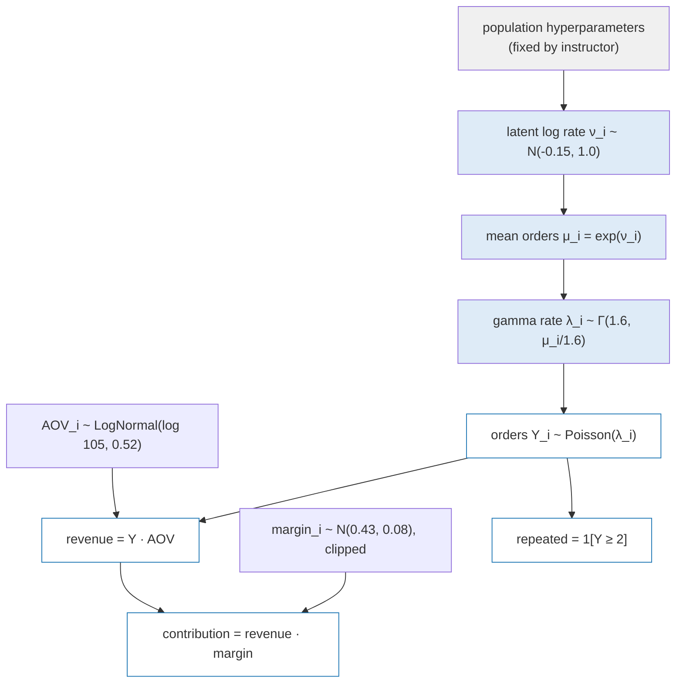

Two structural consequences follow, and both drive the day's results. First, the Gamma–Poisson mixture gives each customer $\operatorname{Var}(Y_i \mid \mu_i) = \mu_i + \mu_i^2/1.6$: overdispersion exists even for a single customer. Second, mixing over heterogeneous $\mu_i$ adds $\operatorname{Var}(\mu_i)$, so the marginal variance-to-mean ratio is far above 1 — observed at 4.66 across the 2,000 simulated customers. A single-rate Poisson has variance equal to its mean by construction; no prior on its rate can change that. The audit reads this number before any model runs, which is the entire point of auditing first.

The generator separates participant data from instructor truth at the file-system level: `data/day1_customers.parquet` for the analyst view, `instructor/day1_truth.parquet` for the latent rates. The separation is enforced by assertion, not convention:

```python
assert not any(col.startswith("true_") for col in observed.columns)
```

Seed determinism is likewise asserted twice — frame equality on regeneration, and byte equality of the parquet output — so every downstream number in this report is exactly reproducible from seed 20260831.

## 2. The audit as specification

The customer-base audit (the Fader/Hardie/Ross discipline) produces the statistics that any fitted model must reproduce. For this dataset:

| Statistic | Value |
|---|---:|
| Customers | 2,000 |
| Buyer rate (≥ 1 order) | 0.505 |
| One-order rate among buyers | 0.451 |
| Mean / median orders | 1.394 / 1 |
| Variance-to-mean ratio | 4.66 |
| Repeat rate among buyers | 0.549 |
| Top-decile contribution share | 38.8% |
| Corr(orders, contribution) | 0.831 |

The decile decomposition shows that order frequency, not order size or margin quality, separates valuable customers: across contribution deciles, mean orders rise from 1.05 to 7.97 while mean margin stays in a narrow 0.38–0.46 band. These audit statistics later become posterior predictive targets — the same functions are computed on every replicated dataset and compared against the observed values with two-sided tail areas.

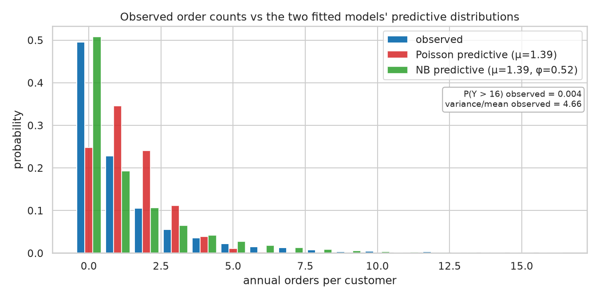

The figure above is the whole day in one picture: observed counts (heavy zero spike at 49.5%, one-order shoulder at 22.8%, tail to 39 orders) against each fitted model's predictive distribution.

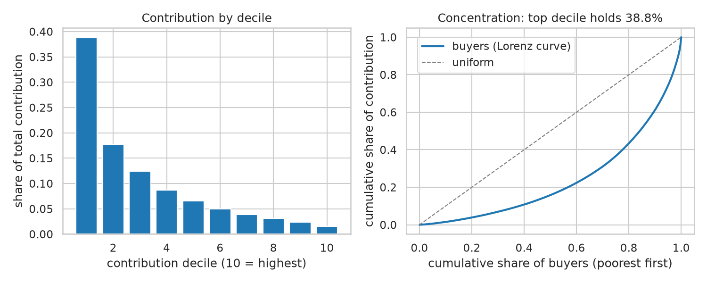

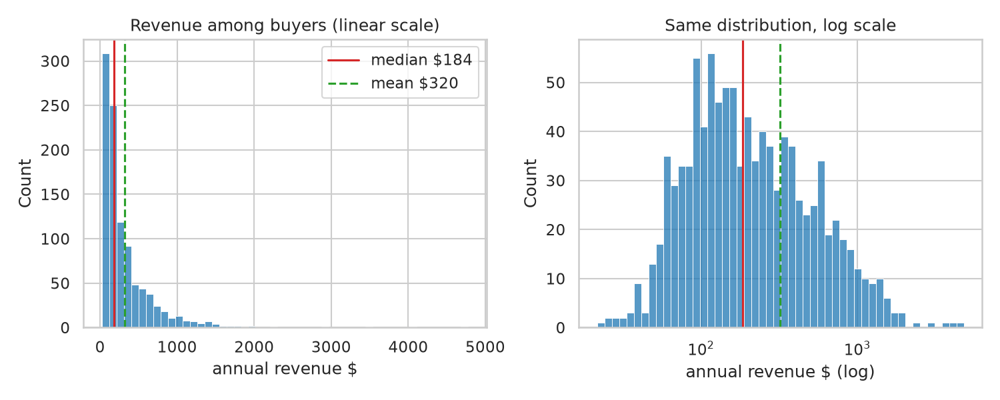

## 3. Guided Lab 1: a one-parameter model with a known answer

The business question is narrow: among customers who bought at least once, what proportion buy again within the measurement window? The estimand is a population proportion, modeled as $Y \mid p \sim \mathrm{Binomial}(1010, p)$ with $p \sim \mathrm{Beta}(3, 7)$. The prior is worth 8 pseudo-observations with 2 successes; with 1,010 real observations, the likelihood dominates by roughly 125:1 in information weight. Prior sensitivity across Beta(1,1), Beta(2,2), and Beta(3,7) moves the posterior mean only between 0.546 and 0.548 — a property of the sample size, not of the method.

Why fit a model with a closed-form posterior in PyMC at all? Because the closed form becomes a unit test for the entire sampling pipeline. The conjugate posterior is $\mathrm{Beta}(3 + 554,\, 7 + 1010 - 554) = \mathrm{Beta}(557, 463)$, computed independently with `scipy.stats.beta`. The MCMC fit (4 chains × 2,000 draws, R-hat 1.00, bulk ESS 3,234, zero divergences) produced a posterior mean of 0.54591 against the analytic 0.54608 — a difference of 1.6e-4, within one Monte Carlo standard error of the mean (2.8e-4). The HDI endpoints agree to six parts in ten thousand. When a later model has no closed form, the pipeline carrying it has already been validated against one that does.

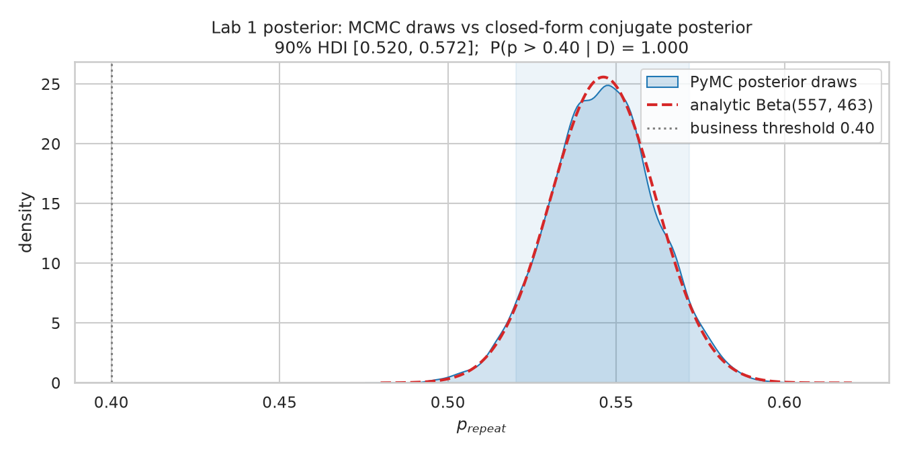

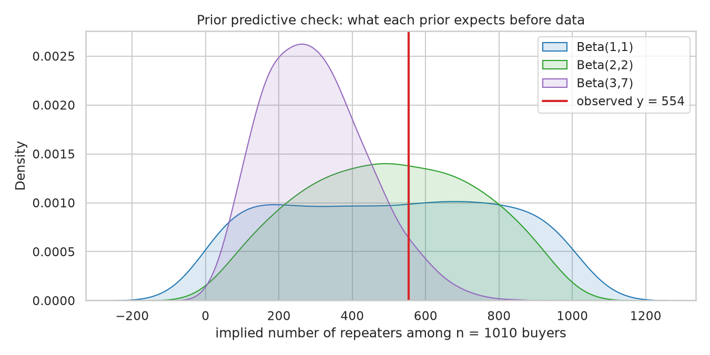

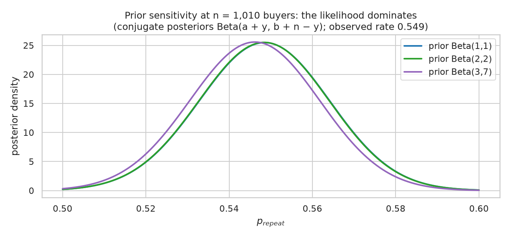

The business reading: posterior median 0.546, 90% HDI [0.520, 0.571], and $P(p > 0.40 \mid D) = 1.000$. The repeat rate is decisively above the 40% threshold — and the model says nothing about which customers repeat, when, or why, because the estimand was defined as a single proportion. That limitation is the cost of the reduction, and it is stated rather than hidden.

## 4. Project 1: two stories about the same counts

The two candidate models differ in one structural assumption. Model P says every customer draws from one rate: $Y_i \sim \mathrm{Poisson}(\mu)$, one parameter. Model NB says the population is a Gamma–Poisson mixture: $Y_i \sim \mathrm{NB}(\mu, \phi)$ with variance $\mu + \mu^2/\phi$, two parameters. Both fit cleanly — 4 chains, zero divergences, R-hat ≤ 1.002, bulk ESS ≥ 1,301 — and both are then subjected to the same battery.

**Prior predictive check.** The Poisson prior structurally forces variance-to-mean ≈ 1.00 in every prior draw: there is no second parameter with which to express overdispersion. The NB prior (φ ~ Exponential(1)) expresses everything from Poisson-like (ratio 1.0) to operationally absurd (ratio 762 at the prior predictive maximum). The check establishes what each model *can* say before either sees data.

**Posterior predictive check.** For each of 4,000 replicated datasets, the audit statistics are recomputed:

| Statistic | Observed | Poisson replicate | tail | NB replicate | tail |
|---|---:|---:|---:|---:|---:|
| zero rate | 0.495 | 0.248 | 0.0 | 0.508 | 0.42 |
| one rate | 0.228 | 0.346 | 0.0 | 0.192 | 0.0005 |
| variance/mean | 4.66 | 1.00 | 0.0 | 3.67 | 0.0025 |
| q95 | 6 | 3.68 | 0.0 | 5.95 | 1.0 |
| q99 | 12 | 4.92 | 0.0 | 10.31 | 0.13 |
| max | 39 | 6.92 | 0.0 | 20.85 | 0.0015 |

The Poisson column is a clean sweep of failures, and each failure is the variance function at work. A mean-1.394 Poisson puts $e^{-1.394} \approx 25\%$ mass at zero against an observed 49.5%; its largest replicate count is around 7 against an observed 39; the mass squeezed out of the zero spike and the tail has nowhere to go but the middle, producing the one-rate overprediction. Matching the sample mean was never in doubt — the Poisson maximum-likelihood estimate *is* the sample mean, so posterior μ = 1.394 exactly. That is not evidence of fit; it is a property of the estimator.

The NB column reproduces the core marginal (zero rate tail 0.42, q95 tail 1.0) and leaves an honest residue: it under-predicts one-order customers, marginal variance, and the extreme maximum. The reason is structural. The truth is a mixture of Negative Binomials — each customer has a different $\mu_i$ — and a two-parameter marginal must split the difference between the zero spike and the tail, leaving both the middle and the extreme slightly light.

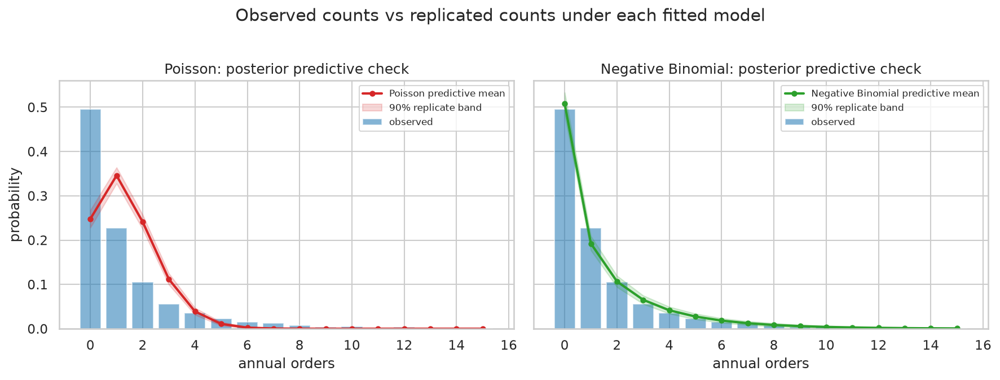

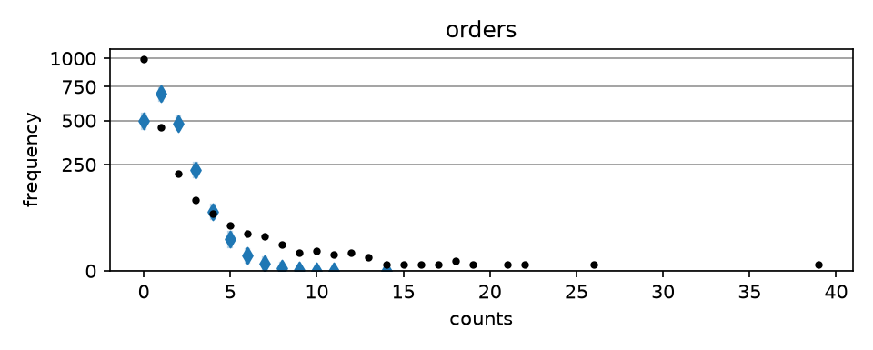

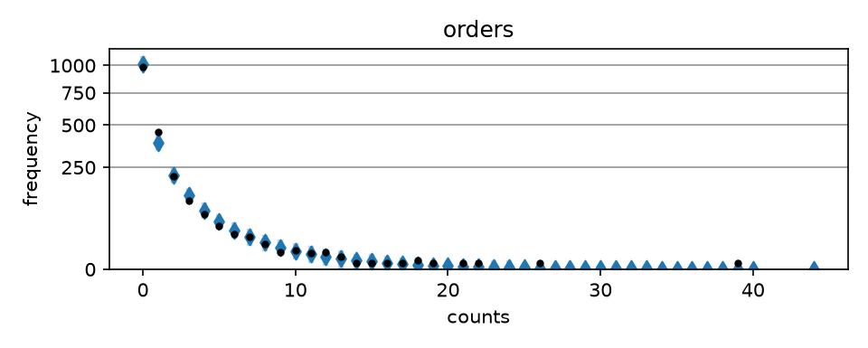

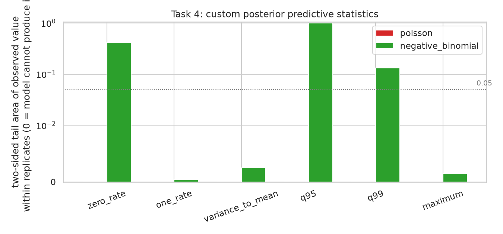

**Predictive comparison.** PSIS-LOO with stacking weights: ELPD −3,187.8 (NB) against −4,285.7 (Poisson), difference 1,097.8 with DSE 129.8, stacking weights 0.94/0.06, all Pareto-k below 0.17. The NB wins decisively — but the *reason* it wins is that its generative variance structure reproduces the count behavior the audit specified. The LOO table is supporting evidence, not the argument.

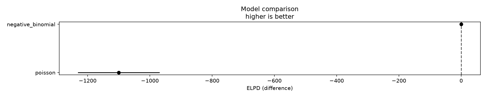

## 5. Marginal dispersion is not conditional dispersion

The instructor truth allows one check no participant data can: the fitted φ against the dispersion actually used in generation. The generator's conditional dispersion is 1.6. The pooled NB's posterior φ is 0.521 with 90% interval [0.476, 0.569] — nowhere near covering 1.6.

The gap is the lesson. The pooled model must absorb *two* variance sources into one parameter: the within-customer Gamma noise (governed by the true 1.6) and the between-customer spread of $\mu_i$ (governed by the log-rate SD of 1.0). Solving $\mu + \mu^2/\phi = \operatorname{Var}(Y)$ for the observed moments gives φ ≈ 0.38; the likelihood fit lands at 0.52 by balancing the whole probability mass function rather than the variance alone. A model with customer-level parameters is required to estimate the conditional dispersion — which is precisely what Day 2's hierarchy provides.

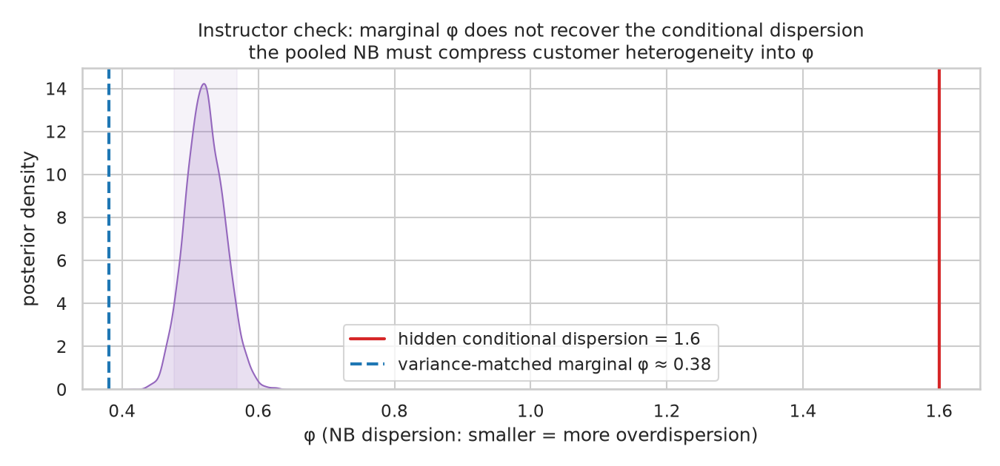

## 6. Engineering: the pipeline and its three API breaks

The implementation is a small package with the workflow's shape: `day1/config.py` (frozen constants), `day1/data.py` (generator), `day1/audit.py`, `day1/lab1_repeat.py`, `day1/count_models.py`, `day1/checks.py` (custom posterior predictive statistics), `day1/compat.py` (ArviZ compatibility), and numbered scripts `01`–`06` from generation through figures. Posteriors are cached as netcdf so the critique stages never refit.

PyMC 6.3.1 with ArviZ 1.3.0 broke three assumptions that older workshop material encodes:

| Break | Symptom | Fix |
|---|---|---|
| `InferenceData.extend` removed | `AttributeError: 'DataTree' object has no attribute 'extend'` | merge groups via `xr.DataTree.from_dict({**main_groups, **other_groups})` |
| `az.hdi` argument renamed | `TypeError: hdi got an unexpected keyword argument: 'hdi_prob'` | use `prob=...`; also handle DataArray-vs-Dataset returns with a duck-typed flattener |
| netcdf persistence | `ValueError: cannot write NetCDF files ... no suitable backend` then `ImportError: No module named 'h5py'` | install `h5netcdf` and `h5py` explicitly and re-freeze the lockfile |

A fourth deprecation was handled proactively: `idata_kwargs={"log_likelihood": True}` in `pm.sample` is deprecated in favor of an explicit `pm.compute_log_likelihood(idata)` call after sampling. All four are recorded in the ticket diary verbatim, because a future reader hitting the same errors needs the exact messages to grep for.

## 7. The textbook grounding

Every Day 1 result maps onto Rossi, Allenby, and Misra's *Bayesian Statistics and Marketing* (2nd ed.). The conjugate cross-check is their §2.8 worked example evaluated on these numbers. The Poisson-versus-NB contest reprises the Negative Binomial rationale from their §7.3.3 physician-detailing case study, which adopted the NBD because the count data were "over-dispersed relative to the Poisson" — with the same parameterization PyMC uses. The NB's residue and the φ gap are Chapter 5's nuisance-versus-goal-of-inference distinction in miniature: a pooled model treats heterogeneity as something to absorb, while the marketing modeling program treats unit-level parameters as the goal of inference. The full mapping, with an expectedness verdict for each result, lives in the ticket as `reference/02-ram-cross-reference.md`; the headline is that every finding was predictable from the textbook's framework — several in exact form, the rest in sign and mechanism.

## 8. Working rules

- Audit before modeling. The audit statistics are the acceptance criteria; a model that cannot reproduce them is inadequate for the question regardless of its likelihood score.
- Validate the sampler against closed forms where they exist. One conjugate model cheaply certifies the pipeline that every later model will trust.
- Matched means are not fit. The Poisson MLE equals the sample mean by construction; distributional statistics decide adequacy.
- Report tail areas, not just point comparisons. "The observed variance-to-mean sits at the 100th percentile of Poisson replicates" is a claim; "the model misses" is not.
- Treat API drift as an engineering deliverable. Pin the lockfile, record exact error strings, and isolate compatibility code in one module.
- Marginal fit does not license individual claims. The NB prices the risk of heavy buyers existing; it cannot say which customers they are. That boundary is stated in the conclusion, not discovered later by a consumer of the analysis.

## Related notes

- [[PROJECT REPORT - Bayesian Marketing Day 2 - Hierarchical Recovery of Customer Heterogeneity]] — the follow-up that gives every customer a latent parameter and closes the φ gap documented here.
- Source repo: `/home/manuel/code/wesen/2026-08-31--bayesian-marketing` — ticket `day1-lab1-proj1` (intern guide, diary, chapter with 15 figures, RAM cross-reference), `artifacts/report-day1.md` for the full chapter and `ttmp/.../reference/02-ram-cross-reference.md` for the textbook mapping.
