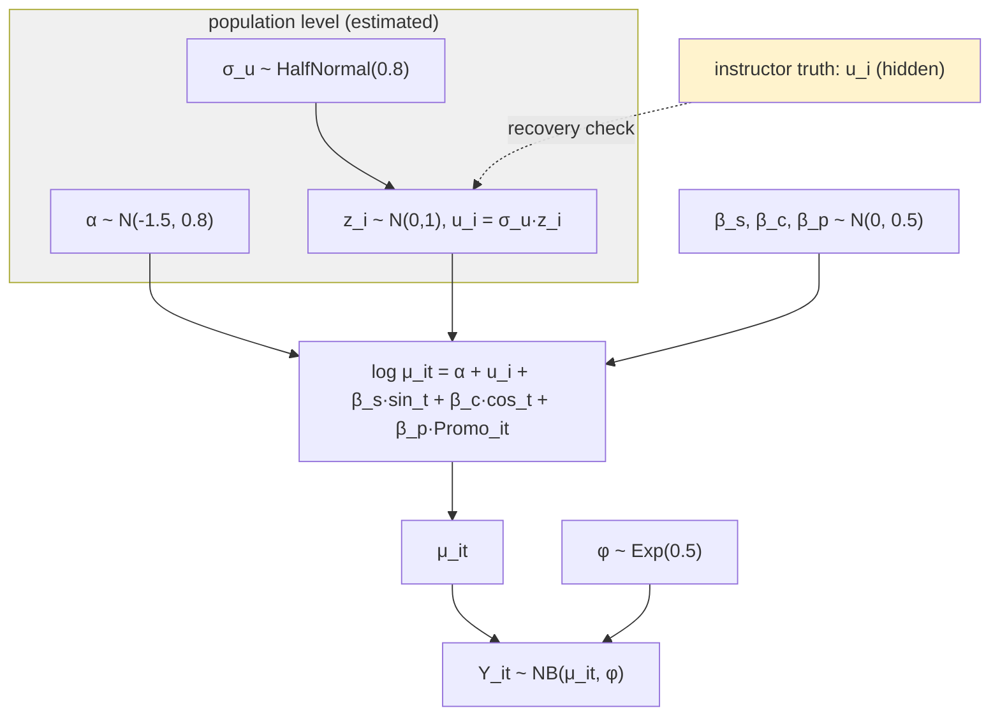

# PROJECT REPORT - Bayesian Marketing Day 2 - Hierarchical Recovery of Customer Heterogeneity

Day 1 ended with a Negative Binomial that fit the marginal distribution of customer order counts while compressing every customer into one exchangeable draw. Day 2 gives each customer a latent parameter drawn from an estimated population, and the difference between the two models becomes measurable in a single statistic: the correlation between each customer's first-half and second-half order totals. A pooled model produces replicates with split-half correlation −0.003 against an observed 0.661. A hierarchical model produces 0.624 with a replicate band that covers the observed value. Both models reproduce the month-level mean to three decimals. Only one of them answers the business question.

This report is the complete technical account of Day 2 of the Bayesian Marketing workshop (ticket `day2-lab2-proj2`): the customer-month panel and its audit, the pooled and hierarchical Negative Binomial models, the recovery of the hidden heterogeneity scale and of individual customer effects, the shrinkage mechanism made visible, the existing-versus-new-customer prediction distinction, the random-slope model and its identification limits, and the engineering traps encountered on the way. The through-line is that partial pooling is not a compromise between two estimates — it is the posterior consequence of putting a population model between the data and the customer parameters.

> [!summary]
> - The pooled NB (H0) matched the panel's month-level mean exactly and produced zero customer-level persistence; the hierarchical NB (H1) reproduced all five annual-total business statistics, including the split-half correlation (replicates 0.624 [0.47, 0.77] covering observed 0.661), and won PSIS-LOO decisively (ΔELPD 110, DSE 15, stacking weight 0.99).
> - H1 recovered the population intercept (−1.52 against a true −1.55) and the heterogeneity scale (σ = 0.99 [0.84, 1.17], covering the true 0.85): a one-SD customer buys 2.7× the baseline rate, a seven-fold spread across the middle two-thirds of customers.
> - Individual recovery is quantified: correlation 0.834 between posterior means and true effects, 90% HDIs covering truth for 95% of customers, and shrinkage visible as mean absolute errors of 0.47 for low-information customers versus 0.25 for high-information ones.
> - The variance split between σ and φ is the hardest identification target at 12 observations per customer: the model matches total marginal variance but places more in σ and less in φ than the generator did (φ's interval [1.10, 2.10] misses the conditional truth 2.2).
> - The random-slope model recovered the population promotion effect (μ_p = 0.362 against truth 0.35, P(μ_p > 0) = 0.999) but individual responses correlate only 0.095 with truth — response heterogeneity is not identified well enough for customer-level targeting, exactly as the workshop's Hint 4 predicts.
> - One conceptual trap was caught by an assertion: the "new-customer interval is wider" claim compares a new customer to a *typical* well-observed customer, not to the heaviest customer, whose interval is wide because the rate itself is high.

## 1. From marginal to hierarchy

The Day 1 closing finding sets the specification. A pooled Negative Binomial fitted to annual counts estimated dispersion φ = 0.52 against a generator's conditional dispersion of 1.6, because the pooled model must absorb between-customer heterogeneity into the dispersion parameter. The fix is structural rather than a better prior: model each customer's log rate as a draw from a population,

$$
u_i \sim N(0, \sigma_u^2), \qquad \log\mu_{it} = \alpha + u_i + \beta_s \sin_t + \beta_c \cos_t + \beta_p\,\mathrm{Promo}_{it},
$$

with the Negative Binomial likelihood for overdispersed counts. Now σ_u *is* the between-customer spread, φ can return toward the conditional value, and each customer carries a posterior over their own rate. This is the "across-unit behavior" component that Rossi, Allenby, and Misra place at the center of the marketing modeling program — and their insistence that unit-level parameters are "the goal of inference," not a nuisance, is the reason the day's deliverables are recovery checks rather than marginal fits.

## 2. The panel and the statistic that decides

The §21 generator produces a customer-month panel: 120 customers × 12 months = 1,440 observations. Each customer draws one persistent effect $u_i \sim N(0, 0.85)$ and one promotion response $\beta_{p,i} \sim N(0.35, 0.18)$; months carry randomized promotion (35% treated) and sinusoidal seasonality (0.55 sin + 0.20 cos) around an intercept of −1.55; counts are Gamma–Poisson with conditional dispersion 2.2. Promotion randomization inside the simulation is what later licenses the causal reading of its coefficient.

The audit records the baseline: mean 0.433 orders per customer-month, month-level variance-to-mean 2.21, 19 customers with zero annual orders, annual totals averaging 5.19 with variance 36.2, top decile holding 38.2% of orders. And the decisive number: the correlation between each customer's first-six-month and last-six-month totals is **0.661**. Customers are persistent, and a model that treats the panel as 1,440 exchangeable draws can match every marginal statistic while producing zero persistence. That contrast is the day's destination, and the split-half correlation is how it is measured.

## 3. Two models, one funnel avoided

Model H0 is the pooled Negative Binomial with panel regressors. Model H1 adds the customer effects. H1 is fitted in non-centered form — $u_i = \sigma_u z_i$ with $z_i \sim N(0,1)$ — because the centered form creates a funnel when the data might say σ_u is small: the $u_i$ collapse toward zero and NUTS diverges. With twelve observations per customer, that is exactly the regime. Non-centering plus `target_accept=0.92` produced zero divergences on the first run, at 1,052 minimum bulk ESS across 125 sampled parameters and 125 seconds of wall time. The prior on σ_u (HalfNormal(0.8)) centers near the truth deliberately; this is RAM §5.1's point that the hierarchy *is* the prior over a high-dimensional parameter space, and its form matters.

The posteriors tell the first story. H0 recovers the regression structure — promotion coefficient 0.361 against a true 0.35, seasonality right — but its intercept is −1.06 against a true −1.55 and its φ is 0.47 against a conditional 2.2. Both distortions are the same event: with no $u_i$ to hold customer differences, the pooled model tilts the intercept up (the average of $e^{u_i}$ exceeds $e$ of the average) and forces φ to absorb the customer spread. H1 separates the variance sources and gets the location back: α = −1.52, φ = 1.54, σ = 0.99.

## 4. Recovery: the population, then the individuals

The heterogeneity scale is the population-level result: posterior median 0.99, 90% HDI [0.84, 1.17], covering the true 0.85, with $P(\sigma_u > 0.5 \mid D) = 1.0$. The business translation is a rate multiplier: a one-SD-above customer buys $e^{0.99} \approx 2.7$ times the baseline rate, one-SD-below $0.37$ times — a seven-fold spread across the middle two-thirds of customers. The honest caveat sits next to it: the posterior median overestimates 0.85 by about 17%, and φ's interval just misses the conditional truth. The model matches the *total* marginal variance but splits it slightly more between-customer and less within-customer than the generator did. With twelve observations per customer, separating "persistently heavy" from "noisy year" is the hardest identification problem in the model, and the posterior says so rather than hiding it.

Individual recovery is where partial pooling becomes visible. The correlation between posterior means and true effects is 0.834, and the 90% HDIs cover the true effects for 95% of customers. The mechanism is quantified two ways. First, by information level: mean absolute error against truth is 0.47 for customers with at most two active months versus 0.25 for customers with five or more. Second, by compression: the SD of posterior means (0.83) is smaller than the SD of truths (0.93) — the posterior means are shrunk toward the population, by design, in proportion to how little each customer's own data says. This is not bias to be corrected. It is uncertainty-aware borrowing of information, and the amount of pooling was learned from the data through the posterior of σ_u rather than tuned by hand.

## 5. The decisive check: persistence

The business question is not "what is the average rate" but "do customers differ persistently." The split-half correlation measures it directly, and the posterior predictive battery settles the contest:

| Statistic | Observed | H0 replicates | H1 replicates |
|---|---:|---:|---:|
| zero-order customers | 0.158 | 0.030 (tail 0.000) | 0.134 (tail 0.52) |
| one-order customers | 0.108 | 0.075 (tail 0.27) | 0.155 (tail 0.17) |
| variance of annual totals | 36.2 | 11.0 (tail 0.000) | 41.3 (tail 0.76) |
| top-decile share | 0.382 | 0.232 (tail 0.000) | 0.388 (tail 0.87) |
| split-half correlation | 0.661 | −0.003 [−0.15, 0.15] | 0.624 [0.47, 0.77] |

H0 fails every concentration statistic — a single rate surface cannot manufacture zero-order customers or heavy tails — and produces persistence-free replicates: each replicated panel is an exchangeable scramble of its own month-level model. H1 reproduces all five statistics with the observed values inside its replicate bands. PSIS-LOO agrees (ELPD −1,099.7 vs −1,209.7, difference 110.0 with DSE 15.0, stacking weight 0.99 for H1; one H1 observation at Pareto-k = 0.70, flagged but not alarming). As on Day 1, the LOO number is supporting evidence; the reason H1 wins is that its generative structure reproduces the persistence the business asked about, and the split-half statistic is where that is measured.

## 6. A known customer versus a new one

The hierarchy supports two distinct predictive tasks, and conflating them understates uncertainty. For an observed customer, next month's predictive distribution uses that customer's posterior effect draws — parameter uncertainty is small because the customer is learned. For a new customer, there is no individual posterior: each draw pulls a fresh effect from the population, so the predictive distribution adds *population* uncertainty on top. In rate terms, the SD of a typical learned customer's rate draws is a fraction of the posterior σ_u, while a new customer's rate distribution is the population itself. The classic error is to set $u = 0$ for the new customer and report the population mean prediction as though it were the predictive distribution.

One trap surfaced here and is worth preserving: the heaviest observed customer's predictive interval (width 7 at a mean of 2.31 orders) is *wider* than a new customer's (width 2) — not because of parameter uncertainty, but because the rate itself is high and counts are noisy at high rates. The "new-customer interval is wider" claim is true relative to a *typical* well-observed customer (whose rate is learned tightly), and the assertion in the pipeline was corrected to compare against exactly that reference. Aleatoric width at high rates and epistemic width about who arrives are different phenomena; the pipeline now names them separately.

## 7. Heterogeneous response and the limit of identification

The random-slope model adds customer-specific promotion effects, $\beta_{p,i} = \mu_p + \sigma_p z_{p,i}$. The population result is solid: $\mu_p = 0.362$ with 90% HDI [0.18, 0.54] against a true 0.35, and $P(\mu_p > 0 \mid D) = 0.9993$ — within the simulation's randomized assignment, promotion raises order rates. The heterogeneity estimate $\sigma_p = 0.119$ [0.012, 0.351] covers the true 0.18 but reaches almost to zero.

The individual level is the caution, and it is quantified rather than asserted: posterior mean rate ratios correlate 0.095 with the true ones. With twelve observations per customer at 35% treated, the data identify the population of responses but not whose response differs. An instructive middle finding: 69% of customers have individual rate-ratio HDIs excluding 1.0 — shrinkage toward the strong population mean makes individual posteriors *collectively* informative — while those same posteriors do not *separate* customers from one another. The operational conclusion is written into the report's limitations: no customer-level promotion targeting claims from this data. More customers would not replace more repeated observations per customer.

## 8. Engineering notes

Three items from the diary worth preserving for the next ticket:

- **Assertion semantics matter.** The first version asserted "new-customer width ≥ heavy-customer width" and failed for a physically correct reason (high-rate aleatoric spread). The fix was to define the reference customer the claim actually compares against. An assertion that encodes the wrong claim is worse than no assertion.
- **Cache naming.** The random-slope fit was cached as `day2_rs.nc` (from the model key) while the analysis script looked for `day2_random_slope.nc`. One-line fix, but the same mapping trap recurs wherever cache filenames are derived from shorthand keys.
- **Truth-value provenance.** The facilitator notes state the promo-slope SD as 0.25 while the Day 2 generator code uses 0.18; the generator is the data-generating truth, and the discrepancy is recorded as a decision in the ticket rather than silently resolved in either direction.

## 9. Working rules

- Specify the business statistic before choosing between models. The split-half correlation decided H0-versus-H1; every marginal statistic tied.
- Non-center hierarchical effects by default when per-unit information is sparse; the funnel is real, and `target_accept` is not a repair for geometry.
- Recovery checks belong in the pipeline, not the appendix: joining posterior means to hidden truth, coverage, and error-by-information-level are assertions and figures, not afterthoughts.
- Report the variance-split honestly. Matching total marginal variance while misallocating its parts is a finding about identifiability, and it changes what downstream claims are licensed.
- Distinguish aleatoric from epistemic width in prediction claims, and test the claim you actually make.
- Population-level causal statements (randomized promotion) and individual-level targeting claims have different identification requirements; do not let the first license the second.

## Related notes

- [[PROJECT REPORT - Bayesian Marketing Day 1 - Generative Models, Conjugate Validation, and the Poisson Failure Pattern]] — the marginal-model results that this report's hierarchy closes.
- Source repo: `/home/manuel/code/wesen/2026-08-31--bayesian-marketing` — ticket `day2-lab2-proj2` (intern guide, 8-step diary, chapter `artifacts/report-day2.md` with 8 figures); models in `day2/models.py`, recovery in `day2/recovery.py`, prediction in `day2/predict.py`, the Project 2 battery in `scripts/15_project2.py`.
