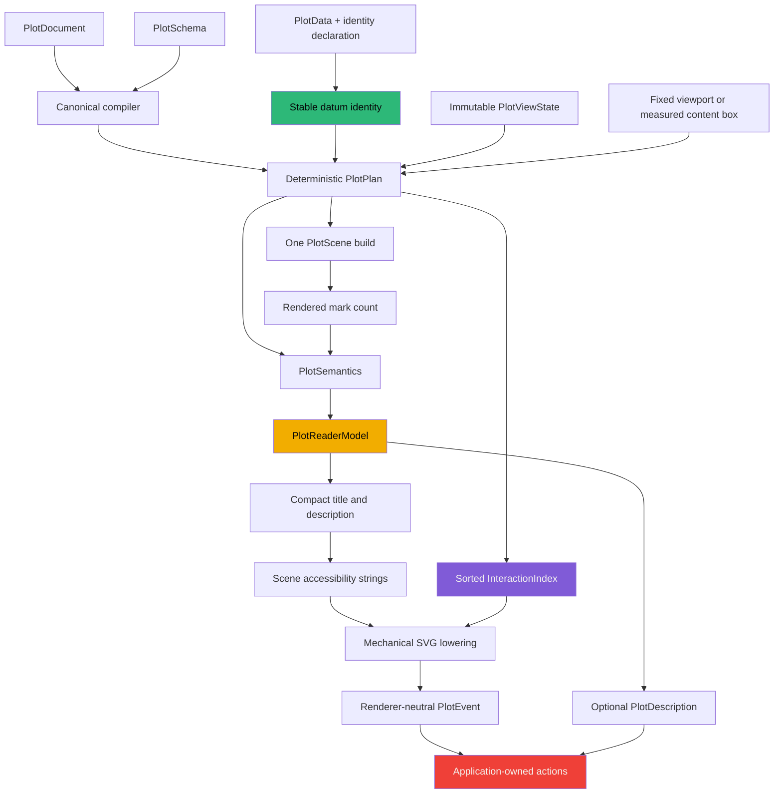

# PROJECT REPORT - Hyperslop Plot - Semantic Interaction, Responsive Hosting, and Accessible Grammar Reading

A grammar-of-graphics package describes analytical intent before it produces pixels. That property has consequences beyond compilation. If interaction, responsive layout, and accessibility are added only at the rendered SVG boundary, each feature must reconstruct meaning from coordinates and DOM structure. The reconstruction is incomplete by definition: pixels do not preserve source identity, statistical lineage, logical field identity, coverage policy, uncertainty assumptions, or application ownership.

The work covered by HSPLOT-011, HSPLOT-012, and HSPLOT-013 completed a different architecture for `@hyperslop-systems/plot`. Stable identity is established before projection. Interaction targets are semantic records addressed by opaque IDs. Runtime view state is immutable and remains outside the serialized grammar. Responsive React hosting measures one caller-owned content box and invokes the same pure render pipeline used by fixed viewports. Accessible narration is projected from `PlotSemantics`, not extracted from SVG. The richer React reader references the plot exactly once and leaves diagnostics and product language under their correct owners.

This report is a complete technical account of those three tickets as one coherent system. It extends [[PROJECT REPORT - Hyperslop Plot - Stable Identity, Semantic Interaction, and Immutable View State]], which gives a dedicated treatment of HSPLOT-011, and builds on the compiler architecture documented in [[PROJ - Hyperslop Plot - Building a Frontend Grammar of Graphics as a Staged Compiler]] and [[PROJECT REPORT - Hyperslop Plot v0.2 - From Grammar to Published PBUI Runtime]]. The emphasis here is the completed end-to-end boundary: analytical identity, renderer-neutral interaction, responsive hosting, structured narration, consumer migration, validation, and the engineering failures that clarified the final contracts.

> [!summary]
> - HSPLOT-011 replaced positional hit payloads with stable source and derived datum identities, a sorted JSON-safe semantic target index, renderer-neutral events, immutable external view state, and pointer/keyboard-equivalent brushing.
> - HSPLOT-012 introduced a narrow React-only responsive composition. It measures a content box, normalizes and schedules sizes deterministically, calls the existing `renderPlot`, and delegates presentation to `PlotHost`. Datalab’s duplicate observer lifecycle was deleted.
> - HSPLOT-013 added a serializable, deterministic, bounded `PlotReaderModel` derived only from `PlotSemantics`. Compact scene narration and an optional native React disclosure use one exact accessibility relationship and never infer product state or unsupported scientific conclusions.
> - The final archived Plot gate passed 29 files and 193 tests. The packed Datalab gate passed 50 files and 555 tests against tarball SHA-256 `d5be7fe2135d7f1a74954b48e9cda3ba22bc00a2a44a5e3a3684c2f30072afdb`.
> - Every ticket closed with an exact-format diary, a plan slip, start and completion slips for every phase, browser evidence, a requirement-level audit, and a clean `docmgr doctor` result.

## 1. The completed runtime boundary

The central design constraint remained unchanged throughout the work: Plot has one serializable `PlotDocument`, one compiler, one deterministic normalized grammar, one planner, and one scene construction path. Interaction, responsive layout, and narration are runtime projections around that path. None of them introduce another grammar or another interpretation of the document.

The complete flow is:



The diagram contains three important ordering decisions.

First, datum identity precedes variable materialization and statistical transformation. A row must retain analytical identity while its fields are projected into channels and while derived rows are produced. Establishing identity after planning would make the result dependent on transient row positions or rendered geometry.

Second, responsive dimensions are ordinary viewport input. They do not enter `PlotDocument`, semantic records, or interaction state. The pure renderer cannot tell whether `{ width: 640, height: 360 }` came from a fixed export request, a server-side layout decision, or a browser `ResizeObserver`.

Third, narration follows semantic projection. The reader receives structured facts after the plan and scene establish counts, but before a renderer lowers the scene. This allows SVG, future non-React serializers, exports, agents, and React details to consume the same meaning without parsing one another’s output.

## 2. HSPLOT-011: stable identity before interaction

### 2.1 Why row positions were removed from semantic interaction

The earlier interaction path attached a `PlotHit` payload to scene nodes. Source marks used row-derived keys, and `PlotHost` reported the payload for pointer or keyboard activation. This worked for a single static frame. It did not preserve meaning across reorder, filtering, query replacement, statistical transformation, or rerendering.

A row index describes a position in one array. It does not describe an analytical observation. When rows move, index-based selection can silently address a different observation. The same problem cannot even be stated consistently for a mean, regression point, histogram bin, density estimate, or group aggregate because each derived datum can depend on many source rows.

The corrected model separates five entities:

| Entity | Definition | Lifetime |
|---|---|---|
| Source datum identity | Deterministic identity over declared logical fields and typed primitive values. | Stable across reorder and filtering. |
| Derived datum identity | Deterministic identity over statistic, group key, output key, and complete source lineage. | Stable while the derivation inputs remain equal. |
| Interaction target | Semantic record for a datum, group, legend entry, panel, or other navigable target. | Stable for equal semantic inputs. |
| Scene node | Renderer-neutral geometry carrying only an opaque target ID. | Specific to a render outcome. |
| Product action | Application decision such as inspect, watch, navigate, or filter. | Owned by Datalab or another host. |

The separation is strict. Plot does not copy physical rows into scene nodes. Scene nodes do not contain product verbs. Application actions do not enter the grammar.

### 2.2 Source identity declaration

The data provider declares the logical fields that identify a row:

```ts
interface PlotData {
  readonly rows: readonly PlotRow[];
  readonly coverage: DataCoverage;
  readonly identity?: {
    readonly fields: readonly FieldId[];
  };
}
```

`FieldId` is essential. A stable logical field can be mapped to a different physical property name while retaining identity. Display labels are presentation. Physical columns are current storage. Neither can replace a declared logical identifier.

Each identity tuple includes the field ID and the typed primitive value. Numeric `1` and string `"1"` remain distinct. Dates normalize to ISO strings. Non-finite numbers and arbitrary objects are rejected. Duplicate field declarations, unknown fields, missing values, invalid values, and duplicate tuples receive structured diagnostics.

There is deliberately no positional fallback. If identity is absent or invalid, Plot can still render ordinary geometry, but it suppresses semantic mark targets. This preserves basic visualization while refusing to assign unstable identity authority to row order.

### 2.3 Derived identity and bounded lineage

Derived statistics require an identity form that preserves source membership. A derived ID depends on:

```text
statistic kind
+ semantic group key
+ output key for the derived row
+ sorted complete source datum IDs
```

The public serialized lineage is bounded to 256 source IDs and includes the complete source count plus a truncation flag. The internal transformation chain retains complete sorted lineage in hidden symbol metadata so a later statistic can derive a correct identity even after an earlier public lineage was truncated.

This two-level representation solves two different requirements. Public output must remain bounded and serializable. Chained derivation must retain complete provenance. Treating the bounded public slice as complete would make later identities incorrect; serializing all lineage into every output could grow without a practical limit.

### 2.4 The semantic target index

The canonical interaction surface is a sorted JSON-safe array rather than a public `Map`:

```ts
interface InteractionIndex {
  readonly targets: readonly InteractionTarget[];
}
```

A private map may be built transiently for lookup or deduplication, but it never becomes the public contract. Stable serialization matters for tests, replay, logging, transport, server rendering, and deterministic equality.

Scene primitives carry only an opaque target ID. The target record can retain stable datum identity, semantic values, panel context, group membership, and bounds without placing those facts in renderer geometry. Pointer, keyboard, hover, and focus paths all resolve the same ID through the same index.

This creates a renderer-neutral event contract:

```text
renderer input:  scene geometry + interaction index
user input:      pointer, keyboard, focus, or hover
resolution:      opaque scene target ID -> semantic target
output:          typed PlotEvent
application:     chooses product behavior
```

Datalab consumes the event, resolves physical fields, renders menus, and dispatches inspection or watchlist verbs. Plot never contains PBUI, Redux, routing, DuckDB, or application action names.

### 2.5 Immutable view state

Runtime view state remains outside `PlotDocument`:

```ts
interface PlotRequest {
  readonly document: PlotDocument;
  readonly schema: PlotSchema;
  readonly data: PlotData;
  readonly viewport: Viewport;
  readonly view?: PlotViewState;
}
```

The view carries visible scale windows, hover, focus, selection, and brush state. Inputs are copied and normalized so caller-owned arrays cannot mutate a render after the request begins. View changes retrain visible scales and clipping while preserving complete planned geometry; they are not source-data filters.

This distinction keeps two operations separate:

- Filtering changes `PlotRequest.data` and therefore changes the analytical population.
- Zooming changes `PlotRequest.view` and therefore changes the visible window over the same population.

Conflating them would alter statistics during zoom, break source identity continuity, and make coverage narration ambiguous.

### 2.6 Inversion and brushing

Pointer coordinates are device-space facts. Analytical brushing requires explicit inversion through scales and coordinates. Continuous, logarithmic, band, transposed Cartesian, and supported polar cases have defined inverse behavior. Singular or unsupported inverse coordinates return `null` rather than fabricated values.

Pointer and keyboard brushing share one semantic selection builder. A completed brush can contain:

- device-space bounds;
- scaled bounds where inversion is valid;
- sorted target IDs;
- sorted datum IDs;
- explicit selection mode.

Selection styling uses non-color emphasis and exposes `aria-pressed`. Keyboard users operate semantic controls rather than hidden geometry-specific state.

### 2.7 Product proof

The packed Datalab points story produced 360 stable semantic datum targets. Browser inspection confirmed 360 painted circles and focusable semantic controls. Activating a point opened Datalab’s application-owned menu. Choosing **Inspect** incremented the product verb log. Plot provided stable identity and semantic facts; Datalab decided what inspection meant.

A failure during this migration clarified identity ownership. The first Datalab adapter declared only x and y fields as identity. The fixture contained repeated x/y pairs across other dimensions, so identity validation diagnosed duplicates. The final adapter includes all stable result fields and declares the complete stable tuple. Visual encodings identify appearance, not necessarily rows.

## 3. HSPLOT-012: responsive hosting without a second render system

### 3.1 The narrow composition

Responsive layout did not require a responsive compiler. It required one React-only adapter that discovers a viewport and calls the existing pure render function:

```tsx
export function ResponsivePlot(props: ResponsivePlotProps) {
  const containerRef = useRef<HTMLDivElement>(null);
  const size = useMeasuredPlotSize(containerRef, {
    minHeight: props.minHeight,
    resizeDelayMs: props.resizeDelayMs,
  });

  const outcome = useMemo(
    () => size.ready
      ? renderPlot({
          document: props.document,
          schema: props.schema,
          data: props.data,
          view: props.view,
          viewport: { width: size.width, height: size.height },
        })
      : null,
    [/* canonical inputs and normalized size */],
  );

  return <PlotHost scene={outcome?.scene ?? null} /* forwarded contracts */ />;
}
```

The component composes three existing responsibilities:

1. `useMeasuredPlotSize` owns browser observation and scheduling.
2. `renderPlot` owns compilation, planning, semantics, interactions, and scene construction.
3. `PlotHost` owns renderer selection, diagnostics, target behavior, brushing, loading, and empty presentation.

Direct fixed-viewport composition remains first-class. A test compares responsive output with a direct `renderPlot` request using the same measured viewport and verifies structural equality.

### 3.2 Content-box measurement

The private hook observes one element with `{ box: "content-box" }`. It prefers `ResizeObserverEntry.contentBoxSize` and falls back to `contentRect` for browser and test compatibility:

```ts
function contentBox(entry: ResizeObserverEntry) {
  const box = Array.isArray(entry.contentBoxSize)
    ? entry.contentBoxSize[0]
    : entry.contentBoxSize;

  return {
    width: box?.inlineSize ?? entry.contentRect.width,
    height: box?.blockSize ?? entry.contentRect.height,
  };
}
```

Measured values are accepted only when finite and positive, then floored to integer CSS pixels. The package defines no default chart minimum. An optional `minHeight` is an explicit caller layout policy rather than hidden package behavior.

This produced meaningful compact proof. The browser harness rendered ordinary `720×400`, narrow `320×180`, and compact `120×24` viewports. Plot did not clamp the compact chart back to an undocumented minimum.

### 3.3 Scheduling semantics

Resize delivery can be noisy. The hook implements a deterministic lifecycle:

```text
receive observer entry
select the observed target entry
read content-box dimensions
normalize to finite positive integer CSS pixels
apply explicit minHeight
if unusable:
    clear pending candidate
    cancel delayed commit
    return
if equal to committed or pending size:
    return
if delay is zero:
    commit immediately
else:
    replace pending candidate
    restart one trailing timer
```

The invalid-size branch became important during browser testing. An earlier implementation ignored an unusable delivery but allowed a previously scheduled valid size to commit afterward. That behavior could render a stale viewport while the element was currently collapsed. The corrected contract treats an unusable measurement as invalidation: it clears pending state and cancels the timer. A later positive measurement recovers normally.

The hook also guards against stale callbacks after unmount or option replacement. Cleanup marks the effect inactive, clears pending work, cancels the timer, and disconnects the observer. Strict Mode tests verify one active observer after effect replay. Server rendering constructs no observer and produces stable pre-measurement loading markup.

### 3.4 No measured layout feedback

The responsive wrapper does not write measured width and height back into its own style. Doing so could create a feedback cycle in which observation changes layout and layout triggers observation. Caller styles remain caller-owned. The only style derived from responsive policy is the explicitly supplied `minHeight`.

The host must still have a bounded content box. Plot cannot infer whether a product wants a dashboard tile, full-page chart, publication frame, or inline sparkline. The absence of a package minimum is therefore a real ownership decision, not a missing default.

### 3.5 Preserving the HSPLOT-011 contract

`ResponsivePlot` forwards:

- immutable `view` input;
- renderer-neutral `onEvent`;
- brush mode;
- custom semantic target rendering;
- custom renderer selection;
- diagnostics;
- loading and empty fallbacks;
- themes and unstyled mode;
- `onOutcome`;
- external accessibility `describedBy`.

Measurement does not reinterpret any of these values. The responsive wrapper changes only the viewport supplied to the pure request.

### 3.6 Removing Datalab’s duplicate lifecycle

Before migration, Datalab owned a second responsive runtime: a `ResizeObserver`, timer, local width/height state, and hardcoded `280×200` clamps. The migration removed that lifecycle. Datalab now returns canonical Plot inputs and delegates measurement to `ResponsivePlot`, retaining only its product-chosen 80 ms delay.

The first standalone ChartPanel browser run exposed another consumer-owned layout issue. Although the observer lifecycle was correct, the story’s host did not fill its bounded parent. The chart measured approximately `677×151` instead of the available `677×357`. Adding explicit `width: 100%` and `height: 100%` to the standalone panel fixed the host geometry without introducing a Plot minimum. The corrected story retained 360 painted circles and 364 focusable semantic groups.

This distinction matters: Plot owns measurement mechanics; the product owns the bounds being measured.

## 4. HSPLOT-013: a bounded reader for grammar meaning

### 4.1 Why SVG cannot be the narration source

SVG preserves rendered structure. It does not reliably preserve the complete grammar that produced the structure. A `<circle>` can reveal coordinates, but it does not state whether y is a raw measure, a mean, a confidence bound, a standard-error interval, or a transformed output. Hidden axes do not preserve domain context in visible chrome. Geometry does not state whether the dataset is complete or bounded. CSS cannot identify a stable analytical target.

The reader therefore consumes only `PlotSemantics`. It never reads:

- SVG nodes or attributes;
- scene geometry;
- browser pixels;
- CSS;
- raw source rows;
- Datalab application state;
- adjacent product text.

This source restriction is stronger than an implementation preference. It defines what the narration is allowed to know.

### 4.2 Semantic completeness

HSPLOT-013 extended `PlotSemantics` only with facts already present in grammar, planning, statistics, or interaction products:

- source row count;
- valid datum count;
- rendered datum count;
- rendered mark count;
- complete interval kind, multiplier, and assumptions;
- stable interaction target summaries and optional semantic values.

Rendered mark count is obtained from the single canonical scene build. The pipeline does not build a second scene to count marks. It builds the base scene, projects semantics with that count, derives compact narration, and immutably replaces only the scene accessibility strings.

```text
plan
  -> build base scene once
  -> project semantics with rendered count
  -> build compact reader model
  -> render title and nonrepeating description
  -> copy scene with final accessibility strings
  -> renderer lowering
```

### 4.3 Structured model before prose

The root package exports a serializable `PlotReaderModel`:

```ts
interface PlotReaderModel {
  readonly version: 1;
  readonly documentId: string;
  readonly options: NormalizedNarrationOptions;
  readonly title: string;
  readonly overview: string;
  readonly coordinate: SemanticCoordinate;
  readonly dimensions: readonly ReaderDimension[];
  readonly grouping: BoundedReaderGrouping;
  readonly facets: BoundedReaderFacets | null;
  readonly layers: readonly ReaderLayer[];
  readonly omittedLayerCount: number;
  readonly annotations: readonly ReaderAnnotation[];
  readonly omittedAnnotationCount: number;
  readonly data: SemanticDataSummary;
  readonly coverage: DataCoverage | null;
  readonly notices: readonly ReaderNotice[];
  readonly omittedNoticeCount: number;
  readonly interaction: BoundedReaderInteraction;
}
```

The model precedes English prose for four reasons.

First, deterministic structure can be serialized, compared, transported, indexed, and tested independently of wording. Second, future localization can render a model without inserting formatter callbacks into the grammar. Third, React details and compact scene text can choose different presentations over equal facts. Fourth, agents and exports can consume structured semantics without parsing English.

The public functions are:

```ts
normalizeNarrationOptions(options): NormalizedNarrationOptions
buildPlotReaderModel(semantics, options?): PlotReaderModel
renderPlotReaderText(model): string
renderPlotReaderDescription(model): string
```

Equal `PlotSemantics` and normalized options produce equal JSON-safe models and equal prose regardless of renderer.

### 4.4 Deterministic bounds

Narration has three normalized policies: compact, standard, and detailed. Each policy defines finite limits for facets, layers, annotations, notices, target examples, grouping variables, domain values, values per target, and authored text length.

Every repeated structure carries an exact omitted count:

| Structure | Bound evidence |
|---|---|
| Layers | `omittedLayerCount` |
| Layer grouping | `omittedGroupingCount` |
| Facets | `omittedCount` |
| Facet values | `omittedValueCount` |
| Annotations | `omittedAnnotationCount` |
| Notices | `omittedNoticeCount` |
| Target examples | `omittedExampleCount` |
| Values per target | `omittedValueCount` |
| Domain values | `omittedDomainValueCount` |
| Authored strings | `… [N characters omitted]` |

A caller-supplied limit of zero is honored. Non-finite limits fall back deterministically. Numeric limits are floored and clamped to non-negative values. Text length has a safe minimum so the omission suffix itself remains meaningful.

Bounding only top-level layers would be insufficient. One layer can contain many grouping variables. One facet can contain many values. One target can expose many semantic values. Every independently growing collection therefore has its own limit.

### 4.5 Privacy by default

Semantic target values can reveal row-level analytical information. The default reader reports target counts and kinds but does not include target examples or their values. A caller must explicitly enable `includeTargetExamples`, after which both example count and values per example remain bounded.

The reader never accesses raw source rows. Even explicit examples are copied only from the stable semantic target record. This creates two independent privacy controls:

1. Semantic projection decides which values may enter a target record.
2. Narration policy decides whether bounded examples may enter reader output.

### 4.6 Factual narration policy

Default prose states encoded facts:

- x and y mappings;
- labels, units, and timezone;
- scale kind and optional trained domains;
- coordinate system;
- geometry and position;
- grouping and facet structure;
- statistic kind, method, parameters, interval kind, multiplier, assumptions, and invalid values;
- annotations and semantic notices;
- source, valid, rendered-datum, and rendered-mark counts;
- complete or bounded coverage;
- interaction target counts and bounded examples.

The reader has no rule that infers an increase, decrease, trend, outlier, cause, quality judgment, recommendation, job status, ETA, stale condition, or business interpretation. If such a fact becomes part of a future explicit statistic, it can receive a structured semantic field and a reviewed narration rule. It is not guessed from coordinates.

Coverage language required particular precision. `kind: "bounded"` and `hasMore` are separate facts. A bounded fixture can report that no additional rows are currently known without becoming complete. The final wording distinguishes:

```text
Coverage is complete for N rows.
```

from:

```text
Coverage is bounded to N rows using STRATEGY selection;
additional rows exist.
```

and:

```text
Coverage is bounded to N rows using STRATEGY selection;
no additional rows are reported.
```

### 4.7 Compact scene narration

Scenes receive one compact title and one nonrepeating description. For an ordinary plot, the title uses the authored description when available; otherwise it derives a neutral title from dimensions rather than exposing a branded document ID. The description states composition, bounded layer facts, coverage, domains when guides are hidden, and other compact essentials.

Chrome-free plots receive domain information because hidden axes remove visible scale context. This is not visual inference; domains already exist in semantics.

The SVG renderer remains mechanical:

```html
<svg
  role="group"
  aria-labelledby="generated-title-id"
  aria-describedby="generated-description-id"
>
  <title id="generated-title-id">...</title>
  <desc id="generated-description-id">...</desc>
  ...geometry...
</svg>
```

Tests prove one title, one description, distinct IDs, exact relationships, and a constant two-node summary as mark count grows.

### 4.8 The optional React reader

Only the React entrypoint exports `PlotDescription`:

```tsx
const model = buildPlotReaderModel(outcome.semantics, {
  verbosity: "detailed",
  includeDomains: true,
  includeStatistics: true,
});

<PlotHost
  scene={outcome.scene}
  interactions={outcome.interactions}
  describedBy="analysis-reader"
/>
<PlotDescription
  id="analysis-reader"
  model={model}
  mode="details"
/>
```

Summary mode produces one visually hidden paragraph. Details mode uses native `<details>` and `<summary>`, then renders bounded sections for dimensions, layers, facets, annotations, coverage, notices, and interaction.

When `describedBy` is supplied, the SVG retains one title and omits its internal `<desc>`. Its `aria-describedby` points to exactly one external reader target. This prevents the same compact description from being announced twice.

Diagnostics remain separate. Runtime warnings and errors preserve their own status or alert behavior and are not merged into permanent chart meaning.

The first axe run found a real structural error:

```text
heading-order: Heading levels should only increase by one
```

The reader sections began at `<h3>` below a fixture `<h1>`. Changing them to `<h2>` satisfied the tested hierarchy, and the same axe fixtures then reported zero violations. The component does not claim a universal heading depth for every host page; future embedding needs can introduce an explicit heading policy if evidence requires one.

## 5. Product proofs

### 5.1 Packed Datalab statistical narration

The Plot repository contains a packed integration gate rather than relying on workspace linking. It archives committed Plot and PBUI heads, installs Plot with a frozen lockfile, runs Plot gates, builds a tarball, binds the archived Datalab package to that tarball, regenerates the artifact lock once, removes installed dependencies, performs a frozen reinstall, injects a statistical reader proof, and runs the complete Datalab package gates.

The injected fixture verifies:

- standard-error interval kind;
- multiplier;
- assumptions;
- invalid-value count;
- bounded coverage;
- exact coverage wording;
- deterministic omission behavior;
- absence of trend, causal, quality, and value-judgment claims.

The final run produced:

```text
Plot archived head:  ea863cc03a0346741fe3416b91dd74fb3c1f042f
PBUI archived head:  15b951d70544ebbdc820486dd1e9f260588a5c48
Plot tests:          29 files / 193 tests
Datalab tests:       50 files / 555 tests
Tarball SHA-256:     d5be7fe2135d7f1a74954b48e9cda3ba22bc00a2a44a5e3a3684c2f30072afdb
Plot build:          pass
Plot Storybook:      pass
Consumer smoke:      pass
Datalab build:       pass
Datalab Storybook:   pass
PBUI Go tests/build: pass in separate final commands
```

The first packed reader assertion was wrong. It expected “additional rows exist” for a bounded fixture whose `hasMore` field was false. The implementation correctly reported that no additional rows were known. The proof was corrected to require both “no additional rows are reported” and the absence of any claim that coverage was complete. The corrected full gate passed.

This failure is worth preserving because it demonstrates why coverage cannot be reduced to one boolean. Boundedness records the acquisition policy. `hasMore` records current knowledge about additional rows. Completeness is a different state.

### 5.2 RAG-TTC chrome-free progress narration

RAG-TTC uses a chrome-free progress plot adjacent to application text such as processed count, rate, ETA, and stale state. Plot narration must make the visual grammar understandable without claiming ownership of that product state.

The focused proof confirms that narration includes:

- the temporal dimension and timezone;
- the value domain;
- grouping or segment structure;
- complete coverage.

It also confirms that narration excludes:

- ETA;
- stale state;
- throughput rate;
- job-state claims.

The RAG-TTC proof commit changed only tests. Existing product text remained unchanged. Plot added grammar facts, not a second application status description.

## 6. Browser and accessibility evidence

The HSPLOT-013 Storybook details story was inspected directly. The accessibility snapshot exposed the plot group and a native disclosure. Opening the disclosure revealed level-two headings for **Dimensions**, **Layers**, **Data and coverage**, and **Interaction**.

Machine-readable browser evidence recorded:

```json
{
  "titleElementCount": 1,
  "internalDescriptionElementCount": 0,
  "ariaDescribedBy": "plot-reader-details",
  "externalDescriptionTargetCount": 1,
  "readerSectionCount": 4,
  "semanticButtonCount": 18,
  "keyboardEnterClose": "passed",
  "keyboardEnterReopen": "passed",
  "focusRetainedOnSummary": true,
  "axeUnitTestViolations": 0
}
```

The browser console contained only an unrelated static Storybook favicon 404. A full-page screenshot and JSON metrics are archived in the HSPLOT-013 ticket.

HSPLOT-012 browser evidence separately records ordinary, narrow, compact, zero-size recovery, and Datalab bounded-fill geometry. HSPLOT-011 browser evidence records semantic datum activation and the application-owned inspection menu.

These are mechanical accessibility checks. They establish DOM relationships, keyboard behavior, tree structure, bounded node count, and automated rule compliance. They do not establish screen-reader-user satisfaction. The implementation guide therefore records a human review protocol rather than inventing a research result:

1. Navigate to the SVG using graphics or landmark commands and confirm one compact announcement.
2. Focus the disclosure summary and confirm its purpose before expansion.
3. Toggle with Enter and Space, then traverse every heading and paragraph.
4. Compare dimensions, statistics, uncertainty, coverage, invalid counts, and omissions with fixture facts.
5. Confirm semantic mark and legend controls remain independently reachable.
6. Trigger diagnostics and verify they are announced as runtime status rather than permanent meaning.
7. Repeat with target examples disabled and verify row-level values are absent.
8. Record screen reader, browser, operating system, speech settings, exact transcript, repetition, and navigation failures.

## 7. Package boundaries and public APIs

The final package preserves four public entrypoints:

| Entrypoint | Responsibility |
|---|---|
| `@hyperslop-systems/plot` | Canonical contracts, compiler, planner, semantics, reader model, view/interaction helpers, and `renderPlot`. |
| `@hyperslop-systems/plot/author` | Pure functional authoring constructors returning canonical documents. |
| `@hyperslop-systems/plot/react` | `PlotHost`, `ResponsivePlot`, `PlotDescription`, and SVG React lowering. |
| `@hyperslop-systems/plot/styles.css` | Opt-in package styles and `--hs-plot-*` variables. |

The pure reader is available at the root. `PlotDescription` is React-only. The private measurement hook is not re-exported. Core and author code do not import React. Plot has no PBUI, Redux, DuckDB, fetch, routing, product action, ETA, or stale-state dependency.

A clean package consumer smoke verifies two independent consumers:

- plain JavaScript importing only author/core APIs;
- a React 19.2.8 application importing `PlotHost`, `ResponsivePlot`, `PlotDescription`, and package styles.

The React smoke builds a reader model, verifies coverage narration, attaches one external description ID, renders a fixed host and responsive host, and completes a production Vite build from the tarball.

Package inspection found 120 files, including root reader declarations and React-specific PlotDescription declarations. The custom-property inventory contains only `--hs-plot-*`; consumers translate their own design tokens at the package boundary.

## 8. Engineering failures that changed the result

The completed design was not obtained by writing the intended API once. Several failures exposed incorrect assumptions and led to stronger contracts.

### 8.1 Visual fields were not sufficient identity

Datalab’s first identity declaration used plotted x and y fields. Duplicate validation failed because different observations shared those coordinates. The fix was not to weaken validation or add row indices. Datalab declared all stable result fields.

**Rule:** Encoding fields describe appearance. The data provider must declare the logical tuple that actually distinguishes observations.

### 8.2 Invalid measurement had to cancel pending work

The first delayed resize implementation ignored a zero-size delivery while retaining an earlier valid pending candidate. The old candidate could commit after collapse.

**Rule:** An unusable measurement invalidates pending work. It is not merely a sample to ignore.

### 8.3 Filling a bounded parent remained consumer policy

Datalab’s observer migration passed tests, but the standalone panel did not fill its bounded story parent. The measured height was approximately 151 pixels instead of 357.

**Rule:** Plot owns content-box observation. The consumer owns the content box and must explicitly fill or constrain it.

### 8.4 Interaction target totals included legend targets

An early semantics test expected one panel target and received three total targets because two legend entries were also semantically interactive.

**Rule:** Interaction summaries describe the complete target index, not only data marks or the target class a test happened to focus on.

### 8.5 Heading order needed page-level validation

Unit structure looked reasonable with `<h3>` reader sections, but axe correctly reported a skipped level beneath the fixture `<h1>`.

**Rule:** Accessibility structure must be tested in a composed page hierarchy, not only as isolated component markup.

### 8.6 Bounded coverage did not imply more rows

The first Datalab proof treated bounded coverage as proof that additional rows existed. The fixture explicitly said otherwise.

**Rule:** Acquisition bounds, known additional rows, and completeness are independent semantic facts.

### 8.7 Archived-head gates required committed changes

The packed integration script uses `git archive HEAD`. Uncommitted functional changes cannot enter that workspace.

**Rule:** Commit cohesive functional phases before archived-head integration. The gate proves a reproducible commit, not the developer’s mutable worktree.

## 9. Validation as an architecture tool

The validation strategy was intentionally redundant because each class of evidence catches a different boundary failure.

| Evidence | Failure class detected |
|---|---|
| Pure deterministic tests | Ordering, omission counts, serialization, normalization, scientific wording. |
| React DOM tests | Exact IDs, duplicate descriptions, diagnostics separation, native disclosure behavior. |
| Axe tests | Composed accessibility rule violations such as heading order. |
| Full Plot tests | Regression across compiler, statistics, positions, semantics, interactions, and React. |
| Storybook build | Public component stories and browser bundling. |
| Consumer smoke | Missing exports, undeclared dependencies, source-only imports, React version assumptions. |
| Package inspection | Incorrect package contents or declaration boundaries. |
| Packed Datalab gate | Real tarball resolution and consumer compatibility. |
| Browser inspection | Actual geometry, focus, toggling, accessibility tree, and relationship counts. |
| Architecture searches | Forbidden dependencies, compatibility APIs, duplicate observers, public Maps, token leaks. |
| `docmgr doctor` | Ticket metadata, vocabulary, and documentation integrity. |

The final cross-ticket audit mapped every durable-goal requirement to source, commands, commits, screenshots, artifacts, or logs. It also verified that the only remaining untracked directories were intentional: `plot/.pi/` and `rag-ttc/tmp/`.

## 10. The ticket and commit sequence

The implementation was divided into independently reviewable phases.

### HSPLOT-011

| Phase | Commit | Result |
|---|---|---|
| Stable source and derived identity | `919c898` | Typed identity tuples, validation, lineage. |
| Semantic targets and events | `ef153d0` | Sorted target index and renderer-neutral resolution. |
| Datalab semantic migration | `64ba6a5` | Application routing over stable target records. |
| Documentation | `643d8d4` | Interaction contract and consumer guidance. |
| Immutable view state | `aa131d7` | External domains, focus, hover, selection, brush state. |
| Inversion and accessible brushing | `f2c02fe` | Pointer/keyboard parity and explicit inversion. |
| Complete-row Datalab identity | `8fcdcbdb` | Correct product identity declaration. |
| Closure | `21482e1` | Browser, package, audit, diary, slips. |

### HSPLOT-012

| Phase | Commit | Result |
|---|---|---|
| Measurement lifecycle | `2ee58ae` | Content-box normalization, scheduling, cleanup, SSR. |
| Responsive composition | `6aeeda6` | One wrapper over `renderPlot` and `PlotHost`. |
| Datalab observer removal | `d08815f` | Duplicate lifecycle deleted. |
| Bounded fill correction | `15b951d` | Standalone panel fills explicit parent bounds. |
| Hardening | `ed9fd94` | Tests, Storybook, README, consumer smoke. |
| Closure | `3bbe61f` | Final browser/package/consumer evidence. |

### HSPLOT-013

| Phase | Commit | Result |
|---|---|---|
| Pure reader model | `586c38b` | Normalized bounded serializable policy and prose. |
| Compact scene narration | `0556fb9` | One scene build and mechanical SVG relationships. |
| Accessible disclosure | `b90e9a0` | React summary/details, axe, no duplicate desc. |
| Product proof gates | `a8280c0` | Packed Datalab and RAG-TTC evidence. |
| Coverage proof correction | `6102dcf` | Accurate bounded-without-more assertion. |
| Ticket closure | `ea863cc` | Docs, browser artifacts, final consumer surface. |
| Final gate record | `90b6e3b` | Final packed hash and counts. |
| Cross-ticket audit | `1f009ed` | Durable-goal requirement closure. |

Every ticket archived one overall plan slip and a start/completion pair for every phase. The diaries record prompt context once, exact commands and failures, commits, decisions, difficult invariants, review risks, future work, and validation instructions.

## 11. Architectural rules established by the work

The three tickets establish a set of working rules for future Plot development.

1. **Identity is semantic input.** Stable fields and typed values define source observations before projection. Labels and row positions do not.
2. **Derived identity includes provenance.** A statistical output depends on its statistic, group, output key, and complete source lineage.
3. **Public runtime products are JSON-safe.** Interaction indexes, view state, and reader models use deterministic arrays and primitive values.
4. **Scene geometry addresses semantics indirectly.** Nodes carry opaque target IDs, not copied rows or product actions.
5. **View is not grammar and zoom is not filtering.** Runtime windows remain outside the document and do not change the analytical population.
6. **Responsive layout supplies a viewport.** It does not create a responsive compiler or serialize browser dimensions.
7. **There is one measurement owner.** Consumers configure policy and bounds; Plot owns the observer lifecycle.
8. **Narration consumes semantics only.** Rendered DOM, geometry, CSS, pixels, raw rows, and product state are prohibited sources.
9. **Every independently growing narrative structure is bounded.** Omitted counts are part of the contract.
10. **Target values are private by default.** Explicit bounded opt-in is required.
11. **Renderers lower meaning; they do not create it.** SVG and React presentation receive already-decided strings and structures.
12. **Product language remains adjacent and application-owned.** Plot states grammar and scientific metadata, not business status.
13. **Accessibility evidence must be named accurately.** Axe, keyboard, browser-tree, and DOM checks are mechanical evidence, not user research.
14. **Packed gates validate commits.** Archived-head integration should be used for package and consumer closure.

## 12. Future tickets and activation gates

Three planned tickets remain drafts.

### HSPLOT-014: versioned grammar extension model

This ticket should activate only for a named external statistic, geometry, coordinate, or compiler extension that cannot reasonably join the closed core vocabulary. The extension design must preserve serializable documents, deterministic compilation, exhaustive diagnostics, explicit version requirements, and reproducibility. General extensibility alone is not sufficient activation evidence.

### HSPLOT-015: fluent authoring facade

This ticket should activate only after several real consumers reveal repeated functional authoring patterns. Fluent calls must remain cosmetic and produce documents equal to the canonical functional constructors. They cannot become a second grammar, retain hidden mutable state, or create an alternate compiler path.

### HSPLOT-016: non-React SVG scene serialization

This ticket should activate when a concrete server, CLI, email, report, or export consumer requires deterministic SVG strings. The implementation must serialize the stable scene and reuse existing geometry semantics. It must not duplicate rendering interpretation in a separate source-to-SVG compiler.

Of the three, HSPLOT-016 is the most immediately actionable if a real export consumer exists. Otherwise the correct action is to leave all three parked until their activation conditions are met.

## 13. Current project status

HSPLOT-011, HSPLOT-012, and HSPLOT-013 are complete. The durable goal was closed after the cross-ticket audit. The final relevant repositories were:

```text
Plot:      /home/manuel/workspaces/2026-08-24/use-optkit/plot
Plot HEAD: 1f009edcc51c9aad2dd0c0eb132bd5c522944903
PBUI:      /home/manuel/workspaces/2026-08-24/use-optkit/pbui
PBUI HEAD: 15b951d70544ebbdc820486dd1e9f260588a5c48
RAG-TTC:   /home/manuel/workspaces/2026-08-24/use-optkit/rag-ttc
RAG HEAD:  c062d3b03304db488713ace03814cdff46dc43ad
```

The technical closure documents live under:

- `plot/ttmp/2026/08/29/HSPLOT-011--plot-interaction-view-state-and-stable-datum-identity/reference/03-closure-audit.md`
- `plot/ttmp/2026/08/29/HSPLOT-012--responsive-react-plot-host/reference/03-closure-audit.md`
- `plot/ttmp/2026/08/29/HSPLOT-013--accessible-narration-and-grammar-reader-model/reference/03-closure-audit.md`
- `plot/ttmp/2026/08/29/HSPLOT-013--accessible-narration-and-grammar-reader-model/reference/04-hsplot-011-013-cross-ticket-closure-audit.md`

## 14. Closing perspective

The completed Plot runtime does not treat interaction, responsive layout, and accessibility as renderer patches. Each capability is a projection with an explicit source and owner.

Interaction begins with stable analytical identity and ends with renderer-neutral facts. Responsive layout begins with a caller-owned content box and ends with an ordinary viewport request. Accessible narration begins with structured semantics and ends with bounded text or a native disclosure. Product actions, product status, and physical data access remain outside the package.

These boundaries preserve the central grammar architecture while expanding what a plot can do. The document remains serializable. The compiler remains singular. The plan remains deterministic. The scene remains mechanical. Renderers remain replaceable. Consumers can inspect, resize, navigate, narrate, export, and test the same analytical meaning without reconstructing it from pixels.

The strongest result is not an individual component or API. It is the agreement among identity, interaction, view state, layout, semantics, narration, rendering, and product ownership. Equal inputs produce equal analytical runtime products, and each layer contains only the knowledge it is responsible for.
