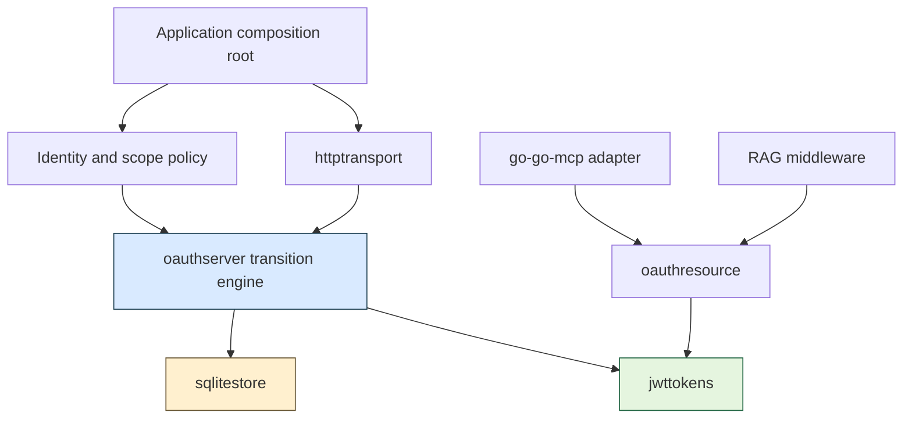
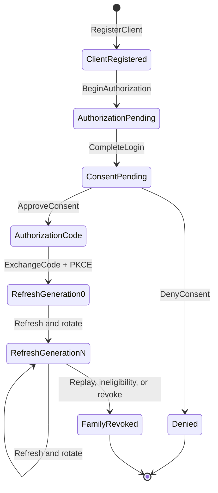
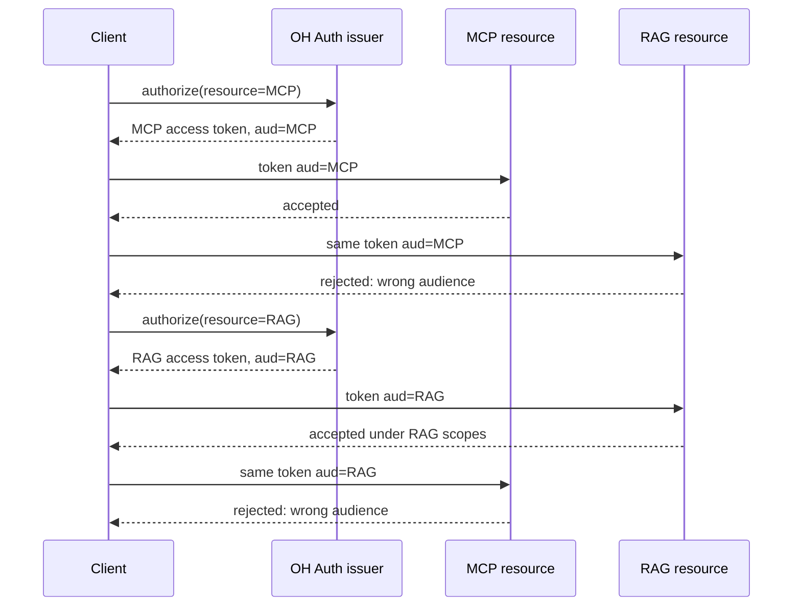

# OH Auth — A Transition-Oriented OAuth Server for MCP and RAG

OH-AUTH-001 extracted CoinVault's OAuth authorization server into `github.com/go-go-golems/oh-auth`, a reusable Go library that issues resource-bound access tokens and validates them at independent resource servers. The library separates OAuth protocol state from CoinVault employee policy, MCP transport, RAG document policy, HTTP parsing, JWT cryptography, and SQLite persistence. Version `v0.0.4` contains the hardened implementation from PR #1 and is the first published version intended for consumer integration.

This report explains the system as an implementation rather than as a list of commits. It starts from the authority model, derives the package boundaries, traces the authorization and refresh transitions, and then examines the defects found during review. The final sections describe the current CoinVault adapter, the incomplete go-go-mcp boundary, the still-pending RAG resource server, and the exact work required to finish the ticket.

> [!summary]
> OH Auth has four defining properties:
> 1. OAuth state advances through typed, atomic transitions rather than generic persistence operations.
> 2. Every authorization, code, refresh grant, JWT, and verification request is bound to one exact resource URL.
> 3. Applications provide identity and policy, but the engine computes the final scope intersection and never permits policy to expand authority.
> 4. The implementation was hardened through persistence-byte probes, shared memory/SQLite conformance, complete local HTTP flows, fault injection, race testing, bounded fuzzing, and exact-head review.
>
> The library is released, but OH-AUTH-001 is not complete. CoinVault still needs to move from a pseudo-version to `v0.0.4`; go-go-mcp's authorization-server and resource-server responsibilities should be separated; an independent RAG consumer must prove cross-audience rejection; and only then should the single consolidated deployed smoke run.

## 1. The problem that required a new library

CoinVault originally contained a working OAuth implementation under `internal/mcpoauth`. It supported dynamic registration, authorization code plus PKCE, employee login through GEC, explicit consent, JWT access tokens, rotating refresh tokens, revocation, SQLite state, and integration with the MCP HTTP server. The behavior was useful, but the implementation boundary was wrong for reuse.

One provider owned all of these responsibilities at once:

- OAuth request parsing and error responses;
- the authorization state machine;
- GEC login and employee revalidation;
- CoinVault capability-to-scope policy;
- SQLite persistence and lifecycle;
- JWT signing and verification;
- consent presentation;
- MCP protected-resource metadata;
- conversion into go-go-mcp's `AuthPrincipal`.

A RAG service could not reuse that implementation without importing CoinVault and MCP-specific types. Copying the code into another server would create two security state machines, two schema histories, two token implementations, and two places to fix replay or lifecycle defects. Moving it into go-go-mcp would make the opposite dependency mistake: a normal HTTP RAG resource server should not import MCP protocol code merely to validate OAuth access tokens.

The extraction therefore established a separate ownership rule:

```text
oh-auth      owns OAuth protocol state, token mechanics, and generic adapters
CoinVault    owns GEC identity, capability policy, claims, and deployment config
go-go-mcp    owns MCP bearer enforcement, principal context, and tool policy
RAG service  owns HTTP route policy and document-level authorization
```

This is not only repository organization. It defines which component is allowed to make each authorization decision.

## 2. Roles, credentials, and exact resources

The system implements an OAuth authorization server for public clients. Claude, ChatGPT, or another host can dynamically register redirect URIs and request delegated access. Because these clients cannot safely retain a client secret, the authorization code flow requires PKCE S256.

There are four relevant roles:

| Role | Concrete implementation |
|---|---|
| Resource owner | The authenticated employee approving consent. |
| OAuth client | An MCP host or another public application requesting access. |
| Authorization server | OH Auth plus CoinVault's GEC and policy adapters. |
| Resource server | CoinVault MCP or a separate RAG HTTP API. |

The distinction between authorization server and resource server controls the architecture. The authorization server issues credentials. The resource server validates an access token for one exact audience and then enforces application operations. MCP dispatch and RAG retrieval do not belong in the OAuth engine.

### 2.1 The credentials are not interchangeable

The protocol advances through several short- or long-lived credentials:

| Credential or state | Purpose | Lifetime and reuse |
|---|---|---|
| Authorization transaction | Binds client, redirect, state, PKCE, scopes, and resource before login. | Short-lived and consumed once by successful login. |
| Consent session | Binds the authenticated principal and maximum allowed grant to the original request. | Short-lived and consumed once by approve or deny. |
| Authorization code | Returns through the client's exact redirect URI. | Very short-lived and exchanged once with the PKCE verifier. |
| Access token | Authorizes requests at exactly one resource server. | Short-lived JWT bearer token. |
| Refresh token | Rotates an existing grant after principal revalidation. | Opaque, single-use, and retained as replay evidence until family expiry. |

Raw authorization, consent, code, and refresh credentials are never intended as durable state. Stores index them by SHA-256 digest. Raw values remain in engine results and HTTP responses only.

### 2.2 A resource is an exact URL

The issuer may serve multiple resource servers, but a grant targets exactly one of them. For example:

```text
issuer:       https://auth.example.com
MCP resource: https://mcp.example.com/mcp
RAG resource: https://rag.example.com/api
```

The access token's `aud` claim must equal the requested resource. A token for the MCP URL must fail at the RAG URL even when it has the same issuer, subject, client, and similarly named scopes. Refresh grants retain the original resource and cannot be rotated into another audience.

This exact binding is the mechanism that allows one issuer to support independent services without creating a universal bearer token.

## 3. The architecture after extraction

The final library has one standard-library domain package and four adapters:



The dependency rules are strict:

- `pkg/oauthserver` imports no HTTP framework, SQL driver, JWT package, CoinVault package, MCP package, or RAG package.
- `httptransport`, `sqlitestore`, and `jwttokens` import `oauthserver` and implement its ports.
- `oauthresource` supplies resource-server helpers without owning MCP tools or RAG documents.
- OH Auth does not import any consumer.

### 3.1 `pkg/oauthserver`: decisions and transitions

The core defines validated identifiers, canonical scope sets, principals, resources, clients, stored states, transition commands, error types, configuration, and the engine. Application-specific principal attributes use one generic parameter:

```go
type Principal[A any] struct {
    Subject              Subject
    DisplayName          string
    Email                string
    AuthorizationVersion int64
    Attributes           A
}
```

CoinVault supplies `GECAttributes`; a RAG deployment can supply a different typed attribute set. Common OAuth identity remains fixed, while application policy avoids `map[string]any` and runtime assertions.

The engine receives effects explicitly:

```go
type Dependencies[A any] struct {
    Store       Store[A]
    Resources   ResourceRegistry
    Scopes      ScopePolicy[A]
    Revalidator PrincipalRevalidator[A]
    Tokens      TokenService[A]
    Secrets     SecretSource
    Clock       Clock
    Audit       AuditSink
}
```

Construction validates that required dependencies exist, the token service's issuer matches the engine issuer, and the injected resource registry matches the configured resource list and scopes. This prevents metadata, grant decisions, and JWTs from silently describing different runtimes.

### 3.2 `pkg/sqlitestore`: durable transition commits

The SQLite adapter uses a pure-Go driver and owns schema versioning, digest-keyed state, client activity, expiry pruning, admission limits, refresh-family history, and atomic transition commits. It uses the same injected clock as the engine.

The store interface is intentionally larger than a CRUD repository. Methods such as `CommitLogin`, `CommitConsent`, `CommitCodeExchange`, and `CommitRefreshRotation` identify the state change being authorized. A generic `Update` would permit a caller to insert successor state without proving how it was derived.

### 3.3 `pkg/jwttokens`: fixed local trust

The token service issues RS256 JWT access tokens and verifies them against locally configured keys. It owns reserved claims such as issuer, subject, audience, expiry, client ID, and scopes. Application claims may be added, but they cannot overwrite reserved names.

Verification rejects:

- `alg=none` and algorithms other than RS256;
- the wrong access-token type;
- unknown key IDs;
- token-provided `jwk`, `jku`, `x5u`, or certificate trust material;
- wrong issuer or exact audience;
- invalid time claims;
- RSA private keys below 2048 bits during construction.

The token selects only among keys already trusted by configuration. It cannot introduce a verification key.

### 3.4 `pkg/httptransport`: a thin protocol boundary

The HTTP adapter publishes RFC 8414 authorization-server metadata and provides registration, authorization, consent, token, revocation, JWKS, and identity callback handlers. It does not claim OpenID Connect support.

Handlers enforce exact methods, bounded request bodies and arrays, parsed media types, scalar cardinality, query/body separation, and secure consent headers. They parse one request, call one engine method, and map one typed result or error.

The issuer contract is origin-only in this release. Path-based issuers are rejected rather than being partially advertised while routes remain mounted at the host root.

### 3.5 `pkg/oauthresource`: the resource-server edge

This package performs strict bearer extraction, delegates token verification for a configured exact resource, renders protected-resource metadata, and formats `WWW-Authenticate`. It returns a neutral `VerifiedAccessToken`; it does not decide whether an MCP tool or RAG route is allowed.

## 4. Scope authority is an intersection

The application policy does not return a final OAuth grant. It returns the scopes currently available to a principal for a resource. The engine derives the grant by intersecting all authority boundaries.

At consent time:

```text
granted scopes =
    requested by the client
  ∩ allowed for the registered client
  ∩ supported by the selected resource
  ∩ available to the authenticated principal
  ∩ selected by the employee
```

During refresh:

```text
next scopes =
    scopes in the current refresh grant
  ∩ scopes currently available after revalidation
```

The second rule prevents capability expansion from silently expanding an existing grant. If an employee gains a new capability, a refresh of an older grant does not add it. A new authorization and consent flow is required.

`ScopeSet` supports this model by canonicalizing, sorting, deduplicating, and returning copies rather than exposing mutable map state. Deterministic ordering also stabilizes JWT claims, metadata, audit records, and tests.

## 5. The authorization state machine

The core lifecycle is a sequence of one-time transitions:



Every arrow must preserve three classes of invariant:

1. **Binding:** client, redirect, PKCE, principal, family, and exact resource remain attached to the same flow.
2. **Authority:** successor scopes do not exceed predecessor or current policy.
3. **Lifecycle:** the predecessor is live and unconsumed, and exactly one concurrent transition wins.

### 5.1 Registration and authorization start

Dynamic registration creates only unverified public clients. Client-provided metadata cannot claim configured trust. Redirect URIs are validated and compared as exact strings later; query-bearing redirects are allowed, while fragments, user information, and unsafe schemes are rejected. HTTPS is required except for loopback development callbacks.

Unverified clients have a bounded idle lease. The store can recover registration capacity by pruning expired clients, but only when no live authorization, consent, code, or refresh state references them. Successful authorization activity updates the authoritative activity column.

`BeginAuthorization` validates response type, state, S256 challenge, scopes, client, exact redirect, and exact resource. It then creates a short-lived transaction and returns the login context required by the application identity adapter.

### 5.2 Login completion and consent

The identity callback is application-owned. In CoinVault, a GEC assertion becomes a typed principal only after capability eligibility and stable subject validation.

The engine reloads the transaction, client, and resource; asks the application policy for available scopes; computes the maximum grant; and atomically consumes the authorization transaction while creating a consent session.

The consent session snapshots the client identity and exact destination. The page displays:

- client display name and unverified/configured trust;
- exact redirect URI and origin;
- resource name;
- principal name and email;
- selectable scopes;
- access-token duration;
- absolute authorization end time.

The random, expiring, one-time consent token is also the synchronizer token submitted by the form. Missing, wrong, expired, and replayed tokens fail. The page is no-store, unframeable, no-referrer, and restricted by a tight content-security policy.

### 5.3 Code exchange prepares effects before consumption

Code exchange validates client, exact redirect, code expiry, and the PKCE verifier. It prepares the access token, refresh token, and family ID before committing the one-time state transition.

The ordering matters:

```text
load code without consuming
  -> validate binding and PKCE
  -> issue candidate access token
  -> generate candidate refresh credential and family
  -> atomically consume code and insert refresh generation 0
  -> return credentials
```

If signing or secret generation fails, the code remains retryable. If two correct exchanges race, both may prepare candidate outputs, but only one atomic commit can consume the code. Only the winner returns authority.

### 5.4 Refresh revalidates identity and narrows authority

A refresh token is looked up by digest and checked for client binding, expiry, revocation, and prior consumption. Replay of a consumed generation revokes its family before any external revalidation, policy lookup, signing, or random generation. This order ensures a replay cannot escape revocation because an unrelated dependency failed first.

For a current token, principal revalidation has three explicit outcomes:

| Outcome | Engine behavior |
|---|---|
| Eligible | Require the same stable subject, recalculate available scopes, intersect, issue, and rotate. |
| Ineligible | Persist family revocation, then return `invalid_grant`. |
| Unknown or operational error | Issue nothing, consume nothing, and return a temporary error. |

An invalid enum value fails closed. A different subject cannot replace the subject on an existing refresh family.

The successor retains family, client, subject, resource, and absolute family expiry; generation increments by one; scopes can only narrow. A bounded `MaxRefreshGenerations` limits retained replay history for one family.

## 6. Atomic storage means validating the transition

An SQL transaction guarantees that a collection of writes commits or rolls back together. It does not guarantee that the writes represent a valid OAuth transition. That distinction became one of the central review findings.

The first store implementation checked whether a predecessor existed and was unconsumed, then accepted a caller-constructed successor. A future engine bug could have moved a code to another resource or expanded refresh scopes while still committing atomically.

The repaired design runs pure transition validators inside both memory and SQLite commit paths. For refresh rotation, the validator checks:

```go
func ValidateRefreshRotation[A any](
    current RefreshGrant[A],
    rotation RefreshRotation[A],
    now time.Time,
) error {
    // Current family/generation must match the command.
    // Current grant must be live and unconsumed.
    // Successor family, client, subject, resource, and expiry are fixed.
    // Generation must increase by exactly one.
    // Successor scopes must be a subset of current scopes.
    // Successor starts unconsumed and unrevoked.
}
```

Equivalent validators cover login, consent, and code exchange. Tests construct forged successors and prove that rejection leaves the predecessor usable for a correct retry.

This establishes a precise division of responsibility:

- the engine decides policy, performs external effects, and constructs a candidate successor;
- the store authoritatively verifies predecessor-to-successor invariants under the same transaction that consumes and inserts.

## 7. Durable state and replay evidence

### 7.1 Digest-only credentials

The original durable adapter used digest primary keys but serialized complete authorization and consent domain records as JSON. Those records still contained raw transaction and consent tokens. The database therefore violated the documented digest-only boundary even though ordinary lookups used digests.

The corrected models exclude raw handles from serialized payloads. The engine derives the digest from the presented credential rather than expecting the store to return plaintext. A database-byte probe searches for known generated credentials and now reports that neither authorization nor consent payloads contain them.

This defect was not caught by testing Go values. It required inspecting SQLite bytes and serialized payloads. The resulting rule is explicit: every durable-store conformance suite must test the persistence representation, not only the public method result.

### 7.2 Protocol expiry rather than ambiguous retention

One-time state remains until its protocol expiry so replay and consumed-state classification remain meaningful during the period in which the credential could otherwise be used. Refresh generations remain through the family expiry because old digests are required to detect replay.

The early configuration contained `ConsumedState` and `RevokedState` retention knobs that SQLite did not implement consistently. They were removed rather than retained as ineffective public settings. Longer forensic history belongs in redacted audit storage, not in partially honored live-credential tables.

### 7.3 Active capacity differs from retained history

Consumed refresh generations must be retained for replay detection, but they must not count as independent active refresh families. The initial quota counted retained rows and could reject legitimate rotation as history accumulated.

The repaired admission model counts active families separately from retained generations. A second limit bounds the generations inside one family. These are distinct resources with distinct failure responses.

## 8. JWT and resource-server enforcement

An access token contains integrity-protected information, but verification is not complete until the resource server supplies the expected audience. The same token service can validate tokens for multiple configured resources only because every call names the exact expected resource.

A successful verification produces a neutral value similar to:

```go
type VerifiedAccessToken struct {
    Subject     Subject
    ClientID    ClientID
    Issuer      string
    Resource    ResourceID
    Scopes      ScopeSet
    IssuedAt    time.Time
    ExpiresAt   time.Time
    TokenID     string
    ExtraClaims map[string]any
}
```

Resource adapters then apply local policy:

```text
verify signature, type, key, issuer, time, exact audience
  -> obtain VerifiedAccessToken
  -> require route/tool scopes
  -> place verified principal in request context
  -> derive application filters from trusted identity and server policy
```

Model arguments, user-supplied document filters, and UI visibility cannot supply authority. Every protected operation must have an explicit deny-by-default policy.

## 9. CoinVault as the first consumer

CoinVault now retains only application concerns in `internal/mcpoauth/provider.go`:

- `GECAttributes` and conversion from a validated GEC principal;
- the capability-to-scope policy;
- employee JWT extra claims;
- GEC login URL construction and callback authentication;
- principal revalidation;
- deployment configuration and key material;
- conversion into go-go-mcp's `AuthPrincipal`.

The provider constructs a static resource registry for the CoinVault MCP URL, an RS256 token service, the generic engine, and the HTTP transport. Its principal adapter copies capability slices rather than retaining external mutable storage.

The policy is short because the authority algorithm remains in OH Auth:

```go
func (gecScopePolicy) AvailableScopes(
    _ context.Context,
    principal oauthserver.Principal[GECAttributes],
    _ oauthserver.Resource,
) (oauthserver.ScopeSet, error) {
    values := mcpauthz.ScopesForGECCapabilities(
        principal.Attributes.Capabilities,
    )
    values = append(values, "offline_access")
    return oauthserver.NewScopeSet(stringScopes(values)...)
}
```

The GEC policy declares what is currently available. It cannot grant scopes absent from the client request, registration, resource, consent selection, or previous refresh grant.

The complete CoinVault integration test runs registration, authorization, fake GEC callback, consent, code exchange, access-token validation, refresh, and revocation. This replaced an earlier shallow construction/metadata test and established that the consumer adapter composes the full generic runtime.

### 9.1 The immediate release update

CoinVault currently declares a pseudo-version ending at `c0544d83`. Release `v0.0.4` contains that hardened commit and the merged PR #1 history. The next integration change should replace the pseudo-version with:

```text
github.com/go-go-golems/oh-auth v0.0.4
```

Then the focused integration tests and the complete CoinVault `GOWORK=off` gates must run. This closes the design requirement that a real consumer compile and pass without relying on `go.work` or an unreleased commit.

## 10. The go-go-mcp boundary is still too broad

`go-go-mcp/pkg/embeddable.HTTPAuthProvider` currently combines four capabilities:

```go
type HTTPAuthProvider interface {
    MountRoutes(mux *http.ServeMux)
    ValidateBearerToken(ctx context.Context, token string) (AuthPrincipal, error)
    ProtectedResourceMetadata() map[string]any
    WWWAuthenticateHeader() string
}
```

The MCP server calls `MountRoutes` while wrapping its own `/mcp` handler. This means a resource-server authentication provider also owns authorization-server routes. CoinVault satisfies the interface by mounting OH Auth registration, authorization, consent, token, revoke, JWKS, and GEC callback routes through the MCP authentication path.

The design target is narrower:

```text
application composition root:
  mount OH Auth authorization-server routes
  mount GEC callback
  construct MCP verifier/metadata adapter

go-go-mcp:
  publish protected-resource metadata
  extract and verify bearer token
  inject AuthPrincipal
  enforce tool scopes
```

`go-go-mcp` does not need an immediate dependency update merely because `v0.0.4` exists. It currently imports no OH Auth package. The refactor should first separate route mounting from resource verification, then decide whether a small adapter belongs in go-go-mcp or remains in the application. The important rule is that OH Auth must not import go-go-mcp.

A useful target interface is:

```go
type HTTPTokenVerifier interface {
    ValidateBearerToken(context.Context, string) (AuthPrincipal, error)
    ProtectedResourceMetadata() ProtectedResourceMetadata
    WWWAuthenticateHeader() string
}
```

Authorization-server route mounting would become an explicit composition-root action rather than a method invoked by MCP middleware.

## 11. The missing RAG consumer

The release is not proven as a reusable multi-resource library until a second resource server consumes it independently. The RAG integration must use a resource URL different from CoinVault MCP and scopes specific to RAG operations.

The minimum deterministic evidence is:

1. obtain or issue a token for the MCP resource;
2. verify it at MCP and reject it at RAG;
3. obtain or issue a token for the RAG resource;
4. verify it at RAG and reject it at MCP;
5. prove refresh remains bound to the original resource;
6. derive document filters only from verified token identity, trusted claims, and server-side policy;
7. deny protected routes that have no explicit scope policy.



These are local integration tests, not deployed smoke tests. They should use injected clocks, deterministic identity adapters, temporary SQLite, and `httptest` where HTTP behavior matters.

## 12. Review findings that changed the architecture

PR #1 accumulated 26 captured inline comments across nine reviewed commits. The useful result was not the number of comments; it was the set of invariants derived from them.

### 12.1 Recoverable dynamic-registration capacity

A durable maximum client count without expiration permits an unauthenticated caller to fill the table permanently. The fix introduced an idle TTL for unverified clients and prevented deletion while any live OAuth state references a client.

The general rule is that every unauthenticated durable admission limit requires a recovery lifecycle. A quota without expiry, deletion, or administrative recovery is a durable denial-of-service state.

### 12.2 Durable security effects must report persistence failure

Refresh ineligibility originally attempted family revocation and returned `invalid_grant` even when revocation failed. Explicit revocation similarly risked hiding infrastructure failures under RFC non-disclosure behavior.

The corrected taxonomy distinguishes semantic absence from operational failure. Unknown tokens and wrong-client tokens remain non-disclosing. Database failure returns a temporary error because the server cannot truthfully claim the security state changed.

### 12.3 Configuration must have one owner

Issuer, resources, clock, token service, and HTTP policy initially appeared in multiple constructors. Individually valid adapters could advertise one issuer, sign another, and authorize a third registry.

The engine now exposes immutable adapter views and checks token issuer and resource registry coherence during construction. HTTP transport receives the engine rather than independent copies of security configuration.

### 12.4 Protocol parsers must reject ambiguity

OAuth scalar fields are security bindings. Accepting duplicate values and relying on `url.Values.Get` makes parameter order choose identity, redirect, code, or verifier semantics. Token and revocation endpoints now reject query/body mixing and duplicate scalar fields. Media types are parsed rather than compared as fragile exact strings or accepted with unsafe prefixes.

### 12.5 Review must target the exact head

An earlier project status claimed that a re-review was green before the asynchronous review of the current head had completed. Four comments arrived afterward. The review process was changed to require that the review summary references the exact head and that current-head inline comments are classified separately from CI checks.

Review was stopped once remaining suggestions became optional response categorization rather than authority, durability, availability, or interoperability defects. The final material issue—refresh digest collisions in the memory store—was fixed. Returning distinct 413/415 statuses instead of the existing bounded OAuth `400 invalid_request` remains ordinary backlog.

## 13. Why ordinary green tests were insufficient

The first implementation passed unit tests, lint, vet, static security scans, and vulnerability scans while still persisting raw credentials and accepting caller-forged successor authority at the store boundary. The checks answered different questions from the architecture claims.

The missing evidence fell into five categories:

- **Representation evidence:** inspect actual database bytes, not only decoded Go records.
- **Adapter conformance:** run the same transition cases against memory and SQLite.
- **Fault injection:** make revocation, revalidation, signing, secret generation, and persistence fail at precise points.
- **Adversarial parsing:** test duplicate parameters, query/body ambiguity, malformed metadata, URL edge cases, and bounded inputs.
- **Complete flow evidence:** run the entire HTTP lifecycle instead of isolated metadata and registration handlers.

The final deterministic suite added each category. Bounded fuzzing exercised 40,986 parser cases in six seconds. Direct statement coverage increased from 48.8% to 59.2%; HTTP reached 72.7%, oauthresource 66.7%, oauthserver 67.7%, SQLite 64.2%, and JWT 78.6%. Coverage did not define completion, but uncovered critical paths had previously matched the review defects.

## 14. Validation and release evidence

The release candidate passed:

```text
GOWORK=off go test ./... -count=1
GOWORK=off go test -race ./... -count=1
GOWORK=off go vet ./...
GOWORK=off golangci-lint run -v
GOWORK=off gosec ... ./...
GOWORK=off govulncheck ./...
GOWORK=off go test ./pkg/oauthserver -run='^$' \
  -fuzz=FuzzOAuthValueParsers -fuzztime=5s
```

The final PR head passed test, lint, Go vulnerability, GoSec, CodeQL, dependency review, and secret scanning. CoinVault passed its own full pre-push build, lint, security, vulnerability, and test suite against the hardened pseudo-version.

Version `v0.0.4` points at the merge containing PR #1 and the restored semantic-version tag targets. The later `release` Makefile target was merged after that tag and will appear in the next release; this does not affect the contents consumed from `v0.0.4`.

## 15. What was deliberately not built

The v0.0.4 release is a focused authorization-code server, not a complete identity or OAuth product. It does not implement:

- confidential-client secrets;
- client credentials, device code, or token exchange grants;
- RFC 7592 client management;
- social identity-provider implementations;
- user account and grant-management UI;
- PAR, JAR, RAR, DPoP, or mTLS sender-constrained tokens;
- distributed Redis or SQL persistence;
- path-based or multi-tenant issuers;
- opaque access-token introspection;
- an arbitrary consent renderer that can omit mandatory security information.

The OWASP review initially expanded the design toward grant management, immediate JWT revocation, browser cookie binding, authentication context, and high-assurance profiles. Those items were moved into a deferred roadmap because no current product requirement justified the additional persistence, UI, runtime coupling, or deployment cost.

The release claims an OWASP-informed shipping baseline, not ASVS certification.

## 16. Current status and completion plan

The work has reached a published-library checkpoint, not the end of OH-AUTH-001.

| Phase | Status | Required next evidence |
|---|---|---|
| OH Auth core/adapters/hardening | Complete and released as `v0.0.4` | Maintain normal release validation. |
| CoinVault direct cutover | Implemented against pseudo-version | Upgrade to `v0.0.4`, tidy, run full `GOWORK=off`, remove residual coupling. |
| go-go-mcp boundary | Functional but broad | Separate authorization route mounting from resource verification and preserve principal context/tool policy. |
| Independent RAG resource | Pending | Add exact RAG resource/scopes and bidirectional audience-isolation tests. |
| Duplicate cleanup | Partially complete | Search all consumers for duplicate OAuth mechanics and obsolete adapters. |
| Final deployed acceptance | Pending | Run one consolidated smoke after release-candidate MCP and RAG deployment. |

The next implementation sequence should be:

1. update CoinVault from the pseudo-version to `v0.0.4` and validate outside the workspace;
2. characterize and narrow go-go-mcp's `HTTPAuthProvider` boundary without disrupting embedded dev or external OIDC modes;
3. mount CoinVault's authorization-server routes explicitly in its composition root;
4. integrate an independent RAG resource with exact scopes and deny-by-default middleware;
5. add cross-audience and resource-bound refresh integration tests;
6. remove duplicate or obsolete OAuth glue;
7. run all deterministic repository gates;
8. deploy the release candidate and run the single final non-destructive smoke.

## 17. Working rules for future contributors

> [!important]
> Treat every OAuth credential as a transition capability with exact bindings. A successful method is not allowed to mean “the operation probably happened.” It must mean the authoritative transition committed with the expected predecessor, successor, time, client, subject, scope, and resource.

The practical rules are:

- Keep OAuth mechanics independent of CoinVault, MCP, RAG, HTTP policy, and application identity.
- Keep one exact resource on every grant and require it during verification.
- Let application policy state availability; let the engine compute the grant.
- Prepare fallible outputs before consuming retryable state.
- Revoke replay before calling fallible external dependencies.
- Propagate persistence failures when a security effect must be durable.
- Persist credential digests, then inspect storage bytes to prove the boundary.
- Use one injected clock across engine, token service, memory store, and SQLite.
- Make stores validate successor derivation inside atomic commits.
- Do not add compatibility layers or protocol features without a named consumer requirement.
- Add deterministic tests for security negatives; reserve deployed smoke for final composition.
- Stop broad review loops when material invariants are covered and remaining findings are protocol polish.

## 18. Source map for the next engineer

### Canonical ticket documents

- Design and implementation guide: `/home/manuel/workspaces/2026-08-28/coinvault-oidc-mcp/oh-auth/ttmp/2026/09/01/OH-AUTH-001--extract-a-composable-oauth-authorization-server-from-coinvault/design-doc/01-composable-oauth-server-extraction-analysis-design-and-implementation-guide.md`
- Deferred OWASP roadmap: `/home/manuel/workspaces/2026-08-28/coinvault-oidc-mcp/oh-auth/ttmp/2026/09/01/OH-AUTH-001--extract-a-composable-oauth-authorization-server-from-coinvault/design-doc/02-deferred-owasp-hardening-and-higher-assurance-roadmap.md`
- Investigation diary: `/home/manuel/workspaces/2026-08-28/coinvault-oidc-mcp/oh-auth/ttmp/2026/09/01/OH-AUTH-001--extract-a-composable-oauth-authorization-server-from-coinvault/reference/01-investigation-diary.md`
- Senior implementation review: `/home/manuel/workspaces/2026-08-28/coinvault-oidc-mcp/oh-auth/ttmp/2026/09/01/OH-AUTH-001--extract-a-composable-oauth-authorization-server-from-coinvault/code-review/01-senior-review-of-pr-1-architecture-implementation-and-review-process.md`

### Core implementation

- `oh-auth/pkg/oauthserver/engine.go` — operation ordering, authority intersection, refresh behavior, and audit outcomes.
- `oh-auth/pkg/oauthserver/transitions.go` — authoritative predecessor/successor validators.
- `oh-auth/pkg/oauthserver/ports.go` — store and effect contracts.
- `oh-auth/pkg/oauthserver/config.go` — validated issuer, resource, TTL, capacity, and HTTP policies.
- `oh-auth/pkg/sqlitestore/store.go` — durable schema, transitions, lifecycle, and replay history.
- `oh-auth/pkg/jwttokens/service.go` — fixed-trust RS256 issuance and verification.
- `oh-auth/pkg/httptransport/server.go` — protocol parsing, metadata, consent, and endpoint behavior.
- `oh-auth/pkg/oauthresource/token.go` — resource-server bearer verification helpers.

### Executable contracts

- `oh-auth/pkg/oauthserver/store_conformance_test.go` — shared memory/SQLite behavior.
- `oh-auth/pkg/httptransport/flow_test.go` — complete local authorization, refresh, and revoke flow.
- `oh-auth/pkg/oauthserver/security_test.go` — fault and security invariants.
- `oh-auth/pkg/oauthserver/fuzz_test.go` — bounded value-parser fuzz target.
- `oh-auth/ttmp/.../scripts/03-probe-sqlite-boundaries.sh` — durable representation probe.

### Consumers

- `coinvault/internal/mcpoauth/provider.go` — GEC identity/policy/claims and current MCP adapter.
- `coinvault/internal/mcpoauth/provider_test.go` — complete GEC-backed integration flow.
- `coinvault/cmd/coinvault/cmds/mcp.go` — current composition root.
- `go-go-mcp/pkg/embeddable/auth_provider.go` — broad provider interface to narrow.
- `go-go-mcp/pkg/embeddable/official_backend.go` — bearer middleware, metadata, and principal context.

## 19. Final assessment

OH Auth now has a coherent security center. The domain types express exact resources and typed principals; scopes only narrow; the engine orders fallible effects around one-time state; SQLite validates transitions as well as committing them; JWT trust is fixed by configuration; and consumers receive a neutral verified token rather than protocol-specific authority.

The most important implementation result is not a particular endpoint. It is that the library can state and test what successful authority creation means. A code exchange succeeds only when its predecessor is valid, its output is prepared, and its code-to-refresh transition commits. A refresh succeeds only when identity is currently eligible, scopes remain bounded, and one family generation atomically replaces another. A resource request succeeds only when the token verifies for the exact audience and the local operation policy accepts its scopes.

Version `v0.0.4` makes that implementation available as a package. The remaining work is now consumer architecture: use the release in CoinVault, separate MCP resource verification from authorization-server route ownership, prove an independent RAG audience, and run one final deployed composition check. Those steps complete the purpose for which the library was extracted: one OAuth implementation serving multiple independent resource servers without giving any of them authority over the others.
