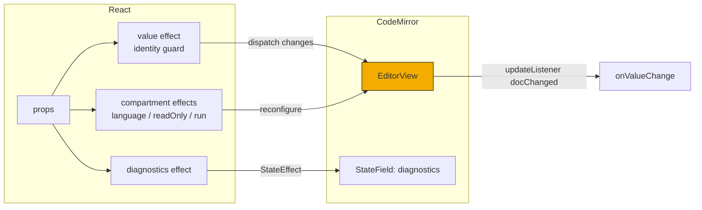
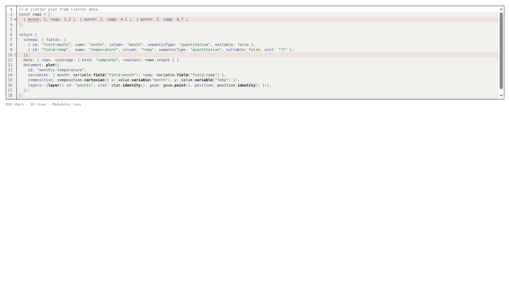
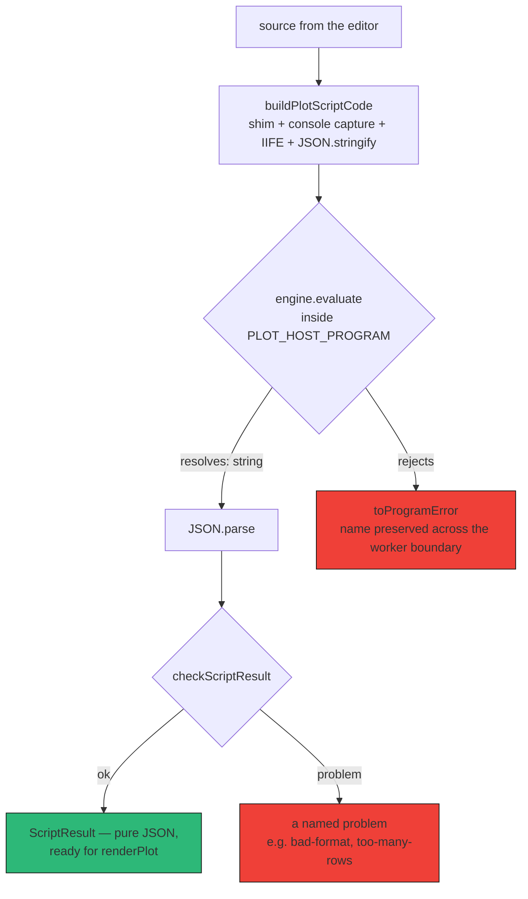
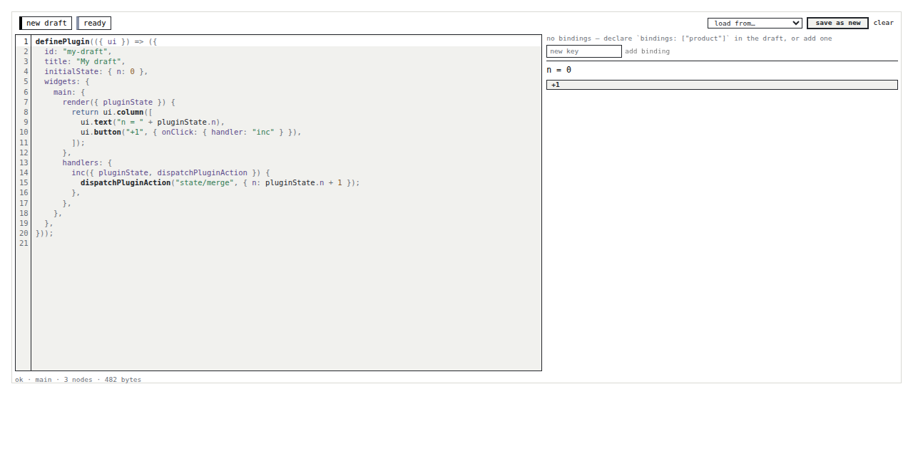
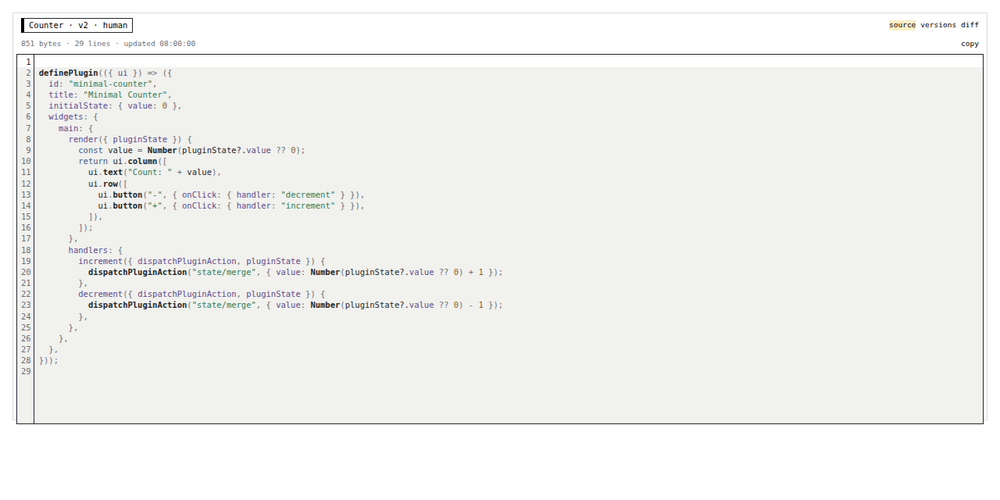
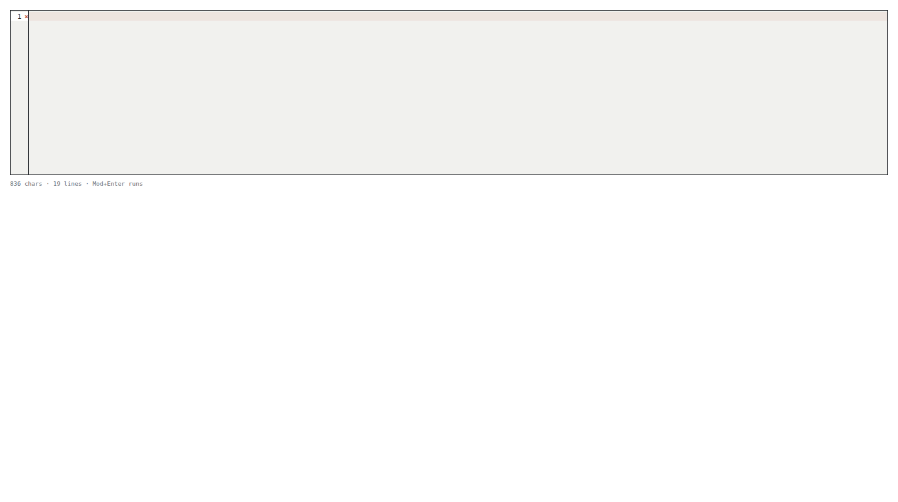

# PBUI Editor — A CodeMirror Tile and a Plot Shim for a Sandboxed Workbench

This report explains PBUI-PLOTKIT-1: the addition of a CodeMirror 6 editor package (`@hyperslop-systems/pbui-editor`) to the pbui monorepo, and the addition of a plot authoring shim to `@hyperslop-systems/pbui-sandbox` that lets a sandboxed JavaScript program construct a complete plot specification without importing any package. It is written as a technical deep dive rather than a changelog. The goal is to teach the two mechanisms — the React/CodeMirror bridge and the shim's JSON boundary — well enough that the next engineer can extend either without rediscovering the constraints that shaped them.

> [!summary]
> Two pieces of enabling infrastructure, built in one day across five phases and eight commits on `task/add-plot-editor`:
> 1. `packages/pbui-editor` — a `CodeEditor` component wrapping CodeMirror 6, API-compatible in spirit with pbui's `TextArea`, themed entirely from design-system tokens, with a diagnostics gutter and a deliberately edited keymap.
> 2. `packages/pbui-sandbox/src/plot/` — the `@hyperslop-systems/plot` authoring API reproduced as injectable source (exact, and provably so via a 63-case parity test), plus a `ScriptResult` contract, a structural guard, and a `runPlotScript` runner that works identically under the `eval` engine and QuickJS.
> Both were proven on real call sites before any external consumer existed: the sandbox's `PlaygroundTile` and `SourceTile` migrated onto `CodeEditor` in the same ticket.

## The shortest version

```text
user types JavaScript in a CodeEditor tile
  -> pbui-editor: CodeMirror 6, token theme, gutter diagnostics
  -> pbui-sandbox: buildPlotScriptCode(source)
       = author shim + IIFE wrapper + JSON.stringify
  -> ProgramEngine.evaluate (eval today, QuickJS by one argument)
  -> checkScriptResult: is this shaped like { document, schema, data }?
  -> the result is pure JSON, ready for @hyperslop-systems/plot's renderPlot
```

Validation, at the end of the ticket:

```text
pbui-editor      12 tests   pbui core  272 tests
pbui-sandbox    203 tests   consumer smoke: packed tarballs install
                            from the public registry, typecheck under
                            skipLibCheck: false, and build
```

The design document and the implementation diary live in `pbui/ttmp/2026/09/01/PBUI-PLOTKIT-1--the-javascript-editor-tile-and-the-plot-sandbox-shim/`. The consumer is PBUI-PLOTSCRIPT-1, reported separately in [[PROJECT REPORT - PBUI Plotscript - Scripted Plots, Nine Examples, and Grids of Plots]].

## Why this project exists

The pbui monorepo is a family of React packages around a presentation-based design system: `@hyperslop-systems/pbui` (the design system), `pbui-workbench` (a tiled window manager over a protobuf document), `pbui-sandbox` (a runtime for agent-written JavaScript programs), `pbui-chat`, and `datalab-ui` (a data-analysis product). A separate repository, `plot`, holds a grammar-of-graphics compiler: a pure function from `{ document, schema, data, viewport }` to a renderer-neutral scene.

The goal of the wider effort is a workspace where a user writes a JavaScript program that produces a plot and sees the result live in an adjacent tile. Two capabilities were missing:

1. **A real code editor.** The design system's only multi-line surface is `TextArea` — a `<textarea>` with a monospace mode. It has no syntax highlighting, no line numbers, no bracket matching, and no way to mark a diagnostic on a line. Two sandbox devtools already worked around this: `PlaygroundTile` edited programs in a bare `TextArea`, and `SourceTile` hand-built a `<pre><ol><li>` listing with CSS-counter line numbers.
2. **A way for sandboxed code to build a plot.** The sandbox evaluates untrusted programs under engines that provide no module loader. A program cannot `import` the plot package's authoring helpers, and without them, writing a plot document by hand is verbose enough to defeat the point.

This ticket built both, and nothing user-visible: the tiles that put them together belong to the consumer ticket. That boundary was deliberate. Both pieces are reusable — the editor by any pbui product, the shim by anything that runs plot-producing scripts — and building them without a consumer forced their interfaces to be stated rather than accreted.

## The mental model

Three facts, established before any code was written, determine the whole design.

**Fact 1: pbui core has no runtime dependencies, and that is load-bearing.** `pbui/package.json` has no `dependencies` key at all; React is a peer. Every product consumes the design system without inheriting library choices. CodeMirror 6 is six packages and roughly 500 KB unminified. Adding it to the core would tax four products that never open an editor. Therefore the editor is a new peer package, following the shape `pbui-workbench` and `pbui-sandbox` already have: own dependencies, own `styles.css` export, tokens read from the core.

**Fact 2: the plot document is JSON, all the way down.** The plot package's authoring API looks typed — `fieldId("field:x")` returns a branded `FieldId`, `geom.point()` returns a `GeomSpec` — but every brand erases at runtime:

```ts
// plot/src/document.ts
export type FieldId = string & { readonly [fieldIdBrand]: true };
export function fieldId(value: string): FieldId { return value as FieldId; }
```

and every authoring function is a pure object constructor:

```ts
// plot/src/author/geom.ts — the whole module, abbreviated
export const geom = {
  point: (o = {}) => ({ kind: "point", ...o }),
  bar:   (o = {}) => ({ kind: "bar",   ...o }),
  // line, area, errorbar, ribbon, boxplot
};
```

No classes, no held state, no imports beyond types. A plain JavaScript program, with no TypeScript and no module loader, can therefore construct a byte-identical `PlotDocument` from object literals alone. This is the hinge of the shim: a ~140-line reproduction of the authoring API is *exact*, not approximate, and a test can prove it.

**Fact 3: everything crosses the sandbox boundary as JSON.** The sandbox's contract file states the rule: no functions, no class instances, no host objects cross an engine boundary. This rule is what lets the same program run under `new Function` today and QuickJS-in-a-Worker tomorrow. The shim and the script contract inherit it for free — because of Fact 2, a plot request is already JSON.

## The editor package

### The component API mirrors TextArea

`CodeEditor`'s props follow `TextArea`'s conventions exactly, so a migrating call site changes the import and adds a `language`:

```ts
export interface CodeEditorProps {
  value: string;
  onValueChange(value: string): void;       // unwrapped; every call site wants the string
  accessibleName: string;                   // required; becomes aria-label
  language?: "javascript" | "json" | "plain";
  readOnly?: boolean;
  lineNumbers?: boolean;                    // default true
  diagnostics?: readonly EditorDiagnostic[];
  onRun?(value: string): void;              // Mod+Enter
  rows?: number;                            // lines of content; omit to fill the container
  className?: string;
}
```

The two sizing modes matter in practice. With `rows`, the height is computed from the same tokens the theme uses for content (`calc(rows × var(--pbui-fs-small) × var(--pbui-lh-tight) + padding + border)`), so the arithmetic matches what CodeMirror draws. Without `rows`, the editor fills its container — the tile case — which requires the container to be a bounded box (`minmax(0, 1fr)` in a grid). Both consumers of this package hit the second mode within a day.

### The React/CodeMirror bridge

CodeMirror owns its own DOM and its own state; React must not fight it. The reconciliation is four rules:

```text
mount        -> new EditorView({ state: EditorState.create({ doc: value, extensions }) })
value prop   -> if (value !== view.state.doc.toString())
                  view.dispatch({ changes: { from: 0, to: doc.length, insert: value } })
user edit    -> updateListener: if (update.docChanged) onValueChange(doc.toString())
unmount      -> view.destroy()
```

The guard on the value rule is the part that fails silently when omitted. A controlled component round-trips every edit: the user types, `onValueChange` fires, the parent stores the string, React re-renders with the same string as a prop. Without the identity comparison, that re-render replaces the entire document, the selection is mapped through a full replacement, and the cursor lands at position 0 after every keystroke. The test suite pins this with two assertions: an identical incoming value dispatches nothing, and the full edit-store-rerender loop leaves the cursor where the user put it.

Props that change an extension rather than the document — `language`, `readOnly`, the run chord — live in `Compartment` instances, so a prop change is a `reconfigure` effect on the same view rather than a remount that would discard undo history and scroll position. Callbacks (`onValueChange`, `onRun`) are read through refs, so a new closure per render never causes a reconfigure.



### The keymap collides with the workbench twice

The design system routes two application chords through a pure function over a static table: `Mod+K` opens the workbench launcher and `Mod+Shift+K` opens the rebalance dialog. The launcher's listener is registered on `window` in the **capture** phase and calls `preventDefault()`, so for these chords the workbench always wins and the editor never sees the key.

The design predicted one collision and the tests found a second:

| Chord | CodeMirror `defaultKeymap` | Workbench | Resolution |
|---|---|---|---|
| `Mod+Shift+K` | `deleteLine` | open rebalance | `deleteLine` removed from the keymap — a binding that looks bound and does nothing is worse than none |
| `Mod+Enter` | `insertBlankLine` | — | the run chord is registered at `Prec.highest`, or the base keymap handles the event first and `onRun` never fires |
| `Mod+K` | unbound | open launcher | no conflict |
| `Escape` | `simplifySelection` | deliberately absent from the table | no conflict |

The `Mod+Enter` case is worth dwelling on because the failing test was initially misdiagnosed. The first hypothesis was that jsdom's empty `navigator.platform` confused CodeMirror's `Mod` resolution. A probe test with a bare `keymap.of([{ key: "Mod-Enter", … }])` fired correctly under `ctrlKey`, which eliminated the platform theory and left only precedence: keymaps registered by multiple extensions are consulted in extension order, and the first binding that returns `true` consumes the event. `defaultKeymap` sat earlier in the array. `Prec.highest` on the run binding is the fix, and the comment in `runKeymap` records that it was found by a test rather than by reading the keymap.

One piece of good news required no work at all: the workbench's `isEditableTarget()` guard returns `true` for `target.isContentEditable`, and CodeMirror 6's editing surface is a `contenteditable` div. Focus detection worked on day one.

### Theming through tokens, and the guard that keeps it honest

Every colour and font in the theme is a `var(--pbui-*)` read. Six new tokens — `--pbui-syntax-{keyword,string,number,function,property,comment}` — were added to the core's `tokens.css`, not defined locally, because an undefined CSS custom property does not fall back and does not warn: it invalidates the entire declaration at computed-value time. The core package guards this with a test asserting every token read in its stylesheets has a `:where(:root)` default — but that guard scans CSS, and this theme is JavaScript (`EditorView.theme({...})`). The editor package therefore carries its own `tokens-read` test: it extracts every `var(--pbui-…)` from `theme.ts` and the module CSS and asserts each one is defined in the core's `tokens.css`. Without it, the exact failure mode the core documents would re-enter through the back door.

### Diagnostics as a StateField

The diagnostics API takes 1-based lines and columns, because that is what every compiler, engine, and stack trace reports; converting to CodeMirror's 0-based offsets is the module's job, not the caller's. Three details carry the design:

- A diagnostic beyond the end of the document is **clamped to the last line** rather than thrown on. A reporter that says "line 400" of a 12-line script is wrong, but it is not a reason to crash the tile, and the last line is where the author will look.
- `RangeSetBuilder` throws on out-of-order or equal-start ranges, so the list is sorted by `(line, column)` and equal starts are skipped — two diagnostics at one position would otherwise be a render-time crash.
- The gutter shows the worst severity per line (`×` error, `!` warning, `·` info), with the message as the title.



## The plot shim

### A string, because there is no module loader

The shim is a `String.raw` constant, not a module, because it is prepended to the code an engine evaluates. Under QuickJS there is no module loader; under `eval` there is no reason to behave differently. One code path serves both engines — the same argument the sandbox's JSON-only rule makes about data, applied to code.

```js
// packages/pbui-sandbox/src/plot/authorShim.ts (excerpt of the injected source)
const plot = (input) => ({ format: "hyperslop.plot", version: 1, ...input });
const geom = {
  point: (o = {}) => ({ kind: "point", ...o }),
  // ...
};
const scale = {
  linear: (o = {}) => ({ kind: "linear", ...o }),
  // ...
};
// The branded id constructors erase at runtime; they exist so a script
// copied out of the plot README runs unchanged.
const fieldId = (v) => v;
```

Version 1 carried eleven namespaces. Version 2 added `annotation`, `coordinate`, `guide`, and `transform` when the consumer ticket's showcase examples needed reference lines, polar coordinates, configured axes, and derived variables. The rule for growth is stated in the file: nothing joins the shim without a call site and a parity case.

### The parity test is what makes a hand-copied API maintainable

A shim is a duplicate of somebody else's API, and duplicates rot. The defense is a test that evaluates each expression against the shim alone and compares the result with the real package's output:

```ts
const inShim = (expression) => new Function(`${PLOT_AUTHOR_SHIM}\nreturn (${expression});`)();

["geom.point({ size: 3 })",            geom.point({ size: 3 })],
["stat.regression({ method: 'ols' })", stat.regression({ method: "ols" })],
["scale.linear({ zero: true })",       scale.linear({ zero: true })],
// … one case per exported constructor; 63 cases at version 2
```

The day the plot package changes a constructor's output, CI fails here — not in a user's tile, weeks later, as a rendering diagnostic nobody can trace. Two auxiliary assertions close the remaining gaps: the shim contains no `var`, `globalThis`, `window`, `import`, or `require(` (so nothing leaks and nothing loads), and the shim parses standalone (so a syntax error in the shim cannot masquerade as a syntax error in a user's script).

### The evaluation seam, and the two engine facts that shaped it

The sandbox's `ProgramEngine.evaluate` was built for a REPL: it evaluates a line of code by **direct `eval` inside a loaded program instance's scope**. Two consequences were discovered by reading the bootstrap before writing the runner, and both changed the design:

**First, evaluation needs an instance.** There is no "evaluate in a fresh scope" door; code always runs inside a loaded program. The shim module therefore ships `PLOT_HOST_PROGRAM`, a plugin with one widget that renders an empty text node. Its only job is to exist so `evaluate` has a scope. A consumer loads it once per tile.

**Second, the result describer truncates.** Values returning from `evaluate` pass through `__describe`, which caps arrays at 200 items and objects at depth 8 — correct behavior for REPL output, fatal for plot rows. Strings pass through untouched. The evaluated expression therefore stringifies its own result inside the sandbox:

```text
JSON.stringify((() => {
  <author shim>
  const __logs = [];
  const console = { log, info, warn, error };   // locals shadowing the engine's
  const __value = (() => {
    <user's script body>                        // a function body; `return` works
  })();
  return { value: __value, logs: __logs };
})())
```

and the host parses it back. A 1,000-row test on both engines proves every row survives — five times the describer's cap. The same envelope later gained log capture: a script's `console.log` output rides back inside the string and reaches the tile's output pane, never the browser console. Logs from a run that throws are lost with the string that was never produced; the design accepts this and says so.

One limitation is stated rather than hidden: the script body is **synchronous**. Neither engine's `evaluate` drives promise jobs, so an `await` would come back as an empty object. Async arrives when a data-access binding does, because that binding needs host-to-worker plumbing anyway.



### The guard names problems instead of throwing

`checkScriptResult` validates only the envelope: the three fields exist and are objects, the document carries the `"hyperslop.plot"` / version-1 literals, the arrays are arrays, coverage is one of its two declared kinds, and the row count is under a limit. It returns `{ ok: false, problem }` with a typed problem — never a bare boolean, never an exception — because the tile has to tell the author what is wrong, ideally on a line. Everything deeper is deliberately left to `renderPlot`, which is already total: an authoring mistake returns the deepest successful pipeline stage plus diagnostics rather than throwing.

## Proving the editor on real call sites

Before any external consumer existed, the two sandbox devtools migrated. The playground's 24-row `TextArea` became a container-sized `CodeEditor`; the source tile's hand-built listing became a read-only editor with a real gutter, keeping its versions, diff, and rollback panes untouched.





The migration forced one API decision that only a consumer could have forced. The tiles' tests previously drove the `<textarea>` with `fireEvent.change`; a `contenteditable` surface ignores that event. The honest replacement dispatches a whole-document change on the `EditorView` itself — which requires reaching the view from a test, via `EditorView.findFromDOM`. And that class must come from the **same copy** of CodeMirror the component bundled: a separately installed `@codemirror/view` is a second instance whose extensions are "Unrecognized extension value" to the first. The package therefore re-exports `EditorView`, `EditorState`, `Compartment`, and `Prec`. Bundling CodeMirror into the package (rather than externalizing it and trusting dependency deduplication) was chosen precisely so a consumer can never end up with two copies of `@codemirror/state`; the re-export is that decision's necessary complement.

## What failed, and what each failure taught

A report that omits the failures teaches less than one that keeps them. In chronological order:

**The dist that did not exist.** The first build of the new package failed with `Cannot find module '@hyperslop-systems/pbui/dist/vite.js'` — the checkout had never built the core package, whose `./vite` subpath resolves into `dist/`. The workspace's build order (core → protocol → workbench → everything else) is enforced by nothing; it is now written down.

**The story that overrode its own value.** The first Storybook screenshot showed one empty line under a status line claiming 836 characters. The component was fine; the story's wrapper spread Storybook's default args — including a placeholder `value: ""` — *after* the explicit props. Twelve passing component tests could not have caught it, because the defect was in the story's composition, not the component. One screenshot caught it in one look. This incident is why the rest of the project took screenshots at every phase boundary.



**The npm cutoff.** The consumer smoke — pack the four workspace tarballs, install them into a throwaway project from the public registry, typecheck under `skipLibCheck: false`, build — failed at `npm install` with `notarget No matching version found for @codemirror/state@6.7.2 with a date before 8/25/2026`. Something on the machine gives npm a `before` resolution cutoff that pnpm does not apply; its source was not found (`npm config get before` is null, no `.npmrc` sets it). The pins moved to the newest versions published before the cutoff (`state 6.7.1`, `view 6.43.9`). The general lesson: any dependency pinned with `pnpm view` can fail under `npm install` on this machine, and the smoke test is the guard. A secondary lesson: the smoke initially ran `npm install --silent`, which hid the only diagnostic line. The sibling packages' smoke scripts share this flaw.

**The css side-effect import under strict consumers.** The packed `dist/index.d.ts` begins with `import "./styles.css"` — as every sibling package's does — and a consumer with `skipLibCheck: false` rejects it. The established fix, copied from the core's own smoke: the consumer declares `/// <reference types="vite/client" />`, which types `*.css` modules globally.

## Working rules extracted

- A component that wraps a stateful non-React library needs an identity guard on every controlled prop, and a test that asserts the guard by spying on the library's mutation entry point.
- A keymap added next to a default keymap must be audited chord by chord against both the default map and the host application's global shortcuts; precedence bugs produce silently dead keys, not errors.
- A hand-written duplicate of an API is acceptable only with a parity test enumerating every member.
- When a value must cross a lossy serialization boundary (here, `__describe`), move the serialization inside the boundary (stringify in the sandbox) rather than widening the boundary.
- A packed-tarball consumer smoke belongs to every published package; the monorepo's `workspace:^` links hide exactly the class of failure that matters to strangers.

## Current status and next steps

The ticket is in review with all thirteen tasks checked. Deliverables consumed downstream: `CodeEditor` plus the CodeMirror re-exports from `pbui-editor`; `PLOT_AUTHOR_SHIM`, `PLOT_HOST_PROGRAM`, `buildPlotScriptCode`, `runPlotScript`, `checkScriptResult`/`checkScriptResults` from `pbui-sandbox`. Open follow-ups, none blocking: `createEditorApp` (a workbench descriptor factory with no consumer yet), async script bodies (waits on an engine that drives promise jobs), locating the npm `before` cutoff's source, and stories for the remaining three sandbox devtools now that the package finally has a Storybook.

The companion report, [[PROJECT REPORT - PBUI Plotscript - Scripted Plots, Nine Examples, and Grids of Plots]], covers what was built on top of this: the two tiles, the runner with its staleness and last-good rules, and the nine-example showcase.
