# PBUI Linked Tiles: Landing the Binding Algebra in the pbui Workbench

Two earlier reports in this vault established what "linking two tiles" means. The first derived a binding algebra with seven terms and three visual operators from the literature and from a series of prototypes. The second audited a toy implementation with real pointer interaction and found that visual completeness had run ahead of behavioural completeness. This report covers the third step: the algebra is now implemented inside the real pbui monorepo, across the core library, the tiled workbench shell, a new demonstration product, the chat agent's tools, and the Go validator, in eight phases landed on 2026-09-01 under ticket `PBUI-LINK-1`.

The purpose of this report is to explain the implemented system precisely enough that an engineer can extend it without re-deriving its design. It describes the vocabulary (ports, contracts, binding terms), the three-layer architecture and the decisions that fixed it, the pure kernel's evaluation, planning and transition functions, the persistence split between a document payload and a runtime store, each interaction instrument and the verb it emits, the identity compiler, the target resolver, the gold-coin shop that consumes all of it, the test harness, and the defects met along the way. It closes with the deviations from the design text and the work deliberately left out.

> [!summary]
> - **One pure kernel, many instruments.** Every badge menu row, "Link to…" row, connect-mode drop, chooser row, agent call and inspector line goes through the same `applyLinkVerb` transition in `pbui/src/presentation/links/`. The kernel has no React import and 59 tests.
> - **Declarations in the document, values in a runtime.** Topology persists as a `pbui.links` payload inside the existing workbench document, so serialization, undo through `plan`/`applyPlan`, server sync and the agent's `workbench_perform` needed no second path. Emitted values, context cells and class cells live in a non-persisted store keyed by view id.
> - **Effective binding is a precedence rule.** Explicit term, then derived identity alias, then document slot, then declared ambient fallback, then unresolved. Pull evaluation over an immutable snapshot replaces push propagation, and a cycle is a diagnostic rather than a loop.
> - **Refusals explain themselves.** Every planner returns a code and a sentence; menus keep unavailable rows visible with the reason, the identity check names the field that differs, and a stale "show" candidate is re-resolved by id, never replayed.
> - **The gold-coin shop is the first consumer.** `packages/pbui-ecommerce` merges the chat demo's eight SKUs with twelve customers, sixty-five orders with line items and a daily sales series, and exercises every phase through eight scene stories, 35 DOM tests and nine real-pointer Playwright scenarios.

## 1. Project status

All eight phases (Phase 0 through Phase 7) of the design guide are implemented, tested, committed and documented. The branch `task/add-plot-editor` carries nineteen commits for the ticket: one per phase for code, one per phase for the diary and screenshots, one fix, and the ticket bookkeeping.

| Phase | Commit | What landed |
|---|---|---|
| 0 | `cc771ca` | golden tests: cross-workspace doc-bound de-duplication, `describeWorkbench` snapshot |
| 1 | `4833208` | `links/types.ts`; `AppDescriptor.ports` replaces `bindings`/`docBound` in five packages; `pbui-ecommerce` scaffold |
| 2 | `cfa91b2` | kernel (terms, evaluate, plan, apply, lifecycle, badge, invariants), `pbui.links` payload, runtime, verbs in the union, `usePort`, badge, port menus, "Link to…" family |
| 3 | `cbcdf11` | `usePortCarry`, Mod+Shift+L, `PortRail`, `WireLayer`, wire menus; five real-pointer scenarios |
| 4 | `f9b2444` | `resolveShow`, the `show` verb, `view.open` with `viewId`, spawn plus follow in one plan, `ShowChooser` |
| 5 | `06b8c35` | `refineContract` per view, `identity.ts`, `LinkState`, merge and split policies as runtime effects, Ctrl-drag, double wire |
| 6 | `4e73712` | relations on `LinkDeps`, `planDerive`, `port.derive`, `RelationPalette` |
| 7 | `aede49f` | `describeWorkbench.links`, `CoordinationInspector`, `LinkAnnouncer`, agent test, Go `LinksDocumentValidator` |
| fix | `dc72829` | the plot tile's interaction index moved into a ref (render loop on every outcome) |

The code diff, excluding ticket documents, is 166 files and about 11,000 added lines. The test inventory at the end of Phase 7:

| Suite | Count |
|---|---|
| Kernel, `src/presentation/links/*.test.ts` | 59 tests plus the no-React fence |
| `pbui-workbench` | 31 files, 281 tests |
| `pbui-ecommerce` | 7 files, 35 tests, and 9 real-pointer scenarios |
| `pbui-chat` agent linking | 2 tests |
| `pkg/workbench` (Go) | 3 tests |

The design guide gained a §17 "Implementation record" listing the deviations from its own text, and the diary records steps 4 through 11, one per phase. Both were re-uploaded to the reMarkable at `/ai/2026/09/01/PBUI-LINK-1`. Two pre-existing failures are untouched: a rebalance perf test with a timing guard that flakes under load, and a pbui-chat fence test pointing at a sandbox CSS file.

## 2. The problem the implementation solves

Before this ticket, two tiles in a pbui workbench could coordinate in exactly three ways. Both could be bound to the same document id through `view.documents`. Both could be placements of one logical view, which the document model already allowed (`placementCount > 1`). Or one tile could write a product-specific global that the other read, which is how the datalab product's `activeDocId` and `inspected` fields worked.

None of these mechanisms can express the relationships that a working analyst asks for. "This detail follows that table" is a directed edge with provenance. "This detail is frozen on order 88213 but can resume following" is a suspended edge with a captured value. "This chart's selection is that table's selection" is a symmetric identity, not two edges. "This customer tile shows the customer of whatever order is current" is a named relation applied to a binding. And "show details for this order" has no principled answer when zero, one, or three detail tiles are open: every ad hoc implementation either spawns without bound or overwrites a pinned comparison.

The first research report decomposed linking into six problems: routing, binding, coordination, lifecycle, placement, and explanation. A single "linked" edge type collapses them and produces semantic accidents. The implementation therefore does not add an edge type. It adds a vocabulary in which each of the six problems has its own operation, and it makes every operation visible: a badge in the tile header, a sentence in a menu row, a wire in connect mode, a line in an inspector, and a field in the agent's description.

The user's constraint on the interaction reversed the priority of the earlier interaction guide. The toy made drag-to-link the primary instrument. For pbui the object menu is primary ("right click, link to"), accept mode is the chooser, and the gesture surface with wires and port-to-port drag exists only inside a connect-management mode that the user opens deliberately. Outside that mode, a workspace looks exactly as it did before, plus one small badge per bound port.

## 3. Vocabulary

### 3.1 Ports and contracts

A **port** is a named, typed, directional input or output of an application view. It is addressed as `viewId/name`. The address uses the view id rather than the placement id because two placements of one view share bindings by construction: they are one logical view shown twice, and the port must be one port too.

A **contract** is the set of seven normalized fields that decide whether two ports may be identified (share one cell) as opposed to merely connected. Following requires only that the source's value type reaches the destination's value type in the product's presentation type graph. Identity requires equality on every field, because two ports of the same value type can still disagree on role, cardinality, mode, authority, update algebra, or lifetime, and identifying them then produces the type laundering the research report warns about.

```ts
// pbui/src/presentation/links/types.ts
export interface PortContract {
  readonly valueType: RuntimeTypeId;      // compared nominally, not by subtype
  readonly semanticRole: string;          // "order.current", "selection", "subject"
  readonly cardinality: "one" | "optional" | "many";
  readonly mode: "read" | "write" | "read-write" | "event-source" | "event-sink";
  readonly authorityDomain: string;       // who may write the cell: a table name, a relation id, "workspace"
  readonly updateAlgebra: "replace" | (string & {});
  readonly lifetime: "tile" | "workspace" | "persistent";
}
```

An application writes only what differs from the defaults. `normalizeContract` fills the rest, and the default mode follows the direction: an input reads, an output writes, an inout does both. `contractFingerprint` joins the seven fields in a fixed order, the same order the P06 identity compiler hashes, so two contracts share a fingerprint exactly when they are identity-compatible. `contractMismatches` returns the list of disagreeing fields rather than a boolean, because the menu that refuses an identity link has to say which field disagrees.

A declaration carries more than the contract. It has a one-line `doc` shown in the badge menu, the connect-mode rail, and the agent description; a `fallbackContext` for an unbound input; a `drivesContext` for an output, so that an unlinked detail has something ambient to read; `fanIn` and `onSourceClose` policies; a `documentSlot` flag; and an optional `refineContract(view)` hook. The last two need explanation.

**Document slots.** The workbench already binds views to shared documents through named slots in `view.documents`. A plot tile's `plot` slot names a plot document. Before this ticket the descriptor declared these as `bindings: string[]` plus a `docBound` flag. Phase 1 deleted both fields. A document slot is now a port with `documentSlot: true`, and `isDocBound(app)` and `documentSlots(app)` are derived from the port list. The constant that the slot holds stays in `view.documents`, not in the link document, because `openView` de-duplication, `ViewConfigure.replace_documents`, and the Go `required_binding` check all key on it. The declaration is unified; the persistence is not.

**Per-view contracts.** A plot tile's `selection` port has the authority of whichever table the view is bound to. That is a fact of the view, while a contract is declared per application. The design guide raised this as open question Q7 and the implementation resolved it with the smallest mechanism that keeps the declaration the single place a reader looks: the declaration may carry a pure `refineContract(view)` function returning the fields that differ, and the shell folds the patch into the contract when it builds a port definition for one view.

```ts
// packages/pbui-ecommerce/src/apps.tsx, the plot's selection port
{
  name: "selection",
  direction: "inout",
  contract: { valueType: "datum", semanticRole: "selection", cardinality: "many", authorityDomain: "plot" },
  doc: "the brushed marks, as rows of the plot's table",
  refineContract: (view) => ({ authorityDomain: tableAuthority(view.documents[TABLE_SLOT]) }),
}
```

With this, the orders table's selection (authority `orders`) is identity-compatible with the orders-by-status plot's selection and not with the revenue-by-category plot's selection (authority `daily_sales`), and the refusal names the field.

### 3.2 Binding terms

A binding term says where a port's value comes from, never what it is. The seven terms are taken verbatim from the research report's algebra:

```text
b ::= Ambient(k)            read a named context cell
    | Constant(r)           a concrete reference, no provenance
    | Follow(p)             the effective value of another port
    | Alias(c)              projection of a shared identity class
    | Derived(b, ρ)         a named relation applied to another binding
    | Hold(r, b)            a captured value plus the SUSPENDED binding b
    | Unresolved(d)         a diagnostic, never silently empty
```

Terms persist in the document, so every field is JSON. A held or constant reference is `{ type, value }` with a JSON value. Design decision D4 made this a hard rule with no codec layer: every linkable presentation value in a new package is plain JSON, and a fixture test asserts that every row survives `JSON.parse(JSON.stringify(row))`. A `Follow` or `Derived` term carries a `linkId` so a wire is addressable (menus, unlink, trace) independently of its endpoints.

Three laws govern the terms, and each has a unit test:

```text
pin(port)      : b ↦ Hold(⟦b⟧, b)         requires ⟦b⟧ to exist; refuses on Unresolved
resume(port)   : Hold(r, b) ↦ b            catches up to the current ⟦b⟧
detach(port)   : Hold(r, b) ↦ Constant(r)  provenance dropped on purpose
```

Pin then resume is the identity on the effective binding. Pinning is suspension, not cutting: the suspended term is kept inside the hold so the badge can say "held on 88213; resume follows orders".

### 3.3 The effective binding

An unconfigured port is not an error. The effective binding of a port is decided by a precedence rule, which is the practical content of design decision D2:

```ts
// pbui/src/presentation/links/evaluate.ts
export function effectiveBinding(port: PortId, s: LinkSnapshot): Binding {
  const explicit = s.bindings.get(port);
  if (explicit) return explicit;
  // A member of an identity class reads the shared cell (never written as a term; derived here).
  const classId = s.aliases.get(port);
  if (classId) return terms.alias(classId);
  const slot = s.documentSlots.get(port);
  if (slot) return terms.constant(slot);
  const definition = s.ports.get(port);
  if (!definition) return terms.unresolved("port-missing", `${port} is not a declared port of a placed view`);
  if (definition.declaration.fallbackContext) return terms.ambient(definition.declaration.fallbackContext);
  return terms.unresolved("unbound", `${definition.declaration.name} is not bound`);
}
```

Two consequences follow. `Alias` is never written as a term; it is derived from the compiled identity classes, so the declaration is the single source of truth and no term can disagree with it. And the declared fallback is the absence of a term, not a term: when a verb would write an `Ambient` term equal to the declared fallback, the transition deletes the port's entry instead, so "clear" and "return to ambient" are one state rather than two states that read the same.

## 4. Architecture

### 4.1 Three layers, strict dependency direction

The monorepo's dependency direction is strict. The core library knows nothing of documents or tiles. The workbench shell knows the document and the chrome. Products know both and own their verbs, stores and effects. The link design respects the same split, which is design decision D9: the pure kernel lives in core beside the action kernel and the help kernel; the stateful glue lives in the workbench; no third package was created for one consumer.

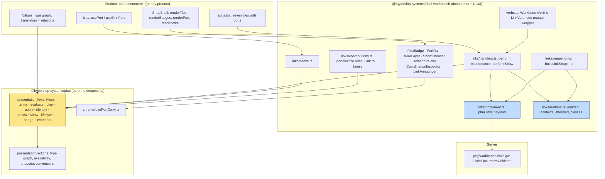

The core kernel imports the type graph, availability constructors and snapshot conventions from the action kernel and never the reverse. A test fence strips comments from every file under `links/` and refuses any React import.

### 4.2 The decisions that fixed the shape

The design guide records eleven decisions. The ones an implementer meets first:

| Decision | Content | Consequence in code |
|---|---|---|
| D1 | The link kernel is a sibling of the action kernel, not an action family | `links/` shares the type graph and the `available`/`unavailable(because, code)` shapes; menus for ports are ordinary kernel rules |
| D2 | Document slots stay in `view.documents`; value ports are a layer beside them | the precedence rule in `effectiveBinding`; `bindings`/`docBound` derived from ports |
| D3 | Declarations persist in a `pbui.links` payload; values live in a runtime store | one `documentPut` per verb; a runtime keyed by view id |
| D4 | Port values are JSON, no codecs | fixture round-trip test; `Hold` stores the reference as-is |
| D5 | Pull evaluation with a memo, not push propagation | `evaluatePort` over a snapshot; cycles are diagnostics |
| D6 | Wires and drag only in connect mode; the object menu is primary | no drop zones in normal mode; the toy's pie menu became menu rows |
| D7 | `Derived` reuses `PresentationTranslator` as the relation registry | one registry serves accept mode and standing bindings |
| D8 | Identity classes re-implement P06's subset | `identity.ts`: fibers, union-find, persistent ids, lineage |
| D9 | Kernel in core, glue in the workbench, no third package | `pbui/src/presentation/links/` and `pbui-workbench/src/links/` |
| D10 | Hard cutover; a self-contained e-commerce demo is the first consumer; datalab-ui frozen | five packages switched to `ports: [documentSlotPort(...)]` in one commit |
| D11 | One world: the gold-coin shop, owned by `pbui-ecommerce` | the chat demo's eight SKUs verbatim, expanded with customers, orders and sales |

## 5. The kernel

The kernel is a set of pure functions over an immutable `LinkSnapshot`. The shell builds the snapshot from the workbench document, the application registry and the runtime; the kernel never touches a store. Values are read through a `values` interface so nothing is copied until a resolver asks.

### 5.1 Evaluation

`evaluatePort` walks a term to a value. It carries a `visiting` path so that a cycle that slipped past the planner is reported as a diagnostic with the path, never looped. Following a follower reads the input's own evaluation, so a chain of follows resolves to the far source. Following an output reads what that output last emitted. A `Derived` term evaluates its inner binding and then applies the named relation through `deps.relation`; a relation returning `undefined` yields `empty`, never a stale value.

One rule was added after a Phase 5 test failure: an output or inout port with no term is its own source and reads what it last emitted. Without it, an inout `selection` port with no explicit term evaluated as unbound, a merge seeded an empty cell, and the "history" split policy restored nothing.

```ts
// pbui/src/presentation/links/evaluate.ts, the cycle guard and the own-emission rule
export function evaluatePort(port, s, deps, visiting = []) {
  if (visiting.includes(port)) {
    const path = [...visiting, port];
    return { kind: "error", diagnostic: { code: "cycle", message: `cycle through ${path.join(" → ")}` }, provenance: terms.unresolved("cycle", "cycle"), path };
  }
  const binding = effectiveBinding(port, s);
  if (binding.kind === "unresolved" && binding.diagnostic.code === "unbound") {
    const definition = s.ports.get(port);
    if (definition && definition.declaration.direction !== "in") {
      const own = s.values.emitted(port);
      return own ? { kind: "value", reference: own, provenance: binding, path: [...visiting, port] }
                 : { kind: "empty", provenance: binding, path: [...visiting, port] };
    }
  }
  return evaluateBinding(binding, s, deps, [...visiting, port]);
}
```

Evaluation is pull-based (design decision D5). A consumer hook subscribes to both the workbench store and the runtime and re-evaluates lazily when either revision changes. Push propagation with a `seen` set, as the earlier JSX prototype did, was rejected because it makes fan-in and hold semantics depend on write order.

### 5.2 Planning: refusals with a code and a sentence

Every mutation is planned before it is applied. A plan is `available` with a verb and an explanation, `unavailable` with a code and a sentence, or `ambiguous` with labelled options. The sentence is what the menu row, the cursor badge, and the agent see; the code is what tests assert.

```ts
// pbui/src/presentation/links/plan.ts
export function planFollow(source, destination, s, deps): LinkPlan {
  const S = s.ports.get(source);
  const D = s.ports.get(destination);
  if (!S || !D) return unavailable("that port no longer exists", "port-missing");
  if (source === destination) return unavailable("a port cannot follow itself", "self");
  if (S.declaration.direction === "in") return unavailable(`${titleOfPort(S)} is an input; only outputs can be followed`, "direction");
  if (D.declaration.direction === "out") return unavailable(`${titleOfPort(D)} is an output; it cannot follow anything`, "direction");
  if (!reaches(S.declaration.contract.valueType, D.declaration.contract.valueType, deps.graph)) {
    return unavailable(`<${S.declaration.contract.valueType}> does not reach <${D.declaration.contract.valueType}>`, "type");
  }
  const current = s.bindings.get(destination);
  if (current?.kind === "hold") return unavailable(`${titleOfPort(D)} is held; resume or detach it first`, "held");
  if (s.aliases.has(destination)) return unavailable(`${titleOfPort(D)} shares the ${s.aliases.get(destination)} cell; leave the class first`, "shared");
  if (current?.kind === "follow" && current.source === source) return unavailable(`${titleOfPort(D)} already follows ${titleOfPort(S)}`, "already");
  if (dependsOn(source, destination, s)) {
    return unavailable(`${titleOfPort(S)} already reads from ${titleOfPort(D)}; that would be a cycle`, "cycle");
  }
  return available(linkVerbs.follow(source, destination), `${titleOfPort(D)} will follow ${titleOfPort(S)}`);
}
```

The refusal codes across the planners:

| Planner | Codes |
|---|---|
| `planFollow`, `planBind` | `port-missing`, `self`, `direction`, `type`, `held`, `shared`, `already`, `cycle` |
| `planPin` | `empty` (nothing to hold), already held |
| `planResume` | `not-held`; a hold over `Unresolved` explains why it cannot resume |
| `planUnlink` | `link-missing`, `empty` for freeze |
| `planIdentityAdd` | `self`, `direction`, `already`, `bound`, `incompatible` (with the field), `cells-differ` under `require-equal` |
| `planIdentityRemove` | `no-history` |
| `planDerive` | the follow codes plus `no-relation` (naming both types), `relation` (the named one does not fit); several legal relations produce an `ambiguous` plan |

The `shared` refusal in `planFollow` is what prevents the "bidirectional equals two arrows" failure the report rejects: a port that shares a cell cannot also follow something.

### 5.3 The transition

`applyLinkVerb(verb, snapshot, deps)` is the one transition every instrument calls. It plans, and if the plan is available it computes the next bindings map on a copy, the next identity state where relevant, and a list of runtime effects. It returns `{ kind: "ok", bindings, state, effects, explanation }` or `{ kind: "refused", plan }`. The effects (`seed-class`, `set-emitted`, `forget-class`) are returned rather than performed, so the transition stays pure and the shell decides when runtime cells change, which is after the document write commits.

Two details in the transition are easy to get wrong. The `port.pin` case holds the value that was last presented as attended on the port when one exists, else the evaluation. This is the toy audit's "Ambient Pin" lesson: the pointer must leave the source to reach the badge's menu, so the value to freeze is the last attended value, not whatever the fallback reads at click time. The `port.resume` case restores the suspended term through a `restore` helper that collapses a redundant suspended term (an explicit ambient equal to the declared fallback) to no term, so the document after pin then resume is byte-identical to the document before, which a test asserts through `serialize()`.

### 5.4 Lifecycle

The kernel exposes three lifecycle functions that the shell calls from one place. `bindingsAfterViewsRemoved` applies each follower's `onSourceClose` policy when its source view is deleted: `freeze` holds the last value with an `Unresolved("source-closed")` suspended term, so the resume row explains why it cannot resume; `clear` writes `Unresolved`; `ambient` deletes the term so the declared fallback applies. `bindingsAfterAppReplaced` drops terms for ports the new application does not declare. `bindingsAfterClone` re-keys sources to the cloned view ids and suffixes link ids. `identityAfterViewsRemoved` drops declarations that name a vanished port.

### 5.5 The term state machine

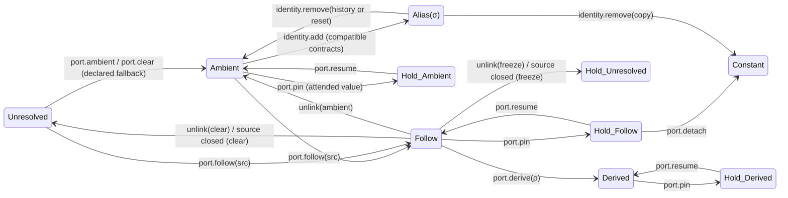

The states `Hold_Follow`, `Hold_Derived`, `Hold_Ambient` and `Hold_Unresolved` are one term kind, `Hold(r, b)`, distinguished by the suspended term `b`. The diagram separates them because the resume transition differs: a hold over a follow resumes following, a hold over an ambient resumes reading the context, and a hold over `Unresolved` cannot resume at all.

## 6. Persistence: the link document and the runtime

### 6.1 The `pbui.links` payload

Design decision D3 put declarations in a `DocumentPayload` with format `pbui.links`, schema version 1, and the conventional id `pbui.links`, one per workbench document. This follows two precedents in the repository: the rebalance configuration and the plotscript scripts are payloads of the same kind. The payload holds four things:

```ts
// packages/pbui-workbench/src/links/document.ts
export interface LinksPayload {
  bindings: Record<PortId, Binding>;                    // explicit terms per port
  identity: IdentityDeclaration[];                      // retained, never derived from classes
  classes: IdentityClass[];                             // compiled, persisted for id stability
  history: Record<PortId, SerializableReference | null>; // pre-merge private values
}
```

`readLinks` returns an empty payload for a missing or foreign-format document and drops any entry that fails structural validation, never trusting a shape it cannot read. `linksMutation(state)` returns one idempotent `documentPut` of the whole payload with sorted keys; an empty state deletes the payload instead, so a workbench that has never been linked carries no payload at all.

Because every link verb is one `documentPut`, link changes ride the workbench's `plan`/`applyPlan` batches. "Spawn a detail to the right and make it follow the orders table" is one batch, one `onMutate` callback, one undo step where the product has undo, and one server mutation where the document syncs. The chat agent's `workbench_perform` tool validates verbs with `isWorkbenchVerb`, which now falls through to `isLinkVerb`, so link verbs became agent-usable with no change to the tool.

### 6.2 The runtime

Values are not persisted. The runtime is a `useSyncExternalStore` store holding what each output last emitted, what each context cell holds, what each identity class's shared cell holds, and the last value presented as attended per port. It is keyed by view id through the port id, like the sandbox package's program state, so two linked placements read one cell. A reload re-derives everything from what tiles emit; only `Hold` and `Constant` capture values, and those live in the document as terms.

```ts
// packages/pbui-workbench/src/links/runtime.ts, the emit path
emit(port, reference, options = {}) {
  // ...
  if (options.attended) {
    attended.set(port, reference);
  } else {
    emitted.set(port, reference);
    // Presenting a value is also attending it: a click after a hover leaves the same value in both cells.
    attended.set(port, reference);
    for (const key of options.drives ?? []) contexts.set(key, reference);   // the declaration's drivesContext
    if (options.classId) classes.set(options.classId, reference);          // a class member writes the shared cell
  }
  if (changed) commit({ emitted, contexts, attended, classes });
}
```

The runtime also answers `sourceOf(reference)`: the output whose attended or emitted value deep-equals a reference. This is how the "Link to…" family learns which port a right-clicked order came from, since values are flat JSON with no provenance field. It is also why hovering a table row emits the row as attended.

### 6.3 One mutate wrapper for maintenance

The shell must keep the link document consistent when views are deleted, replaced, or cloned. Instead of editing each of the five or six verb handlers that can delete a view, every `store.mutate(...)` call inside `createVerbHandlers` was replaced by one wrapper:

```ts
// packages/pbui-workbench/src/verbs.ts
const mutate = (mutations: Mutation[]): boolean => {
  const upkeep = links.maintenance(doc(), mutations);
  const ok = store.mutate(upkeep ? [...mutations, upkeep] : mutations);
  if (ok) links.afterCommit(mutations);
  return ok;
};
```

`maintenance` scans the batch for `viewDelete`, `viewConfigure` with a new app id, and `viewClone`, and appends at most one links mutation computed from the pre-batch document. The timing matters: a `freeze` policy needs the follower's value before the source view disappears, so the maintenance builds its snapshot from the current document and appends its mutation to the same batch. `afterCommit` then forgets the runtime cells of the deleted views. Because the maintenance is a function of the batch, a future handler cannot forget it, and the shadow store that `plan()` runs against gets it for free.

## 7. The instruments

Each instrument is a projection of kernel state plus a way to emit one `LinkVerb`. None mutates state directly.

### 7.1 The badge

The always-on substrate is one small badge per bound input port in the tile header. `badgeOf` derives it from the effective binding and the evaluation; the same derivation feeds the accessible name and the inspector, and it is never stored.

| State | Badge | Meaning |
|---|---|---|
| ambient | `○ order · order` | reading the declared fallback context, now filled |
| empty | `○ order · none` | the fallback context is empty |
| following | `→ orders` | `Follow` of a named source tile |
| held | `⏸ order 88213` | `Hold`; the hover doc adds "resume follows orders" |
| fixed | `• order 88213` | `Constant` |
| derived | `customer ← its customer` | `Derived` through a labelled relation |
| shared | `≡ selection · σ1` | member of an identity class |
| unresolved | `⚠ order` | cycle, missing source, missing relation, cut link |

`badgesOfView` hides outputs, unbound ports, and document-slot ports whose only term is the slot constant: the tile title already names the document, and the guide's example of a `• Mass and yield` badge is therefore not rendered by default. A badge is a `<port>` presentation, so clicking it opens the ordinary object menu. Its rows come from `workbenchLinkContributions()`: Pin, Resume, Detach as a fixed value, three Unlink rows (keep the last value, clear, fall back to ambient), Return to its fallback or Unfix, Derive through…, Go to source, Show wiring. Unavailable rows stay visible with their reason, which is the action kernel's existing rule.

One placement rule came from review. The first build composed the badges into the tile's default title node, so the product's `<tile>` presentation enclosed them and the header showed a frame inside a frame. The user asked for no nested frames. `Tile` now renders the badge nodes after whatever the product's `renderTitle` returned, beside the title presentation and never inside it.

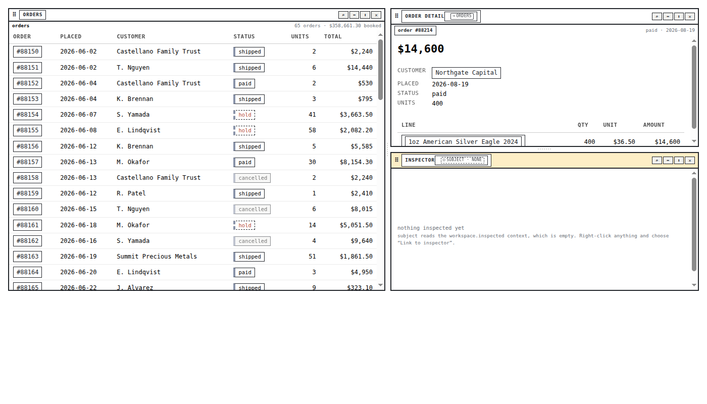

*Scene 2a: the order detail follows the orders table (`→ ORDERS` in its header) while the inspector still reads its ambient context (`○ SUBJECT · NONE`).*

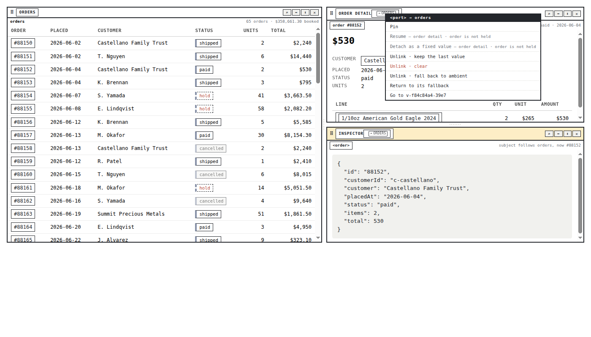

*The badge's own object menu: Pin, Resume, Detach, the unlink policies, and Show wiring.*

### 7.2 "Link to…" from any presentation

The common operation is one right-click. The link contributions export an action family for the product's linkable subject types. When expanded for a clicked value, it lists every compatible input port on screen, one row per port, with the port's `doc` as the row description. Each row binds a `show` intent naming the target by candidate id. The family infers the source port through `sourceOf(subject)`; when the value came from a known output, the row plans a follow, otherwise a bind to a constant. A row whose plan is unavailable is rendered disabled with the reason in its accessible name; the Playwright accessibility snapshot shows it as `menuitem "Link to order detail · order — already follows orders · order" [disabled]`.

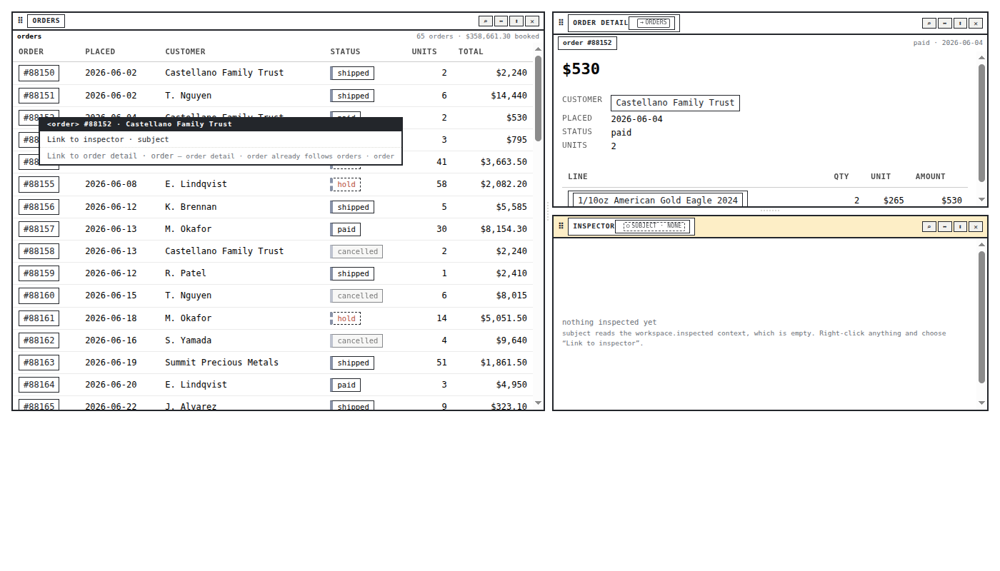

*Right-clicking an order: the inspector row is available; the detail row is disabled because it already follows the table.*

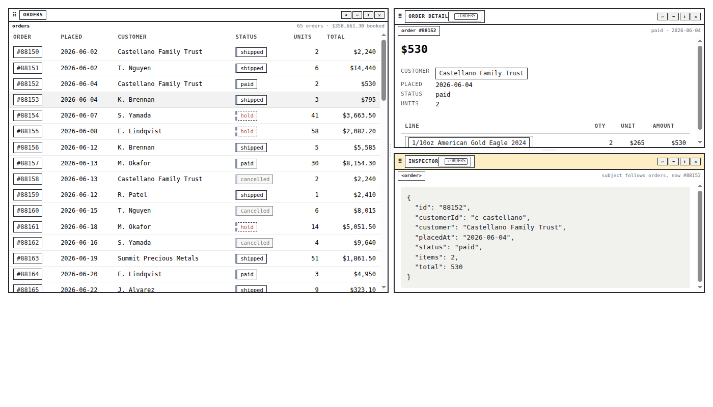

*After choosing the inspector row: the inspector follows the table through the abstract `inspectable` type (`→ ORDERS`), and shows the order as data.*

One event-ordering detail was needed for this to work. A table row must present itself (emit into the `order` port) before its menu opens, so that "Link to…" shows that order immediately. The `Presentation` element inside the row owns the context menu and stops the `contextmenu` event from bubbling, so the row's emit is bound in the capture phase (`onContextMenuCapture`).

### 7.3 Connect-management mode

Mod+Shift+L, "Connect…" on a tile menu, or "Show wiring" on a badge sets a browser-local `linkModeOpen` flag beside the existing `rebalanceOpen`. While it is on, every tile flips to its back side: a `PortRail` overlay lists inputs on the left edge and outputs on the right, each a `<port>` presentation with name, glyph, current badge state and doc, over an application rendered `inert`. One `WireLayer` SVG mounted by the surface draws a wire per declared term from the DOM rectangles of registered port elements, using the toy's cubic path, with one style per term: a solid arrow for follow, a labelled arrow for derived, a double segment without arrowhead for identity, dotted for the suspended source under a hold, and a portal stub when one end is unmounted.

Port-to-port drag reuses the tile carry's lifecycle from the rebalance work: a capture-phase pointerdown, exactly one `finish`, Escape, blur and `pointercancel` cancel, a second carry cancels the first. `usePortCarry` differs from the tile carry only in its registry and its drop predicate. Acceptability of a target under the pointer is computed by the same `planFollow` (or `planIdentityAdd` while Control is held) that the menu uses, so highlighting and dropping cannot disagree, which is the argument the accept mode already makes for its own highlighting. A badge under the cursor names the term that will be committed, `Follow(orders · order)` or `Hold(order 88213, …)` with Shift or `Share(… ≡ …)` with Control, and the modifier is read live from every pointer and key event. The audit's anti-pattern was a modifier read only at drag start; a scenario asserts that releasing Shift mid-drag switches the badge before release.

Wires are `<link>` presentations with their own menu: the three unlink policies (or, for an identity wire, the three split policies), "Change to Derived…" on a follow wire, and go to source or destination. Their wide transparent hit paths are disabled while a carry is in flight so they never become the element under the pointer. Escape closes the mode through one registered escape surface, unless a carry is in flight, in which case Escape cancels the carry and the mode stays open.

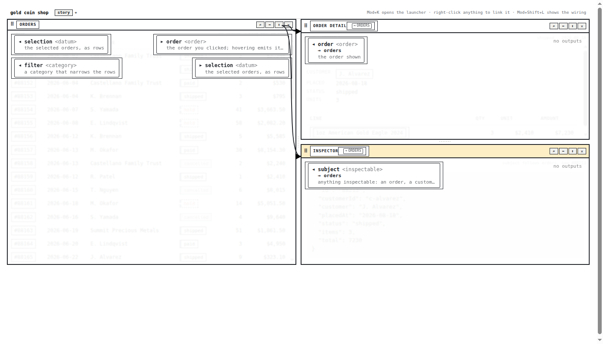

*Scene 7 in connect mode: every tile shows its rail, the two declared links are wires, and the applications beneath are inert.*

### 7.4 "Show details…" and the target resolver

Routing is explained selection. A `show` verb carries a subject, an optional role such as `order.detail`, a disposition, and the source port when known. The kernel's `resolveShow` turns it into ranked candidates: every input port on screen whose value type is reachable from the subject's type, and every (spawnable application, placement) pair the shell offers. Each candidate carries a status, an explanation, and a rank tuple compared lexicographically:

```text
rank = (typeDistance, roleDistance, dispositionDistance, scopeIndex, sourceAffinity, placementIndex)
```

`typeDistance` is the graph distance from the subject's concrete type to the port's value type, 0 for an exact match and 50 for `any`. `roleDistance` is 0 when the requested role equals the port's semantic role. `dispositionDistance` is 0 for a port that already follows something, 1 for a free port, 2 for a spawn, and a held port is marked inapplicable under a generic route because it was pinned to be left alone. `scopeIndex` prefers the current workspace and `sourceAffinity` prefers a port already following the same source.

Ties among the best available candidates are an ambiguity, never a winner chosen by registration order; a test permutes the port and placement order and asserts the winners do not change. Spawn candidates never tie among themselves, since the first placement offered is the default spot. A candidate that already follows the source is available with no verb: showing there is a no-op, not a change. The first draft turned that case into a `port.clear` verb, which was wrong and is now a test.

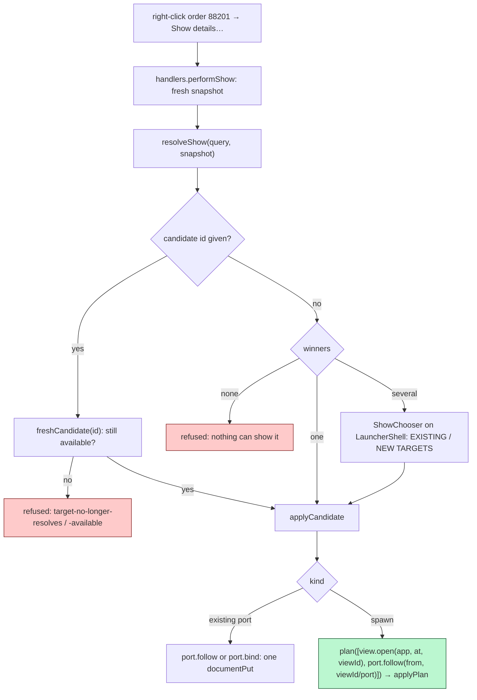

Fresh revalidation is the report's §8.10 rule: the chooser's row, the family's row and the agent all name a target by candidate id; the handler re-resolves against the current document and runtime and applies only if the candidate is still available. The stale row's verb is never replayed.

The spawn path needed one small change to the workbench: `view.open` accepts a caller-supplied `viewId`, so a plan can name the new view's port in a later verb of the same plan. The show handler runs inside `createVerbHandlers`, which does not have `plan`/`applyPlan` (those are built in `createWorkbench` over the handlers), so the shell lends them afterwards through `links.attach({ planner })`. The shadow handlers used by `plan()` have no planner and fall back to two batches; that path is untested because the workbench always attaches one.

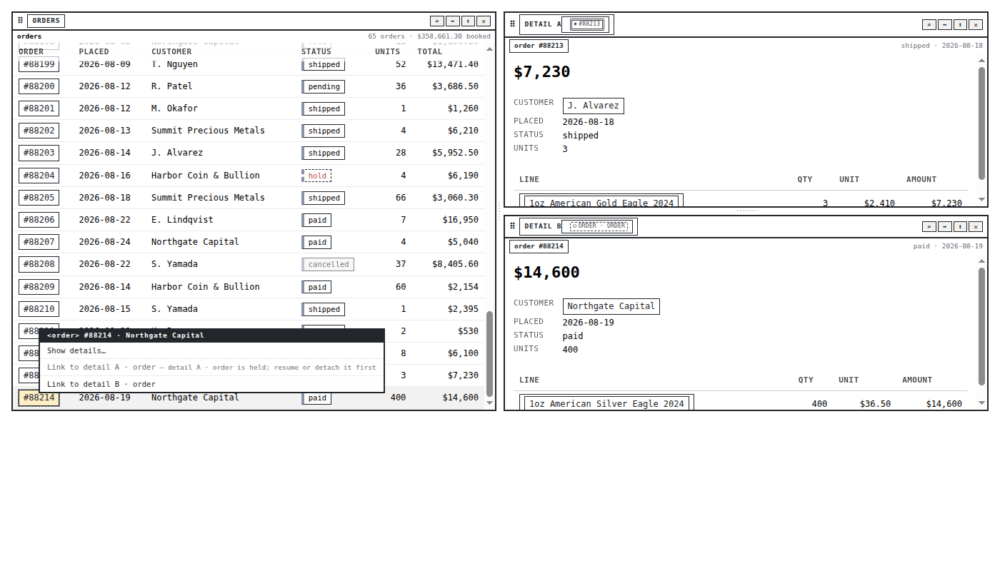

*Scene 3: detail A is held on 88213 and inapplicable; "Show details…" beside the explicit "Link to" rows goes to detail B.*

### 7.5 Identity classes

The share operator, `A ≡ B`, makes two ports read and write one cell. Phase 5 re-implemented the subset of the P06 identity compiler that pbui needs, about three hundred lines in `identity.ts`:

1. Two ports may be identified only when their normalized contracts agree on every field; `compatibilityOf` lists the mismatches as a sentence per field.
2. Identity declarations are partitioned by contract fiber (the fingerprint) and unioned within a fiber with a small union-find whose root choice is deterministic (the lexically smaller root wins).
3. A class is a connected component with at least two members, sorted; a class of one is no class.
4. Class ids are persistent: a recompile after a change keeps the id of the previous class that overlaps most, so undo restores exact cells and the badge does not renumber. Lineage records `new`, `unchanged`, `expanded`, `contracted`, `merged` or `split` per class.

The transition for `identity.add` records each new member's private value at the moment it joins, and only for members not already in a class, so a three-member class keeps three histories. It seeds the shared cell from the value the merge policy prefers and returns a `seed-class` effect. The transition for `identity.remove` compares each port's class before and after the recompile and initialises only the ports that left every class, by the split policy: `copy` gives each the shared value, `history` restores the recorded private value, `reset` clears. A surviving class under a new id is re-seeded from the old cell.

In the shop, the orders table and the orders-by-status plot share `selection ≡ σ1`: Shift-clicking rows highlights marks, brushing the plot selects rows, and "Unlink · restore private values" on the double wire gives each side its own selection back. The revenue-by-category plot over `daily_sales` is refused with "different authority domain: orders vs daily_sales". Scene 6 shows the contrast with a plain follow: the orders table's `filter` input follows the plot's `cat` output, the badge reads `→ plot`, and no cell is shared.

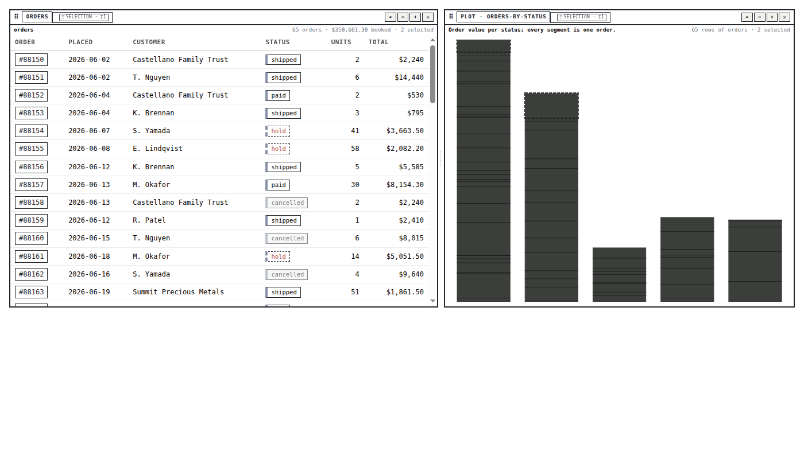

*Scene 5: the orders table and the orders-by-status plot share one selection cell; both badges read `≡ selection · σ1`.*

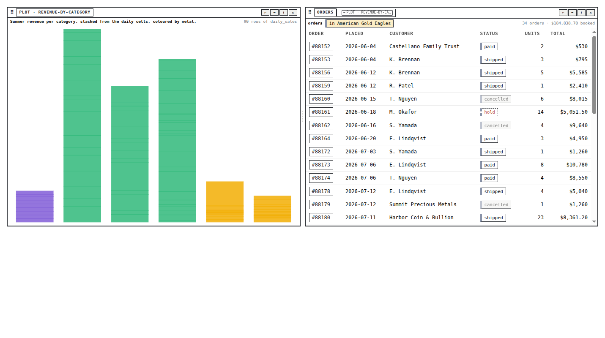

*Scene 6: the orders table's `filter` input follows the revenue-by-category plot's `cat` output (`→ PLOT`); a follow rather than a shared cell, and the toolbar shows the chip.*

### 7.6 Derived bindings and the relation palette

The derive operator, `A --ρ→ B`, reads an output through a named relation. Design decision D7 reused the product's `PresentationTranslator` registry as the relation registry: one registry lets accept mode take an order where a customer is wanted ("show this order as its customer") and lets a `Derived` term name the same conversion as a standing binding. The shop builds both from one source:

```ts
// packages/pbui-ecommerce/src/presentation/relations.ts
export function createShopRelations(host: ShopHost): ShopRelation[] {
  return [
    { id: "order.customer",  from: "order",    to: "customer", label: "its customer", apply: ... },
    { id: "lineItem.product", from: "lineItem", to: "product",  label: "its product",  apply: ... },
    { id: "product.category", from: "product",  to: "category", label: "its category", apply: ... },
  ];
}
/** The same relations as typed accept translators, so accept mode and derived bindings agree by construction. */
export function shopTranslators(relations, host): PresentationTranslator[] { ... }
```

`planDerive` computes the legal relations by reachability on both ends. One legal relation is chosen; several produce an `ambiguous` plan whose options the relation palette lists, grouped per source tile, on the same `LauncherShell` the launcher and the show chooser use. The `port.derive` verb writes `Derived(Follow(source, linkId), ρ, linkId)`; the badge reads `customer ← its customer`. Pin and resume over a derived term were already correct from Phase 2's evaluator; Phase 6 added the planner and the instrument, not new semantics.

This also answered a question raised mid-implementation: can a presentation be both a product and a line item? A reference has one concrete type. The three ways to mix them are nesting (the order detail already renders line items containing product presentations), an abstract supertype with `match: "subtypes"` rules, or a relation. `lineItem.product` is now a declared relation, so a line item can be shown as, or derived into, its product.

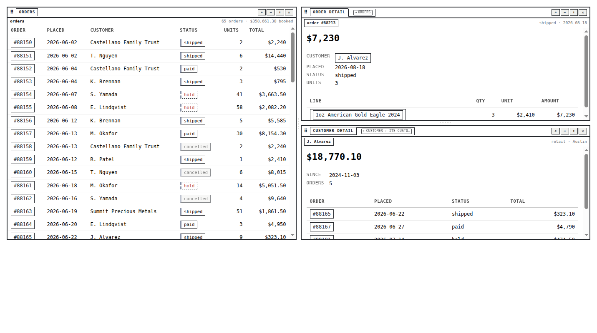

*Scene 4: the customer detail derives through `order.customer` from the orders table; the order detail follows it directly.*

### 7.7 Inspector, announcer, agent, server

Phase 7 made the coupling visible to everyone who is not looking at a badge. `describeWorkbench` gained a `links` section, absent when nothing is bound: a `DescribedBinding` per bound port (state, the badge's own text, explanation, source), a `DescribedLink` per wire (kind, ends, relation, class), and a `DescribedContext` per context (key, type, drivers, whether filled). The coordination inspector tile renders the same facts for a person as PORTS, WIRES and CONTEXTS tables plus a VIOLATIONS table from the kernel's `checkInvariants`; an agent reads them through `workbench_describe`. Neither invents a vocabulary.

A visually hidden `role="status"` live region announces coordination changes. The snapshot changes on every hover because attended values live in it, so the announcer diffs badge lines per port rather than snapshots, and speaks only when a line changed, coalescing a click's emission and its context drive into one sentence per tile after 150 ms. `aria-atomic` ensures a screen reader reads the whole replacement.

The chat agent needed no code change. A test proves the Phase 2 claim: `workbench_describe` shows ports, `workbench_perform` with a `port.follow` links two tiles, and a later describe reports `{ state: "following", badge: "→ Orders East", source }`.

The Go validator `LinksDocumentValidator` checks the payload's shape: term kinds, port-id form, link ids, merge policies, classes of at least two members, history entries as references or null, unknown fields refused. It hands other formats to a `Next` validator. Validation is structural on purpose (open question Q6 resolved as lenient): whether a port exists on a catalog application, whether a class is contract-homogeneous, and whether the follow graph is acyclic are facts the client kernel refuses before they are written; the server refuses shapes it cannot read.

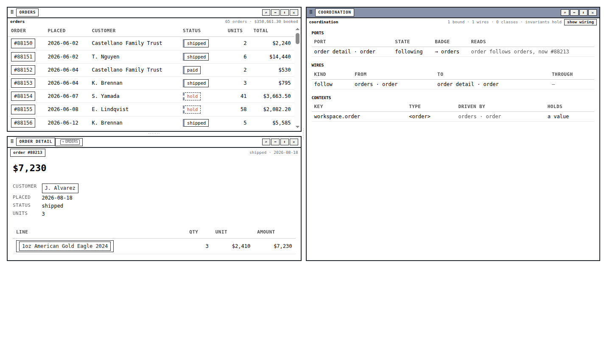

*Scene 8: the coordination inspector beside a linked pair shows what an agent reads through `workbench_describe`.*

## 8. The gold-coin shop as the first consumer

### 8.1 Why a new package, and why this world

Design decision D10 rejected building the demonstrations on the datalab product. An in-place migration of `datalab-ui` onto the workbench shell had been measured at 308 type errors with no green intermediate, and its store adapter would have re-created the globals the design removes. A self-contained package with in-memory fixtures and its own tiles, written to the cutover rules from the first line, was the only way to exercise linking soon. Decision D11 then chose the world: the pbui-chat demo already contained a gold-coin shop with eight SKUs, six categories, three metals and four orders mirrored by hand from the Go chat server. The user asked to merge both worlds and expand the existing one. `packages/pbui-ecommerce` therefore owns the eight SKUs verbatim, keeps the chat demo's four orders with their totals as anchors, and adds twelve customers, a sixty-five order book (ids 88150 to 88214) with line items generated by a seeded linear congruential generator at module load, and a derived `daily_sales` series per day and category. A fixture test pins the anchors, resolves every foreign key, and asserts JSON round-tripping for every row.

### 8.2 Tiles and ports

Seven tiles, each declaring the ports every later phase links through. The declarations are the contract that the datalab package will re-declare over real relations.

| Tile | Ports | Notes |
|---|---|---|
| `orders` | out `order : <order>` (role `order.current`, drives `workspace.order`); inout `selection : <datum[]>` (authority `orders`); in `filter : <category>` | every id is an `<order>` presentation; click emits, hover attends, Shift-click selects |
| `customers` | out `customer` (drives `workspace.customer`); inout `selection` (authority `customers`) | twelve customers with their summer spend |
| `products` | out `product`, out `cat : <category>`; inout `selection` (authority `products`) | product, category and metal are three presentation types in one row |
| `order-detail` | in `order : <order>` (role `order.detail`, fallback `workspace.order`, on source close `freeze`) | facts and line items; customer and products are presentations |
| `customer-detail` | in `customer : <customer>` (role `customer.detail`, fallback `workspace.customer`) | one customer and their orders |
| `inspector` | in `subject : <inspectable>` (fallback `workspace.inspected`, on source close `clear`) | reachable from any concrete type through the abstract supertype |
| `plot` | document slots `plot`, `table`; inout `selection : <datum[]>` with `refineContract` to the table's authority; out `datum`; out `cat` | `ResponsivePlot` over the host's rows; rows never enter the document |

The plot tile maps its brush to `selection` rows and an external selection back to datum ids through the plot package's `PlotOutcome.interactions` index; no change to the plot package was needed. Keeping that index in React state produced a "Maximum update depth exceeded" loop on every outcome; it now lives in a ref with a target count, which was the one fix commit outside the phases.

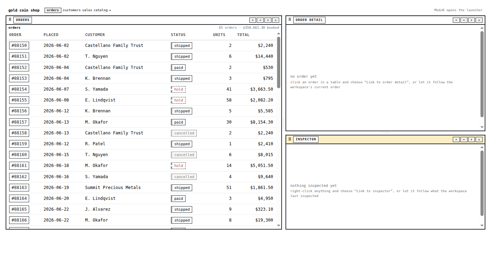

*The seeded workbench before any link exists: orders beside a detail and an inspector that both read their ambient contexts.*

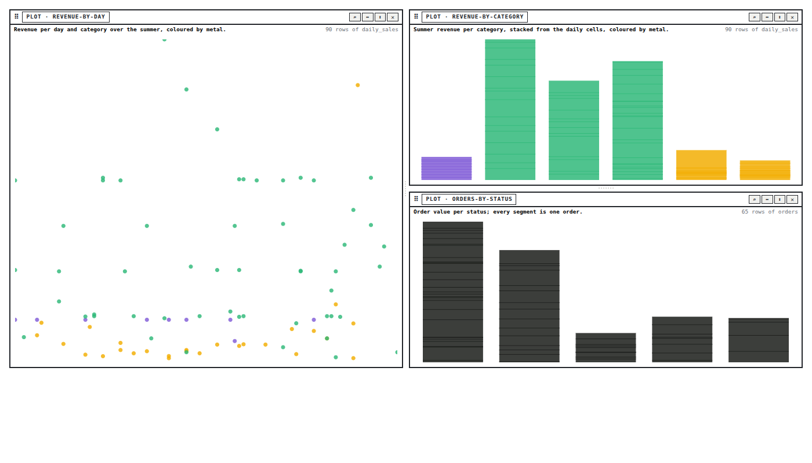

*The sales workspace: three `hyperslop.plot` documents over the shop's tables (revenue by day, revenue by category, orders by status), each a plot tile with `plot` and `table` document slots.*

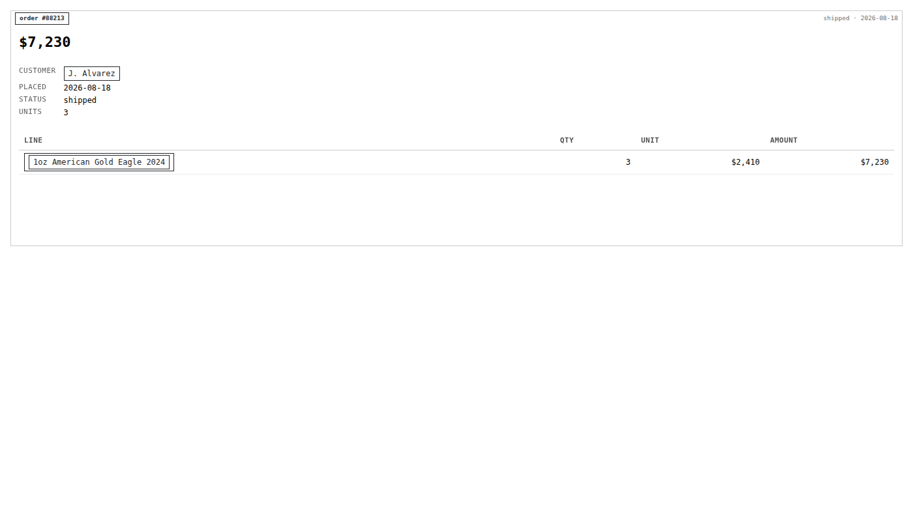

*The order detail tile rendered directly over order 88213: the customer and each line item's product are presentations with their own menus.*

### 8.3 Scenes

Each scene is a Storybook story and, where it involves the pointer, a Playwright scenario.

| Scene | Phase | What it proves |
|---|---|---|
| 1 ambient | 2 | an unlinked detail follows the workspace's current order as rows are clicked |
| 2a follow, 2b hold | 2 | right-click, Link to, badge `→ orders`; Pin, Resume catches up, Detach fixes |
| 3 show with routing, 3b spawn | 4 | detail A held is skipped; with none open a detail is spawned and linked in one plan |
| 4 derived, 4b palette | 6 | customer detail derives through `order.customer`; the palette lists legal relations |
| 5 identity, 5b incompatible | 5 | shared selection `≡ σ1`; the daily-sales plot refused with the field named |
| 6 follow versus identity | 5 | the orders filter follows the plot's category; a follow, not a shared cell |
| 7 connect mode | 3 | rails, wires, drag with and without Shift, wire menu, Escape |
| 8 inspector | 7 | the coordination inspector beside a linked pair |

## 9. Testing

The test strategy follows the audit's rule that a trace event is not a postcondition. Every verb has a test that asserts badge text, tile content or tile count, never only a store field.

**Kernel tests** run over a fourteen-port generated world. They cover the pin/resume law for every term kind, the refusal codes, cycle detection, evaluation through a chain, derivation through a relation, identity compilation with persistent ids, and registration-order independence of the show resolver.

**Workbench tests** use React Testing Library under jsdom. They create a workbench with the LinkLab demo apps, perform a verb, and assert the DOM. jsdom shaped several of them. It has no `PointerEvent`, so Testing Library's `fireEvent.pointerDown` dispatches a plain `Event` with no `button`, `clientX` or `shiftKey`; the rail's `event.button !== 0` guard silently rejected every synthetic pointerdown until it became `button !== undefined && button !== 0`, coordinates default to 0, and a `shiftOf(event)` helper keeps the keyboard's last state when the event has no modifier, with tests driving Shift and Control through `keyDown`/`keyUp`. Every `getBoundingClientRect` is zero under jsdom, so the DOM tests assert a wire's existence and `data-term` and leave geometry to the browser suite. React 19's `act` returns a thenable even for a synchronous callback, so a `performed()` helper captures the boolean result.

**Real-pointer scenarios** are the audit's harness: a plain `playwright` script against the shop's Storybook on port 6012, a fresh page per scenario, native mouse and keyboard only. Nine scenarios cover right-click linking, Pin and Resume from the badge, the connect-mode drag and Escape, the live modifier switch mid-drag, unlink through the wire menu with the resume row's reason, spawn with tile count plus one, identity unlink restoring private values, Ctrl-drag refused with the field named, and derivation through the palette. Two assertions needed the accessibility tree rather than text: the badge's glyph and text are separate spans, and a disabled menu row's reason is in its accessible name.

**Fences** keep the packages honest: no React in the kernel (comments stripped first, after a false positive on the word "document." in a doc comment), component folders, no hex colours (a story label `#1042` tripped it and became "order 1042"), no raw controls, and the D10 cutover rules (no `bindings`/`docBound`, JSON-only port values, no globals outside the host and the runtime).

## 10. Defects met and what they taught

The diary records each phase's failures verbatim. The ones with a lesson beyond the fix:

- **An unbound inout port evaluated as unbound.** Two identity tests failed because a merge seeded an empty cell. The rule that an output with no term reads its own emission is now in the evaluator, and it is the reason a table's `selection` has a value before anything links to it.
- **"Already follows" turned into `port.clear`.** The resolver's first draft treated a target that already showed the source as needing a change. It is a no-op success, available with no verb.
- **A `readonly` method signature is invalid TypeScript.** `readonly inCurrentWorkspace?(port): boolean` made the core build stay stale silently, and every downstream typecheck reported a missing export. It also masked a duplicate object key in `apply.ts` that surfaced one phase later. Rewritten as a function-typed property.
- **Build order across `dist`.** Downstream packages consume built output. A new descriptor field is invisible to them until the core builds, then the workbench builds, then the packages typecheck. Every phase began with that sequence.
- **Right-click through a presentation.** The presentation stops the bubbling `contextmenu` event because it owns the menu; the row's emit is bound in the capture phase.
- **Two wires ordered by random view id.** An e2e scenario picked whichever wire hit path sorted first. Wires now carry `data-source` and `data-destination` and the scenario selects the detail's wire.
- **A render loop from a plot outcome.** Setting the interaction index in state on every outcome re-rendered the plot, which produced a new outcome. A ref plus a target count broke the cycle; the Playwright MCP browser had crashed on the loop and needed a close and reopen.
- **Go under a workspace file.** `go test ./pkg/workbench` refused to run because another module in `go.work` requires a newer Go; `GOWORK=off` inside the repository runs it.
- **Shell quoting in a commit message.** A message containing `"Link to…"` closed the shell's double-quoted string and the commit failed silently; commits with quotes go through a message file.

## 11. Deviations from the design text

The guide's §17.1 lists where the built system departs from its own design, so a reader does not take the design text as the last word.

- Badges for document slots are hidden unless an explicit term overrides the slot.
- Badges render beside the tile's title presentation, never inside it.
- The "Link to…" family lists every compatible input on screen with no cap and no accept-mode fallback; unbound inputs have no badge to point at outside connect mode.
- Keyboard-only connect mode (Tab between jacks, Enter to start and complete) was not built; the rails are pointer-driven with Escape.
- Contexts come from `fallbackContext` and `drivesContext` declarations only; the `context.create` and `context.drive` verbs and context candidates in the resolver were not built.
- `port.follow` has no `replace` flag; a follow onto a followed port replaces the source and the planner says so.
- The merge-policy popover was not built; Ctrl-drag uses `prefer-left`, and `planIdentityAdd` reports `cellsDiffer` for an instrument to use later.
- The three table tiles carry no `table` document slot; only the plot does. The datalab package adds it when a table becomes a relation document.
- The real-interaction suite is a plain `playwright` script rather than a `@playwright/test` project.

Additions beyond the guide: `refineContract(view)`, `drivesContext`, `LinkState` as the persisted whole, `RuntimeEffect`s returned by the transition, the own-emission rule for outputs, browser-local `relation.palette.open/close` verbs, and `view.open { viewId }`.

## 12. Working rules

These are the rules the implementation settled on, stated so that a future change can be checked against them.

- One transition, many instruments. A new instrument emits an existing `LinkVerb` or adds a verb with a planner, a transition case, a description and a test; it never writes bindings itself.
- Refuse with a code and a sentence. A planner that returns a bare boolean cannot feed a menu row, a cursor badge or an agent.
- Highlighting and dropping use the same planner. If `data-acceptable` and the drop disagree, one of them is wrong.
- Declarations in the document, values in the runtime. A value that must survive a reload is captured by `Hold` or `Constant`; everything else is re-emitted.
- The declared fallback is the absence of a term. Never write a term equal to the fallback.
- Alias is derived, never written. The identity declarations are the source of truth; classes are their compilation.
- Effects are returned, not performed. The kernel stays pure; the shell applies effects after the document write commits.
- Maintenance is a function of the batch. New verb handlers use the `mutate` wrapper and inherit it.
- A stale candidate is re-resolved by id, never replayed.
- A visible postcondition defines correctness. A test that only reads a store field is not a test of an instrument.

## 13. Open questions and next steps

- **Merge-policy popover.** When two cells differ at merge time, the plan already reports it; an inline popover at the wire midpoint should offer `prefer-left`, `prefer-right` and `require-equal`.
- **Keyboard connect mode.** Tab between rail jacks, Enter to start and complete a link, in the same `startPortCarry` shape with an `onDefault`.
- **Context verbs.** `context.create` and `context.drive`, and `kind: "context"` candidates in `resolveShow`, once a product needs a context no port declares.
- **Effects and failed plans.** `plan()` runs against a shadow store whose link handlers apply effects to the same runtime; a plan that commits identity and then fails a later verb would leave a cell seeded. Effects should move behind `applyPlan`.
- **Two surfaces, one workbench.** The show chooser and the announcer mount once per `Surface`; a page mounting two surfaces of one workbench would get two of each.
- **Collections.** `datum[]` selection ports are `cardinality: "many"`; a relation whose target is a collection (`order.lineItems`) needs a selection operator into a `one` port.
- **The host interface.** `ShopHost` must stay an interface the datalab package can implement over relation documents and DuckDB, with a conformance test the two packages share; asynchronous relations are the part D7 defers.
- **The chat server.** The Go demo data should grow customers and orders if the chat demo consumes the package, and products that validate documents server-side should register `LinksDocumentValidator`.
- **An abstract supertype for mixed menus.** If a merged menu over line items and products is wanted, both types need a shared parent in the graph.

## 14. Files to read first

1. `pbui/src/presentation/links/types.ts`, `terms.ts`, `evaluate.ts`: the vocabulary and the precedence rule.
2. `pbui/src/presentation/links/plan.ts`, `apply.ts`: refusals and the transition.
3. `pbui/src/presentation/links/identity.ts`, `resolveShow.ts`: the compiler and the resolver.
4. `pbui/packages/pbui-workbench/src/links/document.ts`, `runtime.ts`, `handlers.ts`: the persistence split and the maintenance.
5. `pbui/packages/pbui-workbench/src/verbs.ts` (search `links.maintenance`), `components/Tile/Tile.tsx`, `components/WireLayer`: the wiring into the shell.
6. `pbui/src/chrome/usePortCarry.ts`: the drag lifecycle.
7. `pbui/packages/pbui-ecommerce/src/apps.tsx`, `presentation/relations.ts`, `tiles/OrdersTable`, `tiles/ShopPlot`: the consumer.
8. `pbui/packages/pbui-ecommerce/e2e/scenes.mjs`: the nine real-pointer scenarios.
9. `pbui/pkg/workbench/links.go`: the structural validator.
10. The ticket's design guide (§6 design, §7 decisions, §17 implementation record) and diary (steps 4 to 11) under the `source_ticket_path` in the frontmatter.

To run everything: `pnpm build` at the repository root, then `pnpm build && pnpm test` in `packages/pbui-workbench`, then `pnpm test` in `packages/pbui-ecommerce`; `pnpm storybook` there serves port 6012 and `pnpm e2e` runs the scenarios against it; `GOWORK=off go test ./pkg/workbench/` for the Go side.

## 15. Conclusion

The two earlier reports argued that linking is six problems and that a demonstration is only as real as its visible postconditions. This implementation is the test of both claims inside a production codebase. The six problems each got an operation with a name: follow, hold, share, derive, show, and the lifecycle policies. Every operation is one pure transition called from every instrument, persisted as data in the document the workbench already syncs, and projected into a badge, a wire, an inspector line, and an agent description that use the same words. The gold-coin shop shows all of it on one screen, and nine scenarios drive it with a real pointer. What remains is instrument polish (the merge popover, keyboard rails), a handful of verbs the shop did not need, and the datalab package that will re-declare the same ports over real relations.

## Related notes

- [[PROJECT REPORT - PBUI Linked Tiles - Interaction Models, Formal Semantics, and an Architecture for Routing, Binding, and Coordination]]: the algebra, the three operators, the ranking tuple and the invariants this implementation follows.
- [[PROJECT REPORT - PBUI Linked Tiles - From Plausible Demos to Verified Interaction Semantics]]: the audit whose working rules became this ticket's acceptance criteria.
- [[PROJ - PBUI Workbench Tiles - A Reusable Server-less Shell and the Chat Agent on Tiles]]: the shell, document and verb layer the link glue extends.
- [[PROJECT REPORT - pbui Action-Selection Kernel and the Post-Legacy Unification]]: the sibling kernel whose shapes the link kernel copies.
- [[PROJECT REPORT - Hyperslop Plot - Semantic Interaction, Responsive Hosting, and Accessible Grammar Reading]]: the plot events and interaction index the shop's plot tile maps to ports.
