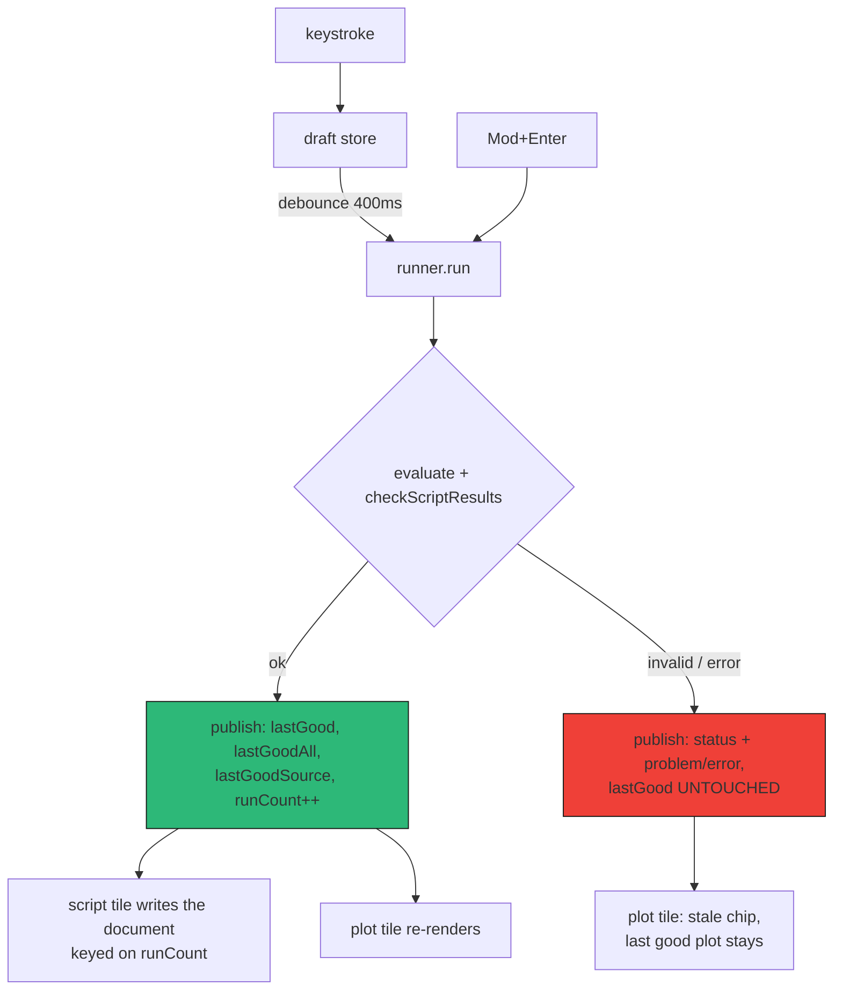
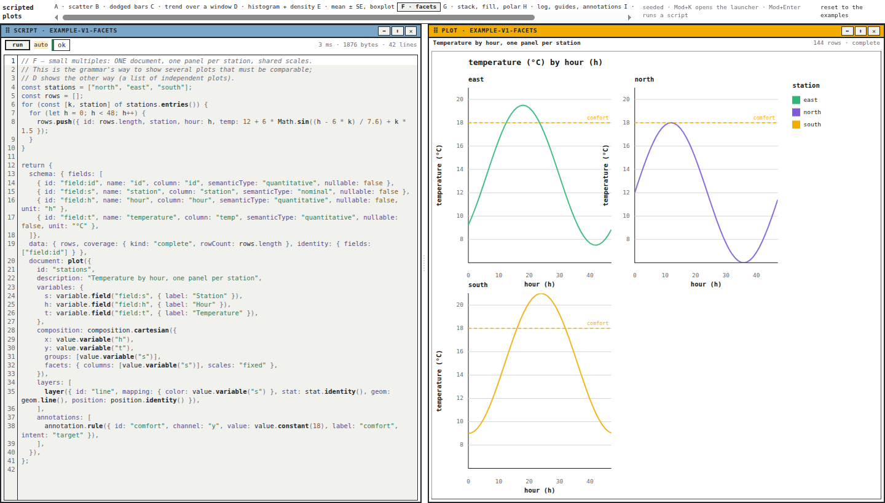
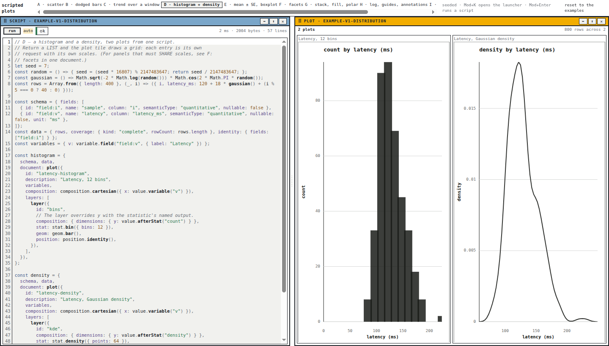
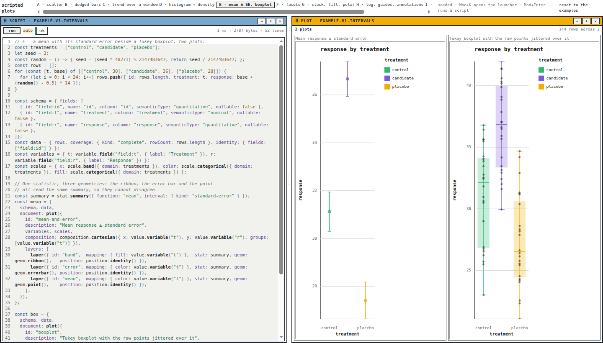
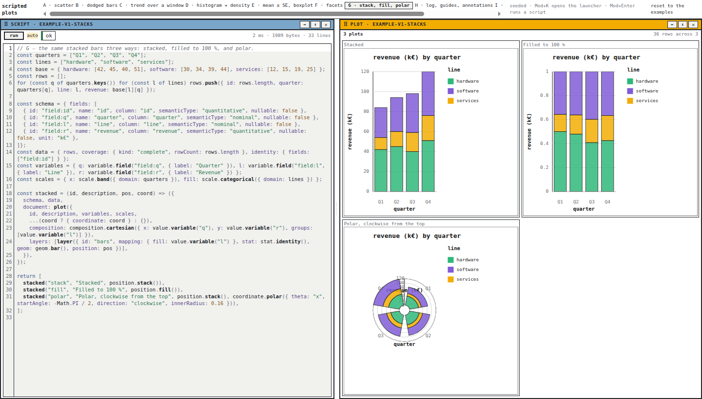
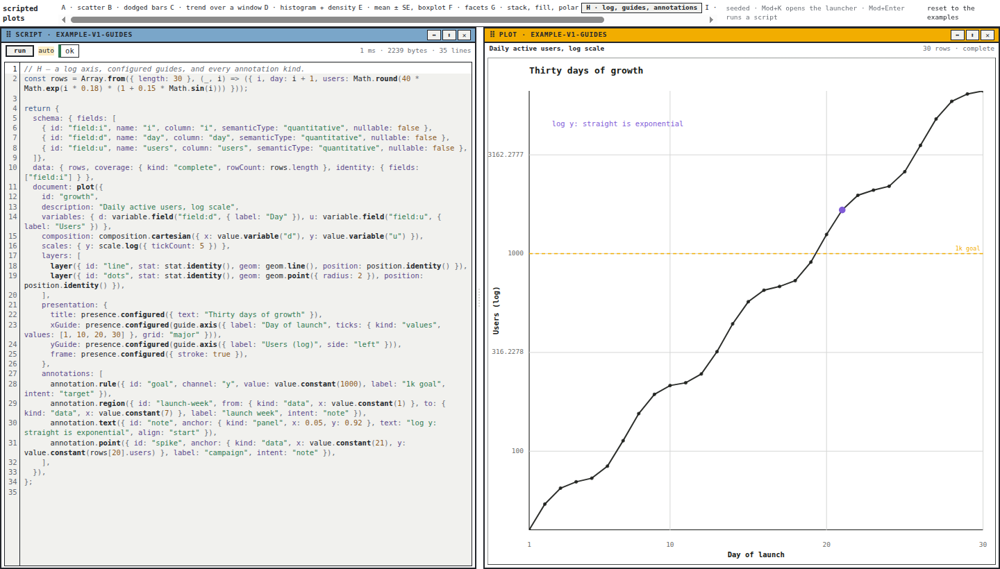
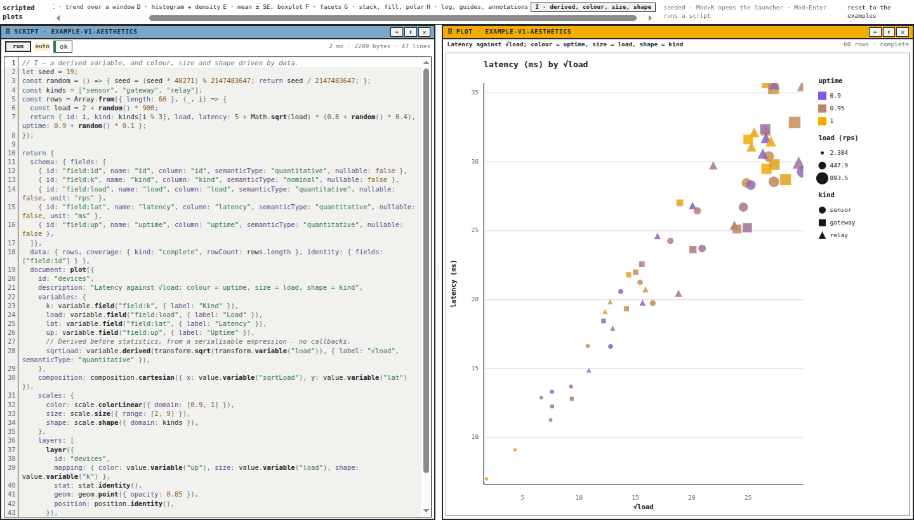

# PBUI Plotscript — Scripted Plots, Nine Examples, and Grids of Plots

This report explains PBUI-PLOTSCRIPT-1: the package `@hyperslop-systems/pbui-plotscript`, which puts a JavaScript editor tile beside a plot tile in the pbui workbench and runs the script live as the user types. It covers the document model, the runner and its two correctness rules, the two tiles, the contract extension that lets one script return several plots, and the nine seeded examples that tour the plot compiler's surface. It closes with the styling work the screenshots provoked in the plot repository itself. The report assumes the infrastructure described in [[PROJECT REPORT - PBUI Editor - A CodeMirror Tile and a Plot Shim for a Sandboxed Workbench]] — the CodeMirror component and the sandbox plot shim — and does not repeat it.

> [!summary]
> Fourteen commits on `task/add-plot-editor` deliver:
> 1. A script document that rides **inside** the workbench document as a `DocumentPayload`, so layout and scripts serialize, restore, and persist as one object.
> 2. A runner with a run **ticket** (a stale run never publishes) and a **last-good** result (a failing run never blanks the plot), plus captured `console` output.
> 3. Two workbench applications — `plot-script` and `plot-view` — bound to one document; the plot tile stands alone and draws a **grid** when a script returns a list of results.
> 4. Nine seeded examples, A through I, each mirroring a document the plot package's own Storybook already renders, each integration-tested through the runner and `renderPlot`.
> 5. A runnable demo: one workspace per example, persisted to `localStorage`, restorable to the seed.

## The shortest version

```text
demo (packages/pbui-plotscript/demo, port 5175)
  workspace strip = the example picker (A..I)
  each workspace: plot-script tile | plot-view tile, one document

typing -> draft store -> debounce 400ms -> runner
  runner: load PLOT_HOST_PROGRAM once, evaluate shim+script,
          checkScriptResults, ticket check, publish
  ok      -> lastGood/lastGoodAll updated; script tile writes the document
  failure -> lastGood kept; plot marked stale; error in the pane
plot tile -> ResponsivePlot per result; a grid when results > 1
```

Validation at the end: package 28 tests, sandbox 224, editor 12, core 272; the demo typechecks and builds; every example renders a scene with zero error diagnostics; 13 screenshots in the ticket's `reference/screenshots/`.


## Why this project exists

The plot repository holds a grammar-of-graphics compiler with a deliberately narrow charter: a pure function from `{ document, schema, data, viewport }` to a scene, with no data loading, no state, and no product opinions. The datalab product drives it through a form-based authoring model — marks and encodings chosen from menus. What did not exist was the programmer's path: write a program, get a plot, iterate at typing speed. Programs subsume forms — example B computes its aggregation with a `Map` and a loop, something a declarative encoding model would need a feature for — and they are the natural interface for agent-written analysis.

The consumer-facing question this package answers is narrow: given an editor component and a sandboxed script runner (the previous ticket), what are the *product rules* that make live-coded plots pleasant rather than maddening? The answer turned out to be four rules, each encoded in a specific place: where the script text lives, when the document is written, which run may publish, and what happens on failure.

## The document model: scripts ride in the workbench document

The workbench keeps its entire layout in one protobuf document — workspaces, split trees, views — and that document has a `documents` map of typed payloads: `{ id, format, schemaVersion, body }`, where `body` is arbitrary JSON. The workbench itself stores its rebalance configuration this way; datalab stores its graphic documents this way. A plot script follows the same pattern:

```ts
// src/document.ts
export const PLOTSCRIPT_FORMAT = "pbui.plotscript";

export interface PlotScriptDoc {
  id: string;
  name: string;
  source: string;      // the last source that was successfully RUN — see below
  updatedAt: string;
}

export function readPlotScript(doc: WorkbenchDocument, id: string): PlotScriptDoc | null;
export function plotScriptMutation(script: PlotScriptDoc): Mutation;   // one documentPut
```

The payoff is that persistence, export, and restore need no second mechanism. `serialize()` on the workbench emits one JSON document containing both the tile arrangement and every script; `parseDocument()` restores both; a test round-trips all nine examples through that path. A foreign-format payload reads as "not a script," never as an error, and a malformed body is repaired field by field.

One reader trap is worth recording: `parseDocument` refuses a document with zero workspaces, by design — persistence reads it on every load and a corrupted entry must fall back to the seed rather than take the product down. A document that is only payloads is not a workbench. The round-trip test seeds one tile for exactly this reason.

## The draft store: a keystroke is not a document mutation

If the workbench document were the only store, every keystroke would be a protobuf mutation batch and a persistence write. Instead the editor's live text lives in a small `useSyncExternalStore` store keyed by script id, and the document is written by the script tile only when a run **succeeds**, with the source that succeeded:

```text
document.source  =  what the plot currently shows
draft store      =  what the editor currently says
runner.lastGood  =  the parsed result of the last good run
```

The invariant that falls out is the useful one: reloading the page draws the last good plot, never a half-typed line. Two script tiles linked to one document share one draft, so they stay in lockstep the same way two placements of one view do. The pattern is the sandbox playground's draft/loaded split, generalized: the workbench document plays the role of "loaded."

## The runner and its two rules

`createPlotScriptRunner({ engine, debounceMs, limits, onRan })` owns one sandbox instance per script (loaded lazily with the host program), the debounce timers, and a per-script `ScriptRunState`. Two rules from the design document are the substance, and both have tests shaped like the bug they prevent.

**Rule 1: a stale run never publishes.** Runs are asynchronous, and a run started earlier can resolve later — the user types, a slow run is in flight, a newer run finishes first. Each run takes a ticket at start; only the holder of the newest ticket may publish:

```text
run(id, source):
  ticket   = ++tickets[id]
  status   = "running"
  outcome  = await evaluate(...)
  if tickets[id] != ticket: return        # a newer run started; say nothing
  publish(outcome)
```

The test blocks the first evaluation behind an unresolved promise, lets the second complete, then releases the first and asserts the state still reflects the second — the exact interleaving the rule exists for.

**Rule 2: a failing run never clears `lastGood`.** With auto-run on, a syntax error occurs on every keystroke while the user is mid-word (`return {` is a `SyntaxError` until the brace closes). A plot tile that blanked on each would strobe. Failures update `status`, `problem`/`error`, and `logs`, and leave `lastGood`, `lastGoodAll`, and `lastGoodSource` untouched.

A subtlety separates two counters that are easy to conflate. The **ticket** increments at run *start*, so a stale completion can be recognized. **`runCount`** increments at *publish*, so the script tile can key its write-the-document effect on "something was actually published" — one document write per published run, never one per render. Conflating them makes the staleness test pass and the document writes wrong.



## The two tiles

The workbench's application model makes the pairing nearly free: a tile names an application by id; an `AppView` carries `documents` bindings; two views bound to one document id are two views of one object. `createPlotScriptApps(host)` returns two descriptors, both doc-bound to the binding key `plot`, which the workbench reports to agents as a required binding.

The **script tile** is the `CodeEditor` over the draft, a toolbar (`run`, an `auto` toggle, a status chip, `ms · bytes · lines`), and an output pane showing either the engine's error, the guard's sentence, or the script's captured `console` lines. The **plot tile** hosts `ResponsivePlot` over `lastGood`, with three product rules of its own:

- It never blanks; on failure it keeps the last good plot and shows a `stale` chip. Staleness is defined against the *draft*, not the document: `draft !== lastGoodSource`, or the last run failed. It appears the moment you type, which is the honest signal.
- It stands alone. Opened with nothing run yet, it runs the document's source itself, so a workspace of plots without editors still draws. Both tiles check `status === "idle"` before the initial run; the ticket makes an accidental double run harmless.
- It reports coverage honestly, passing through the plot compiler's own notion: `7 rows · complete`, or `240 rows · bounded · more` for a windowed series.


## Several plots in one tile

The question "could we display multiple plots in one tile?" has two answers with different semantics, and the package implements both deliberately rather than blending them.

**Facets: one document, comparable panels.** The grammar's own mechanism. `composition.facets` partitions one dataset into panels that share scales, merged legends, and identity; an annotation repeats in every panel. This is the correct tool when the panels must be *comparable*.



**A list: independent requests.** A script may `return [a, b, c]` — the contract's checker accepts one result or a list of up to twelve, validating element by element and reporting a failure as `{ kind: "in-list", index, problem }` so the pane can say `plot 2: the result has no "document"`. The plot tile lays the results into a grid (one or two columns up to two plots, two up to four, three beyond), each cell an independent `ResponsivePlot` with its own scales and its own resize observation. An empty list is its own named problem, because `return []` is almost always a filter that removed everything.



The examples state which tool they demonstrate in their own comments, so a user copying one gets the semantics they meant to copy.

## The nine examples as a tour of the compiler

The examples are the product's documentation, and their construction followed one discipline: every document mirrors one the plot package's own Storybook already renders, so none explores undocumented territory; and every one is integration-tested — run through the runner, then through `renderPlot` at a fixed viewport, asserting a non-null scene and zero error diagnostics. A change to the shim, the runner, or the plot package that breaks an example fails in CI, not in a tile.

| Example | Demonstrates |
|---|---|
| A · scatter | the minimal complete script: literal rows, schema, one identity/point/identity layer |
| B · dodged bars | grouping, `position.dodge`, a colour aesthetic — and aggregation as ordinary JavaScript (`Map` + loop) |
| C · trend | two layers over one composition, `stat.regression` (OLS), temporal scale, bounded coverage |
| D · histogram + density | `stat.bin` and `stat.density` with layer-level `afterStat` outputs; the list contract |
| E · mean ± SE + boxplot | one `stat.summary` feeding ribbon, errorbar, and point — three geometries that cannot disagree; a Tukey boxplot with jittered raw points |
| F · facets | small multiples, fixed scales, a repeated `annotation.rule` |
| G · stack, fill, polar | the same bars under three position/coordinate regimes, built by a local helper function |
| H · log, guides, annotations | `scale.log`, configured title/axes/frame, and all four annotation kinds |
| I · derived + aesthetics | `variable.derived(transform.sqrt(...))`, and colour, size, shape driven by data through `color-linear`, `size`, and `shape` scales |

Example E shows the grammar's central economy: because the ribbon, the error bar, and the mean point all read the same statistic, they cannot contradict each other — the statement "these three marks show one summary" is structural, not conventional.









Three findings for the plot package fell out of writing them, each a fact its own test suite or diagnostics surfaced precisely: `geom.point` takes `radius`, not `size` (an unknown option is silently ignored); the `shape` channel requires `scale.shape`, and the compiler's `scale.type.invalid` diagnostic names the layer and channel exactly; and a niced linear domain can clip the data maximum — a 25.1 value sits cut at a 5–25 axis. The first two were fixed in the examples; the third is recorded as an upstream issue.

## The demo as a reference product

`demo/` follows the monorepo's reference-product pattern: a private Vite app whose job is to prove the packages end to end, where Storybook alone would not exercise `createWorkbench`, the launcher, or the tile chrome. The seeded document is built through the workbench's own declarative layout API — one workspace per example, each a horizontal split of the two tiles bound to that example's id — plus one `plotScriptMutation` per script. Persistence is the workbench's `onMutate` hook: once per committed batch, the demo writes `serialize()` to `localStorage`. Because the script tile writes the document only on a successful run, persistence sees one write per good run, not one per keystroke — the draft-store decision paying off at the storage layer.

Workspace ids are stable (`ws-<script id>`) and example ids are versioned (`example-v1-…`), following the discipline that a revision mints new documents rather than mutating anything persisted under old ids. During development this behaved exactly as designed, in a way that briefly looked like a bug: after adding six examples, the browser still showed three — `localStorage` had faithfully restored the old document. The "reset to the examples" button exists for precisely this.

## What failed, and what each failure taught

**Backticks inside a template literal.** The example sources are template strings; a code comment written *inside* one — containing backticks — terminated the literal and broke the package build with a bare parser error two files away from the edit. Everything inside an example is JavaScript-in-a-string, comments included.

**The accessibility snapshot outperformed the screenshot.** Playwright returns an accessibility tree beside each screenshot. The tree showed a `status` element the eye had skipped in every screenshot: the plot's `interaction.identity.missing` notice, emitted because no example declared `data.identity`. One field per example fixed it and gave every mark a stable interaction target. Pixels show what is prominent; the accessibility tree shows what is *stated*.

**Snapshot refs go stale across HMR.** A Playwright click by snapshot reference failed after Vite hot-reloaded the page between snapshot and click. Text selectors (`button:has-text("B · dodged bars")`) are stable across reloads; refs are not.

## The styling epilogue: hunting the modern look in the plot repository

The screenshots served a second purpose: reviewing them against the design system's explicitly stated rule — no border radius anywhere, `--pbui-radius: 0`, an exception must name itself — surfaced drift in the plot repository, and one case that CSS could not fix at all.

The simple cases were two hard-coded `border-radius: 0.375rem` blocks (the diagnostics strip and the loading/empty placeholders) in a stylesheet that already carries an `--hs-plot-radius: 0` token and uses it for the viewport. Both now read the token.

The interesting case was the selection indicator. Clicking a mark showed a black rounded box — and the rounding was in no stylesheet. The hover/focus emphasis was a CSS `outline`, and Chromium draws outlines with rounded corners and provides no property to square them. An outline is therefore structurally unable to obey a zero-radius token. The fix moved the indicator into the renderer: every interaction target already carries `deviceBounds` for pointer hit-testing, so the SVG renderer now draws a real `<rect data-part="target-indicator">` from those bounds — expanded by the 2 px the old `outline-offset` gave, pointer-transparent, square by construction, drawn for keyboard focus as well as hover so the suppressed native focus ring has a visible replacement. A test asserts the rect's geometry tracks the target's bounds and that it carries no corner rounding. The plot suite stands at 206 tests after the change.

The generalizable rule: a design system that forbids rounded corners cannot express its focus indicators as CSS outlines, because outline corner geometry belongs to the browser.

## Working rules extracted

- Store product data inside the host document's typed-payload map when one exists; a second persistence mechanism is a second thing to keep consistent.
- Separate the editing buffer from the persisted document, and define the persisted state by an invariant ("what the plot shows") rather than by recency.
- Every asynchronous re-run loop needs a ticket taken at start and checked before publish; every live preview needs a last-good value that failures cannot clear. These are two rules, not one, and they need two counters.
- When a contract grows from "one X" to "one or many X", make the list a checked type of its own, cap it, and make element failures carry their index.
- Seed examples are tests: run each through the full pipeline in CI, and version their ids so revisions never mutate persisted state.
- Read the accessibility tree, not only the pixels, when reviewing UI work.

## Current status and next steps

The ticket is in review; twelve of thirteen tasks are checked, with script version history deliberately left open. The demo runs at port 5175 (`pnpm --filter @hyperslop-systems/pbui-plotscript-demo dev`); Storybook at 6011. Follow-ups, in rough order of value: publish the packages (the running demo pins `@hyperslop-systems/plot@0.3.1` from the registry, so the styling and indicator fixes are invisible until 0.3.2 or a workspace link); a `sql` binding for scripts, which arrives with the datalab workbench cutover (DATALAB-WORKBENCH-1) and brings async script bodies with it; script `params` exposed as tile inputs; examples for the composition algebra, transpose, free facet scales, and the theme variants; and upstreaming the domain-max clipping finding.

The infrastructure this package stands on is documented in [[PROJECT REPORT - PBUI Editor - A CodeMirror Tile and a Plot Shim for a Sandboxed Workbench]].
