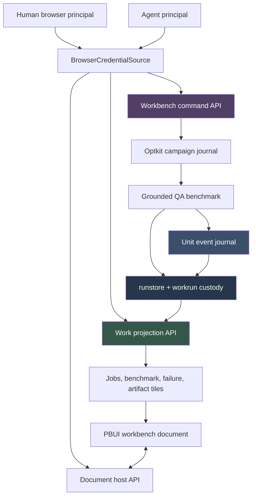
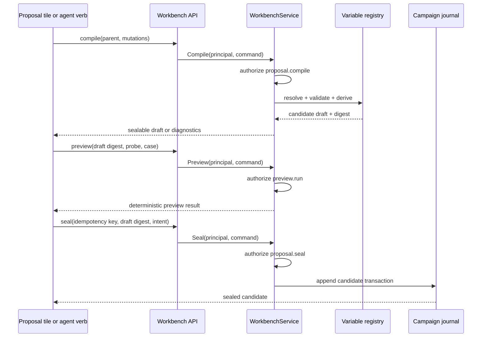

# RAG-TTC PR #8: Building an Authorized, Durable RAG Experiment Workbench

Pull request #8 turned RAG-TTC from a collection of experiment commands and stored artifacts into an operational workbench for designing, running, supervising, and interpreting retrieval-augmented generation experiments. The merged change is substantial: 155 commits, 356 files, 50,164 additions, and 347 deletions. Its size reflects the number of contracts it had to make explicit. The workbench needed persistent UI documents, reproducible proposal compilation, durable run custody, live answer and judge progress, restricted artifact access, human and agent identities, and browser transports that preserve authority across every request.

The central engineering result is not the React interface by itself. It is a complete path from an immutable experiment input to a durable run, from that run to bounded read projections, and from those projections to a persistent interactive workspace. The browser does not inspect arbitrary files or reconstruct domain truth. It consumes typed APIs. The backend does not treat progress as transient logging. It records transitions and samples under a durable run contract. Authorization does not stop at token validation. It retains the principal until the protected effect is admitted.

> [!summary]
> - The workbench is a persistent PBUI document containing workspaces, application tiles, bindings, findings, drafts, and conversation pointers. Local storage is a cache; the authenticated Go document host is authoritative when available.
> - Durable work is represented by runstore custody plus `workrun` progress records. The read API projects bounded job summaries, phase history, rates, ETA, failures, benchmark units, and restricted artifacts without giving the browser filesystem access.
> - The grounded-answer benchmark runs the real customer answer path against immutable index bundles, admits spend before provider calls, pipelines answering and judging, journals every unit transition, and preserves completed evidence after cancellation.
> - Human and agent credentials map to different principals and action grants. Restricted artifacts and proposal sealing require explicit authorization at the effect boundary.
> - The final review pass fixed cross-generation PUT completion, stale refresh rollback, principal-stale RTK Query caches, fail-open error projection, retry ceiling undercounting, cancellation-unsafe finalization, and generated logger drift.

## 1. What the project needed to become

RAG experimentation produces more than a final score. A useful run has input identity, configuration identity, execution progress, provider spend, failures, per-question answers, judge outcomes, and enough retrieval evidence to explain why a result changed. Before this work, many of those values existed, but they were distributed across commands, artifacts, and specialized code paths. An operator could run experiments, but the system did not yet provide one coherent environment for answering the following questions:

- Which corpus, index bundle, tool configuration, model, and judge protocol produced this result?
- What work is active now, and which phase is making progress?
- Which question failed, at which stage, and what completed before the failure?
- Can an agent prepare a proposal without receiving the human authority required to seal it?
- Can a human open the exact sealed answer and judge rationale associated with one benchmark unit?
- If the browser restarts or another browser edits the workspace, which document revision is authoritative?
- If execution is canceled, are completed paid results still written and discoverable?

PR #8 answers these questions by introducing explicit boundaries. Each boundary has one owner and one data contract:

| Boundary | Owner | Contract |
| --- | --- | --- |
| Workbench document state | PBUI workbench + Go document host | Versioned snapshot with optimistic revision precondition |
| Proposal operations | `experimentworkbench.WorkbenchService` | Catalog, compile, preview, and seal commands |
| Run custody | `runstore` + `pkg/ttc/workrun` | Manifest, progress snapshot, samples, events, failures, outputs |
| Benchmark unit truth | `groundedqa.Journal` | Append-only unit transition events and rebuildable snapshots |
| Read-side work views | `pkg/ttc/workapi` | Bounded typed projections with explicit optionality |
| Authentication mechanics | `pkg/ttc/accesscontrol` | Credential-to-principal resolution |
| Product policy | `optkitrag/policy.go` | Principal-to-action grants |
| Browser credential transport | `BrowserCredentialSource` | Current token, notifications, bearer header application |

This separation matters because the system has different kinds of truth. A workbench layout is mutable collaborative UI state. A run manifest is immutable custody metadata. A unit journal is durable execution history. A work API response is a derived view. A bearer token is a credential, while a principal grant is policy. Treating these values as interchangeable would make restart, authorization, and debugging behavior depend on incidental implementation details.

## 2. The merged architecture

The system can be read as four connected planes: authoring, execution, projection, and supervision. Authority crosses all four, but each plane owns a different part of the work.



The important direction is from durable domain state toward browser projection. The browser may initiate commands and persist workspace documents, but it does not become the owner of benchmark truth. The benchmark writes run artifacts. The projector reads them. The UI renders the projector's typed result. This direction makes CLI, HTTP, and browser views agree because they derive from the same stored records.

The architecture also separates two write protocols:

1. **Workbench document writes** use optimistic snapshot replacement. The browser sends the entire PBUI document with the last observed revision.
2. **Experiment writes** use domain commands, journals, and artifact stores. Proposal sealing, run progress, unit transitions, and benchmark outputs are not encoded as arbitrary UI document edits.

This distinction prevents a layout snapshot from becoming a substitute transaction mechanism for experiment state.

## 3. The workbench is a persistent document, not a page assembly

The frontend is built around `@hyperslop-systems/pbui-workbench`. Its durable object is the workbench document. That document contains workspaces, tile placements, application bindings, and document-bound product objects. React components are renderers over this state rather than the primary owner of it.

The default document declares multiple task-oriented workspaces:

- **Evidence** contains campaigns, inspection, watch, and trace surfaces.
- **Explore** contains query execution and retrieval trails.
- **Material** contains corpus, document, and chunk-split inspection.
- **Results** contains evaluation results, comparisons, and findings.

The document identifier remains `ragttc-workbench` even though the document contains several workspace identifiers. This is not cosmetic. The host path and synchronization protocol identify the full document by that stable ID. An earlier implementation allowed the workspace helper to mint a new document ID, and every synchronization PUT then failed with `id_mismatch`.

The current composition in `apps/workbench/web/src/workbench.ts` is explicit:

```ts
export const workbench = createWorkbench({
  apps: [
    ...createChatApps(chat).filter((app) => app.id === "chat" || app.id === "widget"),
    ...createConversationApps(chat),
    ...createWorkbenchApps(),
  ],
  initial: parseDocument(storage()?.getItem(WORKBENCH_STORAGE_KEY)) ?? defaultLayout(),
  onMutate: () => {
    storage()?.setItem(WORKBENCH_STORAGE_KEY, workbench.serialize());
    documentSync.push();
  },
  onRejected: (_mutations, error) => {
    console.warn(`layout change refused: ${error.code} at ${error.path} — ${error.detail}`);
  },
});
```

This code establishes three invariants.

First, PBUI validation applies before a mutation becomes durable state. Duplicate singleton tiles, missing bindings, and invalid layout plans are rejected by the workbench kernel.

Second, local storage is updated after each committed batch. It supports immediate startup and host-absent operation, but it is not a merge log.

Third, the same committed batch schedules a snapshot PUT to the Go host. When authentication or host availability returns and a valid server document already exists, the server document wins. This strict server-wins rule is visible in the status strip. Preserving disconnected local edits across an existing server revision would require a different protocol with base revisions and user-visible conflict resolution.

### 3.1 Applications are registered capabilities

The workbench app registry includes campaign, proposal, preview, results, comparison, finding, job, benchmark, failure, corpus, document, split, ask, trail, and settings surfaces. Each app declares whether it is singleton or document-bound, what bindings it requires, and how it appears in launcher vocabulary.

For example, `TrailApp` is document-bound and requires an explore binding, while `JobsApp` is singleton and reads current work projections. This registry gives PBUI enough information to validate placements and to let human and agent actions refer to product objects consistently.

The system therefore distinguishes:

- a React component, which renders a view;
- an app descriptor, which defines placement and binding rules;
- a PBUI document, which stores an instance and its bindings;
- a presentation reference, which identifies a product object for menus, verbs, chat, and inspection.

That vocabulary supports a shared action path. A human menu click and an agent-produced verb both enter the same router, validation, attribution, and sink logic. Dangerous agent actions do not bypass the product path; they park as one-shot approval requests for a human principal.

## 4. Proposal authoring preserves purity until sealing

The proposal subsystem is deliberately split into catalog read, compile, preview, and seal operations. Compilation is pure with respect to campaign state. It resolves a parent configuration, applies requested mutations, computes derived values, and returns a draft with diagnostics and a digest. Preview runs a supported probe against the compiled draft. Seal is the first operation that creates durable campaign state.

This order allows the browser and an agent to inspect and revise a proposal without consuming campaign identity or creating half-valid candidates.



The service retains the authenticated principal through authorization. It also derives human proposer identity from that principal rather than trusting an identity supplied in JSON. A non-human proposer can retain authored provenance, but sealing occurs through an approving principal that actually holds the seal grant.

The distinction can be seen in product policy:

```go
func humanActions() []accesscontrol.Action {
    return []accesscontrol.Action{
        experimentworkbench.ActionCatalogRead,
        experimentworkbench.ActionProposalCompile,
        experimentworkbench.ActionPreviewRun,
        experimentworkbench.ActionProposalSeal,
        experimentworkbench.ActionArtifactReadRestricted,
        experimentworkbench.ActionArtifactWriteRestricted,
    }
}

func agentActions() []accesscontrol.Action {
    return []accesscontrol.Action{
        experimentworkbench.ActionCatalogRead,
        experimentworkbench.ActionProposalCompile,
        experimentworkbench.ActionPreviewRun,
    }
}
```

The agent can inspect the catalog, compile mutations, and run previews. It cannot seal or read restricted answer and judge bodies. The user interface may expose a requested action, but the server remains the authority that admits the effect.

## 5. Durable work turns execution into inspectable state

Long-running index builds and benchmarks need more than terminal output. They need restart-stable identity and enough historical data to reconstruct what happened. PR #8 introduced `pkg/ttc/workrun` as a concurrent-safe progress recorder over `runstore`.

A work run records:

- immutable run identity and inputs;
- ordered phase names and per-phase state;
- latest progress snapshot;
- cumulative historical samples;
- exact failure records;
- terminal outputs and summary;
- active, complete, or failed status.

The recorder is a single writer from the perspective of durable progress. Callers may update it concurrently, but it serializes state, marks dirty snapshots, periodically flushes, and immediately flushes important transitions. It also implements the Flowkit ledger interface so existing orchestration can report progress without creating a second progress model.

The initial design used one `CurrentPhase`, which is correct for a serial build. The live QA pipeline later needed answering and judging to overlap. Instead of discarding the phase contract, the recorder gained explicit overlapping-phase operations. Read-side projections derive active phases from each phase's state, while serial jobs retain the simpler current-phase field.

This is a useful example of extending a contract without weakening its existing invariants. Serial phases still reject illegal overlap. Pipeline phases opt into overlap through a different method.

### 5.1 Persist cumulative measurements; derive rates later

The recorder stores cumulative completed counts and timestamps. The work API computes trailing rates, ETA, staleness, and projected spend as read-side values. This avoids persisting transient calculations whose meaning depends on the observation window and current time.

For a cumulative sample sequence `(t_i, done_i)`, a trailing rate over a selected window is derived as:

```text
rate = (done_last - done_first) / (t_last - t_first)
```

ETA exists only when total is known, work remains, and the derived rate is positive:

```text
eta = (total - done) / rate
```

The API preserves absence. Unknown totals, unavailable rates, and undefined ETA values are omitted rather than encoded as zero. Zero is a measurement; absence means the system cannot make the claim.

## 6. The work API is a bounded projection boundary

`pkg/ttc/workapi` discovers validated runs under a configured root and projects them into typed HTTP and CLI views. It does not return arbitrary paths or expose generic file reads. List limits, sample limits, cursors, safe job IDs, and known artifact kinds bound every read.

The projection path is:

```text
runstore files
  -> validated run reader
  -> workrun progress + samples + failures
  -> workapi typed view
  -> CLI rows or JSON HTTP response
  -> React query hooks
```

The `Projector` sorts jobs by durable update time, applies filters, encodes pagination cursors, and isolates malformed runs as diagnostics instead of allowing one invalid directory to erase the entire list. Job detail returns input digests, phase views, outputs, errors, and capabilities. Benchmark routes add recent units, distributions, unit detail, and explicit artifact reads.

This boundary became a security boundary when sealed answers and judge reports were exposed. Metadata can be visible to an agent while restricted bodies remain unavailable. The handler now authenticates to a principal, checks `ActionArtifactReadRestricted`, and only then calls the artifact projector. Denial-before-projection tests ensure authorization cannot be added after the sensitive read has already occurred.

## 7. The grounded-answer benchmark runs the product path

The benchmark does not call a simplified answering helper. It runs the same customer answer service used by the product, with a real immutable index bundle and the same tool configuration, model identity, output contract, and retrieval tools. This decision makes a benchmark result a measurement of product behavior rather than a measurement of a similar component.

The plan freezes identities before spend:

- bundle ID and corpus digest;
- tool configuration digest;
- orchestration prompt digest;
- output schema digest;
- question suite digest;
- answer, embedding, and judge model identities;
- judge contract and protocol digests;
- selected case IDs;
- worst-case answer, search, and judge calls;
- configured budgets.

The final ceiling calculation includes answer retries:

```go
answerAttempts := config.answerAttempts()
plan.MaxAnswerProviderCalls =
    len(selected) * answerAttempts * loaded.Config.Loop.MaxProviderCalls
plan.MaxSearchCalls =
    len(selected) * answerAttempts * loaded.Config.Loop.MaxProviderCalls
plan.MaxJudgeCalls =
    len(selected) * judgeStepsPerCase * protocolDocument.Protocol.Retry.MaximumAttempts
```

A plan with three cases, two answer attempts, and four loop calls requires an answer budget of at least 24 calls. The implementation also reserves the exact next provider call before provider contact. The plan proves the configured worst case is admissible; runtime admission prevents concurrent workers and retries from crossing the hard ceiling.

### 7.1 Unit state is journaled before publication

Each selected case becomes a benchmark unit with a validated lifecycle. The journal is the only durable transition writer. It validates a requested transition, appends the event to disk, and only then folds it into the in-memory projection.

```go
if err := journal.appender.AppendJSONL(ctx, UnitEventsPath, event); err != nil {
    return UnitEvent{}, fmt.Errorf("append unit event: %w", err)
}

// Only after persistence succeeds:
journal.sequence = event.Sequence
journal.apply(event)
```

This ordering establishes a strong invariant: in-memory state is never ahead of the durable event stream. A process crash can leave disk ahead of an unobserved in-memory update, which is recoverable by replay. It cannot leave memory claiming a transition that was never written.

The lifecycle distinguishes answer and judge outcomes:

```text
queued
  -> answering(attempt N)
  -> answer_ready(sealed-answer ref)
  -> judging(attempt N)
  -> complete(judge-outcome ref)
```

Failure states remain stage-specific:

```text
answering -> answer_failed
judging   -> judge_failed
pending   -> canceled
```

Counts such as queued, answering, answer-ready, judging, complete, failed, and canceled are derived from current unit snapshots. They are not independent mutable counters.

### 7.2 Answer and judge lanes overlap

The pipeline uses bounded answer workers and judge workers. Once an answer is sealed, its unit can enter the judge lane while other units are still answering. This reduces total run latency while preserving artifact ordering:

1. Answer execution completes.
2. The sealed answer is written durably.
3. The unit journal appends `answer_ready` with the artifact reference.
4. The unit enters the judge queue.
5. Judge output is written durably.
6. The journal appends `complete` with the judge reference.

“Persist before publish” is the controlling rule. A queue item or event must not advertise an artifact that does not yet exist.

### 7.3 Cancellation stops execution, not custody

The benchmark has two context requirements. Provider and judge execution must stop when the caller cancels. Final custody must still write completed records and mark unfinished units honestly. The implementation creates a persistence context after workers and judges have joined:

```go
persist := context.WithoutCancel(ctx)

if err := pipe.cancelPending(persist); err != nil {
    return RunResult{}, err
}
for _, record := range completedRecords {
    if err := run.AppendJSONL(persist, "results/per-question.jsonl", record); err != nil {
        return RunResult{}, err
    }
}
if err := run.WriteJSON(persist, "results/benchmark-summary.json", summary); err != nil {
    return RunResult{}, err
}
```

All subsequent projection writes and recorder transitions use `persist`. Cancellation therefore has a precise meaning: no new paid execution begins, completed work remains durable, pending units become canceled, and the run becomes failed with an explicit cancellation reason.

## 8. The UI renders backend truth without recomputing it

The React workbench gained jobs, job detail, benchmark detail, recent units, failure lanes, histograms, artifact panels, and grammar-generated progress sparklines. These surfaces consume Go-produced fixtures and typed TypeScript contracts.

The frontend does not recompute sensitive domain values that the backend already owns:

- Histogram buckets come from the backend; the frontend renders them.
- Phase status and active lanes come from the work projection.
- Failure stage and artifact references come from unit records.
- Rates, ETA, staleness, and projected spend come from the API.
- Exact progress text remains adjacent to compact graphics, so accessibility and operator truth do not depend on visual inference.

The plotting work is especially deliberate. Durable samples are projected into explicit phase and gap segments before they enter the canonical plotting grammar. The plot is a compact representation of a typed sample history, not a second source of progress semantics.

The unit artifact UI also uses explicit-open behavior. A unit view can show that a sealed answer or judge report exists without automatically fetching its restricted body. Opening the artifact causes a separately authorized request. This keeps metadata discovery distinct from sensitive-content access.

## 9. Authentication and authorization remain separate operations

The final access-control cutover created a small local package rather than a generic roles framework. `pkg/ttc/accesscontrol` owns shared mechanics:

```go
type Principal struct {
    Actor record.ActorRef `json:"actor"`
}

type Authenticator interface {
    Authenticate(*http.Request) (Principal, error)
}

type Authorizer interface {
    Check(context.Context, Principal, Action, Resource) error
}
```

Applications define action constants and grants. This division keeps the kernel free of proposal, artifact, campaign, chat, or approval semantics.

The credential and policy configurations are separate:

```text
BearerCredential: token -> principal
PrincipalGrant:   principal -> actions
```

That separation permits credential rotation without changing policy and policy changes without changing secrets. It also prevents a common collapse where a valid token is treated as sufficient authority for every protected effect.

### 9.1 Fail closed at HTTP adapters

Only recognized unauthenticated and forbidden access errors have public wire semantics. An unknown access code or authenticator backend error becomes a generic `internal_error` response. Its internal message and wrapped cause do not cross the HTTP boundary.

The work API also distinguishes:

- known unauthenticated failure: HTTP 401 with `WWW-Authenticate`;
- known forbidden failure: HTTP 403;
- unknown authenticator or access failure: safe HTTP 500.

This preserves useful client semantics without exposing credential backend details.

## 10. Browser credentials are a transport concern and a cache boundary

The browser has one credential source. Redux projects its current token for UI state, but transports read directly from `BrowserCredentialSource`. RTK Query, document fetches, snapshot PUT, and fetch-based SSE all apply the same bearer credential.

Native `EventSource` was removed because it cannot attach the required `Authorization` header. The replacement uses authenticated `fetch`, parses the server's SSE subset, reconnects with a bounded delay, and aborts on credential changes.

Credential changes also invalidate protected caches:

```ts
workbenchCredentials.subscribe(() => {
  store.dispatch(workApi.util.resetApiState());
  store.dispatch(workbenchApi.util.resetApiState());
  store.dispatch(authActions.setToken(workbenchCredentials.getToken()));
});
```

RTK Query keys do not contain bearer identity. Without this reset, a human-only sealed answer could remain rendered after switching to an agent token, and a cached 401 could remain after entering a valid token. Cache eviction occurs synchronously before Redux projects the new identity state.

## 11. Synchronization correctness requires two kinds of staleness checks

The document synchronization client has a generation counter and a server revision. They solve different problems.

- **Generation** identifies one credential lifecycle. A token change aborts the old controller and starts a new generation.
- **Revision** orders server document versions within a generation.

A snapshot PUT captures its generation and abort controller. Its completion checks both before changing state. The in-flight marker records its owning generation, so an old `finally` block cannot clear a newer request's state.

```ts
const flush = async (expected: number) => {
  const activeController = controller;
  if (!current(expected) || !activeController || inflightGeneration === expected) return;

  inflightGeneration = expected;
  try {
    const response = await authenticatedFetch(url, {
      method: "PUT",
      signal: activeController.signal,
      headers: { "X-Workbench-Revision": String(revision) },
      body: snapshotBody(),
    }, credentials);

    if (!current(expected) || activeController.signal.aborted) return;
    // apply only this generation's response
  } finally {
    if (inflightGeneration === expected) inflightGeneration = null;
  }
};
```

Generation checks alone do not order concurrent refresh GETs issued from two SSE events. Revision 7 can complete before revision 6 inside the same generation. Refresh adoption therefore requires a finite remote revision strictly greater than the current revision:

```ts
const remoteRevision = Number(payload.revision ?? 0);
if (!Number.isFinite(remoteRevision) || remoteRevision <= revision) return;
adopt(payload);
```

The tests force both races directly. One delayed old PUT attempts to change the next revision from 10 back to 6. Another delayed refresh completes revision 6 after revision 7. Both stale completions are ignored.

## 12. Review findings changed the architecture, not only individual lines

The implementation diaries record several defects found during live smoke and automated review. They are valuable because each one identifies a boundary whose contract was initially incomplete.

| Finding | Initial failure | Final invariant |
| --- | --- | --- |
| Document routes lacked authentication | Anonymous callers could read or replace workbench documents | Every document route is under shared authentication-only middleware |
| Answer budget was post-hoc | Concurrent provider calls could exceed the hard ceiling | Exact next-call admission occurs before provider contact |
| Comparison trails lost bundle identity | Right-lane hits opened first-lane retrieval stages | Hit references retain bundle identity |
| Document memory advanced before disk | Failed persistence left an undurable in-memory revision | Candidate persists atomically before publication |
| Restricted artifacts checked only authentication | Agent token could read sealed answers and judge evidence | Principal and restricted-read action are checked before projection |
| Document sync sent no bearer credential | Protected host forced the browser into local-only behavior | All fetch and SSE transports use one credential source |
| Snapshot PUT completion crossed token generations | Old response replaced revision learned under a new token | Generation and abort checks guard response and cleanup |
| Concurrent refreshes rolled revision backward | Delayed revision 6 replaced revision 7 | Refresh adoption is strictly monotonic |
| Protected query cache survived token change | Human artifact could render under agent/no token | Protected API caches reset on every credential transition |
| Unknown access errors leaked messages | Backend detail appeared in public HTTP 500 | Adapters allowlist known public codes and otherwise fail closed |
| Retry ceilings omitted answer attempts | Plan advertised one loop per case despite configured retries | Ceiling multiplies cases × attempts × loop calls |
| Cancellation reused canceled context for custody | Summary and result files could disappear after paid work | Post-worker writes use `context.WithoutCancel` |
| Generated logger drift reached CI | New package lacked current `logcopter.go` | Lefthook pre-commit/pre-push runs `make logcopter-check` |

These corrections point to one general rule: a value that proves correctness must remain explicit until the exact effect that depends on it. The relevant values were principal, action, credential, generation, revision, spend reservation, artifact reference, and custody context. Reducing any of them to a boolean too early made later code unable to enforce the original contract.

The focused companion report [[PROJECT REPORT - RAG-TTC PR 8 - Explicit Context at Authorization Transport and Custody Boundaries]] develops that rule specifically for the second review round. The reusable authorization treatment is recorded in [[01 - Authentication Is Not Authorization - Preserve the Principal to the Effect Boundary]].

## 13. Testing strategy: deterministic matrices first, composed smoke second

The final system uses tests at several layers.

### Contract and domain tests

Go tests cover proposal compilation, authorization, run recording, work projection, unit transitions, benchmark planning, retries, failures, cancellation, artifacts, and path safety. TypeScript tests cover API fixture decoding, app vocabulary, PBUI verbs, cache invalidation, document synchronization, plotting, and accessibility-sensitive rendering.

### Adversarial interleavings

The highest-value synchronization tests control promise completion order rather than relying on timing:

- old PUT response after credential replacement;
- revision 7 refresh before delayed revision 6;
- token add, replacement, and removal with seeded protected caches;
- cancellation during a controlled provider call.

These tests reproduce the invalid state transition directly and assert the next effect, such as the revision header on a subsequent PUT.

### Generated and structural checks

The branch includes:

- `golangci-lint` and Glazed vet;
- `logcopter-gen -check` in CI and lefthook;
- Go race tests for concurrency-sensitive packages;
- a structural hard-cutover script that rejects legacy auth owners and native `EventSource` fallback;
- TypeScript typecheck, Vitest, and Vite production build.

At final review, the frontend suite passed 25 files and 167 tests. Full Go tests, vet, lint, selected race suites, production build, structural guard, and exact logcopter checks passed. All ten Codex review threads were answered with commit evidence and resolved before merge.

### Composed smoke

One real-server smoke checks composition without duplicating deterministic matrices. It starts the actual campaign server with temporary stores and distinct human and agent credentials, then verifies:

- command API: anonymous 401, human 200;
- document API: anonymous 401, authenticated 200;
- work API: challenged anonymous 401, authenticated typed availability response.

Detailed artifact policy remains in the deterministic fixture-backed 401/403/200 matrix. Building a new live benchmark fixture solely for smoke testing would duplicate setup without improving the policy proof.

## 14. Design decisions worth preserving

### Use a local access-control package before publishing a module

The shared contracts now have one repository owner, but there is no second repository proving that the exact principal, resource, static grant, and bearer APIs are stable. Keeping `pkg/ttc/accesscontrol` local avoids freezing an ecosystem API prematurely.

### Keep domain actions outside the kernel

`proposal.seal` and `artifact.read.restricted` belong to the product. The kernel validates action shape and checks grants; it does not define product vocabulary.

### Use filesystem custody before a job database

The runstore already owns immutable run identity and artifacts. `workrun` adds progress and failure contracts without introducing a second transactional database. The work API discovers and validates these runs, with bounded scanning and safe path handling.

### Persist transitions before publishing them

Unit events, document records, and artifacts become visible only after their durable write succeeds. This keeps replay and restart behavior stronger than in-memory observation.

### Derive read metrics instead of persisting them

Rates, ETA, staleness, and projected spend depend on current time and an observation window. Persist cumulative facts; derive temporal views.

### Run the product answer service in benchmarks

A benchmark that uses a simplified answer implementation can pass while the product fails. The bundle-backed benchmark uses the canonical customer service and freezes all identities that influence its behavior.

### Keep smoke testing narrow

Deterministic tests own concurrency and policy matrices. The live smoke verifies dependency composition and transport wiring once.

## 15. File map for future readers

### Workbench and proposal system

- `apps/workbench/web/src/workbench.ts` — PBUI document, workspaces, local persistence, host synchronization.
- `apps/workbench/web/src/apps/index.ts` — application registry and binding rules.
- `apps/workbench/web/src/chat/router.ts` — attributed verb routing.
- `apps/workbench/web/src/components/approvals.tsx` — one-shot agent danger-action approvals.
- `pkg/ttc/experimentworkbench/workbench_service.go` — catalog, compile, preview, seal, authorization, anti-impersonation.
- `pkg/ttc/workbenchapi/server.go` — command HTTP adapter and safe errors.
- `pkg/ttc/workbenchhost/` — persistent document store, revisions, atomic writes, SSE notifications.

### Durable work and projections

- `pkg/ttc/workrun/recorder.go` — concurrent-safe durable progress recorder.
- `pkg/ttc/workrun/types.go` — phase, sample, failure, and output contracts.
- `pkg/ttc/workapi/projector.go` — list/detail/sample/failure projections.
- `pkg/ttc/workapi/benchmark.go` — benchmark-specific unit and distribution views.
- `pkg/ttc/workapi/http.go` — authenticated and authorized work routes.
- `apps/workbench/web/src/api/work.ts` — TypeScript work API contract.
- `apps/workbench/web/src/apps/JobsApp.tsx` and `JobApp.tsx` — operator work views.

### Grounded QA benchmark

- `internal/benchmark/groundedqa/plan.go` — immutable identity and spend plan.
- `internal/benchmark/groundedqa/pipeline.go` — answer/judge coordinator and exact call admission.
- `internal/benchmark/groundedqa/journal.go` — durable unit lifecycle.
- `internal/benchmark/groundedqa/service.go` — run orchestration and custody finalization.
- `internal/benchmark/groundedqa/artifacts.go` — sealed answer and judge artifact paths.
- `apps/workbench/web/src/apps/BenchmarkPanel.tsx` — benchmark supervision UI.

### Authority and synchronization

- `pkg/ttc/accesscontrol/` — principals, actions, errors, static bearer authentication, grants, middleware.
- `cmd/rag-ttc/cmds/experiments/optkitrag/policy.go` — human and agent action sets.
- `apps/workbench/web/src/auth/credentials.ts` — authoritative browser credential source.
- `apps/workbench/web/src/store/store.ts` — Redux projection and protected cache eviction.
- `apps/workbench/web/src/sync.ts` — authenticated snapshot and SSE lifecycle.
- `apps/workbench/web/src/transport/sse.ts` — focused SSE parser.

### Investigation record

The merged PR contains ten ticket workspaces under `ttmp/2026/08/28`, `ttmp/2026/08/29`, and `ttmp/2026/09/01`. Their design documents and diaries explain durable builds, work projections, jobs UI, bundle-backed QA, live answer/judge publication, benchmark UI, restricted artifacts, rebalancing, grammar-generated plots, and the access-control hard cutover.

## 16. Operational entry points

The merged CLI exposes campaign serving and benchmark operations beneath the Optkit RAG experiment command group. The server entry point is:

```bash
rag-ttc experiment optkit-rag campaign serve \
  --listen 127.0.0.1:8090 \
  --store ./tmp/optkit-rag \
  --runs-root .cache/rag-ttc/benchmark-runs \
  --workbench-docs-store ./tmp/workbench-docs \
  --workbench-token "$WORKBENCH_TOKEN" \
  --agent-token "$AGENT_TOKEN"
```

The repository's important verification commands are:

```bash
GOWORK=off go test ./... -count=1
GOWORK=off go vet ./...
GOWORK=off golangci-lint run
make logcopter-check
GOWORK=off go tool logcopter-gen \
  -area-prefix the-tree-center.rag-ttc \
  -strip-prefix github.com/the-tree-center/rag-ttc \
  -check ./pkg/...

cd apps/workbench/web
npm run typecheck
npm test -- --run
npm run build
```

The same logcopter check now runs in lefthook before commits that stage Go files and before every push.

## 17. What the project now provides

After merge, RAG-TTC has a coherent experiment operating surface:

- Humans and agents can inspect the same workbench vocabulary while receiving different grants.
- Proposal drafts are pure, digest-bound, previewable, and idempotently sealable.
- Workbench layout and product documents persist through an authenticated revision protocol.
- Index builds and QA benchmarks expose durable phase history, failures, spend, and outputs.
- Grounded-answer benchmarks freeze product identities before spend and run the real answer path.
- Answer and judge lanes publish durable unit transitions and artifacts incrementally.
- Operators can inspect jobs, progress, failure stages, distributions, units, sealed answers, and judge rationales through bounded APIs.
- Restricted bodies require explicit authorization, while metadata can remain broadly useful.
- Cancellation stops execution without deleting custody evidence.
- Browser token transitions invalidate protected caches and restart authenticated synchronization safely.

The project is complete at merged head `781c1c135`, merge commit `37e9e9e797fc9842912198af4a05003b0dfc7616`. The remaining work is not required to make the merged architecture correct. Potential future work includes server-driven UI capability discovery, a deliberate disconnected-edit reconciliation design, independent search-call budgeting if accounting requires it, and performance-oriented refresh coalescing. Each should begin from a concrete product requirement rather than being added as generalized infrastructure.

## 18. Working rules derived from the project

> [!important]
> Preserve the value that establishes correctness until the exact effect boundary that consumes it.

For this system, that rule expands into concrete engineering requirements:

- Retain the principal until authorization precedes the protected read or write.
- Retain the bearer credential through every HTTP and SSE transport.
- Retain generation and revision ownership through every asynchronous completion and cleanup path.
- Reserve provider spend before the provider call.
- Persist an artifact before publishing its reference.
- Persist a lifecycle event before updating its projection.
- Stop execution with the caller's context, then finalize custody with an uncanceled context.
- Evict protected cache state before rendering a replacement principal.
- Generate and verify repository-owned code before remote CI has to report drift.

These rules explain why the final architecture survives restart, cancellation, credential replacement, concurrent refresh, and partial failure. They also provide the criteria for extending the workbench without weakening its existing contracts.
